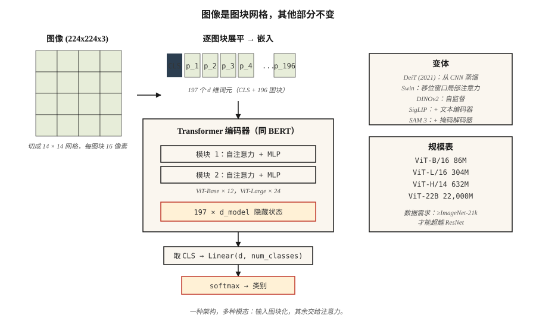

# 视觉 Transformer（Vision Transformers，ViT）

> 图像是图块的网格，句子是词元的网格，同一个 Transformer 都能处理。

**Type:** Build
**Languages:** Python
**Prerequisites:** 阶段 7 · 05（完整 Transformer），阶段 4 · 03（卷积神经网络），阶段 4 · 14（视觉 Transformer 入门）
**Time:** ~45 分钟

## 问题（The Problem）

2020 年以前，计算机视觉意味着卷积。ImageNet、COCO 和检测基准上的最先进模型都用卷积神经网络（Convolutional Neural Network，CNN）骨干，Transformer 则用于语言。

Dosovitskiy 等（2020）的《一张图像值 16x16 个词》（An Image is Worth 16x16 Words）表明可以完全去掉卷积：把图像切成固定大小图块，将每个图块线性投影为嵌入，再把序列输入标准 Transformer 编码器。规模足够大时，例如在 ImageNet-21k 或更大数据集预训练，ViT 能匹敌或超越基于 ResNet 的模型。

ViT 开启了 2026 年更广泛的模式：一种架构，多种模态。Whisper 将音频词元化，ViT 将图像词元化；机器人使用动作词元，视频使用像素词元。Transformer 并不在意，给它序列，它就学习。

到 2026 年，ViT 及其后继（DeiT、Swin、DINOv2、ViT-22B、SAM 3）占据大多数视觉领域。CNN 在边缘设备和延迟敏感任务上仍胜出，其他场景的技术栈里总有 ViT。

## 概念（The Concept）



### 第 1 步：图块化（Step 1 — patchify）

将 `H × W × C` 图像拆成 `N × (P·P·C)` 的展平图块序列。典型配置：`224 × 224` 图像、`16 × 16` 图块，得到 196 个图块，每块 768 个值。

```
图像 (224, 224, 3) → 14 × 14 网格，每图块 16x16x3 → 196 个长度 768 的向量
```

图块大小是调节杠杆。更小的图块意味着更多词元、更高分辨率，以及二次注意力成本；更大的图块则更粗糙、更便宜。

### 第 2 步：线性嵌入（Step 2 — linear embedding）

一个可学习矩阵将各展平图块投影到 `d_model`。它等价于卷积核大小为 `P`、步幅为 `P` 的卷积。PyTorch 中直接是 `nn.Conv2d(C, d_model, kernel_size=P, stride=P)`，两行即可实现。

### 第 3 步：前置 `[CLS]` 词元并添加位置嵌入（Step 3 — prepend CLS token, add positional embeddings）

- 前置一个可学习的 `[CLS]` 词元，其最终隐藏状态是用于分类的图像表示。
- 添加可学习位置嵌入（原始 ViT）或二维正弦编码（后续变体）。
- 2024 年后，RoPE 扩展到二维位置，有时不再使用显式嵌入。

### 第 4 步：标准 Transformer 编码器（Step 4 — standard transformer encoder）

堆叠 L 个 `LayerNorm → Self-Attention → + → LayerNorm → MLP → +` 模块，与 BERT 完全相同，没有视觉专用层。这是论文最有启发性的结论。

### 第 5 步：输出头（Step 5 — head）

分类时取 `[CLS]` 隐藏状态 → 线性层 → softmax。DINOv2 或 SAM 则丢弃 `[CLS]`，直接使用图块嵌入。

### 重要变体（Variants that mattered）

| 模型 | 年份 | 变化 |
|-------|------|--------|
| ViT | 2020 | 原始方案，固定图块大小，完整全局注意力。 |
| DeiT | 2021 | 蒸馏，可仅在 ImageNet-1k 上训练。 |
| Swin | 2021 | 带移位窗口的分层结构，固定的次二次成本。 |
| DINOv2 | 2023 | 自监督，无需标签，最佳通用视觉特征。 |
| ViT-22B | 2023 | 22B 参数，扩展定律适用。 |
| SigLIP | 2023 | ViT 与语言配对，使用 sigmoid 对比损失。 |
| SAM 3 | 2025 | 分割一切；ViT-Large 与可提示掩码解码器。 |

### 为什么花了些时间（Why it took a while）

ViT 需要*大量*数据才能匹敌 CNN，因为它没有 CNN 的归纳偏置（平移不变性、局部性）。如果没有 >100M 张标注图像或强大的自监督预训练，相同计算量下 CNN 仍胜出。DeiT 在 2021 年用蒸馏技巧解决了这一问题，DINOv2 在 2023 年用自监督将其彻底解决。

```figure
n5-patch-stream
```

## 动手实现（Build It）

参见 `code/main.py`。仅用标准库实现图块化、线性嵌入与合理性检查。不训练，任何实际规模的 ViT 都需要 PyTorch 和数小时 GPU 时间。

### 第 1 步：模拟图像（Step 1: fake image）

用 `(R, G, B)` 元组的行列表表示 24 × 24 RGB 图像。使用 6×6 图块，得到 16 个图块，每个 108 维嵌入向量。

### 第 2 步：图块化（Step 2: patchify）

```python
def patchify(image, P):
    H = len(image)
    W = len(image[0])
    patches = []
    for i in range(0, H, P):
        for j in range(0, W, P):
            patch = []
            for di in range(P):
                for dj in range(P):
                    patch.extend(image[i + di][j + dj])
            patches.append(patch)
    return patches
```

按光栅顺序遍历网格，即行优先。所有 ViT 都使用这一顺序。

### 第 3 步：线性嵌入（Step 3: linear embed）

将各展平图块乘以随机的 `(patch_flat_size, d_model)` 矩阵。验证前置 `[CLS]` 后输出形状为 `(N_patches + 1, d_model)`。

### 第 4 步：计算实际 ViT 的参数量（Step 4: count parameters for a realistic ViT）

打印 ViT-Base 参数量：12 层、12 头、d=768、patch=16。与 ResNet-50（约 25M）比较。ViT-Base 约 86M，ViT-Large 约 307M，ViT-Huge 约 632M。

## 实际应用（Use It）

```python
from transformers import ViTImageProcessor, ViTModel
import torch
from PIL import Image

processor = ViTImageProcessor.from_pretrained("google/vit-base-patch16-224-in21k")
model = ViTModel.from_pretrained("google/vit-base-patch16-224-in21k")

img = Image.open("cat.jpg")
inputs = processor(img, return_tensors="pt")
out = model(**inputs).last_hidden_state   # (1, 197, 768): [CLS] + 196 patches
cls_emb = out[:, 0]                       # image representation
```

**DINOv2 嵌入是 2026 年图像特征的默认方案。** 冻结骨干，训练微型输出头，适用于分类、检索、检测、图像描述。Meta 的 DINOv2 检查点在所有非文本视觉任务上优于 CLIP。

**选择图块大小。** 小模型用 16×16（ViT-B/16），稠密预测（分割）用 8×8 或 14×14（SAM、DINOv2），超大模型用 14×14。

## 交付成果（Ship It）

参见 `outputs/skill-vit-configurator.md`。该技能根据数据集大小、分辨率与计算预算，为新视觉任务选择 ViT 变体和图块大小。

## 练习（Exercises）

1. **简单。** 运行 `code/main.py`。验证图块数量等于 `(H/P) * (W/P)`，展平图块维度等于 `P*P*C`。
2. **中等。** 实现二维正弦位置嵌入，将每个图块 `row` 和 `col` 的独立正弦编码拼接。输入微型 PyTorch ViT，在 CIFAR-10 上与可学习位置嵌入比较准确率。
3. **困难。** 构建三层 ViT（PyTorch），使用 4×4 图块在 1,000 张 MNIST 图像上训练，测量测试准确率。再在同样 1,000 张图像上加入 DINOv2 预训练（简化为训练编码器从被遮蔽图块预测图块嵌入）。准确率是否提高？

## 关键术语（Key Terms）

| 术语 | 常见说法 | 实际含义 |
|------|-----------------|-----------------------|
| 图块（Patch） | “视觉 Transformer 的词元” | 图像中 `P × P × C` 区域像素值的展平向量。 |
| 图块化（Patchify） | “切开再展平” | 将图像切成不重叠图块，各自展平为向量。 |
| `[CLS]` 词元 | “图像摘要” | 前置的可学习词元，其最终嵌入就是图像表示。 |
| 归纳偏置（Inductive bias） | “模型的假设” | ViT 比 CNN 的先验更少，需要更多数据弥补差距。 |
| DINOv2 | “自监督 ViT” | 通过图像增强与动量教师无标签训练，提供 2026 年最佳通用图像特征。 |
| SigLIP | “CLIP 后继” | 用 sigmoid 对比损失训练 ViT 与文本编码器；相同计算量下优于 CLIP。 |
| Swin | “窗口化 ViT” | 带局部注意力与移位窗口的分层 ViT，复杂度低于二次。 |
| 寄存器词元（Register tokens） | “2023 年的技巧” | 少量额外可学习词元吸收注意力汇聚点，改善 DINOv2 特征。 |

## 延伸阅读（Further Reading）

- [Dosovitskiy 等（2020）：一张图像值 16x16 个词：大规模图像识别的 Transformer（An Image is Worth 16x16 Words: Transformers for Image Recognition at Scale）](https://arxiv.org/abs/2010.11929)：ViT 论文。
- [Touvron 等（2021）：训练数据高效的图像 Transformer 与基于注意力的蒸馏（Training data-efficient image transformers & distillation through attention）](https://arxiv.org/abs/2012.12877)：DeiT。
- [Liu 等（2021）：Swin Transformer：使用移位窗口的分层视觉 Transformer（Swin Transformer: Hierarchical Vision Transformer using Shifted Windows）](https://arxiv.org/abs/2103.14030)：Swin。
- [Oquab 等（2023）：DINOv2：无监督学习稳健视觉特征（DINOv2: Learning Robust Visual Features without Supervision）](https://arxiv.org/abs/2304.07193)：DINOv2。
- [Darcet 等（2023）：视觉 Transformer 需要寄存器（Vision Transformers Need Registers）](https://arxiv.org/abs/2309.16588)：DINOv2 的寄存器词元修复方案。
