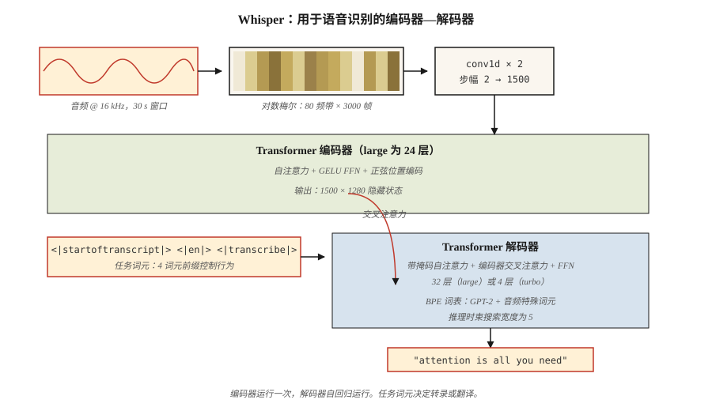

# 音频 Transformer：Whisper 架构（Audio Transformers — Whisper Architecture）

> 音频是频率随时间变化的图像。Whisper 就像读取梅尔频谱图并以文字回应的 ViT。

**Type:** Learn
**Languages:** Python
**Prerequisites:** 阶段 7 · 05（完整 Transformer），阶段 7 · 08（编码器—解码器），阶段 7 · 09（ViT）
**Time:** ~45 分钟

## 问题（The Problem）

Whisper（OpenAI，Radford 等，2022）之前，最先进的自动语音识别（Automatic Speech Recognition，ASR）意味着 wav2vec 2.0 和 HuBERT：自监督特征提取器加微调输出头。质量高，但数据流水线昂贵，对领域变化脆弱。多语言语音识别需要为各语系单独建模。

Whisper 作出三项选择：

1. **用所有数据训练。** 从互联网采集跨 97 种语言的 680,000 小时弱标注音频。不使用干净的学术语料，也不需要音素标签。
2. **单模型多任务。** 通过任务词元，联合训练一个解码器完成转录、翻译、语音活动检测、语言识别和时间戳标注。
3. **标准编码器—解码器 Transformer。** 编码器接收对数梅尔频谱图，解码器自回归生成文本词元。没有声码器，没有连接主义时序分类（Connectionist Temporal Classification，CTC），也没有隐马尔可夫模型（Hidden Markov Model，HMM）。

结果是 Whisper large-v3 对各种口音、噪声及完全没有干净标注数据的语言都很稳健。2026 年，它是所有开源语音助手及多数商业助手的默认语音前端。

## 概念（The Concept）



### 第 1 步：重采样与加窗（Step 1 — resample + window）

音频采样率 16 kHz，截断或填充到 30 秒。计算对数梅尔频谱图：80 个梅尔频带、10 ms 步幅，得到约 3,000 帧 × 80 特征。这就是 Whisper 看到的“输入图像”。

### 第 2 步：卷积前端（Step 2 — convolutional stem）

两个卷积核为 3、步幅为 2 的 Conv1D 层将 3,000 帧减少到 1,500。序列长度减半，参数增加不多。

### 第 3 步：编码器（Step 3 — encoder）

24 层（large 版本）Transformer 编码器处理 1,500 个时间步，使用正弦位置编码、自注意力和 GELU FFN，产生 1,500 × 1,280 隐藏状态。

### 第 4 步：解码器（Step 4 — decoder）

24 层 Transformer 解码器自回归输出词元。其字节对编码（Byte Pair Encoding，BPE）词表是 GPT-2 词表的超集，加入少量音频专用特殊词元。

### 第 5 步：任务词元（Step 5 — task tokens）

解码器提示词以控制词元开头，告诉模型要做什么：

```
<|startoftranscript|>  <|en|>  <|transcribe|>  <|0.00|>
```

或者：

```
<|startoftranscript|>  <|fr|>  <|translate|>   <|0.00|>
```

模型按这一约定训练，通过前缀控制任务。相当于 2026 年的指令微调，但应用于语音。

### 第 6 步：输出（Step 6 — output）

使用宽度 5 的束搜索及对数概率阈值。没有 `<|notimestamps|>` 词元时，按音频每 0.02 秒的粒度预测时间戳。

### Whisper 规模（Whisper sizes）

| 模型 | 参数 | 层数 | d_model | 头数 | 显存（fp16） |
|-------|--------|--------|---------|-------|-------------|
| Tiny | 39M | 4 | 384 | 6 | ~1 GB |
| Base | 74M | 6 | 512 | 8 | ~1 GB |
| Small | 244M | 12 | 768 | 12 | ~2 GB |
| Medium | 769M | 24 | 1024 | 16 | ~5 GB |
| Large | 1550M | 32 | 1280 | 20 | ~10 GB |
| Large-v3 | 1550M | 32 | 1280 | 20 | ~10 GB |
| Large-v3-turbo | 809M | 32 | 1280 | 20 | ~6 GB（4 层解码器） |

Large-v3-turbo（2024）将解码器从 32 层减至 4 层。解码快 8 倍，词错误率（Word Error Rate，WER）退化不足 1 点。这一速度提升使 Whisper-turbo 成为 2026 年实时语音智能体的默认方案。

### Whisper 不做什么（What Whisper does not do）

- 不做说话人分离（Diarization，即谁在说话），需要搭配 pyannote。
- 不原生支持实时流式处理，因为窗口固定为 30 秒。现代封装（`faster-whisper`、`WhisperX`）通过语音活动检测（Voice Activity Detection，VAD）与重叠窗口补上流式能力。
- 不借助外部分块就无法获得超过 30 秒的长上下文。实践中效果良好，因为转录人类语音很少需要长距离上下文。

### 2026 年格局（2026 landscape）

| 任务 | 模型 | 说明 |
|------|-------|-------|
| 英语 ASR | Whisper-turbo, Moonshine | Moonshine 在边缘设备快 4 倍 |
| 多语言 ASR | Whisper-large-v3 | 97 种语言 |
| 流式 ASR | faster-whisper + VAD | 可实现 150 ms 延迟目标 |
| 文本转语音（Text-to-Speech，TTS） | Piper, XTTS-v2, Kokoro | 编码器—解码器模式，形态类似 Whisper |
| 音频与语言 | AudioLM, SeamlessM4T | 同一 Transformer 中组合文本词元与音频词元 |

```figure
n5-mel-decode
```

## 动手实现（Build It）

参见 `code/main.py`。我们不训练 Whisper，而是构建对数梅尔频谱流水线与任务词元提示格式器。这些才是生产环境中你实际会接触的部分。

### 第 1 步：合成音频（Step 1: synthesize audio）

生成 1 秒、440 Hz 的正弦波，采样率 16 kHz，共 16,000 个样本。

### 第 2 步：简化对数梅尔频谱图（Step 2: log-mel spectrogram (simplified)）

完整梅尔频谱需要快速傅里叶变换（Fast Fourier Transform，FFT）。这里使用简化的分帧与逐帧能量版本，不依赖 `librosa` 即可展示流程：

```python
def frame_signal(x, frame_size=400, hop=160):
    frames = []
    for start in range(0, len(x) - frame_size + 1, hop):
        frames.append(x[start:start + frame_size])
    return frames
```

帧长 25 ms，帧移 10 ms，与 Whisper 加窗一致。教学上用逐帧能量代替梅尔频带。

### 第 3 步：填充到 30 秒（Step 3: pad to 30 s）

Whisper 始终处理 30 秒分块，将频谱图填充或截断到 3,000 帧。

### 第 4 步：构建提示词元（Step 4: build the prompt tokens）

```python
def whisper_prompt(lang="en", task="transcribe", timestamps=True):
    tokens = ["<|startoftranscript|>", f"<|{lang}|>", f"<|{task}|>"]
    if not timestamps:
        tokens.append("<|notimestamps|>")
    return tokens
```

这就是全部任务控制接口：4 个词元的前缀。

## 实际应用（Use It）

```python
import whisper
model = whisper.load_model("large-v3-turbo")
result = model.transcribe("meeting.wav", language="en", task="transcribe")
print(result["text"])
print(result["segments"][0]["start"], result["segments"][0]["end"])
```

更快且兼容 OpenAI 的版本：

```python
from faster_whisper import WhisperModel
model = WhisperModel("large-v3-turbo", compute_type="int8_float16")
segments, info = model.transcribe("meeting.wav", vad_filter=True)
for s in segments:
    print(f"{s.start:.2f} - {s.end:.2f}: {s.text}")
```

**2026 年何时选择 Whisper：**

- 单模型多语言 ASR。
- 对嘈杂、多样音频进行稳健转录。
- 研究/原型 ASR，最快的起点。

**何时选择其他方案：**

- 边缘端超低延迟流式处理：同等质量下 Moonshine 优于 Whisper。
- 需要 <200 ms 的实时对话 AI：使用专用流式 ASR。
- 说话人分离：Whisper 不支持，需要附加 pyannote。

## 交付成果（Ship It）

参见 `outputs/skill-asr-configurator.md`。该技能为新语音应用选择 ASR 模型、解码参数与预处理流水线。

## 练习（Exercises）

1. **简单。** 运行 `code/main.py`。确认 16 kHz、1 秒信号在 10 ms 帧移下约 100 帧；30 秒约 3,000 帧。
2. **中等。** 用 `numpy.fft` 构建完整对数梅尔频谱图。验证 80 个梅尔频带在数值误差内与 `librosa.feature.melspectrogram(n_mels=80)` 一致。
3. **困难。** 实现流式推理：音频按 10 秒窗口、2 秒重叠分块，逐块运行 Whisper，再合并转录。在 5 分钟播客样本上测量相对于单次处理的词错误率。

## 关键术语（Key Terms）

| 术语 | 常见说法 | 实际含义 |
|------|-----------------|-----------------------|
| 梅尔频谱图（Mel spectrogram） | “音频图像” | 二维表示：一轴为频带，另一轴为时间帧，每格是对数缩放的能量。 |
| 对数梅尔（Log-mel） | “Whisper 看到的内容” | 对梅尔频谱取对数，近似人类对响度的感知。 |
| 帧（Frame） | “一个时间切片” | 25 ms 样本窗口，以 10 ms 步幅重叠。 |
| 任务词元（Task token） | “语音的提示前缀” | 解码器提示词中的 `<\|transcribe\|>` / `<\|translate\|>` 等特殊词元。 |
| 语音活动检测（VAD） | “找到语音” | 在 ASR 前移除静音的门控，大幅降低成本。 |
| 连接主义时序分类（CTC） | “无需对齐的时序分类” | 用于免对齐训练的经典 ASR 损失；Whisper 不使用它。 |
| Whisper-turbo | “小解码器、完整编码器” | large-v3 编码器与 4 层解码器，解码快 8 倍。 |
| Faster-whisper | “生产封装” | 基于 CTranslate2 重新实现，支持 int8 量化，比 OpenAI 参考实现快 4 倍。 |

## 延伸阅读（Further Reading）

- [Radford 等（2022）：通过大规模弱监督实现稳健语音识别（Robust Speech Recognition via Large-Scale Weak Supervision）](https://arxiv.org/abs/2212.04356)：Whisper 论文。
- [OpenAI Whisper 仓库](https://github.com/openai/whisper)：参考代码与模型权重。阅读 `whisper/model.py`，约 400 行即可从头到尾了解 Conv1D 前端、编码器和解码器。
- [OpenAI Whisper：`whisper/decoding.py`](https://github.com/openai/whisper/blob/main/whisper/decoding.py)：第 5–6 步的束搜索与任务词元逻辑在此，500 行，可完整阅读。
- [Baevski 等（2020）：wav2vec 2.0：语音表示自监督学习框架（wav2vec 2.0: A Framework for Self-Supervised Learning of Speech Representations）](https://arxiv.org/abs/2006.11477)：前驱，在某些场景中仍提供最先进特征。
- [SYSTRAN/faster-whisper](https://github.com/SYSTRAN/faster-whisper)：生产封装，比参考实现快 4 倍。
- [Jia 等（2024）：Moonshine：面向实时转录与语音命令的语音识别（Moonshine: Speech Recognition for Live Transcription and Voice Commands）](https://arxiv.org/abs/2410.15608)：2024 年边缘友好的 ASR，形态类似 Whisper 但更小。
- [HuggingFace 博客：使用 Transformers 微调 Whisper 实现多语言 ASR（Fine-Tune Whisper For Multilingual ASR with Transformers）](https://huggingface.co/blog/fine-tune-whisper)：典型微调配方，包括梅尔频谱预处理器和词元时间戳处理。
- [HuggingFace 的 `modeling_whisper.py`](https://github.com/huggingface/transformers/blob/main/src/transformers/models/whisper/modeling_whisper.py)：完整实现（编码器、解码器、交叉注意力、生成），对应本课架构图。
