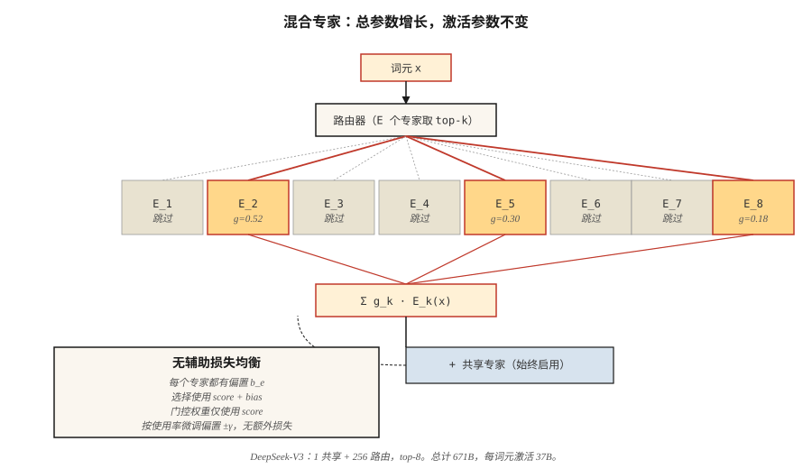

# 混合专家（Mixture of Experts，MoE）

> 稠密 70B Transformer 为每个词元激活所有参数；671B MoE 每词元仅激活 37B，却在各项基准测试上胜出。稀疏性是这十年最重要的扩展思想。

**Type:** Build
**Languages:** Python
**Prerequisites:** 阶段 7 · 05（完整 Transformer），阶段 7 · 07（GPT）
**Time:** ~45 分钟

## 问题（The Problem）

稠密 Transformer 推理浮点运算量等于参数量乘以 2（前向传播）。扩大稠密模型，每个词元都要支付全部成本。到 2024 年，前沿模型撞上计算墙：要明显变聪明，每词元 FLOPs 就必须指数增长。

混合专家打破这一关联。将每个 FFN 替换为 `E` 个独立专家，加一个为每词元选择 `k` 个专家的路由器。总参数 = `E × FFN_size`，每词元激活参数 = `k × FFN_size`。2026 年典型配置为 `E=256`、`k=8`。存储随 `E` 扩展，计算随 `k` 扩展。

2026 年前沿模型几乎全是 MoE：DeepSeek-V3（总计 671B / 激活 37B）、Mixtral 8×22B、Qwen2.5-MoE、Llama 4、Kimi K2、gpt-oss。Artificial Analysis 独立排行榜前 10 名开源模型全部是 MoE。

## 概念（The Concept）



### 替换 FFN（The FFN swap）

稠密 Transformer 模块：

```
h = x + attn(norm(x))
h = h + FFN(norm(h))
```

MoE 模块：

```
h = x + attn(norm(x))
scores = router(norm(h))              # (N_tokens, E)
top_k = argmax_k(scores)              # 每词元从 E 个专家中选择 k 个
h = h + sum_{e in top_k}(
        gate(scores[e]) * Expert_e(norm(h))
    )
```

每个专家是独立 FFN，通常为 SwiGLU。路由器是单个线性层。每个词元选择自己的 `k` 个专家，获得其输出的门控混合。

### 负载均衡问题（The load-balancing problem）

如果路由器把 90% 的词元送入专家 3，其他专家就会饥饿。已有三类尝试：

1. **辅助负载均衡损失（Auxiliary load-balancing loss）**（Switch Transformer、Mixtral）。添加与专家使用率方差成比例的惩罚。有效，但增加一个超参数和第二种梯度信号。
2. **专家容量与词元丢弃（Expert capacity + token dropping）**（早期 Switch）。每个专家最多处理 `C × N/E` 个词元，溢出词元跳过该层。损害质量。
3. **无辅助损失均衡（Auxiliary-loss-free balancing）**（DeepSeek-V3）。增加可学习的每专家偏置，改变路由器 top-k 选择。偏置在训练损失之外更新，不惩罚主目标，是 2024 年的重大突破。

DeepSeek-V3 的做法是：每个训练步骤后，检查各专家使用率高于还是低于目标，将偏置调整 `±γ`。选择使用 `scores + bias`，用于门控的专家概率仍使用不变的原始 `scores`。路由与表达由此解耦。

### 共享专家（Shared experts）

DeepSeek-V2/V3 还将专家分为*共享*与*路由*两类。每个词元经过所有共享专家，路由专家通过 top-k 选择。共享专家捕捉共同知识，路由专家专门化。V3 运行 1 个共享专家，加上 256 个路由专家中的前 8 个。

### 细粒度专家（Fine-grained experts）

经典 MoE（GShard、Switch）中，每个专家与完整 FFN 同宽。`E` 较小（8–64），`k` 较小（1–2）。

现代细粒度 MoE（DeepSeek-V3、Qwen-MoE）中，每个专家更窄，为 FFN 大小的 1/8。`E` 较大（256+），`k` 也更大（8+）。总参数相同，组合数却增长得更快，每词元有 `C(256, 8) = 400 trillion` 种可能的“专家”。质量提高，延迟不变。

### 成本概况（The cost profile）

每词元、每层：

| 配置 | 每词元激活参数 | 总参数 |
|--------|-----------------------|--------------|
| Mixtral 8×22B | ~39B | 141B |
| Llama 3 70B（稠密） | 70B | 70B |
| DeepSeek-V3 | 37B | 671B |
| Kimi K2（MoE） | ~32B | 1T |

DeepSeek-V3 在几乎所有基准测试上击败稠密 Llama 3 70B，同时**每词元实际激活 FLOPs 更少**。参数更多意味着知识更多，激活 FLOPs 更多意味着每词元计算更多。MoE 将两者解耦。

### 代价：内存（The catch: memory）

不管哪些专家激活，全部专家都驻留 GPU。671B 模型的 fp16 权重需要约 1.3 TB 显存。部署前沿 MoE 需要专家并行（Expert Parallelism）：将专家分片到多个 GPU，经网络路由词元。延迟由全互连（All-to-All）通信而非矩阵乘法主导。

```figure
expert-routing
```

## 动手实现（Build It）

参见 `code/main.py`。用纯标准库构建紧凑 MoE 层，包含：

- `n_experts=8` 个类 SwiGLU 专家（为演示，每个仅一层线性层）
- top-k=2 路由
- softmax 归一化门控权重
- 通过每专家偏置实现无辅助损失均衡

### 第 1 步：路由器（Step 1: the router）

```python
def route(hidden, W_router, top_k, bias):
    scores = [sum(h * w for h, w in zip(hidden, W_router[e])) for e in range(len(W_router))]
    biased = [s + b for s, b in zip(scores, bias)]
    top_idx = sorted(range(len(biased)), key=lambda i: -biased[i])[:top_k]
    # softmax over ORIGINAL scores of the chosen experts
    chosen = [scores[i] for i in top_idx]
    m = max(chosen)
    exps = [math.exp(c - m) for c in chosen]
    s = sum(exps)
    gates = [e / s for e in exps]
    return top_idx, gates
```

偏置影响选择，不影响门控权重。这就是 DeepSeek-V3 的技巧：偏置纠正负载不均，却不改变模型预测方向。

### 第 2 步：让 100 个词元通过路由器（Step 2: run 100 tokens through the router）

跟踪各专家激活频率。没有偏置时，使用率倾斜；加入偏置更新循环后（过度使用专家的偏置变化为 `-γ`，使用不足专家为 `+γ`），数次迭代内使用率收敛到均匀分布。

### 第 3 步：比较参数量（Step 3: param count comparison）

打印 MoE 配置的“稠密等效”参数量。仿 DeepSeek-V3：256 个路由专家、1 个共享专家、8 个激活专家，d_model=7168。总参数量惊人，激活数量是稠密 Llama 3 70B 的七分之一。

## 实际应用（Use It）

HuggingFace 加载方式：

```python
from transformers import AutoModelForCausalLM, AutoTokenizer
model = AutoModelForCausalLM.from_pretrained("mistralai/Mixtral-8x22B-v0.1")
```

2026 年生产推理中，vLLM 原生支持 MoE 路由，SGLang 提供最快的专家并行路径。两者均自动处理 top-k 选择与专家并行。

**何时选择 MoE：**
- 希望以更低每词元推理成本获得前沿质量。
- 有足够显存与专家并行基础设施。
- 工作负载侧重词元生成（聊天、代码），而非长上下文（长文档）。

**何时不选 MoE：**
- 边缘部署：不管激活多少 FLOPs，都要支付全部存储成本。
- 延迟关键的单用户服务：专家路由增加开销。
- 小模型（<7B）：MoE 的质量优势仅在超过约 6B 激活参数的计算阈值后出现。

## 交付成果（Ship It）

参见 `outputs/skill-moe-configurator.md`。该技能根据参数预算、训练词元与部署目标，为新 MoE 选择 E、k 和共享专家布局。

## 练习（Exercises）

1. **简单。** 运行 `code/main.py`，观察无辅助损失偏置更新如何在 50 次迭代中均衡专家使用率。
2. **中等。** 用基于哈希的路由器替换学习路由器（确定性、无需学习）。比较质量与均衡性。学习路由器为何更好？
3. **困难。** 实现组相对策略优化（Group Relative Policy Optimization，GRPO）式“轨迹匹配路由”（DeepSeek-V3.2 技巧）：记录推理时激活的专家，梯度计算时强制使用相同路由。在玩具策略梯度环境中测量影响。

## 关键术语（Key Terms）

| 术语 | 常见说法 | 实际含义 |
|------|-----------------|-----------------------|
| 专家（Expert） | “许多 FFN 之一” | 独立前馈网络，其参数专用于 FFN 计算的稀疏部分。 |
| 路由器（Router） | “门控” | 为每词元对各专家打分的小型线性层，再做 top-k 选择。 |
| Top-k 路由（Top-k routing） | “每词元 k 个激活专家” | 每词元的 FFN 计算恰好经过 k 个专家，按门控加权。 |
| 辅助损失（Auxiliary loss） | “负载均衡惩罚” | 惩罚专家使用率倾斜的额外损失项。 |
| 无辅助损失（Auxiliary-loss-free） | “DeepSeek-V3 的技巧” | 只在路由器选择上使用每专家偏置实现均衡，不增加梯度。 |
| 共享专家（Shared expert） | “始终启用” | 所有词元都经过的额外专家，用于捕捉共同知识。 |
| 专家并行（Expert parallelism） | “按专家分片” | 将不同专家分布到不同 GPU，经网络路由词元。 |
| 稀疏性（Sparsity） | “激活参数小于总参数” | 比值 `k × expert_size / (E × expert_size)`；DeepSeek-V3 为 37/671 ≈ 5.5%。 |

## 延伸阅读（Further Reading）

- [Shazeer 等（2017）：超大规模神经网络：稀疏门控混合专家层（Outrageously Large Neural Networks: The Sparsely-Gated Mixture-of-Experts Layer）](https://arxiv.org/abs/1701.06538)：思想起源。
- [Fedus、Zoph、Shazeer（2022）：Switch Transformer：用简单高效的稀疏性扩展至万亿参数模型（Switch Transformer: Scaling to Trillion Parameter Models with Simple and Efficient Sparsity）](https://arxiv.org/abs/2101.03961)：经典 MoE，Switch。
- [Jiang 等（2024）：Mixtral 专家混合（Mixtral of Experts）](https://arxiv.org/abs/2401.04088)：Mixtral 8×7B。
- [DeepSeek-AI（2024）：DeepSeek-V3 技术报告（DeepSeek-V3 Technical Report）](https://arxiv.org/abs/2412.19437)：MLA、无辅助损失 MoE 与多词元预测（Multi-Token Prediction，MTP）。
- [Wang 等（2024）：混合专家的无辅助损失负载均衡策略（Auxiliary-Loss-Free Load Balancing Strategy for Mixture-of-Experts）](https://arxiv.org/abs/2408.15664)：基于偏置的均衡论文。
- [Dai 等（2024）：DeepSeekMoE：迈向混合专家语言模型的极致专家专门化（DeepSeekMoE: Towards Ultimate Expert Specialization in Mixture-of-Experts Language Models）](https://arxiv.org/abs/2401.06066)：本课路由器使用的细粒度与共享专家划分。
- [Kim 等（2022）：DeepSpeed-MoE：推进混合专家推理与训练（DeepSpeed-MoE: Advancing Mixture-of-Experts Inference and Training）](https://arxiv.org/abs/2201.05596)：原始共享专家论文。
