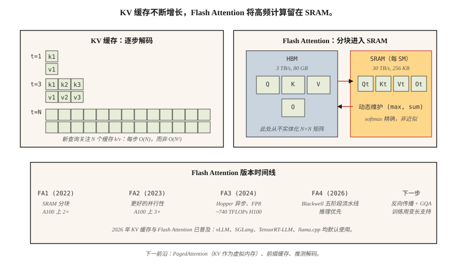

# 键值缓存、Flash Attention 与推理优化（KV Cache, Flash Attention & Inference Optimization）

> 训练是并行的，受浮点计算限制；推理是串行的，受内存限制。瓶颈不同，技巧也不同。

**Type:** Build
**Languages:** Python
**Prerequisites:** 阶段 7 · 02（自注意力），阶段 7 · 05（完整 Transformer），阶段 7 · 07（GPT）
**Time:** ~75 分钟

## 问题（The Problem）

朴素自回归解码器生成 `N` 个词元需要 `O(N²)` 工作量，每步都对完整前缀重算注意力。4K 词元响应需要 16M 次注意力操作，大部分冗余。前缀词元的每个隐藏状态一旦算出就确定了，只需用新词元查询对之前所有缓存的键和值计算注意力。

此外，注意力本身搬运大量数据。标准注意力实体化 N×N 分数矩阵、N×d softmax 输出、N×d 最终输出，对高带宽内存（High Bandwidth Memory，HBM）的读写过多。N≥2K 时，注意力先受内存限制，再受 FLOPs 限制。经典注意力内核对现代 GPU 的利用率比可实现水平低 4–10 倍。

两项均来自 Dao 等人的优化，将前沿推理从“慢”变成“快”：

1. **键值缓存（Key-Value Cache，KV Cache）。** 保存每个前缀词元的 K、V 向量。新词元注意力只需一个查询对缓存键计算，每生成步骤从 `O(N²)` 降为 `O(N)`。
2. **Flash Attention。** 对注意力分块，使完整 N×N 矩阵从不进入 HBM。softmax 与矩阵乘法全部在静态随机存取存储器（Static Random-Access Memory，SRAM）中完成。A100 上实际耗时快 2–4 倍，H100 配合 FP8 快 5–10 倍。

到 2026 年，两者已普及。所有生产推理技术栈（vLLM、TensorRT-LLM、SGLang、llama.cpp）都假设使用它们，所有前沿模型默认启用 Flash Attention。

## 概念（The Concept）



### KV 缓存数学（KV cache math）

每解码器层、每词元、每个头：

```
bytes_per_token_per_layer = 2 * d_head * dtype_size
                          ^
                          K 和 V
```

对于 7B 模型，32 层、32 头、d_head=128、fp16：

```
每词元每层 = 2 * 128 * 2 = 512 字节
每词元（32 层）= 16 KB
每 32K 上下文 = 512 MB
```

对于 Llama 3 70B，80 层、d_head=128、GQA 有 8 个 KV 头：

```
每词元每层 = 2 * 8 * 128 * 2 = 4096 字节 (4 KB)
每 32K 上下文 = 10.4 GB
```

正是这 10 GB，使 Llama 3 70B 在 128K 上下文、批次大小 1 时，仅 KV 缓存就需要占据 40 GB A100 的大部分显存。

**GQA 带来 KV 缓存收益。** 64 头 MHA 会需要 32 GB，MLA 则进一步压缩。

拖动各维度，观察缓存大小变化。增大序列长度或批次，看看它多快超过单张 GPU 容量：

```figure
kv-cache-sizer
```

### Flash Attention：分块技巧（Flash Attention — the tiling trick）

标准注意力：

```
S = Q @ K^T          （HBM 读取，N×N，HBM 写入）
P = softmax(S)       （HBM 读取，HBM 写入）
O = P @ V            （HBM 读取，HBM 写入）
```

三次 HBM 往返。H100 的 HBM 带宽为 3 TB/s，SRAM 为 30 TB/s。相对于全部留在片上，每次 HBM 往返都会慢 10 倍。

Flash Attention：

```
对 Q 的每个块（块大小约 128 × 128）：
    将 Q_tile 加载到 SRAM
    对 K、V 的每个块：
        将 K_tile、V_tile 加载到 SRAM
        计算 S_tile = Q_tile @ K_tile^T       (SRAM)
        执行流式 softmax 聚合                 (SRAM)
        累加到 O_tile                         (SRAM)
    将 O_tile 写入 HBM
```

每块一次 HBM 往返，总内存占用从 `O(N²)` 降到 `O(N)`。反向传播重算部分前向值，而非存储它们，进一步节省内存。

**数值技巧。** 流式 softmax 跨块维护 `(max, sum)`，保证最终归一化精确。不是近似；除去 fp16 非结合性，Flash Attention 与标准注意力的输出逐比特相同。

**版本演进：**

| 版本 | 年份 | 关键变化 | 参考硬件加速比 |
|---------|------|-----------|-------------------------------|
| Flash 1 | 2022 | SRAM 分块内核 | A100 上 2× |
| Flash 2 | 2023 | 更好的并行性、因果优先顺序 | A100 上 3× |
| Flash 3 | 2024 | Hopper 异步、FP8 | H100 上 1.5–2×（约 740 TFLOPs FP16） |
| Flash 4 | 2026 | Blackwell 五阶段流水线、软件 exp2 | 推理优先，初期仅前向 |

Flash 4 发布时仅支持前向传播，训练仍使用 Flash 3。Flash 4 的 GQA 和变长支持尚待实现（2026 年中）。

### 推测解码：另一项延迟收益（Speculative decoding — the other latency win）

低成本模型提出 N 个词元，大模型并行验证全部 N 个。若接受 k 个词元，就用一次大模型前向传播完成 k 次生成。代码与散文中典型 k=3–5。

2026 年默认方案：
- **EAGLE 2 / Medusa。** 集成草稿头，共享验证模型隐藏状态。无质量损失地加速 2–3 倍。
- **使用草稿模型的推测解码（Speculative decoding with draft model）。** 消费级硬件上加速 2–4 倍。
- **前瞻解码（Lookahead decoding）。** Jacobi 迭代，无需草稿模型。较小众，但无需额外模型成本。

### 连续批处理（Continuous batching）

经典批量推理等最慢序列完成才开始新批次，短响应提前结束时会浪费 GPU。

连续批处理最早由 Orca 提供，如今用于 vLLM、TensorRT-LLM、SGLang：旧请求一结束，立即换入新请求。典型聊天负载吞吐量提高 5–10 倍。

### 分页注意力：将 KV 缓存视为虚拟内存（PagedAttention — KV cache as virtual memory）

这是 vLLM 的招牌功能。KV 缓存按 16 词元块分配，页表将逻辑位置映射到物理块。它支持在并行样本间共享 KV（束搜索、并行采样）、热切换前缀以缓存提示词，并消除内存碎片。相较朴素连续分配，吞吐量提升 4 倍。

```figure
flash-attention-memory
```

## 动手实现（Build It）

参见 `code/main.py`，我们实现：

1. 朴素 `O(N²)` 增量解码器。
2. 使用 KV 缓存的 `O(N)` 解码器。
3. 模拟 Flash Attention 运行最大值算法的分块 softmax。

### 第 1 步：KV 缓存（Step 1: KV cache）

```python
class KVCache:
    def __init__(self, n_layers, n_heads, d_head):
        self.K = [[[] for _ in range(n_heads)] for _ in range(n_layers)]
        self.V = [[[] for _ in range(n_heads)] for _ in range(n_layers)]

    def append(self, layer, head, k, v):
        self.K[layer][head].append(k)
        self.V[layer][head].append(v)

    def read(self, layer, head):
        return self.K[layer][head], self.V[layer][head]
```

很简单：在每层、每头列表中不断追加逐词元的 K、V 向量。

### 第 2 步：分块 softmax（Step 2: tiled softmax）

```python
def tiled_softmax_dot(q, K, V, tile=4):
    """Flash-attention-style softmax(qK^T)V with running max/sum."""
    m = float("-inf")
    s = 0.0
    out = [0.0] * len(V[0])
    for start in range(0, len(K), tile):
        k_block = K[start:start + tile]
        v_block = V[start:start + tile]
        scores = [sum(qi * ki for qi, ki in zip(q, k)) for k in k_block]
        new_m = max(m, *scores)
        exp_old = math.exp(m - new_m) if m != float("-inf") else 0.0
        exp_new = [math.exp(sc - new_m) for sc in scores]
        s = s * exp_old + sum(exp_new)
        for j in range(len(out)):
            out[j] = out[j] * exp_old + sum(e * v[j] for e, v in zip(exp_new, v_block))
        m = new_m
    return [o / s for o in out]
```

输出与一次性 `softmax(qK) V` 逐比特相同，但任意时刻工作集只是 `tile × d_head` 块，而非完整的 `N × d_head`。

### 第 3 步：比较生成 100 词元时的朴素与缓存解码（Step 3: compare naive vs cached decoding on 100-token generation）

计算注意力操作数。朴素版本：`O(N²)` = 5050。缓存版本：`O(N)` = 100。代码打印两者。

## 实际应用（Use It）

```python
# HuggingFace transformers auto-enables KV cache on decoder-only generate().
from transformers import AutoModelForCausalLM
model = AutoModelForCausalLM.from_pretrained(
    "meta-llama/Llama-3.2-3B",
    attn_implementation="flash_attention_2",  # use FA3 if Hopper
    torch_dtype="bfloat16",
)
# generate() uses KV cache automatically
```

vLLM 生产部署：

```bash
pip install vllm
vllm serve meta-llama/Llama-3.1-70B-Instruct \
    --tensor-parallel-size 4 \
    --max-model-len 32768 \
    --enable-prefix-caching \
    --kv-cache-dtype fp8
```

跨请求前缀缓存是 2026 年的重要收益：相同系统提示词、少样本示例或长上下文文档可跨调用复用 KV。对反复使用工具提示词的智能体负载，前缀缓存通常带来 5 倍吞吐量。

## 交付成果（Ship It）

参见 `outputs/skill-inference-optimizer.md`。该技能为新推理部署选择注意力实现、KV 缓存策略、量化与推测解码。

## 练习（Exercises）

1. **简单。** 运行 `code/main.py`。确认朴素与缓存解码器输出相同，记录操作数差异。
2. **中等。** 实现前缀缓存：给定提示词 P 和多个补全，对 P 做一次前向传播填充 KV 缓存，然后为各补全分支。测量相较每次重新编码 P 的加速比。
3. **困难。** 实现玩具 PagedAttention：用固定 16 词元块和空闲列表管理 KV 缓存。序列结束时将块归还池。模拟 1,000 次不同长度聊天补全，对比连续分配的内存碎片。

## 关键术语（Key Terms）

| 术语 | 常见说法 | 实际含义 |
|------|-----------------|-----------------------|
| 键值缓存（KV cache） | “让解码变快的技巧” | 保存每个前缀词元的 K、V，新查询直接关注它们，不再重算。 |
| 高带宽内存（HBM） | “GPU 主内存” | H100 为 80 GB，B200 为 192 GB，带宽约 3 TB/s。 |
| 静态随机存取存储器（SRAM） | “片上内存” | 每个流式多处理器（Streaming Multiprocessor，SM）的高速内存；H100 每 SM 约 256 KB，带宽约 30 TB/s。 |
| Flash Attention | “分块注意力内核” | 不在 HBM 中实体化 N×N 矩阵即可计算注意力。 |
| 连续批处理（Continuous batching） | “无需等待的批处理” | 无需清空整批，就能移出已完成序列、加入新序列。 |
| 分页注意力（PagedAttention） | “vLLM 招牌” | 用页表和固定块分配 KV 缓存，消除碎片。 |
| 前缀缓存（Prefix caching） | “复用长提示词” | 跨请求缓存共享前缀 KV，为智能体显著降本。 |
| 推测解码（Speculative decoding） | “草稿与验证” | 低成本草稿模型提出词元，大模型一次验证 k 个。 |

## 延伸阅读（Further Reading）

- [Dao 等（2022）：FlashAttention：具备 IO 感知的快速省内存精确注意力（FlashAttention: Fast and Memory-Efficient Exact Attention with IO-Awareness）](https://arxiv.org/abs/2205.14135)：Flash 1。
- [Dao（2023）：FlashAttention-2：通过更好的并行与工作划分加速注意力（FlashAttention-2: Faster Attention with Better Parallelism and Work Partitioning）](https://arxiv.org/abs/2307.08691)：Flash 2。
- [Shah 等（2024）：FlashAttention-3：通过异步与低精度实现快速准确的注意力（FlashAttention-3: Fast and Accurate Attention with Asynchrony and Low-precision）](https://arxiv.org/abs/2407.08608)：Flash 3。
- [FlashAttention-4 发布说明（Dao-AILab，2026）](https://github.com/Dao-AILab/flash-attention)：Blackwell 五阶段流水线与软件 exp2 技巧；仓库 README 说明本课提及的初期仅前向限制。
- [Kwon 等（2023）：用 PagedAttention 高效管理大语言模型服务内存（Efficient Memory Management for Large Language Model Serving with PagedAttention）](https://arxiv.org/abs/2309.06180)：vLLM 论文。
- [Leviathan 等（2023）：通过推测解码实现 Transformer 快速推理（Fast Inference from Transformers via Speculative Decoding）](https://arxiv.org/abs/2211.17192)：推测解码。
- [Li 等（2024）：EAGLE：推测采样需要重新思考特征不确定性（EAGLE: Speculative Sampling Requires Rethinking Feature Uncertainty）](https://arxiv.org/abs/2401.15077)：本课集成草稿方案的 EAGLE-1/2 论文。
- [Cai 等（2024）：Medusa：具有多个解码头的简易大语言模型推理加速框架（Medusa: Simple LLM Inference Acceleration Framework with Multiple Decoding Heads）](https://arxiv.org/abs/2401.10774)：与 EAGLE 一同提及的 Medusa 方案。
- [vLLM 文档：分页注意力（PagedAttention）](https://docs.vllm.ai/en/latest/design/kernel/paged_attention.html)：16 词元块与页表设计的权威深入讲解。
