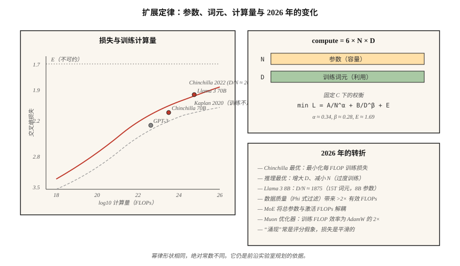

# 扩展定律（Scaling Laws）

> Kaplan 2020 年论文说：模型越大，损失越低。Hoffmann 2022 年论文说：你们训练不足。计算资源分为参数与词元两部分，如何分配并不显然。

**Type:** Learn
**Languages:** Python
**Prerequisites:** 阶段 7 · 05（完整 Transformer），阶段 7 · 07（GPT）
**Time:** ~45 分钟

## 问题（The Problem）

拥有 C FLOPs 训练预算并希望获得最佳模型时，有两个调节参数：

1. **多少参数（N）？** 模型越大，容量越高。
2. **多少训练词元（D）？** 数据越多，容量利用越充分。

FLOPs 近似按 `6 × N × D` 扩展。可以提高 N、降低 D，也可以提高 D、降低 N。哪种更好？

2022 年前，答案是“大力增加 N”。GPT-3（2020）有 175B 参数，在约 300B 词元上训练，每参数约 1.7 个词元。Kaplan 扩展定律支持这一做法。

Hoffmann 等（2022）训练 Chinchilla 小型模型家族时发现了不同结论：最优比例更接近**每参数 20 个词元**。GPT-3 的训练量不足约 10 倍。Chinchilla（70B 参数、1.4T 词元）以低 2.5 倍的推理成本，在所有基准测试上击败 GPT-3（175B、300B 词元）。

2026 年属于 Chinchilla 定律的世界，但有一个重要转折。Llama 3 8B 训练了 15 万亿词元，每参数 1,875 个词元，达到 Chinchilla 最优比例的 94 倍。对大规模使用的模型，推理成本比训练成本更重要，因此超出 Chinchilla 的过度训练，以换取更小部署占用，是 2026 年默认做法。

## 概念（The Concept）



### Hoffmann 定律（The Hoffmann law）

Chinchilla 论文给出的损失规律为：

```
L(N, D) = A / N^α + B / D^β + E
```

- `N` = 参数量（不含嵌入）。
- `D` = 训练词元数。
- `α ≈ 0.34`、`β ≈ 0.28`（大致对称）。
- `E ≈ 1.69`，不可约损失界限。
- `A ≈ 406`、`B ≈ 411`。

扩展时，两项相互权衡。固定计算量（C = 6ND），对 `N` 求导并求解：

```
N_opt ≈ 0.6 × (C/6)^0.5
D_opt ≈ 0.6 × (C/6)^0.5
D_opt / N_opt ≈ 20
```

计算最优：每参数 20 个词元。

### 为何仍要过度训练（Why over-training anyway）

Chinchilla 最优使每训练 FLOP 的训练损失最低。但训练成本只付一次，推理成本却持续支付。

对每月服务一万亿词元的聊天机器人，推理主导总成本。Llama 的方法是训练更小模型、训练更久。8B 配合 15T 词元深度优化了推理：

- 能放入消费级 GPU。
- 延迟仅为 Chinchilla 最优 70B 模型的一小部分。
- 质量对多数任务已足够接近。

DeepMind 2024 年论文《过度训练是新的最优》（Over-training is the new optimal）对此进行了形式化。对推理主导负载，合适比例更接近每参数 100–500 个词元，取决于服务量。

### 涌现与平滑性（Emergence vs smoothness）

一种说法是：算术、多步推理、遵循思维链等能力会在某个规模突然“涌现”。

Schaeffer 等（2023）认为这是测量假象：涌现指标使用不连续评分，如精确匹配、达到阈值的准确率，掩盖了底层逻辑值的平滑改善。连续指标（交叉熵）显示平滑曲线。

2026 年的共识是：基于连续损失的预测可靠，基准跳跃常是评分器假象。应以连续指标规划预算。

### 2026 年全貌（The 2026 picture）

扩展定律仍有效，但：

| 因素 | 如何变化 |
|--------|-------------|
| 数据质量 | 筛选“好”词元（Phi 式）带来 >2× 有效计算量的曲线位移 |
| MoE | 总参数与激活 FLOPs 解耦，按激活 FLOPs 研究扩展定律 |
| 后训练 | 某些能力（指令遵循、代码）受 SFT+RLHF 影响大于预训练 |
| 多模态 | 图像与文本词元共同扩展，各模态有独立曲线 |
| 合成数据 | 模型生成训练数据，有效计算量可产生复合收益 |

Muon 优化器（Kimi Moonlight，2024）在相同数据下相较 AdamW 展示约 2× 有效计算量收益。部分 2026 年训练默认使用 Muon。它改变扩展定律的绝对常数，而非形状。

```figure
scaling-laws
```

## 动手实现（Build It）

参见 `code/main.py`。我们实现 Chinchilla 损失方程，并为多个计算预算分别求解计算最优的 `(N, D)`。

### 第 1 步：Chinchilla 损失（Step 1: Chinchilla loss）

```python
def chinchilla_loss(N, D, A=406.4, B=410.7, alpha=0.34, beta=0.28, E=1.69):
    return A / N ** alpha + B / D ** beta + E
```

在固定 `C = 6ND` 下，绘制 `L` 关于 `(N, D)` 的等高线并寻找最小值。

### 第 2 步：计算最优前沿（Step 2: compute-optimal frontier）

对 `1e17` 到 `1e25` FLOPs 预算，寻找满足 `6ND = C` 且使损失最小的 `(N, D)`，验证比例 `D/N ≈ 20`。

### 第 3 步：过度训练成本（Step 3: over-training cost）

计算训练小 10 倍模型时付出的额外损失，即 N 为最优值的 1/10、D 为最优值的 10 倍。同时报告换来的推理 FLOPs 节省量，它与 N 成比例。

### 第 4 步：与真实模型比较（Step 4: compare to real models）

代入 GPT-3、Chinchilla、Llama 3 8B、DeepSeek-V3（激活参数）的已知 `(N, D)` 对，比较预测损失与报告损失。

## 实际应用（Use It）

你不太可能自己训练前沿模型，但扩展定律能告诉你：

1. **微调数据是否足够。** 如果任务数据低于基础模型每参数 20 个词元，预计损失会在某个下限饱和。
2. **是否选更大基础模型。** 若预算全用于推理，优先更小、训练更久的模型。
3. **收益何时递减。** 超过 Chinchilla 最优的 1000× 后，对数损失变化会成为噪声。

**2026 年研究方向：**

- **数据受限区间（Data-constrained regime）。** 网络高质量词元有限，过滤后的英语约 5–10 万亿。前沿预训练正接近这一上限。合成数据、多语言、多模态与通过 RLHF 扩展的微调是下一批调节手段。
- **计算倍增技巧（Compute-multiplier tricks）。** Muon、MoE、更好的数据筛选都改变绝对常数，而非渐近线。
- **强化学习扩展定律（Scaling laws for RL）。** 尚未解决。早期证据表明强化学习样本呈幂律，但指数与预训练很不同。

## 交付成果（Ship It）

参见 `outputs/skill-training-budget-estimator.md`。该技能根据计算预算、部署约束和目标损失，为新训练选择 `(N, D, hours, GPU)`。

## 练习（Exercises）

1. **简单。** 运行 `code/main.py`，打印预算 `1e20`、`1e22`、`1e24` 下 Chinchilla 最优 `(N, D)`，与真实模型表比较。
2. **中等。** 实现 Hoffmann 的损失—计算量曲线。为计算最优前沿绘制损失与 `log10(C)` 关系。找出何时该定律预测再降低 0.1 交叉熵需要 `>10^28` FLOPs。
3. **困难。** 在同一数据集上训练 5 个微型模型（100K 到 10M 参数），拟合自己的扩展定律，估计 `α` 和 `E`。你的指数与公布值匹配到什么程度？

## 关键术语（Key Terms）

| 术语 | 常见说法 | 实际含义 |
|------|-----------------|-----------------------|
| 参数（Parameters，N） | “模型大小” | 非嵌入权重数量，决定容量。 |
| 词元（Tokens，D） | “训练数据” | 见过的训练词元数量，决定参数利用程度。 |
| 计算量（Compute，C） | “花掉的 FLOPs” | 标准 Transformer 近似为 `6 × N × D`。 |
| Chinchilla 最优（Chinchilla-optimal） | “D/N ≈ 20” | 使每预训练 FLOP 损失最低的比例。 |
| 过度训练（Over-training） | “超过 Chinchilla” | 花额外训练 FLOPs 节省推理 FLOPs；D/N >> 20。 |
| 不可约损失（Irreducible loss） | “下限” | 扩展定律的 `E` 项，即数据本身的熵。 |
| 涌现能力（Emergent capability） | “规模增大时突然跳跃” | 常是评分器假象；连续损失是平滑的。 |
| 有效计算量（Effective compute） | “训练效率倍增器” | 更好的数据、优化器或架构，使一次 FLOP 发挥更大作用。 |

## 延伸阅读（Further Reading）

- [Kaplan 等（2020）：神经语言模型扩展定律（Scaling Laws for Neural Language Models）](https://arxiv.org/abs/2001.08361)：首篇扩展定律论文，模型训练不足。
- [Hoffmann 等（2022）：训练计算最优的大语言模型（Training Compute-Optimal Large Language Models）](https://arxiv.org/abs/2203.15556)：Chinchilla。
- [Schaeffer 等（2023）：大语言模型的涌现能力是海市蜃楼吗？（Are Emergent Abilities of Large Language Models a Mirage?）](https://arxiv.org/abs/2304.15004)：将涌现视为测量假象。
- [Sardana、Frankle（2024）：超越 Chinchilla 最优：在语言模型扩展定律中计入推理（Beyond Chinchilla-Optimal: Accounting for Inference in Language Model Scaling Laws）](https://arxiv.org/abs/2401.00448)：Llama 的过度训练为何适合其负载。
- [Jordan 等（2024）：Muon：神经网络隐藏层优化器（Muon: An optimizer for hidden layers in neural networks）](https://kellerjordan.github.io/posts/muon/)：2× 计算倍增器。
