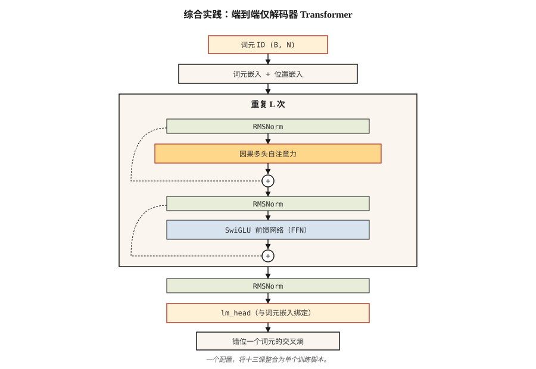

# 从零构建 Transformer：综合实践（Build a Transformer from Scratch — The Capstone）

> 十三课，一个模型，不走捷径。

**Type:** Build
**Languages:** Python
**Prerequisites:** 阶段 7 · 01 至 13，不要跳过。
**Time:** ~120 分钟

## 问题（The Problem）

你已读过所有论文，实现了注意力、多头拆分、位置编码、编码器与解码器模块、BERT 和 GPT 损失、MoE、KV 缓存。现在让它们在真实任务上协同工作。

综合实践（Capstone）：在字符级语言建模任务上，端到端训练一个小型仅解码器 Transformer。它阅读莎士比亚，生成新的莎士比亚式文字。模型足够小，笔记本上不足 10 分钟即可训练；实现足够正确，换用更大数据集并延长训练就能得到真正的语言模型。

这是本课程的“nanoGPT”。它并非原创：Karpathy 2023 年 nanoGPT 教程是每位学生至少写一次的参考实现。我们借用其形态，再围绕已学内容重新调整。

## 概念（The Concept）



带注释的架构如下：

```
输入词元 (B, N)
   │
   ▼
词元嵌入 + 位置嵌入                     ◀── 第 04 课（RoPE 可选）
   │
   ▼
┌──── 模块 × L ────────────────────┐
│  RMSNorm                          │  ◀── 第 05 课
│  MultiHeadAttention（因果）        │  ◀── 第 03 + 07 课（因果掩码）
│  残差连接                         │
│  RMSNorm                          │
│  SwiGLU FFN                       │  ◀── 第 05 课
│  残差连接                         │
└────────────────────────────────── ┘
   │
   ▼
最终 RMSNorm
   │
   ▼
lm_head（与词元嵌入绑定）
   │
   ▼
逻辑值 (B, N, V)
   │
   ▼
错位一个词元的交叉熵                  ◀── 第 07 课
```

### 交付内容（What we ship）

- `GPTConfig`：集中配置全部超参数。
- `MultiHeadAttention`：因果、批量处理，可选 Flash 式路径，即 PyTorch 的 `scaled_dot_product_attention`。
- `SwiGLUFFN`：现代前馈网络。
- `Block`：前置归一化、残差包裹的注意力与 FFN。
- `GPT`：嵌入、堆叠模块、语言模型头、generate()。
- 带 AdamW、余弦学习率和梯度裁剪的训练循环。
- 用于莎士比亚文本的字符级分词器。

### 不交付的内容（What we don't ship）

- RoPE：第 04 课已概念性实现。这里为简单起见使用可学习位置嵌入，练习要求换入 RoPE。
- 生成时的 KV 缓存：每步生成都对完整前缀重算注意力，更慢但更简单。练习要求添加 KV 缓存。
- Flash Attention：PyTorch 2.0+ 在输入匹配时自动分派；我们使用 `F.scaled_dot_product_attention`。
- MoE：每模块一个 FFN。第 11 课已介绍 MoE。

### 目标指标（Target metrics）

Mac M2 笔记本上，4 层、4 头、d_model=128 的 GPT 在 `tinyshakespeare.txt` 上训练 2,000 步：

- 训练损失约 6 分钟从随机的 ~4.2 收敛至 ~1.5。
- 采样输出具有莎士比亚风格：出现古语、换行及 "ROMEO:" 这样的专名。
- 验证损失（留出文本末尾 10%）紧随训练损失，此规模与预算下没有过拟合。

```figure
n5-block-stack
```

## 动手实现（Build It）

本课使用 PyTorch，安装 `torch` 即可，CPU 版也行。参见 `code/main.py`。脚本负责：

- 缺少 `tinyshakespeare.txt` 时下载，或读取本地副本。
- 字节级字符分词器。
- 按 90/10 划分训练/验证集。
- 在支持的硬件上使用 bf16 自动类型转换的训练循环。
- 训练结束后采样。

### 第 1 步：数据（Step 1: data）

```python
text = open("tinyshakespeare.txt").read()
chars = sorted(set(text))
stoi = {c: i for i, c in enumerate(chars)}
itos = {i: c for c, i in stoi.items()}
encode = lambda s: [stoi[c] for c in s]
decode = lambda xs: "".join(itos[x] for x in xs)
```

65 个不同字符，词表很小，vocab_size 可用 4 字节表示。不用 BPE，也没有分词器复杂问题。

### 第 2 步：模型（Step 2: model）

参见 `code/main.py`。模块直接采用第 05 课标准结构：前置归一化、RMSNorm、SwiGLU、因果 MHA。4/4/128 配置参数约 800K。

### 第 3 步：训练循环（Step 3: training loop）

随机取一批长度 256 的词元窗口，前向传播、错位一个词元的交叉熵、反向传播、AdamW 更新、记录日志，再重复。

```python
for step in range(max_steps):
    x, y = get_batch("train")
    logits = model(x)
    loss = F.cross_entropy(logits.view(-1, vocab_size), y.view(-1))
    loss.backward()
    torch.nn.utils.clip_grad_norm_(model.parameters(), 1.0)
    opt.step()
    opt.zero_grad()
```

### 第 4 步：采样（Step 4: sample）

给定提示词，反复前向传播，从 top-p 逻辑值分布采样，追加并继续。500 个词元后停止。

### 第 5 步：阅读输出（Step 5: read the output）

2,000 步后：

```
ROMEO:
Away and mild will not thy friend, that thou shalt wit:
The chief that well shame and hath been his friends,
...
```

不是莎士比亚本人，但有莎士比亚的形态。约 800K 参数、笔记本 6 分钟，这已是明确成果。

## 实际应用（Use It）

这项综合实践是参考架构。三个扩展可将它变成实际应用：

1. **替换分词器。** 使用 BPE，例如 `tiktoken.get_encoding("cl100k_base")`。词表从 65 跃升至约 50,000，模型容量也需相应扩大。
2. **用更大语料训练。** 使用 `OpenWebText` 或 HuggingFace 的 `fineweb-edu`。125M 参数 GPT 在单张 A100 上训练 10B 词元约需 24 小时。
3. **添加 RoPE、KV 缓存与 Flash Attention。** 下方练习逐项引导。

最终得到能生成流畅英语的 125M 参数 GPT。它不是前沿模型，但同一代码路径，只是规模更大，正是 Karpathy、EleutherAI 和 Allen Institute 在 2026 年训练研究检查点的方式。

## 交付成果（Ship It）

参见 `outputs/skill-transformer-review.md`。该技能依据前 13 课检查从零实现 Transformer 的正确性。

## 练习（Exercises）

1. **简单。** 运行 `code/main.py`，验证模型最后一步验证损失低于 2.0。将 `max_steps` 从 2,000 改为 5,000，验证损失是否继续改善？
2. **中等。** 用 RoPE 替换可学习位置嵌入。在 `MultiHeadAttention` 内对 Q、K 应用旋转，训练并验证验证损失至少同样低。
3. **中等。** 在采样循环实现 KV 缓存。分别有缓存和无缓存生成 500 个词元，笔记本实际耗时应改善 5–20 倍。
4. **困难。** 为模型添加第二个头，预测下下个词元，即 DeepSeek-V3 的多词元预测（Multi-Token Prediction，MTP）。联合训练，是否有帮助？
5. **困难。** 将每模块单个 FFN 替换为 4 专家 MoE，使用路由器与 top-2 路由。在相同激活参数下观察验证损失变化。

## 关键术语（Key Terms）

| 术语 | 常见说法 | 实际含义 |
|------|-----------------|-----------------------|
| nanoGPT | “Karpathy 的教程仓库” | 约 300 行的极简仅解码器 Transformer 训练代码，是典型参考实现。 |
| tinyshakespeare | “标准玩具语料” | 约 1.1 MB 文本，2015 年以来字符语言模型教程都使用它。 |
| 绑定嵌入（Tied embeddings） | “共享输入/输出矩阵” | 语言模型头权重等于词元嵌入矩阵的转置，节省参数、改善质量。 |
| bf16 自动类型转换（bf16 autocast） | “训练精度技巧” | 前向/反向用 bf16，优化器状态保留 fp32；2021 年以来的标准。 |
| 梯度裁剪（Gradient clipping） | “阻止尖峰” | 将全局梯度范数上限设为 1.0，防止训练爆炸。 |
| 余弦学习率调度（Cosine LR schedule） | “2020 年后的默认方案” | 学习率先线性预热，再按余弦衰减到峰值的 10%。 |
| 模型 FLOPs 利用率（Model FLOP Utilization，MFU） | “模型计算利用率” | 实际 FLOPs / 理论峰值；2026 年稠密 40%、MoE 30% 已很出色。 |
| 验证损失（Val loss） | “留出集损失” | 模型未见数据上的交叉熵，用来检测过拟合。 |

## 延伸阅读（Further Reading）

- [带注释的 Transformer（The Annotated Transformer，Harvard NLP）](https://nlp.seas.harvard.edu/annotated-transformer/)：经典带注释实现。
