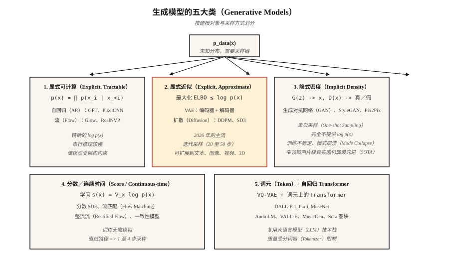

# 生成模型：分类与历史（Generative Models — Taxonomy & History）

> 图像、文本、视频和 3D 模型都能归入五大类之一。选错类别，你会花数周与数学约束较劲；选对类别，过去十二年的领域进展就能在脑中形成清晰脉络。

**Type:** Learn
**Languages:** Python
**Prerequisites:** 阶段 2（机器学习基础），阶段 3（深度学习核心），阶段 7 · 14（Transformer）
**Time:** ~45 分钟

## 问题（The Problem）

生成模型（Generative Model）只做一件事：给定从未知分布 `p_data(x)` 抽取的训练样本，输出看起来来自同一分布的新样本。人脸、句子、MIDI 文件、蛋白质结构，从这个角度看都是同一个问题。

难点是 `p_data` 所在空间有数百万维（512x512 RGB 图像约有 786k 维），样本分布在其中很薄的流形（Manifold）上，而你可能只有 10M 个例子。暴力估计密度没有希望。每种生成模型都是折中：把一个难题换成稍微容易一点的难题。

过去十二年有五类方法留了下来。了解各类方法的折中，就能明白它们为何在某些任务上胜出、在另一些任务上失效。

## 概念（The Concept）



**1. 显式密度，可精确计算（Explicit Density, Tractable）。** 将 `log p(x)` 写成实际可计算的求和。自回归模型（Autoregressive Model，如 PixelCNN、WaveNet、GPT）分解 `p(x) = ∏ p(x_i | x_<i)`。归一化流（Normalizing Flow，如 RealNVP、Glow）用简单基分布的可逆变换构造 `p(x)`。优点：精确似然、清晰的训练损失。缺点：自回归推理是串行的（长序列慢），流需要可逆架构（限制架构选择）。

**2. 显式密度，近似计算（Explicit Density, Approximate）。** 为 `log p(x)` 构造证据下界（Evidence Lower Bound，ELBO）并优化它。变分自编码器（Variational Autoencoder，VAE；Kingma，2013）采用带变分后验的编码器与解码器。扩散模型（Diffusion Model，如 DDPM；Ho，2020）训练去噪器，隐式优化加权 ELBO。扩散是 2026 年图像、视频和 3D 的主流骨干。

**3. 隐式密度（Implicit Density）。** 完全跳过密度；学习产生样本的生成器 `G(z)` 和区分真假的判别器 `D(x)`。这就是生成对抗网络（Generative Adversarial Network，GAN；Goodfellow，2014）。推理快（一次前向传播），但训练出了名地不稳定。即使在 2026 年，StyleGAN 1/2/3 在固定领域的照片级真实感（人脸、卧室）上仍属最先进水平。

**4. 基于分数／连续时间（Score-based / Continuous-time）。** 直接学习对数密度梯度 `∇_x log p(x)`，即分数（Score）。Song 与 Ermon（2019）证明分数匹配（Score Matching）将扩散推广为随机微分方程（Stochastic Differential Equation，SDE）。流匹配（Flow Matching；Lipman，2023）是 2024 至 2026 年的热门方法：训练无需模拟、路径更直，采样比 DDPM 快 4 至 10 倍。Stable Diffusion 3、Flux、AudioCraft 2 都使用流匹配。

**5. 离散编码上的词元自回归（Token-based Autoregressive）。** 用向量量化变分自编码器（Vector Quantized VAE，VQ-VAE）或残差量化器把高维数据压缩成短的离散词元（Token）序列，再用 Transformer 建模序列。Parti、MuseNet、AudioLM、VALL-E 和 Sora 的图块分词器都采用此法。这就是第 1 类加上学习得到的分词器（Tokenizer）。

## 简史（A brief history）

| 年份 | 模型 | 重要意义 |
|------|-------|-----------------|
| 2013 | VAE（Kingma） | 首个具有可用训练损失的深度生成模型。 |
| 2014 | GAN（Goodfellow） | 隐式密度，无需似然，却生成了惊人清晰的样本。 |
| 2015 | DRAW、PixelCNN | 序列式图像生成。 |
| 2017 | Glow、RealNVP | 可逆流；用深层模型计算精确似然。 |
| 2017 | Progressive GAN | 首次生成百万像素人脸。 |
| 2019 | StyleGAN / StyleGAN2 | 在人脸这一领域，照片级真实感仍难以超越。 |
| 2020 | DDPM（Ho） | 扩散走向实用。 |
| 2021 | CLIP、DALL-E 1、VQGAN | 文生图进入主流。 |
| 2022 | Imagen、Stable Diffusion 1、DALL-E 2 | 潜空间扩散加文本条件成为普及能力。 |
| 2022 | ControlNet、LoRA | 精细控制预训练扩散模型。 |
| 2023 | SDXL、Midjourney v5、流匹配（Flow Matching） | 扩大规模并改善训练动力学。 |
| 2024 | Sora、Stable Diffusion 3、Flux.1 | 视频扩散；流匹配胜出。 |
| 2025 | Veo 2、Kling 1.5、Runway Gen-3、Nano Banana | 生产级视频。 |
| 2026 | 一致性（Consistency）与整流流（Rectified Flow） | 从扩散骨干实现单步采样。 |

## 五问初筛（The five-question triage）

看到新的生成模型论文时，先回答以下五问，再读方法部分。

1. **建模对象是什么？** 像素、潜变量、离散词元、3D 高斯、网格，还是波形？
2. **密度是显式还是隐式？** 作者是否写出了 `log p(x)`？
3. **采样一次完成还是迭代完成？** 迭代意味着推理更慢；单次生成通常意味着对抗训练或蒸馏。
4. **条件是无条件、类别、文本、图像，还是姿态？** 它决定损失和架构支撑结构。
5. **评估采用弗雷歇起始距离（Fréchet Inception Distance，FID）、CLIP 分数、起始分数（Inception Score，IS）、人类偏好，还是任务准确率？** 每种都有已知失效模式（见第 14 课）。

本阶段每一课你都会重新回答这五问。学完后，它们会成为直觉。

```figure
autoencoder-bottleneck
```

## 动手实现（Build It）

本课代码是一段轻量可视化：用三种玩具方法（核密度、离散直方图、最近样本式“类 GAN”生成器）从样本拟合一维高斯混合分布，让你在一屏能打印的问题中看清显式与隐式密度的区别。

运行 `code/main.py`。它从双模态高斯混合分布抽取 2000 个样本，然后打印：

```text
explicit density (histogram): p(x in [-0.5, 0.5]) ≈ 0.38
approximate density (KDE):     p(x in [-0.5, 0.5]) ≈ 0.41
implicit (nearest-sample gen): 20 new samples printed, no p(x)
```

注意：前两种方法允许你问“这个点出现的可能性有多大？”，第三种不行。这就是后续每课都会涉及的*显式与隐式*区别。

## 实际应用（Use It）

2026 年，什么任务该用哪一类？

| 任务 | 最佳类别 | 原因 |
|------|-------------|-----|
| 窄领域照片级人脸 | StyleGAN 2/3 | 仍然最清晰，推理最快。 |
| 通用文生图 | 潜空间扩散（Latent Diffusion）与流匹配 | SD3、Flux.1、DALL-E 3。 |
| 快速文生图 | 整流流与蒸馏（Distillation） | SDXL-Turbo、SD3-Turbo、LCM。 |
| 文生视频 | 扩散 Transformer 与流匹配 | Sora、Veo 2、Kling。 |
| 语音与音乐 | 基于词元的自回归（AR；AudioLM、VALL-E、MusicGen）或流匹配（AudioCraft 2） | 离散词元可低成本扩展。 |
| 3D 场景 | 高斯泼溅（Gaussian Splatting）拟合与扩散先验 | 3D-GS 用于重建，扩散用于新视角。 |
| 密度估计（不采样） | 流（Flow） | 唯一具有精确 `log p(x)` 的类别。 |
| 仿真／物理 | 流匹配、分数 SDE | 直线路径、平滑向量场。 |

## 交付成果（Ship It）

保存为 `outputs/skill-model-chooser.md`。

该技能接收任务描述，输出：(1) 应使用的模型类别，(2) 三个开放方案和三个托管方案的排序列表，(3) 应关注的可能失效模式，(4) 计算与时间预算。

## 练习（Exercises）

1. **简单。** 判断以下五款产品的模型类别与骨干：ChatGPT image、Midjourney v7、Sora、Runway Gen-3、ElevenLabs。证据应来自公开技术报告。
2. **中等。** 明天准备阅读的论文声称采样比扩散快 100 倍。写出三个问题，核查加入条件和高分辨率后是否仍有这种加速。
3. **困难。** 选一个关注的领域（如蛋白质结构、CAD、分子、轨迹）。针对该领域当前最先进（State of the Art，SOTA）的模型回答五问初筛，并勾画更好的模型会改变什么。

## 关键术语（Key Terms）

| 术语 | 常见说法 | 实际含义 |
|------|-----------------|-----------------------|
| 生成模型（Generative Model） | “生成新东西” | 学习 `p_data(x)` 的采样器，也可能提供 `log p(x)`。 |
| 显式密度（Explicit Density） | “可以计算它” | 模型提供闭式或可计算的 `log p(x)`。 |
| 隐式密度（Implicit Density） | “GAN 风格” | 只有采样器，无法计算给定点的 `p(x)`。 |
| 证据下界（ELBO） | “证据下界” | `log p(x)` 的可计算下界；VAE 与扩散优化它。 |
| 分数（Score） | “对数密度的梯度” | `∇_x log p(x)`；扩散和 SDE 模型学习这个场。 |
| 流形假设（Manifold Hypothesis） | “数据分布在曲面上” | 高维数据集中于低维流形，解释了降维为何有效。 |
| 自回归（Autoregressive） | “预测下一个部分” | 将联合分布分解为条件分布的乘积。 |
| 潜变量（Latent） | “压缩编码” | 解码器可据以重建输入的低维表示。 |

## 生产说明：五类模型，五种推理形态（Production note: five families, five inference shapes）

每类模型对应不同的推理服务器成本曲线。生产推理文献将大语言模型（Large Language Model，LLM）推理分成预填充（Prefill）与解码（Decode）；这里也适用同样的拆解：

- **自回归（第 1、5 类）。** 串行解码主导延迟；键值缓存（KV-cache）、连续批处理（Continuous Batching）和推测解码（Speculative Decoding）都可直接应用。
- **VAE／扩散／流匹配（第 2、4 类）。** 不存在 LLM 意义上的解码。成本 = `num_steps × step_cost`，其中 `step_cost` 是在完整潜空间分辨率上运行 Transformer 或 U-Net 一次前向传播的成本。生产调节项包括步数（DDIM／DPM-Solver／蒸馏）、批大小和精度（bf16／fp8／int4）。
- **GAN（第 3 类）。** 一次前向传播。无调度，无 KV-cache。首词元时间（Time to First Token，TTFT）≈ 总延迟。这就是 StyleGAN 在窄领域用户体验上仍能胜出的原因。

论文摘要中的“比扩散更快”，应解读成“更少步数 × 相同步成本”或“相同步数 × 更低步成本”。其余都是营销说法。

## 延伸阅读（Further Reading）

- [Goodfellow 等（2014）：生成对抗网络（Generative Adversarial Nets）](https://arxiv.org/abs/1406.2661)：GAN 论文。
- [Kingma 与 Welling（2013）：自编码变分贝叶斯（Auto-Encoding Variational Bayes）](https://arxiv.org/abs/1312.6114)：VAE 论文。
- [Ho、Jain、Abbeel（2020）：去噪扩散概率模型（Denoising Diffusion Probabilistic Models）](https://arxiv.org/abs/2006.11239)：DDPM 论文。
- [Song 等（2021）：通过 SDE 进行基于分数的生成建模（Score-Based Generative Modeling through SDEs）](https://arxiv.org/abs/2011.13456)：将扩散视为 SDE。
- [Lipman 等（2023）：用于生成建模的流匹配（Flow Matching for Generative Modeling）](https://arxiv.org/abs/2210.02747)：流匹配论文。
- [Esser 等（2024）：扩展整流流 Transformer 以合成高分辨率图像（Scaling Rectified Flow Transformers for High-Resolution Image Synthesis）](https://arxiv.org/abs/2403.03206)：Stable Diffusion 3。
