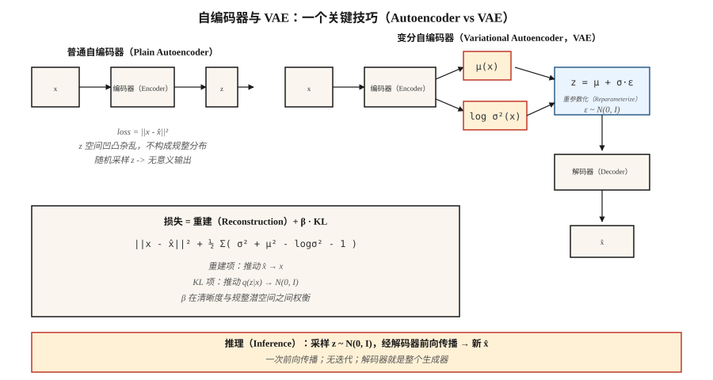

# 自编码器与变分自编码器（Autoencoders & Variational Autoencoders，VAE）

> 普通自编码器先压缩再重建。它记忆，但不生成。加入一个技巧，强制编码近似高斯分布，就能得到采样器。正是 `z = μ + σ·ε` 这一重参数化技巧，让你在 2026 年使用的所有潜空间扩散与流匹配图像模型都在输入端配有 VAE。

**Type:** Build
**Languages:** Python
**Prerequisites:** 阶段 3 · 02（反向传播），阶段 3 · 07（卷积神经网络），阶段 8 · 01（分类）
**Time:** ~75 分钟

## 问题（The Problem）

将 784 像素的 MNIST 数字压缩成含 16 个数的编码，然后重建。普通自编码器的重建均方误差（Mean Squared Error，MSE）会很出色，但编码空间却凹凸杂乱。从编码空间随机选一点并解码，得到的是噪声。它没有采样器，只是换了包装的压缩模型。

你真正想要的是：(a) 编码空间是可采样的、干净平滑的分布，例如各向同性高斯分布 `N(0, I)`；(b) 解码任何样本都能产生合理的数字；(c) 编码器和解码器仍有良好的压缩能力。三个目标，一套架构，一个损失。

Kingma 在 2013 年提出的 VAE 通过以下方式解决它：训练编码器输出*分布* `q(z|x) = N(μ(x), σ(x)²)`，用 KL 散度（Kullback–Leibler Divergence，KL）惩罚将该分布拉向先验 `N(0, I)`，再从 `q(z|x)` 采样 `z` 后解码。推理时丢弃编码器，采样 `z ~ N(0, I)` 并解码。KL 惩罚迫使编码空间具有结构。

2026 年 VAE 很少独立交付，因为纯图像质量已被扩散超越，但它仍是所有潜空间扩散模型（SD 1/2/XL/3、Flux、AudioCraft）的首选编码器。学懂 VAE，就学懂了你使用的每条图像流水线中看不见的第一层。

## 概念（The Concept）



**自编码器（Autoencoder）。** `z = encoder(x)`，`x̂ = decoder(z)`，损失 = `||x - x̂||²`。编码空间没有结构。

**VAE 编码器。** 输出两个向量：`μ(x)` 与 `log σ²(x)`。它们定义 `q(z|x) = N(μ, diag(σ²))`。

**重参数化技巧（Reparameterization Trick）。** 从 `q(z|x)` 采样不可微。将样本改写为 `z = μ + σ·ε`，其中 `ε ~ N(0, I)`。现在 `z` 是 `(μ, σ)` 的确定性函数加上非参数噪声，梯度可以流经 `μ` 和 `σ`。

**损失。** 证据下界（Evidence Lower Bound，ELBO）包含两项：

```text
loss = reconstruction + β · KL[q(z|x) || N(0, I)]
     = ||x - x̂||²  + β · Σ_i ( σ_i² + μ_i² - log σ_i² - 1 ) / 2
```

重建项将 `x̂` 推向 `x`，KL 将 `q(z|x)` 推向先验。两者互相制约。β 小（<1）时样本更清晰，但编码空间不那么高斯；β 大（>1）时编码空间更规整，但样本更模糊。β-VAE（Higgins，2017）让这个调节参数广为人知，并开启了解耦表示研究。

**采样（Sampling）。** 推理时抽取 `z ~ N(0, I)`，送入解码器前向传播。只需一次前向传播，无需像扩散那样迭代采样。

```figure
vae-latent-grid
```

## 动手实现（Build It）

`code/main.py` 不用 numpy 或 torch，实现了一个微型 VAE。输入是从八维双分量高斯混合分布抽取的八维合成数据。编码器与解码器都是单隐藏层多层感知机（Multilayer Perceptron，MLP）。我们实现 tanh 激活、前向传播、损失和手写反向传播。这是教学实现，不用于生产。

### 第 1 步：编码器前向传播（Step 1: encoder forward）

```python
def encode(x, enc):
    h = tanh(add(matmul(enc["W1"], x), enc["b1"]))
    mu = add(matmul(enc["W_mu"], h), enc["b_mu"])
    log_sigma2 = add(matmul(enc["W_sig"], h), enc["b_sig"])
    return mu, log_sigma2
```

使用 `log σ²` 而非 `σ`，使网络输出不受约束（对 σ 使用 softplus 是陷阱：σ ≈ 0 时梯度消失）。

### 第 2 步：重参数化与解码（Step 2: reparameterize and decode）

```python
def reparameterize(mu, log_sigma2, rng):
    eps = [rng.gauss(0, 1) for _ in mu]
    sigma = [math.exp(0.5 * lv) for lv in log_sigma2]
    return [m + s * e for m, s, e in zip(mu, sigma, eps)]

def decode(z, dec):
    h = tanh(add(matmul(dec["W1"], z), dec["b1"]))
    return add(matmul(dec["W_out"], h), dec["b_out"])
```

### 第 3 步：证据下界（Step 3: the ELBO）

```python
def elbo(x, x_hat, mu, log_sigma2, beta=1.0):
    recon = sum((a - b) ** 2 for a, b in zip(x, x_hat))
    kl = 0.5 * sum(math.exp(lv) + m * m - lv - 1 for m, lv in zip(mu, log_sigma2))
    return recon + beta * kl, recon, kl
```

两个分布都是高斯分布，因此 KL 有精确闭式解。不要数值积分。2026 年仍有人交付用蒙特卡洛（Monte Carlo）估计 KL 的代码，毫无必要地慢了 3 倍。

### 第 4 步：生成（Step 4: generate）

```python
def sample(dec, z_dim, rng):
    z = [rng.gauss(0, 1) for _ in range(z_dim)]
    return decode(z, dec)
```

这就是生成模型，五行代码。

## 常见陷阱（Pitfalls）

- **后验崩溃（Posterior Collapse）。** KL 项过于强烈地推动 `q(z|x) → N(0, I)`，导致 `z` 不再携带 `x` 的信息。修复：β 退火（从 β=0 逐渐升至 1）、自由比特（Free Bits），或对非活跃维度跳过 KL。
- **样本模糊。** 高斯解码器似然意味着 MSE 重建，它在 L2 下的贝叶斯最优解是均值，而一组合理数字的均值是模糊的数字。修复：离散解码器（VQ-VAE、NVAE），或只用 VAE 编码，再在潜变量上叠加扩散（Stable Diffusion 正是如此）。
- **β 过早过大。** 见后验崩溃。从 β≈0.01 开始逐步增加。
- **潜变量维度太小。** MNIST 可用 16 维，ImageNet 256² 可用 256 维，ImageNet 1024² 可用 2048 维。Stable Diffusion 的 VAE 将 512×512×3 压缩为 64×64×4（空间面积下采样 32 倍，通道下采样 32 倍）。

## 实际应用（Use It）

2026 年的 VAE 技术栈：

| 场景 | 选择 |
|-----------|------|
| 扩散的图像潜变量编码器 | Stable Diffusion VAE（`sd-vae-ft-ema`）或 Flux VAE |
| 音频潜变量编码器 | Encodec（Meta）、SoundStream 或 DAC（Descript） |
| 视频潜变量 | Sora 的时空图块、Latte VAE、WAN VAE |
| 解耦表示学习（Disentangled Representation Learning） | β-VAE、FactorVAE、TCVAE |
| 离散潜变量（供 Transformer 建模） | VQ-VAE、残差向量量化（Residual Vector Quantization，RVQ；ResidualVQ） |
| 用于生成的连续潜变量 | 普通 VAE，然后在该潜空间中用条件流／扩散模型 |

潜空间扩散模型就是在编码器与解码器之间放入扩散模型的 VAE。VAE 负责粗粒度压缩，扩散负责繁重工作。视频（VAE + 视频扩散 DiT）与音频（Encodec + MusicGen Transformer）也遵循同一模式。

## 交付成果（Ship It）

保存 `outputs/skill-vae-trainer.md`。

技能输入：数据集概况、目标潜变量维度、下游用途（重建、采样或潜空间扩散输入）。输出：架构选择（普通／β／VQ／RVQ）、β 调度、潜变量维度、解码器似然（高斯或分类），以及评估计划（重建 MSE、逐维 KL、`q(z|x)` 与 `N(0, I)` 之间的弗雷歇距离（Fréchet Distance））。

## 练习（Exercises）

1. **简单。** 将 `code/main.py` 中的 `β` 改为 `0.01`、`0.1`、`1.0`、`5.0`。记录最终重建 MSE 和 KL。对你的合成数据，哪个 β 是帕累托最优？
2. **中等。** 将高斯解码器似然换为伯努利似然（Bernoulli Likelihood，交叉熵损失）。在同一合成数据的二值化版本上比较样本质量。
3. **困难。** 将 `code/main.py` 扩展成微型 VQ-VAE：用 K=32 个条目的码本最近邻查找替换连续 `z`。比较重建 MSE，报告使用了多少码本条目（码本崩溃确实存在）。

## 关键术语（Key Terms）

| 术语 | 常见说法 | 实际含义 |
|------|-----------------|-----------------------|
| 自编码器（Autoencoder） | 编码与解码网络 | `x → z → x̂`，学习 MSE。不是生成式模型。 |
| 变分自编码器（VAE） | 带采样器的自编码器 | 编码器输出分布，KL 惩罚塑造编码空间。 |
| 证据下界（ELBO） | 证据下界 | `log p(x) ≥ recon - KL[q(z\|x) \|\| p(z)]`；当 `q = p(z\|x)` 时下界紧致。 |
| 重参数化（Reparameterization） | `z = μ + σ·ε` | 将随机节点改写为确定性函数加纯噪声，使反向传播可穿过采样。 |
| 先验（Prior） | `p(z)` | 潜变量的目标分布，通常为 `N(0, I)`。 |
| 后验崩溃（Posterior Collapse） | “KL 项占了上风” | 编码器忽略 `x`，输出先验；解码器只能凭空构造。 |
| β-VAE | 可调 KL 权重 | `loss = recon + β·KL`。β 越大，越解耦，但越模糊。 |
| VQ-VAE | 离散潜变量 | 用最近的码本向量替换连续 `z`，从而支持 Transformer 建模。 |

## 生产说明：VAE 是扩散服务器最繁忙的路径（Production note: the VAE is the hottest path in a diffusion server）

在 Stable Diffusion／Flux／SD3 流水线中，每次请求调用 VAE 两次：编码一次（图生图／局部重绘时），解码一次。在 1024² 下，解码常是整条流水线最大的激活内存峰值，因为它把 `128×128×16` 潜变量上采样回 `1024×1024×3`。有两个实际影响：

- **切片或分块解码。** `diffusers` 提供 `pipe.vae.enable_slicing()` 与 `pipe.vae.enable_tiling()`。分块以少量接缝伪影换取 `O(tile²)` 而非 `O(H·W)` 的内存。消费级 GPU 处理 1024² 及更高分辨率时必不可少。
- **解码器用 bf16，最后缩放的数值计算用 fp32。** SD 1.x VAE 以 fp32 发布，在 1024² 及以上转成 fp16 会*静默产生 NaN*。SDXL 提供 `madebyollin/sdxl-vae-fp16-fix`，务必优先选 fp16-fix 版本或使用 bf16。

## 延伸阅读（Further Reading）

- [Kingma 与 Welling（2013）：自编码变分贝叶斯（Auto-Encoding Variational Bayes）](https://arxiv.org/abs/1312.6114)：VAE 论文。
- [Higgins 等（2017）：β-VAE：在受约束变分框架中学习基础视觉概念（β-VAE: Learning Basic Visual Concepts with a Constrained Variational Framework）](https://openreview.net/forum?id=Sy2fzU9gl)：解耦 β-VAE。
- [van den Oord 等（2017）：神经离散表示学习（Neural Discrete Representation Learning）](https://arxiv.org/abs/1711.00937)：VQ-VAE。
- [Vahdat 与 Kautz（2021）：NVAE：深层分层变分自编码器（NVAE: A Deep Hierarchical Variational Autoencoder）](https://arxiv.org/abs/2007.03898)：最先进的图像 VAE。
- [Rombach 等（2022）：使用潜空间扩散模型合成高分辨率图像（High-Resolution Image Synthesis with Latent Diffusion Models）](https://arxiv.org/abs/2112.10752)：Stable Diffusion；以 VAE 为编码器。
- [Défossez 等（2022）：高保真神经音频压缩（High Fidelity Neural Audio Compression）](https://arxiv.org/abs/2210.13438)：Encodec，音频 VAE 标准。
