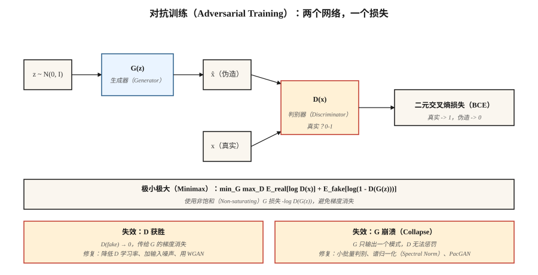

# 生成对抗网络：生成器与判别器（GANs — Generator vs Discriminator）

> Goodfellow 在 2014 年的技巧是完全跳过密度。两个网络，一个造假，一个识假；不断对抗，直到真假无法区分。它看似不该奏效，也经常失败。但成功时，在窄领域中，其样本仍是文献里最清晰的。

**Type:** Build
**Languages:** Python
**Prerequisites:** 阶段 3 · 02（反向传播），阶段 3 · 08（优化器），阶段 8 · 02（VAE）
**Time:** ~75 分钟

## 问题（The Problem）

变分自编码器（Variational Autoencoder，VAE）的样本模糊，是因为解码器的均方误差（Mean Squared Error，MSE）损失对*均值*图像是贝叶斯最优的，而许多合理数字的均值是模糊数字。你需要奖励*合理性*而非与某个目标逐像素接近程度的损失。合理性没有闭式表达，必须学习。

Goodfellow 的思路：训练分类器 `D(x)` 区分真实图像和伪造图像，再训练生成器 `G(z)` 欺骗 `D`。`G` 的损失信号来自 `D` 当前对真实感的判断。随着 `G` 改进，信号也更新，追逐不断移动的目标。如果两个网络都收敛，`G` 就在从未写出 `log p(x)` 的情况下学会了数据分布。

这就是对抗训练（Adversarial Training）。数学上是极小极大博弈（Minimax Game）：

```text
min_G max_D  E_real[log D(x)] + E_fake[log(1 - D(G(z)))]
```

2026 年，生成对抗网络（Generative Adversarial Network，GAN）不再是最先进的生成器，扩散和流匹配夺走了桂冠。但 StyleGAN 2/3 仍是已交付的最清晰人脸模型；GAN 判别器被用作扩散训练的*感知损失（Perceptual Loss）*；对抗训练也支撑着快速单步蒸馏（SDXL-Turbo、SD3-Turbo、LCM），使实时扩散得以交付。

## 概念（The Concept）



**生成器（Generator）`G(z)`。** 将噪声向量 `z ~ N(0, I)` 映射为样本 `x̂`。网络形似解码器（全连接或转置卷积）。

**判别器（Discriminator）`D(x)`。** 将样本映射为标量概率（或分数）。真实 → 1，伪造 → 0。

**损失。** 两种交替更新：

- **训练 `D`：** `loss_D = -[ log D(x) + log(1 - D(G(z))) ]`。真实=1、伪造=0 的二元交叉熵（Binary Cross-Entropy，BCE）。
- **训练 `G`：** `loss_G = -log D(G(z))`。这是 Goodfellow 使用的*非饱和（Non-saturating）*形式；原始的 `log(1 - D(G(z)))` 在 `D` 很自信时饱和，使梯度消失。

**训练循环。** `D` 更新一步，`G` 更新一步，反复执行。

**为何有效。** 若 `G` 完美匹配 `p_data`，`D` 就不可能优于随机猜测，只能处处输出 0.5；`G` 不再获得梯度，达到均衡。

**为何失效。** 模式崩溃（Mode Collapse；`G` 找到 `D` 无法识别的一种模式后永远重复生成）、梯度消失（`D` 学得太快，`log D` 饱和）、训练不稳定（学习率、批大小等任何因素）。

## 让 GAN 可用的变体（Variants that made GANs work）

| 年份 | 创新 | 解决办法 |
|------|------------|-----|
| 2015 | DCGAN | 卷积／反卷积、批归一化、LeakyReLU：首个稳定架构。 |
| 2017 | WGAN、WGAN-GP | 用 Wasserstein 距离与梯度惩罚替换 BCE，解决梯度消失。 |
| 2017 | 谱归一化（Spectral Normalization） | 对判别器施加 Lipschitz 界。2026 年判别器仍在使用。 |
| 2018 | Progressive GAN | 先训练低分辨率，再逐层增加。首次实现百万像素结果。 |
| 2019 | StyleGAN / StyleGAN2 | 映射网络与自适应实例归一化。固定领域照片级真实感的最先进方法。 |
| 2021 | StyleGAN3 | 无混叠、平移等变，2026 年仍是人脸金标准。 |
| 2022 | StyleGAN-XL | 有条件、感知类别、更大规模。 |
| 2024 | R3GAN | 用更强的正则化重塑方案；无需技巧即可处理 1024²。 |

```figure
gan-minimax
```

## 动手实现（Build It）

`code/main.py` 在一维双高斯混合数据上训练微型 GAN。生成器与判别器都是单隐藏层多层感知机（Multilayer Perceptron，MLP）。我们手写前向传播、反向传播和极小极大循环，目的是亲眼观察模式崩溃与梯度消失这两种主要失效模式。

### 第 1 步：非饱和损失（Step 1: non-saturating loss）

当 D 高置信度地将 G 的伪造样本判为假时，原始 Goodfellow 损失 `log(1 - D(G(z)))` 趋向 0。此时 G 的梯度基本为零，无法改进。非饱和形式 `-log D(G(z))` 的渐近行为相反：D 很自信时它急剧增大，为 G 提供强信号。

```python
def g_loss(d_fake):
    # maximize log D(G(z))  <=>  minimize -log D(G(z))
    return -sum(math.log(max(p, 1e-8)) for p in d_fake) / len(d_fake)
```

### 第 2 步：生成器每更新一步，判别器也更新一步（Step 2: one discriminator step per generator step）

```python
for step in range(steps):
    # train D
    real_batch = sample_real(batch_size)
    fake_batch = [G(z) for z in sample_noise(batch_size)]
    update_D(real_batch, fake_batch)

    # train G
    fake_batch = [G(z) for z in sample_noise(batch_size)]  # fresh fakes
    update_G(fake_batch)
```

G 需要新生成的伪造样本，否则梯度已经过时。

### 第 3 步：监测模式崩溃（Step 3: watch for mode collapse）

```python
if step % 200 == 0:
    samples = [G(z) for z in sample_noise(500)]
    mode_a = sum(1 for s in samples if s < 0)
    mode_b = 500 - mode_a
    if min(mode_a, mode_b) < 50:
        print("  [!] mode collapse: one mode is starved")
```

典型症状：两个真实模式中的一个不再被生成。判别器不再纠正它，因为从未看到该模式的伪造样本。

## 常见陷阱（Pitfalls）

- **判别器过强。** 将 D 的学习率降低 2 至 5 倍，或加入实例／层噪声。D 准确率超过 95% 时，G 就失去学习能力。
- **生成器记住单个模式。** 给 D 输入加噪声，使用小批量判别层（Minibatch Discrimination），或改用 WGAN-GP。
- **批归一化泄漏统计量。** 真实批次和伪造批次经过同一个批归一化（Batch Normalization，BN）层会混合统计量。改用实例归一化（Instance Normalization，IN）或谱归一化。
- **钻起始分数的空子。** 样本少时，弗雷歇起始距离（Fréchet Inception Distance，FID）与起始分数（Inception Score，IS）噪声很大。评估使用 ≥10k 样本。
- **条件任务中的单次采样并不属实。** 你仍需要无分类器引导（Classifier-Free Guidance，CFG）尺度、截断技巧和重采样，才能获得可用输出。

## 实际应用（Use It）

2026 年的 GAN 技术栈：

| 场景 | 选择 |
|-----------|------|
| 固定姿态的照片级真实人脸 | StyleGAN3（最清晰、最小） |
| 动漫／风格化人脸 | StyleGAN-XL 或 Stable Diffusion LoRA |
| 图像到图像转换 | Pix2Pix／CycleGAN（阶段 8 · 04）或 ControlNet（阶段 8 · 08） |
| 快速单步文生图 | 扩散的对抗蒸馏（SDXL-Turbo、SD3-Turbo） |
| 扩散训练器内部的感知损失 | 对图像裁剪块使用小型 GAN 判别器 |
| 多模态、开放式任务 | 不用 GAN，改用扩散或流匹配 |

GAN 清晰但领域狭窄。一旦领域扩展到照片、任意文本提示词、视频，就转向扩散。对抗技巧作为组件（感知损失、蒸馏）延续，而非独立生成器。

## 交付成果（Ship It）

保存 `outputs/skill-gan-debugger.md`。技能接收失败的 GAN 运行情况（损失曲线、样本网格、数据集大小），输出按可能性排序的原因、单行修复措施和重跑方案。

## 练习（Exercises）

1. **简单。** 用默认设置运行 `code/main.py`，再设置 `D_LR = 5 * G_LR` 重跑。G 的损失多快会退化成常数？
2. **中等。** 用 WGAN 损失替换 Goodfellow BCE：`loss_D = E[D(fake)] - E[D(real)]`、`loss_G = -E[D(fake)]`，将 D 权重裁剪到 `[-0.01, 0.01]`。训练是否更稳定？比较实际耗时下的收敛。
3. **困难。** 将一维示例扩展为二维数据（环上 8 个高斯分布的混合）。记录在 1k、5k、10k 步时生成器覆盖了 8 个模式中的多少个。实现小批量判别并重新测量。

## 关键术语（Key Terms）

| 术语 | 常见说法 | 实际含义 |
|------|-----------------|-----------------------|
| 生成器（Generator） | “G” | 噪声到样本的网络，`G: z → x̂`。 |
| 判别器（Discriminator） | “D” | 区分真假的分类器 `D: x → [0, 1]`。 |
| 极小极大（Minimax） | “博弈” | 对联合目标执行 `min_G max_D`。 |
| 非饱和损失（Non-saturating Loss） | “修复方法” | G 使用 `-log D(G(z))`，而非 `log(1 - D(G(z)))`。 |
| 模式崩溃（Mode Collapse） | “G 只记住了一样东西” | 尽管数据多样，生成器只产生很少几种输出。 |
| WGAN | “Wasserstein” | 以推土机距离（Earth-Mover Distance）加梯度惩罚替换 BCE，梯度更平滑。 |
| 谱归一化（Spectral Norm） | “Lipschitz 技巧” | 限制 D 的权重范数以约束斜率，稳定训练。 |
| StyleGAN | “那个能用的” | 映射网络与自适应实例归一化（Adaptive Instance Normalization，AdaIN）；2026 年仍是顶尖人脸方案。 |

## 生产说明：单次推理是 GAN 的长期优势（Production note: one-shot inference is GAN's lasting advantage）

GAN 在开放领域生成的样本质量上已不再领先，但推理成本仍领先。用生产推理文献的术语说，GAN 具有以下特点：

- **没有预填充和解码阶段。** 只有一次 `G(z)` 前向传播。首词元时间（Time to First Token，TTFT）≈ 总延迟。
- **没有键值缓存（KV-cache）压力。** 唯一状态是权重。批大小受激活内存限制，而不是缓存限制。
- **连续批处理很简单。** 每次请求的浮点运算次数（Floating-Point Operations，FLOPs）相同且固定，因此让服务器达到目标占用率的静态批次通常最优，无需运行中调度器。

因此，GAN 蒸馏（SDXL-Turbo、SD3-Turbo、ADD、LCM）是 2026 年快速文生图的主流技术：保留扩散基模型的分布，将 20 至 50 步的扩散流水线压缩为 1 至 4 次 GAN 式前向传播。对抗损失仍作为训练时调节手段，将慢生成器变快。

## 延伸阅读（Further Reading）

- [Goodfellow 等（2014）：生成对抗网络（Generative Adversarial Nets）](https://arxiv.org/abs/1406.2661)：原始 GAN 论文。
- [Radford 等（2015）：用 DCGAN 进行无监督表示学习（Unsupervised Representation Learning with DCGAN）](https://arxiv.org/abs/1511.06434)：首个稳定架构。
- [Arjovsky、Chintala、Bottou（2017）：Wasserstein GAN](https://arxiv.org/abs/1701.07875)：WGAN。
- [Miyato 等（2018）：GAN 的谱归一化（Spectral Normalization for GANs）](https://arxiv.org/abs/1802.05957)：谱归一化（SN）。
- [Karras 等（2020）：分析与改进 StyleGAN 图像质量（Analyzing and Improving the Image Quality of StyleGAN）](https://arxiv.org/abs/1912.04958)：StyleGAN2。
- [Karras 等（2021）：无混叠生成对抗网络（Alias-Free Generative Adversarial Networks）](https://arxiv.org/abs/2106.12423)：StyleGAN3。
- [Sauer 等（2023）：对抗扩散蒸馏（Adversarial Diffusion Distillation）](https://arxiv.org/abs/2311.17042)：SDXL-Turbo。
