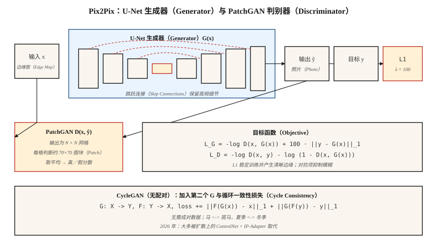

# 条件生成对抗网络与 Pix2Pix（Conditional GANs & Pix2Pix）

> 2014 至 2017 年的第一个重大突破，是控制 GAN 生成什么：附加标签、图像或句子。Pix2Pix 实现了图像条件版本，在窄领域图像到图像任务上，至今仍胜过所有通用文生图模型。

**Type:** Build
**Languages:** Python
**Prerequisites:** 阶段 8 · 03（GAN），阶段 4 · 06（U-Net），阶段 3 · 07（卷积神经网络）
**Time:** ~75 分钟

## 问题（The Problem）

无条件 GAN 随机生成人脸，演示有用，生产无用。你想要的是：*草图转照片*、*地图转航拍照片*、*白天场景转夜晚*、*灰度图上色*。这些任务都给定输入图像 `x`，要求输出具有某种语义对应关系的 `y`。每个 `x` 都有许多合理的 `y`。均方误差（Mean Squared Error，MSE）把它们压成一团模糊；对抗损失不会，因为“看起来真实”要求清晰。

条件生成对抗网络（Conditional Generative Adversarial Network，cGAN；Mirza 与 Osindero，2014）将条件 `c` 同时加入 `G` 和 `D` 的输入。Pix2Pix（Isola 等，2017）将其具体化：条件是完整输入图像，生成器是 U-Net，判别器是*基于图块*的分类器（PatchGAN），损失是对抗项加 L1。即使在 2026 年，这套方案在窄领域图像到图像任务上仍优于从零训练的文生图模型，因为它使用*成对数据（Paired Data）*训练，恰好拥有所需信号。

## 概念（The Concept）



**条件 G。** `G(x, z) → y`。在 Pix2Pix 中，`z` 是 G 内部的随机失活（Dropout），没有输入噪声，因为 Isola 发现显式噪声会被忽略。

**条件 D。** `D(x, y) → [0, 1]`。输入是（条件，输出）*这一对*。关键区别在此：D 必须判断 `y` 是否与 `x` 一致，而不只是 `y` 是否真实。

**U-Net 生成器。** 带跨越瓶颈的跳跃连接（Skip Connection）的编码器与解码器。对输入和输出共享低层结构（边缘、轮廓）的任务至关重要。没有跳跃连接，高频细节会消失。

**PatchGAN 判别器。** D 不输出单一真假分数，而输出 `N×N` 网格，每个单元判断约 70×70 像素的感受野，最后取平均。这是马尔可夫随机场（Markov Random Field）假设：真实感是局部的。训练更快，参数更少，输出更清晰。

**损失。**

```text
loss_G = -log D(x, G(x)) + λ · ||y - G(x)||_1
loss_D = -log D(x, y) - log (1 - D(x, G(x)))
```

L1 项稳定训练，将 G 推向已知目标。L1 比 L2 产生更清晰的边缘，因为求的是中位数而非均值。Pix2Pix 默认 `λ = 100`。

## CycleGAN：没有成对数据时（CycleGAN — when you don't have pairs）

Pix2Pix 需要成对 `(x, y)` 数据。CycleGAN（Zhu 等，2017）通过加入*循环一致性（Cycle Consistency）*损失取消这一要求。两个生成器分别为 `G: X → Y` 和 `F: Y → X`，训练使 `F(G(x)) ≈ x` 且 `G(F(y)) ≈ y`。这样无需成对示例，也能把马转换成斑马、夏季转换成冬季。

2026 年，无配对图像到图像任务主要使用扩散（ControlNet、IP-Adapter）而不是 CycleGAN，但循环一致性思想仍存在于几乎每篇无配对领域适应论文中。

```figure
gx-patchgan
```

## 动手实现（Build It）

`code/main.py` 在一维数据上实现微型条件 GAN。条件 `c` 是类别标签（0 或 1）。任务是从给定类别的条件分布生成一个样本。

### 第 1 步：在 G 与 D 的输入中附加条件（Step 1: append condition to both G and D inputs）

```python
def G(z, c, params):
    return mlp(concat([z, one_hot(c)]), params)

def D(x, c, params):
    return mlp(concat([x, one_hot(c)]), params)
```

独热编码（One-hot Encoding）最简单。较大模型使用学习得到的嵌入（Embedding）、逐特征线性调制（Feature-wise Linear Modulation，FiLM）或交叉注意力（Cross-attention）。

### 第 2 步：进行条件训练（Step 2: train conditional）

```python
for step in range(steps):
    x, c = sample_real_conditional()
    noise = sample_noise()
    update_D(x_real=x, x_fake=G(noise, c), c=c)
    update_G(noise, c)
```

生成器必须匹配*给定条件下*的真实分布，而不是边缘分布。

### 第 3 步：逐类验证输出（Step 3: verify per-class output）

```python
for c in [0, 1]:
    samples = [G(noise, c) for noise in batch]
    mean_c = mean(samples)
    assert_near(mean_c, real_mean_for_class_c)
```

## 常见陷阱（Pitfalls）

- **忽略条件。** G 学会了边缘化，D 因条件信号太弱而从不惩罚。修复：更强地给 D 注入条件（在早期层，而不只在末层），使用投影判别器（Projection Discriminator；Miyato 与 Koyama，2018）。
- **L1 权重太低。** G 漂向任意看似真实、却不忠实于输入的输出。Pix2Pix 类任务从 λ≈100 开始。
- **L1 权重太高。** G 生成模糊输出，因为 L1 仍是 L_p 范数。训练稳定后向下退火。
- **D 中的真实目标泄漏。** 将 `(x, y)` 拼接为 D 输入，而不只是 `y`。否则 D 无法检查一致性。
- **类内模式崩溃（Mode Collapse）。** 每类可独立崩溃。应运行类别条件下的多样性检查。

## 实际应用（Use It）

2026 年图像到图像任务的现状：

| 任务 | 最佳方法 |
|------|---------------|
| 草图 → 照片，同领域、成对数据 | Pix2Pix／Pix2PixHD（仍然快且清晰） |
| 草图 → 照片，无配对 | 配合 Scribble 条件模型的 ControlNet |
| 语义分割 → 照片 | SPADE／GauGAN2 或 SD + ControlNet-Seg |
| 风格迁移（Style Transfer） | 扩散搭配 IP-Adapter 或 LoRA；GAN 方法属于旧方案 |
| 深度 → 照片 | Stable Diffusion 上的 ControlNet-Depth |
| 超分辨率（Super-resolution） | Real-ESRGAN（GAN）、ESRGAN-Plus 或 SD-Upscale（扩散） |
| 上色 | ColTran、基于扩散的上色器或 Pix2Pix-color |
| 白天 → 夜晚、季节、天气 | CycleGAN 或基于 ControlNet 的方案 |

以下条件下 Pix2Pix 仍是合适工具：(a) 有数千组成对示例；(b) 任务狭窄且重复；(c) 需要快速推理。通用开放领域任务由扩散胜出。

## 交付成果（Ship It）

保存 `outputs/skill-img2img-chooser.md`。技能接收任务描述、数据可用性（成对或无配对、N 个样本）、延迟与质量预算，输出：方法（Pix2Pix、CycleGAN、ControlNet 变体、SDXL + IP-Adapter）、训练数据要求、推理成本和评估方案（学习感知图像块相似度（Learned Perceptual Image Patch Similarity，LPIPS）、弗雷歇起始距离（Fréchet Inception Distance，FID）、任务专用指标）。

## 练习（Exercises）

1. **简单。** 修改 `code/main.py`，增加第三个类别。确认 G 仍将每类噪声映射到正确模式。
2. **中等。** 在一维设置中将 L1 换为感知式损失（如用小型冻结 D 做特征提取器）。条件分布的清晰程度是否改变？
3. **困难。** 在一维设置中构造 CycleGAN：两个分布、两个生成器、循环损失。证明它无需成对数据也能学习两者之间的映射。

## 关键术语（Key Terms）

| 术语 | 常见说法 | 实际含义 |
|------|-----------------|-----------------------|
| 条件 GAN（Conditional GAN） | “带标签的 GAN” | G(z, c)、D(x, c)。两个网络都能看到条件。 |
| Pix2Pix | “图像到图像 GAN” | 使用 U-Net G、PatchGAN D 和 L1 损失的成对 cGAN。 |
| U-Net | “带跳跃连接的编码器与解码器” | 对称卷积网络，跳跃连接保留高频信息。 |
| PatchGAN | “局部真实感分类器” | D 输出逐图块分数，而非全局分数。 |
| CycleGAN | “无配对图像转换” | 两个 G 加循环一致性损失，无需成对数据。 |
| SPADE | “GauGAN” | 用语义图归一化中间激活，实现分割到图像生成。 |
| FiLM | “逐特征线性调制” | 条件产生逐特征仿射变换，低成本实现条件控制。 |

## 生产说明：Pix2Pix 作为延迟受限场景的基线（Production note: Pix2Pix as a latency-bound baseline）

有成对数据且任务狭窄（草图 → 渲染、语义图 → 照片、白天 → 夜晚）时，Pix2Pix 单次推理的延迟比扩散低一个数量级。生产对比通常如下：

| 路径 | 步数 | 单张 L4 在 512² 下的典型延迟 |
|------|-------|----------------------------------------|
| Pix2Pix（U-Net 前向传播） | 1 | ~30 ms |
| SD-Inpaint 或 SD-Img2Img | 20 | ~1.2 s |
| SDXL-Turbo Img2Img | 1-4 | ~0.15-0.35 s |
| ControlNet + SDXL base | 20-30 | ~3-5 s |

Pix2Pix 在静态批次吞吐量上胜出（每次请求的浮点运算次数相同）。扩散在质量和泛化上胜出。现代做法常是为窄任务交付 Pix2Pix 式蒸馏模型，再为长尾输入提供扩散后备方案。

## 延伸阅读（Further Reading）

- [Mirza 与 Osindero（2014）：条件生成对抗网络（Conditional Generative Adversarial Nets）](https://arxiv.org/abs/1411.1784)：cGAN 论文。
- [Isola 等（2017）：使用条件对抗网络进行图像到图像转换（Image-to-Image Translation with Conditional Adversarial Networks）](https://arxiv.org/abs/1611.07004)：Pix2Pix。
- [Zhu 等（2017）：使用循环一致对抗网络进行无配对图像转换（Unpaired Image-to-Image Translation using Cycle-Consistent Adversarial Networks）](https://arxiv.org/abs/1703.10593)：CycleGAN。
- [Wang 等（2018）：使用条件 GAN 合成高分辨率图像（High-Resolution Image Synthesis with Conditional GANs）](https://arxiv.org/abs/1711.11585)：Pix2PixHD。
- [Park 等（2019）：使用空间自适应归一化进行语义图像合成（Semantic Image Synthesis with Spatially-Adaptive Normalization）](https://arxiv.org/abs/1903.07291)：SPADE／GauGAN。
- [Miyato 与 Koyama（2018）：带投影判别器的 cGAN（cGANs with Projection Discriminator）](https://arxiv.org/abs/1802.05637)：投影 D。
