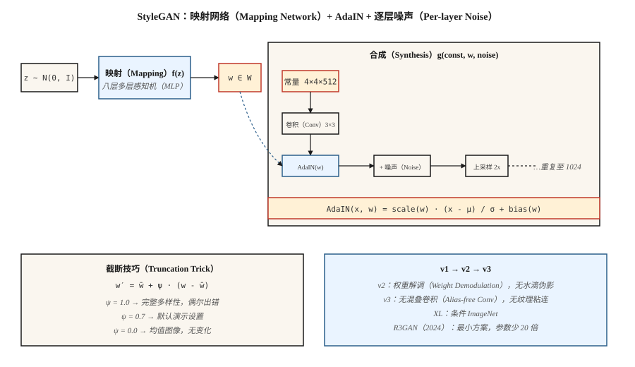

# StyleGAN（StyleGAN）

> 多数生成器将 `z` 同时混入每一层。StyleGAN 将其拆开：先把 `z` 映射成中间变量 `w`，再通过 AdaIN 在每个分辨率层级*注入* `w`。仅此变化就解耦了潜空间，让照片级真实人脸连续七年成为已解决的问题。

**Type:** Build
**Languages:** Python
**Prerequisites:** 阶段 8 · 03（GAN），阶段 4 · 08（归一化），阶段 3 · 07（卷积神经网络）
**Time:** ~45 分钟

## 问题（The Problem）

DCGAN 通过一组转置卷积将 `z` 映射为图像。问题是 `z` 控制一切：姿态、光照、身份、背景纠缠在一起。沿 `z` 的某个轴移动，四者都变。你无法要求模型“同一个人，不同姿态”，因为表示并非如此分解。

Karras 等（2019，NVIDIA）提出：不要直接把 `z` 输入卷积层。用恒定的 `4×4×512` 张量作为网络输入，学习一个八层多层感知机（Multilayer Perceptron，MLP），将 `z ∈ Z → w ∈ W`。通过*自适应实例归一化（Adaptive Instance Normalization，AdaIN）*在每个分辨率注入 `w`：先归一化各卷积特征图，再用 `w` 的仿射投影缩放和平移。逐层加入噪声，提供随机细节（皮肤毛孔、发丝）。

结果是：`W` 中“高层风格”（姿态、身份）和“精细风格”（光照、颜色）的轴大致正交。低分辨率层用图像 A 的 `w`，高分辨率层用图像 B 的 `w`，即可交换两张图像的风格。这开启了编辑、跨领域风格化，以及整个“StyleGAN 反演（Inversion）”研究方向。

## 概念（The Concept）



**映射网络（Mapping Network）。** `f: Z → W`，八层 MLP。`Z = N(0, I)^512`。`W` 不强制为高斯分布，而是学习适合数据的形状。

**合成网络（Synthesis Network）。** 从可学习常量 `4×4×512` 开始。每个分辨率块：`upsample → conv → AdaIN(w_i) → noise → conv → AdaIN(w_i) → noise`。分辨率逐次翻倍：4、8、16、32、64、128、256、512、1024。

**AdaIN。**

```text
AdaIN(x, y) = y_scale · (x - mean(x)) / std(x) + y_bias
```

其中 `y_scale` 与 `y_bias` 来自 `w` 的仿射投影。逐特征图归一化，再重新赋予风格。这里的“风格”是特征图的一阶和二阶统计量。

**逐层噪声（Per-layer Noise）。** 向各特征图加入单通道高斯噪声，由可学习的逐通道因子缩放。控制随机细节而不影响全局结构。

**截断技巧（Truncation Trick）。** 推理时采样 `z`，计算 `w = mapping(z)`，再计算 `w' = ŵ + ψ·(w - ŵ)`，其中 `ŵ` 是大量样本的 `w` 均值。`ψ < 1` 以多样性换质量。几乎每个 StyleGAN 演示都使用 `ψ ≈ 0.7`。

## StyleGAN 1 到 2 到 3（StyleGAN 1 → 2 → 3）

| 版本 | 年份 | 创新 |
|---------|------|------------|
| StyleGAN | 2019 | 映射网络、AdaIN、噪声与渐进增长。 |
| StyleGAN2 | 2020 | 用权重解调（Weight Demodulation）替代 AdaIN（修复水滴伪影）；跳跃／残差架构；路径长度正则化。 |
| StyleGAN3 | 2021 | 无混叠卷积与等变卷积核，消除纹理粘在像素网格上的现象。 |
| StyleGAN-XL | 2022 | 类别条件、1024²、ImageNet。 |
| R3GAN | 2024 | 以更强正则化重塑方案；参数少 20 倍，在 FFHQ-1024 上缩小与扩散的差距。 |

2026 年，StyleGAN3 仍是以下场景的默认方案：(a) 高帧率窄领域照片级真实感；(b) 少样本领域适应（新数据集只有 100 张图，冻结映射网络）；(c) 基于反演的编辑（找到重建真实照片的 `w`，再编辑该 `w`）。开放领域文生图不该选它，应选扩散。

```figure
gx-stylegan-mapping
```

## 动手实现（Build It）

`code/main.py` 在一维中实现玩具“轻量 style-GAN”：映射 MLP、接收可学习常量向量并用 `w` 导出的缩放／偏置进行调制的合成函数，以及逐层噪声。它展示仿射调制注入 `w` 的效果可以匹敌或优于把 `z` 拼接到生成器输入。

### 第 1 步：映射网络（Step 1: mapping network）

```python
def mapping(z, M):
    h = z
    for i in range(num_layers):
        h = leaky_relu(add(matmul(M[f"W{i}"], h), M[f"b{i}"]))
    return h
```

### 第 2 步：自适应实例归一化（Step 2: adaptive instance normalization）

```python
def adain(x, w_scale, w_bias):
    mu = mean(x)
    sd = std(x)
    x_norm = [(xi - mu) / (sd + 1e-8) for xi in x]
    return [w_scale * xi + w_bias for xi in x_norm]
```

逐特征图的缩放与偏置由 `w` 经线性投影得到。

### 第 3 步：逐层噪声（Step 3: per-layer noise）

```python
def add_noise(x, sigma, rng):
    return [xi + sigma * rng.gauss(0, 1) for xi in x]
```

每个通道的 sigma 都可学习。

## 常见陷阱（Pitfalls）

- **水滴伪影（Droplet Artifacts）。** StyleGAN 1 的 AdaIN 将均值清零，导致特征图中出现团状水滴。StyleGAN 2 改为缩放卷积权重，用权重解调修复它。
- **纹理粘连（Texture Sticking）。** StyleGAN 1、2 的纹理跟随像素坐标而非物体坐标，插值时可见。StyleGAN 3 的无混叠卷积用加窗 sinc 滤波器修复。
- **模式覆盖（Mode Coverage）。** 截断 `ψ < 0.7` 看起来干净，却只从狭窄锥形区域采样；需要多样性时用 `ψ = 1.0`。
- **反演有损。** 将真实照片反演到 `W` 通常靠优化或编码器（e4e、ReStyle、HyperStyle）。多次迭代会让结果漂移。

## 实际应用（Use It）

| 用途 | 方法 |
|----------|----------|
| 照片级真实人脸（动漫、产品、窄领域） | StyleGAN3 FFHQ／自定义微调 |
| 从照片编辑人脸 | e4e 反演 + StyleSpace／InterFaceGAN 方向 |
| 换脸／表情动作重演 | StyleGAN + 编码器 + 混合 |
| 虚拟形象流水线 | StyleGAN3 配合自适应判别器增强（Adaptive Discriminator Augmentation，ADA）做少数据微调 |
| 少量图像的领域适应 | 冻结映射网络，微调合成网络 |
| 多模态或文本条件生成 | 不用它，改用扩散 |

对于输出就是“一张人脸照片”的产品级演示，在相同质量门槛下，StyleGAN 在推理成本（单次前向传播，4090 上 <10ms）和清晰度上胜过扩散。

## 交付成果（Ship It）

保存 `outputs/skill-stylegan-inversion.md`。技能接收真实照片，输出：反演方法（e4e／ReStyle／HyperStyle）、预期潜空间损失、编辑预算（在 `W` 中移动多远才出现伪影），以及已验证可用的编辑方向列表（年龄、表情、姿态）。

## 练习（Exercises）

1. **简单。** 分别用 `adain_on=True` 和 `adain_on=False` 运行 `code/main.py`。比较固定潜变量与扰动潜变量的输出分散程度。
2. **中等。** 实现混合正则化（Mixing Regularization）：对训练批次计算 `w_a`、`w_b`，合成前半部分用 `w_a`，后半部分用 `w_b`。解码器是否学到解耦风格？
3. **困难。** 取预训练 StyleGAN3 FFHQ 模型（ffhq-1024.pkl），在有标签样本上训练支持向量机（Support Vector Machine，SVM），找到控制“微笑”的 `w` 方向；报告推动多远后身份开始漂移。

## 关键术语（Key Terms）

| 术语 | 常见说法 | 实际含义 |
|------|-----------------|-----------------------|
| 映射网络（Mapping Network） | “那个 MLP” | `f: Z → W`，八层，将潜空间几何与数据统计解耦。 |
| W 空间（W Space） | “风格空间” | 映射网络的输出，大致解耦。 |
| AdaIN | “自适应实例归一化” | 归一化特征图，再由 `w` 投影进行缩放和平移。 |
| 截断技巧（Truncation Trick） | “Psi” | `w = mean + ψ·(w - mean)`，ψ<1 以多样性换质量。 |
| 路径长度正则化（Path-length Regularization） | “PL 正则化” | 惩罚单位 `w` 变化引起的过大图像变化，使 `W` 更平滑。 |
| 权重解调（Weight Demodulation） | “StyleGAN2 的修复” | 归一化卷积权重而非激活，消除水滴伪影。 |
| 无混叠（Alias-free） | “StyleGAN3 的技巧” | 加窗 sinc 滤波器，消除纹理粘附像素网格。 |
| 反演（Inversion） | “为真实图像找到 w” | 优化或编码 `x → w`，使 `G(w) ≈ x`。 |

## 生产说明：为何 2026 年仍交付 StyleGAN（Production note: why StyleGAN still ships in 2026）

StyleGAN3 在 4090 上生成一张 1024² FFHQ 人脸不到 10 ms：`num_steps = 1`，没有 VAE 解码，没有交叉注意力计算。从生产角度看，这是图像生成器的延迟下限。同分辨率下，50 步 SDXL 加 VAE 解码约需 3 秒，差距为 **300 倍**。对于窄领域产品（虚拟形象服务、身份证件流水线、素材人脸生成），它在总拥有成本（Total Cost of Ownership，TCO）上胜出。

两个运维影响：

- **无需调度器，也无需批处理器。** 达到目标占用率的静态批次最优。连续批处理对大语言模型（LLM）和扩散至关重要，但这里每次请求的浮点运算次数相同，因此没有收益。
- **截断 `ψ` 是安全调节参数。** `ψ < 0.7` 从映射网络值域的狭窄锥形区域采样。这是服务层唯一能控制样本方差的手段。高峰负载时降低 `ψ`，高级用户则提高它。

## 延伸阅读（Further Reading）

- [Karras 等（2019）：基于风格的 GAN 生成器架构（A Style-Based Generator Architecture for GANs）](https://arxiv.org/abs/1812.04948)：StyleGAN。
- [Karras 等（2020）：分析与改进 StyleGAN 图像质量（Analyzing and Improving the Image Quality of StyleGAN）](https://arxiv.org/abs/1912.04958)：StyleGAN2。
- [Karras 等（2021）：无混叠生成对抗网络（Alias-Free Generative Adversarial Networks）](https://arxiv.org/abs/2106.12423)：StyleGAN3。
- [Tov 等（2021）：为 StyleGAN 图像操作设计编码器（Designing an Encoder for StyleGAN Image Manipulation）](https://arxiv.org/abs/2102.02766)：e4e 反演。
- [Sauer 等（2022）：StyleGAN-XL：将 StyleGAN 扩展到大型多样数据集（StyleGAN-XL: Scaling StyleGAN to Large Diverse Datasets）](https://arxiv.org/abs/2202.00273)：StyleGAN-XL。
- [Huang 等（2024）：R3GAN：GAN 已死，GAN 万岁！（R3GAN: The GAN is dead; long live the GAN!）](https://arxiv.org/abs/2501.05441)：现代最小 GAN 方案。
