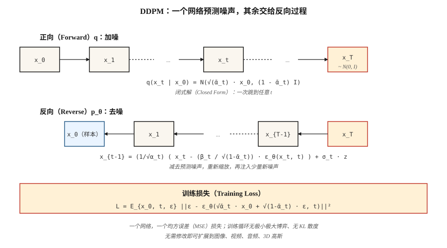

# 扩散模型：从零实现 DDPM（Diffusion Models — DDPM from Scratch）

> Ho、Jain、Abbeel（2020）给出了整个领域难以舍弃的方案：用上千个小步骤加噪破坏数据，训练一个神经网络预测噪声，再在推理时逆转过程。如今主流图像、视频、3D 和音乐模型都运行这一循环，可能再叠加流匹配或一致性技巧。

**Type:** Build
**Languages:** Python
**Prerequisites:** 阶段 3 · 02（反向传播），阶段 8 · 02（VAE）
**Time:** ~75 分钟

## 问题（The Problem）

你需要 `p_data(x)` 的采样器。生成对抗网络（GAN）的极小极大博弈经常发散，变分自编码器（VAE）的高斯解码器产生模糊样本。你真正需要的训练目标应当：(a) 是单一稳定损失（无鞍点，无极小极大博弈）；(b) 是 `log p(x)` 的下界（因此可得到似然）；(c) 生成达到最先进水平的样本。

Sohl-Dickstein 等（2015）给出了理论答案：定义逐步添加高斯噪声的马尔可夫链（Markov Chain）`q(x_t | x_{t-1})`，再训练反向链 `p_θ(x_{t-1} | x_t)` 去噪。Ho、Jain、Abbeel（2020）说明损失可简化为一行：预测噪声，并梳理了数学推导。2020 年它还只是新奇方法；2021 年生成了最先进样本；2022 年成为 Stable Diffusion；2026 年则已成为底层基础。

## 概念（The Concept）



**正向过程（Forward Process）`q`。** 分 `T` 个小步添加高斯噪声。其闭式表达，也就是数学上可处理的原因，在于累计步骤仍然是高斯分布：

```text
q(x_t | x_0) = N( sqrt(α̅_t) · x_0,  (1 - α̅_t) · I )
```

其中，对 `β_t` 调度有 `α̅_t = ∏_{s=1..t} (1 - β_s)`。让 `β_t` 在 T=1000 步中从 1e-4 线性升到 0.02，`x_T` 就近似 `N(0, I)`。

**反向过程（Reverse Process）`p_θ`。** 学习预测所加噪声的神经网络 `ε_θ(x_t, t)`。给定 `x_t`，按下式去噪：

```text
x_{t-1} = (1 / sqrt(α_t)) · ( x_t - (β_t / sqrt(1 - α̅_t)) · ε_θ(x_t, t) )  +  σ_t · z
```

其中 `σ_t` 为 `sqrt(β_t)` 或学习得到的方差。表达式虽难看，却只是代数：根据后验 `q(x_{t-1} | x_t, x_0)` 解出 `x_{t-1}`，再将 `x_0` 替换为由噪声预测得到的估计。

**训练损失。**

```text
L_simple = E_{x_0, t, ε} [ || ε - ε_θ( sqrt(α̅_t) · x_0 + sqrt(1 - α̅_t) · ε,  t ) ||² ]
```

从数据中采样 `x_0`，随机选 `t`，采样 `ε ~ N(0, I)`，用闭式表达一次算出带噪 `x_t`，然后回归噪声。一个损失，无极小极大博弈，无 KL，无重参数化技巧。

**采样（Sampling）。** 从 `x_T ~ N(0, I)` 开始，按 `t = T` 到 `1` 迭代反向步骤，即完成。

## 为何有效（Why it works）

三个直觉：

1. **去噪容易，生成困难。** 在 `t=T` 时数据是纯噪声，网络要解决的是简单问题；在 `t=0` 时网络只需清理少量像素。中间 `t` 的问题较难，但所有噪声水平的大量梯度都流经相同权重。

2. **变相的分数匹配（Score Matching）。** Vincent（2011）证明，预测噪声等价于估计 `∇_x log q(x_t | x_0)`，即*分数（Score）*。反向随机微分方程（Stochastic Differential Equation，SDE）用它沿密度梯度上行，形成朝向高概率区域的有引导随机游走。

3. **证据下界（Evidence Lower Bound，ELBO）简化为均方误差（Mean Squared Error，MSE）。** 完整变分下界每个时间步都有 KL 项。采用 DDPM 参数化后，这些项简化为带特定系数的噪声预测 MSE；Ho 去掉系数，称为“简单”损失，质量反而*提高*。

```figure
diffusion-denoise
```

## 动手实现（Build It）

`code/main.py` 实现一维 DDPM。数据是双模态混合分布。“网络”是接收 `(x_t, t)` 并输出预测噪声的微型多层感知机（MLP）。训练采用一行损失，采样迭代反向链。

### 第 1 步：正向调度的闭式形式（Step 1: the forward schedule (closed form)）

```python
betas = [1e-4 + (0.02 - 1e-4) * t / (T - 1) for t in range(T)]
alphas = [1 - b for b in betas]
alpha_bars = []
cum = 1.0
for a in alphas:
    cum *= a
    alpha_bars.append(cum)
```

### 第 2 步：一次采样得到 `x_t`（Step 2: sample x_t in one shot）

```python
def forward_sample(x0, t, alpha_bars, rng):
    a_bar = alpha_bars[t]
    eps = rng.gauss(0, 1)
    x_t = math.sqrt(a_bar) * x0 + math.sqrt(1 - a_bar) * eps
    return x_t, eps
```

### 第 3 步：一次训练步骤（Step 3: one training step）

```python
def train_step(x0, model, alpha_bars, rng):
    t = rng.randrange(T)
    x_t, eps = forward_sample(x0, t, alpha_bars, rng)
    eps_hat = model_forward(model, x_t, t)
    loss = (eps - eps_hat) ** 2
    return loss, gradient_step(model, ...)
```

### 第 4 步：反向采样（Step 4: reverse sampling）

```python
def sample(model, alpha_bars, T, rng):
    x = rng.gauss(0, 1)
    for t in range(T - 1, -1, -1):
        eps_hat = model_forward(model, x, t)
        beta_t = 1 - alphas[t]
        x = (x - beta_t / math.sqrt(1 - alpha_bars[t]) * eps_hat) / math.sqrt(alphas[t])
        if t > 0:
            x += math.sqrt(beta_t) * rng.gauss(0, 1)
    return x
```

对 40 个时间步、24 单元 MLP 的一维问题，约 200 个训练轮次即可学会双模态混合分布。

## 时间条件（Time conditioning）

网络需要知道正在对哪个时间步去噪。两种标准方式：

- **正弦嵌入（Sinusoidal Embedding）。** 类似 Transformer 位置编码。`embed(t) = [sin(t/ω_0), cos(t/ω_0), sin(t/ω_1), ...]`。经 MLP 后广播进网络。
- **FiLM／组归一化条件控制（Group-norm Conditioning）。** 每个块将嵌入投影为逐通道缩放／偏置（逐特征线性调制（Feature-wise Linear Modulation，FiLM））。

玩具代码使用正弦嵌入再拼接。生产 U-Net 使用 FiLM。

## 常见陷阱（Pitfalls）

- **调度影响很大。** 线性 `β` 是 DDPM 默认值，但余弦调度（Nichol 与 Dhariwal，2021）在相同计算量下 FID 更好。质量停滞时切换调度。
- **时间步嵌入容易出问题。** 将原始 `t` 作为浮点数输入在一维玩具中可行，图像中不行；始终使用恰当嵌入。
- **v 预测与 ε 预测（V-prediction vs ε-prediction）。** 在局部区间（t 很小或很大）`ε` 的信噪比较差。v 预测（`v = α·ε - σ·x`）更稳定；SDXL、SD3、Flux 都使用它。
- **无分类器引导（Classifier-Free Guidance，CFG）。** 推理时计算条件与无条件 `ε`，然后按 `ε_cfg = (1 + w) · ε_cond - w · ε_uncond` 混合，`w ≈ 3-7`。见第 08 课。
- **1000 步太多。** 生产使用去噪扩散隐式模型（Denoising Diffusion Implicit Model，DDIM；20 至 50 步）、DPM-Solver（10 至 20 步）或蒸馏（1 至 4 步）。见第 12 课。

## 实际应用（Use It）

| 用途 | 2026 年典型技术栈 |
|------|-----------------------|
| 图像像素空间扩散（小型、玩具） | DDPM + U-Net |
| 图像潜空间扩散 | VAE 编码器 + U-Net 或扩散 Transformer（Diffusion Transformer，DiT；第 07 课） |
| 视频潜空间扩散 | 时空 DiT（Sora、Veo、WAN） |
| 音频潜空间扩散 | Encodec + 扩散 Transformer |
| 科学（分子、蛋白质、物理） | 等变扩散（Equivariant Diffusion；EDM、RFdiffusion、AlphaFold3） |

扩散是通用生成骨干。流匹配（Flow Matching，第 13 课）是 2024 至 2026 年的竞争者，在相同质量下通常推理更快。

## 交付成果（Ship It）

保存 `outputs/skill-diffusion-trainer.md`。技能接收数据集与计算预算，输出：调度（线性／余弦／sigmoid）、预测目标（ε／v／x）、步数、引导尺度、采样器类别与评估方案。

## 练习（Exercises）

1. **简单。** 将 `code/main.py` 的 T 从 40 改为 10。样本质量（输出的可视化直方图）如何下降？T 为多少时双模态结构崩溃？
2. **中等。** 从 ε 预测改成 v 预测，重新推导反向步骤，比较最终样本质量。
3. **困难。** 加入 CFG。以类别标签 `c ∈ {0, 1}` 为条件，训练时以 10% 概率丢弃标签，采样时使用 `ε = (1+w)·ε_cond - w·ε_uncond`。测量 `w = 0, 1, 3, 7` 时条件模式命中率。

## 关键术语（Key Terms）

| 术语 | 常见说法 | 实际含义 |
|------|-----------------|-----------------------|
| 正向过程（Forward Process） | “加噪” | 破坏数据的固定马尔可夫链 `q(x_t \| x_{t-1})`。 |
| 反向过程（Reverse Process） | “去噪” | 重建数据的学习链 `p_θ(x_{t-1} \| x_t)`。 |
| β 调度（β Schedule） | “噪声阶梯” | 每步方差，可以是线性、余弦或 sigmoid。 |
| α̅ | “Alpha bar” | 累积乘积 `∏(1 - β)`；给出从 `x_0` 得到 `x_t` 的闭式形式。 |
| 简单损失（Simple Loss） | “噪声上的 MSE” | `\|\|ε - ε_θ(x_t, t)\|\|²`；所有变分推导最终归于此。 |
| ε 预测（ε-prediction） | “预测噪声” | 输出所加噪声，标准 DDPM 做法。 |
| v 预测（V-prediction） | “预测速度” | 输出 `α·ε - σ·x`，跨 t 的条件性质更好。 |
| 去噪扩散概率模型（Denoising Diffusion Probabilistic Model，DDPM） | “那篇论文” | Ho 等，2020；线性 β、1000 步、U-Net。 |
| DDIM | “确定性采样器” | 非马尔可夫采样器，20 至 50 步，训练目标相同。 |
| 无分类器引导（Classifier-Free Guidance） | “CFG” | 混合条件和无条件噪声预测，强化条件控制。 |

## 生产说明：扩散推理的核心是步数（Production note: diffusion inference is a step-count problem）

DDPM 论文运行 T=1000 个反向步骤。生产没人这么做。实际推理栈都从三类策略中选择，每类都可对应生产问题“延迟来自哪里”：

1. **更快采样器，同一模型。** DDIM（20 至 50 步）、DPM-Solver++（10 至 20）、UniPC（8 至 16）。直接替换反向循环，不动训练好的 `ε_θ` 权重。延迟降低 20 至 50 倍。
2. **蒸馏（Distillation）。** 训练学生用更少步数匹配教师：渐进蒸馏（Progressive Distillation；2 → 1）、一致性模型（Consistency Models；任意步数 → 1 至 4）、LCM、SDXL-Turbo、SD3-Turbo。再降低 5 至 10 倍延迟，但需重新训练。
3. **缓存与编译。** `torch.compile(unet, mode="reduce-overhead")`、TensorRT-LLM 扩散后端、`xformers`／SDPA 注意力、bf16 权重。每步延迟约降低 2 倍，可与 (1)、(2) 叠加。

生产扩散服务器的预算讨论与文献中大语言模型（LLM）的讨论相同：延迟为 `num_steps × step_cost + VAE_decode`，吞吐量为 `batch_size × (num_steps × step_cost)^-1`。首词元时间（Time to First Token，TTFT）很小（一步）；相当于每输出词元时间（Time per Output Token，TPOT）的量是完整响应时间，因为用户看到的图像生成是“一次全部出现”。

## 延伸阅读（Further Reading）

- [Sohl-Dickstein 等（2015）：利用非平衡热力学进行深度无监督学习（Deep Unsupervised Learning using Nonequilibrium Thermodynamics）](https://arxiv.org/abs/1503.03585)：超前的扩散论文。
- [Ho、Jain、Abbeel（2020）：去噪扩散概率模型（Denoising Diffusion Probabilistic Models）](https://arxiv.org/abs/2006.11239)：DDPM。
- [Song、Meng、Ermon（2021）：去噪扩散隐式模型（Denoising Diffusion Implicit Models）](https://arxiv.org/abs/2010.02502)：DDIM，更少步数。
- [Nichol 与 Dhariwal（2021）：改进 DDPM（Improved DDPM）](https://arxiv.org/abs/2102.09672)：余弦调度、可学习方差。
- [Dhariwal 与 Nichol（2021）：扩散模型在图像合成上击败 GAN（Diffusion Models Beat GANs on Image Synthesis）](https://arxiv.org/abs/2105.05233)：分类器引导。
- [Ho 与 Salimans（2022）：无分类器扩散引导（Classifier-Free Diffusion Guidance）](https://arxiv.org/abs/2207.12598)：CFG。
- [Karras 等（2022）：阐明基于扩散的生成模型设计空间（Elucidating the Design Space of Diffusion-Based Generative Models，EDM）](https://arxiv.org/abs/2206.00364)：统一符号，最清晰的方案。
