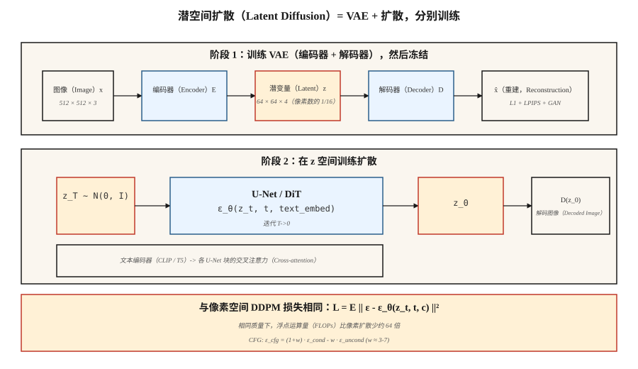

# 潜空间扩散与 Stable Diffusion（Latent Diffusion & Stable Diffusion）

> 在 512×512 图像上做像素空间扩散，计算浪费堪称灾难。Rombach 等（2022）注意到，生成图像不需要全部 786k 维，只需足够表达语义结构的维度，剩余部分交给单独的解码器。在 VAE 潜空间里运行扩散，这一个想法就是 Stable Diffusion。

**Type:** Build
**Languages:** Python
**Prerequisites:** 阶段 8 · 02（VAE），阶段 8 · 06（DDPM），阶段 7 · 09（视觉 Transformer）
**Time:** ~75 分钟

## 问题（The Problem）

512² 像素空间扩散意味着 U-Net 处理形状为 `[B, 3, 512, 512]` 的张量。500M 参数 U-Net 每个采样步骤约需 100 GFLOPS。50 步就是每张图像 5 TFLOPS。在十亿张图像上训练，计算账单高得离谱。

多数浮点运算都在把感知上不重要的细节送过网络，这些高频纹理本可由有损变分自编码器（Variational Autoencoder，VAE）压缩掉。Rombach 的思路：先训练一次 VAE（*第一阶段*），冻结它，再完全在四通道 64×64 潜空间运行扩散（*第二阶段*）。同一个 U-Net，像素数为 1/16，质量相当时浮点运算约少 64 倍。

这就是 Stable Diffusion 方案。SD 1.x／2.x 用 860M U-Net 处理 `64×64×4` 潜变量，SDXL 用 2.6B U-Net 处理 `128×128×4`，SD3 将 U-Net 换成带流匹配（Flow Matching）的扩散 Transformer（Diffusion Transformer，DiT）。Flux.1-dev（Black Forest Labs，2024）提供 12B 参数的 DiT-MMDiT。它们都运行在同一两阶段基础上。

## 概念（The Concept）



**两个阶段，分别训练。**

1. **阶段 1：VAE。** 编码器 `E(x) → z`，解码器 `D(z) → x`。压缩目标：每个空间轴下采样 8 倍，再调整通道，使潜变量总大小约为像素数的 1/16。损失 = 重建（L1 + 学习感知图像块相似度（Learned Perceptual Image Patch Similarity，LPIPS）感知损失）+ KL（权重小，不强迫 `z` 过于高斯，因为无需从 `z` 精确采样）。常加入对抗损失训练，使解码图像清晰。

2. **阶段 2：在 `z` 上扩散。** 将 `z = E(x_real)` 视为数据，训练 U-Net（或 DiT）对 `z_t` 去噪。推理时通过扩散采样 `z_0`，再令 `x = D(z_0)`。

**文本条件（Text Conditioning）。** 额外两个组件。冻结文本编码器（SD 1.x 用 CLIP-L，SD 2/XL 用 CLIP-L+OpenCLIP-G，SD3 和 Flux 用 T5-XXL）。交叉注意力（Cross-attention）注入：每个 U-Net 块接收 `[Q = image features, K = V = text tokens]` 并混合。词元（Token）是文本影响图像的唯一途径。

**损失函数与第 06 课完全相同。** 同样是在噪声上的 DDPM／流匹配均方误差（MSE），只更换数据域。

## 架构变体（Architecture variants）

| 模型 | 年份 | 骨干 | 潜变量形状 | 文本编码器 | 参数 |
|-------|------|----------|--------------|--------------|--------|
| SD 1.5 | 2022 | U-Net | 64×64×4 | CLIP-L（77 词元） | 860M |
| SD 2.1 | 2022 | U-Net | 64×64×4 | OpenCLIP-H | 865M |
| SDXL | 2023 | U-Net + 精修器（Refiner） | 128×128×4 | CLIP-L + OpenCLIP-G | 2.6B + 6.6B |
| SDXL-Turbo | 2023 | 蒸馏模型 | 128×128×4 | 同上 | 1 至 4 步采样 |
| SD3 | 2024 | 多模态 DiT（Multimodal DiT，MMDiT） | 128×128×16 | T5-XXL + CLIP-L + CLIP-G | 2B / 8B |
| Flux.1-dev | 2024 | MMDiT | 128×128×16 | T5-XXL + CLIP-L | 12B |
| Flux.1-schnell | 2024 | 蒸馏 MMDiT | 128×128×16 | T5-XXL + CLIP-L | 12B，1 至 4 步 |

趋势：用 DiT 替换 U-Net（在潜变量图块上运行 Transformer），扩大文本编码器（T5 在提示词遵循上优于 CLIP），增加潜变量通道（4 → 16 为更多细节留出空间）。

```figure
noise-schedule
```

## 动手实现（Build It）

`code/main.py` 在第 06 课 DDPM 上叠加玩具一维“VAE”（用于演示的恒等编码器与解码器；真实 VAE 会是卷积网络），并通过无分类器引导（Classifier-Free Guidance，CFG）加入类别条件。它展示，无论处理原始一维值还是编码值，同样的扩散损失都有效，这正是关键洞见。

### 第 1 步：编码器与解码器（Step 1: encoder/decoder）

```python
def encode(x):    return x * 0.5          # toy "compression" to smaller scale
def decode(z):    return z * 2.0
```

真实 VAE 有训练好的权重。教学中，这个线性映射足以说明扩散在 `z` 上运行，无需关心原始数据空间。

### 第 2 步：在 `z` 空间扩散（Step 2: diffusion in z-space）

与第 06 课相同的 DDPM。网络看到的数据是 `z = E(x)`。采样 `z_0` 后，用 `D(z_0)` 解码。

### 第 3 步：无分类器引导（Step 3: classifier-free guidance）

训练时以 10% 概率丢弃类别标签（换为空词元）。推理时计算 `ε_cond` 与 `ε_uncond`，然后：

```python
eps_cfg = (1 + w) * eps_cond - w * eps_uncond
```

`w = 0` 表示无引导（完整多样性），`w = 3` 是默认值，`w = 7+` 会饱和／过度锐化。

### 第 4 步：文本条件，概念而非代码（Step 4: text conditioning (concept, not code)）

用冻结文本编码器的输出替换类别标签。通过交叉注意力将文本嵌入输入 U-Net：

```python
h = h + CrossAttention(Q=h, K=text_embed, V=text_embed)
```

这就是类别条件扩散模型与 Stable Diffusion 唯一实质差别。

## 常见陷阱（Pitfalls）

- **VAE 尺度不匹配。** SD 1.x VAE 编码后应用缩放常量（`scaling_factor ≈ 0.18215`）。忘记它会让 U-Net 在方差严重错误的潜变量上训练。每个检查点都自带一个。
- **文本编码器静默出错。** SD3 需要至少 128 词元的 T5-XXL，退回仅 CLIP 会损失信息。务必检查 `use_t5=True`，否则提示词保真度骤降。
- **混用潜空间。** SDXL、SD3、Flux 使用不同 VAE。在 SDXL 潜变量上训练的低秩适配（Low-Rank Adaptation，LoRA）不能用于 SD3。Hugging Face diffusers 0.30+ 拒绝加载不匹配检查点。
- **CFG 太高。** `w > 10` 产生过饱和、油腻图像，过拟合提示词而牺牲多样性。最佳区间为 `w = 3-7`。
- **负向提示词泄漏。** 空负向提示词变成空词元；有内容的负向提示词成为 `ε_uncond`。两者不同，有些流水线静默默认使用空词元。

## 实际应用（Use It）

2026 年生产技术栈：

| 目标 | 推荐骨干 |
|--------|----------------------|
| 窄领域、成对数据、从零训练模型 | SDXL 微调（LoRA／全量），交付最快 |
| 开放领域文生图、开放权重 | Flux.1-dev（12B，Apache／非商业）或 SD3.5-Large |
| 最快推理、开放权重 | Flux.1-schnell（1 至 4 步，Apache）或 SDXL-Lightning |
| 最佳提示词遵循、托管 | GPT-Image／DALL-E 3（仍然）、Midjourney v7、Imagen 4 |
| 编辑工作流 | Flux.1-Kontext（2024 年 12 月），原生接收图像与文本 |
| 研究、基线 | SD 1.5，虽旧但研究充分 |

## 交付成果（Ship It）

保存 `outputs/skill-sd-prompter.md`。技能接收文本提示词与目标风格，输出：模型与检查点、CFG 尺度、采样器、负向提示词、分辨率、可选 ControlNet／IP-Adapter 组合，以及逐步质量检查清单。

## 练习（Exercises）

1. **简单。** 使用引导 `w ∈ {0, 1, 3, 7, 15}` 运行 `code/main.py`，按类别记录样本均值。在哪个 `w` 下类别均值偏离并超出真实数据均值？
2. **中等。** 将玩具线性编码器换成带重建损失的 tanh-MLP 编码器与解码器。在新潜变量上重新训练扩散。样本质量是否改变？
3. **困难。** 用 diffusers 配置真实 Stable Diffusion 推理：加载 `sdxl-base`，CFG=7，运行 30 个 Euler 步并计时。再换成 `sdxl-turbo`，4 步、CFG=0。同一主体、不同质量，描述变化及原因。

## 关键术语（Key Terms）

| 术语 | 常见说法 | 实际含义 |
|------|-----------------|-----------------------|
| 第一阶段（First Stage） | “VAE” | 训练好的编码器与解码器，将 512² 压缩为 64²。 |
| 第二阶段（Second Stage） | “U-Net” | 潜空间上的扩散模型。 |
| CFG | “引导尺度” | `(1+w)·ε_cond - w·ε_uncond`；调节条件强度。 |
| 空词元（Null Token） | “空提示词嵌入” | 用于 `ε_uncond` 的无条件嵌入。 |
| 交叉注意力（Cross-attention） | “文本进入的方式” | 每个 U-Net 块将文本词元作为 K 和 V 进行注意力计算。 |
| DiT | “扩散 Transformer” | 用潜变量图块上的 Transformer 替代 U-Net，扩展性更好。 |
| MMDiT | “多模态 DiT” | SD3 架构，文本与图像流通过联合注意力交互。 |
| VAE 缩放因子（VAE Scaling Factor） | “魔法数字” | 潜变量除以约 5.4，让扩散在单位方差空间运行。 |

## 生产说明：在 8GB 消费级 GPU 上运行 Flux-12B（Production note: running Flux-12B on an 8GB consumer GPU）

参考 Flux 集成是“我只有消费级 GPU，能交付吗？”的典型方案。技巧是将生产推理文献中的同一套三项调节方法应用到扩散 DiT：

1. **错峰加载（Staggered Loading）。** Flux 有三个无需同时驻留显存的网络：T5-XXL 文本编码器（fp32 约 10 GB）、CLIP-L（小）、12B MMDiT，以及 VAE。先编码提示词，*删除*编码器，加载 DiT，去噪，*删除* DiT，再加载 VAE 解码。消费级 8GB GPU 每次只能容纳一个阶段。
2. **通过 bitsandbytes 做 4 位量化（Quantization）。** T5 编码器和 DiT 都使用 `BitsAndBytesConfig(load_in_4bit=True, bnb_4bit_compute_dtype=torch.bfloat16)`。内存减少 8 倍；根据 Aritra 的基准测试（笔记本中有链接），文生图质量下降不可察觉。
3. **CPU 卸载（CPU Offload）。** `pipe.enable_model_cpu_offload()` 随前向传播自动在 CPU 与 GPU 间交换模块。延迟增加 10% 至 20%，但让流水线得以运行。

内存计算：量化 T5 为 `10 GB T5 / 8 = 1.25 GB`，量化 DiT 为 `12 B params × 0.5 bytes = ~6 GB`，另加激活。用 stas00 的术语，这是张量并行（Tensor Parallelism，TP）=1 推理的极端情形：无模型并行，量化到极致。生产会在 H100 上运行 TP=2 或 TP=4；单台开发笔记本则使用此方案。

## 延伸阅读（Further Reading）

- [Rombach 等（2022）：使用潜空间扩散模型合成高分辨率图像（High-Resolution Image Synthesis with Latent Diffusion Models）](https://arxiv.org/abs/2112.10752)：Stable Diffusion。
- [Podell 等（2023）：SDXL：改进潜空间扩散模型以合成高分辨率图像（SDXL: Improving Latent Diffusion Models for High-Resolution Image Synthesis）](https://arxiv.org/abs/2307.01952)：SDXL。
- [Peebles 与 Xie（2023）：使用 Transformer 的可扩展扩散模型（Scalable Diffusion Models with Transformers，DiT）](https://arxiv.org/abs/2212.09748)：DiT。
- [Esser 等（2024）：扩展整流流 Transformer 以合成高分辨率图像（Scaling Rectified Flow Transformers for High-Resolution Image Synthesis）](https://arxiv.org/abs/2403.03206)：SD3、MMDiT。
- [Ho 与 Salimans（2022）：无分类器扩散引导（Classifier-Free Diffusion Guidance）](https://arxiv.org/abs/2207.12598)：CFG。
- [Labs（2024）：Flux.1，Black Forest Labs 公告（Black Forest Labs announcement）](https://blackforestlabs.ai/announcing-black-forest-labs/)：Flux.1 系列。
- [Hugging Face Diffusers 文档](https://huggingface.co/docs/diffusers/index)：上述所有检查点的参考实现。
