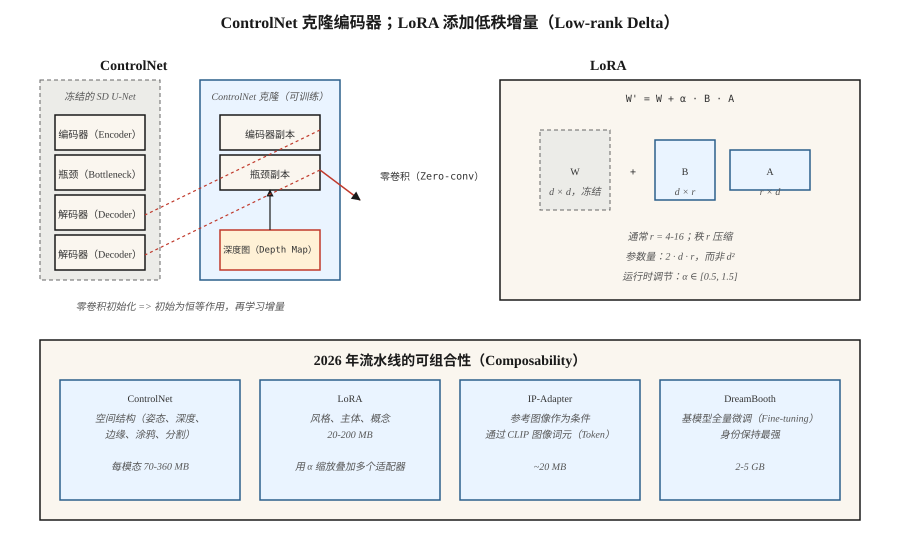

# ControlNet、LoRA 与条件控制（ControlNet, LoRA & Conditioning）

> 仅靠文本，控制信号很笨拙。ControlNet 让你克隆预训练扩散模型，用深度图、姿态骨架、涂鸦或边缘图引导它。LoRA 让你只训练一千万个参数，就能微调二十亿参数的模型。两者共同把 Stable Diffusion 从玩具变成 2026 年各家机构交付的图像流水线。

**Type:** Build
**Languages:** Python
**Prerequisites:** 阶段 8 · 07（潜空间扩散），阶段 10（从零实现大语言模型，提供 LoRA 基础）
**Time:** ~75 分钟

## 问题（The Problem）

“穿红裙的女人在繁忙街道上遛狗”这样的提示词，没有告诉模型狗在*哪里*、女人是什么*姿态*、街道是什么*透视*。文本只能确定描述图像所需信息的约 10%。其余是视觉信息，难以用语言高效描述。

为每种信号（姿态、深度、canny、分割）从零训练新条件模型，代价过高。你希望冻结 2.6B 参数的 SDXL 骨干，附加一个读取条件的小型侧支网络，让它推动骨干的中间特征。这就是 ControlNet。

你还希望教模型新概念（你的脸、产品、风格），而不重训整个模型，希望参数增量小 100 倍。这就是低秩适配（Low-Rank Adaptation，LoRA），插入现有注意力权重的低秩适配器。

ControlNet + LoRA + 文本，就是 2026 年实践者的工具箱。多数生产图像流水线会在 SDXL／SD3／Flux 基模型上叠加 2 至 5 个 LoRA、1 至 3 个 ControlNet 和一个 IP-Adapter。

## 概念（The Concept）



### ControlNet（Zhang 等，2023）（ControlNet (Zhang et al., 2023)）

取预训练 SD，*克隆* U-Net 的编码器半部，冻结原网络。训练克隆网络接收额外条件输入（边缘、深度、姿态）。通过*零卷积（Zero Convolution）*跳跃连接，将克隆网络接回原网络的解码器半部（初始化为零的 1×1 卷积，开始无操作，再学习增量）。

```text
SD U-Net decoder:   ... ← orig_enc_features + zero_conv(controlnet_enc(condition))
```

零卷积初始化意味着 ControlNet 从恒等作用开始，训练前也不会破坏原模型。用标准扩散损失，在 1M 组（提示词、条件、图像）三元组上训练。

各模态 ControlNet 以小型侧支模型交付（SDXL 约 360M，SD 1.5 约 70M）。推理时可组合：

```text
features += weight_a * control_a(depth) + weight_b * control_b(pose)
```

### LoRA（Hu 等，2021）（LoRA (Hu et al., 2021)）

对模型中任意线性层 `W ∈ R^{d×d}`，冻结 `W` 并加入低秩增量：

```text
W' = W + ΔW,  ΔW = B @ A,  A ∈ R^{r×d},  B ∈ R^{d×r}
```

其中 `r << d`。注意力通常用秩 4 至 16，重度微调用秩 64 至 128。新增参数数目为 `2 · d · r`，而不是 `d²`。SDXL 注意力若 `d=640`、`r=16`，每个适配器为 20k 参数而非 410k，少 20 倍。整个模型来看，LoRA 通常 20 至 200MB，基模型则为 5GB。

推理时可以缩放 LoRA：`W' = W + α · B @ A`。`α = 0.5-1.5` 很常见。多个 LoRA 可相加叠加，但仍须注意它们会非线性交互。

### IP-Adapter（Ye 等，2023）（IP-Adapter (Ye et al., 2023)）

一个除文本外还接收*图像*条件的微型适配器。使用 CLIP 图像编码器产生图像词元（Token），与文本词元一起注入交叉注意力（Cross-attention）。每个基模型约 20MB。无需 LoRA，就能“按这张参考图的风格生成图像”。

## 组合矩阵（Composability matrix）

| 工具 | 控制内容 | 大小 | 使用时机 |
|------|------------------|------|-------------|
| ControlNet | 空间结构（姿态、深度、边缘） | 70-360MB | 精确布局、构图 |
| LoRA | 风格、主体、概念 | 20-200MB | 个性化、风格 |
| IP-Adapter | 参考图像中的风格或主体 | 20MB | 文本无法描述外观 |
| 文本反演（Textual Inversion） | 将单个概念表示为新词元 | 10KB | 旧方案，大多已被 LoRA 替代 |
| DreamBooth | 针对主体全量微调 | 2-5GB | 强身份保持、高计算预算 |
| T2I-Adapter | 更轻的 ControlNet 替代方案 | 70MB | 边缘设备、推理预算受限 |

ControlNet 约等于空间控制，LoRA 约等于语义控制。两者一起用。

```figure
v4-controlnet-zero
```

## 动手实现（Build It）

`code/main.py` 在一维中模拟两种机制：

1. **LoRA。** 冻结预训练线性层 `W`。训练低秩 `B @ A`，使 `W + BA` 匹配目标线性层。展示 `r = 1` 足以完美学习秩为 1 的修正。

2. **轻量 ControlNet。** 一个“冻结基模型”预测器，加上读取额外信号的“侧支网络”。侧支输出由初始化为零的可学习标量门控（本例的零卷积版本）。训练并观察门值逐渐增加。

### 第 1 步：LoRA 数学（Step 1: LoRA math）

```python
def lora(W, A, B, x, alpha=1.0):
    # W is frozen; A, B are the trainable low-rank factors.
    return [W[i][j] * x[j] for i, j in ...] + alpha * (B @ (A @ x))
```

### 第 2 步：零初始化侧支网络（Step 2: zero-init side network）

```python
side_out = control_net(x, condition)
gated = gate * side_out  # gate initialized to 0
h = base(x) + gated
```

第 0 步输出与基模型完全相同。早期训练缓慢更新 `gate`，不会出现灾难性漂移。

## 常见陷阱（Pitfalls）

- **LoRA 缩放过大。** `α = 2` 或 `α = 3` 是常见的“增强效果”做法，却会产生过度风格化或损坏的输出。保持 `α ≤ 1.5`。
- **ControlNet 权重冲突。** 姿态 ControlNet 和深度 ControlNet 都用权重 1.0，通常会过度控制。安全默认值是权重和约为 1.0。
- **LoRA 用错基模型。** SDXL LoRA 在 SD 1.5 上因注意力维度不匹配而静默无效。Diffusers 0.30+ 会警告。
- **文本反演漂移。** 在某检查点训练的词元换到另一检查点会严重漂移。LoRA 更易移植。
- **LoRA 权重合并与存储。** 可将 LoRA 烘焙进基模型权重以加快推理（运行时无需相加），但会失去运行时缩放 `α` 的能力。保留两个版本。

## 实际应用（Use It）

| 目标 | 2026 年流水线 |
|------|---------------|
| 复现品牌美术风格 | 约 30 张精选图像上训练秩 32 的 LoRA |
| 将我的脸放入生成图像 | DreamBooth 或 LoRA + IP-Adapter-FaceID |
| 指定姿态与提示词 | ControlNet-Openpose + SDXL + 文本 |
| 感知深度的构图 | ControlNet-Depth + SD3 |
| 参考图与提示词 | IP-Adapter + 文本 |
| 精确布局 | ControlNet-Scribble 或 ControlNet-Canny |
| 替换背景 | ControlNet-Seg + 局部重绘（Inpainting，第 09 课） |
| 快速单步风格 | SDXL-Turbo 上的 LCM-LoRA |

## 交付成果（Ship It）

保存 `outputs/skill-sd-toolkit-composer.md`。技能接收任务（输入素材：提示词、可选参考图、可选姿态、可选深度、可选涂鸦），输出工具组合、权重，以及可复现的种子方案。

## 练习（Exercises）

1. **简单。** 在 `code/main.py` 中将 LoRA 秩 `r` 从 1 变到 4。哪个秩能精确匹配秩为 2 的目标增量？
2. **中等。** 针对两个目标变换分别训练 LoRA，一起加载并展示相加交互。交互何时破坏线性？
3. **困难。** 用 diffusers 叠加 SDXL-base + Canny-ControlNet（权重 0.8）+ 风格 LoRA（α 0.8）+ IP-Adapter（权重 0.6）。改变组合权重，测量弗雷歇起始距离（FID）与提示词遵循的权衡。

## 关键术语（Key Terms）

| 术语 | 常见说法 | 实际含义 |
|------|-----------------|-----------------------|
| ControlNet | “空间控制” | 克隆编码器与零卷积跳跃连接，读取条件图像。 |
| 零卷积（Zero Convolution） | “从恒等开始” | 初始化为零的 1×1 卷积；ControlNet 起初无操作。 |
| LoRA | “低秩适配器” | `W + B @ A`，`r << d`；比全量微调少 100 倍参数。 |
| 秩 r（rank r） | “调节参数” | LoRA 压缩程度，通常 4 至 16，重度个性化为 64 以上。 |
| α | “LoRA 强度” | 运行时缩放 LoRA 增量。 |
| IP-Adapter | “参考图像” | 通过 CLIP 图像词元实现的小型图像条件适配器。 |
| DreamBooth | “完整主体微调” | 用主体约 30 张图像训练整个模型。 |
| 文本反演（Textual Inversion） | “新词元” | 只学习新词嵌入；旧方法，大多已被替代。 |

## 生产说明：LoRA 切换、ControlNet 通路与多租户服务（Production note: LoRA swaps, ControlNet lanes, multi-tenant serving）

真实文生图软件即服务（Software as a Service，SaaS）会在同一基检查点上提供数百个 LoRA 和十来个 ControlNet。服务问题类似大语言模型（LLM）多租户，生产文献在连续批处理与 LoRAX／S-LoRA 中讨论了 LLM 情形：

- **热切换 LoRA，不合并。** 将 `W' = W + α·B·A` 合入基模型，可使每步推理快约 3% 至 5%，却固定了 `α` 和基模型。将 LoRA 作为秩 r 增量热驻留显存；diffusers 提供 `pipe.load_lora_weights()` + `pipe.set_adapters([...], adapter_weights=[...])`，逐请求激活。切换成本是 `2 · d · r · num_layers` 个权重，MB 级，耗时不到一秒。
- **ControlNet 是第二条注意力通路。** 克隆编码器与基模型并行运行。两个权重各为 1.0 的 ControlNet，意味着每步增加两次前向传播，不是一次合并传播。批大小余量按平方下降。每个活跃 ControlNet 预算约 1.5 倍单步成本。
- **LoRA 也量化。** 基模型量化后（见第 07 课，8GB 上的 Flux），LoRA 增量也能良好量化为 8 位或 4 位。量化低秩适配（Quantized LoRA，QLoRA）式加载允许在 4 位 Flux 基模型上叠加 5 至 10 个 LoRA，而不撑爆内存。

Flux 特例：Niels 的 Flux-on-8GB 笔记本将基模型量化到 4 位；在量化基模型上用 `weight_name="pytorch_lora_weights.safetensors"` 叠加风格 LoRA（`pipe.load_lora_weights("user/style-lora")`）仍可运行。这是 2026 年多数 SaaS 机构交付的方案。

## 延伸阅读（Further Reading）

- [Zhang、Rao、Agrawala（2023）：为文生图扩散模型添加条件控制（Adding Conditional Control to Text-to-Image Diffusion Models）](https://arxiv.org/abs/2302.05543)：ControlNet。
- [Hu 等（2021）：LoRA：大语言模型的低秩适配（LoRA: Low-Rank Adaptation of Large Language Models）](https://arxiv.org/abs/2106.09685)：LoRA，最初用于 LLM，后移植到扩散。
- [Ye 等（2023）：IP-Adapter：兼容文本的图像提示适配器（IP-Adapter: Text Compatible Image Prompt Adapter）](https://arxiv.org/abs/2308.06721)：IP-Adapter。
- [Mou 等（2023）：T2I-Adapter：学习适配器以发掘更多可控能力（T2I-Adapter: Learning Adapters to Dig Out More Controllable Ability）](https://arxiv.org/abs/2302.08453)：更轻的 ControlNet 替代方案。
- [Ruiz 等（2023）：DreamBooth：微调文生图扩散模型实现主体驱动生成（DreamBooth: Fine Tuning Text-to-Image Diffusion Models for Subject-Driven Generation）](https://arxiv.org/abs/2208.12242)：DreamBooth。
- [HuggingFace Diffusers：ControlNet／LoRA／IP-Adapter 文档](https://huggingface.co/docs/diffusers/training/controlnet)：参考流水线。
