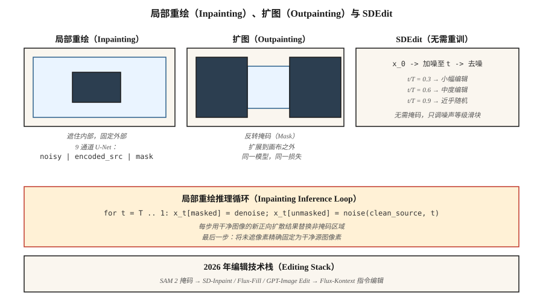

# 局部重绘、扩图与图像编辑（Inpainting, Outpainting & Image Editing）

> 文生图创造新内容，局部重绘修正既有内容。生产中，70% 可计费图像工作是编辑：换背景、去标志、扩画布、重生一只手。局部重绘是扩散发挥价值的地方。

**Type:** Build
**Languages:** Python
**Prerequisites:** 阶段 8 · 07（潜空间扩散），阶段 8 · 08（ControlNet 与 LoRA）
**Time:** ~75 分钟

## 问题（The Problem）

客户发来一张完美产品照，背景却有分散注意力的招牌。你想抹掉招牌，其余像素完全不变。不能从零文生图，否则颜色、光照、产品角度都会改变。你只想重新生成*掩码区域*，并让它遵循周围上下文。

这就是局部重绘（Inpainting）。变体包括：

- **局部重绘（Inpainting）。** 重新生成掩码内部，保留外部像素。
- **扩图（Outpainting）。** 重新生成掩码外部（或画布之外），保留内部。
- **图像编辑（Image Editing）。** 重新生成整张图，但保持与原图的语义或结构一致（SDEdit、InstructPix2Pix）。

2026 年每条扩散流水线都提供局部重绘模式：Flux.1-Fill、Stable Diffusion Inpaint、SDXL-Inpaint、DALL-E 3 Edit。它们遵循同一原理。

## 概念（The Concept）



### 朴素方法及其问题（The naive approach (and why it's wrong)）

带掩码运行标准文生图。每个采样步骤，把带噪潜变量的非掩码区域替换为干净图像正向扩散后的结果。可以用，但效果差。边界伪影渗透，因为模型不知道掩码区域里有什么。

### 专用局部重绘模型（The proper inpainting model）

训练修改后的 U-Net，输入通道从 4 改为 9：

```text
input = concat([ noisy_latent (4ch), encoded_image (4ch), mask (1ch) ], dim=channel)
```

额外通道是 VAE 编码后的源图像副本与单通道掩码。训练时随机遮盖图像区域，让模型只对掩码区去噪；非掩码区作为干净条件信号提供。推理时模型能“看到”掩码周围内容，生成协调的补全。

SD-Inpaint、SDXL-Inpaint、Flux-Fill 都采用这种 9 通道（或类似）输入。Diffusers 提供 `StableDiffusionInpaintPipeline`、`FluxFillPipeline`。

### SDEdit（Meng 等，2022）：无需重训的编辑（SDEdit (Meng et al., 2022) — free editing）

对源图加噪至某个中间 `t`，然后用新提示词将反向链从 `t` 运行到 0。无需重训。起始 `t` 在保真度与创作自由间权衡：

- `t/T = 0.3` → 几乎与源图相同，仅小幅风格变化
- `t/T = 0.6` → 中度编辑，保留粗结构
- `t/T = 0.9` → 从近乎纯噪声生成，极少保留源图

### InstructPix2Pix（Brooks 等，2023）（InstructPix2Pix (Brooks et al., 2023)）

在 `(input_image, instruction, output_image)` 三元组上微调扩散模型。推理时同时以输入图像和文本指令（“改成日落”“加一条龙”）为条件。有两个无分类器引导（Classifier-Free Guidance，CFG）尺度：图像尺度、文本尺度。

### RePaint（Lugmayr 等，2022）（RePaint (Lugmayr et al., 2022)）

保留标准无条件扩散模型。在每个反向步骤重采样，偶尔跳回噪声更大的状态并重新生成，从而避免边界伪影。没有训练好的局部重绘模型时使用。

```figure
inpaint-mask-reinject
```

## 动手实现（Build It）

`code/main.py` 在五维数据上实现玩具一维局部重绘方案。我们在五维混合数据上训练 DDPM，每个样本由两个簇之一的 5 个浮点数组成。推理时“遮住”其中 2 维，在每一步注入另外 3 个未遮维度的正向加噪版本，只重新生成被遮维度。

### 第 1 步：五维 DDPM 数据（Step 1: 5-D DDPM data）

```python
def sample_data(rng):
    cluster = rng.choice([0, 1])
    center = [-1.0] * 5 if cluster == 0 else [1.0] * 5
    return [c + rng.gauss(0, 0.2) for c in center], cluster
```

### 第 2 步：在全部五维上训练去噪器（Step 2: train denoiser over all 5 dims）

标准 DDPM。网络对五维带噪输入输出五维噪声预测。

### 第 3 步：推理时执行感知掩码的反向过程（Step 3: at inference, mask-aware reverse）

```python
def inpaint_step(x_t, mask, clean_image, alpha_bars, t, rng):
    # replace unmasked dims with a freshly noised version of the clean source
    a_bar = alpha_bars[t]
    for i in range(len(x_t)):
        if not mask[i]:
            x_t[i] = math.sqrt(a_bar) * clean_image[i] + math.sqrt(1 - a_bar) * rng.gauss(0, 1)
    # ...then run the normal reverse step on x_t
```

这是朴素方法，对玩具一维数据有效。真实图像局部重绘采用 9 通道输入，因为纹理连贯更重要。

### 第 4 步：扩图（Step 4: outpainting）

扩图就是反转掩码的局部重绘：遮住新建的、原本不存在的画布，用原图填其余部分。训练目标完全相同。

## 常见陷阱（Pitfalls）

- **接缝（Seams）。** 朴素方法留下可见边界，因为梯度信息不能跨越掩码。修复：掩码膨胀 8 至 16 像素，或使用专用局部重绘模型。
- **掩码泄漏（Mask Leakage）。** 条件图像未遮区域质量差或有噪声，会污染掩码内生成。先去噪或轻微模糊。
- **CFG 与掩码大小交互。** 高 CFG 加小掩码会产生过饱和补丁。小编辑降低 CFG。
- **SDEdit 保真度断崖。** 从 `t/T = 0.5` 到 `t/T = 0.6` 就可能失去主体身份。扫描参数并保存检查点。
- **提示词不匹配。** 提示词应描述*整张*图像，而不只新内容。用“一只猫坐在椅子上”，而非“一只猫”。

## 实际应用（Use It）

| 任务 | 流水线 |
|------|----------|
| 移除物体，小掩码 | SD-Inpaint 或 Flux-Fill，标准提示词 |
| 替换天空 | SD-Inpaint + “日落时的蓝天” |
| 扩展画布 | SDXL 扩图模式（8px 羽化）或 Flux-Fill 配扩图掩码 |
| 重新生成手／脸 | SD-Inpaint，提示词重新描述主体，另加 ControlNet-Openpose |
| 改变一个区域的风格 | 在掩码区以 `t/T=0.5` 运行 SDEdit |
| “改成日落” | InstructPix2Pix 或 Flux-Kontext |
| 替换背景 | SAM 掩码 → SD-Inpaint |
| 超高保真 | 最难情况用 Flux-Fill 或 GPT-Image（托管） |

SAM（Meta 的 Segment Anything，2023）加扩散局部重绘，是 2026 年背景移除流水线。SAM 2（2024）可处理视频。

## 交付成果（Ship It）

保存 `outputs/skill-editing-pipeline.md`。技能接收原图、编辑描述、可选掩码（或 SAM 提示），输出：掩码生成方法、基模型、CFG 尺度（图像与文本）、SDEdit-t 或局部重绘模式，以及质量检查清单。

## 练习（Exercises）

1. **简单。** 在 `code/main.py` 中将被遮维度比例从 0.2 改到 0.8。到哪个比例时，局部重绘质量（被遮维度残差）与无条件生成相同？
2. **中等。** 实现 RePaint：每第 10 个反向步骤跳回 5 步（加噪），再重新去噪。测量掩码边缘的边界残差是否减小。
3. **困难。** 用 Hugging Face diffusers 在 20 个人脸重新生成任务上比较 SD 1.5 Inpaint + ControlNet-Openpose 和 Flux.1-Fill。分别为姿态遵循与身份保持打分。

## 关键术语（Key Terms）

| 术语 | 常见说法 | 实际含义 |
|------|-----------------|-----------------------|
| 局部重绘（Inpainting） | “填洞” | 重新生成掩码内部，保留外部像素。 |
| 扩图（Outpainting） | “扩画布” | 重新生成画布外部，保留内部。 |
| 9 通道 U-Net（9-channel U-Net） | “专用局部重绘模型” | 输入为 `noisy \| encoded-source \| mask` 的 U-Net。 |
| SDEdit | “带噪声等级的图生图” | 加噪至时间 `t`，用新提示词去噪。 |
| InstructPix2Pix | “纯文本编辑” | 在（图像、指令、输出）三元组上微调扩散。 |
| RePaint | “无需重训” | 反向过程周期性加噪，以减少接缝。 |
| SAM | “Segment Anything” | 通过点击或框选生成掩码，配合局部重绘。 |
| Flux-Kontext | “带上下文编辑” | 接收参考图与编辑指令的 Flux 变体。 |

## 生产说明：编辑流水线对延迟敏感（Production note: edit pipelines are latency-sensitive）

用户编辑图像时预期往返低于 5 秒。L4 上 1024² 的 30 步 SDXL-Inpaint 需 3 至 4 秒，另有 SAM 掩码生成（约 200 ms）和 VAE 编解码（合计约 500 ms）。生产角度看，它受首词元时间（Time to First Token，TTFT）而非吞吐量限制：批大小 1、低并发，应最小化每个阶段：

- **SAM-H 较慢。** 1024² 下 SAM-H 约 200 ms，SAM-ViT-B 约 40 ms，质量损失小。SAM 2（视频）增加时间维开销，单图编辑不要用它。
- **尽可能跳过编码。** `pipe.image_processor.preprocess(img)` 编码为潜变量。若保有上次生成的潜变量（迭代编辑界面很常见），通过 `latents=...` 直接传入，跳过一次 VAE 编码。
- **掩码膨胀也影响吞吐量。** 小掩码意味着大部分 U-Net 前向传播被浪费，因为未遮像素无论如何会被固定。`diffusers` 的 `StableDiffusionInpaintPipeline` 始终运行完整 U-Net；只有 9 通道专用局部重绘变体利用掩码计算。
- **Flux-Kontext 是 2025 年的答案。** 对 `(source_image, instruction)` 单次前向传播，无独立掩码，无 SDEdit 噪声扫描。H100 上约 1.5 秒交付一次编辑。架构启示：合并阶段。

## 延伸阅读（Further Reading）

- [Lugmayr 等（2022）：RePaint：使用去噪扩散概率模型进行局部重绘（RePaint: Inpainting using Denoising Diffusion Probabilistic Models）](https://arxiv.org/abs/2201.09865)：无需训练的局部重绘。
- [Meng 等（2022）：SDEdit：使用随机微分方程引导图像合成与编辑（SDEdit: Guided Image Synthesis and Editing with Stochastic Differential Equations）](https://arxiv.org/abs/2108.01073)：SDEdit。
- [Brooks、Holynski、Efros（2023）：InstructPix2Pix](https://arxiv.org/abs/2211.09800)：文本指令编辑。
- [Kirillov 等（2023）：分割一切（Segment Anything）](https://arxiv.org/abs/2304.02643)：SAM，掩码来源。
- [Ravi 等（2024）：SAM 2：分割图像与视频中的一切（SAM 2: Segment Anything in Images and Videos）](https://arxiv.org/abs/2408.00714)：视频 SAM。
- [Hertz 等（2022）：通过交叉注意力控制实现提示词到提示词图像编辑（Prompt-to-Prompt Image Editing with Cross-Attention Control）](https://arxiv.org/abs/2208.01626)：注意力层级编辑。
- [Black Forest Labs（2024）：Flux.1-Fill 与 Flux.1-Kontext](https://blackforestlabs.ai/flux-1-tools/)：2024 年工具。
