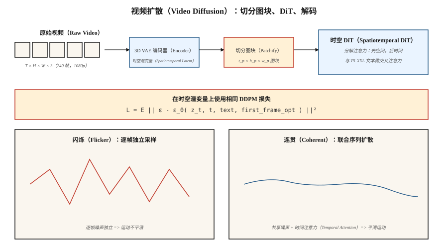

# 视频生成（Video Generation）

> 图像是二维张量，视频是三维张量。理论相同，计算却难 10 至 100 倍。OpenAI 的 Sora（2024 年 2 月）证明它可行。到 2026 年，Veo 2、Kling 1.5、Runway Gen-3、Pika 2.0 和 WAN 2.2 已从文本交付 1080p 生产视频；开放权重技术栈（CogVideoX、HunyuanVideo、Mochi-1、WAN 2.2）则落后 12 个月。

**Type:** Build
**Languages:** Python
**Prerequisites:** 阶段 8 · 07（潜空间扩散），阶段 7 · 09（视觉 Transformer），阶段 8 · 06（DDPM）
**Time:** ~45 分钟

## 问题（The Problem）

一段 10 秒、1080p、24fps 视频包含 240 帧 1920×1080×3 像素，每片段约 1.5 GB 原始数据。像素空间扩散不可行。你需要：

1. **时空压缩（Spatiotemporal Compression）。** 将视频而非单帧编码为时空图块序列的变分自编码器（Variational Autoencoder，VAE）。
2. **时间连贯性（Temporal Coherence）。** 数秒内的帧必须共享内容、光照与物体身份。网络必须建模运动。
3. **计算预算。** 相同模型大小下，视频训练比图像昂贵 10 至 100 倍。
4. **条件控制（Conditioning）。** 文本、图像（首帧）、音频或另一段视频。多数生产模型四者都接收。

解决问题的架构是作用于时空图块的**扩散 Transformer（Diffusion Transformer，DiT）**，在大型（提示词、描述、视频）数据集上训练。扩散损失与第 06 课相同。

## 概念（The Concept）



### 切分图块（Patchify）

用 3D VAE 编码视频，学习时空压缩。潜变量形状为 `[T_latent, H_latent, W_latent, C_latent]`。切成大小为 `[t_p, h_p, w_p]` 的图块。Sora 类模型使用 `t_p = 1`（逐帧图块）或 `t_p = 2`（每两帧）。10 秒 1080p 视频压缩为约 20,000 至 100,000 个图块。

### 时空 DiT（Spatiotemporal DiT）

Transformer 处理展平的图块序列。每块有三维位置嵌入（时间 + y + x）。注意力通常分解为：

- **空间注意力（Spatial Attention）**：每帧内部图块之间。
- **时间注意力（Temporal Attention）**：同一空间位置的跨帧之间。
- **完整三维注意力（Full 3D Attention）**：昂贵 16 至 100 倍，仅用于低分辨率或研究。

### 文本条件（Text conditioning）

通过大型文本编码器做交叉注意力（Sora 用 T5-XXL，CogVideoX-5B 也用 T5-XXL）。长提示词很重要：Sora 训练集由 GPT 生成密集重描述，平均每片段 200 词元（Token）。

### 训练（Training）

在时空潜变量上使用标准扩散损失（ε 或 v 预测）。数据：网络视频、约 100M 精选片段、合成文本描述。计算：小型研究运行也需 10,000 以上 GPU 小时；Sora 规模超过 100,000。

## 2026 年生产格局（The 2026 production landscape）

| 模型 | 日期 | 最长时长 | 最高分辨率 | 开放权重？ | 特点 |
|-------|------|--------------|---------|---------------|---------|
| Sora（OpenAI） | 2024-02 | 60s | 1080p | 否 | 首个大规模展现世界模拟器特性的模型 |
| Sora Turbo | 2024-12 | 20s | 1080p | 否 | 生产 Sora，推理快 5 倍 |
| Veo 2（Google） | 2024-12 | 8s | 4K | 否 | 2025 年质量与物理效果最佳 |
| Veo 3 | 2025 Q3 | 15s | 4K | 否 | 原生音频，更强镜头控制 |
| Kling 1.5 / 2.1（快手） | 2024-2025 | 10s | 1080p | 否 | 2025 年第一季度人体运动最佳 |
| Runway Gen-3 Alpha | 2024-06 | 10s | 768p | 否 | 上层配备专业视频工具 |
| Pika 2.0 | 2024-10 | 5s | 1080p | 否 | 角色一致性最强 |
| CogVideoX（THUDM） | 2024 | 10s | 720p | 是（2B、5B） | 首个开放 5B 规模视频模型 |
| HunyuanVideo（腾讯） | 2024-12 | 5s | 720p | 是（13B） | 2024 年底最先进开放模型 |
| Mochi-1（Genmo） | 2024-10 | 5.4s | 480p | 是（10B） | 许可证最宽松 |
| WAN 2.2（阿里巴巴） | 2025-07 | 5s | 720p | 是 | 2025 年中最强开放模型 |

开放权重缩小差距的速度比图像领域更快：到 2026 年中，HunyuanVideo + WAN 2.2 LoRA 已支撑多数开源工作流。

```figure
video-diffusion-denoise
```

## 动手实现（Build It）

`code/main.py` 模拟核心时空 DiT 思路：切分小型合成视频的图块，添加逐图块位置嵌入，用图块间的 Transformer 式注意力对整个序列去噪。无需 numpy，纯 Python。我们展示，即使一维中，只要相邻帧图块共享去噪器与位置嵌入，也会出现时间连贯性。

### 第 1 步：切分合成一维“视频”（Step 1: patchify a synthetic 1-D "video"）

```python
def make_video(T_frames=8, rng=None):
    # a "video" is a sequence of 1-D values following a smooth trajectory
    base = rng.gauss(0, 1)
    return [base + 0.3 * t + rng.gauss(0, 0.1) for t in range(T_frames)]
```

### 第 2 步：逐帧位置嵌入（Step 2: position embedding per frame）

```python
def pos_embed(t, dim):
    return sinusoidal(t, dim)
```

### 第 3 步：去噪器看到完整序列（Step 3: denoiser sees the whole sequence）

微型网络不独立去噪每帧，而是拼接全部帧值和位置嵌入，联合预测所有帧的噪声。

### 第 4 步：时间连贯性测试（Step 4: temporal coherence test）

训练后采样一段视频，测量帧间差值。若模型学到时间结构，差值应比独立采样每帧更小。

## 常见陷阱（Pitfalls）

- **独立逐帧采样导致闪烁（Flicker）。** 对每帧独立做图像扩散，每帧噪声独立，输出就闪烁。视频扩散通过注意力或共享噪声耦合各帧来解决。
- **朴素三维注意力导致内存不足（Out of Memory，OOM）。** 10 秒 1080p 潜变量的完整三维注意力需数千亿次运算。分解为空间与时间注意力。
- **数据描述比规模更重要。** Sora 相对前作的主要升级是使用约详细 10 倍的描述训练（GPT-4 重新标注片段）。OpenAI 技术报告对此有明确说明。
- **首帧条件（First-frame Conditioning）。** 多数生产模型也接收图像作为首帧，即“图生视频”模式；训练包含此变体。
- **物理漂移（Physics Drift）。** 长片段（>10s）会积累细微不一致。滑动窗口生成加关键帧锚定有帮助。

## 实际应用（Use It）

| 用途 | 2026 年选择 |
|----------|-----------|
| 最高质量托管文生视频 | Veo 3 或 Sora |
| 镜头可控的电影效果 | Runway Gen-3 配运动画笔 |
| 跨片段角色一致性 | Pika 2.0 或 Kling 2.1 |
| 开放权重，快速微调 | WAN 2.2 + LoRA |
| 图生视频（Image-to-Video，I2V） | WAN 2.2-I2V、Kling 2.1 I2V 或 Runway |
| 音频驱动视频口型同步 | Veo 3（原生音频）或专用口型同步模型 |
| 视频编辑 | Runway Act-Two、Kling Motion Brush、Flux-Kontext（静帧） |

相同质量下，每秒视频成本在 2024 至 2026 年间降低 20 倍。

## 交付成果（Ship It）

保存 `outputs/skill-video-brief.md`。技能接收视频需求简报（时长、宽高比、风格、镜头规划、主体一致性、音频），输出：模型与托管、提示词结构（镜头语言、主体描述、运动描述）、种子与复现方案、逐帧质量检查清单。

## 练习（Exercises）

1. **简单。** 在 `code/main.py` 中比较 (a) 独立逐帧采样、(b) 联合序列采样的帧间差值。报告差值均值与方差。
2. **中等。** 加入首帧条件：将第 0 帧固定为给定值，采样其余帧。测量固定值如何传播。
3. **困难。** 用 HuggingFace diffusers 在本地 GPU 运行 CogVideoX-2B。为 6 秒 720p 片段计时 20 步推理，剖析时空注意力以找出瓶颈。

## 关键术语（Key Terms）

| 术语 | 常见说法 | 实际含义 |
|------|-----------------|-----------------------|
| 视频 VAE（Video VAE） | “三维 VAE” | 将 `(T, H, W, C)` 压缩为时空潜变量的编码器。 |
| 图块（Patches） | “词元” | 潜变量中固定大小的三维块，作为 DiT 输入。 |
| 分解注意力（Factorized Attention） | “空间加时间” | 先在空间做注意力，再在时间做，跳过完整三维注意力。 |
| 图生视频（Image-to-Video，I2V） | “让这张照片动起来” | 模型接收图像和文本，输出从该图像开始的视频。 |
| 关键帧条件（Keyframe Conditioning） | “锚定帧” | 固定特定帧以控制视频变化过程。 |
| 运动画笔（Motion Brush） | “方向提示” | 用户在图像上绘制运动向量的界面输入。 |
| 重描述（Re-captioning） | “密集描述” | 用大语言模型（LLM）为训练片段重新标注详细提示词。 |
| 闪烁（Flicker） | “时间伪影” | 帧间不一致，通过耦合去噪修复。 |

## 生产说明：视频潜变量受内存带宽限制（Production note: video latents are a memory-bandwidth problem）

10 秒 1080p、24 fps 片段为 240 帧 × 1920 × 1080 × 3 ≈ 1.5 GB 原始像素。经过 4 倍视频 VAE 压缩（`2 × spatial × 2 × temporal`），每请求潜变量约 100 MB。批大小 1、运行时空 DiT 30 步，每步通过高带宽内存（High Bandwidth Memory，HBM）搬运约 3 GB，瓶颈是内存带宽而非浮点运算量。

三个生产调节项均直接来自生产推理文献的推理章节：

- **DiT 张量并行（Tensor Parallelism，TP）。** 文生视频模型通常 ≥10B 参数。4 张 H100 上 TP=4 很常见；405B 级模型使用流水线并行（Pipeline Parallelism，PP）=2 × TP=2。在触及全规约（All-reduce）瓶颈前，每步延迟随 TP 大致线性下降。
- **帧批处理即连续批处理（Continuous Batching）。** 生成时视频概念上是由注意力连接的一批帧。若架构允许滑动窗口生成，可做运行中调度：返回帧 `t-1` 时开始渲染帧 `t+1`。
- **片段级预填充缓存（Prefill Cache）。** 图生视频的首帧条件类似 LLM 提示词预填充，计算一次，跨时间解码过程复用，本质是视频的键值缓存（KV-cache）。

## 延伸阅读（Further Reading）

- [Brooks 等（2024）：作为世界模拟器的视频生成模型（Video generation models as world simulators）](https://openai.com/index/video-generation-models-as-world-simulators/)：Sora 技术报告。
- [Yang 等（2024）：CogVideoX：采用专家 Transformer 的文生视频扩散模型（CogVideoX: Text-to-Video Diffusion Models with An Expert Transformer）](https://arxiv.org/abs/2408.06072)：CogVideoX。
- [Kong 等（2024）：HunyuanVideo：大型视频生成模型的系统框架（HunyuanVideo: A Systematic Framework for Large Video Generative Models）](https://arxiv.org/abs/2412.03603)：HunyuanVideo。
- [Genmo（2024）：Mochi-1 技术报告（Mochi-1 Technical Report）](https://www.genmo.ai/blog/mochi)：Mochi-1。
- [Alibaba（2025）：WAN 2.2](https://wanvideo.io/)：2025 年中最先进开放模型。
- [Ho、Salimans、Gritsenko 等（2022）：视频扩散模型（Video Diffusion Models）](https://arxiv.org/abs/2204.03458)：开创性视频扩散论文。
- [Blattmann 等（2023）：对齐你的潜变量（Align your Latents，Video LDM）](https://arxiv.org/abs/2304.08818)：Stable Video Diffusion 的前身。
