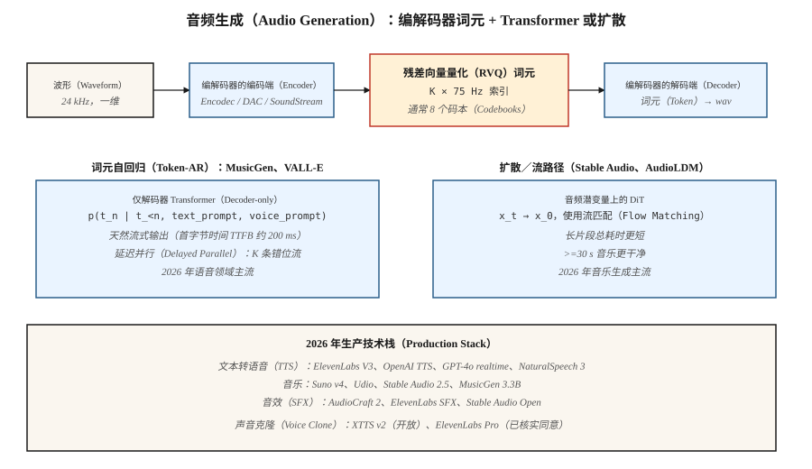

# 音频生成（Audio Generation）

> 音频是采样率 16 至 48 kHz 的一维信号。五秒片段有 80k 至 240k 个采样点。没有 Transformer 直接对这么长的序列做注意力。2026 年所有生产音频模型采用同一解法：神经编解码器（Encodec、SoundStream、DAC）以 50 至 75 Hz 将音频压缩成离散词元，再由 Transformer 或扩散模型生成词元。

**Type:** Build
**Languages:** Python
**Prerequisites:** 阶段 6 · 02（音频特征），阶段 6 · 04（自动语音识别），阶段 8 · 06（DDPM）
**Time:** ~45 分钟

## 问题（The Problem）

三类音频生成任务：

1. **文本转语音（Text-to-Speech，TTS）。** 给定文本产生语音。干净语音带宽窄，语音结构强，词元上的 Transformer 已能很好解决。VALL-E（Microsoft）、NaturalSpeech 3、ElevenLabs、OpenAI TTS。
2. **音乐生成（Music Generation）。** 给定提示词（文本、旋律、和弦进行、流派）产生音乐。分布广泛得多。MusicGen（Meta）、Stable Audio 2.5、Suno v4、Udio、Riffusion。
3. **音效／声音设计（Audio Effects / Sound Design）。** 给定提示词产生环境声或拟音（Foley）。AudioGen、AudioLDM 2、Stable Audio Open。

三者都以神经音频编解码器加词元自回归（Token-Autoregressive，Token-AR）或扩散生成器为基础。

## 概念（The Concept）



### 神经音频编解码器（Neural audio codecs）

Encodec（Meta，2022）、SoundStream（Google，2021）、Descript Audio Codec（DAC，2023）。卷积编码器将波形压缩为逐时间步向量；残差向量量化（Residual Vector Quantization，RVQ）把各向量变为 K 个码本索引的级联。解码器逆转过程。24 kHz 音频以 2 kbps 编码，使用 8 个 75 Hz 的 RVQ 码本，即 600 词元／秒。

```text
波形（waveform，16000 samples/sec）
    └─ 编码器卷积（encoder conv）─┐
                                ├─ RVQ 第 1 层（layer 1）→ 75 Hz 索引（indices）
                                ├─ RVQ 第 2 层（layer 2）→ 75 Hz 索引（indices）
                                ├─ ...
                                └─ RVQ 第 8 层（layer 8）
```

### 上层的两种生成范式（Two generative paradigms on top）

**词元自回归（Token-autoregressive）。** 将 RVQ 词元展平成序列，运行仅解码器 Transformer。MusicGen 使用“延迟并行（Delayed Parallel）”，为每条流设置偏移，并行输出 K 条码本流。VALL-E 根据文本提示词与 3 秒声音样本生成语音词元。

**潜空间扩散（Latent Diffusion）。** 将编解码器词元打包为连续潜变量，或用分类扩散建模。Stable Audio 2.5 在连续音频潜变量上使用流匹配（Flow Matching）。AudioLDM 2 使用文本到梅尔频谱再到音频的扩散。

2024 至 2026 年的趋势：音乐中流匹配胜出（推理更快、样本更干净），语音仍由词元自回归主导，因为它天然因果，适合流式输出。

## 生产格局（Production landscape）

| 系统 | 任务 | 骨干 | 延迟 |
|--------|------|----------|---------|
| ElevenLabs V3 | 文本转语音（TTS） | 词元自回归与神经声码器 | 首词元约 300ms |
| OpenAI GPT-4o audio | 全双工语音 | 端到端多模态自回归 | ~200ms |
| NaturalSpeech 3 | 文本转语音（TTS） | 潜空间流匹配 | 非流式 |
| Stable Audio 2.5 | 音乐／音效（Sound Effects，SFX） | DiT 与音频潜变量流匹配 | 1 分钟片段约 10s |
| Suno v4 | 完整歌曲 | 未公开；推测为词元自回归 | 每首约 30s |
| Udio v1.5 | 完整歌曲 | 未公开 | 每首约 30s |
| MusicGen 3.3B | 音乐 | Encodec 32kHz 上的词元自回归 | 实时 |
| AudioCraft 2 | 音乐与音效 | 流匹配 | 5s 片段约 5s |
| Riffusion v2 | 音乐 | 频谱图扩散 | ~10s |

```figure
score-matching
```

## 动手实现（Build It）

`code/main.py` 模拟核心思路：用两种不同“风格”产生的合成“音频词元”序列训练微型下一词元 Transformer（风格 A 交替使用低、高词元，风格 B 单调递增）。以风格为条件并采样。

### 第 1 步：合成音频词元（Step 1: synthetic audio tokens）

```python
def make_tokens(style, length, vocab_size, rng):
    if style == 0:  # "speech-like": alternating
        return [i % vocab_size for i in range(length)]
    # "music-like": ramp
    return [(i * 3) % vocab_size for i in range(length)]
```

### 第 2 步：训练微型词元预测器（Step 2: train a tiny token predictor）

一个以风格为条件的二元语法（Bigram）式预测器。重点在模式：编解码器词元 → 交叉熵训练 → 自回归采样。

### 第 3 步：条件采样（Step 3: sample conditionally）

给定风格词元和起始词元，从预测分布采样下一词元，继续生成 20 至 40 个词元。

## 常见陷阱（Pitfalls）

- **编解码器质量决定输出上限。** 若编解码器无法忠实表示某种声音，生成器再好也无济于事。DAC 是当前最佳开放方案。
- **RVQ 误差累积。** 每个 RVQ 层建模前层残差。第 1 层错误会传播。更高层用温度 0 采样有帮助。
- **音乐结构。** 75 Hz 下，30 秒词元序列超过 20k 词元，对 Transformer 很难。MusicGen 用滑动窗口与提示延续；Stable Audio 用较短片段加交叉淡化（Crossfading）。
- **边界伪影。** 生成片段间的交叉淡化需要谨慎的重叠相加（Overlap-add）。
- **对干净数据的需求。** 音乐生成器需要数万小时授权音乐。2024 年 Suno／Udio 与美国唱片业协会（Recording Industry Association of America，RIAA）的诉讼让问题显现。
- **声音克隆伦理。** 3 秒样本加文本提示词，就足够 VALL-E／XTTS／ElevenLabs 克隆声音。所有生产模型都需滥用检测与退出名单。

## 实际应用（Use It）

| 任务 | 2026 年技术栈 |
|------|------------|
| 商业文本转语音 | ElevenLabs、OpenAI TTS 或 Azure Neural |
| 声音克隆（已核实同意） | XTTS v2（开放）或 ElevenLabs Pro |
| 快速背景音乐 | Stable Audio 2.5 API、Suno 或 Udio |
| 带歌词音乐 | Suno v4 或 Udio v1.5 |
| 音效／拟音 | AudioCraft 2、ElevenLabs SFX 或 Stable Audio Open |
| 实时语音智能体（Agent） | GPT-4o realtime 或 Gemini Live |
| 开放权重音乐研究 | MusicGen 3.3B、Stable Audio Open 1.0、AudioLDM 2 |
| 配音／翻译 | HeyGen、ElevenLabs Dubbing |

## 交付成果（Ship It）

保存 `outputs/skill-audio-brief.md`。技能接收音频简报（任务、时长、风格、声音、许可证），输出：模型与托管、提示词格式（流派标签、风格描述、结构标记）、编解码器与生成器及声码器链路、种子方案、评估计划（平均意见分（Mean Opinion Score，MOS）／对比式语言音频预训练（Contrastive Language-Audio Pretraining，CLAP）分数／TTS 字符错误率（Character Error Rate，CER）／用户 A/B）。

## 练习（Exercises）

1. **简单。** 运行 `code/main.py` 并显式设置风格，验证生成序列符合该风格模式。
2. **中等。** 加入延迟并行解码，模拟必须保持一步偏移的两条词元流，训练联合预测器。
3. **困难。** 用 HuggingFace transformers 在本地运行 MusicGen-small。用三个不同提示词各生成 10 秒片段，以 A/B 比较风格遵循。

## 关键术语（Key Terms）

| 术语 | 常见说法 | 实际含义 |
|------|-----------------|-----------------------|
| 编解码器（Codec） | “神经压缩” | 音频编码器与解码器，典型输出为 50 至 75 Hz 词元。 |
| RVQ | “残差向量量化” | K 个量化器级联，各自建模前一个的残差。 |
| 词元（Token） | “一个编解码器符号” | 码本中的离散索引，通常 1024 或 2048。 |
| 延迟并行（Delayed Parallel） | “错位码本” | 以交错偏移输出 K 条词元流，缩短序列。 |
| 流匹配（Flow Matching） | “2024 年音频赢家” | 路径更直的扩散替代方案，采样更快。 |
| 声音提示（Voice Prompt） | “3 秒样本” | 引导克隆声音的说话人嵌入或词元前缀。 |
| 梅尔频谱图（Mel Spectrogram） | “可视化” | 对数幅度的感知频谱图，许多 TTS 系统采用。 |
| 声码器（Vocoder） | “梅尔到波形” | 将梅尔频谱图还原为音频的神经组件。 |

## 生产说明：音频的核心是流式输出（Production note: audio is a streaming problem）

音频是用户预期*边生成边到达*、而非一次全部到达的输出模态。生产中这意味着每输出词元时间（Time Per Output Token，TPOT）重要，因为目标吞吐量由用户听速而非阅读速度决定。16kHz 音频按约 75 词元／秒编码（Encodec），服务器必须每用户生成 ≥75 词元／秒，才能流畅播放。

两个架构影响：

- **流匹配音频模型无法直接流式输出。** Stable Audio 2.5 与 AudioCraft 2 一次渲染固定长度片段。要流式输出，需切块并重叠边界，类似滑动窗口扩散；比编解码器自回归模型多 100 至 300ms 延迟。

产品若是“实时语音聊天”或“实时音乐续写”，选编解码器自回归路径。若是“提交后渲染 30 秒片段”，流匹配在质量与总延迟上胜出。

## 延伸阅读（Further Reading）

- [Défossez 等（2022）：Encodec：高保真神经音频压缩（Encodec: High Fidelity Neural Audio Compression）](https://arxiv.org/abs/2210.13438)：编解码器标准。
- [Zeghidour 等（2021）：SoundStream](https://arxiv.org/abs/2107.03312)：首个广泛使用的神经音频编解码器。
- [Kumar 等（2023）：使用改进 RVQGAN 的高保真音频压缩（High-Fidelity Audio Compression with Improved RVQGAN，DAC）](https://arxiv.org/abs/2306.06546)：DAC。
- [Wang 等（2023）：神经编解码器语言模型是零样本文本转语音合成器（Neural Codec Language Models are Zero-Shot Text to Speech Synthesizers，VALL-E）](https://arxiv.org/abs/2301.02111)：VALL-E。
- [Copet 等（2023）：简单且可控的音乐生成（Simple and Controllable Music Generation，MusicGen）](https://arxiv.org/abs/2306.05284)：MusicGen。
- [Liu 等（2023）：AudioLDM 2：通过自监督预训练学习整体音频生成（AudioLDM 2: Learning Holistic Audio Generation with Self-supervised Pretraining）](https://arxiv.org/abs/2308.05734)：AudioLDM 2。
- [Stability AI（2024）：Stable Audio 2.5](https://stability.ai/news/introducing-stable-audio-2-5)：2025 年采用流匹配的文本到音乐。
