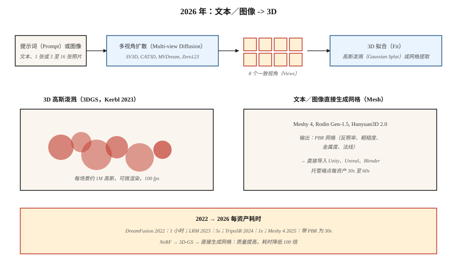

# 3D 生成（3D Generation）

> 3D 是最能借力二维数据的模态。2023 年的突破是 3D 高斯泼溅。2024 至 2026 年的生成进展在其上叠加多视角扩散与 3D 重建，从单个提示词或照片生成物体与场景。

**Type:** Learn
**Languages:** Python
**Prerequisites:** 阶段 4（视觉），阶段 8 · 07（潜空间扩散）
**Time:** ~45 分钟

## 问题（The Problem）

3D 内容制作困难：

- **表示（Representation）。** 网格（Mesh）、点云（Point Cloud）、体素网格（Voxel Grid）、有符号距离场（Signed Distance Field，SDF）、神经辐射场（Neural Radiance Field，NeRF）、3D 高斯。各有权衡。
- **数据稀缺。** ImageNet 有 14M 图像。最大干净 3D 数据集（Objaverse-XL，2023）约有 10M 物体，大多质量低。
- **内存。** 512³ 体素网格有 128M 体素；可用的场景 NeRF 每射线需要 1M 采样。生成比重建更难。
- **监督（Supervision）。** 二维图像有像素，3D 通常只有少量二维视角，需要将它们提升到三维。

2026 年技术栈把两个问题分开：先用扩散模型生成*二维多视角图像*，再向这些图像拟合 *3D 表示*，通常采用高斯泼溅（Gaussian Splatting）。

## 概念（The Concept）



### 表示：3D 高斯泼溅（Kerbl 等，2023）（Representation: 3D Gaussian Splatting (Kerbl et al., 2023)）

将场景表示为约 1M 个 3D 高斯组成的点云。每个有 59 个参数：位置（3）、协方差（6，或四元数 4 + 缩放 3）、不透明度（1）、球谐颜色（3 阶为 48，0 阶为 3）。

渲染 = 投影 + alpha 合成。速度快（4090 上 1080p 约 100 fps），可微。用梯度下降（Gradient Descent）拟合真实照片，消费级 GPU 上 5 至 30 分钟可拟合一个场景。

2023 至 2024 年的两项后续创新：
- **生成式高斯泼溅（Generative Gaussian Splats）。** LGM、LRM、InstantMesh 等模型直接从一张或少量图像预测高斯云。
- **4D 高斯泼溅（4D Gaussian Splatting）。** 为高斯加入逐帧偏移，表示动态场景。

### 多视角扩散（Multi-view diffusion）

微调预训练图像扩散模型，从文本提示词或单图生成同一物体多个一致视角。代表有 Zero123（Liu 等，2023）、MVDream（Shi 等，2023）、SV3D（Stability，2024）、CAT3D（Google，2024）。通常输出围绕物体的 4 至 16 个视角，再通过高斯泼溅或 NeRF 提升到三维。

### 文本到 3D 流水线（Text-to-3D pipelines）

| 模型 | 输入 | 输出 | 时间 |
|-------|-------|--------|------|
| DreamFusion（2022） | 文本 | 通过分数蒸馏采样（Score Distillation Sampling，SDS）得到 NeRF | 每资产约 1 小时 |
| Magic3D | 文本 | 网格与纹理 | ~40 分钟 |
| Shap-E（OpenAI，2023） | 文本 | 隐式 3D | ~1 分钟 |
| SJC / ProlificDreamer | 文本 | NeRF／网格 | ~30 分钟 |
| LRM（Meta，2023） | 图像 | 三平面（Triplane） | ~5 s |
| InstantMesh（2024） | 图像 | 网格 | ~10 s |
| SV3D（Stability，2024） | 图像 | 新视角 | ~2 分钟 |
| CAT3D（Google，2024） | 1 至 64 张图像 | 3D NeRF | ~1 分钟 |
| TripoSR（2024） | 图像 | 网格 | ~1 s |
| Meshy 4（2025） | 文本与图像 | 基于物理渲染（Physically-Based Rendering，PBR）网格 | ~30 s |
| Rodin Gen-1.5（2025） | 文本与图像 | PBR 网格 | ~60 s |
| Tencent Hunyuan3D 2.0（2025） | 图像 | 网格 | ~30 s |

2025 至 2026 年方向：直接文本到网格模型，带适合游戏引擎的 PBR 材质。对通用物体，以多视角扩散为中间步骤仍是效果最佳方案。

### NeRF 背景（NeRF (for context)）

神经辐射场（Mildenhall 等，2020）。微型多层感知机（MLP）接收 `(x, y, z, view direction)`，输出 `(color, density)`。沿射线积分渲染。新视角合成质量优于网格方法，但渲染慢 100 至 1000 倍。多数实时用途已被高斯泼溅取代，研究中仍占主导。

```figure
v4-3d-multiview
```

## 动手实现（Build It）

`code/main.py` 实现玩具二维“高斯泼溅”拟合：将合成目标图像（平滑渐变）表示为二维高斯泼溅之和。用梯度下降优化位置、颜色和协方差以匹配目标。你将看到两个核心操作：前向渲染（泼溅与 alpha 合成）和梯度下降拟合。

### 第 1 步：二维高斯泼溅（Step 1: 2D Gaussian splat）

```python
def gaussian_at(x, y, gaussian):
    px, py = gaussian["pos"]
    sigma = gaussian["sigma"]
    d2 = (x - px) ** 2 + (y - py) ** 2
    return math.exp(-d2 / (2 * sigma * sigma))
```

### 第 2 步：对泼溅求和渲染（Step 2: render by summing splats）

```python
def render(image_size, gaussians):
    img = [[0.0] * image_size for _ in range(image_size)]
    for g in gaussians:
        for y in range(image_size):
            for x in range(image_size):
                img[y][x] += g["color"] * gaussian_at(x, y, g)
    return img
```

真实 3D 高斯泼溅按深度排序高斯，再按顺序进行 alpha 合成。二维玩具只求和。

### 第 3 步：梯度下降拟合（Step 3: fit by gradient descent）

```python
for step in range(steps):
    pred = render(size, gaussians)
    loss = mse(pred, target)
    gradients = compute_grads(pred, target, gaussians)
    update(gaussians, gradients, lr)
```

## 常见陷阱（Pitfalls）

- **视角不一致。** 独立生成四个视角，若物体结构互相冲突，3D 拟合就模糊。修复：共享注意力的多视角扩散。
- **背面幻觉（Back-side Hallucination）。** 单图转 3D 必须臆造未见的一面，质量波动很大。
- **高斯泼溅数量爆炸。** 无约束训练增长到 10M 泼溅并过拟合。原始 3D-GS 论文中的增密与剪枝启发式必不可少。
- **拓扑问题（Topology Issues）。** 从隐式场（SDF）提取的网格常有孔洞或自交。交付前运行重网格化器，如 Blender 的体素重网格化。
- **训练数据许可证。** Objaverse 的许可证混杂，商业使用限制因模型而异。

## 实际应用（Use It）

| 任务 | 2026 年选择 |
|------|-----------|
| 从照片重建场景 | 高斯泼溅（3DGS、Gsplat、Scaniverse） |
| 游戏用文本到 3D 物体 | Meshy 4 或 Rodin Gen-1.5（PBR 输出） |
| 图像到 3D | Hunyuan3D 2.0、TripoSR、InstantMesh |
| 少图新视角合成 | CAT3D、SV3D |
| 动态场景重建 | 4D Gaussian Splatting |
| 虚拟形象／着装人体 | Gaussian Avatar、HUGS |
| 研究／最先进方案 | 上周刚发布的方法 |

在游戏或电商流水线中交付生产 3D：Meshy 4 或 Rodin Gen-1.5 输出可直接进入 Unity／Unreal 的 PBR 网格。

## 交付成果（Ship It）

保存 `outputs/skill-3d-pipeline.md`。技能接收 3D 简报（输入：文本／单图／少图；输出：网格／泼溅／NeRF；用途：渲染／游戏／虚拟现实（VR）），输出：流水线（多视角扩散加拟合，或直接网格模型）、基模型、迭代预算、拓扑后处理、所需材质通道。

## 练习（Exercises）

1. **简单。** 分别用 4、16、64 个高斯运行 `code/main.py`，报告相对目标的最终均方误差（MSE）。
2. **中等。** 扩展为彩色高斯（RGB），确认重建匹配目标颜色模式。
3. **困难。** 用 gsplat 或 Nerfstudio 从 50 张照片采集重建真实物体，报告拟合时间及留出视角上的最终结构相似性（Structural Similarity，SSIM）。

## 关键术语（Key Terms）

| 术语 | 常见说法 | 实际含义 |
|------|-----------------|-----------------------|
| 3D 高斯泼溅（3D Gaussian Splatting） | “3DGS” | 场景表示为 3D 高斯云，采用可微 alpha 合成渲染。 |
| NeRF | “神经辐射场” | 在三维点输出颜色与密度的 MLP，以射线积分渲染。 |
| 三平面（Triplane） | “三个二维平面” | 将三维分解为三个轴对齐二维特征网格，比体积表示便宜。 |
| SDS | “分数蒸馏采样” | 用二维扩散分数作为伪梯度训练 3D 模型。 |
| 多视角扩散（Multi-view Diffusion） | “一次多个视角” | 输出一批一致相机视角的扩散模型。 |
| PBR | “基于物理的渲染” | 含反照率、粗糙度、金属度、法线通道的材质。 |
| 增密（Densification） | “增加泼溅” | 3DGS 训练启发式：在高梯度区域拆分／克隆泼溅。 |

## 生产说明：3D 尚无共同基础（Production note: 3D has no shared substrate yet）

不像图像（潜空间扩散加 DiT）和视频（时空 DiT），2026 年 3D 没有单一主导运行时。生产决策树按表示分叉：

- **NeRF／三平面。** 推理是射线步进（Ray Marching）加每采样点一次 MLP 前向传播。512² 渲染需数百万次 MLP 前向传播。大规模批处理射线采样；SDPA／xformers 可应用。
- **多视角扩散加 LRM 重建。** 两阶段流水线。阶段 1（多视角 DiT）是与第 07 课相同的扩散服务器；阶段 2（LRM Transformer）对视角执行单次前向传播。整体延迟形态为“扩散加单次传播”，据此为各阶段选择服务原语。
- **SDS／DreamFusion。** 逐资产优化，而非推理。构建作业，不是请求处理器。

对多数 2026 年产品，正确方案是“按请求运行多视角扩散，异步重建为 3DGS，提供 3DGS 实时查看”。这样将负载清晰拆分为 GPU 推理服务器（快）与离线优化器（慢）。

## 延伸阅读（Further Reading）

- [Mildenhall 等（2020）：NeRF：将场景表示为神经辐射场（NeRF: Representing Scenes as Neural Radiance Fields）](https://arxiv.org/abs/2003.08934)：NeRF。
- [Kerbl 等（2023）：用于实时辐射场渲染的 3D 高斯泼溅（3D Gaussian Splatting for Real-Time Radiance Field Rendering）](https://arxiv.org/abs/2308.04079)：3DGS。
- [Poole 等（2022）：DreamFusion：使用二维扩散实现文本到 3D（DreamFusion: Text-to-3D using 2D Diffusion）](https://arxiv.org/abs/2209.14988)：SDS。
- [Liu 等（2023）：Zero-1-to-3：零样本单图到 3D 物体（Zero-1-to-3: Zero-shot One Image to 3D Object）](https://arxiv.org/abs/2303.11328)：Zero123。
- [Shi 等（2023）：MVDream](https://arxiv.org/abs/2308.16512)：多视角扩散。
- [Hong 等（2023）：LRM：用于单图到 3D 的大型重建模型（LRM: Large Reconstruction Model for Single Image to 3D）](https://arxiv.org/abs/2311.04400)：LRM。
- [Gao 等（2024）：CAT3D：用多视角扩散模型在 3D 中创造一切（CAT3D: Create Anything in 3D with Multi-View Diffusion Models）](https://arxiv.org/abs/2405.10314)：CAT3D。
- [Stability AI（2024）：Stable Video 3D（SV3D）](https://stability.ai/research/sv3d-novel-multi-view-synthesis-and-3d-generation-from-a-single-image-using-latent-video-diffusion)：SV3D。
