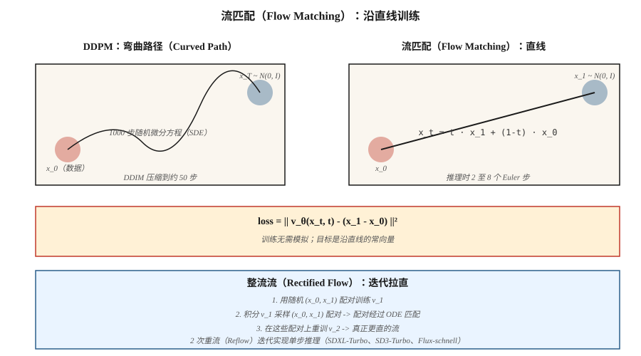

# 流匹配与整流流（Flow Matching & Rectified Flows）

> 扩散模型从噪声沿弯曲路径走到数据，因此需要 20 至 50 个采样步骤。流匹配（Lipman 等，2023）与整流流（Liu 等，2022）训练直线路径。路径更直意味着步数更少、推理更快。Stable Diffusion 3、Flux.1、AudioCraft 2 都在 2024 年转向流匹配。

**Type:** Build
**Languages:** Python
**Prerequisites:** 阶段 8 · 06（DDPM），阶段 1 · 微积分
**Time:** ~45 分钟

## 问题（The Problem）

DDPM 的反向过程是从 `N(0, I)` 回到数据分布的 1000 步随机游走。DDIM 将其压缩为 20 至 50 个确定性步骤。你想更少，最好一步。障碍是描述反向过程的常微分方程（Ordinary Differential Equation，ODE）具有刚性，路径弯曲。

如果能让模型的噪声到数据路径成为*直线*，从 `t=1` 到 `t=0` 的单个 Euler 步就可行。流匹配（Flow Matching）直接这样构造：定义从 `x_1 ∼ N(0, I)` 到 `x_0 ∼ data` 的直线插值，训练向量场 `v_θ(x, t)` 匹配时间导数，推理时积分。

整流流（Rectified Flow；Liu，2022）更进一步：通过重流（Reflow）迭代拉直路径，让 ODE 逐步接近线性。两次重流后，两步采样器即可匹配 50 步 DDPM 质量。

## 概念（The Concept）



### 直线流（Straight-line flow）

定义：

```text
x_t = t · x_1 + (1 - t) · x_0,   t ∈ [0, 1]
```

其中 `x_0 ~ data`，`x_1 ~ N(0, I)`。沿这条直线的时间导数是常数：

```text
dx_t / dt = x_1 - x_0
```

定义神经向量场 `v_θ(x_t, t)`，训练它匹配该导数：

```text
L = E_{x_0, x_1, t} || v_θ(x_t, t) - (x_1 - x_0) ||²
```

这就是**条件流匹配（Conditional Flow Matching，CFM）**损失（Lipman，2023）。训练无需模拟，从不展开 ODE。只采样 `(x_0, x_1, t)` 并回归。

### 采样（Sampling）

推理时沿时间*反向*积分学习到的向量场：

```text
x_{t-Δt} = x_t - Δt · v_θ(x_t, t)
```

从 `x_1 ~ N(0, I)` 开始，用 Euler 步降到 `t=0`。

### 整流流（Liu，2022）（Rectified flow (Liu 2022)）

直线流有效，但学习得到的路径*其实并不直*，因为许多 `x_0` 可映射到同一个 `x_1`，路径会弯曲。整流流的重流步骤：

1. 用随机配对训练流模型 v_1。
2. 将 v_1 从 `x_1` 积分至落点 `x_0`，采样 N 对 `(x_1, x_0)`。
3. 在这些配对示例上训练 v_2。配对现在经过“ODE 匹配”，两者间的直线插值确实更平坦。
4. 重复。

实践中，2 次重流可接近线性，实现 2 至 4 步推理。SDXL-Turbo、SD3-Turbo、LCM 都是从流匹配蒸馏而来的模型。

### 为何 2024 年在图像领域胜出（Why this won for images in 2024）

三个原因：

1. **训练无需模拟**：训练不展开 ODE，实现简单。
2. **损失几何更好**：直线路径的信噪比（Signal-to-Noise Ratio，SNR）一致，而 DDPM ε 损失在调度两端 SNR 差。
3. **推理更快**：4 至 8 步达到 SDXL-Turbo 质量；加一致性蒸馏可一步完成。

## 流匹配与 DDPM 的精确联系（Flow matching vs DDPM — the exact connection）

高斯条件路径的流匹配就是*特定噪声调度下的*扩散。选择 `x_t = α(t) x_0 + σ(t) x_1` 调度，流匹配就还原为 Stratonovich 重写的扩散，`v = α'·x_0 - σ'·x_1`。高斯路径下两者代数等价。

流匹配带来的新增价值是目标的*清晰性*（普通速度）、更干净的损失，以及试验非高斯插值的自由。

```figure
normalizing-flow
```

## 动手实现（Build It）

`code/main.py` 在双模态高斯混合上实现一维流匹配。向量场 `v_θ(x, t)` 是用直线目标训练的微型多层感知机（MLP）。推理时分别积分 1、2、4、20 个 Euler 步，比较样本质量。

### 第 1 步：训练损失（Step 1: training loss）

```python
def train_step(x0, net, rng, lr):
    x1 = rng.gauss(0, 1)
    t = rng.random()
    x_t = t * x1 + (1 - t) * x0
    target = x1 - x0
    pred = net_forward(x_t, t)
    loss = (pred - target) ** 2
    # backprop + update
```

### 第 2 步：多步推理（Step 2: multi-step inference）

```python
def sample(net, num_steps):
    x = rng.gauss(0, 1)
    for i in range(num_steps):
        t = 1.0 - i / num_steps
        dt = 1.0 / num_steps
        x -= dt * net_forward(x, t)
    return x
```

### 第 3 步：比较步数（Step 3: compare step counts）

预期四步采样器已匹配二十步质量，这对延迟意义重大。

## 常见陷阱（Pitfalls）

- **时间参数化。** 流匹配用 `t ∈ [0, 1]`，`t=0` 是数据，`t=1` 是噪声。DDPM 用 `t ∈ [0, T]`，`t=0` 是数据，`t=T` 是噪声。方向相同、尺度不同。论文常弄错。
- **调度选择。** 整流流直线是典型流匹配调度，但可用余弦或 logit 正态（Logit-normal）t 采样（SD3 如此），改善尺度覆盖。
- **重流成本。** 生成重流配对数据集，每样本需完整推理一次。只有确实需要 1 至 2 步推理时才做。
- **无分类器引导（Classifier-Free Guidance，CFG）仍适用。** 在线性组合中将 ε 换成 v：`v_cfg = (1+w) v_cond - w v_uncond`。

## 实际应用（Use It）

| 用途 | 2026 年技术栈 |
|----------|-----------|
| 最佳质量文生图 | 流匹配：SD3、Flux.1-dev |
| 1 至 4 步文生图 | 蒸馏流匹配：Flux.1-schnell、SD3-Turbo、SDXL-Turbo |
| 实时推理 | 从流匹配基模型做一致性蒸馏（LCM、PCM） |
| 音频生成 | 流匹配：Stable Audio 2.5、AudioCraft 2 |
| 视频生成 | 流匹配与扩散混合（Sora、Veo、Stable Video） |
| 科学／物理（粒子轨迹、分子） | 流匹配与等变向量场 |

2025 至 2026 年论文说“比扩散更快”，几乎总是流匹配加蒸馏。

## 交付成果（Ship It）

保存 `outputs/skill-fm-tuner.md`。技能接收扩散式模型规范，转成流匹配训练配置：调度选择、时间采样分布（均匀／logit 正态）、优化器、重流计划、目标步数、评估方案。

## 练习（Exercises）

1. **简单。** 运行 `code/main.py`，比较一步与二十步相对真实数据分布的均方误差（MSE）。
2. **中等。** 从均匀 `t` 采样改为 logit 正态（采样集中于 t 中部）。模型质量是否提高？
3. **困难。** 实现一次重流：积分第一个模型产生配对 (x_0, x_1)，在配对上训练第二个模型，比较单步样本质量。

## 关键术语（Key Terms）

| 术语 | 常见说法 | 实际含义 |
|------|-----------------|-----------------------|
| 流匹配（Flow Matching） | “直线扩散” | 训练 `v_θ(x, t)` 沿插值路径匹配 `x_1 - x_0`。 |
| 整流流（Rectified Flow） | “重流” | 拉直已学习流的迭代过程。 |
| 速度场（Velocity Field） | “v_θ” | 模型输出，即移动 `x_t` 的方向。 |
| 直线插值（Straight-line Interpolant） | “路径” | `x_t = (1-t)·x_0 + t·x_1`；目标导数很简单。 |
| Euler 采样器（Euler Sampler） | “一阶 ODE 求解器” | 最简单积分器，路径直时效果好。 |
| logit 正态 t（Logit-normal t） | “SD3 采样” | 将 `t` 采样集中到梯度最强的中间值。 |
| 一致性蒸馏（Consistency Distillation） | “单步采样器” | 训练学生将任意 `x_t` 直接映射到 `x_0`。 |
| 速度 CFG（CFG with Velocity） | “v-CFG” | `v_cfg = (1+w) v_cond - w v_uncond`；同一技巧，新变量。 |

## 生产说明：Flux.1-schnell 展示流匹配的最高速度（Production note: Flux.1-schnell is flow matching at its fastest）

流匹配的生产胜利是 Flux.1-schnell：将流匹配 DiT 蒸馏为 1 至 4 个推理步骤，保留 Flux-dev 级质量。Niels 的“在 8GB 机器运行 Flux”笔记本是参考部署方案：T5 + CLIP 编码、量化 MMDiT 去噪（schnell 4 步，dev 50 步）、VAE 解码。成本如下：

| 变体 | 步数 | L4 上 1024² 延迟 | 总浮点运算量（相对值） |
|---------|-------|------------------------|------------------------|
| Flux.1-dev（原始） | 50 | ~15 s | 1.0× |
| Flux.1-schnell | 4 | ~1.2 s | 0.08×（快 12 倍） |
| SDXL-base | 30 | ~4 s | 0.25× |
| SDXL-Lightning 两步版 | 2 | ~0.3 s | 0.03× |

生产规则：**流匹配基模型加蒸馏，是 2026 年快速文生图的默认方案。** 各大厂商都交付此组合：SD3-Turbo（SD3 + 流 + 蒸馏）、Flux-schnell（Flux-dev + 整流流拉直）、CogView-4-Flash。纯扩散基模型仅存于旧检查点。

## 延伸阅读（Further Reading）

- [Liu、Gong、Liu（2022）：直且快的流：用整流流学习生成和传输数据（Flow Straight and Fast: Learning to Generate and Transfer Data with Rectified Flow）](https://arxiv.org/abs/2209.03003)：整流流。
- [Lipman 等（2023）：用于生成建模的流匹配（Flow Matching for Generative Modeling）](https://arxiv.org/abs/2210.02747)：流匹配。
- [Esser 等（2024）：扩展整流流 Transformer 以合成高分辨率图像（Scaling Rectified Flow Transformers for High-Resolution Image Synthesis）](https://arxiv.org/abs/2403.03206)：SD3，大规模整流流。
- [Albergo、Vanden-Eijnden（2023）：随机插值（Stochastic Interpolants）](https://arxiv.org/abs/2303.08797)：覆盖流匹配与扩散的通用框架。
- [Song 等（2023）：一致性模型（Consistency Models）](https://arxiv.org/abs/2303.01469)：扩散／流的单步蒸馏。
- [Sauer 等（2023）：对抗扩散蒸馏（Adversarial Diffusion Distillation，SDXL-Turbo）](https://arxiv.org/abs/2311.17042)：Turbo 变体。
- [Black Forest Labs（2024）：Flux.1 模型](https://blackforestlabs.ai/announcing-black-forest-labs/)：生产流匹配。
