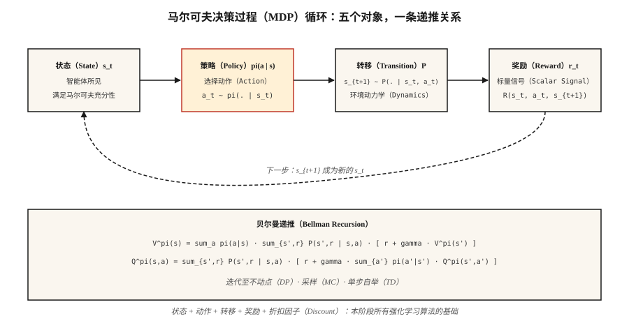

# 马尔可夫决策过程、状态、动作与奖励（MDPs, States, Actions & Rewards）

> 马尔可夫决策过程（Markov Decision Process，MDP）由五部分组成：状态、动作、转移、奖励和折扣因子。强化学习（Reinforcement Learning，RL）中的 Q 学习、PPO、DPO、GRPO 都在这一结构上进行优化。掌握它，就能理解强化学习其余内容的共同基础。

**Type:** Learn
**Languages:** Python
**Prerequisites:** 阶段 1 · 06（概率与分布），阶段 2 · 01（机器学习分类）
**Time:** 约 45 分钟

## 问题（The Problem）

你正在编写国际象棋机器人、库存规划器、交易智能体（Agent），或训练推理模型的近端策略优化（Proximal Policy Optimization，PPO）循环。这四个领域截然不同，却都可以归结为同一个数学对象。

监督学习（Supervised Learning）提供 `(x, y)` 样本对，要求你拟合函数。强化学习不提供标签，只提供连续的状态、你采取的动作和标量奖励。这步棋赢了吗？补货决策省钱了吗？交易盈利了吗？大语言模型（Large Language Model，LLM）刚生成的词元（Token）是否让评判器给出了更高奖励？

必须先将这一数据流形式化，才能从中学习。“看到了什么”“做了什么”“接下来发生了什么”“结果有多好”，都要成为可以推导分析的对象。这种形式化就是马尔可夫决策过程。本阶段的所有强化学习算法，包括最后的基于人类反馈的强化学习（Reinforcement Learning from Human Feedback，RLHF）和组相对策略优化（Group Relative Policy Optimization，GRPO）循环，都在这一结构上优化。

## 概念（The Concept）



**五个组成对象。**

- **状态（State）** `S`：智能体决策所需的全部信息。在网格世界（GridWorld）中是格子，在国际象棋中是棋盘，在大语言模型中是上下文窗口（Context Window）及所有记忆。
- **动作（Action）** `A`：可选的操作，如上、下、左、右移动，走一步棋，或输出一个词元。
- **转移（Transition）** `P(s' | s, a)`：给定状态 `s` 和动作 `a` 后，下一状态的分布。国际象棋中是确定性的，库存问题中是随机的，大语言模型解码中近乎确定。
- **奖励（Reward）** `R(s, a, s')`：标量信号。例如胜利 = +1、失败 = -1，收入减成本，或 GRPO 中的对数似然比项。
- **折扣因子（Discount）** `γ ∈ [0, 1)`：未来奖励相对于当前奖励的权重。`γ = 0.99` 对应约 100 步的时域，`γ = 0.9` 对应约 10 步。

**马尔可夫性质（Markov Property）** `P(s_{t+1} | s_t, a_t) = P(s_{t+1} | s_0, a_0, …, s_t, a_t)`：未来只依赖当前状态。若不成立，说明状态表示不完整；问题在状态定义，而不是方法本身。

**策略与回报（Policies and Returns）。** 策略 `π(a | s)` 将状态映射为动作分布。回报 `G_t = r_t + γ r_{t+1} + γ² r_{t+2} + …` 是未来奖励的折扣总和。价值 `V^π(s) = E[G_t | s_t = s]` 是在策略 `π` 下从 `s` 出发的期望回报。Q 值 `Q^π(s, a) = E[G_t | s_t = s, a_t = a]` 是从特定动作开始的期望回报。每种强化学习算法都估计这两者之一，再据此改进 `π`。

**贝尔曼方程（Bellman Equations）。** 本阶段所有内容都使用以下不动点方程：

`V^π(s) = Σ_a π(a|s) Σ_{s', r} P(s', r | s, a) [r + γ V^π(s')]`
`Q^π(s, a) = Σ_{s', r} P(s', r | s, a) [r + γ Σ_{a'} π(a'|s') Q^π(s', a')]`

它们将期望回报拆成“这一步的奖励”加上“到达状态的折扣价值”，构成递归关系。阶段 9 的算法要么将该方程迭代至收敛（动态规划），要么从中采样（蒙特卡洛），要么用它进行一步自举（时序差分）。

```figure
discount-horizon
```

## 动手实现（Build It）

### 第 1 步：微型确定性 MDP（Step 1: a tiny deterministic MDP）

构建一个 4×4 网格世界：智能体从左上角出发，右下角为终点，每步奖励为 -1，动作集合为 `{up, down, left, right}`。参见 `code/main.py`。

```python
GRID = 4
TERMINAL = (3, 3)
ACTIONS = {"up": (-1, 0), "down": (1, 0), "left": (0, -1), "right": (0, 1)}

def step(state, action):
    if state == TERMINAL:
        return state, 0.0, True
    dr, dc = ACTIONS[action]
    r, c = state
    nr = min(max(r + dr, 0), GRID - 1)
    nc = min(max(c + dc, 0), GRID - 1)
    return (nr, nc), -1.0, (nr, nc) == TERMINAL
```

五行就描述了整个环境：确定性转移、恒定的每步惩罚，以及吸收终止状态。

### 第 2 步：执行策略轨迹（Step 2: roll out a policy）

策略是从状态到动作分布的函数。最简单的是均匀随机策略。

```python
def uniform_policy(state):
    return {a: 0.25 for a in ACTIONS}

def rollout(policy, max_steps=200):
    s, total, steps = (0, 0), 0.0, 0
    for _ in range(max_steps):
        a = sample(policy(s))
        s, r, done = step(s, a)
        total += r
        steps += 1
        if done:
            break
    return total, steps
```

将随机策略运行 1000 次。在这个 4×4 棋盘上，平均回报约为 -60 到 -80；最优回报是 -6（沿最短路径向下、向右）。阶段 9 的全部工作就是缩小这个差距。

### 第 3 步：通过贝尔曼方程精确计算 `V^π`（Step 3: exact Bellman evaluation）

对于小型 MDP，贝尔曼方程是线性方程组。枚举状态，计算期望，持续迭代直到价值不再变化。

```python
def policy_evaluation(policy, gamma=0.99, tol=1e-6):
    V = {s: 0.0 for s in all_states()}
    while True:
        delta = 0.0
        for s in all_states():
            if s == TERMINAL:
                continue
            v = 0.0
            for a, pi_a in policy(s).items():
                s_next, r, _ = step(s, a)
                v += pi_a * (r + gamma * V[s_next])
            delta = max(delta, abs(v - V[s]))
            V[s] = v
        if delta < tol:
            return V
```

这就是迭代策略评估（Iterative Policy Evaluation）。它是 Sutton 与 Barto 教材中的第一个算法，也是后续所有强化学习方法的理论基础。

### 第 4 步：`γ` 是具有物理意义的超参数（Step 4: a meaningful hyperparameter）

有效时域约为 `1 / (1 - γ)`。`γ = 0.9` → 10 步；`γ = 0.99` → 100 步；`γ = 0.999` → 1000 步。

过低会让智能体只顾眼前；过高则使信用分配（Credit Assignment）噪声增大，因为许多早期步骤共同影响遥远未来的奖励。大语言模型的 RLHF 通常使用 `γ = 1`，因为回合短且有界。控制任务使用 `0.95–0.99`，长时域策略游戏使用 `0.999`。

## 常见陷阱（Pitfalls）

- **非马尔可夫状态。** 如果决策需要最近三次观测，“状态”就不能只有当前观测。解决方法：堆叠帧（Atari 上的 DQN 堆叠 4 帧），或使用循环状态（对观测应用 LSTM/GRU）。
- **稀疏奖励（Sparse Rewards）。** 在大型状态空间中，只在胜利时给予奖励几乎无法学到策略。可进行奖励塑形（提供中间信号），或通过模仿学习启动训练（阶段 9 · 09）。
- **奖励投机（Reward Hacking）。** 优化代理奖励往往会产生异常行为。OpenAI 的赛艇智能体不断转圈收集道具，而不完成比赛。务必根据目标结果定义奖励，而不是根据替代指标。
- **折扣因子设定错误。** 无限时域任务中使用 `γ = 1` 会使所有价值变成无穷大。务必使用有限时域或 `γ < 1` 来约束。
- **奖励尺度（Reward Scale）。** {+100, -100} 与 {+1, -1} 对应相同的最优策略，却带来悬殊的梯度幅度。输入 PPO/DQN 前，将奖励归一化到大致 `[-1, 1]`。

## 实际应用（Use It）

2026 年的技术栈在编写代码前，先将每条强化学习流水线归纳为 MDP：

| 场景 | 状态 | 动作 | 奖励 | γ |
|-----------|-------|--------|--------|---|
| 控制（移动、操作） | 关节角度 + 速度 | 连续力矩 | 按任务塑形 | 0.99 |
| 游戏（国际象棋、围棋、扑克） | 棋盘 + 历史 | 合法走法 | 胜利=+1 / 失败=-1 | 1.0（有限时域） |
| 库存 / 定价 | 库存 + 需求 | 订货量 | 收入 - 成本 | 0.95 |
| 大语言模型的 RLHF | 上下文词元 | 下一个词元 | 结束时奖励模型评分 | 1.0（每回合约 200 个词元） |
| 用于推理过程的 GRPO | 提示词 + 部分回答 | 下一个词元 | 结束时验证器给出 0/1 | 1.0 |

编写任何训练循环之前，先写出这五个组成部分。大多数“强化学习不起作用”的问题，都能追溯到纸面上就有缺陷的 MDP 定义。

## 交付成果（Ship It）

保存为 `outputs/skill-mdp-modeler.md`：

```markdown
---
name: mdp-modeler
description: 根据任务描述生成马尔可夫决策过程规范，并在训练前标出建模风险。
version: 1.0.0
phase: 9
lesson: 1
tags: [rl, mdp, modeling]
---

给定一个任务（控制 / 游戏 / 推荐 / 大语言模型微调），输出：

1. 状态。给出精确的特征向量或张量规范，论证马尔可夫性质。
2. 动作。给出离散集合或连续范围，以及维度。
3. 转移。说明是确定性的、具有已知模型的随机转移，还是仅可采样。
4. 奖励。给出函数与来源，区分稀疏奖励与塑形奖励、终止奖励与逐步奖励。
5. 折扣因子。给出数值，并解释所选时域的依据。

如果状态不满足马尔可夫性质，且未明确说明采用帧堆叠或循环状态，则拒绝交付该 MDP。拒绝任何未按目标结果定义的奖励。标出无限时域任务中的任何 `γ ≥ 1.0`。若奖励范围超过典型单步奖励的 100 倍，标记为潜在的梯度爆炸来源。
```

## 练习（Exercises）

1. **简单。** 在 `code/main.py` 中实现 4×4 网格世界和随机策略轨迹。运行 10,000 个回合，报告回报的均值与标准差，并与最优回报（-6）比较。
2. **中等。** 对均匀随机策略分别取 `γ ∈ {0.5, 0.9, 0.99}`，运行 `policy_evaluation`。将各自的 `V` 打印为 4×4 网格，解释为什么 `γ` 更大时靠近终点的状态价值增长更快。
3. **困难。** 将网格世界改为随机环境：每个动作以概率 `p = 0.1` 滑向相邻方向。重新评估均匀策略。`V[start]` 变好还是变差？为什么？

## 关键术语（Key Terms）

| 术语 | 常见说法 | 实际含义 |
|------|-----------------|-----------------------|
| 马尔可夫决策过程（MDP） | “强化学习问题设定” | 满足马尔可夫性质的元组 `(S, A, P, R, γ)`。 |
| 状态（State） | “智能体看到什么” | 在所选策略类下描述未来动态的充分统计量。 |
| 策略（Policy） | “智能体的行为” | 条件分布 `π(a \| s)` 或确定性映射 `s → a`。 |
| 回报（Return） | “总奖励” | 从当前步骤起的折扣总和 `Σ γ^t r_t`。 |
| 价值（Value） | “状态有多好” | 在 `π` 下从 `s` 出发的期望回报。 |
| 动作价值（Q-value） | “动作有多好” | 在 `π` 下从 `s` 出发、首个动作取 `a` 时的期望回报。 |
| 贝尔曼方程（Bellman Equation） | “动态规划递推” | 将价值 / Q 值分解为单步奖励与后继状态折扣价值之和的不动点关系。 |
| 折扣因子（Discount）`γ` | “未来与当前的权衡” | 远期奖励的几何权重；有效时域为 `~1/(1-γ)`。 |

## 延伸阅读（Further Reading）

- [Sutton 与 Barto（2018）：《强化学习导论》，第 2 版](http://incompleteideas.net/book/RLbook2020.pdf)：经典教材。第 3 章介绍 MDP 和贝尔曼方程；第 1 章解释奖励假设，它是后续每课的基础。
- [Bellman（1957）：《动态规划》](https://press.princeton.edu/books/paperback/9780691146683/dynamic-programming)：贝尔曼方程的源头。
- [OpenAI Spinning Up：第 1 部分，关键概念](https://spinningup.openai.com/en/latest/spinningup/rl_intro.html)：从深度强化学习角度介绍 MDP 的简明入门资料。
- [Puterman（2005）：《马尔可夫决策过程》](https://onlinelibrary.wiley.com/doi/book/10.1002/9780470316887)：运筹学领域关于 MDP 及精确求解方法的参考书。
- [Littman（1996）：《序贯决策算法》（博士论文）](https://cs.brown.edu/media/filer_public/d1/a6/d1a6f66a-289a-4b81-9596-417114843489/littman.pdf)：清晰推导 MDP 如何作为动态规划的一种特例。
