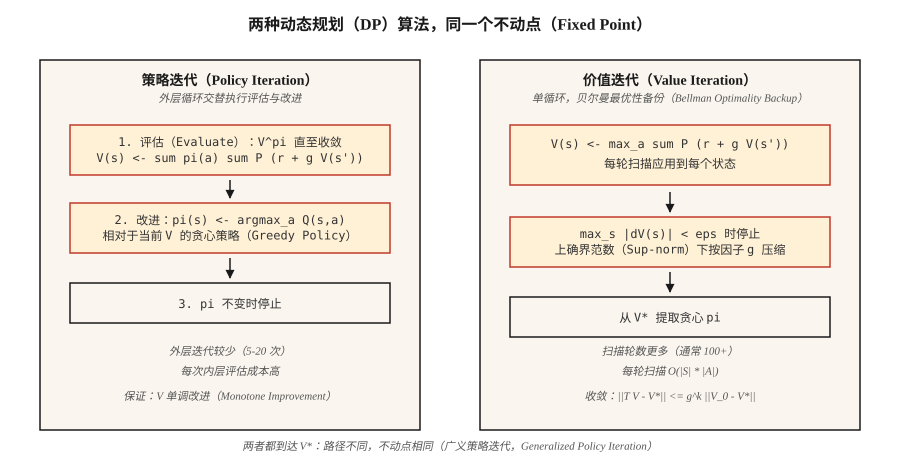

# 动态规划：策略迭代与价值迭代（Dynamic Programming — Policy Iteration & Value Iteration）

> 动态规划（Dynamic Programming，DP）就像提前知道答案线索的强化学习：转移函数和奖励函数已经给定，只需反复迭代贝尔曼方程，直到 `V` 或 `π` 不再变化。它是所有基于采样的方法努力逼近的基准。

**Type:** Build
**Languages:** Python
**Prerequisites:** 阶段 9 · 01（马尔可夫决策过程）
**Time:** 约 75 分钟

## 问题（The Problem）

你有一个模型已知的 MDP，可以查询任意状态—动作对的 `P(s' | s, a)` 和 `R(s, a, s')`。库存管理者知道需求分布，棋盘游戏具有确定性转移，网格世界只需四行 Python。这意味着你拥有一个*模型*。

无模型强化学习（Model-free RL），如 Q 学习、PPO 和 REINFORCE，是为没有模型、只能从环境采样的情形设计的。但有模型时，动态规划提供更快、更好的方法。Bellman 在 1957 年设计了这些方法，至今它们仍定义着正确性的标准：人们说“这个 MDP 的最优策略”时，指的就是 DP 返回的策略。

2026 年仍需要它们，有三个原因。第一，强化学习研究中的表格环境（GridWorld、FrozenLake、CliffWalking）都用 DP 求得作为金标准的策略。第二，精确价值可以*调试*采样方法：如果 Q 学习对 `V*(s_0)` 的估计与 DP 答案相差 30%，你的 Q 学习就有缺陷。第三，现代离线强化学习和规划方法，包括蒙特卡洛树搜索（Monte Carlo Tree Search，MCTS）、AlphaZero 的搜索及阶段 9 · 10 的基于模型的强化学习，都在学习到或给定的模型上迭代贝尔曼备份（Bellman Backup）。

## 概念（The Concept）



**两种算法，都是贝尔曼方程的不动点迭代。**

**策略迭代（Policy Iteration）。** 交替执行两个步骤，直到策略不再改变。

1. *评估：* 给定策略 `π`，反复应用 `V(s) ← Σ_a π(a|s) Σ_{s',r} P(s',r|s,a) [r + γ V(s')]`，直到收敛，得到 `V^π`。
2. *改进：* 给定 `V^π`，令 `π` 成为相对于 `V^π` 的贪心策略：`π(s) ← argmax_a Σ_{s',r} P(s',r|s,a) [r + γ V(s')]`。

收敛有保证，因为 (a) 每次改进要么保持 `π` 不变，要么使某些状态的 `V^π` 严格增加；(b) 确定性策略的空间是有限的。即便状态空间很大，通常也只需约 5–20 次外层迭代。

**价值迭代（Value Iteration）。** 将评估和改进合并为一轮扫描，应用贝尔曼*最优性*方程：

`V(s) ← max_a Σ_{s',r} P(s',r|s,a) [r + γ V(s')]`

重复执行直到 `max_s |V_{new}(s) - V(s)| < ε`。最后通过选择贪心动作提取策略。每次迭代更快，因为没有内层评估循环，但通常需要更多次迭代才能收敛。

**广义策略迭代（Generalized Policy Iteration，GPI）。** 这是统一的理解框架。价值函数与策略相互促进；任何使二者趋于相互一致的方法，如异步价值迭代、修正策略迭代、Q 学习、演员—评论家方法和 PPO，都是 GPI 的实例。

**为什么 `γ < 1` 很重要。** 贝尔曼算子在上确界范数下是 `γ`-压缩映射：`||T V - T V'||_∞ ≤ γ ||V - V'||_∞`。压缩性意味着不动点唯一且以几何速度收敛。去掉 `γ < 1` 就失去这一保证，需要有限时域或吸收终止状态。

```figure
value-iteration-gamma
```

## 动手实现（Build It）

### 第 1 步：构建网格世界 MDP 模型（Step 1: build the GridWorld MDP model）

沿用第 01 课的 4×4 网格世界，并加入随机变体：智能体以概率 `0.1` 滑向随机的垂直方向。

```python
SLIP = 0.1

def transitions(state, action):
    if state == TERMINAL:
        return [(state, 0.0, 1.0)]
    outcomes = []
    for direction, prob in action_probs(action):
        outcomes.append((apply_move(state, direction), -1.0, prob))
    return outcomes
```

`transitions(s, a)` 返回 `(s', r, p)` 列表。这就是完整模型。

### 第 2 步：策略评估（Step 2: policy evaluation）

给定策略 `π(s) = {action: prob}`，迭代贝尔曼方程，直到 `V` 不再变化：

```python
def policy_evaluation(policy, gamma=0.99, tol=1e-6):
    V = {s: 0.0 for s in states()}
    while True:
        delta = 0.0
        for s in states():
            v = sum(pi_a * sum(p * (r + gamma * V[s_prime])
                              for s_prime, r, p in transitions(s, a))
                   for a, pi_a in policy(s).items())
            delta = max(delta, abs(v - V[s]))
            V[s] = v
        if delta < tol:
            return V
```

### 第 3 步：策略改进（Step 3: policy improvement）

将 `π` 替换为相对于 `V` 的贪心策略。如果 `π` 没有变化，就返回结果，因为已经达到最优。

```python
def policy_improvement(V, gamma=0.99):
    new_policy = {}
    for s in states():
        best_a = max(
            ACTIONS,
            key=lambda a: sum(p * (r + gamma * V[s_prime])
                              for s_prime, r, p in transitions(s, a)),
        )
        new_policy[s] = best_a
    return new_policy
```

### 第 4 步：组合两个步骤（Step 4: stitch them together）

```python
def policy_iteration(gamma=0.99):
    policy = {s: "up" for s in states()}   # arbitrary start
    for _ in range(100):
        V = policy_evaluation(lambda s: {policy[s]: 1.0}, gamma)
        new_policy = policy_improvement(V, gamma)
        if new_policy == policy:
            return V, policy
        policy = new_policy
```

在 4×4 网格中通常只需 4–6 次外层迭代即可收敛。输出 `V*(0,0) ≈ -6`，以及一个严格减少剩余步数的策略。

### 第 5 步：价值迭代，单循环版本（Step 5: value iteration）

```python
def value_iteration(gamma=0.99, tol=1e-6):
    V = {s: 0.0 for s in states()}
    while True:
        delta = 0.0
        for s in states():
            v = max(sum(p * (r + gamma * V[s_prime])
                       for s_prime, r, p in transitions(s, a))
                   for a in ACTIONS)
            delta = max(delta, abs(v - V[s]))
            V[s] = v
        if delta < tol:
            break
    policy = policy_improvement(V, gamma)
    return V, policy
```

不动点相同，代码更少。

## 常见陷阱（Pitfalls）

- **忘记处理终止状态。** 对吸收状态应用贝尔曼更新时，仍会选出一个不起作用的“最佳动作”。用 `if s == terminal: V[s] = 0` 进行保护。
- **上确界范数与 L2 收敛。** 使用 `max |V_new - V|`，而非平均值。理论保证针对的是上确界范数。
- **原地更新与同步更新。** 原地更新 `V[s]`（Gauss-Seidel）比使用独立的 `V_new` 字典（Jacobi）收敛更快。生产代码使用原地更新。
- **策略中的并列值。** 若两个动作的 Q 值相同，`argmax` 每轮可能采用不同的平局处理方式，使“策略稳定”检查来回振荡。使用稳定规则，例如按固定顺序选择第一个动作。
- **状态空间爆炸。** DP 每轮扫描的复杂度是 `O(|S| · |A|)`，适用于最多约 10⁷ 个状态。再大就需要函数逼近（阶段 9 · 05 及后续课程）。

## 实际应用（Use It）

在 2026 年，DP 是正确性基线，也是规划器的内层循环：

| 使用场景 | 方法 |
|----------|--------|
| 精确求解小型表格 MDP | 价值迭代（更简单）或策略迭代（外层步骤更少） |
| 验证 Q 学习 / PPO 实现 | 在玩具环境中与 DP 的最优 V* 比较 |
| 基于模型的强化学习（阶段 9 · 10） | 在学到的转移模型上进行贝尔曼备份 |
| AlphaZero / MuZero 中的规划 | 蒙特卡洛树搜索 = 异步贝尔曼备份 |
| 离线强化学习（CQL、IQL） | 保守 Q 迭代：对分布外（Out-of-distribution，OOD）动作施加惩罚的 DP |

每当有人说“最优价值函数”，指的就是“DP 的不动点”。在论文里看到 `V*` 或 `Q*` 时，就想想这个循环。

## 交付成果（Ship It）

保存为 `outputs/skill-dp-solver.md`：

```markdown
---
name: dp-solver
description: 通过策略迭代或价值迭代精确求解小型表格 MDP，并报告收敛行为。
version: 1.0.0
phase: 9
lesson: 2
tags: [rl, dynamic-programming, bellman]
---

给定模型已知的 MDP，输出：

1. 选择。采用策略迭代还是价值迭代，结合 |S|、|A|、γ 说明理由。
2. 初始化。给出 V_0、初始策略，以及收敛对初始化的敏感性。
3. 停止条件。给出上确界范数容差 ε 和预计扫描轮数。
4. 验证。精确计算 V*(s_0)，并提取贪心策略。
5. 用途。说明如何用这一基线调试或评估基于采样的方法。

拒绝在超过 10⁷ 个状态的空间上运行 DP。没有上确界范数检查时，拒绝声称已收敛。将无限时域任务中的任何 γ ≥ 1 标记为违反收敛保证。
```

## 练习（Exercises）

1. **简单。** 在 4×4 网格世界中取 `γ ∈ {0.9, 0.99}` 运行价值迭代。需要多少轮扫描才满足 `max |ΔV| < 1e-6`？将 `V*` 打印为 4×4 网格。
2. **中等。** 在*随机*网格世界中比较策略迭代与价值迭代（滑移概率 `0.1`）。统计扫描轮数、实际耗时及最终的 `V*(0,0)`。哪一种按迭代次数衡量收敛更快？按实际耗时呢？
3. **困难。** 构建修正策略迭代：评估时只扫描 `k` 轮，而不是迭代至收敛。对 `k ∈ {1, 2, 5, 10, 50}` 绘制 `V*(0,0)` 误差随 `k` 变化的曲线。该曲线揭示了评估与改进之间怎样的权衡？

## 关键术语（Key Terms）

| 术语 | 常见说法 | 实际含义 |
|------|-----------------|-----------------------|
| 策略迭代（Policy Iteration） | “DP 算法” | 交替评估（`V^π`）与改进（相对于 `V^π` 的贪心 `π`），直到策略不再变化。 |
| 价值迭代（Value Iteration） | “更快的 DP” | 一轮扫描应用贝尔曼最优性备份，以几何速度收敛到 `V*`。 |
| 贝尔曼算子（Bellman Operator） | “递推关系” | `(T V)(s) = max_a Σ P (r + γ V(s'))`；上确界范数下的 `γ`-压缩映射。 |
| 压缩映射（Contraction） | “DP 为什么收敛” | 满足 `\|\|T x - T y\|\| ≤ γ \|\|x - y\|\|` 的算子 `T` 具有唯一不动点。 |
| 广义策略迭代（GPI） | “一切都是 DP” | 使 `V` 与 `π` 趋于相互一致的任意方法。 |
| 同步更新（Synchronous Update） | “Jacobi 风格” | 一轮扫描始终使用旧 `V`，易于分析，但较慢。 |
| 原地更新（In-place Update） | “Gauss-Seidel 风格” | 使用正在更新的 `V`，实践中收敛更快。 |

## 延伸阅读（Further Reading）

- [Sutton 与 Barto（2018）：第 4 章，动态规划](http://incompleteideas.net/book/RLbook2020.pdf)：策略迭代与价值迭代的经典讲解。
- [Bertsekas（2019）：《强化学习与最优控制》](http://www.athenasc.com/rlbook.html)：严格讨论压缩映射论证。
- [Puterman（2005）：《马尔可夫决策过程》](https://onlinelibrary.wiley.com/doi/book/10.1002/9780470316887)：修正策略迭代及其收敛分析。
- [Howard（1960）：《动态规划与马尔可夫过程》](https://mitpress.mit.edu/9780262582300/dynamic-programming-and-markov-processes/)：最早提出策略迭代的论文。
- [Bertsekas 与 Tsitsiklis（1996）：《神经动态规划》](http://www.athenasc.com/ndpbook.html)：连接 DP 与近似 DP / 深度强化学习，是后续每课的基础。
