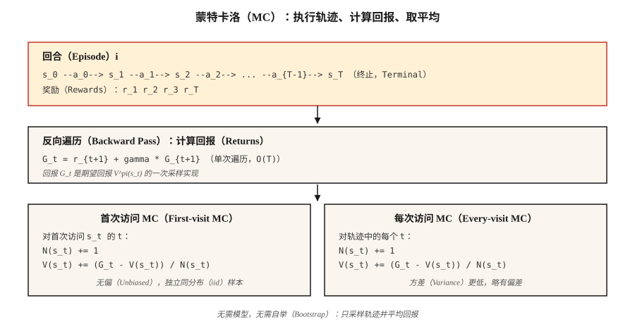

# 蒙特卡洛方法：从完整回合中学习（Monte Carlo Methods — Learning from Complete Episodes）

> 动态规划需要模型，蒙特卡洛方法（Monte Carlo，MC）只需要回合。运行策略，观察回报，取其平均。这是强化学习中最简单的思路，也是理解后续所有内容的关键。

**Type:** Build
**Languages:** Python
**Prerequisites:** 阶段 9 · 01（MDP），阶段 9 · 02（动态规划）
**Time:** 约 75 分钟

## 问题（The Problem）

动态规划很优雅，却假设你可以查询每个状态与动作的 `P(s' | s, a)`。现实世界几乎都不满足这一点。机器人无法解析计算施加关节力矩后相机像素的分布；定价算法无法对顾客的所有可能反应积分；大语言模型无法枚举一个词元之后的所有续写。

你需要一种只要求能从环境中*采样*的方法。运行策略，得到轨迹 `s_0, a_0, r_1, s_1, a_1, r_2, …, s_T`，再用它估计价值。这就是蒙特卡洛方法。

从 DP 到 MC 的转变在思路上很重要：从*已知模型 + 精确备份*转向*采样轨迹 + 平均回报*。方差增大了，但适用范围大幅扩展。本课之后的所有强化学习算法，包括时序差分（Temporal Difference，TD）、Q 学习、REINFORCE、PPO、GRPO，本质上都是蒙特卡洛估计器，有些在此基础上叠加自举（Bootstrapping）。

## 概念（The Concept）



**一句话概括核心思想：** `V^π(s) = E_π[G_t | s_t = s] ≈ (1/N) Σ_i G^{(i)}(s)`，其中 `G^{(i)}(s)` 是在策略 `π` 下访问 `s` 后观测到的回报。

**首次访问与每次访问 MC。** 如果一个回合多次访问状态 `s`，首次访问 MC 只计入第一次访问后的回报；每次访问 MC 计入所有访问。两者在极限下都无偏。首次访问更易分析，样本独立同分布（Independent and Identically Distributed，iid）；每次访问能利用每回合更多的数据，实践中通常收敛更快。

**增量均值（Incremental Mean）。** 无需存储全部回报，只需更新运行均值：

`V_n(s) = V_{n-1}(s) + (1/n) [G_n - V_{n-1}(s)]`

整理为 `V_new = V_old + α · (target - V_old)`，其中 `α = 1/n`。把 `1/n` 换成常数步长 `α ∈ (0, 1)`，就得到能跟踪 `π` 变化的非平稳 MC 估计器。这一变化贯穿从 MC 到 TD 再到现代强化学习算法的演进。

**探索现在成为问题。** DP 通过枚举遍历每个状态，MC 只能看到策略访问的状态。如果 `π` 是确定性的，状态空间中的大片区域就永远无法采样，价值估计始终为零。按历史顺序，有三种解决方案：

1. **探索性起点（Exploring Starts）。** 每回合从随机 (s, a) 对开始。能保证覆盖，但实践中不现实，例如无法把机器人“重置”到任意状态。
2. **ε-贪心（ε-greedy）。** 相对于当前 Q 贪心行动，但以概率 `ε` 选择随机动作。渐近地，所有状态—动作对都能得到采样。
3. **离策略 MC（Off-policy MC）。** 在行为策略 `μ` 下收集数据，通过重要性采样（Importance Sampling，IS）学习目标策略 `π`。方差较高，却连接了 DQN 等使用回放缓冲区的方法。

**蒙特卡洛控制（Monte Carlo Control）。** 像策略迭代一样执行“评估 → 改进 → 评估”，但评估基于采样：

1. 运行 `π`，得到一个回合。
2. 根据观测回报更新 `Q(s, a)`。
3. 令 `π` 成为相对于 `Q` 的 ε-贪心策略。
4. 重复上述过程。

在温和条件下（每一对都被无限次访问，`α` 满足 Robbins-Monro 条件），以概率 1 收敛到 `Q*` 和 `π*`。

```figure
epsilon-greedy
```

## 动手实现（Build It）

### 第 1 步：执行轨迹，得到 (s, a, r) 列表（Step 1: rollout）

```python
def rollout(env, policy, max_steps=200):
    trajectory = []
    s = env.reset()
    for _ in range(max_steps):
        a = policy(s)
        s_next, r, done = env.step(s, a)
        trajectory.append((s, a, r))
        s = s_next
        if done:
            break
    return trajectory
```

不需要模型，只需要 `env.reset()` 和 `env.step(s, a)`。接口与 gym 环境相同，但做了精简。

### 第 2 步：反向扫描计算回报（Step 2: compute returns）

```python
def returns_from(trajectory, gamma):
    returns = []
    G = 0.0
    for _, _, r in reversed(trajectory):
        G = r + gamma * G
        returns.append(G)
    return list(reversed(returns))
```

单次遍历，复杂度为 `O(T)`。反向递推 `G_t = r_{t+1} + γ G_{t+1}` 避免重复求和。

### 第 3 步：首次访问 MC 评估（Step 3: first-visit MC evaluation）

```python
def mc_policy_evaluation(env, policy, episodes, gamma=0.99):
    V = defaultdict(float)
    counts = defaultdict(int)
    for _ in range(episodes):
        trajectory = rollout(env, policy)
        returns = returns_from(trajectory, gamma)
        seen = set()
        for t, ((s, _, _), G) in enumerate(zip(trajectory, returns)):
            if s in seen:
                continue
            seen.add(s)
            counts[s] += 1
            V[s] += (G - V[s]) / counts[s]
    return V
```

三行完成核心工作：首次访问时标记状态、增加计数、更新运行均值。

### 第 4 步：同策略 ε-贪心 MC 控制（Step 4: ε-greedy MC control）

```python
def mc_control(env, episodes, gamma=0.99, epsilon=0.1):
    Q = defaultdict(lambda: {a: 0.0 for a in ACTIONS})
    counts = defaultdict(lambda: {a: 0 for a in ACTIONS})

    def policy(s):
        if random() < epsilon:
            return choice(ACTIONS)
        return max(Q[s], key=Q[s].get)

    for _ in range(episodes):
        trajectory = rollout(env, policy)
        returns = returns_from(trajectory, gamma)
        seen = set()
        for (s, a, _), G in zip(trajectory, returns):
            if (s, a) in seen:
                continue
            seen.add((s, a))
            counts[s][a] += 1
            Q[s][a] += (G - Q[s][a]) / counts[s][a]
    return Q, policy
```

### 第 5 步：与 DP 金标准比较（Step 5: compare to DP gold standard）

随着回合数趋于无穷，你的 `V^π` 的 MC 估计应与第 02 课的 DP 结果一致。实践中，4×4 网格世界运行 50,000 个回合，可使估计与 DP 答案相差不超过 `~0.1`。

## 常见陷阱（Pitfalls）

- **无限回合。** MC 要求回合*终止*。如果策略可能无限循环，设置 `max_steps` 上限，并将触顶视为隐含失败。网格世界中的随机策略经常超时，这很正常，只需确保统计方式正确。
- **方差。** MC 使用完整回报。回合很长时方差很大：末尾一次不走运的奖励会让 `V(s_0)` 同幅度变化。TD 方法（第 04 课）通过自举降低方差。
- **状态覆盖。** 初始 Q 值并列时，贪心 MC 只会尝试一个动作。你*必须*探索，可采用 ε-贪心、探索性起点或置信上界（Upper Confidence Bound，UCB）。
- **非平稳策略。** 如果 `π` 发生变化（如 MC 控制），旧回报来自不同策略。常数 α 的 MC 可以处理，样本平均 MC 则不能。
- **离策略重要性采样。** 权重 `π(a|s)/μ(a|s)` 沿轨迹相乘，方差随时域爆炸。用逐决策加权重要性采样限制它，或改用 TD。

## 实际应用（Use It）

2026 年蒙特卡洛方法的用途：

| 使用场景 | 为什么使用 MC |
|----------|--------|
| 短时域游戏（21 点、扑克） | 回合自然终止，回报明确。 |
| 对已记录策略进行离线评估 | 对存储轨迹的折扣回报取平均。 |
| 蒙特卡洛树搜索（AlphaZero） | 从树叶节点执行 MC 轨迹，引导选择。 |
| 大语言模型强化学习评估 | 对给定策略的采样补全文本计算平均奖励。 |
| PPO 中的基线估计 | 优势目标 `A_t = G_t - V(s_t)` 使用 MC 的 `G_t`。 |
| 强化学习教学 | 最简单且确实有效的算法，去掉自举即可看清核心。 |

现代深度强化学习算法（PPO、SAC）通过 `n` 步回报或广义优势估计（Generalized Advantage Estimation，GAE），在纯 MC（完整回报）和纯 TD（单步自举）之间插值。两个端点都是同一估计器的实例。

## 交付成果（Ship It）

保存为 `outputs/skill-mc-evaluator.md`：

```markdown
---
name: mc-evaluator
description: 通过蒙特卡洛轨迹评估策略，生成收敛报告，并在可用时与 DP 比较。
version: 1.0.0
phase: 9
lesson: 3
tags: [rl, monte-carlo, evaluation]
---

给定一个环境（按回合运行，提供 reset+step API）和一个策略，输出：

1. 方法。首次访问还是每次访问 MC，并说明理由。
2. 回合预算。目标回合数、方差诊断、预期标准误差。
3. 探索计划。ε 调度（如需要）或探索性起点。
4. 金标准比较。表格任务使用 DP 最优 V*；否则使用 Q 学习 / PPO 基线提供的界。
5. 终止检查。最大步数限制、超时、非终止轨迹的处理方式。

没有有限时域上限时，拒绝对非回合式任务运行 MC。对于表格任务，每个状态不足 100 个回合时拒绝报告 V^π 估计。将动作方差为零的策略标记为探索风险。
```

## 练习（Exercises）

1. **简单。** 在 4×4 网格世界中实现均匀随机策略的首次访问 MC 评估。运行 10,000 个回合，绘制 `V(0,0)` 随回合数变化的曲线，并与 DP 答案比较。
2. **中等。** 取 `ε ∈ {0.01, 0.1, 0.3}` 实现 ε-贪心 MC 控制，比较 20,000 个回合后的平均回报。曲线是什么形状？偏差—方差权衡体现在哪里？
3. **困难。** 通过重要性采样实现*离策略* MC：在均匀随机策略 `μ` 下收集数据，估计确定性最优策略 `π` 的 `V^π`。比较普通 IS、逐决策 IS 与加权 IS。哪一种方差最低？

## 关键术语（Key Terms）

| 术语 | 常见说法 | 实际含义 |
|------|-----------------|-----------------------|
| 蒙特卡洛（Monte Carlo） | “随机采样” | 对来自分布的独立同分布样本取平均以估计期望。 |
| 回报（Return）`G_t` | “未来奖励” | 从步骤 `t` 到回合结束的折扣奖励总和：`Σ_{k≥0} γ^k r_{t+k+1}`。 |
| 首次访问 MC（First-visit MC） | “每个状态只计一次” | 只有回合中的首次访问对价值估计有贡献。 |
| 每次访问 MC（Every-visit MC） | “使用所有访问” | 每次访问都计入，略有偏差，但样本效率更高。 |
| ε-贪心（ε-greedy） | “探索噪声” | 以概率 `1-ε` 选贪心动作，以概率 `ε` 选随机动作。 |
| 重要性采样（Importance Sampling） | “纠正从错误分布采样的影响” | 用 `π(a\|s)/μ(a\|s)` 的乘积对回报重新加权，从 `μ` 的数据估计 `V^π`。 |
| 同策略（On-policy） | “从自己的数据学习” | 目标策略 = 行为策略。例如普通 MC、PPO、SARSA。 |
| 离策略（Off-policy） | “从别人的数据学习” | 目标策略 ≠ 行为策略。例如重要性采样 MC、Q 学习、DQN。 |

## 延伸阅读（Further Reading）

- [Sutton 与 Barto（2018）：第 5 章，蒙特卡洛方法](http://incompleteideas.net/book/RLbook2020.pdf)：经典论述。
- [Singh 与 Sutton（1996）：使用替换资格迹的强化学习](https://link.springer.com/article/10.1007/BF00114726)：首次访问与每次访问的分析。
- [Precup、Sutton、Singh（2000）：用于离策略策略评估的资格迹](http://incompleteideas.net/papers/PSS-00.pdf)：离策略 MC 与方差控制。
- [Mahmood 等（2014）：用于离策略学习的加权重要性采样](https://arxiv.org/abs/1404.6362)：现代低方差 IS 估计器。
- [Tesauro（1995）：TD-Gammon，自学型双陆棋程序](https://dl.acm.org/doi/10.1145/203330.203343)：首次大规模实证展示 MC/TD 自我对弈收敛到超人水平，是本阶段后半部分所有课程的概念前身。
