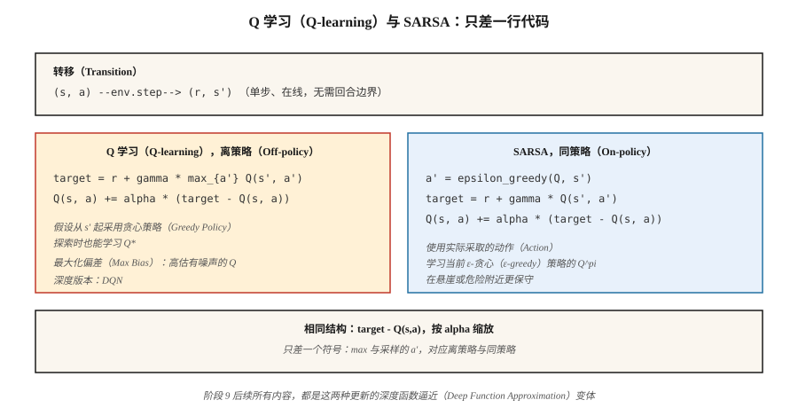

# 时序差分：Q 学习与 SARSA（Temporal Difference — Q-Learning & SARSA）

> 蒙特卡洛方法要等回合结束。时序差分（Temporal Difference，TD）通过对下一状态的价值估计进行自举，每步之后都更新。Q 学习是离策略且乐观的；SARSA 是同策略且谨慎的。两者的核心都只有一行代码，也都是本阶段深度强化学习方法的基础。

**Type:** Build
**Languages:** Python
**Prerequisites:** 阶段 9 · 01（MDP），阶段 9 · 02（动态规划），阶段 9 · 03（蒙特卡洛）
**Time:** 约 75 分钟

## 问题（The Problem）

蒙特卡洛方法有效，但有两个昂贵的要求：回合必须终止，而且只有最终回报到齐后才更新。如果回合长 1,000 步，MC 就要等 1,000 步才能做任何更新。它的方差高、偏差低，实践中速度慢。

动态规划恰好相反，采用零方差的自举备份，但要求模型已知。

时序差分学习取两者之长。由单次转移 `(s, a, r, s')` 构造单步目标 `r + γ V(s')`，让 `V(s)` 向其靠近。不需要模型，也不需要完整回合。等式右侧使用近似 `V` 会引入偏差，但方差远低于 MC，而且从第一步就能在线更新。

这是所有现代强化学习方法，包括 DQN、A2C、PPO 和 SAC 的核心转折点。阶段 9 的后续内容，都是在本课的单步 TD 更新之上叠加函数逼近和各种技巧。

## 概念（The Concept）



**V 的 TD(0) 更新：**

`V(s) ← V(s) + α [r + γ V(s') - V(s)]`

方括号中的量是 TD 误差 `δ = r + γ V(s') - V(s)`，相当于 MC 中 `G_t - V(s_t)` 的在线版本。收敛要求 `α` 满足 Robbins-Monro 条件（`Σ α = ∞`、`Σ α² < ∞`），并且所有状态被无限次访问。

**Q 学习（Q-learning）。** 一种用于控制的离策略 TD 方法：

`Q(s, a) ← Q(s, a) + α [r + γ max_{a'} Q(s', a') - Q(s, a)]`

`max` 假设从 `s'` 起执行*贪心*策略，而不管智能体实际采取什么动作。这种解耦让智能体可以通过 ε-贪心探索，同时让 Q 学习学到 `Q*`。Mnih 等（2015）将其转化为 Atari 上的深度 Q 学习（第 05 课）。

**SARSA。** 一种同策略 TD 方法：

`Q(s, a) ← Q(s, a) + α [r + γ Q(s', a') - Q(s, a)]`

其名称来自元组 `(s, a, r, s', a')`。SARSA 使用智能体下一步*实际*采取的动作 `a'`，而不是贪心 `argmax`。它收敛到正在执行的 ε-贪心策略 `π` 的 `Q^π`；当 `ε → 0` 时，极限为 `Q*`。

**悬崖行走中的差别。** 在经典悬崖行走任务中，坠崖奖励为 -100。Q 学习学会沿悬崖边缘走最优路径，但探索时偶尔受罚。SARSA 把探索噪声计入 Q 值，因此会学到离悬崖一步远的安全路径。经过训练，当 `ε → 0` 时两者都达到最优。实践中这很重要：若部署时仍在探索，SARSA 的行为更保守。

**期望 SARSA（Expected SARSA）。** 用 `Q(s', a')` 在 `π` 下的期望替代它：

`Q(s, a) ← Q(s, a) + α [r + γ Σ_{a'} π(a'|s') Q(s', a') - Q(s, a)]`

方差比 SARSA 更低，因为无需采样 `a'`，同时保持相同的同策略目标。现代教材常将其作为默认选择。

**n 步 TD 与 TD(λ)。** 等待 `n` 步再自举，就能在 TD(0) 与 MC 之间插值。`n=1` 是 TD，`n=∞` 是 MC。TD(λ) 用几何权重 `(1-λ)λ^{n-1}` 对所有 `n` 求加权平均。多数深度强化学习使用 3 到 20 之间的 `n`。

```figure
qlearning-gridworld
```

## 动手实现（Build It）

### 第 1 步：ε-贪心策略上的 SARSA（Step 1: SARSA on ε-greedy policy）

```python
def sarsa(env, episodes, alpha=0.1, gamma=0.99, epsilon=0.1):
    Q = defaultdict(lambda: {a: 0.0 for a in ACTIONS})

    def choose(s):
        if random() < epsilon:
            return choice(ACTIONS)
        return max(Q[s], key=Q[s].get)

    for _ in range(episodes):
        s = env.reset()
        a = choose(s)
        while True:
            s_next, r, done = env.step(s, a)
            a_next = choose(s_next) if not done else None
            target = r + (gamma * Q[s_next][a_next] if not done else 0.0)
            Q[s][a] += alpha * (target - Q[s][a])
            if done:
                break
            s, a = s_next, a_next
    return Q
```

八行完成。与 Q 学习的*唯一*区别是目标值那一行。

### 第 2 步：Q 学习（Step 2: Q-learning）

```python
def q_learning(env, episodes, alpha=0.1, gamma=0.99, epsilon=0.1):
    Q = defaultdict(lambda: {a: 0.0 for a in ACTIONS})
    for _ in range(episodes):
        s = env.reset()
        while True:
            a = choose(s, Q, epsilon)
            s_next, r, done = env.step(s, a)
            target = r + (gamma * max(Q[s_next].values()) if not done else 0.0)
            Q[s][a] += alpha * (target - Q[s][a])
            if done:
                break
            s = s_next
    return Q
```

`max` 将目标与行为解耦。这个符号就是同策略与离策略的区别。

### 第 3 步：学习曲线（Step 3: learning curves）

每 100 个回合记录平均回报。Q 学习在简单的确定性网格世界中收敛更快；SARSA 在悬崖行走中更保守。在 `code/main.py` 的 4×4 网格世界中，设置 `α=0.1, ε=0.1` 时，两者在约 2,000 个回合后都接近最优。

### 第 4 步：与 DP 真值比较（Step 4: compare to DP truth）

运行价值迭代（第 02 课）得到 `Q*`，检查 `max_{s,a} |Q_learned(s,a) - Q*(s,a)|`。正常的表格 TD 智能体在 4×4 网格世界运行 10,000 个回合后，误差应在 `~0.5` 以内。

## 常见陷阱（Pitfalls）

- **初始 Q 值很重要。** 乐观初始化（负奖励任务中取 `Q = 0`）鼓励探索，悲观初始化可能永远困住贪心策略。
- **α 调度。** 非平稳问题可使用常数 `α`。衰减的 `α_n = 1/n` 理论上保证收敛，但实践中太慢；将 `α` 固定在 `[0.05, 0.3]`，并监控学习曲线。
- **ε 调度。** 从较高值（`ε=1.0`）开始，衰减至 `ε=0.05`。“无限探索下的极限贪心”（Greedy in the Limit with Infinite Exploration，GLIE）是收敛条件。
- **Q 学习中的最大化偏差。** `Q` 有噪声时，`max` 算子向上偏，导致高估。Hasselt 的双 Q 学习（Double Q-learning，第 05 课 DDQN 使用）用两个 Q 表解决它。
- **不终止的回合。** TD 无需终止状态也能学习，但必须限制步数，或在触及上限时正确处理自举。标准做法是将触顶视为非终止，继续自举。
- **状态哈希。** 状态若为元组或张量，应使用可哈希键：用元组而非列表；浮点数元组应先舍入，而不是使用原始值。

## 实际应用（Use It）

2026 年 TD 方法的应用版图：

| 任务 | 方法 | 原因 |
|------|--------|--------|
| 小型表格环境 | Q 学习 | 直接学习最优策略。 |
| 同策略安全关键任务 | SARSA / 期望 SARSA | 探索时更保守。 |
| 高维状态 | DQN（阶段 9 · 05） | 神经网络 Q 函数，配合回放和目标网络。 |
| 连续动作 | SAC / TD3（阶段 9 · 07） | 对 Q 网络执行 TD 更新，策略网络输出动作。 |
| 大语言模型强化学习（基于奖励模型） | PPO / GRPO（阶段 9 · 08、12） | 演员—评论家架构，使用 GAE 得到 TD 风格优势。 |
| 离线强化学习 | CQL / IQL（阶段 9 · 08） | 加入保守正则化的 Q 学习。 |

2026 年论文中提到的“强化学习”，有九成是 Q 学习或 SARSA 的扩展。继续深入前，先亲手掌握表格更新。

## 交付成果（Ship It）

保存为 `outputs/skill-td-agent.md`：

```markdown
---
name: td-agent
description: 为表格或少量特征的强化学习任务选择 Q 学习、SARSA 或期望 SARSA。
version: 1.0.0
phase: 9
lesson: 4
tags: [rl, td-learning, q-learning, sarsa]
---

给定表格或少量特征的环境，输出：

1. 算法。Q 学习 / SARSA / 期望 SARSA / n 步变体。结合同策略与离策略区别和方差，用一句话说明理由。
2. 超参数。α、γ、ε 及衰减调度。
3. 初始化。Q_0 的值（乐观值或零）及理由。
4. 收敛诊断。目标学习曲线；若可用 DP，则检查 `|Q - Q*|`。
5. 部署注意事项。推理时探索将如何表现？是否需要 SARSA 的保守性？

拒绝将表格 TD 应用于超过 10⁶ 个状态的空间。没有最大化偏差警告时，拒绝交付 Q 学习智能体。标出训练全程将 ε 固定为 1.0 的智能体，因为它没有利用阶段。
```

## 练习（Exercises）

1. **简单。** 在 4×4 网格世界中实现 Q 学习与 SARSA。运行 2,000 个回合，绘制学习曲线（每 100 回合的平均回报）。谁收敛更快？
2. **中等。** 构建悬崖行走环境（4×12，最后一行为悬崖，奖励 -100 并重置到起点）。比较 Q 学习和 SARSA 的最终策略，分别截图展示路径。哪条更靠近悬崖？
3. **困难。** 实现双 Q 学习。在带噪声奖励的网格世界中（每步奖励加入 σ=5 的高斯噪声），展示 Q 学习明显高估 `V*(0,0)`，而双 Q 学习不会。

## 关键术语（Key Terms）

| 术语 | 常见说法 | 实际含义 |
|------|-----------------|-----------------------|
| TD 误差（TD Error） | “更新信号” | `δ = r + γ V(s') - V(s)`，即自举残差。 |
| TD(0) | “单步 TD” | 每次转移后，仅使用下一状态的估计更新。 |
| Q 学习（Q-learning） | “离策略强化学习入门” | 对下一状态动作取 `max` 的 TD 更新；无论行为策略如何，都学习 `Q*`。 |
| SARSA | “同策略 Q 学习” | 使用实际下一动作进行 TD 更新，学习当前 ε-贪心 π 的 `Q^π`。 |
| 期望 SARSA（Expected SARSA） | “低方差 SARSA” | 用 π 下的期望替代采样的 `a'`。 |
| GLIE | “正确的探索调度” | 无限探索下的极限贪心，是 Q 学习收敛所需条件。 |
| 自举（Bootstrapping） | “在目标中使用当前估计” | TD 与 MC 的区别所在，会引入偏差，但大幅降低方差。 |
| 最大化偏差（Maximization Bias） | “Q 学习高估” | 对有噪声估计取 `max` 会向上偏；双 Q 学习可修复。 |

## 延伸阅读（Further Reading）

- [Watkins 与 Dayan（1992）：Q 学习](https://link.springer.com/article/10.1007/BF00992698)：原始论文及收敛证明。
- [Sutton 与 Barto（2018）：第 6 章，时序差分学习](http://incompleteideas.net/book/RLbook2020.pdf)：TD(0)、SARSA、Q 学习和期望 SARSA。
- [Hasselt（2010）：双 Q 学习](https://papers.nips.cc/paper_files/paper/2010/hash/091d584fced301b442654dd8c23b3fc9-Abstract.html)：修复最大化偏差。
- [Seijen、Hasselt、Whiteson、Wiering（2009）：期望 SARSA 的理论与实证分析](https://ieeexplore.ieee.org/document/4927542)：期望 SARSA 的动机。
- [Rummery 与 Niranjan（1994）：使用连接主义系统的在线 Q 学习](https://www.researchgate.net/publication/2500611_On-Line_Q-Learning_Using_Connectionist_Systems)：提出 SARSA 的论文，当时称为“修正连接主义 Q 学习”。
- [Sutton 与 Barto（2018）：第 7 章，n 步自举](http://incompleteideas.net/book/RLbook2020.pdf)：将 TD(0) 推广到 TD(n)，连接 Q 学习、资格迹及后来的 PPO 中的 GAE。
