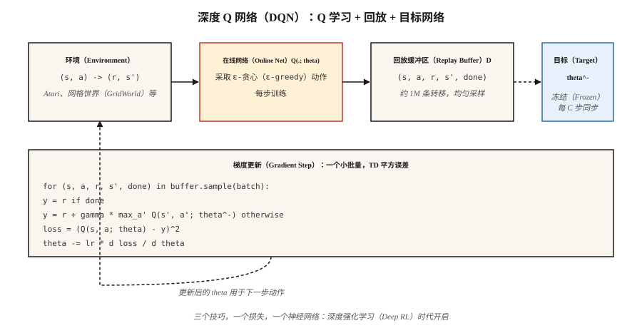

# 深度 Q 网络（Deep Q-Networks，DQN）

> 2013 年，Mnih 用原始像素训练单个 Q 学习网络，在七款 Atari 游戏上击败所有经典强化学习智能体。2015 年扩展至 49 款游戏并发表于 Nature，开启深度强化学习时代。DQN 就是 Q 学习加上三个让函数逼近稳定的技巧。

**Type:** Build
**Languages:** Python
**Prerequisites:** 阶段 3 · 03（反向传播），阶段 9 · 04（Q 学习、SARSA）
**Time:** 约 75 分钟

## 问题（The Problem）

表格 Q 学习需要为每个（状态、动作）对单独存储 Q 值。国际象棋棋盘约有 10⁴³ 个状态，一帧 Atari 图像有 210×160×3 = 100,800 个特征。表格强化学习在数千个状态时就难以维持，更别说数十亿个。

事后看来，解决办法很明显：用神经网络 `Q(s, a; θ)` 替代 Q 表。但这一点用了几十年才实现。朴素地把函数逼近用于 Q 学习，会在“致命三要素”（Deadly Triad）下发散：函数逼近 + 自举 + 离策略学习。Mnih 等（2013、2015）找到了三个稳定训练的工程技巧：

1. **经验回放（Experience Replay）** 消除转移间的相关性。
2. **目标网络（Target Network）** 冻结自举目标。
3. **奖励裁剪（Reward Clipping）** 统一梯度幅度。

Atari 上的 DQN 首次让同一架构、同一套超参数从原始像素出发解决几十个控制问题。此后所有深度强化学习扩展，包括 DDQN、Rainbow、Dueling、Distributional、R2D2、Agent57，都构建在这三个技巧之上。

## 概念（The Concept）



**目标。** DQN 最小化神经 Q 函数上的单步 TD 损失：

`L(θ) = E_{(s,a,r,s')~D} [ (r + γ max_{a'} Q(s', a'; θ^-) - Q(s, a; θ))² ]`

`θ` = 在线网络，每步通过梯度下降更新。`θ^-` = 目标网络，周期性从 `θ` 复制（约每 10,000 步）。`D` = 存储历史转移的回放缓冲区。

**按重要性排序的三个技巧：**

**经验回放。** 用环形缓冲区保存 `~10⁶` 条转移，每个训练步骤均匀随机采样一个小批量。这打破了时间相关性，因为连续帧几乎相同；让网络可以反复学习罕见的有奖励转移；还消除了连续梯度更新的相关性。没有它，神经网络上的同策略 TD 在 Atari 上会发散。

**目标网络。** 在贝尔曼方程两侧使用同一网络 `Q(·; θ)`，会使目标在每次更新时移动，相当于“追着自己跑”。解决办法是保留第二个冻结权重的网络 `Q(·; θ^-)`。每隔 `C` 步复制 `θ → θ^-`，让回归目标在数千次梯度更新中保持稳定。软更新 `θ^- ← τ θ + (1-τ) θ^-`（DDPG、SAC 使用）是更平滑的变体。

**奖励裁剪。** Atari 奖励幅度从 1 到超过 1000 不等。裁剪到 `{-1, 0, +1}`，可防止某个游戏支配梯度。在奖励幅度重要的任务中这样做不对；对于仅关注正负号的 Atari 则适用。

**双重 DQN（Double DQN）。** Hasselt（2016）修复最大化偏差：用在线网络*选择*动作，用目标网络*评估*动作。

`target = r + γ Q(s', argmax_{a'} Q(s', a'; θ); θ^-)`

可直接替换，效果稳定更好。默认使用它。

**其他改进（Rainbow，2017）：** 优先回放（更多采样高 TD 误差转移）、对偶架构（独立的 `V(s)` 和优势输出头）、噪声网络（学习探索）、n 步回报、分布式 Q（C51/QR-DQN）、多步自举。每项带来几个百分点的提升，收益大致可叠加。

```figure
f3-dqn-stability
```

## 动手实现（Build It）

这里的代码只用标准库，不用 numpy。我们在微型连续网格世界上使用手写的单隐藏层多层感知机（Multilayer Perceptron，MLP），让每步训练只需微秒。其算法与大规模 Atari DQN 相同。

### 第 1 步：回放缓冲区（Step 1: replay buffer）

```python
class ReplayBuffer:
    def __init__(self, capacity):
        self.buf = []
        self.capacity = capacity
    def push(self, s, a, r, s_next, done):
        if len(self.buf) == self.capacity:
            self.buf.pop(0)
        self.buf.append((s, a, r, s_next, done))
    def sample(self, batch, rng):
        return rng.sample(self.buf, batch)
```

Atari 使用约 50,000 的容量；我们的玩具环境 5,000 就足够。

### 第 2 步：微型 Q 网络，手写 MLP（Step 2: a tiny Q-network）

```python
class QNet:
    def __init__(self, n_in, n_hidden, n_actions, rng):
        self.W1 = [[rng.gauss(0, 0.3) for _ in range(n_in)] for _ in range(n_hidden)]
        self.b1 = [0.0] * n_hidden
        self.W2 = [[rng.gauss(0, 0.3) for _ in range(n_hidden)] for _ in range(n_actions)]
        self.b2 = [0.0] * n_actions
    def forward(self, x):
        h = [max(0.0, sum(w * xi for w, xi in zip(row, x)) + b) for row, b in zip(self.W1, self.b1)]
        q = [sum(w * hi for w, hi in zip(row, h)) + b for row, b in zip(self.W2, self.b2)]
        return q, h
```

前向传播：线性层 → ReLU → 线性层。这就是整个网络。

### 第 3 步：DQN 更新（Step 3: the DQN update）

```python
def train_step(online, target, batch, gamma, lr):
    grads = zeros_like(online)
    for s, a, r, s_next, done in batch:
        q, h = online.forward(s)
        if done:
            y = r
        else:
            q_next, _ = target.forward(s_next)
            y = r + gamma * max(q_next)
        td_error = q[a] - y
        accumulate_grads(grads, online, s, h, a, td_error)
    apply_sgd(online, grads, lr / len(batch))
```

其结构与第 04 课的 Q 学习相同，只有两点不同：(a) 通过可微的 `Q(·; θ)` 反向传播，而不是索引表格；(b) 目标使用 `Q(·; θ^-)`。

### 第 4 步：外层循环（Step 4: the outer loop）

每个回合中，根据 `Q(·; θ)` 采取 ε-贪心动作，将转移放入缓冲区，采样小批量，执行一次梯度更新，并定期同步 `θ^- ← θ`。模式如下：

```python
for episode in range(N):
    s = env.reset()
    while not done:
        a = epsilon_greedy(online, s, epsilon)
        s_next, r, done = env.step(s, a)
        buffer.push(s, a, r, s_next, done)
        if len(buffer) >= batch:
            train_step(online, target, buffer.sample(batch), gamma, lr)
        if steps % sync_every == 0:
            target = copy(online)
        s = s_next
```

在使用 16 维独热状态的微型网格世界中，智能体约 500 个回合就能学到近乎最优的策略。在 Atari 上，将规模扩大到 200M 帧，并添加卷积神经网络（Convolutional Neural Network，CNN）特征提取器。

## 常见陷阱（Pitfalls）

- **致命三要素。** 函数逼近 + 离策略 + 自举可能发散。DQN 用目标网络和回放缓解，二者都不要移除。
- **探索。** ε 必须衰减，通常在训练前约 10% 的过程中从 1.0 降到 0.01。早期探索不足会使 Q 网络收敛到局部区域。
- **高估。** 对有噪声的 Q 取 `max` 会向上偏。生产环境始终使用双重 DQN。
- **奖励尺度。** 对奖励裁剪或归一化；梯度幅度与奖励幅度成正比。
- **回放缓冲区冷启动。** 缓冲区积累数千条转移后再训练。早期仅约 20 个样本上的梯度会导致过拟合。
- **目标同步频率。** 过频约等于没有目标网络；过疏约等于使用陈旧目标。Atari DQN 每 10,000 个环境步骤同步。经验规则是每训练时域的约 1/100 同步一次。
- **观测预处理。** Atari DQN 堆叠 4 帧以使状态满足马尔可夫性质。任何需要速度信息的环境，都需要帧堆叠或循环状态。

## 实际应用（Use It）

2026 年，DQN 很少是最先进的方法，但仍是离策略算法的参考基准：

| 任务 | 首选方法 | 为什么不直接用 DQN？ |
|------|------------------|--------------|
| 类 Atari 的离散动作任务 | Rainbow DQN 或 Muesli | 框架相同，技巧更多。 |
| 连续控制 | SAC / TD3（阶段 9 · 07） | DQN 没有策略网络。 |
| 同策略 / 高吞吐量 | PPO（阶段 9 · 08） | 无需回放缓冲区，更易扩展。 |
| 离线强化学习 | CQL / IQL / Decision Transformer | 保守的 Q 目标，避免自举失控。 |
| 大型离散动作空间（推荐系统） | 带动作嵌入的 DQN，或 IMPALA | DQN 可用，配套改进很重要。 |
| 大语言模型强化学习 | PPO / GRPO | 面向序列而非单步，损失不同。 |

这些经验仍能迁移。回放与目标网络出现在 SAC、TD3、DDPG、SAC-X、AlphaZero 的自我对弈缓冲区以及所有离线强化学习方法中。奖励裁剪的思路延续为 PPO 中的优势归一化。这套架构就是蓝图。

## 交付成果（Ship It）

保存为 `outputs/skill-dqn-trainer.md`：

```markdown
---
name: dqn-trainer
description: 为离散动作强化学习任务生成 DQN 训练配置，包括缓冲区、目标同步、ε 调度与奖励裁剪。
version: 1.0.0
phase: 9
lesson: 5
tags: [rl, dqn, deep-rl]
---

给定一个离散动作环境（观测形状、动作数、时域、奖励尺度），输出：

1. 网络。架构（MLP / CNN / Transformer）、特征维度、深度。
2. 回放缓冲区。容量、小批量大小、预热样本数。
3. 目标网络。同步策略，每 C 步硬更新，或使用 τ 软更新。
4. 探索。ε 初值、终值、调度长度。
5. 损失。Huber 或均方误差（Mean Squared Error，MSE），梯度裁剪值，奖励裁剪规则。
6. 双重 DQN。默认开启，除非有明确理由禁用。

拒绝交付没有目标网络、没有回放缓冲区或 ε 恒为 1 的 DQN。拒绝连续动作任务，转用 SAC / TD3。若奖励范围超过单步均值的 10 倍，标记为需要裁剪或尺度归一化。
```

## 练习（Exercises）

1. **简单。** 运行 `code/main.py`，绘制每回合回报曲线。多少个回合后运行均值超过 -10？
2. **中等。** 禁用目标网络，在贝尔曼目标两侧都使用在线网络。衡量训练不稳定性：回报会振荡还是发散？
3. **困难。** 添加双重 DQN：在线网络选择 `argmax a'`，目标网络评估。在带噪声奖励的网格世界上运行 1,000 个回合，比较启用与禁用双重 DQN 时，`Q(s_0, best_a)` 相对于真实 `V*(s_0)` 的偏差。

## 关键术语（Key Terms）

| 术语 | 常见说法 | 实际含义 |
|------|-----------------|-----------------------|
| 深度 Q 网络（DQN） | “深度 Q 学习” | 使用神经 Q 函数、回放缓冲区和目标网络的 Q 学习。 |
| 经验回放（Experience Replay） | “打乱的转移” | 每次梯度更新都从环形缓冲区均匀采样，以消除数据相关性。 |
| 目标网络（Target Network） | “冻结自举” | 周期性复制 Q 并用于贝尔曼目标，稳定训练。 |
| 致命三要素（Deadly Triad） | “强化学习为何发散” | 函数逼近 + 自举 + 离策略 = 没有收敛保证。 |
| 双重 DQN（Double DQN） | “修复最大化偏差” | 在线网络选动作，目标网络评估动作。 |
| 对偶 DQN（Dueling DQN） | “V 和 A 输出头” | 分解 Q = V + A - mean(A)；输出相同，梯度流更好。 |
| Rainbow | “所有技巧” | 集 DDQN、PER、对偶架构、n 步、噪声网络及分布建模于一体。 |
| 优先经验回放（Prioritized Experience Replay，PER） | “优先回放” | 按 TD 误差幅度成比例采样转移。 |

## 延伸阅读（Further Reading）

- [Mnih 等（2013）：使用深度强化学习玩 Atari](https://arxiv.org/abs/1312.5602)：开启深度强化学习的 2013 年 NeurIPS 研讨会论文。
- [Mnih 等（2015）：通过深度强化学习实现人类水平控制](https://www.nature.com/articles/nature14236)：发表于 Nature 的 49 游戏 DQN 论文。
- [Hasselt、Guez、Silver（2016）：采用双 Q 学习的深度强化学习](https://arxiv.org/abs/1509.06461)：DDQN。
- [Wang 等（2016）：对偶网络架构](https://arxiv.org/abs/1511.06581)：对偶 DQN。
- [Hessel 等（2018）：Rainbow，组合深度强化学习改进](https://arxiv.org/abs/1710.02298)：叠加各种技巧的论文。
- [OpenAI Spinning Up：DQN](https://spinningup.openai.com/en/latest/algorithms/dqn.html)：清晰的现代讲解。
- [Sutton 与 Barto（2018）：第 9 章，带函数逼近的同策略预测](http://incompleteideas.net/book/RLbook2020.pdf)：教材对“致命三要素”（函数逼近 + 自举 + 离策略）的论述；DQN 的目标网络与回放缓冲区正是为控制它而设计。
- [CleanRL 的 DQN 实现](https://docs.cleanrl.dev/rl-algorithms/dqn/)：消融研究使用的单文件 DQN 参考实现，适合与本课从零实现的版本对照阅读。
