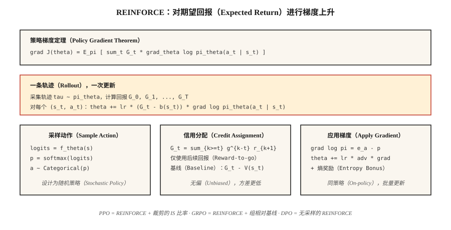

# 策略梯度：从零实现 REINFORCE（Policy Gradient — REINFORCE from Scratch）

> 不再估计价值，而是直接参数化策略，计算期望回报的梯度，沿上升方向更新。Williams（1992）用一个定理给出了它。这正是 PPO、GRPO 和所有大语言模型强化学习循环得以存在的基础。

**Type:** Build
**Languages:** Python
**Prerequisites:** 阶段 3 · 03（反向传播），阶段 9 · 03（蒙特卡洛），阶段 9 · 04（TD 学习）
**Time:** 约 75 分钟

## 问题（The Problem）

Q 学习和 DQN 参数化的是*价值*函数，通过 `argmax Q` 选择动作。这对离散动作和离散状态适用。但动作连续时（如何对 10 维力矩取 `argmax`？），或需要随机策略时（`argmax` 天生是确定性的），这种做法就不适用了。

策略梯度（Policy Gradient）改为参数化*策略*。`π_θ(a | s)` 是输出动作分布的神经网络，从中采样即可行动。计算期望回报相对于 `θ` 的梯度，沿上升方向更新。没有 `argmax`，没有贝尔曼递推，只有对 `J(θ) = E_{π_θ}[G]` 做梯度上升。

REINFORCE 定理（Williams，1992）说明这个梯度可以计算：`∇J(θ) = E_π[ G · ∇_θ log π_θ(a | s) ]`。运行一个回合，计算回报，每步乘以 `∇ log π_θ(a | s)`，取平均，做梯度上升，完成。

2026 年的所有大语言模型强化学习算法，包括 PPO、DPO、GRPO，都是 REINFORCE 的改进。亲手掌握它，是学习本阶段后续内容，以及阶段 10 · 07（RLHF 实现）和阶段 10 · 08（DPO）的前提。

## 概念（The Concept）



**策略梯度定理。** 对任何由 `θ` 参数化的策略 `π_θ`：

`∇J(θ) = E_{τ ~ π_θ}[ Σ_{t=0}^{T} G_t · ∇_θ log π_θ(a_t | s_t) ]`

其中 `G_t = Σ_{k=t}^{T} γ^{k-t} r_{k+1}` 是从步骤 `t` 开始的折扣回报。期望针对从 `π_θ` 采样的完整轨迹 `τ`。

**证明很短。** 对期望中的 `J(θ) = Σ_τ P(τ; θ) G(τ)` 求导。使用 `∇P(τ; θ) = P(τ; θ) ∇ log P(τ; θ)`，即对数导数技巧（Log-derivative Trick）。将其分解为 `log P(τ; θ) = Σ log π_θ(a_t | s_t) + environment terms that do not depend on θ`，其中不依赖 θ 的环境项求导后消失。两行代数就得到该定理。

**方差缩减技巧。** 普通 REINFORCE 的方差很大：回报有噪声，`∇ log π` 有噪声，两者乘积的噪声更大。标准解决方案有两个：

1. **减去基线（Baseline Subtraction）。** 用 `G_t - b(s_t)` 替换 `G_t`，基线 `b(s_t)` 只要不依赖 `a_t` 即可。因为 `E[b(s_t) · ∇ log π(a_t | s_t)] = 0`，所以仍无偏。典型选择是评论家学到的 `b(s_t) = V̂(s_t)`，由此得到演员—评论家（Actor-Critic）方法（第 07 课）。
2. **后续回报（Reward-to-go）。** 用 `Σ_t G_t^{from t} · ∇ log π_θ(a_t | s_t)` 替换 `Σ_t G_t · ∇ log π_θ(a_t | s_t)`。对于给定动作，只有未来回报相关；过去奖励只会贡献零均值噪声。

结合两者得到：

`∇J ≈ (1/N) Σ_{i=1}^{N} Σ_{t=0}^{T_i} [ G_t^{(i)} - V̂(s_t^{(i)}) ] · ∇_θ log π_θ(a_t^{(i)} | s_t^{(i)})`

这就是带基线的 REINFORCE，也是 A2C（第 07 课）和 PPO（第 08 课）的直接前身。

**Softmax 策略参数化。** 离散动作的标准选择是：

`π_θ(a | s) = exp(f_θ(s, a)) / Σ_{a'} exp(f_θ(s, a'))`

其中 `f_θ` 是为每个动作输出分数的任意神经网络。梯度有简洁的形式：

`∇_θ log π_θ(a | s) = ∇_θ f_θ(s, a) - Σ_{a'} π_θ(a' | s) ∇_θ f_θ(s, a')`

即所采取动作的分数减去它在策略下的期望值。

**连续动作的高斯策略（Gaussian Policy）。** `π_θ(a | s) = N(μ_θ(s), σ_θ(s))`。`∇ log N(a; μ, σ)` 有闭式表达。这就是阶段 9 · 07 的 SAC 所需的全部基础。

```figure
policy-gradient-landscape
```

## 动手实现（Build It）

### 第 1 步：softmax 策略网络（Step 1: softmax policy network）

```python
def policy_logits(theta, state_features):
    return [dot(theta[a], state_features) for a in range(N_ACTIONS)]

def softmax(logits):
    m = max(logits)
    exps = [exp(l - m) for l in logits]
    Z = sum(exps)
    return [e / Z for e in exps]
```

表格环境使用线性策略，每个动作一个权重向量。Atari 则换成 CNN，保留 softmax 输出头。

### 第 2 步：采样与对数概率（Step 2: sampling and log-probability）

```python
def sample_action(probs, rng):
    x = rng.random()
    cum = 0
    for a, p in enumerate(probs):
        cum += p
        if x <= cum:
            return a
    return len(probs) - 1

def log_prob(probs, a):
    return log(probs[a] + 1e-12)
```

### 第 3 步：执行轨迹并记录对数概率（Step 3: rollout with log-probs captured）

```python
def rollout(theta, env, rng, gamma):
    trajectory = []
    s = env.reset()
    while not done:
        logits = policy_logits(theta, s)
        probs = softmax(logits)
        a = sample_action(probs, rng)
        s_next, r, done = env.step(s, a)
        trajectory.append((s, a, r, probs))
        s = s_next
    return trajectory
```

### 第 4 步：REINFORCE 更新（Step 4: REINFORCE update）

```python
def reinforce_step(theta, trajectory, gamma, lr, baseline=0.0):
    returns = compute_returns(trajectory, gamma)
    for (s, a, _, probs), G in zip(trajectory, returns):
        advantage = G - baseline
        grad_log_pi_a = [-p for p in probs]
        grad_log_pi_a[a] += 1.0
        for i in range(N_ACTIONS):
            for j in range(len(s)):
                theta[i][j] += lr * advantage * grad_log_pi_a[i] * s[j]
```

梯度 `∇ log π(a|s) = e_a - π(·|s)`，即 `a` 的独热向量减去概率向量，是 softmax 策略梯度的核心。要练到能熟练写出。

### 第 5 步：基线（Step 5: baselines）

对最近若干回合的 `G` 取运行均值，就能充分降低方差，让 4×4 网格世界学起来，约 500 个回合收敛。将基线升级为学习到的 `V̂(s)`，就得到演员—评论家方法。

## 常见陷阱（Pitfalls）

- **梯度爆炸。** 回报可能很大。乘以 `∇ log π` 前，始终在批量内将 `G` 归一化至 `~N(0, 1)`。
- **熵坍缩（Entropy Collapse）。** 策略过早收敛为近乎确定的动作，停止探索并陷住。解决办法是在目标中添加熵奖励 `β · H(π(·|s))`。
- **高方差。** 普通 REINFORCE 需要数千个回合。标准解决方案是评论家基线（第 07 课），或 TRPO/PPO 的信赖域（第 08 课）。
- **样本效率低。** 同策略意味着每次转移更新一次后就丢弃。重要性采样的离策略修正可重新使用数据，但代价是方差；PPO 的比率就是经过裁剪的 IS 权重。
- **非平稳梯度。** 100 个回合前的同一梯度使用的是旧 `π`，因此同策略方法每隔几条轨迹就更新。
- **信用分配。** 不使用后续回报时，过去奖励会贡献噪声。始终使用后续回报。

## 实际应用（Use It）

2026 年很少直接运行 REINFORCE，但它的梯度公式无处不在：

| 使用场景 | 衍生方法 |
|----------|---------------|
| 连续控制 | 使用高斯策略的 PPO / SAC |
| 大语言模型 RLHF | 带 KL 惩罚、运行于词元级策略上的 PPO |
| 大语言模型推理（DeepSeek） | GRPO：使用组相对基线、无需评论家的 REINFORCE |
| 多智能体 | 集中式评论家的 REINFORCE（MADDPG、COMA） |
| 离散动作机器人 | A2C、A3C、PPO |
| 仅有偏好的设定 | DPO：将 REINFORCE 改写为偏好似然损失，无需采样 |

当你在 2026 年的训练脚本中看到 `loss = -advantage * log_prob`，这就是带基线的 REINFORCE。整篇 DPO、GRPO、RLOO 论文都可视为这一行之上的方差缩减技巧。

## 交付成果（Ship It）

保存为 `outputs/skill-policy-gradient-trainer.md`：

```markdown
---
name: policy-gradient-trainer
description: 为给定任务生成 REINFORCE / 演员—评论家 / PPO 训练配置，并诊断方差问题。
version: 1.0.0
phase: 9
lesson: 6
tags: [rl, policy-gradient, reinforce]
---

给定环境（离散 / 连续动作、时域、奖励统计），输出：

1. 策略输出头。Softmax（离散）或高斯（连续），并给出参数量。
2. 基线。无基线（普通版本）、运行均值、学习得到的 `V̂(s)`，或 A2C 评论家。
3. 方差控制。默认启用后续回报，给出回报归一化与梯度裁剪值。
4. 熵奖励。系数 β 及衰减调度。
5. 批量大小。每次更新的回合数，以及同策略数据新鲜度约定。

时域超过 500 步时，拒绝使用无基线 REINFORCE。拒绝为连续动作控制使用 softmax 输出头。若 `β = 0` 且观测到策略熵 < 0.1，将该运行标记为熵坍缩。
```

## 练习（Exercises）

1. **简单。** 使用线性 softmax 策略，在 4×4 网格世界实现 REINFORCE。无基线训练 1,000 个回合。绘制学习曲线，衡量方差（回报标准差）。
2. **中等。** 加入运行均值基线后再次训练，与普通版本比较样本效率和方差。基线使收敛所需步数减少了多少？
3. **困难。** 加入熵奖励 `β · H(π)`，扫描 `β ∈ {0, 0.01, 0.1, 1.0}`，绘制最终回报和策略熵。该任务的最佳折中点在哪里？

## 关键术语（Key Terms）

| 术语 | 常见说法 | 实际含义 |
|------|-----------------|-----------------------|
| 策略梯度（Policy Gradient） | “直接训练策略” | `∇J(θ) = E[G · ∇ log π_θ(a\|s)]`；由对数导数技巧推导。 |
| REINFORCE | “最早的策略梯度算法” | Williams（1992）；蒙特卡洛回报乘以对数策略梯度。 |
| 对数导数技巧（Log-derivative Trick） | “得分函数估计器” | `∇P(τ;θ) = P(τ;θ) · ∇ log P(τ;θ)`；使期望的梯度可计算。 |
| 基线（Baseline） | “方差缩减” | 从 `G` 中减去任意 `b(s)`；因 `E[b · ∇ log π] = 0` 而保持无偏。 |
| 后续回报（Reward-to-go） | “只计未来回报” | 用 `G_t^{from t}` 而非完整 `G_0`；正确且方差更低。 |
| 熵奖励（Entropy Bonus） | “鼓励探索” | `+β · H(π(·\|s))` 项防止策略坍缩。 |
| 同策略（On-policy） | “用刚看到的数据训练” | 梯度期望基于当前策略，不能直接复用旧数据。 |
| 优势（Advantage） | “比平均好多少” | `A(s, a) = G(s, a) - V(s)`；带基线 REINFORCE 用来相乘的有符号量。 |

## 延伸阅读（Further Reading）

- [Williams（1992）：用于连接主义强化学习的简单统计梯度跟随算法](https://link.springer.com/article/10.1007/BF00992696)：REINFORCE 原始论文。
- [Sutton 等（2000）：带函数逼近的强化学习策略梯度方法](https://papers.nips.cc/paper_files/paper/1999/hash/464d828b85b0bed98e80ade0a5c43b0f-Abstract.html)：包含函数逼近的现代策略梯度定理。
- [Sutton 与 Barto（2018）：第 13 章，策略梯度方法](http://incompleteideas.net/book/RLbook2020.pdf)：教材讲解。
- [OpenAI Spinning Up：VPG / REINFORCE](https://spinningup.openai.com/en/latest/algorithms/vpg.html)：清晰的教学讲解，附 PyTorch 代码。
- [Peters 与 Schaal（2008）：使用策略梯度强化学习运动技能](https://homes.cs.washington.edu/~todorov/courses/amath579/reading/PolicyGradient.pdf)：方差缩减与自然梯度视角，连接 REINFORCE 和信赖域方法家族（TRPO、PPO）。
