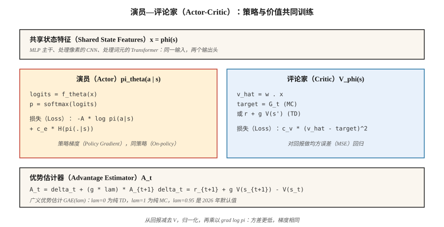

# 演员—评论家：A2C 与 A3C（Actor-Critic — A2C and A3C）

> REINFORCE 噪声很大。加入学习 `V̂(s)` 的评论家，并从回报中减去它，就得到期望相同而方差低得多的优势。这就是演员—评论家（Actor-Critic）。A2C 同步运行，A3C 跨线程运行。两者都是理解现代深度强化学习方法的思维模型。

**Type:** Build
**Languages:** Python
**Prerequisites:** 阶段 9 · 04（TD 学习），阶段 9 · 06（REINFORCE）
**Time:** 约 75 分钟

## 问题（The Problem）

普通 REINFORCE 有效，但方差很糟。蒙特卡洛回报 `G_t` 在不同回合间可能相差超过 10 倍。将这种噪声乘以 `∇ log π` 再平均，得到的梯度估计器需要数千个回合，才能让策略移动与少量 DQN 更新相同的距离。

方差来自使用原始回报。减去基线 `b(s_t)`，也就是任意状态函数，包括学到的价值，期望不会改变，方差却会下降。可实际计算的最佳基线是 `V̂(s_t)`。此时与 `∇ log π` 相乘的量就是*优势（Advantage）*：

`A(s, a) = G - V̂(s)`

动作产生高于平均水平的回报就好，低于平均水平就差。带有学习型评论家的 REINFORCE 就是*演员—评论家*。评论家为演员提供低方差的教学信号。这是 2015 年后所有深度策略方法（A2C、A3C、PPO、SAC、IMPALA）的共同结构。

## 概念（The Concept）



**两个网络，一个共同损失：**

- **演员（Actor）** `π_θ(a | s)`：策略，通过采样来行动，通过策略梯度训练。
- **评论家（Critic）** `V_φ(s)`：估计从状态出发的期望回报，通过最小化 `(V_φ(s) - target)²` 训练。

**优势。** 两种标准形式：

- *MC 优势：* `A_t = G_t - V_φ(s_t)`。无偏，方差较高。
- *TD 优势：* `A_t = r_{t+1} + γ V_φ(s_{t+1}) - V_φ(s_t)`。有偏，因为使用 `V_φ`，但方差低得多。也称 *TD 残差（TD Residual）* `δ_t`。

**n 步优势（n-step Advantage）。** 在两者之间插值：

`A_t^{(n)} = r_{t+1} + γ r_{t+2} + … + γ^{n-1} r_{t+n} + γ^n V_φ(s_{t+n}) - V_φ(s_t)`

`n = 1` 是纯 TD，`n = ∞` 是 MC。多数实现中 Atari 使用 `n = 5`，MuJoCo 上的 PPO 使用 `n = 2048`。

**广义优势估计（Generalized Advantage Estimation，GAE）。** Schulman 等（2016）提出对所有 n 步优势做指数加权平均：

`A_t^{GAE} = Σ_{l=0}^{∞} (γλ)^l δ_{t+l}`

其中 `λ ∈ [0, 1]`。`λ = 0` 对应 TD（低方差、高偏差），`λ = 1` 对应 MC（高方差、无偏）。`λ = 0.95` 是 2026 年的默认值；调整它，直到偏差与方差达到所需权衡。

**A2C：同步优势演员—评论家（Advantage Actor-Critic）。** 从 `N` 个并行环境各收集 `T` 步，计算每步优势，在合并批量上更新演员和评论家，然后重复。它是 A3C 更简单、更易扩展的同类方法。

**A3C：异步优势演员—评论家（Asynchronous Advantage Actor-Critic）。** Mnih 等（2016）提出。启动 `N` 个工作线程，每个运行一个环境。各工作线程根据自身轨迹在本地计算梯度，再异步应用到共享参数服务器。无需回放缓冲区，因为不同轨迹使工作线程的数据去相关。A3C 证明了可以在 CPU 上大规模训练。2026 年，基于 GPU 的 A2C（批量并行环境）占主导，因为 GPU 更适合大批量。

**组合损失。**

`L(θ, φ) = -E[ A_t · log π_θ(a_t | s_t) ]  +  c_v · E[(V_φ(s_t) - G_t)²]  -  c_e · E[H(π_θ(·|s_t))]`

三项分别是策略梯度损失、价值回归和熵奖励。`c_v ~ 0.5`、`c_e ~ 0.01` 是经典起始值。

```figure
actor-critic
```

## 动手实现（Build It）

### 第 1 步：评论家（Step 1: a critic）

用均方误差（Mean Squared Error，MSE）更新线性评论家 `V_φ(s) = w · features(s)`：

```python
def critic_update(w, x, target, lr):
    v_hat = dot(w, x)
    err = target - v_hat
    for j in range(len(w)):
        w[j] += lr * err * x[j]
    return v_hat
```

在表格环境中，评论家几百个回合就能收敛。在 Atari 上，用共享 CNN 主干加价值输出头替换线性评论家。

### 第 2 步：n 步优势（Step 2: n-step advantage）

给定长度为 `T` 的轨迹，以及用于自举的末尾 `V(s_T)`：

```python
def compute_advantages(rewards, values, gamma=0.99, lam=0.95, last_value=0.0):
    advantages = [0.0] * len(rewards)
    gae = 0.0
    for t in reversed(range(len(rewards))):
        next_v = values[t + 1] if t + 1 < len(values) else last_value
        delta = rewards[t] + gamma * next_v - values[t]
        gae = delta + gamma * lam * gae
        advantages[t] = gae
    returns = [a + v for a, v in zip(advantages, values)]
    return advantages, returns
```

`returns` 是评论家的目标；`advantages` 用来与 `∇ log π` 相乘。

### 第 3 步：组合更新（Step 3: combined update）

```python
for step_i, (x, a, _r, probs) in enumerate(traj):
    adv = advantages[step_i]
    target_v = returns[step_i]

    # critic
    critic_update(w, x, target_v, lr_v)

    # actor
    for i in range(N_ACTIONS):
        grad_logpi = (1.0 if i == a else 0.0) - probs[i]
        for j in range(N_FEAT):
            theta[i][j] += lr_a * adv * grad_logpi * x[j]
```

采用同策略方式，每条轨迹更新一次，演员与评论家使用独立学习率。

### 第 4 步：并行化，A3C 与 A2C（Step 4: parallelization）

- **A3C：** 启动 `N` 个线程，各自运行环境与前向传播，定期向共享主节点推送梯度更新。主节点不加锁，竞态可以接受，只会增加噪声。
- **A2C：** 在单进程中运行 `N` 个环境实例，将观测堆叠为 `[N, obs_dim]` 批量，批量前向、批量反向传播。GPU 利用率更高，具有确定性，也更易分析，是 2026 年的默认方案。

为便于理解，玩具代码采用单线程；改为批量 A2C 只需三行 numpy。

## 常见陷阱（Pitfalls）

- **演员梯度之前的评论家偏差。** 评论家若是随机的，基线就没有信息，相当于在纯噪声上训练。开启策略梯度前先预热评论家几百步，或采用较低的演员学习率。
- **优势归一化。** 每个批量内将优势归一化为零均值、单位标准差，几乎不增加成本，却能显著稳定训练。
- **共享主干。** 图像输入下，演员和评论家使用共享特征提取器、独立输出头。共享特征能同时受益于两种损失。
- **同策略约定。** A2C 的每份数据只能更新一次。再多梯度就会有偏；PPO 添加的正是重要性采样修正。
- **熵坍缩。** 没有 `c_e > 0` 时，策略几百次更新后就会近乎确定，并停止探索。
- **奖励尺度。** 优势幅度依赖奖励尺度。将奖励归一化，例如除以运行标准差，让不同任务的梯度幅度一致。

## 实际应用（Use It）

2026 年很少最终选择 A2C/A3C，但后续方法都在改进它们的架构：

| 方法 | 与 A2C 的关系 |
|--------|----------------|
| PPO | A2C 加裁剪的重要性比率，支持多轮更新 |
| IMPALA | A3C 加 V-trace 离策略修正 |
| SAC（阶段 9 · 07） | 带软价值评论家的离策略 A2C（下一课） |
| GRPO（阶段 9 · 12） | 去掉评论家的 A2C，使用组相对优势 |
| DPO | 将 A2C 化为偏好排序损失，无需采样 |
| AlphaStar / OpenAI Five | A2C 加联赛训练与模仿预训练 |

在 2026 年的论文中看到“优势”，就应想到演员—评论家。

## 交付成果（Ship It）

保存为 `outputs/skill-actor-critic-trainer.md`：

```markdown
---
name: actor-critic-trainer
description: 为给定环境生成 A2C / A3C / GAE 配置，明确优势估计与损失权重。
version: 1.0.0
phase: 9
lesson: 7
tags: [rl, actor-critic, gae]
---

给定环境和计算预算，输出：

1. 并行方式。A2C（GPU 批量）或 A3C（CPU 异步），以及工作线程数。
2. 轨迹长度 T。每次更新、每个环境收集的步数。
3. 优势估计器。n 步或 GAE(λ)，明确 λ。
4. 损失权重。`c_v`（价值）、`c_e`（熵）、梯度裁剪。
5. 学习率。演员和评论家的学习率；若独立设置则分别给出。

时域超过 1000 的环境中，拒绝单工作线程 A2C，因为过度依赖同策略采样且太慢。没有优势归一化时拒绝交付。若 `c_e = 0` 且观测熵 < 0.1，标记为熵坍缩。
```

## 练习（Exercises）

1. **简单。** 在 4×4 网格世界上，用 MC 优势（`G_t - V(s_t)`）训练演员—评论家。与第 06 课使用运行均值基线的 REINFORCE 比较样本效率。
2. **中等。** 改用 TD 残差优势（`r + γ V(s') - V(s)`），衡量各批量优势的方差。降低了多少？
3. **困难。** 实现 GAE(λ)，扫描 `λ ∈ {0, 0.5, 0.9, 0.95, 1.0}`，绘制最终回报与样本效率的关系。该任务的偏差—方差最佳折中点在哪里？

## 关键术语（Key Terms）

| 术语 | 常见说法 | 实际含义 |
|------|-----------------|-----------------------|
| 演员（Actor） | “策略网络” | `π_θ(a\|s)`，通过策略梯度更新。 |
| 评论家（Critic） | “价值网络” | `V_φ(s)`，通过对回报 / TD 目标做 MSE 回归更新。 |
| 优势（Advantage） | “比平均好多少” | `A(s, a) = Q(s, a) - V(s)` 或其估计器，用来乘以 `∇ log π`。 |
| TD 残差（TD Residual） | “δ” | `δ_t = r + γ V(s') - V(s)`；单步优势估计。 |
| 广义优势估计（GAE） | “插值旋钮” | n 步优势的指数加权和，由 `λ` 参数化。 |
| 优势演员—评论家（A2C） | “同步演员—评论家” | 跨环境组成批量，每段轨迹做一次梯度更新。 |
| 异步优势演员—评论家（A3C） | “异步演员—评论家” | 工作线程向共享参数服务器推送梯度；原始论文的方法，2026 年较少使用。 |
| 自举（Bootstrap） | “在时域末端使用 V” | 截断轨迹，加上 `γ^n V(s_{t+n})` 补足求和。 |

## 延伸阅读（Further Reading）

- [Mnih 等（2016）：深度强化学习的异步方法](https://arxiv.org/abs/1602.01783)：A3C，最初的异步演员—评论家论文。
- [Schulman 等（2016）：使用广义优势估计进行高维连续控制](https://arxiv.org/abs/1506.02438)：GAE。
- [Sutton 与 Barto（2018）：第 13 章，演员—评论家方法](http://incompleteideas.net/book/RLbook2020.pdf)：理论基础；评论家为神经网络时，应结合第 9 章的函数逼近阅读。
- [Espeholt 等（2018）：IMPALA](https://arxiv.org/abs/1802.01561)：带 V-trace 离策略修正的可扩展分布式演员—评论家。
- [OpenAI Baselines / Stable-Baselines3](https://stable-baselines3.readthedocs.io/)：值得阅读的生产级 A2C/PPO 实现。
- [Konda 与 Tsitsiklis（2000）：演员—评论家算法](https://papers.nips.cc/paper/1786-actor-critic-algorithms)：双时间尺度演员—评论家分解的基础收敛结果。
