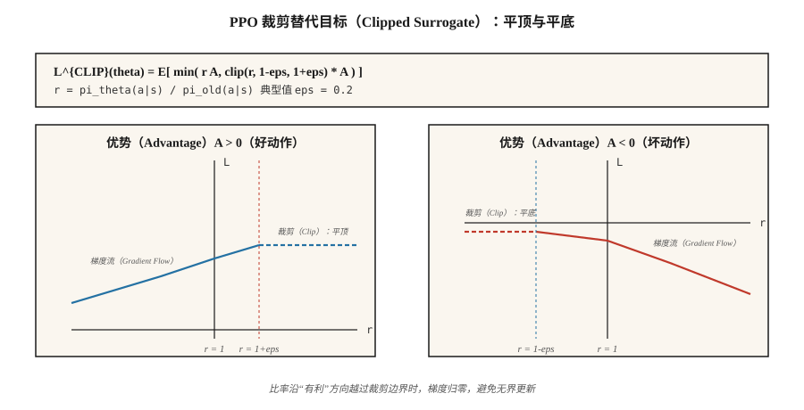

# 近端策略优化（Proximal Policy Optimization，PPO）

> A2C 每次更新后就丢弃轨迹。PPO 在策略梯度中加入经过裁剪的重要性比率，让同一份数据可以训练 10 轮以上而不使策略失控。Schulman 等（2017）提出这一方法，2026 年它仍是默认的策略梯度算法。

**Type:** Build
**Languages:** Python
**Prerequisites:** 阶段 9 · 06（REINFORCE），阶段 9 · 07（演员—评论家）
**Time:** 约 75 分钟

## 问题（The Problem）

A2C（第 07 课）是同策略方法：梯度 `E_{π_θ}[A · ∇ log π_θ]` 要求数据来自*当前* `π_θ`。一次更新后 `π_θ` 就改变，刚才的数据已变成离策略数据。再用它，梯度就会有偏。

采集轨迹很昂贵。在 Atari 中，一次轨迹采集跨 8 个环境 × 128 步 = 1024 条转移，需要十几秒环境运行时间。一次梯度更新后就丢弃很浪费。

信赖域策略优化（Trust Region Policy Optimization，TRPO；Schulman，2015）首先解决了这个问题：约束每次更新，让新旧策略之间的 KL 散度保持低于 `δ`。理论简洁，但每次更新都要做共轭梯度求解。2026 年已经没人运行 TRPO。

PPO（Schulman 等，2017）用简单的裁剪目标替代硬信赖域约束。只多一行代码，每条轨迹可以训练十轮，无需共轭梯度，理论保证也够用。九年后，它仍是从 MuJoCo 到 RLHF 的默认策略梯度算法。

## 概念（The Concept）



**重要性比率（Importance Ratio）。**

`r_t(θ) = π_θ(a_t | s_t) / π_{θ_old}(a_t | s_t)`

这是新策略相对于采集数据的策略的似然比。`r_t = 1` 表示没有变化；`r_t = 2` 表示新策略采取 `a_t` 的概率是旧策略的两倍。

**裁剪替代目标（Clipped Surrogate）。**

`L^{CLIP}(θ) = E_t [ min( r_t(θ) A_t, clip(r_t(θ), 1-ε, 1+ε) A_t ) ]`

两个分支：

- 若优势 `A_t > 0`，而比率试图超过 `1 + ε`，裁剪使梯度变平：不要将好动作的概率提升到比旧概率高 `+ε` 以上。
- 若优势 `A_t < 0`，而比率试图越过 `1 - ε`（意味着相对于裁剪后的下降幅度，坏动作会变得更可能），裁剪限制梯度：不要把坏动作压到 `-ε` 以下。

`min` 处理另一个方向：若比率向*有利*方向移动，你仍然得到梯度，在会造成不利影响的一侧不裁剪。

典型值是 `ε = 0.2`。以 `r_t` 为自变量绘制目标，会得到分段线性函数：“好的一侧”有平顶，“坏的一侧”有平底。

**完整 PPO 损失。**

`L(θ, φ) = L^{CLIP}(θ) - c_v · (V_φ(s_t) - V_t^{target})² + c_e · H(π_θ(·|s_t))`

与 A2C 相同的演员—评论家结构。三个系数通常取 `c_v = 0.5`、`c_e = 0.01`、`ε = 0.2`。

**训练循环。**

1. 在 `N` 个并行环境中各采集 `T` 步，共得到 `N × T` 条转移。
2. 计算优势（GAE），并冻结为常量。
3. 将 `π_{θ_old}` 冻结为当前 `π_θ` 的快照。
4. 训练 `K` 轮，对每个 `(s, a, A, V_target, log π_old(a|s))` 小批量：
   - 计算 `r_t(θ) = exp(log π_θ(a|s) - log π_old(a|s))`。
   - 应用 `L^{CLIP}`、价值损失和熵项。
   - 执行梯度更新。
5. 丢弃轨迹，返回第 1 步。

标准超参数组合为 `K = 10`、小批量大小 64。PPO 很稳健：具体数值在 ±50% 内变化通常影响不大。

**KL 惩罚变体。** 原始论文还提出自适应 KL 惩罚：`L = L^{PG} - β · KL(π_θ || π_old)`，根据观测到的 KL 调整 `β`。裁剪版后来占据主导，但 KL 变体仍用于 RLHF，因为相对于参考策略的 KL 本来就是需要的独立约束。

```figure
ppo-clip
```

## 动手实现（Build It）

### 第 1 步：采集轨迹时记录 `log π_old(a | s)`（Step 1: capture old log-probability）

```python
for step in range(T):
    probs = softmax(logits(theta, state_features(s)))
    a = sample(probs, rng)
    s_next, r, done = env.step(s, a)
    buffer.append({
        "s": s, "a": a, "r": r, "done": done,
        "v_old": value(w, state_features(s)),
        "log_pi_old": log(probs[a] + 1e-12),
    })
    s = s_next
```

快照只在采集轨迹时取一次，后续各轮更新中不改变。

### 第 2 步：计算 GAE 优势，第 07 课（Step 2: compute GAE advantages）

与 A2C 相同，在批量内归一化。

### 第 3 步：裁剪替代目标更新（Step 3: clipped surrogate update）

```python
for _ in range(K_EPOCHS):
    for mb in minibatches(buffer, size=64):
        for rec in mb:
            x = state_features(rec["s"])
            probs = softmax(logits(theta, x))
            logp = log(probs[rec["a"]] + 1e-12)
            ratio = exp(logp - rec["log_pi_old"])
            adv = rec["advantage"]
            surrogate = min(
                ratio * adv,
                clamp(ratio, 1 - EPS, 1 + EPS) * adv,
            )
            # backprop -surrogate, add value loss, subtract entropy
            grad_logpi = onehot(rec["a"]) - probs
            if (adv > 0 and ratio >= 1 + EPS) or (adv < 0 and ratio <= 1 - EPS):
                pg_grad = 0.0  # clipped
            else:
                pg_grad = ratio * adv
            for i in range(N_ACTIONS):
                for j in range(N_FEAT):
                    theta[i][j] += LR * pg_grad * grad_logpi[i] * x[j]
```

“被裁剪 → 梯度为零”是 PPO 的核心模式。如果新策略已经向有利方向偏移过远，更新就停止。

### 第 4 步：价值与熵（Step 4: value and entropy）

像 A2C 一样，加入相对于评论家目标的标准 MSE，以及演员的熵奖励。

### 第 5 步：诊断（Step 5: diagnostics）

每次更新监控三项：

- **平均 KL** `E[log π_old - log π_θ]`。应保持在 `[0, 0.02]`；若冲过 `0.1`，减小 `K_EPOCHS` 或 `LR`。
- **裁剪比例（Clip Fraction）**：比率落在 `[1-ε, 1+ε]` 之外的样本比例。应为 `~0.1-0.3`。若为 `~0`，裁剪从不触发，应提高 `LR` 或 `K_EPOCHS`；若为 `~0.5+`，说明对轨迹过拟合，应降低它们。
- **解释方差（Explained Variance）** `1 - Var(V_target - V_pred) / Var(V_target)`。衡量评论家质量，随学习应向 1 上升。

## 常见陷阱（Pitfalls）

- **裁剪系数不合适。** `ε = 0.2` 是事实标准。改为 `0.1` 会让更新过于保守，`0.3+` 则容易不稳定。
- **训练轮数过多。** `K > 20` 经常因策略偏离 `π_old` 太远而使训练不稳定。限制轮数，尤其是大网络。
- **没有奖励归一化。** 大奖励尺度会消耗裁剪范围。计算优势前，用运行标准差归一化奖励。
- **忘记优势归一化。** 按批量归一化为零均值、单位标准差是标准做法。省略会破坏 PPO 在多数基准上的表现。
- **学习率不衰减。** PPO 受益于线性衰减到零的学习率。常数学习率通常更差。
- **重要性比率计算错误。** 为保证数值稳定，始终使用 `exp(log_new - log_old)`，而不是 `new / old`。
- **梯度符号错误。** 最大化替代目标等于*最小化* `-L^{CLIP}`。符号反了是最常见的 PPO 错误。

## 实际应用（Use It）

2026 年，PPO 是众多领域的默认强化学习算法，覆盖范围超出直觉：

| 使用场景 | PPO 变体 |
|----------|-------------|
| MuJoCo / 机器人控制 | 高斯策略、GAE(0.95) 的 PPO |
| Atari / 离散游戏 | 类别策略、滚动采集 128 步轨迹的 PPO |
| 大语言模型 RLHF | 相对参考模型施加 KL 惩罚，回答结束时由奖励模型（Reward Model，RM）给奖励的 PPO |
| 大规模游戏智能体 | IMPALA + PPO（AlphaStar、OpenAI Five） |
| 推理大语言模型 | GRPO（第 12 课），不带评论家的 PPO 变体 |
| 仅偏好数据 | DPO：PPO+KL 的闭式化简，无需在线采样 |

PPO 的*损失结构*，即裁剪替代目标 + 价值 + 熵，是 DPO、GRPO 和几乎所有 RLHF 流水线的基础框架。

## 交付成果（Ship It）

保存为 `outputs/skill-ppo-trainer.md`：

```markdown
---
name: ppo-trainer
description: 为给定环境生成 PPO 训练配置和诊断计划。
version: 1.0.0
phase: 9
lesson: 8
tags: [rl, ppo, policy-gradient]
---

给定环境和训练预算，输出：

1. 轨迹规模。`N` 个环境 × `T` 步。
2. 更新调度。`K` 轮、小批量大小、学习率调度。
3. 替代目标参数。`ε`（裁剪）、`c_v`、`c_e`，开启优势归一化。
4. 优势。使用 GAE(`λ`)，明确 `γ` 和 `λ`。
5. 诊断计划。KL、裁剪比例、解释方差的阈值及告警。

拒绝 `K > 30` 或 `ε > 0.3`，因为信赖域不安全。没有优势归一化或 KL/裁剪监控时，拒绝运行 PPO。裁剪比例持续高于 0.4 时标记为漂移。
```

## 练习（Exercises）

1. **简单。** 在 4×4 网格世界中取 `ε=0.2, K=4` 运行 PPO。在环境步数相同时，与 A2C（每条轨迹训练一轮）比较样本效率。
2. **中等。** 扫描 `K ∈ {1, 4, 10, 30}`，绘制回报随环境步数变化的曲线，并跟踪每次更新的平均 KL。该任务中 `K` 达到多少时 KL 会爆炸？
3. **困难。** 用自适应 KL 惩罚替代裁剪替代目标：若 `KL > 2·target` 则将 `β` 翻倍，若 `KL < target/2` 则减半。比较最终回报、稳定性及不依赖裁剪的表现。

## 关键术语（Key Terms）

| 术语 | 常见说法 | 实际含义 |
|------|-----------------|-----------------------|
| 重要性比率（Importance Ratio） | “r_t(θ)” | `π_θ(a\|s) / π_old(a\|s)`；相对于采集数据策略的偏离。 |
| 裁剪替代目标（Clipped Surrogate） | “PPO 的主要技巧” | `min(r·A, clip(r, 1-ε, 1+ε)·A)`；有利方向超出裁剪边界后梯度变平。 |
| 信赖域（Trust Region） | “TRPO / PPO 的意图” | 限制每次更新的 KL，以保证单调改进。 |
| KL 惩罚（KL Penalty） | “软信赖域” | PPO 的替代形式：`L - β · KL(π_θ \|\| π_old)`，使用自适应 `β`。 |
| 裁剪比例（Clip Fraction） | “多久触发一次裁剪” | 诊断指标，应为 0.1-0.3；超出说明调参不当。 |
| 多轮训练（Multi-epoch Training） | “数据复用” | 每条轨迹训练 K 轮，以方差代价换取样本效率。 |
| 近似同策略（On-policy-ish） | “基本同策略” | PPO 名义上是同策略，但 K>1 轮时会安全地使用略微离策略的数据。 |
| PPO-KL | “另一种 PPO” | KL 惩罚变体，用于本就约束参考策略 KL 的 RLHF。 |

## 延伸阅读（Further Reading）

- [Schulman 等（2017）：近端策略优化算法](https://arxiv.org/abs/1707.06347)：原始论文。
- [Schulman 等（2015）：信赖域策略优化](https://arxiv.org/abs/1502.05477)：TRPO，PPO 的前身。
- [Andrychowicz 等（2021）：同策略强化学习中什么最重要？大规模实证研究](https://arxiv.org/abs/2006.05990)：对 PPO 各项超参数进行消融。
- [Ouyang 等（2022）：利用人类反馈训练语言模型遵循指令](https://arxiv.org/abs/2203.02155)：InstructGPT，RLHF 中使用 PPO 的方案。
- [OpenAI Spinning Up：PPO](https://spinningup.openai.com/en/latest/algorithms/ppo.html)：清晰的现代讲解，附 PyTorch 实现。
- [CleanRL 的 PPO 实现](https://github.com/vwxyzjn/cleanrl)：许多论文使用的单文件 PPO 参考实现。
- [Hugging Face TRL：PPOTrainer](https://huggingface.co/docs/trl/main/en/ppo_trainer)：语言模型上使用 PPO 的生产方案，结合第 09 课（RLHF）阅读。
- [Engstrom 等（2020）：深度策略梯度中的实现细节很重要](https://arxiv.org/abs/2005.12729)：“37 项代码级优化”论文，分析哪些 PPO 技巧真正关键，哪些只是经验传说。
