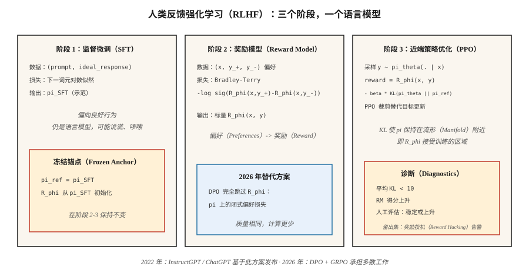

# 奖励建模与人类反馈强化学习（Reward Modeling & RLHF）

> 人类无法为“好的助手回答”写出奖励函数，但能比较两个回答并选出更好的那个。根据这些比较拟合奖励模型，再让语言模型针对它进行强化学习。Christiano 于 2017 年提出，InstructGPT 于 2022 年应用；这套方案把 GPT-3 变成了 ChatGPT。2026 年它大多正被 DPO 替代，但思维模型仍然适用。

**Type:** Build
**Languages:** Python
**Prerequisites:** 阶段 5 · 05（情感分析），阶段 9 · 08（PPO）
**Time:** 约 45 分钟

## 问题（The Problem）

你用下一词元预测目标训练了一个语言模型。它能写出语法正确的英语，却也会说谎、啰嗦，该拒绝时不拒绝。更多预训练无法解决：网页文本本身就是问题所在，而不是解药。

你需要一个*标量奖励*，表达“对于指令 X，回答 A 比回答 B 好”。手写这样的奖励函数不可能。“有帮助”不是词元上的闭式表达式。但人类可以比较两个输出并标注偏好，而且能低成本大规模收集。

基于人类反馈的强化学习（Reinforcement Learning from Human Feedback，RLHF；Christiano 等，2017；Ouyang 等，2022）把偏好转化为奖励模型，再通过 PPO 根据该奖励优化语言模型。三步是：监督微调（Supervised Fine-Tuning，SFT）→ 奖励模型（Reward Model，RM）→ PPO。这是 2023–2025 年推出 ChatGPT、Claude、Gemini 及其他对齐大语言模型的方案。

2026 年，PPO 步骤大多被直接偏好优化（Direct Preference Optimization，DPO；阶段 10 · 08）替代，因为成本更低，对齐调优效果几乎一样。但*奖励模型*仍是所有 N 选优（Best-of-N）采样器、可验证奖励强化学习流水线，以及使用过程奖励模型的推理模型的基础。理解 RLHF，就能理解整个对齐技术栈。

## 概念（The Concept）



**阶段 1：监督微调（SFT）。** 从预训练基座模型开始，对人类编写的目标行为示范进行微调，如遵循指令的回答、有帮助的回复等。结果是*偏向良好行为*的模型 `π_SFT`，但它的动作空间仍无界。

**阶段 2：奖励模型训练。**

- 收集提示词 `x` 的成对回答 `(y_+, y_-)`，由人类标注“y_+ 优于 y_-”。
- 训练奖励模型 `R_φ(x, y)`，让它给 `y_+` 更高分。
- 损失：**Bradley-Terry 成对逻辑损失**：

  `L(φ) = -E[ log σ(R_φ(x, y_+) - R_φ(x, y_-)) ]`

  σ 是 sigmoid 函数。奖励之差对应偏好的对数胜算。BT 自 1952 年（Bradley-Terry）起就是标准模型，也是现代 RLHF 的主流选择。

- `R_φ` 通常从 SFT 模型初始化，顶部添加标量输出头。Transformer 主干相同，单个线性层输出奖励。

**阶段 3：针对 RM 运行带 KL 惩罚的 PPO。**

- 从 `π_SFT` 初始化可训练策略 `π_θ`，保留冻结的*参考模型* `π_ref = π_SFT`。
- 回答 `y` 结束时的奖励：

  `r_total(x, y) = R_φ(x, y) - β · KL(π_θ(·|x) || π_ref(·|x))`

  KL 惩罚防止 `π_θ` 任意偏离 `π_SFT`。它是*正则项*，不是硬信赖域。`β` 通常取 `0.01`-`0.05`。
- 使用此奖励运行 PPO（第 08 课）。优势在词元级轨迹上计算，但 RM 只给完整回答评分。

**为什么需要 KL？** 没有它，PPO 很容易找到奖励投机策略，因为 RM 只在分布内补全文本上训练。分布外回答可能比任何人写的回答得分都高。KL 让 `π_θ` 留在 RM 训练时的流形附近，是 RLHF 最重要的单个调节参数。

**2026 年现状：**

- **DPO**（Rafailov，2023）：通过闭式代数，将阶段 2+3 合并为偏好数据上的单个监督损失。无需 RM 和 PPO，仅用一小部分计算量就在对齐基准上达到相同质量。见阶段 10 · 08。
- **组相对策略优化（Group Relative Policy Optimization，GRPO）**（DeepSeek，2024–2025）：用组相对基线替代评论家的 PPO，奖励来自*验证器*（代码运行 / 数学答案匹配），而非人类训练的 RM。它在推理模型中占主导，见阶段 9 · 12。
- **过程奖励模型（Process Reward Model，PRM）：** 对部分解答，也就是每个推理步骤评分，用于推理任务的 RLHF 和 GRPO 变体。
- **宪法式 AI（Constitutional AI）/ 基于 AI 反馈的强化学习（Reinforcement Learning from AI Feedback，RLAIF）：** 用已对齐的大语言模型代替人类生成偏好，扩展偏好数据预算。

```figure
reward-model
```

## 动手实现（Build It）

本课使用以字符串表示的微型合成“提示词”和“回答”。RM 是词元袋表示上的线性评分器。不使用真实大语言模型，重点是流水线的*结构*，不是规模。参见 `code/main.py`。

### 第 1 步：合成偏好数据（Step 1: synthetic preference data）

```python
PROMPTS = ["help me", "answer me", "explain this"]
GOOD_WORDS = {"clear", "specific", "kind", "thorough"}
BAD_WORDS = {"vague", "rude", "wrong", "short"}

def make_pair(rng):
    x = rng.choice(PROMPTS)
    y_good = rng.choice(list(GOOD_WORDS)) + " " + rng.choice(list(GOOD_WORDS))
    y_bad = rng.choice(list(BAD_WORDS)) + " " + rng.choice(list(BAD_WORDS))
    return (x, y_good, y_bad)
```

在真实 RLHF 中，这一步由人类标注员完成。结构相同，都是 `(prompt, preferred_response, rejected_response)`。

### 第 2 步：Bradley-Terry 奖励模型（Step 2: Bradley-Terry reward model）

线性评分为 `R(x, y) = w · bag(y)`。通过训练最小化 BT 成对对数损失：

```python
def rm_train_step(w, x, y_pos, y_neg, lr):
    r_pos = dot(w, bag(y_pos))
    r_neg = dot(w, bag(y_neg))
    p = sigmoid(r_pos - r_neg)
    for tok, cnt in bag(y_pos).items():
        w[tok] += lr * (1 - p) * cnt
    for tok, cnt in bag(y_neg).items():
        w[tok] -= lr * (1 - p) * cnt
```

几百次更新后，`w` 会给好词词元正权重，给坏词负权重。

### 第 3 步：在 RM 上训练类 PPO 策略（Step 3: PPO-like policy on top of RM）

玩具策略从词表中生成一个词元。用 RM 评分，计算 `log π_θ(token | prompt)`，加入相对参考模型的 KL 惩罚，再应用 PPO 裁剪替代目标。

```python
def rlhf_step(theta, ref, w, prompt, rng, eps=0.2, beta=0.1, lr=0.05):
    logits_theta = policy_logits(theta, prompt)
    probs = softmax(logits_theta)
    token = sample(probs, rng)
    logits_ref = policy_logits(ref, prompt)
    probs_ref = softmax(logits_ref)
    reward = dot(w, bag([token])) - beta * kl(probs, probs_ref)
    # ppo-style update on theta, treating reward as the return
    ...
```

### 第 4 步：监控 KL（Step 4: monitor the KL）

每次更新跟踪平均 `KL(π_θ || π_ref)`。若逐渐超过 `~5-10`，策略已远离 `π_SFT`，可能是较低 `β` 带来的影响正在增大，或奖励投机开始出现。这是真实 RLHF 中首要的诊断指标。

### 第 5 步：使用 TRL 的生产方案（Step 5: the production recipe with TRL）

理解玩具流水线后，下面展示实际库用户如何编写同一个循环。Hugging Face 的 [TRL 库](https://huggingface.co/docs/trl) 是参考实现：阶段 2 使用 `RewardTrainer`，阶段 3 使用内置参考模型 KL 约束的 `PPOTrainer`。

```python
# Stage 2: reward model from pairwise preferences
from trl import RewardTrainer, RewardConfig
from transformers import AutoModelForSequenceClassification, AutoTokenizer

tok = AutoTokenizer.from_pretrained("meta-llama/Llama-3.1-8B-Instruct")
rm = AutoModelForSequenceClassification.from_pretrained(
    "meta-llama/Llama-3.1-8B-Instruct", num_labels=1
)

# dataset rows: {"prompt", "chosen", "rejected"} — Bradley-Terry format
trainer = RewardTrainer(
    model=rm,
    tokenizer=tok,
    train_dataset=preference_data,
    args=RewardConfig(output_dir="./rm", num_train_epochs=1, learning_rate=1e-5),
)
trainer.train()
```

```python
# Stage 3: PPO against the RM with KL penalty to the SFT reference
from trl import PPOTrainer, PPOConfig, AutoModelForCausalLMWithValueHead

policy = AutoModelForCausalLMWithValueHead.from_pretrained("./sft-checkpoint")
ref    = AutoModelForCausalLMWithValueHead.from_pretrained("./sft-checkpoint")  # frozen

ppo = PPOTrainer(
    config=PPOConfig(learning_rate=1.41e-5, batch_size=64, init_kl_coef=0.05,
                     target_kl=6.0, adap_kl_ctrl=True),
    model=policy, ref_model=ref, tokenizer=tok,
)

for batch in dataloader:
    responses = ppo.generate(batch["query_ids"], max_new_tokens=128)
    rewards   = rm(torch.cat([batch["query_ids"], responses], dim=-1)).logits[:, 0]
    stats     = ppo.step(batch["query_ids"], responses, rewards)
    # stats includes: mean_kl, clip_frac, value_loss — the three PPO diagnostics
```

库帮你完成三件事。`adap_kl_ctrl=True` 实现自适应 β 调度：观测 KL 超过 `target_kl` 时 β 翻倍，低于一半时 β 减半。参考模型按约定冻结，不能意外与 `policy` 共享参数。价值输出头位于与策略相同的主干上，`AutoModelForCausalLMWithValueHead` 会添加一个标量 MLP 输出头，这就是 TRL 分别报告 `policy/kl` 和 `value/loss` 的原因。

## 常见陷阱（Pitfalls）

- **过度优化 / 奖励投机。** RM 不完美，`π_θ` 会找到分数高却质量差的对抗性补全文本。症状是奖励持续上升，而人工评估停滞或下降。解决办法：早停、提高 `β`、扩大 RM 训练数据覆盖。
- **长度投机（Length Hacking）。** 用有帮助的回答训练的 RM 常隐含奖励长度，策略因此学会灌水。可用长度归一化奖励，或带有长度感知 RM 的 RLAIF 修复。
- **RM 太小。** RM 至少需要与策略一样大。微型 RM 无法准确评价策略输出。
- **KL 调参。** β 太低会导致漂移和奖励投机，太高则让策略几乎不变。标准技巧是使用*自适应* β，将每步 KL 控制在固定目标。
- **偏好数据噪声。** 约 30% 的人类标签有噪声或歧义。可用按一致性筛选的数据训练 RM，或给 BT 加温度参数进行校准。
- **离策略问题。** 第一轮之后，PPO 数据就略微离策略。按第 08 课监控裁剪比例。

## 实际应用（Use It）

2026 年的 RLHF 分为多个层次：

| 层次 | 目标 | 方法 |
|-------|--------|--------|
| 指令遵循、有帮助性、无害性 | 对齐 | 优先使用 DPO（阶段 10 · 08），而非 RLHF-PPO。 |
| 推理正确性（数学、代码） | 能力 | 使用验证器奖励的 GRPO（阶段 9 · 12）。 |
| 长时域多步任务 | 智能体式能力 | PPO / GRPO，结合逐步过程奖励模型。 |
| 安全 / 拒绝行为 | 安全 | 带独立安全 RM 的 RLHF-PPO，或宪法式 AI。 |
| 推理时 N 选优 | 快速对齐 | 解码时使用 RM，无需训练策略。 |
| 奖励蒸馏 | 推理计算 | 在冻结语言模型上训练小型“奖励输出头”。 |

RLHF 是 2022–2024 年的*核心*方法。2026 年，生产对齐流水线优先使用 DPO，只有重度依赖 RM 或安全关键步骤才使用 PPO。

## 交付成果（Ship It）

保存为 `outputs/skill-rlhf-architect.md`：

```markdown
---
name: rlhf-architect
description: 为语言模型设计 RLHF / DPO / GRPO 对齐流水线，包含 RM、KL 与数据策略。
version: 1.0.0
phase: 9
lesson: 9
tags: [rl, rlhf, alignment, llm]
---

给定基座语言模型、目标行为（对齐 / 推理 / 拒绝 / 智能体）及偏好或验证器预算，输出：

1. 阶段。SFT？RM？DPO？GRPO？说明选择依据。
2. 偏好或验证器来源。人类、AI 反馈、规则、单元测试通过，或奖励蒸馏。
3. KL 策略。固定 β、自适应 β，或 DPO（隐式 KL）。
4. 诊断。平均 KL、奖励稳定性、过度优化防护（留出人工评估）。
5. 安全门槛。红队测试集、拒绝率，安全 RM 与有帮助性 RM 分离。

没有 KL 监控时，拒绝交付 RLHF-PPO。拒绝使用小于目标策略的 RM。拒绝仅按长度给奖励。没有保留盲测人工评估集的流水线，标记为缺乏过度优化防护。
```

## 练习（Exercises）

1. **简单。** 用 500 对合成偏好数据训练 `code/main.py` 中的 Bradley-Terry 奖励模型。在留出的 100 对数据上衡量成对准确率，应超过 90%。
2. **中等。** 取 `β ∈ {0.0, 0.1, 1.0}` 运行玩具 PPO-RLHF 循环。分别绘制更新过程中 RM 得分与参考模型 KL 的关系。哪些运行发生奖励投机？
3. **困难。** 在同一偏好数据上实现 DPO（闭式偏好似然损失），与 RLHF-PPO 流水线比较计算消耗和最终 RM 得分。

## 关键术语（Key Terms）

| 术语 | 常见说法 | 实际含义 |
|------|-----------------|-----------------------|
| 人类反馈强化学习（RLHF） | “对齐强化学习” | SFT + RM + PPO 三阶段流水线（Christiano，2017；Ouyang，2022）。 |
| 奖励模型（RM） | “评分网络” | 通过 Bradley-Terry 拟合成对偏好的标量函数。 |
| Bradley-Terry | “成对逻辑损失” | `P(y_+ ≻ y_-) = σ(R(y_+) - R(y_-))`；标准 RM 目标。 |
| KL 惩罚（KL Penalty） | “留在参考模型附近” | 奖励中的 `β · KL(π_θ \|\| π_ref)`，抵御奖励投机的正则项。 |
| 奖励投机（Reward Hacking） | “古德哈特定律” | 策略利用 RM 缺陷；症状是奖励上升、人工评估不变。 |
| AI 反馈强化学习（RLAIF） | “AI 标注偏好” | 标签来自其他语言模型而非人类的 RLHF。 |
| 过程奖励模型（PRM） | “过程评分模型” | 对部分推理步骤评分，用于推理流水线。 |
| 宪法式 AI（Constitutional AI） | “Anthropic 的方法” | 根据明确规则引导 AI 生成偏好。 |

## 延伸阅读（Further Reading）

- [Christiano 等（2017）：从人类偏好进行深度强化学习](https://arxiv.org/abs/1706.03741)：开启 RLHF 的论文。
- [Ouyang 等（2022）：InstructGPT，利用人类反馈训练语言模型遵循指令](https://arxiv.org/abs/2203.02155)：ChatGPT 背后的方案。
- [Stiennon 等（2020）：利用人类反馈学习摘要](https://arxiv.org/abs/2009.01325)：更早用于摘要的 RLHF。
- [Rafailov 等（2023）：直接偏好优化](https://arxiv.org/abs/2305.18290)：DPO，2026 年后 RLHF 时代的默认选择。
- [Bai 等（2022）：宪法式 AI，从 AI 反馈学习无害性](https://arxiv.org/abs/2212.08073)：RLAIF 与自我批评循环。
- [Anthropic 的 RLHF 论文，Bai 等（2022）：训练有帮助且无害的助手](https://arxiv.org/abs/2204.05862)：HH 论文。
- [Hugging Face TRL 库](https://huggingface.co/docs/trl)：生产级 `RewardTrainer` 和 `PPOTrainer`。阅读训练器源码，了解自适应 KL 与价值输出头细节。
- [Hugging Face：图解基于人类反馈的强化学习](https://huggingface.co/blog/rlhf)，作者 Lambert、Castricato、von Werra、Havrilla：带图示讲解三阶段流水线的经典导读。
- [von Werra 等（2020）：TRL，Transformer 强化学习](https://github.com/huggingface/trl)：对应库；`examples/` 提供 Llama、Mistral、Qwen 的端到端 RLHF 脚本。
- [Sutton 与 Barto（2018）：第 17.4 节，设计奖励信号](http://incompleteideas.net/book/RLbook2020.pdf)：奖励假设视角，是思考奖励投机的必要前提。
