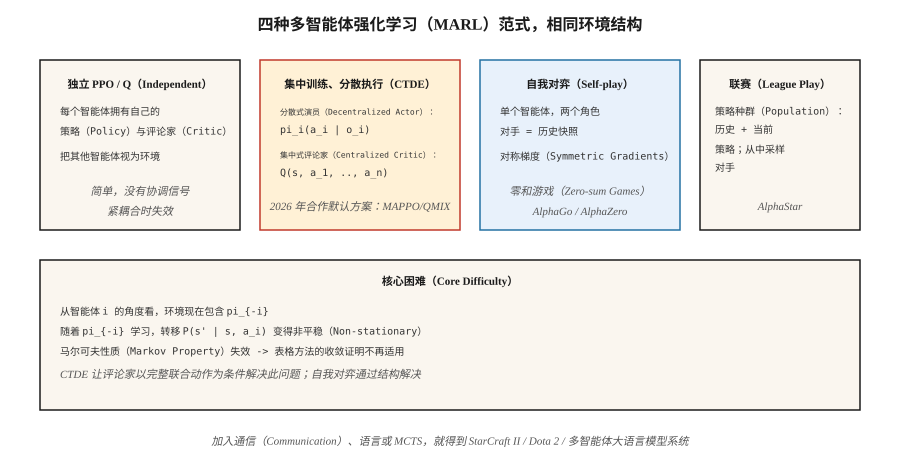

# 多智能体强化学习（Multi-Agent RL）

> 单智能体强化学习假设环境平稳。把两个学习中的智能体放在同一世界，这一假设就会失效：每个智能体都是对方环境的一部分，而且两者都在变化。多智能体强化学习（Multi-Agent Reinforcement Learning，MARL）是一组在马尔可夫假设不再成立时使学习收敛的技巧。

**Type:** Build
**Languages:** Python
**Prerequisites:** 阶段 9 · 04（Q 学习），阶段 9 · 06（REINFORCE），阶段 9 · 07（演员—评论家）
**Time:** 约 45 分钟

## 问题（The Problem）

机器人学习在房间中导航，是单智能体强化学习问题。足球队不是，AlphaStar 对战 StarCraft 对手不是，竞价智能体组成的市场不是，两辆车协商通过四向停车路口也不是。现实中的许多多对多问题都不是。

在每种多智能体设定中，从任一智能体的角度看，其他智能体*就是*环境的一部分。随着它们学习和改变行为，环境变得非平稳。“下一状态只依赖当前状态和我的动作”这一马尔可夫性质被打破，因为下一状态还依赖*其他*智能体的选择，而它们的策略不断变化。

这破坏了表格方法的收敛证明，因为 Q 学习保证依赖平稳环境。朴素深度强化学习也会失效：智能体相互追逐、循环变化，无法收敛到稳定策略。你需要多智能体专用技术：集中式训练 / 分散式执行、反事实基线、联赛训练、自我对弈。

2026 年的应用包括机器人群、交通路由、自动驾驶车队、市场模拟器、多智能体大语言模型系统（阶段 16），以及任何有多名智能玩家的游戏。

## 概念（The Concept）



**形式化：马尔可夫博弈（Markov Game）。** 它是 MDP 的推广：状态 `S`、联合动作 `a = (a_1, …, a_n)`、转移 `P(s' | s, a)`、每个智能体的奖励 `R_i(s, a, s')`。每个智能体 `i` 在自己的策略 `π_i` 下最大化自己的回报。奖励相同就是**完全合作**，零和就是**对抗**，混合则是**一般和**。

**核心挑战：**

- **非平稳性（Non-stationarity）。** 智能体 `i` 看到的 `P(s' | s, a_i)` 依赖不断变化的 `π_{-i}`。
- **信用分配（Credit Assignment）。** 共享奖励时，是哪个智能体带来的？
- **探索协调。** 智能体必须探索互补策略，而非重复探索同一状态。
- **可扩展性。** 联合动作空间随 `n` 指数增长。
- **部分可观测性。** 每个智能体只能看到自己的观测，全局状态隐藏。

**四种主流范式：**

**1. 独立 Q 学习 / 独立 PPO（Independent Q-learning，IQL；Independent PPO，IPPO）。** 各智能体学习自己的 Q 或策略，把其他智能体当作环境的一部分。简单，有时有效，尤其是经验回放起到平滑智能体建模作用时。理论上没有收敛保证。实践中适合松耦合任务，不适合紧耦合任务。

**2. 集中式训练、分散式执行（Centralized Training, Decentralized Execution，CTDE）。** 最常见的现代范式。每个智能体有自己的*策略* `π_i`，以局部观测 `o_i` 为条件；部署时按标准的分散式方式执行。*训练*时，集中式评论家 `Q(s, a_1, …, a_n)` 以完整全局状态和联合动作为条件。例如：
- **MADDPG**（Lowe 等，2017）：每个智能体拥有集中式评论家的 DDPG。
- **COMA**（Foerster 等，2017）：使用反事实基线，问“如果我改选动作 `a'`，奖励会是多少？”，从而分离自己的贡献。
- 共享评论家的 **MAPPO** / **IPPO**（Yu 等，2022）：使用集中式价值函数的 PPO，在 2026 年合作型 MARL 中占主导。
- **QMIX**（Rashid 等，2018）：价值分解，`Q_tot(s, a) = f(Q_1(s, a_1), …, Q_n(s, a_n))`，采用单调混合。

**3. 自我对弈（Self-play）。** 同一智能体的两个副本彼此对战。对手策略*就是*我过去的策略快照。AlphaGo、AlphaZero、MuZero 和 OpenAI Five 都使用它。最适合零和游戏，因为训练信号对称。

**4. 联赛训练（League Play）。** 将自我对弈扩展到一般和 / 对抗环境：保留历史与当前策略的种群，从联赛中采样对手并与之训练。加入利用者（专门击败当前最强者）和主要利用者（专门击败利用者）。AlphaStar（StarCraft II）使用这一方法。游戏存在“石头—剪刀—布”式策略循环时就需要它。

**通信（Communication）。** 允许智能体互相发送学习到的消息 `m_i`，适用于合作场景。Foerster 等（2016）展示了智能体间的可微通信可以端到端训练。如今基于大语言模型的多智能体系统（阶段 16）主要用自然语言通信。

```figure
f3-marl-orbit
```

## 动手实现（Build It）

本课采用 6×6 网格世界和两个合作智能体，从相对的角落出发，必须到达同一目标。共享奖励为：只要还有智能体在移动，每步 `-1`；两者都到达时 `+10`。参见 `code/main.py`。

### 第 1 步：多智能体环境（Step 1: the multi-agent env）

```python
class CoopGridWorld:
    def __init__(self):
        self.size = 6
        self.goal = (5, 5)

    def reset(self):
        return ((0, 0), (5, 0))  # two agents

    def step(self, state, actions):
        a1, a2 = state
        new1 = move(a1, actions[0])
        new2 = move(a2, actions[1])
        done = (new1 == self.goal) and (new2 == self.goal)
        reward = 10.0 if done else -1.0
        return (new1, new2), reward, done
```

*联合*动作空间为 `|A|² = 16`，全局状态是两个位置。

### 第 2 步：独立 Q 学习（Step 2: independent Q-learning）

每个智能体运行自己的 Q 表，以联合状态为键。每步两者都选 ε-贪心动作，收集联合转移，各自用共享奖励更新 Q。

```python
def independent_q(env, episodes, alpha, gamma, epsilon):
    Q1, Q2 = defaultdict(default_q), defaultdict(default_q)
    for _ in range(episodes):
        s = env.reset()
        while not done:
            a1 = epsilon_greedy(Q1, s, epsilon)
            a2 = epsilon_greedy(Q2, s, epsilon)
            s_next, r, done = env.step(s, (a1, a2))
            target1 = r + gamma * max(Q1[s_next].values())
            target2 = r + gamma * max(Q2[s_next].values())
            Q1[s][a1] += alpha * (target1 - Q1[s][a1])
            Q2[s][a2] += alpha * (target2 - Q2[s][a2])
            s = s_next
```

该任务中奖励稠密且目标一致，因此有效。在紧耦合任务中会失败，例如一个智能体必须*等待*另一个。

### 第 3 步：集中式 Q 与分解价值更新（Step 3: centralized Q with decomposed-value update）

对联合动作使用一个 Q：`Q(s, a_1, a_2)`，根据共享奖励更新。执行时通过边缘化实现分散式选择：`π_i(s) = argmax_{a_i} max_{a_{-i}} Q(s, a_1, a_2)`。以指数级联合动作空间为代价，换取*正确*的全局视角。

### 第 4 步：简单自我对弈，两个对抗智能体（Step 4: simple self-play）

同一智能体、两个角色。训练智能体 A 对抗 B；每隔 `K` 个回合，将 A 的权重复制给 B。对称训练、持续进步，这是 AlphaZero 方案的微缩版。

## 常见陷阱（Pitfalls）

- **非平稳回放。** 独立智能体的经验回放比单智能体更难，因为旧转移由如今已过时的对手生成。可重新标注，或按新近程度加权。
- **信用分配歧义。** 长回合后得到共享奖励，难以说明谁做出了贡献。可用反事实基线（COMA），或按智能体进行奖励塑形。
- **策略漂移 / 追逐。** 各智能体的最佳响应会随对方更新而改变。可用集中式评论家、低学习率，或一次只放开一个智能体训练。
- **通过协调进行奖励投机。** 智能体发现设计者没预料到的协同漏洞，如拍卖智能体收敛到出价零。需要谨慎设计奖励并加入行为约束。
- **探索冗余。** 两个智能体探索相同的状态—动作对。可分别设置熵奖励，或以角色为条件。
- **联赛循环。** 纯自我对弈可能陷入优势循环。用包含多样对手的联赛训练解决。
- **样本爆炸。** `n` 个智能体 × 状态空间 × 联合动作。使用函数逼近，以及分解的动作空间，每个智能体一个策略输出头。

## 实际应用（Use It）

2026 年 MARL 应用版图：

| 领域 | 方法 | 说明 |
|--------|--------|-------|
| 合作导航 / 操作 | MAPPO / QMIX | CTDE，共享评论家 + 分散式演员。 |
| 双人游戏（国际象棋、围棋、扑克） | 配合 MCTS 的自我对弈（AlphaZero） | 零和，对称训练。 |
| 复杂多人游戏（Dota、StarCraft） | 联赛训练 + 模仿预训练 | OpenAI Five、AlphaStar。 |
| 自动驾驶车队 | CTDE MAPPO / 带注意力的 PPO | 部分观测，可变团队规模。 |
| 拍卖市场 | 博弈论均衡 + 强化学习 | `n` → ∞ 时使用平均场强化学习。 |
| 大语言模型多智能体系统（阶段 16） | 自然语言通信 + 角色条件化 | 强化学习循环位于智能体规划层。 |

2026 年，MARL 增长最快的是基于大语言模型的应用：语言模型智能体群进行协商、辩论、构建软件。强化学习体现为*轨迹级*而非词元级输出的偏好优化（阶段 16 · 03）。

## 交付成果（Ship It）

保存为 `outputs/skill-marl-architect.md`：

```markdown
---
name: marl-architect
description: 为给定任务选择合适的多智能体强化学习范式，包括 IPPO、CTDE、自我对弈和联赛。
version: 1.0.0
phase: 9
lesson: 10
tags: [rl, multi-agent, marl, self-play]
---

给定一个包含 `n` 个智能体的任务，输出：

1. 范式分类。合作 / 对抗 / 一般和，并说明依据。
2. 算法。IPPO / MAPPO / QMIX / 自我对弈 / 联赛，结合耦合紧密程度和奖励结构说明理由。
3. 信息访问。是否集中式训练，评论家能得到什么全局信息？是否分散式执行？
4. 信用分配。反事实基线、价值分解，或奖励塑形。
5. 探索计划。每个智能体的熵、基于种群的训练，或联赛。

拒绝在紧耦合合作任务中使用独立 Q 学习。拒绝为存在循环风险的一般和任务推荐自我对弈。任何没有固定对手评估的 MARL 流水线都要标记，因为挑选有利的自我对弈数据很常见。
```

## 练习（Exercises）

1. **简单。** 在双智能体合作网格世界中训练独立 Q 学习。多少回合后平均回报 > 0？绘制联合学习曲线。
2. **中等。** 添加“协调”任务：只有两个智能体同一轮踏上目标才算到达。独立 Q 还能收敛吗？哪里失效？
3. **困难。** 为 MAPPO 风格训练实现集中式评论家，在协调任务中与独立 PPO 比较收敛速度。

## 关键术语（Key Terms）

| 术语 | 常见说法 | 实际含义 |
|------|-----------------|-----------------------|
| 马尔可夫博弈（Markov Game） | “多智能体 MDP” | `(S, A_1, …, A_n, P, R_1, …, R_n)`；每个智能体有自己的奖励。 |
| CTDE | “集中式训练、分散式执行” | 训练时联合评论家，各智能体策略只使用局部观测。 |
| IPPO | “独立 PPO” | 各智能体独立运行 PPO，简单且常被低估的基线。 |
| 多智能体 PPO（Multi-Agent PPO，MAPPO） | “多智能体 PPO” | 以全局状态为条件的集中式价值函数配合 PPO。 |
| QMIX | “单调价值分解” | `Q_tot = f_monotone(Q_1, …, Q_n)` 允许分散式 argmax。 |
| COMA | “反事实多智能体” | 优势 = 我的 Q 减去对我的动作边缘化后的期望 Q。 |
| 自我对弈（Self-play） | “智能体对战过去的自己” | 单个智能体、两个角色，零和游戏的标准方式。 |
| 联赛训练（League Play） | “种群训练” | 缓存历史策略，从池中采样对手，处理策略循环。 |

## 延伸阅读（Further Reading）

- [Lowe 等（2017）：混合合作竞争环境中的多智能体演员—评论家（MADDPG）](https://arxiv.org/abs/1706.02275)：带集中式评论家的 CTDE。
- [Foerster 等（2017）：反事实多智能体策略梯度（COMA）](https://arxiv.org/abs/1705.08926)：用于信用分配的反事实基线。
- [Rashid 等（2018）：QMIX，单调价值函数分解](https://arxiv.org/abs/1803.11485)：带单调性的价值分解。
- [Yu 等（2022）：PPO 在合作多智能体游戏中出人意料的有效性（MAPPO）](https://arxiv.org/abs/2103.01955)：PPO 在 MARL 中表现出乎意料地强。
- [Vinyals 等（2019）：利用多智能体强化学习达到 StarCraft II 大师水平（AlphaStar）](https://www.nature.com/articles/s41586-019-1724-z)：大规模联赛训练。
- [Silver 等（2017）：不借助人类知识掌握围棋（AlphaGo Zero）](https://www.nature.com/articles/nature24270)：零和游戏中的纯自我对弈。
- [Sutton 与 Barto（2018）：第 15 章，神经科学；第 17 章，前沿](http://incompleteideas.net/book/RLbook2020.pdf)：包含多智能体设定的简短介绍，以及 CTDE 旨在解决的非平稳性问题。
- [Zhang、Yang 与 Başar（2021）：多智能体强化学习，选择性综述](https://arxiv.org/abs/1911.10635)：覆盖合作、竞争和混合 MARL，并介绍收敛结果。
