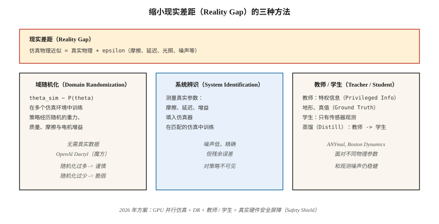

# 从仿真迁移到现实（Sim-to-Real Transfer）

> 在仿真中训练却在硬件上失败的策略，是记住了仿真器的策略。域随机化、域适应和系统辨识，是让学习型控制器跨越现实差距的三种工具。

**Type:** Learn
**Languages:** Python
**Prerequisites:** 阶段 9 · 08（PPO），阶段 2 · 10（偏差 / 方差）
**Time:** 约 45 分钟

## 问题（The Problem）

训练真实机器人缓慢、危险且昂贵。双足机器人需要数百万个训练回合才能学会走路；真实双足机器人哪怕摔倒一次，也可能损坏硬件。仿真提供无限次重置、确定性复现、并行环境，而且不会造成物理损坏。

但仿真器并不准确。轴承摩擦大于 MuJoCo 模型所描述的值，相机存在仿真未包含的镜头畸变，电机有 99% 仿真模型忽略的延迟、回差和饱和。风、灰尘、变化的光照都会破坏在理想渲染上训练的策略。**现实差距（Reality Gap）**，即仿真分布与真实分布之间的系统性差异，是机器人强化学习部署的核心问题。

你需要*对仿真到现实分布偏移稳健*的策略。历史上有三条路线：随机化仿真器（域随机化），用少量真实数据适应策略（域适应 / 微调），或辨识真实系统参数并匹配（系统辨识）。2026 年主流方案结合三者和大规模并行仿真，如 Isaac Sim、Isaac Lab、GPU 上的 Mujoco MJX。

## 概念（The Concept）



**域随机化（Domain Randomization，DR）。** Tobin 等（2017）、Peng 等（2018）提出。在训练中随机化所有可能与真实机器人不同的仿真参数：质量、摩擦系数、电机比例—微分（Proportional-Derivative，PD）增益、传感器噪声、相机位置、光照、纹理、接触模型。策略学会以“今天处于哪个仿真环境”为条件的分布，并在整个范围内泛化。真实机器人只要落在训练包络内，策略就有效。

- **优点：** 不需要真实数据。一套方案可用于多种机器人。
- **缺点：** 过度随机化会产生“通用”却过于谨慎的策略。噪声过多约等于正则化过强。

**系统辨识（System Identification，SI）。** 训练前用真实数据拟合仿真参数。若能测量真实机器人机械臂关节摩擦，就将它填入仿真器，再训练预期这些参数值的策略。需要接触真实系统，但能直接缩小现实差距。

- **优点：** 训练目标精确、噪声低。
- **缺点：** 策略看不到剩余模型误差；微小的未辨识效应，例如电机死区，仍会导致部署失败。

**域适应（Domain Adaptation）。** 在仿真中训练，再用少量真实数据微调。有两种形式：

- **现实—仿真—现实（Real2Sim2Real）：** 用真实轨迹学习残差仿真器 `f(s, a, z) - f_sim(s, a)`，再在修正后的仿真中训练。无需大量真实数据就能缩小差距。
- **观测适应（Observation Adaptation）：** 用学习型特征提取器，例如生成对抗网络（Generative Adversarial Network，GAN）的像素到像素映射，训练将真实观测转为仿真风格观测的策略。控制器仍处于仿真侧。

**特权学习 / 教师—学生（Privileged Learning / Teacher-Student）。** Miki 等（2022，ANYmal 四足机器人）提出。在仿真中训练能访问特权信息的*教师*，例如摩擦真值、地形高度、惯性测量单元（Inertial Measurement Unit，IMU）漂移。蒸馏出只看到真实传感器观测的*学生*。学生学会从历史推断特权特征，从而适应不同物理参数。

**大规模并行仿真（Massively Parallel Simulation）。** 2024–2026 年，Isaac Lab、Mujoco MJX、Brax 都能在单张 GPU 上运行数千个并行机器人。PPO 配合 4,096 个并行人形机器人，数小时就能收集数年的经验。训练分布越广，现实差距越小；当这 4,096 个环境各自采用不同随机参数时，DR 几乎没有额外成本。

**2026 年实际方案，以四足行走为例：**

1. 大规模并行仿真，对重力、摩擦、电机增益、载荷做域随机化。
2. 使用特权信息训练教师策略，包括地形图、机体速度真值。
3. 从教师蒸馏学生策略，学生只用本体感知，如腿部关节编码器。
4. 可选：通过真实 IMU 上的自编码器进行观测适应。
5. 部署，在 10 个以上环境零样本测试。失败时，用带安全约束的 PPO 做几分钟真实环境微调。

```figure
f3-reality-gap
```

## 动手实现（Build It）

本课代码在带*噪声*转移的网格世界上演示域随机化。训练策略在“仿真”中经历随机滑移概率，在“现实”中用训练未见过的滑移水平评估。该结构可直接对应 MuJoCo 到硬件的迁移。

### 第 1 步：参数化仿真（Step 1: parameterized sim）

```python
def step(state, action, slip):
    if rng.random() < slip:
        action = random_perpendicular(action)
    ...
```

`slip` 是仿真器暴露的参数。在真实机器人中，它可以对应摩擦、质量、电机增益，或任何仿真与现实间会变化的量。

### 第 2 步：使用 DR 训练（Step 2: train with DR）

每个回合开始时采样 `slip ~ Uniform[0.0, 0.4]`，训练 PPO、Q 学习或其他算法，重复许多回合。

### 第 3 步：在“真实”滑移水平上零样本评估（Step 3: evaluate zero-shot）

在 `slip ∈ {0.0, 0.1, 0.2, 0.3, 0.5, 0.7}` 上评估。前四个在训练支持集内；`0.5` 和 `0.7` 在外。DR 训练的策略在支持集内应接近最优，在外应平缓退化。固定滑移训练的策略在训练滑移之外会很脆弱。

### 第 4 步：与窄范围训练比较（Step 4: compare to narrow training）

另训一个仅使用 `slip = 0.0` 的策略，在同样的 `slip` 扫描范围评估。真实滑移一旦 > 0，就应看到性能大幅下降。

## 常见陷阱（Pitfalls）

- **随机化过多。** 在 `slip ∈ [0, 0.9]` 上训练，会使策略极度厌恶风险，连最优路径都不尝试。应匹配*预期*真实分布，而不是“任何事都可能发生”。
- **随机化过少。** 训练范围太窄，策略完全无法泛化。使用自动域随机化（Automatic Domain Randomization，ADR）的自适应课程，随策略改进扩大分布。
- **参数空间识别错误。** 随机化错误对象，例如真实差距是电机延迟，却随机化相机色调，DR 就无效。先测量分析真实机器人。
- **特权信息泄漏。** 教师用全局状态决定动作，而不只依赖观测，可能让学生无法追上。确保给定观测历史后，学生能够实现教师策略。
- **仿真到仿真迁移失败。** 策略对更难的仿真变体都不稳健，对真实世界也不会稳健。部署前始终在留出的仿真变体上测试。
- **没有真实安全包络。** 策略在仿真和“现实”中有效，但没有底层安全屏障，仍可能损坏硬件。在非学习型控制器中加入速率、力矩和关节限制。

## 实际应用（Use It）

2026 年仿真到现实技术栈：

| 领域 | 技术栈 |
|--------|-------|
| 足式移动（ANYmal、Spot、人形机器人） | Isaac Lab + DR + 特权教师 / 学生 |
| 操作（灵巧手、抓取放置） | Isaac Lab + DR + 视觉 DR-GAN |
| 自动驾驶 | CARLA / NVIDIA DRIVE Sim + DR + 真实数据微调 |
| 无人机竞速 | RotorS / Flightmare + DR + 在线适应 |
| 手指 / 手内操作 | OpenAI Dactyl，前所未有规模的 DR |
| 工业机械臂 | MuJoCo-Warp + SI + 少量真实数据微调 |

任何规模的控制任务都遵循一致工作流：尽量拟合仿真，随机化无法拟合的部分，训练大规模策略，蒸馏，带安全屏障部署。

## 交付成果（Ship It）

保存为 `outputs/skill-sim2real-planner.md`：

```markdown
---
name: sim2real-planner
description: 为给定机器人与任务规划仿真到现实迁移流水线，覆盖 DR、SI 与安全。
version: 1.0.0
phase: 9
lesson: 11
tags: [rl, sim2real, robotics, domain-randomization]
---

给定机器人平台、任务及可用真实硬件时间，输出：

1. 现实差距清单。按预期影响排序列出疑似来源，包括接触、感知、执行延迟、视觉。
2. DR 参数。精确列表、范围、分布；根据真实测量论证各范围。
3. SI 步骤。需要测量哪些参数，以及测量方法。
4. 教师 / 学生划分。教师使用哪些特权信息，学生使用哪些观测。
5. 安全包络。底层限制、急停、备用控制器。

缺少 (a) 零样本仿真变体测试、(b) 安全屏障、(c) 回滚计划中的任一项，都拒绝部署。若 DR 范围宽于实测真实变化幅度的 3 倍，标记为可能过度随机化。
```

## 练习（Exercises）

1. **简单。** 在固定滑移网格世界（slip=0.0）训练 Q 学习智能体，在 slip ∈ {0.0, 0.1, 0.3, 0.5} 上评估，绘制回报随滑移变化的曲线。
2. **中等。** 采样 `slip ~ Uniform[0, 0.3]` 训练 DR Q 学习智能体，使用同样的扫描范围评估。在分布外 slip=0.5 时，DR 带来多少收益？
3. **困难。** 实现课程：从 slip=0.0 开始，每当策略达到最优的 90% 就扩大 DR 范围。与固定 DR 基线比较，达到 slip=0.3 零样本能力共需多少环境步。

## 关键术语（Key Terms）

| 术语 | 常见说法 | 实际含义 |
|------|-----------------|-----------------------|
| 现实差距（Reality Gap） | “仿真到现实的差异” | 训练与部署之间物理 / 感知的分布偏移。 |
| 域随机化（DR） | “跨随机仿真训练” | 训练时随机化仿真参数，使策略泛化。 |
| 系统辨识（SI） | “测量现实并拟合仿真” | 估计真实物理参数，设置仿真以匹配。 |
| 域适应（Domain Adaptation） | “用真实数据微调” | 仿真训练后进行少量真实环境微调，可适应观测或动力学。 |
| 特权信息（Privileged Info） | “教师的真值” | 只有仿真拥有的信息，学生必须从观测历史推断。 |
| 教师 / 学生（Teacher/Student） | “将特权信息蒸馏到可观测信息” | 教师训练时走捷径，学生学习在没有捷径时模仿。 |
| 自动域随机化（ADR） | “自动扩大随机化” | 随策略改进扩大 DR 范围的课程。 |
| 现实到仿真（Real2Sim） | “用真实数据缩小差距” | 学习残差，使仿真模仿真实轨迹。 |

## 延伸阅读（Further Reading）

- [Tobin 等（2017）：用于深度神经网络从仿真迁移到现实的域随机化](https://arxiv.org/abs/1703.06907)：原始 DR 论文，针对机器人视觉。
- [Peng 等（2018）：通过动力学随机化实现机器人控制从仿真到现实的迁移](https://arxiv.org/abs/1710.06537)：动力学 DR、四足移动。
- [OpenAI 等（2019）：用机械手解魔方](https://arxiv.org/abs/1910.07113)：Dactyl，大规模 ADR。
- [Miki 等（2022）：学习野外四足机器人的稳健感知移动](https://www.science.org/doi/10.1126/scirobotics.abk2822)：ANYmal 的教师—学生方法。
- [Makoviychuk 等（2021）：Isaac Gym，用于机器人学习的高性能 GPU 物理仿真](https://arxiv.org/abs/2108.10470)：推动 2025–2026 年部署的大规模并行仿真。
- [Akkaya 等（2019）：自动域随机化](https://arxiv.org/abs/1910.07113)：ADR 课程方法。
- [Sutton 与 Barto（2018）：第 8 章，表格方法的规划与学习](http://incompleteideas.net/book/RLbook2020.pdf)：Dyna 框架，使用模型做规划与轨迹采样，是现代仿真到现实流水线的基础。
- [Zhao、Queralta 与 Westerlund（2020）：机器人深度强化学习中的仿真到现实迁移综述](https://arxiv.org/abs/2009.13303)：仿真到现实方法分类及基准结果。
