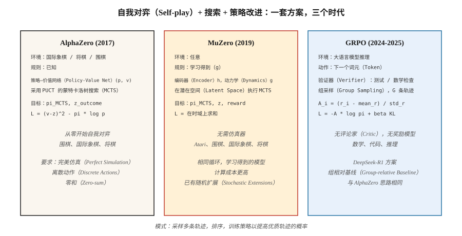

# 游戏强化学习：AlphaZero、MuZero 与大语言模型推理时代（RL for Games — AlphaZero, MuZero, and the LLM-Reasoning Era）

> 1992 年，TD-Gammon 仅用 TD 就在双陆棋中击败人类冠军。2016 年，AlphaGo 击败李世石。2017 年，AlphaZero 从零开始称霸国际象棋、将棋和围棋。2024 年，DeepSeek-R1 证明把 PPO 换成 GRPO 后，同一方案也适用于推理。游戏是推动本阶段每次突破的基准。

**Type:** Build
**Languages:** Python
**Prerequisites:** 阶段 9 · 05（DQN），阶段 9 · 08（PPO），阶段 9 · 09（RLHF），阶段 9 · 10（MARL）
**Time:** 约 120 分钟

## 问题（The Problem）

游戏具备强化学习所需的一切：明确奖励（胜 / 负）、无限可用回合（自我对弈可重置）、完美仿真（游戏*本身就是*仿真器）、离散或小型连续动作空间，以及迫使策略具备对抗稳健性的多智能体结构。

游戏也是检验每次重大强化学习突破的方式。TD-Gammon（双陆棋，1992）、Atari-DQN（2013）、AlphaGo（2016）、AlphaZero（2017）、OpenAI Five（Dota 2，2019）、AlphaStar（StarCraft II，2019）、MuZero（学习模型，2019）、AlphaTensor（矩阵乘法，2022）、AlphaDev（排序算法，2023）、DeepSeek-R1（数学推理，2025）；最后一个是游戏强化学习技术适用于文本的最新证明。

本综合实践用一个统一视角考察三种里程碑架构：AlphaZero、MuZero、GRPO，即**自我对弈 + 搜索 + 策略改进**。后者逐步推广前者；尤其是 GRPO，将 AlphaZero 的方案用于大语言模型推理，以词元为动作、数学验证为胜利信号。

## 概念（The Concept）



**统一循环。**

```
while True:
    trajectory = self_play(current_policy, search)     # play game against self
    policy_target = search.improved_policy(trajectory) # search improves raw policy
    policy_net.update(policy_target, value_target)     # supervised on search output
```

**AlphaZero（2017）。** Silver 等提出。给定规则已知的游戏，如国际象棋、将棋、围棋：

- 策略—价值网络：一个网络主干 `f_θ(s) → (p, v)`。`p` 是合法走法的先验，`v` 是期望对局结果。
- 蒙特卡洛树搜索（Monte Carlo Tree Search，MCTS）：每步扩展可能后续的搜索树，用 `(p, v)` 作为先验与自举。通过置信上界（UCB，采用 PUCT）选择节点：`a* = argmax Q(s, a) + c · p(a|s) · √N(s) / (1 + N(s, a))`。
- 自我对弈：智能体彼此对战。在第 `t` 步，MCTS 访问分布 `π_t` 成为策略训练目标。
- 损失：`L = (v - z)² - π · log p + c · ||θ||²`。`z` 为对局结果（+1 / 0 / -1）。

不使用人类知识，不使用手工启发式。同一套方案在每种游戏上进行数千万次自我对弈后，就掌握了国际象棋、将棋和围棋。

**MuZero（2019）。** Schrittwieser 等提出，去掉了规则已知的要求。

- 不使用固定环境，而是学习*潜在动力学模型（Latent Dynamics Model）* `(h, g, f)`：
  - `h(s)`：将观测编码为潜在状态。
  - `g(s_latent, a)`：预测下一潜在状态与奖励。
  - `f(s_latent)`：预测策略先验与价值。
- MCTS 在*学习到的潜在空间*中运行。搜索相同，训练循环也相同。
- 适用于围棋、国际象棋、将棋*以及* Atari；一个算法，不需要规则知识。

**随机 MuZero（Stochastic MuZero，2022）。** 加入随机动力学和机会节点，扩展到双陆棋类游戏。

**Muesli、Gumbel MuZero（2022–2024）。** 改进样本效率与确定性搜索。

**GRPO（2024–2025）。** DeepSeek-R1 的方案。采用 AlphaZero 形态的循环，用于语言模型推理：

- “游戏”是回答数学、编程或推理问题。“胜利”指验证器返回 1，如测试通过或数值答案匹配。
- 策略是大语言模型，动作是词元，状态是提示词加当前已生成的回答。
- 没有评论家，即 PPO 风格的 V_φ。对每个提示词，从策略采样 `G` 个补全文本，分别计算奖励，使用**组相对优势（Group-relative Advantage）** `A_i = (r_i - mean_r) / std_r` 作为 REINFORCE 风格更新的信号。
- 像 RLHF 一样，对参考策略施加 KL 惩罚以防止漂移。
- 完整损失：

  `L_GRPO(θ) = -E_{q, {o_i}} [ (1/G) Σ_i A_i · log π_θ(o_i | q) ] + β · KL(π_θ || π_ref)`

没有奖励模型，没有评论家，也没有 MCTS。组相对基线取代三者。仅用一小部分计算量，就能在推理基准上达到或超过 PPO-RLHF 的质量。

**完整 R1 方案。** DeepSeek-R1（DeepSeek，2025）在同一论文中介绍两个模型：

- **R1-Zero。** 从 DeepSeek-V3 基座模型出发，不做 SFT，直接应用 GRPO，使用两个奖励分量：*准确性奖励*，根据规则检查最终答案能否解析为正确数字、代码能否通过单元测试；以及*格式奖励*，检查补全文本是否将思维链（Chain of Thought，CoT）包在 `<think>…</think>` 标签中。数千步之后，平均回答长度从约 100 增至约 10,000 个词元，数学基准得分升至接近 o1-preview。模型从零学会推理。缺点是思维链经常难以阅读、混用语言，文风也不够成熟。
- **R1。** 用四阶段流水线解决 R1-Zero 的可读性问题：
  1. **冷启动 SFT。** 收集数千条格式清晰的长思维链示范，对基座模型做监督微调，提供可读的起点。
  2. **面向推理的 GRPO。** 除准确性与格式奖励外，再加入*语言一致性*奖励，防止语言切换。
  3. **拒绝采样 + 第二轮 SFT。** 从强化学习检查点采样约 600K 条推理轨迹，仅保留最终答案正确且思维链可读的轨迹，再与约 200K 条非推理 SFT 样本（写作、问答、自我认知）合并，重新微调基座模型。
  4. **全领域 GRPO。** 再做一轮强化学习，同时覆盖推理（规则奖励）与一般对齐（有帮助性 / 无害性偏好奖励）。

结果模型开放权重，在 AIME 和 MATH-500 上媲美 o1，规模也足以支持蒸馏。同一论文还发布六个蒸馏稠密模型，从 Qwen-1.5B 到 Llama-70B，通过对 R1 推理轨迹做 SFT 得到，学生端不做强化学习。在学生规模上，蒸馏强大的强化学习教师，始终优于从零强化学习。

**推理为什么选择 GRPO 而非 PPO？** DeepSeekMath 论文（2024 年 2 月）给出三个理由：(1) 不训练价值网络，内存减半；(2) 组基线自然处理推理任务产生的轨迹末端稀疏奖励；(3) 按提示词归一化，使难度差异巨大的问题之间优势可比，而 PPO 的单个评论家做不到。

**无搜索与基于搜索。** 游戏方法已分出两条路线：

- *长时域完全信息游戏*，如围棋、国际象棋，仍基于搜索，AlphaZero / MuZero 占主导。
- *大语言模型推理*：生产环境尚无 MCTS，使用完整轨迹上的 GRPO，通过 N 选优分配推理计算。过程奖励模型（PRM）暗示未来可能重新引入逐步搜索。

```figure
f3-selfplay-ladder
```

## 动手实现（Build It）

`code/main.py` 实现了**微缩 GRPO**：一个带多组样本的老虎机（Bandit）问题。算法与大语言模型上的版本相同，只是策略和环境更简单。它讲授*损失*与*组相对优势*，也就是 2025 年的创新。

### 第 1 步：微型验证器环境（Step 1: a tiny verifier environment）

```python
QUESTIONS = [
    {"prompt": "q1", "correct": 3},
    {"prompt": "q2", "correct": 1},
]

def verify(prompt_idx, answer_token):
    return 1.0 if answer_token == QUESTIONS[prompt_idx]["correct"] else 0.0
```

真实 GRPO 的验证器运行单元测试或检查数学相等性。

### 第 2 步：策略，对每个提示词的 K 个答案词元做 softmax（Step 2: policy）

```python
def policy_probs(theta, p_idx):
    return softmax(theta[p_idx])
```

相当于以提示词为条件的大语言模型最后一层输出。

### 第 3 步：组采样与组相对优势（Step 3: group sampling and group-relative advantage）

```python
def grpo_step(theta, p_idx, G=8, beta=0.01, lr=0.1, rng=None):
    probs = policy_probs(theta, p_idx)
    samples = [sample(probs, rng) for _ in range(G)]
    rewards = [verify(p_idx, s) for s in samples]
    mean_r = sum(rewards) / G
    std_r = stddev(rewards) + 1e-8
    advs = [(r - mean_r) / std_r for r in rewards]

    for a, A in zip(samples, advs):
        grad = onehot(a) - probs
        for i in range(len(probs)):
            theta[p_idx][i] += lr * A * grad[i]
    # KL penalty: pull theta toward reference
    for i in range(len(probs)):
        theta[p_idx][i] -= beta * (theta[p_idx][i] - reference[p_idx][i])
```

组相对优势是 DeepSeek 在 2024 年的技巧，无需评论家。“基线”是组均值，归一化使用组标准差。

### 第 4 步：与无价值函数的 REINFORCE 基线比较（Step 4: compare to REINFORCE baseline）

相同设置、相同计算量，运行普通 REINFORCE。GRPO 收敛更快、更稳定。

### 第 5 步：观察熵与 KL（Step 5: observe entropy and KL）

与 RLHF 相同的诊断：相对于参考策略的平均 KL、策略熵、奖励随时间的变化。这些稳定后，训练就完成了。

## 常见陷阱（Pitfalls）

- **利用验证器漏洞进行奖励投机。** GRPO 继承 RLHF 的风险：验证器有错或可被利用，大语言模型就会找到漏洞。稳健的验证器很重要，例如多测试用例、形式化证明。
- **组太小。** 组基线的方差按 `1/√G` 变化。小于 `G = 4` 时优势信号噪声大；标准选择为 `G = 8` 到 `64`。
- **长度偏差。** 不同长度的大语言模型补全文本具有不同对数概率。按词元数归一化，或使用序列级对数概率，或截断到最大长度。
- **纯自我对弈循环。** AlphaZero 风格训练在一般和游戏中可能陷入优势循环。通过多样对手池缓解，见联赛训练（第 10 课）。
- **搜索与策略不匹配。** AlphaZero 训练策略模仿搜索输出。策略网络若太小，无法表示搜索分布，训练就停滞。
- **计算门槛。** MuZero / AlphaZero 需要大量计算，单次消融常需数百 GPU 小时。有用于学习的微型演示，如四子棋上的 AlphaZero。
- **验证器覆盖。** 有缺陷的解答若也能通过单元测试，就会强化该缺陷。验证器必须捕捉边界情况。

## 实际应用（Use It）

按领域划分的 2026 年游戏强化学习版图：

| 领域 | 主流方法 |
|--------|-----------------|
| 双人零和棋盘游戏（围棋、国际象棋、将棋） | AlphaZero / MuZero / KataGo |
| 不完全信息纸牌游戏（扑克） | 反事实遗憾最小化（Counterfactual Regret Minimization，CFR）+ 深度学习（DeepStack、Libratus、Pluribus） |
| Atari / 像素游戏 | Muesli / MuZero / IMPALA-PPO |
| 大型多人策略游戏（Dota、StarCraft） | PPO + 自我对弈 + 联赛（OpenAI Five、AlphaStar） |
| 大语言模型数学 / 代码推理 | GRPO（DeepSeek-R1、Qwen-RL、开放复现） |
| 大语言模型对齐 | DPO / RLHF-PPO，不用 GRPO；评判依据是偏好而非可验证结果 |
| 机器人 | PPO + DR，并非游戏强化学习，但使用相同策略梯度工具 |
| 组合问题 | AlphaZero 变体（AlphaTensor、AlphaDev） |

这套*方案*，即自我对弈、搜索增强改进、策略蒸馏，横跨文本、像素与物理控制。GRPO 是最新实例，未来还会出现更多。

## 交付成果（Ship It）

保存为 `outputs/skill-game-rl-designer.md`：

```markdown
---
name: game-rl-designer
description: 为给定领域设计游戏强化学习或推理强化学习训练流水线，选择 AlphaZero / MuZero / GRPO。
version: 1.0.0
phase: 9
lesson: 12
tags: [rl, alphazero, muzero, grpo, self-play]
---

给定目标（完全信息游戏 / 不完全信息 / Atari / 大语言模型推理 / 组合问题），输出：

1. 环境匹配。规则是否已知？是否马尔可夫？是否随机？是否多智能体？据此选择 AlphaZero、MuZero 或 GRPO。
2. 搜索策略。MCTS（带学习先验的 PUCT）、Gumbel 采样、N 选优，或不搜索。
3. 自我对弈计划。对称自我对弈 / 联赛 / 离线数据 / 验证器生成。
4. 目标信号。对局结果 / 验证器奖励 / 偏好 / 学习模型，并包含稳健性计划。
5. 诊断。相对基线胜率、ELO 等级分曲线、验证器通过率、相对参考策略的 KL。

拒绝对不完全信息游戏使用 AlphaZero，转用 CFR。没有可信验证器时拒绝 GRPO。没有固定基线对手集时，拒绝任何游戏强化学习流水线，否则自我对弈 ELO 未经校准。
```

## 练习（Exercises）

1. **简单。** 实现 `code/main.py` 的 GRPO 老虎机构造。对 2 个提示词训练，每个有 4 个答案词元。取 `G=8`，在少于 1,000 次更新内收敛。
2. **中等。** 接入裁剪 PPO 与普通 REINFORCE，在同一老虎机问题上与 GRPO 比较样本效率和奖励方差。
3. **困难。** 扩展为长度 2 的“推理链”：智能体输出两个词元，验证器对词元对给奖励。衡量 GRPO 如何处理两步序列的信用分配。（提示：按*完整序列*计算组优势，再传播到两个词元位置。）

## 关键术语（Key Terms）

| 术语 | 常见说法 | 实际含义 |
|------|-----------------|-----------------------|
| 蒙特卡洛树搜索（MCTS） | “带学习网络的树搜索” | 用学习到的 `(p, v)` 先验进行 UCB1/PUCT 选择。 |
| AlphaZero | “自我对弈 + MCTS” | 训练策略—价值网络，匹配 MCTS 访问分布和对局结果。 |
| MuZero | “学习模型的 AlphaZero” | 相同循环，但通过学习的动力学在潜在空间中进行。 |
| 组相对策略优化（Group Relative Policy Optimization，GRPO） | “无评论家的 PPO” | REINFORCE 加组均值基线与 KL。 |
| PUCT | “AlphaZero 的 UCB” | `Q + c · p · √N / (1 + N_a)`，平衡价值估计与先验。 |
| 自我对弈（Self-play） | “智能体对战过去的自己” | 零和游戏的标准方法，训练信号对称。 |
| 联赛训练（League Play） | “基于种群的自我对弈” | 从历史策略、当前策略和利用者中采样对手。 |
| 验证器奖励（Verifier Reward） | “可验证强化学习” | 奖励来自确定性检查器，如测试通过、答案匹配。 |
| 过程奖励（Process Reward） | “PRM” | 对每个推理步骤评分，而不只看最终答案。 |

## 延伸阅读（Further Reading）

- [Silver 等（2017）：不借助人类知识掌握围棋（AlphaGo Zero）](https://www.nature.com/articles/nature24270)。
- [Silver 等（2018）：通过自我对弈掌握国际象棋、将棋和围棋的通用强化学习算法（AlphaZero）](https://www.science.org/doi/10.1126/science.aar6404)。
- [Schrittwieser 等（2020）：通过学习模型进行规划，掌握 Atari、围棋、国际象棋和将棋（MuZero）](https://www.nature.com/articles/s41586-020-03051-4)。
- [Vinyals 等（2019）：StarCraft II 大师水平（AlphaStar）](https://www.nature.com/articles/s41586-019-1724-z)。
- [DeepSeek-AI（2024）：DeepSeekMath，推动开放语言模型的数学推理极限（GRPO）](https://arxiv.org/abs/2402.03300)：提出 GRPO 和组相对基线的论文。
- [DeepSeek-AI（2025）：DeepSeek-R1，通过强化学习激励大语言模型推理能力](https://arxiv.org/abs/2501.12948)：完整四阶段 R1 方案及 R1-Zero 消融。
- [Brown 等（2019）：多人扑克中的超人 AI（Pluribus）](https://www.science.org/doi/10.1126/science.aay2400)：大规模 CFR + 深度学习。
- [Tesauro（1995）：时序差分学习与 TD-Gammon](https://dl.acm.org/doi/10.1145/203330.203343)：开启这一切的论文。
- [Hugging Face TRL：GRPOTrainer](https://huggingface.co/docs/trl/main/en/grpo_trainer)：使用自定义奖励函数应用 GRPO 的生产参考。
- [Qwen 团队（2024）：Qwen2.5-Math，GRPO 复现](https://github.com/QwenLM/Qwen2.5-Math)：多个规模上开放复现 R1 方案。
- [Sutton 与 Barto（2018）：第 17 章，强化学习前沿](http://incompleteideas.net/book/RLbook2020.pdf)：自我对弈、搜索与“设计奖励”的教材框架，R1 在大语言模型规模上将其具体化。
