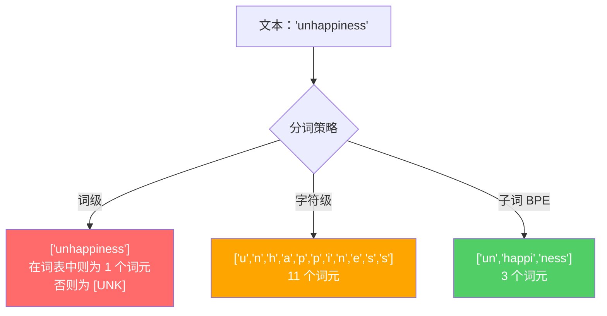
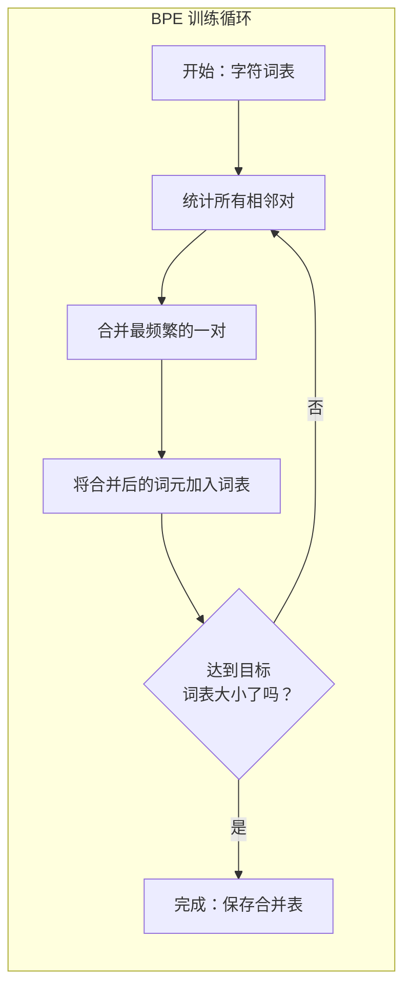
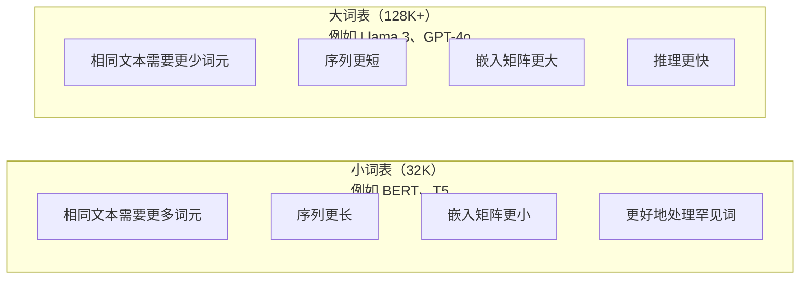

# 分词器（Tokenizers）：BPE、WordPiece、SentencePiece

> 大语言模型（Large Language Model，LLM）读的不是英语，而是整数。分词器（Tokenizer）决定这些整数是在承载意义，还是在浪费表达空间。

**Type:** Build
**Languages:** Python
**Prerequisites:** 阶段 05（自然语言处理基础，NLP Foundations）
**Time:** ~90 分钟

## 学习目标（Learning Objectives）

- 从零实现字节对编码（Byte Pair Encoding，BPE）、WordPiece 和一元语言模型（Unigram）分词算法，比较各自的合并策略
- 解释词表大小如何影响模型效率：过小会产生长序列，过大会浪费嵌入（Embedding）参数
- 分析不同语言和代码中的分词异常，找出具体分词器失效的情形
- 使用 tiktoken 和 sentencepiece 库对文本分词，并检查生成的词元（Token）ID

## 问题（The Problem）

大语言模型不读英语，也不读任何语言。它读的是数字。

把 "Hello, world!" 变成 [15496, 11, 995, 0] 的就是分词器。每个单词、每个空格、每个标点都必须先转换为整数，模型才能处理。这种转换并非中性的：它将一些假设固化进模型，事后无法撤销。

设计不当，模型就会浪费容量，用多个词元编码常见词。"unfortunately" 会变成四个词元，而不是一个。对于多音节词密集的文本，你的 128K 上下文窗口（Context Window）相当于缩小了 75%。设计得当，同样的窗口就能容纳两倍的意义。“这个模型擅长处理代码”和“这个模型处理 Python 就卡壳”之间的差别，往往取决于分词器的训练方式。

你对 GPT-4 或 Claude 发出的每次应用程序编程接口（Application Programming Interface，API）调用都按词元计费。模型每生成一个词元都要消耗计算资源。表示输出所需的词元越少，端到端推理（Inference）就越快。分词不只是预处理，它也是架构设计。

## 概念（The Concept）

### 三种失败的方法与一种胜出的方法（Three Approaches That Failed (and One That Won)）

把文本转换为数字，有三种直观的方法。其中两种无法有效扩展到大规模应用。

**词级分词（Word-level tokenization）**按空格和标点拆分。"The cat sat" 变成 ["The", "cat", "sat"]。很简单，但 "tokenization" 呢？"GPT-4o" 呢？或者 "Geschwindigkeitsbegrenzung" 这样的德语复合词呢？词级方法需要庞大的词表，才能覆盖所有语言中的每个词。漏掉一个词，就会出现令人头疼的 `[UNK]` 词元，相当于模型说“我完全不知道这是什么”。仅英语就有超过一百万种词形。再加上代码、URL、科学记数法和其他 100 种语言，就需要无限大的词表。

**字符级分词（Character-level tokenization）**走向另一个极端。"hello" 变成 ["h", "e", "l", "l", "o"]。词表很小，只有几百个字符，也不会出现未知词元。但序列会变得很长：原本只需 10 个词级词元的句子，会变成 50 个字符级词元。模型必须学习 "t"、"h"、"e" 合起来就是 "the"，把注意力（Attention）容量耗在人类三岁就学会的事情上。

**子词分词（Subword tokenization）**找到了折中点。常见词保持完整："the" 是一个词元。罕见词拆成有意义的片段："unhappiness" 变成 ["un", "happi", "ness"]。词表大小可控，为 30K 到 128K 个词元；序列也保持较短。未知词元基本消失，因为任何词都可以由子词片段拼成。

现代大语言模型都使用子词分词，GPT-2、GPT-4、BERT、Llama 3、Claude 无一例外。区别在于采用哪种算法。



### 字节对编码（BPE: Byte Pair Encoding）

BPE 原本是一种贪心压缩算法（Greedy compression algorithm），后来被用于分词。其思路简单到一张索引卡就能写下。

从单个字符开始，统计训练语料（Corpus）中的每一对相邻项，把出现最频繁的一对合并成新词元。重复这个过程，直到达到目标词表大小。

```figure
tokenizer-bpe
```

下面展示 BPE 如何处理由 "lower"、"lowest" 和 "newest" 构成的小型语料：

```
语料（含词频）：
  "lower"  x5
  "lowest" x2
  "newest" x6

步骤 0 -- 从字符开始：
  l o w e r       (x5)
  l o w e s t     (x2)
  n e w e s t     (x6)

步骤 1 -- 统计相邻对：
  (e,s): 8    (s,t): 8    (l,o): 7    (o,w): 7
  (w,e): 13   (e,r): 5    (n,e): 6    ...

步骤 2 -- 合并最频繁的相邻对 (w,e) -> "we"：
  l o we r        (x5)
  l o we s t      (x2)
  n e we s t      (x6)

步骤 3 -- 重新计数并合并 (e,s) -> "es"：
  l o we r        (x5)
  l o we s t      (x2)    <- 'es' 只能由 'e'+'s' 构成，不能由 'we'+'s' 构成
  n e we s t      (x6)    <- 等等，'e' 在 'we' 前，'s' 在 'we' 后

准确追踪实际过程：
  合并 "we" 后，剩余相邻对为：
  (l,o): 7   (o,we): 7   (we,r): 5   (we,s): 8
  (s,t): 8   (n,e): 6    (e,we): 6

步骤 3 -- 合并 (we,s) -> "wes" 或 (s,t) -> "st"（均为 8 次，选第一对）：
  合并 (we,s) -> "wes"：
  l o we r        (x5)
  l o wes t       (x2)
  n e wes t       (x6)

步骤 4 -- 合并 (wes,t) -> "west"：
  l o we r        (x5)
  l o west        (x2)
  n e west        (x6)

……继续，直到达到目标词表大小。
```

合并表（Merge table）就是分词器。编码新文本时，要按训练时学到的顺序执行合并。训练语料决定了有哪些合并规则，而这个选择会永久影响模型看到的内容。



### 字节级 BPE（Byte-Level BPE）：GPT-2、GPT-3、GPT-4

标准 BPE 处理 Unicode 字符；字节级 BPE 处理原始字节（0-255）。因此基础词表恰好有 256 项，可以处理任何语言或编码，且不会产生未知词元。

GPT-2 引入了这种方法。基础词表覆盖所有可能的字节，BPE 合并在此基础上进行。OpenAI 的 tiktoken 库实现了字节级 BPE，各模型的词表大小如下：

- GPT-2：50,257 个词元
- GPT-3.5/GPT-4：~100,256 个词元（cl100k_base 编码）
- GPT-4o：200,019 个词元（o200k_base 编码）

### WordPiece (BERT)

WordPiece 看起来与 BPE 类似，但选择合并项的方式不同。它不使用原始频次，而是最大化训练数据的似然（Likelihood）：

```
BPE 合并准则：      count(A, B)
WordPiece 合并准则： count(AB) / (count(A) * count(B))
```

BPE 问的是：“哪一对出现得最多？”WordPiece 问的是：“哪一对共同出现的频率超出了随机情况下的预期？”这一细微差别会产生不同的词表。WordPiece 倾向于合并共同出现概率超出预期的片段，而不只是高频片段。

WordPiece 还用 "##" 前缀标记接续子词：

```
"unhappiness" -> ["un", "##happi", "##ness"]
"embedding"   -> ["em", "##bed", "##ding"]
```

"##" 前缀表示这个片段接在前一个词元后面。BERT 使用 WordPiece，词表包含 30,522 个词元。说到 BERT 的各个变体，例如 DistilBERT，需要注意 RoBERTa 的分词器实际上是 BPE，而 BERT 本身使用 WordPiece。

### SentencePiece (Llama, T5)

SentencePiece 将输入视为包含空白字符的原始 Unicode 字符流。它没有预分词（Pre-tokenization）步骤，也不使用特定语言的词边界规则，因此真正独立于语言，适用于中文、日文、泰文等不以空格分词的语言。

SentencePiece 支持两种算法：
- **BPE 模式**：与标准 BPE 的合并逻辑相同，直接应用于原始字符序列
- **Unigram 模式**：从大词表开始，迭代删除对整体似然影响最小的词元。与 BPE 相反，它做的是剪枝而非合并。

Llama 2 使用 SentencePiece BPE，词表有 32,000 个词元。T5 使用 SentencePiece Unigram，同样有 32,000 个词元。注意：Llama 3 改用了基于 tiktoken 的字节级 BPE 分词器，词表有 128,256 个词元。

### 词表大小的权衡（Vocabulary Size Tradeoffs）

这是一项真正的工程决策，其影响可以量化。



看具体数字：128K 词表配合 4,096 维嵌入，仅嵌入矩阵就有 128,000 x 4,096 = 5.24 亿个参数。32K 词表则是 1.31 亿个参数。仅分词器的选择就带来了约 400M 的参数差异。

但更大的词表对文本的压缩也更充分。同一段英文，使用 32K 词表需要 100 个词元，使用 128K 词表可能只需 70 个。这意味着生成时前向传播（Forward pass）次数减少 30%。对于服务数百万次请求的模型，这会直接降低计算成本。

趋势很明确：词表正在变大。GPT-2 使用 50,257 个词元，GPT-4 约 100K，Llama 3 为 128K，GPT-4o 为 200K。

| 模型 | 词表大小 | 分词器类型 | 每个英文单词的平均词元数 |
|-------|-----------|----------------|---------------------------|
| BERT | 30,522 | WordPiece | ~1.4 |
| GPT-2 | 50,257 | 字节级 BPE | ~1.3 |
| Llama 2 | 32,000 | SentencePiece BPE | ~1.4 |
| GPT-4 | ~100,256 | 字节级 BPE | ~1.2 |
| Llama 3 | 128,256 | 字节级 BPE（tiktoken） | ~1.1 |
| GPT-4o | 200,019 | 字节级 BPE | ~1.0 |

### 多语言税（The Multilingual Tax）

主要用英语训练的分词器对其他语言并不友好。GPT-2 的分词器处理韩文时，平均每个词需要 2-3 个词元；中文可能更糟。这意味着韩语用户的有效上下文窗口只有英语用户的一半：支付相同价格，却获得更低的信息密度。

这就是 Llama 3 将词表从 32K 扩大四倍到 128K 的原因。为非英语文字分配更多词元，意味着各语言能够获得更公平的压缩率。

```figure
tokenizer-tradeoff
```

## 动手实现（Build It）

### 步骤 1：字符级分词器（Step 1: Character-Level Tokenizer）

从基础做起。字符级分词器把每个字符映射到它的 Unicode 码点（Code point）。不需要训练，没有未知词元，只有直接映射。

```python
class CharTokenizer:
    def encode(self, text):
        return [ord(c) for c in text]

    def decode(self, tokens):
        return "".join(chr(t) for t in tokens)
```

"hello" 变成 [104, 101, 108, 108, 111]。每个字符都是独立词元。这就是后续改进的基线。

### 步骤 2：从零实现 BPE 分词器（Step 2: BPE Tokenizer from Scratch）

开始真正的实现。我们像 GPT-2 一样在原始字节上训练，统计相邻对，合并出现最多的一对，并按顺序记录每次合并。合并表就是分词器。

```python
from collections import Counter

class BPETokenizer:
    def __init__(self):
        self.merges = {}
        self.vocab = {}

    def _get_pairs(self, tokens):
        pairs = Counter()
        for i in range(len(tokens) - 1):
            pairs[(tokens[i], tokens[i + 1])] += 1
        return pairs

    def _merge_pair(self, tokens, pair, new_token):
        merged = []
        i = 0
        while i < len(tokens):
            if i < len(tokens) - 1 and tokens[i] == pair[0] and tokens[i + 1] == pair[1]:
                merged.append(new_token)
                i += 2
            else:
                merged.append(tokens[i])
                i += 1
        return merged

    def train(self, text, num_merges):
        tokens = list(text.encode("utf-8"))
        self.vocab = {i: bytes([i]) for i in range(256)}

        for i in range(num_merges):
            pairs = self._get_pairs(tokens)
            if not pairs:
                break
            best_pair = max(pairs, key=pairs.get)
            new_token = 256 + i
            tokens = self._merge_pair(tokens, best_pair, new_token)
            self.merges[best_pair] = new_token
            self.vocab[new_token] = self.vocab[best_pair[0]] + self.vocab[best_pair[1]]

        return self

    def encode(self, text):
        tokens = list(text.encode("utf-8"))
        for pair, new_token in self.merges.items():
            tokens = self._merge_pair(tokens, pair, new_token)
        return tokens

    def decode(self, tokens):
        byte_sequence = b"".join(self.vocab[t] for t in tokens)
        return byte_sequence.decode("utf-8", errors="replace")
```

训练循环是 BPE 的核心：统计相邻对，合并频次最高者，再重复。每次合并都会减少词元总数。经过 `num_merges` 轮后，词表从 256 个基础字节增长为 256 + num_merges 项。

编码必须严格按学习顺序执行合并。这很重要：如果第 1 次合并生成 "th"，第 5 次生成 "the"，编码时就必须先执行第 1 次合并，才能在第 5 次用 "th" + "e" 得到 "the"。

解码则相反：在词表中查找每个词元 ID，拼接字节，再按 UTF-8 解码。

### 步骤 3：编码与解码往返验证（Step 3: Encode and Decode Roundtrip）

```python
corpus = (
    "The cat sat on the mat. The cat ate the rat. "
    "The dog sat on the log. The dog ate the frog. "
    "Natural language processing is the study of how computers "
    "understand and generate human language. "
    "Tokenization is the first step in any NLP pipeline."
)

tokenizer = BPETokenizer()
tokenizer.train(corpus, num_merges=40)

test_sentences = [
    "The cat sat on the mat.",
    "Natural language processing",
    "tokenization pipeline",
    "unhappiness",
]

for sentence in test_sentences:
    encoded = tokenizer.encode(sentence)
    decoded = tokenizer.decode(encoded)
    raw_bytes = len(sentence.encode("utf-8"))
    ratio = len(encoded) / raw_bytes
    print(f"'{sentence}'")
    print(f"  Tokens: {len(encoded)} (from {raw_bytes} bytes) -- ratio: {ratio:.2f}")
    print(f"  Roundtrip: {'PASS' if decoded == sentence else 'FAIL'}")
```

压缩比（Compression ratio）反映分词器的效果。比值为 0.50，表示词元数被压缩到原始字节数的一半，越低越好。在训练语料上，比值通常较好；对于 "unhappiness" 这种未出现在语料中的分布外（Out-of-distribution）文本，比值会更差，因为分词器会对未见过的模式回退到字符级编码。

### 步骤 4：与 tiktoken 比较（Step 4: Compare with tiktoken）

```python
import tiktoken

enc = tiktoken.get_encoding("cl100k_base")

texts = [
    "The cat sat on the mat.",
    "unhappiness",
    "Hello, world!",
    "def fibonacci(n): return n if n < 2 else fibonacci(n-1) + fibonacci(n-2)",
    "Geschwindigkeitsbegrenzung",
]

for text in texts:
    our_tokens = tokenizer.encode(text)
    tiktoken_tokens = enc.encode(text)
    tiktoken_pieces = [enc.decode([t]) for t in tiktoken_tokens]
    print(f"'{text}'")
    print(f"  Our BPE:   {len(our_tokens)} tokens")
    print(f"  tiktoken:  {len(tiktoken_tokens)} tokens -> {tiktoken_pieces}")
```

tiktoken 使用完全相同的算法，但训练文本有数百 GB，并执行了 100,000 次合并。算法相同，区别是训练数据和合并次数。你的分词器只在一段文字上训练并合并 40 次，无法与在海量语料上合并 100K 次的 tiktoken 相比，但机制相同。

### 步骤 5：词表分析（Step 5: Vocabulary Analysis）

```python
def analyze_vocabulary(tokenizer, test_texts):
    total_tokens = 0
    total_chars = 0
    token_usage = Counter()

    for text in test_texts:
        encoded = tokenizer.encode(text)
        total_tokens += len(encoded)
        total_chars += len(text)
        for t in encoded:
            token_usage[t] += 1

    print(f"Vocabulary size: {len(tokenizer.vocab)}")
    print(f"Total tokens across all texts: {total_tokens}")
    print(f"Total characters: {total_chars}")
    print(f"Avg tokens per character: {total_tokens / total_chars:.2f}")

    print(f"\nMost used tokens:")
    for token_id, count in token_usage.most_common(10):
        token_bytes = tokenizer.vocab[token_id]
        display = token_bytes.decode("utf-8", errors="replace")
        print(f"  Token {token_id:4d}: '{display}' (used {count} times)")

    unused = [t for t in tokenizer.vocab if t not in token_usage]
    print(f"\nUnused tokens: {len(unused)} out of {len(tokenizer.vocab)}")
```

这会揭示词表中的齐普夫分布（Zipf distribution）。少数词元占据大多数使用量，例如空格、"the"、"e"；大多数词元很少使用。生产级分词器会针对这种分布优化：常见模式获得短词元 ID，罕见模式则使用更长的表示。

## 实际应用（Use It）

从零实现的 BPE 已经能工作了。现在看看生产工具是什么样的。

### tiktoken (OpenAI)

```python
import tiktoken

enc = tiktoken.get_encoding("cl100k_base")

text = "Tokenizers convert text to integers"
tokens = enc.encode(text)
print(f"Tokens: {tokens}")
print(f"Pieces: {[enc.decode([t]) for t in tokens]}")
print(f"Roundtrip: {enc.decode(tokens)}")
```

tiktoken 用 Rust 编写，并提供 Python 绑定，每秒可编码数百万个词元。同样的 BPE 算法，换成了工业级实现。

### Hugging Face tokenizers

```python
from tokenizers import Tokenizer
from tokenizers.models import BPE
from tokenizers.trainers import BpeTrainer
from tokenizers.pre_tokenizers import ByteLevel

tokenizer = Tokenizer(BPE())
tokenizer.pre_tokenizer = ByteLevel()

trainer = BpeTrainer(vocab_size=1000, special_tokens=["<pad>", "<eos>", "<unk>"])
tokenizer.train(["corpus.txt"], trainer)

output = tokenizer.encode("The cat sat on the mat.")
print(f"Tokens: {output.tokens}")
print(f"IDs: {output.ids}")
```

Hugging Face tokenizers 库底层同样使用 Rust，可以在数秒内完成 GB 级语料的 BPE 训练。训练自己的模型时，就可以使用它。

### 加载 Llama 的分词器（Loading Llama's Tokenizer）

```python
from transformers import AutoTokenizer

tokenizer = AutoTokenizer.from_pretrained("meta-llama/Llama-3.1-8B")

text = "Tokenizers are the unsung heroes of LLMs"
tokens = tokenizer.encode(text)
print(f"Token IDs: {tokens}")
print(f"Tokens: {tokenizer.convert_ids_to_tokens(tokens)}")
print(f"Vocab size: {tokenizer.vocab_size}")

multilingual = ["Hello world", "Hola mundo", "Bonjour le monde"]
for text in multilingual:
    ids = tokenizer.encode(text)
    print(f"'{text}' -> {len(ids)} tokens")
```

Llama 3 的 128K 词表对非英语文本的压缩明显优于 GPT-2 的 50K 词表。你可以亲自验证：将同一句话的多种语言版本分别编码，再统计词元数。

## 交付成果（Ship It）

本课产出 `outputs/prompt-tokenizer-analyzer.md`：一份可复用的提示词（Prompt），用于分析任意文本与模型组合的分词效率。提供一份文本样本，它就会告诉你哪个模型的分词器最适合处理它。

## 练习（Exercises）

1. 修改 BPE 分词器，在每个合并步骤打印词表。观察 "t" + "h" 如何变成 "th"，再由 "th" + "e" 变成 "the"。追踪常见英文单词如何逐片组装起来。

2. 给 BPE 分词器加入特殊词元（Special tokens）`<pad>`、`<eos>`、`<unk>`，分配 ID 0、1、2，并相应移动其他词元的 ID。实现预分词步骤，在运行 BPE 前按空白字符拆分。

3. 实现 WordPiece 合并准则，以似然比（Likelihood ratio）取代频次。在同一语料上，以相同合并次数训练 BPE 和 WordPiece。比较所得词表：哪一种产生的子词更有语言学意义？

4. 构建多语言分词效率基准测试（Benchmark）。为英语、西班牙语、中文、韩语和阿拉伯语各取 10 个句子，使用 tiktoken（cl100k_base）分词，测量每个字符的平均词元数，量化各语言的“多语言税”。

5. 用更大的语料训练 BPE 分词器，例如下载一篇 Wikipedia 文章。调整合并次数，使压缩比与 tiktoken 在相同文本上的结果相差不超过 10%。这会促使你理解语料大小、合并次数和压缩质量之间的关系。

## 关键术语（Key Terms）

| 术语 | 常见说法 | 实际含义 |
|------|----------------|----------------------|
| 词元（Token） | “一个单词” | 模型词表中的单位，可以是字符、子词、单词或多词片段 |
| 字节对编码（Byte Pair Encoding，BPE） | “某种压缩技术” | 迭代合并出现最频繁的相邻词元对，直到达到目标词表大小 |
| WordPiece | “BERT 的分词器” | 类似 BPE，但合并时最大化似然比 count(AB)/(count(A)*count(B))，而不是原始频次 |
| SentencePiece | “一个分词器库” | 独立于语言的分词器，直接处理原始 Unicode，不做预分词，支持 BPE 和 Unigram 算法 |
| 词表大小（Vocabulary size） | “它认识多少词” | 不同词元的总数：GPT-2 有 50,257 个，BERT 有 30,522 个，Llama 3 有 128,256 个 |
| 词元繁殖率（Fertility） | “这不是分词术语吧” | 每个词的平均词元数，用于衡量跨语言分词效率；1.0 为理想值，3.0 表示模型需要付出三倍工作量 |
| 字节级 BPE（Byte-level BPE） | “GPT 的分词器” | 在原始字节（0-255）而非 Unicode 字符上运行的 BPE，保证任何输入都不会出现未知词元 |
| 合并表（Merge table） | “分词器文件” | 训练学到的词元对合并操作的有序列表，它本身就是分词器，且顺序很重要 |
| 预分词（Pre-tokenization） | “按空格拆分” | 子词分词前应用的规则，包括空白拆分、数字分离、标点处理 |
| 压缩比（Compression ratio） | “分词器有多高效” | 生成词元数除以输入字节数；越低表示压缩越好、推理越快 |

## 延伸阅读（Further Reading）

- [Sennrich 等，2016：《利用子词单元进行罕见词的神经机器翻译》](https://arxiv.org/abs/1508.07909) -- 将 BPE 引入自然语言处理（Natural Language Processing，NLP）的论文，把 1994 年的压缩算法变成现代分词的基础
- [Kudo 与 Richardson，2018：《SentencePiece：简单且独立于语言的子词分词器》](https://arxiv.org/abs/1808.06226) -- 让多语言模型走向实用的语言无关分词方法
- [OpenAI tiktoken 仓库](https://github.com/openai/tiktoken) -- Rust 编写、提供 Python 绑定的生产级 BPE 实现，供 GPT-3.5/4/4o 使用
- [Hugging Face Tokenizers 文档](https://huggingface.co/docs/tokenizers) -- 具备 Rust 性能的生产级分词器训练工具
