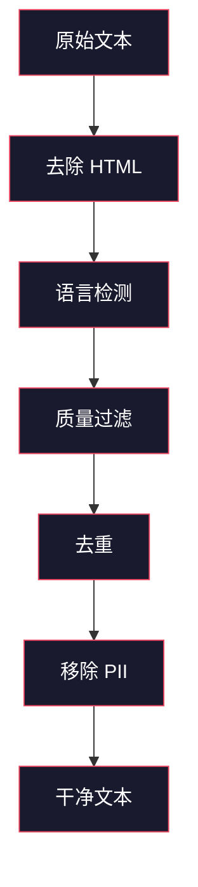
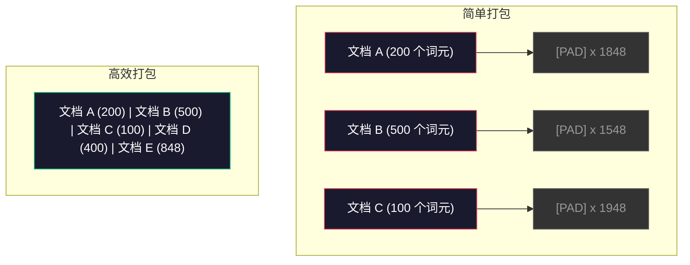

# 预训练数据流水线（Data Pipelines for Pre-Training）

> 模型是一面镜子，你喂给它什么数据，它就映照什么。喂入垃圾，它就会流畅地复现垃圾。

**Type:** Build
**Languages:** Python
**Prerequisites:** 阶段 10，第 01-02 课（分词器、构建分词器）
**Time:** ~90 分钟

## 学习目标（Learning Objectives）

- 构建流式数据流水线（Streaming data pipeline），对 TB 级文本分词、切块、打乱和组批，而无需全部加载到内存
- 实现真实预训练（Pre-training）流水线使用的数据质量过滤器，包括去重、语言检测和内容过滤
- 创建定长训练序列，正确设置注意力掩码（Attention mask）并处理文档边界
- 剖析流水线吞吐量，确保数据加载器（DataLoader）跟得上图形处理器（Graphics Processing Unit，GPU）的训练速度

## 问题（The Problem）

你已经有了分词器（Tokenizer），现在需要数据。

不是一个数据集，也不是一份 CSV 文件，而是 TB 级文本：完成清洗、去重、质量过滤，分词为定长序列，再以随机批次提供，速度要快到让你的 8-GPU 集群从不等待下一批数据。

多数人以为训练大语言模型（Large Language Model，LLM）的关键是模型架构，其实并非如此。Llama 3 使用了 15.6 万亿词元（Token），GPT-3 使用了 3000 亿，DeepSeek-V2 使用了 8.1 万亿。三者架构大致相同：堆叠包含注意力（Attention）和前馈层（Feedforward layer）的 Transformer 块。输出质量差异绝大部分来自数据。

DeepMind 的 Chinchilla 论文对此给出了精确描述。给定计算预算，模型参数量与训练词元数之间存在最优比例。Chinchilla 表明，2022 年多数模型的训练严重不足：相对于它们看到的数据量，参数太多。在 1.4 万亿词元上训练的 70B 参数模型，符合 Chinchilla 最优配置，超过了在 3000 亿词元上训练的 280B 模型 Gopher。

数据流水线决定模型学到的是语言还是噪声。

## 概念（The Concept）

### 数据来自哪里（Where the Data Comes From）

所有大语言模型都使用混合来源的数据训练。多数实验室严守具体配比，但已知信息足以让我们了解这些类别。

| 来源 | 规模 | 质量 | 使用模型 |
|--------|------|---------|---------|
| Common Crawl | 原始数据 ~250 TB | 低，需要大量过滤 | GPT-3、Llama、多数开放模型 |
| Wikipedia | ~20 GB | 高 | 所有主流大语言模型 |
| GitHub 代码 | ~1 TB+ | 中，重复和无用代码很多 | StarCoder, CodeLlama, DeepSeek-Coder |
| 图书（BookCorpus、Pile） | ~100 GB | 高 | GPT-2、GPT-3、早期模型 |
| 学术论文（arXiv、S2ORC） | ~100 GB | 科学、技术、工程、数学（Science, Technology, Engineering, Mathematics，STEM）领域质量高 | Llama, Galactica |
| StackOverflow、Reddit | ~100 GB | 中 | Llama, Falcon |
| 精选网页（C4、RefinedWeb） | ~5 TB | 中高，已预过滤 | T5, Falcon |

Llama 3 披露的数据配比约为：50% 网页数据、25% 代码、13% 图书和学术论文、8% 数学数据、4% 多语言网页数据。总计 15.6 万亿词元，来源的原始文本超过 5 TB。

比例和总量同样重要。网页数据太多，模型就只会复述 Reddit；代码太少，就不会编程；数学太少，推理过程（Reasoning）就会失败。调好这个比例是训练大语言模型最难的环节之一，没有现成公式，必须实验和评估（Evaluation）。

### 数据清洗（Data Cleaning）

原始网页数据很脏。一份典型的 Common Crawl 转储包含：

- HTML 标签和 JavaScript
- 模板化页眉、页脚、导航菜单
- 重复页面，包括完全重复和近似重复
- 机器生成的垃圾内容
- 个人可识别信息（Personally Identifiable Information，PII）
- 低质量文本，如关键词列表、搜索引擎优化（Search Engine Optimization，SEO）垃圾内容
- 被编码成文本的非文本内容

清洗不是可选步骤。它决定模型生成的是连贯段落，还是夹杂商品列表的 HTML 标签。



每一步消除一类噪声：

**去除 HTML：** 删除所有标记，只保留可见文本。`trafilatura` 或 `readability` 等库会提取文章正文，丢弃导航、广告和模板内容。

**语言检测（Language detection）：** 使用 fastText 的语言识别模型 lid.176.bin 对每份文档分类，只保留目标语言。被判为英语但置信度低于 0.8 的文档，很可能不是干净的英文。

**质量过滤（Quality filtering）：** 有意思的部分来了。Falcon 使用的 RefinedWeb 数据集采用基于困惑度（Perplexity）的过滤器：在 Wikipedia 上训练小型语言模型，再给每份文档打分。高困惑度表示文档不像 Wikipedia，可能是垃圾内容、关键词列表或机器生成内容。超过困惑度阈值的文档会被删除。

**去重（Deduplication）：** 这是影响最大的单个清洗步骤。Common Crawl 有大量重复页面，例如法律免责声明、Cookie 提示和服务条款。重复数据浪费训练算力，还可能使模型记住特定段落并逐字复述。

**移除个人可识别信息（PII）：** 包括姓名、电子邮箱、电话号码、社会保障号码。对结构化 PII 使用正则表达式检测，对上下文中的姓名使用命名实体识别（Named Entity Recognition，NER）模型。

### 使用 MinHash 去重（Deduplication with MinHash）

精确去重很简单：对每份文档计算哈希，删除重复项。但真正棘手的是近似重复。同一新闻文章的两个副本，周围广告略有不同，就属于近似重复。内容 95% 相同，但逐字节并不一致。

最小哈希（MinHash）加局部敏感哈希（Locality-Sensitive Hashing，LSH）可以高效解决这个问题。


思路如下：

1. **切片（Shingling）：** 把每份文档转换成 n 元组（n-gram）集合，例如单词或字符的 5 元组。"the quick brown fox" 采用 3 词切片时变成 {"the quick brown", "quick brown fox"}。

2. **最小哈希（MinHash）：** 对每份文档的切片集合计算 k 个哈希值。每个值是某个不同哈希函数下所有切片的最小哈希。由此得到定长“签名”，用于近似任意两份文档的雅卡尔相似度（Jaccard similarity）。

3. **局部敏感哈希（LSH）：** 根据 MinHash 签名的分带（Band）将文档分桶。同桶文档是候选近似重复项。这样无需比较所有文档对，只比较候选项。

4. **验证：** 对每个候选对计算精确的雅卡尔相似度。超过阈值，通常为 0.8，就删除其中一个副本。

Llama 团队报告，通过去重删除了约 38% 的网页数据。这不是小数字：Common Crawl 超过三分之一的内容是完全重复或近似重复。

### 序列打包（Sequence Packing）

模型要求定长输入序列，但文档长度各异。有的 50 个词元，有的 50,000 个。

简单做法是把每份文档填充到最大序列长度，但这会在无助于学习的填充词元上浪费大量计算。

更好的做法是把多份文档打包进一个序列，用序列结束词元分隔。例如一个 2048 词元序列可能包含三份短文档，中间用 [EOS] 词元连接。



注意力掩码必须设置正确。在同一个打包序列中，文档 A 的词元不应关注文档 B 的词元，这需要分块对角注意力掩码（Block-diagonal attention mask）。

长文档会被截断，或者在序列边界切块。切分位置很重要：在句子中间切开，会迫使模型看到不完整的意思。一些流水线会尽可能将切分点对齐到段落或句子边界。

### Chinchilla 缩放定律（The Chinchilla Scaling Law）

对于固定计算预算 C，以浮点运算次数（Floating-point operations，FLOPs）衡量，最优模型规模 N 和数据集规模 D 满足：

```
N_opt ~ C^0.5
D_opt ~ C^0.5
```

实际含义是，模型规模与数据集规模应大致同比例扩展。参数增加 10 倍的模型，需要约 10 倍训练词元才能达到相同损失（Loss）。

| 模型 | 参数量 | 训练词元数 | 是否符合 Chinchilla 最优配置？ |
|-------|-----------|----------------|-------------------|
| GPT-3 | 175B | 300B | 否，训练量不足 3-4 倍 |
| Chinchilla | 70B | 1.4T | 是，按此设计 |
| Llama 2 | 70B | 2T | 有意超额训练 |
| Llama 3 | 70B | 15T | 大幅超额训练 |

Llama 3 有意不遵循 Chinchilla 定律。Meta 发现，在更多数据上超额训练，远超计算最优比例，可以得到更适合推理（Inference）的模型。额外训练成本只支付一次，而小模型此后的服务成本始终更低。这有时称为“推理最优”（Inference-optimal）缩放方法，自 2024 年起成为行业标准。

```figure
l5-data-pipeline
```

## 动手实现（Build It）

### 步骤 1：文本清洗（Step 1: Text Cleaning）

去除 HTML、规范空白、删除非文本内容。我们使用公有领域文本 Project Gutenberg 作为小型语料。

```python
import re

def clean_text(text):
    text = re.sub(r"<[^>]+>", "", text)
    text = re.sub(r"http\S+", "", text)
    text = re.sub(r"[^\x20-\x7E\n]", "", text)
    text = re.sub(r"\n{3,}", "\n\n", text)
    text = re.sub(r" {2,}", " ", text)
    return text.strip()

def quality_filter(text, min_words=50, max_ratio_caps=0.3, max_ratio_special=0.1):
    words = text.split()
    if len(words) < min_words:
        return False
    caps_ratio = sum(1 for w in words if w.isupper()) / len(words)
    if caps_ratio > max_ratio_caps:
        return False
    special_chars = sum(1 for c in text if not c.isalnum() and not c.isspace())
    if special_chars / max(len(text), 1) > max_ratio_special:
        return False
    return True
```

质量过滤器会捕获 SEO 垃圾内容（全大写）、机器生成噪声（特殊字符比例高）和过短的存根页面。仅这三项检查，就能从网页抓取结果中去掉大量垃圾。

### 步骤 2：MinHash 去重（Step 2: MinHash Deduplication）

从零实现 MinHash，无需外部库，只用 `hashlib`。

```python
import hashlib
from collections import defaultdict

def get_shingles(text, k=5):
    words = text.lower().split()
    if len(words) < k:
        return set()
    return {" ".join(words[i:i+k]) for i in range(len(words) - k + 1)}

def minhash_signature(shingles, num_hashes=128):
    signature = []
    for i in range(num_hashes):
        min_hash = float("inf")
        for shingle in shingles:
            h = int(hashlib.sha256(f"{i}:{shingle}".encode()).hexdigest(), 16)
            min_hash = min(min_hash, h)
        signature.append(min_hash)
    return signature

def lsh_buckets(signature, bands=16):
    rows_per_band = len(signature) // bands
    buckets = []
    for b in range(bands):
        start = b * rows_per_band
        band_data = tuple(signature[start:start + rows_per_band])
        bucket_hash = hashlib.md5(str(band_data).encode()).hexdigest()
        buckets.append((b, bucket_hash))
    return buckets

def deduplicate(documents, threshold=0.8, num_hashes=128, bands=16):
    signatures = []
    shingle_sets = []
    for doc in documents:
        shingles = get_shingles(doc)
        shingle_sets.append(shingles)
        signatures.append(minhash_signature(shingles, num_hashes))

    bucket_map = defaultdict(list)
    for doc_idx, sig in enumerate(signatures):
        for band_id, bucket_hash in lsh_buckets(sig, bands):
            bucket_map[(band_id, bucket_hash)].append(doc_idx)

    duplicate_pairs = set()
    for bucket_docs in bucket_map.values():
        if len(bucket_docs) < 2:
            continue
        for i in range(len(bucket_docs)):
            for j in range(i + 1, len(bucket_docs)):
                duplicate_pairs.add((bucket_docs[i], bucket_docs[j]))

    removed = set()
    for i, j in duplicate_pairs:
        if i in removed or j in removed:
            continue
        s1, s2 = shingle_sets[i], shingle_sets[j]
        if not s1 or not s2:
            continue
        jaccard = len(s1 & s2) / len(s1 | s2)
        if jaccard >= threshold:
            removed.add(j)

    return [doc for idx, doc in enumerate(documents) if idx not in removed], len(removed)
```

`num_hashes=128` 和 `bands=16` 控制精确率与召回率（Precision-recall）的权衡。哈希越多，相似度估计越准；分带越多，召回率越高，能找到更多重复项，但误报也更多。这组值适合典型网页文本。

### 步骤 3：分词与序列打包（Step 3: Tokenize and Pack Sequences）

对清洗、去重后的文本分词，再打包为训练所需的定长序列。

```python
def tokenize_corpus(documents, tokenizer):
    all_tokens = []
    for doc in documents:
        tokens = tokenizer.encode(doc)
        all_tokens.extend(tokens)
        all_tokens.append(tokenizer.eos_id)
    return all_tokens

def pack_sequences(token_ids, seq_length, pad_id=0):
    sequences = []
    attention_masks = []
    for i in range(0, len(token_ids), seq_length):
        seq = token_ids[i:i + seq_length]
        mask = [1] * len(seq)
        if len(seq) < seq_length:
            pad_count = seq_length - len(seq)
            seq = seq + [pad_id] * pad_count
            mask = mask + [0] * pad_count
        sequences.append(seq)
        attention_masks.append(mask)
    return sequences, attention_masks
```

### 步骤 4：训练数据加载器（Step 4: DataLoader for Training）

产出随机化的打包序列批次，供训练循环消费。

```python
import random

class PreTrainingDataLoader:
    def __init__(self, sequences, attention_masks, batch_size, shuffle=True):
        self.sequences = sequences
        self.attention_masks = attention_masks
        self.batch_size = batch_size
        self.shuffle = shuffle

    def __len__(self):
        return (len(self.sequences) + self.batch_size - 1) // self.batch_size

    def __iter__(self):
        indices = list(range(len(self.sequences)))
        if self.shuffle:
            random.shuffle(indices)
        for start in range(0, len(indices), self.batch_size):
            batch_idx = indices[start:start + self.batch_size]
            batch_seqs = [self.sequences[i] for i in batch_idx]
            batch_masks = [self.attention_masks[i] for i in batch_idx]
            yield batch_seqs, batch_masks
```

### 步骤 5：数据集统计（Step 5: Dataset Statistics）

计算关键数字：词元总数、不同词元数、压缩比、文档长度分布。

```python
from collections import Counter

def compute_statistics(documents, token_ids, sequences, tokenizer_vocab_size):
    total_chars = sum(len(d) for d in documents)
    total_tokens = len(token_ids)
    unique_tokens = len(set(token_ids))
    compression_ratio = total_chars / total_tokens

    doc_lengths = [len(d.split()) for d in documents]
    avg_doc_length = sum(doc_lengths) / max(len(doc_lengths), 1)
    max_doc_length = max(doc_lengths) if doc_lengths else 0
    min_doc_length = min(doc_lengths) if doc_lengths else 0

    token_counts = Counter(token_ids)
    top_tokens = token_counts.most_common(10)

    non_pad_tokens = sum(sum(1 for t in seq if t != 0) for seq in sequences)
    total_positions = sum(len(seq) for seq in sequences)
    utilization = non_pad_tokens / max(total_positions, 1)

    stats = {
        "total_documents": len(documents),
        "total_characters": total_chars,
        "total_tokens": total_tokens,
        "unique_tokens": unique_tokens,
        "vocab_utilization": unique_tokens / tokenizer_vocab_size,
        "compression_ratio": compression_ratio,
        "avg_doc_length_words": avg_doc_length,
        "max_doc_length_words": max_doc_length,
        "min_doc_length_words": min_doc_length,
        "num_sequences": len(sequences),
        "sequence_utilization": utilization,
        "top_10_tokens": top_tokens,
    }
    return stats
```

压缩比（Compression ratio）说明分词器在该语料上的效率。英文通常压缩为每词元约 3-4 字符。如果只有 1.5 字符，说明分词器拆得过细；如果达到 8 以上，说明学到了高度领域化的合并。

序列利用率（Sequence utilization）表示打包序列中真实数据与填充的占比。低于 90% 说明打包低效，算力浪费在填充词元上。

## 实际应用（Use It）

### 与 HuggingFace Datasets 比较（Compare With HuggingFace Datasets）

通过 HuggingFace 的 datasets 库加载同一语料，比较流水线速度。

```python
from datasets import load_dataset
from transformers import AutoTokenizer

ds = load_dataset("wikitext", "wikitext-2-raw-v1", split="train")
tokenizer = AutoTokenizer.from_pretrained("meta-llama/Meta-Llama-3-8B")

import time

start = time.time()
tokenized = ds.map(
    lambda x: tokenizer(x["text"], truncation=True, max_length=2048),
    batched=True,
    num_proc=4,
)
hf_time = time.time() - start
total_tokens = sum(len(t) for t in tokenized["input_ids"])
print(f"HuggingFace: {total_tokens:,} tokens in {hf_time:.2f}s ({total_tokens/hf_time:,.0f} tokens/sec)")
```

HuggingFace 流水线底层使用 Rust 分词器，并在 4 个核心上并行处理。纯 Python 流水线会慢 10-50 倍。这就是生产团队使用编译型分词器的原因：算法相同，区别是实现语言。

## 交付成果（Ship It）

本课产出一份用于验证和调试大语言模型训练流水线数据质量的提示词（Prompt），见 `outputs/prompt-data-quality-checker.md`。

## 练习（Exercises）

1. **简单：** 用字符集分析这种简单启发式方法，为清洗流水线加入语言检测。只保留英文文档，统计删除了多少文档。
2. **中等：** 除 MinHash 近似去重外，再用 SHA-256 哈希实现精确去重。在网页抓取语料上比较两种方法发现的重复数量。
3. **困难：** 构建基于困惑度的质量过滤器。在 Wikipedia 文本上训练小型二元语言模型（Bigram language model），按困惑度为各文档打分，删除质量最差的 20%。比较使用过滤与未过滤数据训练时的模型输出质量。

## 关键术语（Key Terms）

| 术语 | 常见说法 | 实际含义 |
|------|----------------|----------------------|
| Common Crawl | “互联网” | 每月抓取网页的非营利组织，原始数据约 250TB，是多数大语言模型训练数据的起点 |
| 最小哈希（MinHash） | “某种哈希技巧” | 用定长签名估计集合间雅卡尔相似度的技术，支持大规模近似重复检测 |
| 局部敏感哈希（Locality-Sensitive Hashing，LSH） | “局部敏感哈希” | 将相似项放进同一桶的方法，把两两比较从 O(n^2) 降到近线性 |
| 序列打包（Sequence packing） | “拼接文档” | 将多份文档装入定长序列并正确设置注意力掩码，消除填充浪费 |
| Chinchilla 缩放（Chinchilla scaling） | “用更多数据训练” | 固定计算预算下，最优性能要求模型规模和训练词元数大致同比例扩展 |
| 词元繁殖率（Fertility） | “每词词元数” | 每个词的平均词元数，GPT-4 的英文为 1.3，非拉丁文字更高 |
| 数据混合（Data mixing） | “选择训练数据” | 代码、文本、数学、多语言数据之间的比例，没有公式，需实验确定 |
| 困惑度过滤器（Perplexity filter） | “质量打分” | 用小型语言模型给文档打分，高困惑度表示文本不像干净的参考数据 |
| 去重（Deduplication） | “删除副本” | 消除完全重复和近似重复文档，通常删除原始网页数据的 30-40% |
| 注意力掩码（Attention mask） | “关注哪些词元” | 防止打包序列跨文档边界计算注意力的二值掩码 |

## 延伸阅读（Further Reading）

- [Hoffmann 等，2022：《训练计算最优的大语言模型》（Chinchilla）](https://arxiv.org/abs/2203.15556) -- 改变我们对数据规模认识的论文
- [Penedo 等，2023：《面向 Falcon 大语言模型的 RefinedWeb 数据集》](https://arxiv.org/abs/2306.01116) -- 如何将 Common Crawl 过滤成高质量数据
- [Touvron 等，2023：《Llama 2：开放基础模型与微调聊天模型》](https://arxiv.org/abs/2307.09288) -- Llama 2 数据流水线细节
- [Lee 等，2022：《训练数据去重让语言模型更好》](https://arxiv.org/abs/2107.06499) -- 为什么去重比你想象的更重要
- [Broder，1997：《论文档的相似性与包含关系》](https://ieeexplore.ieee.org/document/666900) -- 最初的 MinHash 论文
- [Meta，2024：《Llama 3 技术报告》](https://arxiv.org/abs/2407.21783) -- 15.6T 词元、数据混合比例、过滤流水线
