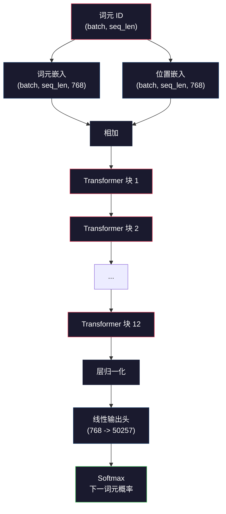
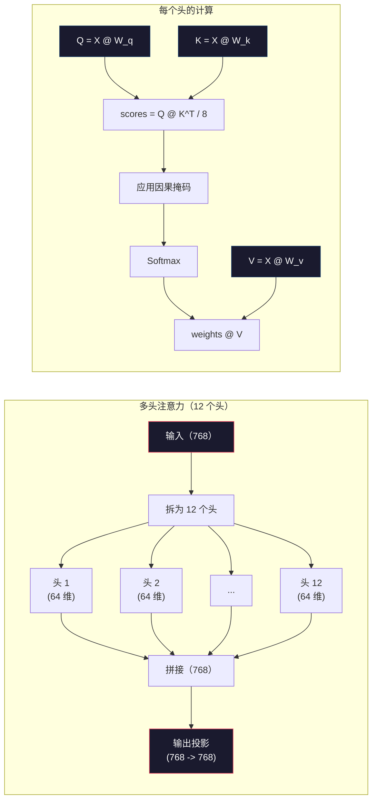
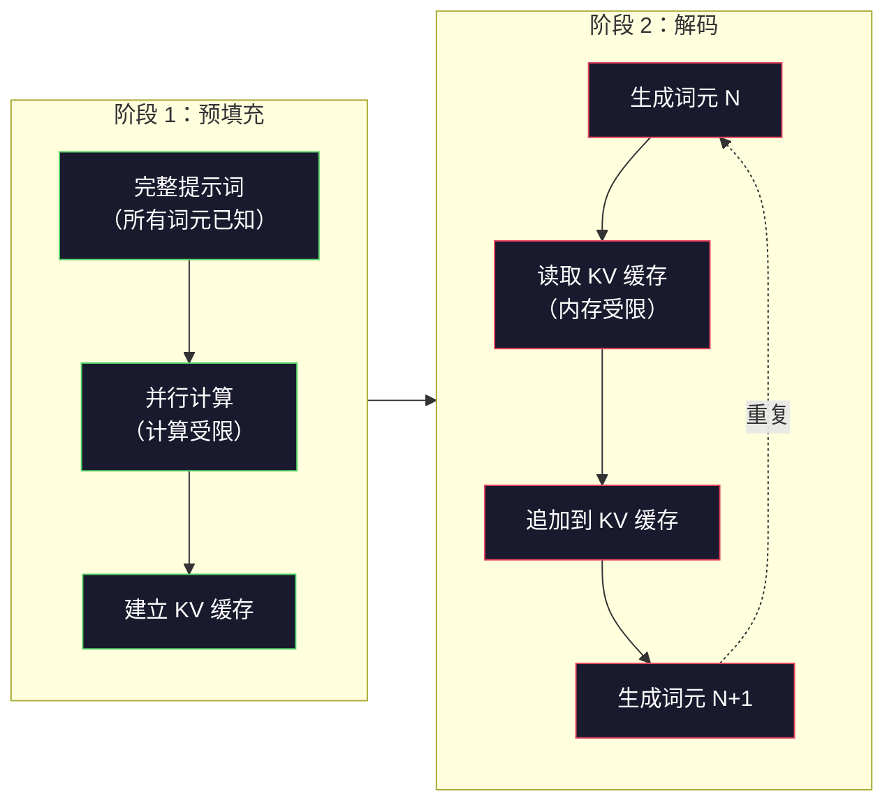

# 预训练迷你 GPT：124M 参数（Pre-Training a Mini GPT (124M Parameters)）

> GPT-2 Small 有 1.24 亿个参数，包括 12 层 Transformer、12 个注意力头和 768 维嵌入。你可以在单张 GPU 上用几小时从零训练它。多数人从不这样做，而是使用预训练检查点。但如果没有亲自训练过，你就没有真正理解自己所依赖的模型内部发生了什么。

**Type:** Build
**Languages:** Python (with numpy)
**Prerequisites:** 阶段 10，第 01-03 课（分词器、构建分词器、数据流水线）
**Time:** ~120 分钟

## 学习目标（Learning Objectives）

- 从零实现完整 GPT-2 架构，含 124M 参数：词元嵌入、位置嵌入、Transformer 块和语言模型头
- 使用下一词元预测（Next-token prediction）和交叉熵损失（Cross-entropy loss），在文本语料上训练 GPT 模型
- 实现带温度采样（Temperature sampling）及 top-k/top-p 过滤的自回归（Autoregressive）文本生成
- 监控训练损失曲线，验证模型是否学会连贯的语言模式

## 问题（The Problem）

你知道 Transformer 是什么，看过它的图，能背出“注意力就是你所需要的一切”，也能在白板上画出标着“多头注意力”的方框。

这些都不代表你理解模型生成文本时发生了什么。

采用权重绑定（Weight tying）的 GPT-2 Small 有 124,438,272 个参数。每个参数都通过训练循环确定：前向传播、计算损失、反向传播、更新权重。12 个 Transformer 块，每块 12 个注意力头，768 维嵌入空间，50,257 个词元的词表。每次模型生成一个词元，全部 1.24 亿参数都会参与一条矩阵乘法链，将词元 ID 序列转换成下一词元的概率分布。

如果从未亲手构建过，你面对的就是黑盒。你可以调用 API，可以微调（Fine-tuning），但一旦模型出现幻觉（Hallucination）、重复自身或拒绝遵循指令，你就没有解释其*原因*的认知模型。

本课从零构建 GPT-2 Small，不用 PyTorch，而用 numpy。每次矩阵乘法都可见，每个梯度都由你的代码计算。你将看到 1.24 亿个数字如何共同预测下一个词。

## 概念（The Concept）

### GPT 架构（The GPT Architecture）

GPT 是自回归语言模型。“自回归”意味着每次生成一个词元，并以此前所有词元为条件。架构由多个 Transformer 解码器块（Decoder block）堆叠而成。

从词元 ID 到下一词元概率的完整计算图（Computation graph）如下：

1. 输入词元 ID，形状为 (batch_size, seq_len)。
2. 查找词元嵌入（Token embedding），每个 ID 映射为 768 维向量，形状为 (batch_size, seq_len, 768)。
3. 查找位置嵌入（Position embedding），每个位置 (0, 1, 2, ...) 映射为 768 维向量，形状相同。
4. 将词元嵌入与位置嵌入相加。
5. 经过 12 个 Transformer 块。
6. 执行最终层归一化（Layer normalization）。
7. 线性投影至词表大小，形状为 (batch_size, seq_len, vocab_size)。
8. 使用 Softmax 得到概率。

这就是整个模型。没有卷积，没有循环，只有嵌入、注意力、前馈网络和层归一化，堆叠 12 次。



### Transformer 块（The Transformer Block）

12 个块都遵循相同模式，采用前置归一化（Pre-norm）架构。GPT-2 使用前置归一化，而不是原始 Transformer 的后置归一化（Post-norm）：

1. 层归一化（LayerNorm）
2. 多头自注意力（Multi-Head Self-Attention）
3. 残差连接（Residual connection），把输入加回来
4. 层归一化（LayerNorm）
5. 前馈网络（Feed-Forward Network，FFN），即多层感知机（Multilayer Perceptron，MLP）
6. 残差连接，把输入加回来

残差连接至关重要。没有它，反向传播（Backpropagation）的梯度到达第 1 块时就会消失；有了它，梯度可通过“跳跃”路径从损失直接流向任何层。因此才能堆叠 12、32 甚至 96 个块，传闻 GPT-4 使用 120 个。

### 注意力：核心机制（Attention: The Core Mechanism）

自注意力（Self-Attention）让每个词元查看之前所有词元，并决定对各词元关注多少。数学过程如下。

对每个词元位置，从输入计算三个向量：
- **查询（Query，Q）**：“我在寻找什么？”
- **键（Key，K）**：“我包含什么？”
- **值（Value，V）**：“我携带什么信息？”

```
Q = input @ W_q    (768 -> 768)
K = input @ W_k    (768 -> 768)
V = input @ W_v    (768 -> 768)

attention_scores = Q @ K^T / sqrt(d_k)
attention_scores = mask(attention_scores)   # causal mask: -inf for future positions
attention_weights = softmax(attention_scores)
output = attention_weights @ V
```

因果掩码（Causal mask）让 GPT 具备自回归性质。位置 5 可以关注位置 0-5，但不能关注 6、7、8 等未来位置，防止模型在训练时偷看未来词元“作弊”。

**多头注意力（Multi-head attention）**将 768 维空间拆为 12 个头，每头 64 维。每个头学习不同注意力模式：某个头可能追踪主谓一致等句法关系，另一个追踪同义词等语义相似性，还有一个追踪相邻词等位置接近性。12 个头的输出拼接起来，再投影回 768 维。



除以 sqrt(d_k)，即 sqrt(64) = 8，是缩放操作。没有它，高维向量的点积会变大，把 softmax 推向梯度接近零的区域。这是最初《Attention Is All You Need》论文的关键洞见之一。

### 键值缓存：推理为何更快（KV Cache: Why Inference Is Fast）

训练时一次处理整个序列，推理（Inference）时每次生成一个词元。若不优化，生成第 N 个词元就要重新计算此前 N-1 个词元的注意力，每个生成词元的复杂度为 O(N^2)，长度 N 的序列总复杂度为 O(N^3)。

键值缓存（Key-Value Cache，KV Cache）解决了这个问题。计算每个词元的 K 和 V 后，将它们保存。生成第 N+1 个词元时，只需计算新词元的 Q，并查找此前所有词元缓存的 K、V。K、V 计算的每词元成本从 O(N) 降至 O(1)。注意力分数仍需 O(N)，因为仍要关注此前所有位置，但避免了输入上的重复矩阵乘法。

GPT-2 有 12 层、12 个头，KV 缓存每词元保存 2 (K + V) x 12 layers x 12 heads x 64 dims = 18,432 个值。1024 词元序列使用 32 位浮点数（32-bit Floating Point，FP32）时约占 75MB。具有 128 层的 Llama 3 405B，单序列 KV 缓存可超过 10GB。这就是长上下文推理受内存限制的原因。

### 预填充与解码：推理的两个阶段（Prefill vs Decode: Two Phases of Inference）

向大语言模型发送提示词（Prompt）时，推理分为两个不同阶段。

**预填充（Prefill）**并行处理整个提示词。所有词元已知，因此模型能同时计算所有位置的注意力。此阶段受计算限制，GPU 以满吞吐量做矩阵乘法。在 A100 上，1000 词元提示词的预填充约需 20-50ms。

**解码（Decode）**逐个生成词元，每个新词元都依赖此前所有词元。此阶段受内存限制，瓶颈是从 GPU 内存读取模型权重和 KV 缓存，而非矩阵运算本身。GPU 计算核心大多空闲，等待内存读取。对 GPT-2 而言，无论矩阵乘法需要多少浮点运算次数（Floating-point operations，FLOPs），每个解码步骤耗时都差不多，因为限制因素是内存带宽。

这一区别对生产系统很重要。预填充吞吐量随 GPU 算力增长，FLOPS 越高，预填充越快；解码吞吐量随内存带宽增长，内存越快，解码越快。因此 NVIDIA H100 相比 A100 着重提升内存带宽，这能直接加快词元生成。



### 训练循环（The Training Loop）

大语言模型训练就是下一词元预测。给定词元 [0, 1, 2, ..., N-1]，预测 [1, 2, 3, ..., N]。损失函数是模型预测概率分布与真实下一词元之间的交叉熵。

一个训练步骤包括：

1. **前向传播（Forward pass）**：让批次通过全部 12 个块，得到各位置的逻辑值（Logits），即 softmax 前的分数。
2. **计算损失**：计算逻辑值与目标词元之间的交叉熵，目标就是输入向后移一位。
3. **反向传播（Backward pass）**：通过反向传播计算全部 124M 参数的梯度。
4. **优化器步骤（Optimizer step）**：更新权重。GPT-2 使用 Adam，并结合学习率预热（Learning rate warmup）和余弦衰减（Cosine decay）。

学习率调度比你预想的更重要。GPT-2 在前 2,000 步从 0 预热到峰值学习率，然后沿余弦曲线衰减。一开始就用高学习率会使模型发散，始终保持高学习率则会使训练后期振荡。所有主流大语言模型都使用先预热后衰减的模式。

### GPT-2 Small 的数字（GPT-2 Small: The Numbers）

| 组件 | 形状 | 参数量 |
|-----------|-------|------------|
| 词元嵌入 | (50257, 768) | 38,597,376 |
| 位置嵌入 | (1024, 768) | 786,432 |
| 每块注意力（W_q、W_k、W_v、W_out） | 4 x (768, 768) | 2,359,296 |
| 每块前馈网络（升维 + 降维） | (768, 3072) + (3072, 768) | 4,718,592 |
| 每块层归一化（2 次） | 2 x 768 x 2 | 3,072 |
| 最终层归一化 | 768 x 2 | 1,536 |
| **每块总计** | | **7,080,960** |
| **总计（12 个块）** | | **85,054,464 + 39,383,808 = 124,438,272** |

输出投影，即逻辑值头，与词元嵌入矩阵共享权重。这称为权重绑定，可减少 38M 参数，还能提升性能，因为它强制模型对输入和输出使用相同的表示空间。

## 动手实现（Build It）

### 步骤 1：嵌入层（Step 1: Embedding Layer）

词元嵌入将 50,257 个可能词元各自映射为 768 维向量。位置嵌入加入词元在序列中所处位置的信息，两者相加。

```python
import numpy as np

class Embedding:
    def __init__(self, vocab_size, embed_dim, max_seq_len):
        self.token_embed = np.random.randn(vocab_size, embed_dim) * 0.02
        self.pos_embed = np.random.randn(max_seq_len, embed_dim) * 0.02

    def forward(self, token_ids):
        seq_len = token_ids.shape[-1]
        tok_emb = self.token_embed[token_ids]
        pos_emb = self.pos_embed[:seq_len]
        return tok_emb + pos_emb
```

初始化标准差 0.02 来自 GPT-2 论文。太大，初始前向传播会产生极端值，使训练不稳定；太小，所有输入的初始输出几乎一样，早期梯度信号就没有用。

### 步骤 2：带因果掩码的自注意力（Step 2: Self-Attention with Causal Mask）

先实现单头注意力。因果掩码在 softmax 前把未来位置设为负无穷，确保每个位置只能关注自身和更早位置。

```python
def attention(Q, K, V, mask=None):
    d_k = Q.shape[-1]
    scores = Q @ K.transpose(0, -1, -2 if Q.ndim == 4 else 1) / np.sqrt(d_k)
    if mask is not None:
        scores = scores + mask
    weights = np.exp(scores - scores.max(axis=-1, keepdims=True))
    weights = weights / weights.sum(axis=-1, keepdims=True)
    return weights @ V
```

softmax 实现在取指数前先减去最大值，否则 exp(large_number) 会溢出为无穷。这种数值稳定性技巧不会改变输出，因为对任意常数 c，都有 softmax(x - c) = softmax(x)。

### 步骤 3：多头注意力（Step 3: Multi-Head Attention）

将 768 维输入拆为 12 个头，每头 64 维。各头独立计算注意力，再拼接结果，投影回 768 维。

```python
class MultiHeadAttention:
    def __init__(self, embed_dim, num_heads):
        self.num_heads = num_heads
        self.head_dim = embed_dim // num_heads
        self.W_q = np.random.randn(embed_dim, embed_dim) * 0.02
        self.W_k = np.random.randn(embed_dim, embed_dim) * 0.02
        self.W_v = np.random.randn(embed_dim, embed_dim) * 0.02
        self.W_out = np.random.randn(embed_dim, embed_dim) * 0.02

    def forward(self, x, mask=None):
        batch, seq_len, d = x.shape
        Q = (x @ self.W_q).reshape(batch, seq_len, self.num_heads, self.head_dim).transpose(0, 2, 1, 3)
        K = (x @ self.W_k).reshape(batch, seq_len, self.num_heads, self.head_dim).transpose(0, 2, 1, 3)
        V = (x @ self.W_v).reshape(batch, seq_len, self.num_heads, self.head_dim).transpose(0, 2, 1, 3)

        scores = Q @ K.transpose(0, 1, 3, 2) / np.sqrt(self.head_dim)
        if mask is not None:
            scores = scores + mask
        weights = np.exp(scores - scores.max(axis=-1, keepdims=True))
        weights = weights / weights.sum(axis=-1, keepdims=True)
        attn_out = weights @ V

        attn_out = attn_out.transpose(0, 2, 1, 3).reshape(batch, seq_len, d)
        return attn_out @ self.W_out
```

重塑、转置、再重塑是多头注意力最令人困惑的部分。具体过程是：(batch, seq_len, 768) 张量变成 (batch, seq_len, 12, 64)，再变成 (batch, 12, seq_len, 64)。这样 12 个头各有自己的 (seq_len, 64) 矩阵来计算注意力。计算后反向操作：(batch, 12, seq_len, 64) 变成 (batch, seq_len, 12, 64)，最后变成 (batch, seq_len, 768)。

### 步骤 4：Transformer 块（Step 4: Transformer Block）

完整 Transformer 块包含：层归一化、带残差的多头注意力、层归一化、带残差的前馈网络。

```python
class LayerNorm:
    def __init__(self, dim, eps=1e-5):
        self.gamma = np.ones(dim)
        self.beta = np.zeros(dim)
        self.eps = eps

    def forward(self, x):
        mean = x.mean(axis=-1, keepdims=True)
        var = x.var(axis=-1, keepdims=True)
        return self.gamma * (x - mean) / np.sqrt(var + self.eps) + self.beta


class FeedForward:
    def __init__(self, embed_dim, ff_dim):
        self.W1 = np.random.randn(embed_dim, ff_dim) * 0.02
        self.b1 = np.zeros(ff_dim)
        self.W2 = np.random.randn(ff_dim, embed_dim) * 0.02
        self.b2 = np.zeros(embed_dim)

    def forward(self, x):
        h = x @ self.W1 + self.b1
        h = np.maximum(0, h)  # GELU approximation: ReLU for simplicity
        return h @ self.W2 + self.b2


class TransformerBlock:
    def __init__(self, embed_dim, num_heads, ff_dim):
        self.ln1 = LayerNorm(embed_dim)
        self.attn = MultiHeadAttention(embed_dim, num_heads)
        self.ln2 = LayerNorm(embed_dim)
        self.ffn = FeedForward(embed_dim, ff_dim)

    def forward(self, x, mask=None):
        x = x + self.attn.forward(self.ln1.forward(x), mask)
        x = x + self.ffn.forward(self.ln2.forward(x))
        return x
```

前馈网络把 768 维输入扩展到 3,072 维，即 4 倍，施加非线性，再投影回 768 维。这种先扩展后收缩的模式，为每个位置提供了更“宽”的内部表示。GPT-2 使用高斯误差线性单元（Gaussian Error Linear Unit，GELU）激活；这里为简化采用修正线性单元（Rectified Linear Unit，ReLU），这点差异对理解架构影响不大。

### 步骤 5：完整 GPT 模型（Step 5: Full GPT Model）

堆叠 12 个 Transformer 块，前面加入嵌入层，后面加入输出投影。

```python
class MiniGPT:
    def __init__(self, vocab_size=50257, embed_dim=768, num_heads=12,
                 num_layers=12, max_seq_len=1024, ff_dim=3072):
        self.embedding = Embedding(vocab_size, embed_dim, max_seq_len)
        self.blocks = [
            TransformerBlock(embed_dim, num_heads, ff_dim)
            for _ in range(num_layers)
        ]
        self.ln_f = LayerNorm(embed_dim)
        self.vocab_size = vocab_size
        self.embed_dim = embed_dim

    def forward(self, token_ids):
        seq_len = token_ids.shape[-1]
        mask = np.triu(np.full((seq_len, seq_len), -1e9), k=1)

        x = self.embedding.forward(token_ids)
        for block in self.blocks:
            x = block.forward(x, mask)
        x = self.ln_f.forward(x)

        logits = x @ self.embedding.token_embed.T
        return logits

    def count_parameters(self):
        total = 0
        total += self.embedding.token_embed.size
        total += self.embedding.pos_embed.size
        for block in self.blocks:
            total += block.attn.W_q.size + block.attn.W_k.size
            total += block.attn.W_v.size + block.attn.W_out.size
            total += block.ffn.W1.size + block.ffn.b1.size
            total += block.ffn.W2.size + block.ffn.b2.size
            total += block.ln1.gamma.size + block.ln1.beta.size
            total += block.ln2.gamma.size + block.ln2.beta.size
        total += self.ln_f.gamma.size + self.ln_f.beta.size
        return total
```

注意权重绑定：`logits = x @ self.embedding.token_embed.T`。输出投影复用转置后的词元嵌入矩阵。这不仅节省参数，还意味着模型在理解词元，即嵌入，和预测词元，即输出，时使用同一个向量空间。

### 步骤 6：训练循环（Step 6: Training Loop）

真正训练 124M 参数需要 GPU 和 PyTorch。这里的训练循环用纯 numpy 小模型演示机制。为使计算可行，采用 4 层、4 个头、128 维的微型模型。

```python
def cross_entropy_loss(logits, targets):
    batch, seq_len, vocab_size = logits.shape
    logits_flat = logits.reshape(-1, vocab_size)
    targets_flat = targets.reshape(-1)

    max_logits = logits_flat.max(axis=-1, keepdims=True)
    log_softmax = logits_flat - max_logits - np.log(
        np.exp(logits_flat - max_logits).sum(axis=-1, keepdims=True)
    )

    loss = -log_softmax[np.arange(len(targets_flat)), targets_flat].mean()
    return loss


def train_mini_gpt(text, vocab_size=256, embed_dim=128, num_heads=4,
                   num_layers=4, seq_len=64, num_steps=200, lr=3e-4):
    tokens = np.array(list(text.encode("utf-8")[:2048]))
    model = MiniGPT(
        vocab_size=vocab_size, embed_dim=embed_dim, num_heads=num_heads,
        num_layers=num_layers, max_seq_len=seq_len, ff_dim=embed_dim * 4
    )

    print(f"Model parameters: {model.count_parameters():,}")
    print(f"Training tokens: {len(tokens):,}")
    print(f"Config: {num_layers} layers, {num_heads} heads, {embed_dim} dims")
    print()

    for step in range(num_steps):
        start_idx = np.random.randint(0, max(1, len(tokens) - seq_len - 1))
        batch_tokens = tokens[start_idx:start_idx + seq_len + 1]

        input_ids = batch_tokens[:-1].reshape(1, -1)
        target_ids = batch_tokens[1:].reshape(1, -1)

        logits = model.forward(input_ids)
        loss = cross_entropy_loss(logits, target_ids)

        if step % 20 == 0:
            print(f"Step {step:4d} | Loss: {loss:.4f}")

    return model
```

损失初始值接近 ln(vocab_size)。对于 256 词元的字节级词表，就是 ln(256) = 5.55。随机模型给每个词元分配相同概率。随着训练推进，模型学会预测常见模式，例如 "t" 后的 "th"、句号后的空格，损失便会下降。

生产中应使用 Adam 优化器，结合梯度累积（Gradient accumulation）、学习率预热和梯度裁剪（Gradient clipping）。前向传播、损失、反向传播、更新的循环相同，只是优化器更完善。

### 步骤 7：文本生成（Step 7: Text Generation）

生成时使用训练后的模型，每次预测一个词元。从输出分布中采样每次预测，也可以贪心地选择 argmax。

```python
def generate(model, prompt_tokens, max_new_tokens=100, temperature=0.8):
    tokens = list(prompt_tokens)
    seq_len = model.embedding.pos_embed.shape[0]

    for _ in range(max_new_tokens):
        context = np.array(tokens[-seq_len:]).reshape(1, -1)
        logits = model.forward(context)
        next_logits = logits[0, -1, :]

        next_logits = next_logits / temperature
        probs = np.exp(next_logits - next_logits.max())
        probs = probs / probs.sum()

        next_token = np.random.choice(len(probs), p=probs)
        tokens.append(next_token)

    return tokens
```

温度（Temperature）控制随机性。1.0 使用原始分布，0.5 使分布更尖锐、输出更确定，模型更常选择最高分项；1.5 使分布更平坦、更随机，低概率词元机会更大。0.0 表示贪心解码（Greedy decoding），始终选择概率最高的词元。

`tokens[-seq_len:]` 窗口是必需的，因为模型有最大上下文长度，GPT-2 为 1024。一旦超出，就必须丢弃最早的词元。这就是大家所说的上下文窗口（Context Window）。

```figure
sampling-decoder
```

## 实际应用（Use It）

### 完整训练与生成演示（Full Training and Generation Demo）

```python
corpus = """The transformer architecture has revolutionized natural language processing.
Attention mechanisms allow the model to focus on relevant parts of the input.
Self-attention computes relationships between all pairs of positions in a sequence.
Multi-head attention splits the representation into multiple subspaces.
Each attention head can learn different types of relationships.
The feedforward network provides nonlinear transformations at each position.
Residual connections enable gradient flow through deep networks.
Layer normalization stabilizes training by normalizing activations.
Position embeddings give the model information about token ordering.
The causal mask ensures autoregressive generation during training.
Pre-training on large text corpora teaches the model general language understanding.
Fine-tuning adapts the pre-trained model to specific downstream tasks."""

model = train_mini_gpt(corpus, num_steps=200)

prompt = list("The transformer".encode("utf-8"))
output_tokens = generate(model, prompt, max_new_tokens=100, temperature=0.8)
generated_text = bytes(output_tokens).decode("utf-8", errors="replace")
print(f"\nGenerated: {generated_text}")
```

小语料加小模型，生成文本最多只能算部分连贯。它会从训练文本学到一些字节级模式，但不能像拥有 40GB 训练数据和完整 124M 参数架构的 GPT-2 那样泛化。重点不是输出质量，而是能够追踪每一步：嵌入查找、注意力计算、前馈变换、逻辑值投影、softmax、采样。每项操作都清晰可见。

## 交付成果（Ship It）

本课产出 `outputs/prompt-gpt-architecture-analyzer.md`，这份提示词能分析任意 GPT 风格模型的架构选择。输入模型卡（Model card）或技术报告，它会拆解参数分配、注意力设计和缩放决策。

## 练习（Exercises）

1. 将模型从 12 层、12 个头改为 24 层、16 个头，统计参数。深度翻倍与宽度，即嵌入维度，翻倍有什么差别？

2. 实现 GELU 激活函数（GELU(x) = x * 0.5 * (1 + erf(x / sqrt(2))))，替换前馈网络中的 ReLU。分别训练 500 步，比较最终损失。

3. 在生成函数中加入 KV 缓存。第一次前向传播后保存每层 K、V 张量，后续词元复用。分别在有缓存、无缓存时生成 200 词元，比较实际耗时，测量加速比。

4. 实现 top-k 采样，只考虑概率最高的 k 个词元；以及 top-p 采样，即核采样（Nucleus sampling），考虑累计概率超过 p 的最小词元集合。在温度 0.8 下比较 top-k=50 与 top-p=0.95 的输出质量。

5. 构建训练损失曲线绘图器。训练 1000 步，绘制损失随步数变化的曲线。识别三个阶段：初期快速下降，学习常见字节；中期减慢，学习字节模式；最后平台期，在小语料上过拟合。不论训练 128 维模型还是 GPT-4，曲线形状都相同。

## 关键术语（Key Terms）

| 术语 | 常见说法 | 实际含义 |
|------|----------------|----------------------|
| 自回归（Autoregressive） | “一次生成一个词” | 每个输出词元都以此前所有词元为条件，模型预测 P(token_n \| token_0, ..., token_{n-1}) |
| 因果掩码（Causal mask） | “看不到未来” | 上三角位置为负无穷的矩阵，防止训练时关注未来位置 |
| 多头注意力（Multi-head attention） | “多种注意力模式” | 将 Q、K、V 拆成并行头，例如 GPT-2 的 12 个 64 维头，各头学习不同关系类型 |
| 键值缓存（KV Cache） | “缓存提速” | 保存此前词元已计算的键和值张量，避免自回归生成中的重复计算 |
| 预填充（Prefill） | “处理提示词” | 第一推理阶段，并行处理全部提示词词元，受 GPU FLOPS 算力限制 |
| 解码（Decode） | “生成词元” | 第二推理阶段，逐个生成词元，受 GPU 内存带宽限制 |
| 权重绑定（Weight tying） | “共享嵌入” | 输入词元嵌入与输出投影头使用同一矩阵，在 GPT-2 中节省 38M 参数 |
| 残差连接（Residual connection） | “跳跃连接” | 将输入直接加到子层输出，x + sublayer(x)，使梯度能流经深层网络 |
| 层归一化（Layer normalization） | “归一化激活” | 沿特征维度归一化至均值 0、方差 1，并带可学习的缩放和偏置参数 |
| 交叉熵损失（Cross-entropy loss） | “预测错得有多厉害” | -log(probability assigned to the correct next token)，即正确下一词元概率的负对数，在所有位置上取平均，是标准大语言模型训练目标 |

## 延伸阅读（Further Reading）

- [Radford 等，2019：《语言模型是无监督多任务学习器》（GPT-2）](https://cdn.openai.com/better-language-models/language_models_are_unsupervised_multitask_learners.pdf) -- 介绍 124M 到 1.5B 参数系列的 GPT-2 论文
- [Vaswani 等，2017：《注意力就是你所需要的一切》](https://arxiv.org/abs/1706.03762) -- 提出缩放点积注意力与多头注意力的原始 Transformer 论文
- [Llama 3 技术报告](https://arxiv.org/abs/2407.21783) -- Meta 如何使用 16K 张 GPU 将 GPT 架构扩展到 405B 参数
- [Pope 等，2022：《高效扩展 Transformer 推理》](https://arxiv.org/abs/2211.05102) -- 将预填充、解码和 KV 缓存分析形式化的论文
