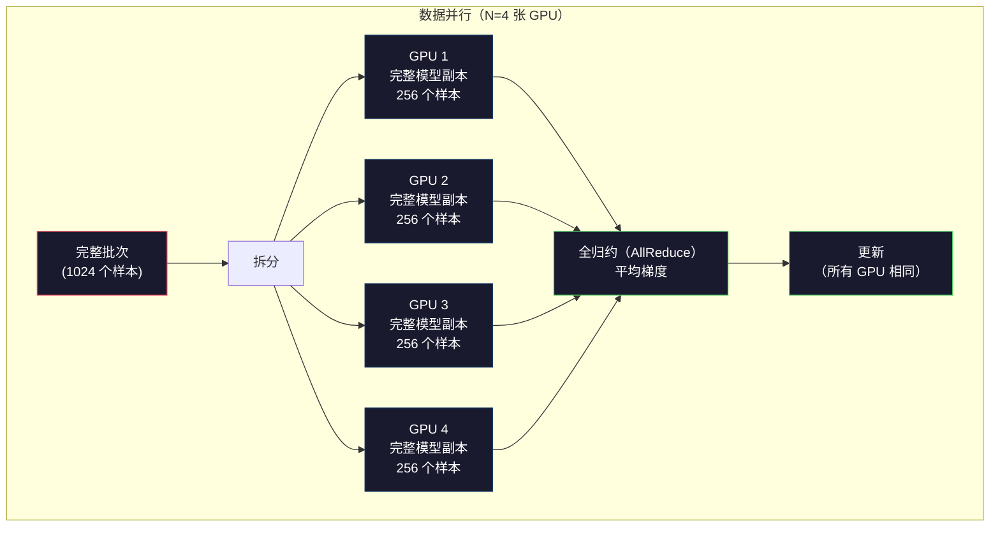
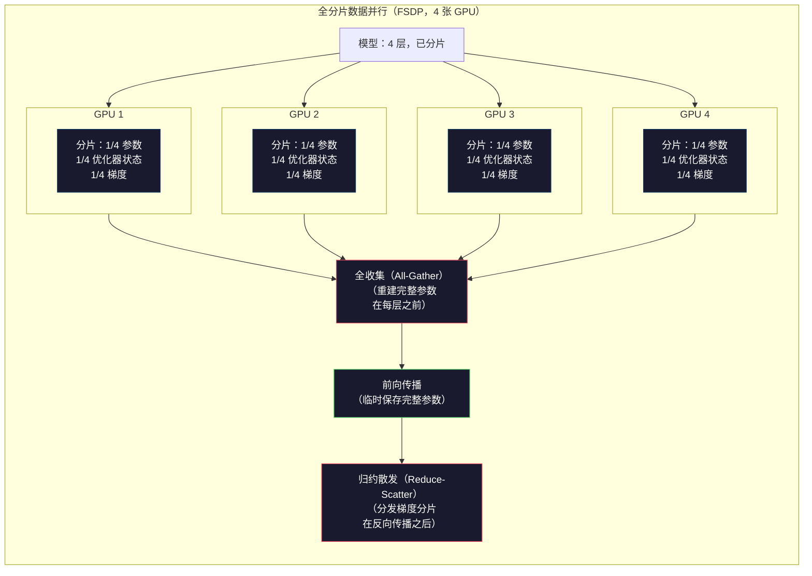
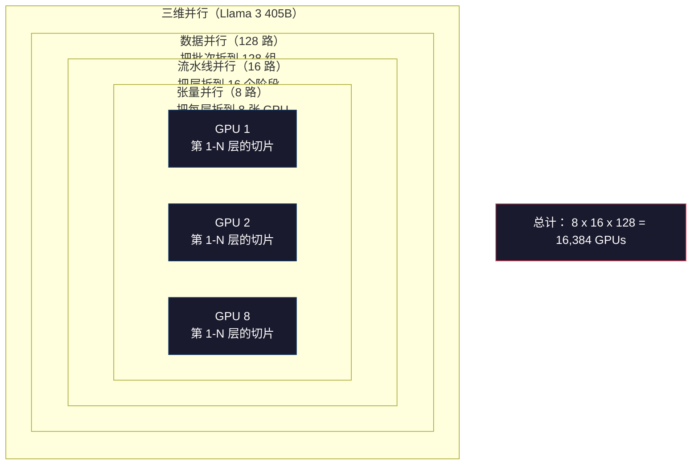

# 扩展规模：分布式训练、FSDP、DeepSpeed（Scaling: Distributed Training, FSDP, DeepSpeed）

> 124M 模型能在单张 GPU 上训练。现在试试 70 亿参数：模型装不进显存，数据在单机上要跑数周。规模扩大后，分布式训练不是可选项，而是唯一的出路。

**Type:** Build
**Languages:** Python
**Prerequisites:** 阶段 10，第 04 课（预训练迷你 GPT）
**Time:** ~120 分钟

## 学习目标（Learning Objectives）

- 解释数据、张量、流水线三类并行，并根据模型与集群规模判断何时需要它们
- 用 PyTorch 分布式数据并行（Distributed Data Parallel，DDP）实现数据并行训练，在多个 GPU 间同步梯度
- 为给定模型规模计算权重、优化器状态、梯度、激活的内存预算，确定最低硬件要求
- 配置全分片数据并行（Fully Sharded Data Parallel，FSDP）或 DeepSpeed 零冗余优化器（Zero Redundancy Optimizer，ZeRO）的阶段，将模型状态分片到多个 GPU，容纳超出单卡显存的模型

## 问题（The Problem）

一个 7B 参数模型使用 16 位浮点数（16-bit Floating Point，FP16），仅权重就需要 14GB。Adam 优化器为每个参数额外保存两份状态，即一阶、二阶矩估计，又需要 28GB。反向传播的梯度再加 14GB。还没存任何激活，就已占用 56GB。

一张 NVIDIA A100 有 80GB 显存。

80GB 已用掉 56GB，只剩 24GB 存激活（Activations），即前向传播计算并必须保留至反向传播的中间值。4096 维模型处理 2048 词元序列时，单层激活约占 64MB。32 层则每个样本需要 2GB。批大小为 8 需要 16GB，而你有 24GB；批大小为 12 就会爆显存。

再试试 70B 参数。FP16 权重就有 140GB，单卡放不下。仅存权重就至少需要 2 张 A100，2 x 80GB = 160GB。加上优化器状态和梯度，需要更多：至少 3 张以上，实际根据分片策略往往需要 8-16 张。

Llama 3 405B 在 16,384 张 NVIDIA H100 上训练，估计计算成本为 1 亿美元。DeepSeek V3 通过架构与训练效率上的设计，以约 560 万美元训练出可比模型；混合专家（Mixture of Experts，MoE）使每个词元只激活部分参数。

本课介绍让大规模训练成为可能的四种策略：数据并行、张量并行、流水线并行和全分片数据并行。在接触分布式训练框架前，你会先用纯 Python 模拟各方案，理解其机制。

## 概念（The Concept）

### 为什么需要分布式（Why Distribution is Required）

以下是真实模型的内存计算，每个数字都由计算得到，而不是估计。

| 模型 | 参数量 | 权重（FP16） | Adam 状态 | 梯度（FP16） | 总计，不含激活 |
|-------|--------|----------------|-------------|------------------|----------------------|
| GPT-2 Small | 124M | 248 MB | 992 MB | 248 MB | 1.5 GB |
| Llama 3 8B | 8B | 16 GB | 64 GB | 16 GB | 96 GB |
| Llama 3 70B | 70B | 140 GB | 560 GB | 140 GB | 840 GB |
| Llama 3 405B | 405B | 810 GB | 3,240 GB | 810 GB | 4,860 GB |

“Adam 状态”这一列才是大头。Adam 为每个参数保存滑动均值 m 和滑动方差 v，均采用 32 位浮点数（32-bit Floating Point，FP32）。70B 模型对应 70B x 4 bytes x 2 = 560GB，仅优化器就需要七张 A100。

单张 H100 有 80GB。Llama 3 405B 至少需要 61 张 H100 才能存下权重、优化器和梯度，加上激活还会更多。Meta 使用 16,384 张 GPU，不是因为想用，而是因为必须用。

### 数据并行（Data Parallelism）

这是最简单的分布式策略。将完整模型复制到 N 张 GPU，每个训练批次等分为 N 份。每张 GPU 在自己的数据分片上执行前向和反向传播，之后对所有 GPU 的梯度求平均。每张 GPU 都用相同的平均梯度更新权重副本，使所有副本保持同步。

**优点：** 吞吐量线性扩展。N 张 GPU 每步处理 N 倍数据，通信仅限于梯度平均，可以与计算重叠。

**缺点：** 每张 GPU 都保存完整模型、优化器状态和梯度。70B 模型每卡需要 840GB。数据并行不降低单卡内存，只缩短训练时间。

**计算：** 有效批大小 = per_gpu_batch_size x N。N=64 张 GPU、单卡批大小 16 时，有效批大小为 1,024。Llama 3 每步有效批大小为 1600 万词元。



### 张量并行（Tensor Parallelism）

把单层拆到多个 GPU。一次矩阵乘法分给多个 GPU，各自计算部分结果。

以前馈层中形状 (8192, 8192) 的权重矩阵为例。采用 4 路张量并行时，每张 GPU 保存 (8192, 2048) 分片，将输入乘以自己的分片得到部分结果，再通过全归约（All-reduce）或全收集（All-gather）合并，形成完整输出。

**优点：** 降低单卡模型权重内存。70B 模型拆到 8 张 GPU，每卡保存约 8.75B 参数的权重。

**缺点：** 每层之后都需要快速 GPU 间通信，每次矩阵乘法后的全归约会增加延迟。同节点 GPU 间 NVLink 带宽为 900 GB/s，适合这种方式；跨节点 InfiniBand 为 400 Gb/s，约 50 GB/s，效果较差。张量并行几乎总是限制在单节点的 8 张 GPU 内。

**实际应用：** Megatron-LM 开创了张量并行。Llama 3 405B 在每个节点内部使用 8 路张量并行。

### 流水线并行（Pipeline Parallelism）

按层拆分模型。GPU 1 运行第 1-8 层，GPU 2 运行第 9-16 层，GPU 3 运行第 17-24 层，GPU 4 运行第 25-32 层。数据沿流水线流动：GPU 1 计算自己的层并把激活发给 GPU 2，GPU 2 计算后发给 GPU 3，依次类推。

**优点：** GPU 间通信很少，只传层边界的激活，相比梯度或权重要小得多。带宽要求低，因此适合跨节点。

**缺点：** 流水线气泡（Pipeline bubble）。GPU 4 计算微批次（Micro-batch）1 的前向传播时，GPU 1、2、3 已完成各自部分，处于空闲；反向传播时顺序反过来。简单流水线有 N 个阶段时，GPU 利用率只有 1/N。

**GPipe 和 PipeDream**通过把批次拆成微批次解决气泡问题。GPU 1 完成微批次 1 的前向后立即开始微批次 2，使各流水线阶段计算重叠。有 M 个微批次、N 个阶段时，气泡比例降至 (N-1)/M。M=16、N=4 时，空闲比例为 3/16 = 18.75%。

### 全分片数据并行（FSDP: Fully Sharded Data Parallel）

FSDP 结合了数据并行的可扩展性与分片的内存效率。每张 GPU 不再保存完整模型，而只保存参数、梯度和优化器状态的 1/N。

每层前向传播前，FSDP 执行**全收集（All-gather）**，从全部 GPU 收集完整参数到每张 GPU 内存中。前向结束后，丢弃非本地参数。反向时再次全收集，重建参数以计算梯度；反向结束后执行**归约散发（Reduce-scatter）**，分发梯度分片，使每卡只存 1/N 梯度。

**70B 模型在 8 张 GPU 上的计算：**

| 组件 | 不使用 FSDP | 使用 FSDP |
|-----------|-------------|-----------|
| 权重（FP16） | 每卡 140 GB | 每卡 17.5 GB |
| Adam 状态（FP32） | 每卡 560 GB | 每卡 70 GB |
| 梯度（FP16） | 每卡 140 GB | 每卡 17.5 GB |
| **总计** | **每卡 840 GB** | **每卡 105 GB** |

不用 FSDP，70B 模型无法放进单张 80GB GPU。8 卡使用 FSDP，每卡 105GB，等等，仍然放不下。至少要 16 张卡才能低于每卡 80GB，或者结合激活检查点（Activation checkpointing），在反向时重算激活而不是保存它们。

因为每层之前要全收集，通信成本高于普通数据并行。但节省的内存让原本无法执行的训练成为可能。



### DeepSpeed ZeRO

DeepSpeed 的 ZeRO，即零冗余优化器（Zero Redundancy Optimizer），概念上与 FSDP 相同，但由 Microsoft 独立开发。它定义了三个阶段，分片程度逐步增加：

| 阶段 | 分片内容 | 内存节省 | 通信 |
|-------|--------|---------------|---------------|
| ZeRO-1 | 仅优化器状态 | 约缩小 4 倍 | 与数据并行相同 |
| ZeRO-2 | 再加梯度 | 约缩小 8 倍 | 稍多 |
| ZeRO-3 | 再加参数 | 约缩小 N 倍，N 张 GPU | 每层全收集 |

ZeRO-3 等价于 FSDP，名称不同，机制相同。DeepSpeed 验证概念后，PyTorch 加入了原生 FSDP 实现。

DeepSpeed 还引入 ZeRO-Offload，将优化器状态卸载（Offload）到更便宜、容量更大的 CPU 内存；以及 ZeRO-Infinity，卸载到 NVMe SSD。这些方式用计算速度换内存容量，卸载操作更慢，但能释放 GPU 内存。

### 混合精度训练（Mixed Precision Training）

现代训练同时使用多种浮点格式：

- **前向传播：** FP16 或脑浮点格式（Brain Float 16，BF16），均为 16 位。内存为 FP32 的一半，张量核心（Tensor core）上的矩阵乘法快 2 倍。
- **主权重（Master weights）：** FP32，32 位。由优化器维护，保证权重更新的数值精度。
- **损失缩放（Loss scaling）：** 反向前将损失乘以大常数，防止 FP16 梯度下溢为零；优化器步骤前再除以同一常数。

BF16 与 FP32 有相同指数范围，均为 8 位指数，但精度降低，尾数只有 7 位，FP32 为 23 位。由于可表示相同数值范围，它很少需要损失缩放。FP16 有 5 位指数、10 位尾数，能表示更细的数值，但在极端量级会溢出或下溢。

Google 的张量处理器（Tensor Processing Unit，TPU）原生使用 BF16。NVIDIA A100、H100 同时支持 FP16 和 BF16。行业大多已转向 BF16，因为它省去了损失缩放的麻烦。

**7B 模型的内存比较：**

| 精度 | 权重 | 优化器 | 梯度 | 总计 |
|-----------|---------|-----------|-----------|-------|
| 全部 FP32 | 28 GB | 56 GB | 28 GB | 112 GB |
| 混合精度，BF16 + FP32 主权重 | 14 GB | 56 GB | 14 GB | 84 GB |

混合精度为这个模型节省 28GB。不论如何，优化器状态仍是 FP32，它占据大部分内存。

### Megatron-LM 与三维并行（Megatron-LM and 3D Parallelism）

真正的大规模训练会结合三类并行：

- 在节点组之间使用**数据并行**，扩展批大小
- 在节点内使用**张量并行**，把层拆到 8 张 GPU
- 在节点间使用**流水线并行**，把层组拆到不同机器

Llama 3 405B 在 16,384 张 H100 上的配置：
- 节点内 8 路张量并行，每节点 8 张 GPU
- 节点间 16 路流水线并行，16 个流水线阶段
- 剩余维度上 128 路数据并行，16,384 / 8 / 16 = 128

这种三维分解，8 x 16 x 128 = 16,384，使训练可扩展到数千张 GPU。每张 GPU 看到不同数据分片，这是数据并行；保存每层的一个切片，这是张量并行；计算不同的层集合，这是流水线并行。

DeepSeek V3 采用不同方法。其混合专家架构每个词元只激活 671B 参数中的 37B。因此每张 GPU 只需计算活跃参数，并保存相应激活。它们用 2,048 张 H800 训练，不到 Meta GPU 数的 1/8，成本为 $5.6M，Meta 则估计为 $100M。



```figure
paged-kv-cache
```

## 动手实现（Build It）

### 步骤 1：模拟数据并行（Step 1: Simulate Data Parallelism）

把批次拆到模拟 GPU。每卡在自己的分片上执行前向传播，再平均“梯度”，这里用损失值模拟。

```python
import numpy as np

def simulate_data_parallelism(data, num_gpus, model_fn):
    batch_size = len(data)
    shard_size = batch_size // num_gpus
    remainder = batch_size % num_gpus

    gpu_losses = []
    gpu_gradients = []

    offset = 0
    for gpu_id in range(num_gpus):
        extra = 1 if gpu_id < remainder else 0
        shard = data[offset:offset + shard_size + extra]
        offset += shard_size + extra

        loss, grad = model_fn(shard)
        gpu_losses.append(loss)
        gpu_gradients.append(grad)

    avg_loss = np.mean(gpu_losses)
    avg_gradient = np.mean(gpu_gradients, axis=0)

    return avg_loss, avg_gradient
```

全归约，即梯度平均，是数据并行唯一的通信。实际在 NVIDIA GPU 上使用 NVIDIA 集合通信库（NVIDIA Collective Communications Library，NCCL）实现环形全归约（Ring all-reduce）：每卡向邻居发送 1/N 梯度，从另一邻居接收 1/N，经过 N-1 步，每卡得到完整平均值。总通信量为 2 x gradient_size x (N-1)/N，N 很大时接近梯度大小的 2 倍。

### 步骤 2：模拟张量并行（Step 2: Simulate Tensor Parallelism）

把权重矩阵拆到多个 GPU，各卡执行部分矩阵乘法，再合并结果。

```python
def simulate_tensor_parallelism(input_data, weight_matrix, num_gpus):
    d_in, d_out = weight_matrix.shape
    assert d_out % num_gpus == 0, f"d_out {d_out} not divisible by num_gpus {num_gpus}"
    shard_size = d_out // num_gpus

    partial_results = []
    for gpu_id in range(num_gpus):
        start = gpu_id * shard_size
        end = start + shard_size
        weight_shard = weight_matrix[:, start:end]

        partial = input_data @ weight_shard
        partial_results.append(partial)

    full_output = np.concatenate(partial_results, axis=-1)

    direct_output = input_data @ weight_matrix
    error = np.abs(full_output - direct_output).max()

    return full_output, error
```

误差应恰好为零，或在机器精度（Machine epsilon）范围内。张量并行在数学上是精确的，结果与单卡完整矩阵乘法相同。沿输出维度拆分后，每卡产生不同列块，拼接即可重建完整结果。

列并行（Column-parallel）线性层拆分输出维度，合并时拼接；行并行（Row-parallel）拆分输入维度，合并时求和。Transformer 前馈网络的第一个升维线性层用列并行，第二个降维层用行并行，从而避免两层之间的全归约。

### 步骤 3：模拟流水线并行（Step 3: Simulate Pipeline Parallelism）

把模型层拆到虚拟 GPU，展示后续阶段计算时前面阶段空闲的气泡问题。

```python
def simulate_pipeline_parallelism(num_layers, num_stages, num_microbatches):
    layers_per_stage = num_layers // num_stages

    timeline = {}
    clock = 0

    for mb in range(num_microbatches):
        for stage in range(num_stages):
            start_time = max(
                timeline.get((stage, mb - 1, "fwd"), (0, 0))[1] if mb > 0 else 0,
                timeline.get((stage - 1, mb, "fwd"), (0, 0))[1] if stage > 0 else 0,
            )
            end_time = start_time + layers_per_stage
            timeline[(stage, mb, "fwd")] = (start_time, end_time)

    last_fwd_end = max(v[1] for v in timeline.values())

    for mb in range(num_microbatches - 1, -1, -1):
        for stage in range(num_stages - 1, -1, -1):
            deps = [last_fwd_end]
            if mb < num_microbatches - 1 and (stage, mb + 1, "bwd") in timeline:
                deps.append(timeline[(stage, mb + 1, "bwd")][1])
            if stage < num_stages - 1 and (stage + 1, mb, "bwd") in timeline:
                deps.append(timeline[(stage + 1, mb, "bwd")][1])
            start_time = max(deps)
            end_time = start_time + layers_per_stage
            timeline[(stage, mb, "bwd")] = (start_time, end_time)

    total_time = max(v[1] for v in timeline.values())
    compute_time = num_microbatches * num_stages * layers_per_stage * 2
    bubble_fraction = 1.0 - compute_time / (total_time * num_stages)

    return timeline, total_time, bubble_fraction
```

4 个阶段、1 个微批次时，气泡比例为 75%，任意时刻四张卡中有三张空闲。16 个微批次时降到约 19%。消除气泡的代价是内存：必须同时保存所有在途微批次的激活。

### 步骤 4：内存计算器（Step 4: Memory Calculator）

精确计算训练任意规模模型的内存需求。

```python
def memory_calculator(
    params_billions,
    precision_bytes=2,
    optimizer="adam",
    num_gpus=1,
    sharding="none",
    sequence_length=2048,
    batch_size_per_gpu=1,
    hidden_dim=None,
    num_layers=None,
):
    params = params_billions * 1e9

    weight_memory = params * precision_bytes

    if optimizer == "adam":
        optimizer_memory = params * 4 * 2
    elif optimizer == "sgd":
        optimizer_memory = params * 4
    else:
        optimizer_memory = 0

    gradient_memory = params * precision_bytes

    total_no_activation = weight_memory + optimizer_memory + gradient_memory

    if hidden_dim and num_layers:
        activation_per_layer = (
            sequence_length * batch_size_per_gpu * hidden_dim * precision_bytes * 4
        )
        activation_memory = activation_per_layer * num_layers
    else:
        activation_memory = params * precision_bytes * 0.5

    if sharding == "fsdp" or sharding == "zero3":
        weight_memory /= num_gpus
        optimizer_memory /= num_gpus
        gradient_memory /= num_gpus
    elif sharding == "zero2":
        optimizer_memory /= num_gpus
        gradient_memory /= num_gpus
    elif sharding == "zero1":
        optimizer_memory /= num_gpus

    per_gpu_total = weight_memory + optimizer_memory + gradient_memory + activation_memory

    return {
        "params_billions": params_billions,
        "weights_gb": weight_memory / 1e9,
        "optimizer_gb": optimizer_memory / 1e9,
        "gradients_gb": gradient_memory / 1e9,
        "activations_gb": activation_memory / 1e9,
        "per_gpu_total_gb": per_gpu_total / 1e9,
        "total_across_gpus_gb": per_gpu_total * num_gpus / 1e9,
        "fits_on_80gb": per_gpu_total / 1e9 <= 80,
        "num_gpus": num_gpus,
        "sharding": sharding,
    }
```

这个计算器回答所有机器学习（Machine Learning，ML）工程师都会问的问题：“我需要多少张 GPU？”输入模型规模，看是否放得下。调整分片策略，直到单卡总内存低于 80GB。

### 步骤 5：混合精度模拟（Step 5: Mixed Precision Simulation）

比较 FP32、FP16 和混合精度训练的内存占用。

```python
def mixed_precision_comparison(params_billions):
    params = params_billions * 1e9

    fp32_weights = params * 4
    fp32_optimizer = params * 4 * 2
    fp32_gradients = params * 4
    fp32_total = fp32_weights + fp32_optimizer + fp32_gradients

    fp16_weights = params * 2
    fp16_master = params * 4
    fp16_optimizer = params * 4 * 2
    fp16_gradients = params * 2
    fp16_total = fp16_weights + fp16_master + fp16_optimizer + fp16_gradients

    mixed_weights = params * 2
    mixed_optimizer = params * 4 * 2
    mixed_gradients = params * 2
    mixed_total = mixed_weights + mixed_optimizer + mixed_gradients

    return {
        "fp32_total_gb": fp32_total / 1e9,
        "fp16_with_master_gb": fp16_total / 1e9,
        "mixed_bf16_gb": mixed_total / 1e9,
        "savings_vs_fp32": 1 - mixed_total / fp32_total,
    }
```

多数人最意外的是：混合精度不会让内存减半。不论计算精度如何，Adam 的 m、v 优化器状态始终采用 FP32。7B 模型用 FP32 训练占 112GB，混合精度占 84GB，减少 25%，不是 50%，因为优化器占大头。

## 实际应用（Use It）

### 运行全部模拟（Run All Simulations）

```python
def run_all_demos():
    print("=" * 70)
    print("DATA PARALLELISM SIMULATION")
    print("=" * 70)

    np.random.seed(42)
    data = np.random.randn(64, 32)
    weight = np.random.randn(32, 16)

    def model_fn(batch):
        output = batch @ weight
        loss = np.mean(output ** 2)
        grad = 2 * batch.T @ (batch @ weight) / len(batch)
        return loss, grad

    for n_gpus in [1, 2, 4, 8]:
        loss, grad = simulate_data_parallelism(data, n_gpus, model_fn)
        print(f"  {n_gpus} GPUs: loss={loss:.4f}, grad_norm={np.linalg.norm(grad):.4f}")

    print()
    print("=" * 70)
    print("TENSOR PARALLELISM SIMULATION")
    print("=" * 70)

    x = np.random.randn(4, 8192)
    W = np.random.randn(8192, 8192)

    for n_gpus in [1, 2, 4, 8]:
        output, error = simulate_tensor_parallelism(x, W, n_gpus)
        print(f"  {n_gpus} GPUs: output_shape={output.shape}, max_error={error:.2e}")

    print()
    print("=" * 70)
    print("PIPELINE PARALLELISM SIMULATION")
    print("=" * 70)

    for n_mb in [1, 4, 8, 16, 32]:
        _, total_t, bubble = simulate_pipeline_parallelism(32, 4, n_mb)
        print(f"  {n_mb:2d} micro-batches: total_time={total_t:4d}, bubble={bubble:.1%}")

    print()
    print("=" * 70)
    print("MEMORY CALCULATOR")
    print("=" * 70)

    configs = [
        (7, "none", 1),
        (7, "fsdp", 8),
        (70, "none", 1),
        (70, "fsdp", 8),
        (70, "fsdp", 16),
        (405, "fsdp", 64),
        (405, "fsdp", 128),
    ]

    print(f"  {'Model':>8} {'Sharding':>8} {'GPUs':>5} {'Per-GPU':>10} {'Fits 80GB':>10}")
    print("  " + "-" * 50)
    for params, shard, gpus in configs:
        result = memory_calculator(params, num_gpus=gpus, sharding=shard)
        fits = "Yes" if result["fits_on_80gb"] else "No"
        print(f"  {params:>6}B {shard:>8} {gpus:>5} {result['per_gpu_total_gb']:>8.1f}GB {fits:>10}")

    print()
    print("=" * 70)
    print("MIXED PRECISION COMPARISON")
    print("=" * 70)

    for params_b in [7, 13, 70, 405]:
        result = mixed_precision_comparison(params_b)
        print(f"  {params_b}B: FP32={result['fp32_total_gb']:.0f}GB, "
              f"Mixed BF16={result['mixed_bf16_gb']:.0f}GB, "
              f"Savings={result['savings_vs_fp32']:.0%}")
```

## 交付成果（Ship It）

本课产出 `outputs/prompt-distributed-training-planner.md`。输入模型规模和可用硬件，这份提示词（Prompt）会给出完整分布式训练计划：并行策略、内存预算、通信开销和预期吞吐量。

## 练习（Exercises）

1. 修改内存计算器，加入激活检查点。启用后，仅每第 K 层保存激活，典型 K=1，表示全部重算。展示内存与计算的权衡：节省多少内存，训练慢多少？完整检查点大约增加 33% 计算。

2. 扩展流水线并行模拟，实现 PipeDream 使用的一前向一反向（One Forward, One Backward，1F1B）调度。对 4 阶段、8 微批次，与简单调度比较气泡比例。1F1B 更早开始反向传播，因此峰值内存应更小。

3. 实现梯度累积（Gradient accumulation）模拟器。不在每个微批次后全归约，而是本地累积 K 步再全归约。展示如何将通信减少 K 倍，同时得到相同最终梯度，因此训练也相同。

4. 构建成本估算器。给定模型规模、目标词元数、GPU 类型，A100 为 $2/hr，H100 为 $3.50/hr，以及并行策略，估算训练总美元成本。用已知成本核对：据报道 Llama 3 405B 约 $100M，DeepSeek V3 约 $5.6M。

5. 为内存计算器加入 ZeRO-Offload。假设每节点 CPU 内存 512GB、NVMe 2TB。展示将优化器状态卸载到 CPU 后，如何让 70B 模型从 16 卡降到 4 卡训练，代价是优化器步骤慢 30-50%。

## 关键术语（Key Terms）

| 术语 | 常见说法 | 实际含义 |
|------|----------------|----------------------|
| 数据并行（Data parallelism） | “每卡复制模型” | 每卡处理不同数据分片，每步后通过全归约平均梯度 |
| 张量并行（Tensor parallelism） | “把一层拆到多个 GPU” | 划分权重矩阵，每卡计算部分矩阵乘法，需要快速 NVLink 互连 |
| 流水线并行（Pipeline parallelism） | “把层拆到多个 GPU” | 每卡运行不同层组，数据通过微批次流经流水线，减少气泡 |
| 全分片数据并行（Fully Sharded Data Parallel，FSDP） | “全部分片” | 每卡保存权重、梯度、优化器状态的 1/N，计算前全收集 |
| 零冗余优化器（Zero Redundancy Optimizer，ZeRO） | “DeepSpeed 版 FSDP” | 三个阶段依次分片优化器状态、再加梯度、再加参数 |
| 全归约（All-reduce） | “跨 GPU 求平均” | 集合操作，每卡最终得到所有 GPU 输入之和或平均值，通常采用环形全归约 |
| 全收集（All-gather） | “从所有 GPU 收集” | 集合操作，每卡最终得到全部 GPU 数据的拼接，FSDP 用它重建完整参数 |
| 归约散发（Reduce-scatter） | “求和并分发” | 先归约求和，再把不同块散发到不同 GPU，FSDP 用它分片梯度 |
| 混合精度（Mixed precision） | “半精度训练” | 前向、反向采用 FP16/BF16，优化器状态采用 FP32；节省约 25% 而非 50% 内存，因为优化器占主导 |
| 流水线气泡（Pipeline bubble） | “流水线空闲时间” | GPU 等待前一阶段数据的空闲时间占比，可用更多微批次降低 |

## 延伸阅读（Further Reading）

- [Rajbhandari 等，2020：《ZeRO：面向万亿参数模型训练的内存优化》](https://arxiv.org/abs/1910.02054) -- 定义三个分片阶段的 DeepSpeed ZeRO 论文
- [Shoeybi 等，2020：《Megatron-LM：利用模型并行训练数十亿参数语言模型》](https://arxiv.org/abs/1909.08053) -- NVIDIA 面向 Transformer 的张量并行
- [Narayanan 等，2021：《使用 Megatron-LM 在 GPU 集群上高效训练大规模语言模型》](https://arxiv.org/abs/2104.04473) -- 结合数据、张量、流水线的三维并行
- [Zhao 等，2023：《PyTorch FSDP：扩展全分片数据并行的经验》](https://arxiv.org/abs/2304.11277) -- PyTorch 原生 FSDP 实现
- [Llama 3 技术报告](https://arxiv.org/abs/2407.21783) -- 16,384 张 GPU 训练和三维并行细节
- [DeepSeek-V3 技术报告](https://arxiv.org/abs/2412.19437) -- 混合专家架构如何将训练成本降低一个数量级
