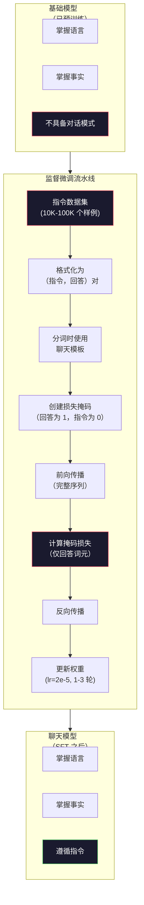

# 指令微调（Instruction Tuning，SFT）

> 基础模型只会预测下一个词元，仅此而已。它不会遵循指令、回答问题或拒绝有害请求。监督微调（Supervised Fine-Tuning，SFT）把词元预测器变成有用的助手。你交谈过的 Claude、GPT、Llama Chat 等模型都经历过这一步。

**Type:** Build
**Languages:** Python (with numpy)
**Prerequisites:** 阶段 10，第 04 课（预训练迷你 GPT）
**Time:** ~90 分钟

## 学习目标（Learning Objectives）

- 实现监督微调（SFT），把基础语言模型变成遵循指令的助手
- 使用带系统、用户、助手角色的聊天模板格式化训练数据，并屏蔽非助手词元上的损失
- 解释为什么需要 SFT：基础模型只续写文本，不回答问题
- 在留出的指令集上比较基础模型与微调模型的回答，评估 SFT 质量

## 问题（The Problem）

第 04 课训练的模型能根据序列预测下一个词元。输入 "The transformer architecture"，它可能续写 "has revolutionized natural language processing."。作为下一词元预测器，这已经不错。

现在输入 "What is the capital of France?"。基础模型不会回答 "Paris."，而是继续这个模式。它可能输出 "What is the capital of Germany? What is the capital of Spain?"，因为它从包含问题列表的文档中学习过；也可能输出 "is a question that many people ask"，因为这是合理的下一词元续写。模型没有*回答*的概念，只懂*续写*。

这就是 2020 年 6 月发布的基础模型 GPT-3，与 2022 年 11 月发布、经过指令微调的 ChatGPT 之间的差别。架构相同，预训练相同；区别是 20,000 到 100,000 对精心编写的指令与回答样例，教模型遵循对话模式。

Stanford Alpaca 证明不需要数百万样例。2023 年 3 月，他们仅用 GPT-3.5 生成的 52,000 对指令与回答微调 Llama 7B，总成本 $600。得到的聊天机器人能遵循指令、回答问题、进行对话。虽不如 ChatGPT，但只花 $600 和几小时训练就如此接近，令人意外。

Meta 的 Llama 2 Chat 初始 SFT 阶段仅使用约 27,000 个高质量样例。关键在于质量胜过数量：熟练标注员写的 27,000 个样例，优于从互联网抓取的 100 万个带噪样例。

## 概念（The Concept）

### SFT 实际做了什么（What SFT Actually Does）

监督微调延续预训练的同一训练循环：前向传播、计算损失、反向传播、更新权重，但改用不同类型的数据。不再训练原始文本，而是训练结构化对话：

```json
{
  "system": "You are a helpful assistant.",
  "user": "What is the capital of France?",
  "assistant": "The capital of France is Paris."
}
```

模型已经知道巴黎是法国首都，这是在 Wikipedia、教科书和网页预训练中学到的。SFT 不教新事实，而教新的*行为*：看到问题就回答，看到指令就完成，看到有害请求就拒绝。

可以这样理解：预训练给模型知识，SFT 教模型如何得体回应。

### 数据格式（Data Formats）

行业主要使用三种格式。它们用不同分隔符编码相同信息：谁说了什么。

**Alpaca 格式（Alpaca Format）**，Stanford，2023 年 3 月：

```json
{
  "instruction": "Summarize the following article in 3 sentences.",
  "input": "The European Central Bank raised interest rates...",
  "output": "The ECB increased rates by 25 basis points..."
}
```

这种格式简单且广泛使用。`input` 字段可选，许多指令无需额外上下文。Stanford 发布了此格式的 52,000 个样例，由 GPT-3.5 生成，成本 $600，开启了开源指令微调的浪潮。

**ShareGPT 格式（ShareGPT Format）**，社区，2023 年：

```json
{
  "conversations": [
    {"from": "system", "value": "You are a helpful assistant."},
    {"from": "human", "value": "What causes tides?"},
    {"from": "gpt", "value": "Tides are caused by the gravitational pull of the Moon..."},
    {"from": "human", "value": "How often do they occur?"},
    {"from": "gpt", "value": "Most coastal areas experience two high tides and two low tides per day..."}
  ]
}
```

支持多轮对话（Multi-turn conversation）。按惯例，"from" 字段使用 "human" 和 "gpt"，与实际模型无关。Vicuna 在 70,000 段 ShareGPT 对话上训练，这些对话来自用户分享的 ChatGPT 记录。

**ChatML 格式（ChatML Format）**，OpenAI，多种开源模型采用：

```
<|im_start|>system
You are a helpful assistant.<|im_end|>
<|im_start|>user
What is the capital of France?<|im_end|>
<|im_start|>assistant
The capital of France is Paris.<|im_end|>
```

使用特殊词元（Special tokens）`<|im_start|>`、`<|im_end|>` 分隔角色。微调时将这些词元加入分词器词表。Qwen、Yi 等许多模型使用 ChatML。

三种格式都在做同一件事：告诉模型“这是指令，这是回答，学习这种模式”。

### 为什么有效（Why It Works）

模型已通过预训练掌握语言，看过数十亿个问题后接答案、指令后接完成内容、人与人对话的样例。这些模式已经编码在权重中。

SFT 将潜在能力集中起来。模型不必再从上下文猜测该回答问题还是续写文档，而是明确训练对话模式。几千个样例之后，模型便学会：看到助手角色标记，就生成有帮助的回答。

所以 27,000 个样例就够了。你不是在教英语，也不是在教世界知识，只是在教一种简单行为：回应指令。知识原本就已存在。

### 掩码损失（The Masked Loss）

这是 SFT 最重要的技术细节，但多数教程会跳过。

预训练在每个词元上计算损失，让模型预测序列中每个下一词元。SFT 只在*回答*词元上计算损失。指令词元提供上下文，但模型“预测”它们不正确时不会受罚。

为什么？因为你不希望模型学习*生成*指令，而是学习*回应*指令。若在指令词元上计算损失，就相当于训练模型预测 "What is the capital of France?"，仿佛它才是提问者。这会浪费梯度信号，也可能让模型混淆自身角色。

实际实现中创建损失掩码（Loss mask）：回答词元为 1，指令词元为 0。先将逐词元损失乘以掩码，再取平均。

```
词元：    [SYS] You are helpful [USER] What is the capital? [ASST] Paris is the capital [EOS]
损失掩码：   0    0    0     0      0     0   0  0     0       1     1    1   1     1      1
```

只有 `[ASST]` 后的词元贡献损失。前向传播时模型看到完整对话，因为它需要指令才能生成正确回答；但权重更新只依据回答预测得有多好。

### 训练超参数（Training Hyperparameters）

SFT 的超参数（Hyperparameters）与预训练差别很大。不是从零训练，而是在调整已经能工作的模型。

| 参数 | 预训练（Llama 2 7B） | SFT（Llama 2 Chat） |
|-----------|---------------------------|---------------------|
| 学习率 | 3e-4，峰值 | 2e-5 |
| 训练轮数（Epochs） | 1，数据遍历一次 | 2 |
| 批大小 | 4M 词元 | 64 个样例 |
| 预热步数 | 2,000 | 0-100 |
| 权重衰减 | 0.1 | 0.0-0.1 |
| 数据规模 | 2T 词元 | 27,000 个样例 |

SFT 学习率低 15 倍，这很重要。微调时学习率过高会破坏预训练知识，模型“忘记”所学内容，并过拟合小型微调数据集。这就是灾难性遗忘（Catastrophic forgetting）。

两轮意味着每个训练样例看两次。小数据集上超过 3 轮会导致记忆，模型开始逐字复现训练样例，而不是泛化。

### 灾难性遗忘（Catastrophic Forgetting）

微调可能破坏通用能力。在指令遵循数据上训练太久，模型会失去写代码、做数学、创作文本的能力。它会非常擅长训练数据的特定格式，却不擅长其他事情。

三种缓解措施：

1. **低学习率。** 1e-5 到 5e-5。更新越小，对预训练特征破坏越少。

2. **短训练。** 1-3 轮。在过拟合前停止。

3. **混入预训练数据。** Llama 2 Chat 将少量原始预训练数据，约 2-5%，混入 SFT 数据集，让模型学习指令遵循新行为时，也“记得”通用能力。

### 实际数字（Real Numbers）

在单张 NVIDIA A100 80GB 上，用 10,000 对高质量指令样例微调 7B 模型，大约需要 1 小时。计算如下：

- 10,000 个样例 x 平均 512 词元 = 5.12M 词元
- 2 轮 = 总计 10.24M 词元
- A100 微调 7B 模型的吞吐量：每秒约 3,000 词元
- 10.24M / 3,000 = ~3,400 seconds = ~57 minutes，即约 57 分钟

对我们的 4 层、128 维迷你 GPT，训练几乎瞬间完成。重点是理解机制，而不是规模。



```figure
loss-masking
```

## 动手实现（Build It）

### 步骤 1：指令数据集（Step 1: Instruction Dataset）

创建合成指令数据集。生产中，Scale AI、Anthropic 等公司雇用人工标注员编写这些内容。这里以程序方式构造，演示格式。

```python
import numpy as np

INSTRUCTION_DATA = [
    {
        "instruction": "What is the capital of France?",
        "response": "The capital of France is Paris."
    },
    {
        "instruction": "Explain gravity in one sentence.",
        "response": "Gravity is the force that attracts objects with mass toward each other."
    },
    {
        "instruction": "Write a haiku about the ocean.",
        "response": "Waves crash on the shore, salt and foam beneath the sun, endless blue expanse."
    },
    {
        "instruction": "What is 15 multiplied by 7?",
        "response": "15 multiplied by 7 is 105."
    },
    {
        "instruction": "Name three programming languages.",
        "response": "Three programming languages are Python, Rust, and TypeScript."
    },
    {
        "instruction": "Summarize photosynthesis.",
        "response": "Photosynthesis converts sunlight, water, and carbon dioxide into glucose and oxygen."
    },
    {
        "instruction": "What year did World War II end?",
        "response": "World War II ended in 1945."
    },
    {
        "instruction": "Define machine learning.",
        "response": "Machine learning is a field where algorithms learn patterns from data to make predictions."
    },
]
```

8 个样例很少，Stanford Alpaca 使用 52,000 个。但不论 8 个还是 52,000 个，机制一样：分词、掩码、仅计算回答损失。

### 步骤 2：使用聊天模板分词（Step 2: Tokenize with Chat Template）

将指令与回答对转换为带特殊角色标记的词元序列。标记告诉模型指令在哪里结束、回答在哪里开始。

```python
SPECIAL_TOKENS = {
    "INST_START": 253,
    "INST_END": 254,
    "RESP_START": 255,
}


def tokenize_instruction_pair(instruction, response, vocab_size=256):
    inst_tokens = list(instruction.encode("utf-8"))
    resp_tokens = list(response.encode("utf-8"))

    inst_tokens = [min(t, vocab_size - 4) for t in inst_tokens]
    resp_tokens = [min(t, vocab_size - 4) for t in resp_tokens]

    tokens = (
        [SPECIAL_TOKENS["INST_START"]]
        + inst_tokens
        + [SPECIAL_TOKENS["INST_END"]]
        + [SPECIAL_TOKENS["RESP_START"]]
        + resp_tokens
    )

    return tokens


def create_loss_mask(tokens):
    mask = np.zeros(len(tokens), dtype=np.float32)
    in_response = False

    for i, token in enumerate(tokens):
        if token == SPECIAL_TOKENS["RESP_START"]:
            in_response = True
            continue
        if in_response:
            mask[i] = 1.0

    return mask
```

指令词元的损失掩码全为 0，回答词元全为 1。`RESP_START` 本身为 0，因为它是分隔符，不属于回答内容。

### 步骤 3：掩码交叉熵损失（Step 3: Masked Cross-Entropy Loss）

标准交叉熵乘以损失掩码，只有回答词元贡献梯度。

```python
def masked_cross_entropy_loss(logits, targets, loss_mask):
    batch, seq_len, vocab_size = logits.shape
    logits_flat = logits.reshape(-1, vocab_size)
    targets_flat = targets.reshape(-1)
    mask_flat = loss_mask.reshape(-1)

    max_logits = logits_flat.max(axis=-1, keepdims=True)
    log_softmax = logits_flat - max_logits - np.log(
        np.exp(logits_flat - max_logits).sum(axis=-1, keepdims=True)
    )

    per_token_loss = -log_softmax[np.arange(len(targets_flat)), targets_flat]

    masked_loss = per_token_loss * mask_flat
    num_response_tokens = mask_flat.sum()
    if num_response_tokens == 0:
        return 0.0
    loss = masked_loss.sum() / num_response_tokens

    return loss
```

分母是 `num_response_tokens`，不是 `seq_len`。若除以总序列长度，长指令会稀释梯度信号。除以回答词元数，能保证每个回答词元权重相同，不受指令长度影响。

### 步骤 4：SFT 训练循环（Step 4: SFT Training Loop）

复用第 04 课的 MiniGPT。训练循环与预训练几乎相同，只增加指令格式化和掩码损失。

```python
import sys
import os
sys.path.insert(0, os.path.join(os.path.dirname(__file__), "..", "..", "04-pre-training-mini-gpt", "code"))
from main import MiniGPT, LayerNorm, FeedForward, MultiHeadAttention, TransformerBlock, Embedding


def sft_train(model, dataset, num_epochs=2, lr=2e-5, seq_len=64):
    formatted_data = []
    for example in dataset:
        tokens = tokenize_instruction_pair(example["instruction"], example["response"])
        mask = create_loss_mask(tokens)
        formatted_data.append((tokens, mask))

    print(f"SFT Training: {len(formatted_data)} examples, {num_epochs} epochs, lr={lr}")
    print(f"Total tokens: {sum(len(t) for t, _ in formatted_data):,}")
    print()

    losses = []

    for epoch in range(num_epochs):
        epoch_loss = 0.0
        num_batches = 0

        indices = np.random.permutation(len(formatted_data))

        for idx in indices:
            tokens, mask = formatted_data[idx]

            if len(tokens) < 3:
                continue
            if len(tokens) > seq_len:
                tokens = tokens[:seq_len]
                mask = mask[:seq_len]

            input_ids = np.array(tokens[:-1]).reshape(1, -1)
            target_ids = np.array(tokens[1:]).reshape(1, -1)
            loss_mask = np.array(mask[1:]).reshape(1, -1)

            logits = model.forward(input_ids)
            loss = masked_cross_entropy_loss(logits, target_ids, loss_mask)

            batch_size, s_len, v_size = logits.shape
            probs = np.exp(logits - logits.max(axis=-1, keepdims=True))
            probs = probs / probs.sum(axis=-1, keepdims=True)
            dlogits = probs.copy()
            dlogits[np.arange(batch_size)[:, None], np.arange(s_len), target_ids] -= 1.0

            mask_expanded = loss_mask[:, :, np.newaxis]
            num_resp = loss_mask.sum()
            if num_resp > 0:
                dlogits = dlogits * mask_expanded / num_resp

            for block in model.blocks:
                block.ffn.W1 -= lr * np.random.randn(*block.ffn.W1.shape) * 0.01
                block.ffn.W2 -= lr * np.random.randn(*block.ffn.W2.shape) * 0.01
                block.ffn.b1 -= lr * np.random.randn(*block.ffn.b1.shape) * 0.01
                block.ffn.b2 -= lr * np.random.randn(*block.ffn.b2.shape) * 0.01

            epoch_loss += loss
            num_batches += 1
            losses.append(loss)

        avg_loss = epoch_loss / max(num_batches, 1)
        print(f"Epoch {epoch + 1}/{num_epochs} | Avg Loss: {avg_loss:.4f}")

    return model, losses
```

学习率为 2e-5，与 Llama 2 Chat 相同，比预训练的 3e-4 小 15 倍。梯度有掩码：指令词元梯度为零，只有回答词元推动权重更新。

### 步骤 5：比较基础模型与 SFT 模型（Step 5: Compare Base vs SFT Model）

SFT 的核心是行为变化。比较模型对指令格式输入的回答与对原始文本的续写，来衡量这种变化。

```python
def generate_response(model, prompt_tokens, max_new_tokens=50, temperature=0.8):
    tokens = list(prompt_tokens)
    seq_len = model.embedding.pos_embed.shape[0]

    for _ in range(max_new_tokens):
        context = np.array(tokens[-seq_len:]).reshape(1, -1)
        logits = model.forward(context)
        next_logits = logits[0, -1, :]

        next_logits = next_logits / max(temperature, 1e-8)
        probs = np.exp(next_logits - next_logits.max())
        probs = probs / probs.sum()
        probs = np.clip(probs, 1e-10, 1.0)
        probs = probs / probs.sum()

        next_token = np.random.choice(len(probs), p=probs)
        tokens.append(int(next_token))

    return tokens


def evaluate_instruction_following(model, instructions):
    print("Evaluating instruction following:")
    print("-" * 50)

    for instruction in instructions:
        tokens = (
            [SPECIAL_TOKENS["INST_START"]]
            + [min(t, 252) for t in list(instruction.encode("utf-8"))]
            + [SPECIAL_TOKENS["INST_END"]]
            + [SPECIAL_TOKENS["RESP_START"]]
        )

        output = generate_response(model, tokens, max_new_tokens=30, temperature=0.6)
        response_start = len(tokens)
        response_tokens = output[response_start:]
        response_bytes = bytes([t for t in response_tokens if t < 128])
        response_text = response_bytes.decode("utf-8", errors="replace")

        print(f"  Q: {instruction}")
        print(f"  A: {response_text[:80]}")
        print()
```

只有 8 个样例的微型模型，回答不会有意义，这在预期内。重要的是*结构*：模型学会在回答标记之后输出，而不是继续生成更多指令。

### 步骤 6：衡量灾难性遗忘（Step 6: Measure Catastrophic Forgetting）

比较 SFT 前后模型的下一词元预测能力。如果 SFT 损害通用能力，原始文本上的损失就会上升。

```python
def measure_forgetting(model, test_text, seq_len=64):
    tokens = np.array(list(test_text.encode("utf-8")[:512]))

    total_loss = 0.0
    num_windows = 0

    for start in range(0, len(tokens) - seq_len - 1, seq_len):
        input_ids = tokens[start:start + seq_len].reshape(1, -1)
        target_ids = tokens[start + 1:start + seq_len + 1].reshape(1, -1)

        logits = model.forward(input_ids)

        batch, s_len, vocab_size = logits.shape
        logits_flat = logits.reshape(-1, vocab_size)
        targets_flat = target_ids.reshape(-1)

        max_logits = logits_flat.max(axis=-1, keepdims=True)
        log_softmax = logits_flat - max_logits - np.log(
            np.exp(logits_flat - max_logits).sum(axis=-1, keepdims=True)
        )

        loss = -log_softmax[np.arange(len(targets_flat)), targets_flat].mean()
        total_loss += loss
        num_windows += 1

    return total_loss / max(num_windows, 1)
```

真正微调时，应在整个训练过程追踪此指标。原始文本损失增加超过 10-15%，说明 SFT 过强，应降低学习率或减少轮数。

## 实际应用（Use It）

### 完整 SFT 流水线演示（Full SFT Pipeline Demo）

```python
if __name__ == "__main__":
    np.random.seed(42)

    test_text = """The transformer architecture processes sequences through self-attention.
Each layer applies multi-head attention followed by a feedforward network.
Residual connections and layer normalization stabilize deep networks.
The model learns to predict the next token given all previous tokens."""

    print("=" * 70)
    print("INSTRUCTION TUNING (SFT) DEMO")
    print("=" * 70)
    print()

    model = MiniGPT(
        vocab_size=256, embed_dim=128, num_heads=4,
        num_layers=4, max_seq_len=128, ff_dim=512
    )
    print(f"Model: {model.count_parameters():,} parameters")
    print(f"Config: 4 layers, 4 heads, 128 dims (mini GPT from Lesson 04)")
    print()

    print("PRE-SFT: Measuring base model loss on raw text")
    base_loss = measure_forgetting(model, test_text)
    print(f"  Base model loss: {base_loss:.4f}")
    print()

    print("=" * 70)
    print("SFT TRAINING")
    print("=" * 70)

    model, losses = sft_train(
        model, INSTRUCTION_DATA, num_epochs=3, lr=2e-5, seq_len=128
    )

    print()
    print("POST-SFT: Measuring fine-tuned model loss on raw text")
    sft_loss = measure_forgetting(model, test_text)
    print(f"  SFT model loss: {sft_loss:.4f}")
    print(f"  Change: {((sft_loss - base_loss) / base_loss * 100):+.1f}%")
    if abs(sft_loss - base_loss) / base_loss < 0.15:
        print("  Minimal forgetting (< 15% change)")
    else:
        print("  Significant forgetting detected")
    print()

    print("=" * 70)
    print("INSTRUCTION FOLLOWING EVALUATION")
    print("=" * 70)
    print()

    test_instructions = [
        "What is the capital of France?",
        "Name a programming language.",
        "Define gravity.",
    ]
    evaluate_instruction_following(model, test_instructions)

    print("=" * 70)
    print("DATA FORMAT EXAMPLES")
    print("=" * 70)
    print()

    for i, example in enumerate(INSTRUCTION_DATA[:3]):
        tokens = tokenize_instruction_pair(example["instruction"], example["response"])
        mask = create_loss_mask(tokens)
        resp_count = int(mask.sum())
        total_count = len(tokens)
        print(f"  Example {i + 1}: {total_count} tokens, {resp_count} response tokens ({resp_count/total_count:.0%} of sequence)")
        print(f"    Instruction: {example['instruction']}")
        print(f"    Response: {example['response']}")
        print()

    print("=" * 70)
    print("TRAINING LOSS CURVE")
    print("=" * 70)
    print()

    if losses:
        window = max(1, len(losses) // 5)
        for i in range(0, len(losses), window):
            chunk = losses[i:i + window]
            avg = sum(chunk) / len(chunk)
            print(f"  Steps {i:3d}-{i + len(chunk) - 1:3d}: avg loss = {avg:.4f}")
```

## 交付成果（Ship It）

本课产出 `outputs/prompt-sft-data-curator.md`，帮助设计和整理 SFT 指令数据集的提示词。给定代码生成、数学、对话等目标能力，它会生成包含格式规范、质量标准和多样性要求的数据收集计划。

## 练习（Exercises）

1. 加入系统提示词支持。修改 `tokenize_instruction_pair`，接收系统消息并放在指令之前。创建 5 个不同系统提示词的样例，例如 "You are a poet"、"You are a math tutor"，验证模型训练时看到不同系统提示词。

2. 实现数据混合（Data mixing）。编写函数，接收 SFT 数据集与原始文本语料，生成训练批次，其中 5% 为不加掩码的原始文本，95% 为加掩码的指令对。运行 3 轮，与纯 SFT 比较遗忘指标。

3. 构建数据质量评分器。每个指令与回答对计算：(a) 回答词元长度，(b) 指令与回答长度比，(c) 词汇多样性，即不同词元数 / 词元总数。过滤回答少于 10 词元或多样性低于 0.3 的样例，展示过滤如何影响最终损失。

4. 实现多轮对话训练。扩展分词，处理 3 轮对话，即 user-assistant-user-assistant-user-assistant。损失掩码应覆盖全部三个助手轮次。打印一个样例的词元与掩码对齐结果，验证正确性。

5. 比较学习率。分别以 lr=1e-4、lr=2e-5、lr=1e-6 训练相同模型，绘制损失曲线。1e-4 应在初期下降快，但最终损失更高，出现过拟合；1e-6 应几乎不动；2e-5 应是合适的折中点。

## 关键术语（Key Terms）

| 术语 | 常见说法 | 实际含义 |
|------|----------------|----------------------|
| 监督微调（Supervised Fine-Tuning，SFT） | “在对话上微调” | 在指令与回答对上继续训练，只计算回答词元的损失 |
| 指令微调（Instruction tuning） | “教模型遵循指令” | 用明确的指令与回答对训练，使基础模型学习对话模式，而非新知识 |
| 损失掩码（Loss masking） | “忽略提示词” | 将指令词元损失设为零，梯度只来自回答词元预测 |
| 聊天标记语言（Chat Markup Language，ChatML） | “聊天标记语言” | 使用 `<\|im_start\|>` 和 `<\|im_end\|>` 分隔符标记对话角色的词元格式 |
| Alpaca 格式（Alpaca format） | “Stanford 的格式” | 包含 instruction/input/output 字段的 JSON 格式，用于成本 $600、由 GPT-3.5 生成的 52K 样例 |
| 灾难性遗忘（Catastrophic forgetting） | “模型变笨了” | 梯度更新用任务专用模式覆盖通用知识，使微调破坏预训练能力 |
| 权重绑定（Weight tying） | “共享嵌入” | 输入词元嵌入和输出预测头使用同一矩阵，节省参数并改善一致性 |
| 聊天模板（Chat template） | “如何格式化提示词” | 通过角色标记、分隔符等特定词元序列，为模型组织对话结构 |

## 延伸阅读（Further Reading）

- [Ouyang 等，2022：《利用人类反馈训练语言模型遵循指令》（InstructGPT）](https://arxiv.org/abs/2203.02155) -- OpenAI 引入指令微调与基于人类反馈的强化学习（Reinforcement Learning from Human Feedback，RLHF）的论文
- [Taori 等，2023：《Stanford Alpaca：遵循指令的 LLaMA 模型》](https://github.com/tatsu-lab/stanford_alpaca) -- $600 生成 52K 指令样例，证明 SFT 在小数据集上有效
- [Touvron 等，2023：《Llama 2：开放基础模型与微调聊天模型》](https://arxiv.org/abs/2307.09288) -- Meta 使用 27K 高质量样例的 SFT + RLHF 流水线
- [Chiang 等，2023：《Vicuna：令 GPT-4 印象深刻的开源聊天机器人》](https://lmsys.org/blog/2023-03-30-vicuna/) -- 在 70K 段 ShareGPT 对话上训练
- [Zhou 等，2023：《LIMA：对齐中的少即是多》](https://arxiv.org/abs/2305.11206) -- 证明 1,000 个精心整理的样例能媲美更大数据集上的 SFT
