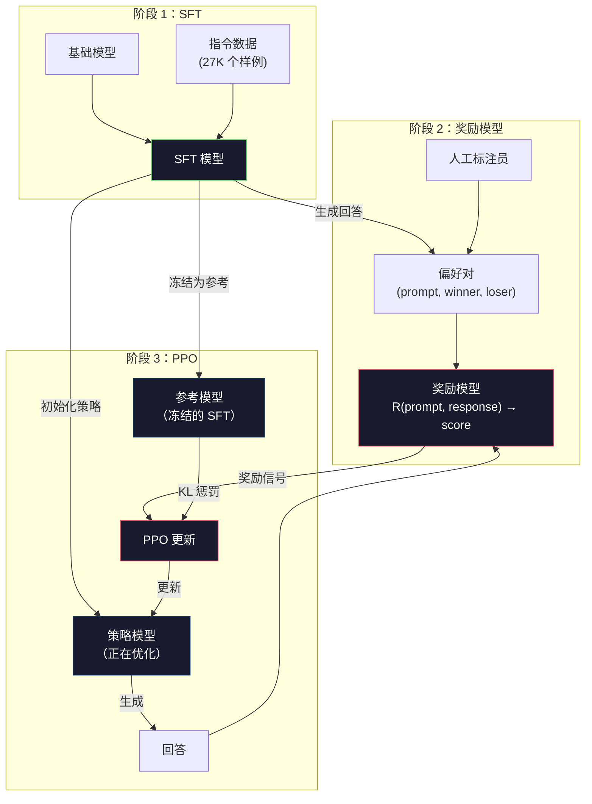
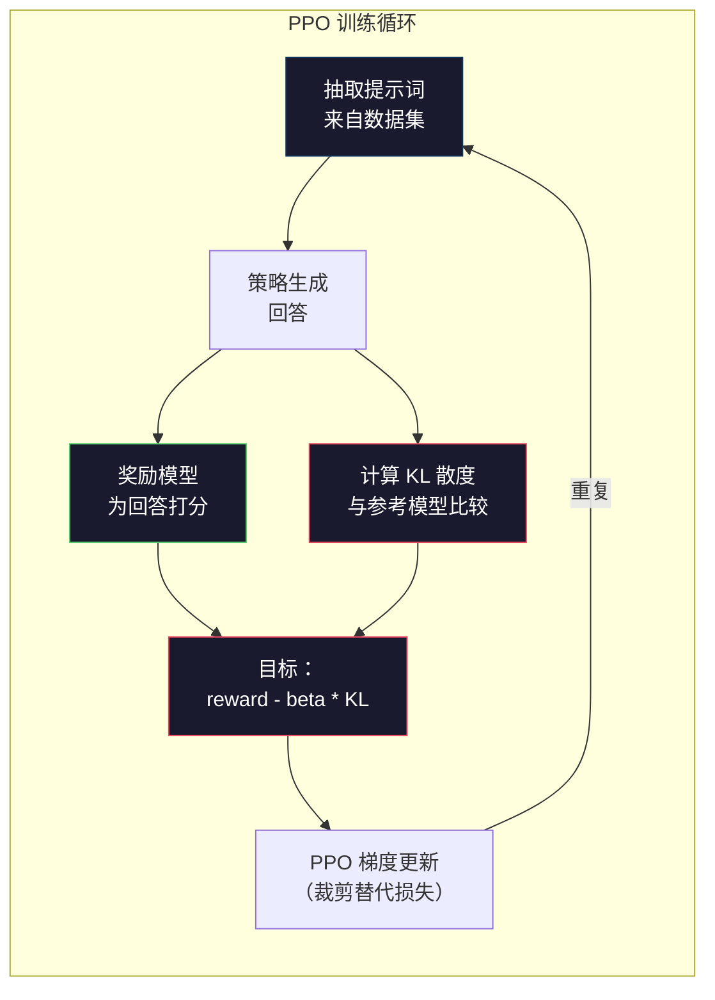

# 基于人类反馈的强化学习：奖励模型与 PPO（RLHF: Reward Model + PPO）

> 监督微调（Supervised Fine-Tuning，SFT）教模型遵循指令，却不教它哪种回答更好。两个语法正确、事实准确的答案，有用程度可能相差很大。基于人类反馈的强化学习（Reinforcement Learning from Human Feedback，RLHF）将人类判断编码进模型行为，让 Claude 更有帮助，让 GPT 更有礼貌。

**Type:** Build
**Languages:** Python (with numpy)
**Prerequisites:** 阶段 10，第 06 课（指令微调 / SFT）
**Time:** ~90 分钟

## 学习目标（Learning Objectives）

- 构建奖励模型（Reward model），从人类偏好对，即被选中与被拒绝回答，学习为回答质量打分
- 实现近端策略优化（Proximal Policy Optimization，PPO）训练循环，根据奖励模型并结合 KL 惩罚优化语言模型策略
- 解释为何 RLHF 需要 SFT、奖励、策略三个模型，以及 KL 约束如何防止奖励投机
- 比较偏好优化前后的回答质量，评估 RLHF 效果

## 问题（The Problem）

请模型“解释量子计算”，它可能给出：

**回答 A：**“量子计算使用可处于叠加态（Superposition）的量子比特（Qubit），即可以为 0、1，或同时处于两者的叠加。这让量子计算机执行某些计算时比经典计算机快指数倍。关键算法包括用于大数分解的 Shor 算法和搜索未排序数据库的 Grover 算法。”

**回答 B：**“量子计算是一种利用量子力学现象的计算。它最早于 20 世纪 80 年代提出。Richard Feynman 建议用量子计算机模拟量子系统。此后该领域发展很大。许多公司现在都在研究量子计算机。IBM、Google 等取得了进展。Google 在 2019 年宣称实现量子优越性。”

两个回答事实正确、语法通顺，也都遵循指令。但 A 明显更好，更简洁、信息更多、结构更清楚。人类每次都会选 A。

SFT 无法捕获这个区别。它用“正确”回答训练，却没有表达“这个回答比另一个更好”的机制，视每个样例为同样优秀。如果 A、B 都在 SFT 数据集中，模型就会同等学习两者。

RLHF 解决了这一点。先训练奖励模型预测人类偏好，再用奖励信号推动语言模型生成更高质量输出。ChatGPT 的前身 InstructGPT 用 RLHF 改善 GPT-3 的有用性、真实性、无害性。尽管 InstructGPT 小 135 倍，参数为 1.3B 对 175B，OpenAI 内部评估者仍有 85% 的时候更喜欢它的输出。

## 概念（The Concept）

### 三个阶段（The Three Stages）

RLHF 不是一次训练，而是三个顺序阶段组成的流水线，每个阶段都建立在前一阶段之上。

**阶段 1：SFT。** 在指令与回答对上训练基础模型，见第 06 课。得到能遵循指令，却不知道哪种回答更好的模型。

**阶段 2：奖励模型。** 收集人类偏好数据：向标注员展示同一提示词的两个回答，问“哪个更好？”训练模型预测这些偏好。奖励模型输入提示词与回答，输出一个标量分数。

**阶段 3：PPO。** 用奖励模型为语言模型提供训练信号。语言模型生成回答，奖励模型评分，PPO 更新语言模型以产生更高分回答。相对熵（Kullback-Leibler divergence，KL 散度）惩罚防止语言模型偏离 SFT 检查点太远。



### 奖励模型（The Reward Model）

奖励模型是改作评分器的语言模型。取 SFT 模型，将输出词表分布的语言建模头，替换为输出单个数字的标量头。直到最终层之前，架构完全相同。

输入是提示词与回答的拼接，输出是单个标量奖励分数。

训练数据是人类偏好对。每个提示词向标注员展示两个回答并选择较好的，形成训练三元组：(prompt, preferred_response, rejected_response)。

损失函数采用成对偏好的 Bradley-Terry 模型：

```
loss = -log(sigmoid(reward(preferred) - reward(rejected)))
```

这是关键方程。`sigmoid(reward(A) - reward(B))` 给出回答 A 比 B 更受偏好的概率。损失推动奖励模型给被偏好的回答更高分。

为什么用成对比较而不是绝对分数？人类不擅长判断“满分 10 分，这个回答该是 7.3 还是 7.5”，却擅长比较“A 是否比 B 好”。Bradley-Terry 模型将相对比较转为一致的绝对评分体系。

**InstructGPT 数字：** OpenAI 从 40 名承包标注员收集 33,000 对比较。每次约 5 分钟，奖励模型训练数据共耗费 2,750 人工小时。

### 近端策略优化（PPO: Proximal Policy Optimization）

PPO 是强化学习（Reinforcement Learning，RL）算法。RLHF 中，“环境”是奖励模型，“智能体”（Agent）是语言模型，“动作”是生成词元。

目标：

```
maximize: E[R(prompt, response)] - beta * KL(policy || reference)
```

第一项推动模型生成高奖励回答，第二项即 KL 散度惩罚，防止模型偏离 SFT 检查点太远。

为什么需要 KL 惩罚？没有它，模型会找到退化解。奖励模型只在有限人类偏好数据上训练，存在盲区。语言模型会利用这些盲区，找到奖励高却毫无意义的输出。典型例子：

- 反复说“我非常有帮助，也很无害！”，在有用性与无害性奖励模型上得高分
- 输出冗长、正式却空洞的回答，只是在形式上匹配“高质量”
- 利用训练数据中碰巧与高奖励相关的特定短语

KL 惩罚相当于规定：可以进步，但不能变成完全不同的模型。要接近原本已合理的 SFT 版本；偏离太远，KL 成本就会超过奖励。

**InstructGPT 数字：** PPO 训练使用 lr=1.5e-5、KL 系数 beta=0.02、256K 个回合（Episode），即提示词与回答对，每批次训练 4 轮 PPO。整个 RLHF 流水线在 GPU 集群上耗时数天。



### PPO 目标详解（The PPO Objective in Detail）

PPO 使用裁剪替代目标（Clipped surrogate objective）防止更新过大。新旧策略概率比被裁剪到 [1 - epsilon, 1 + epsilon]，epsilon 通常为 0.2。

```
ratio = pi_new(action | state) / pi_old(action | state)
clipped_ratio = clip(ratio, 1 - epsilon, 1 + epsilon)
loss = -min(ratio * advantage, clipped_ratio * advantage)
```

优势函数（Advantage function）估计当前回答比预期质量好多少。在 RLHF 中：

```
advantage = reward(prompt, response) - baseline
```

基线（Baseline）通常是最近回答的平均奖励。优势为正表示高于平均，为负表示低于平均。PPO 提高优于平均回答的概率，降低劣于平均回答的概率。

裁剪防止灾难性更新。若单个回答获得异常高奖励，未裁剪概率比可能很大，导致模型大幅转向该回答。裁剪限制更新幅度，保持训练稳定。

### 奖励投机（Reward Hacking）

这是 RLHF 的问题面。语言模型针对奖励模型优化，但奖励模型只是人类偏好的不完美代理。语言模型越擅长最大化奖励，就越可能利用奖励模型的弱点。

常见失败模式：

| 失败模式 | 表现 | 原因 |
|---------|-------------|-----|
| 冗长（Verbosity） | 回答越来越长 | 人类标注员常偏好更长、更详细的回答，奖励模型因而对长度给高分 |
| 迎合（Sycophancy） | 用户说什么都同意 | 标注员偏好赞同问题前提的回答 |
| 含糊回避（Hedging） | 不愿给出明确答案 | “这是一个有许多视角的复杂话题……”等含糊回答很少被判错 |
| 格式投机（Format gaming） | 过度使用列表和标题 | 格式化回答在标注员眼里显得更精致 |

缓解策略包括：增强 KL 惩罚，避免模型偏离到足以利用弱点的程度；用对抗样例（Adversarial examples）训练奖励模型，修补已知失败模式；使用多个不同架构的奖励模型，增加同时利用所有模型漏洞的难度。

### 真实 RLHF 流水线（Real RLHF Pipelines）

| 模型 | 比较对数 | 标注员数 | 奖励模型规模 | PPO 步数 | KL 系数 |
|-------|-----------------|------------|---------|-----------|----------|
| InstructGPT | 33K | 40 | 6B | 256K | 0.02 |
| Llama 2 Chat | ~1M | 未披露 | 70B | 未披露 | 0.01 |
| Claude | 未披露 | 未披露 | 未披露 | 未披露 | 未披露 |
| Anthropic RLHF 论文 | 22K | 20 | 52B | 50K | 0.001 |

Anthropic 的 2022 年论文用 22,000 对比较训练 52B 奖励模型。更大奖励模型给出的信号更可靠，让 PPO 更稳定。用小奖励模型训练大语言模型有风险，因为其容量不足以捕获好坏回答之间的细微区别。

```figure
rlhf-pipeline
```

## 动手实现（Build It）

### 步骤 1：合成偏好数据（Step 1: Synthetic Preference Data）

生产环境由人工标注员创建偏好数据。这里构造合成对，让“被偏好”的回答客观上更好，即更简洁、准确、有帮助。

```python
import numpy as np

PREFERENCE_DATA = [
    {
        "prompt": "What is the capital of France?",
        "preferred": "The capital of France is Paris.",
        "rejected": "France is a country in Europe. It has many cities. The capital is Paris. Paris is known for the Eiffel Tower.",
    },
    {
        "prompt": "Explain gravity in one sentence.",
        "preferred": "Gravity is the force that attracts objects with mass toward each other.",
        "rejected": "Gravity is something that makes things fall down when you drop them.",
    },
    {
        "prompt": "What is 15 times 7?",
        "preferred": "15 times 7 is 105.",
        "rejected": "Let me think about this. 15 times 7. Well, 10 times 7 is 70, and 5 times 7 is 35, so the answer might be around 105.",
    },
    {
        "prompt": "Name three programming languages.",
        "preferred": "Python, Rust, and TypeScript.",
        "rejected": "There are many programming languages. Some popular ones include various languages like Python and others.",
    },
    {
        "prompt": "What year did World War II end?",
        "preferred": "World War II ended in 1945.",
        "rejected": "World War II was a major global conflict. It involved many countries. The war ended in the mid-1940s, specifically in 1945.",
    },
    {
        "prompt": "Define machine learning.",
        "preferred": "Machine learning is a field where algorithms learn patterns from data to make predictions without being explicitly programmed.",
        "rejected": "Machine learning is a type of AI. AI stands for artificial intelligence. Machine learning uses data to learn.",
    },
]
```

被偏好的回答简洁直接，被拒绝的回答则存在不必要填充、含糊回避、冗余解释、不精确等常见问题。这正是 SFT 无法捕获、RLHF 却能捕获的区别。

### 步骤 2：奖励模型架构（Step 2: Reward Model Architecture）

奖励模型复用迷你 GPT 的 Transformer 架构，但将词表大小的输出头替换成单个标量投影。

```python
import sys
import os
sys.path.insert(0, os.path.join(os.path.dirname(__file__), "..", "..", "04-pre-training-mini-gpt", "code"))
from main import MiniGPT, LayerNorm, Embedding, TransformerBlock


class RewardModel:
    def __init__(self, vocab_size=256, embed_dim=128, num_heads=4,
                 num_layers=4, max_seq_len=128, ff_dim=512):
        self.embedding = Embedding(vocab_size, embed_dim, max_seq_len)
        self.blocks = [
            TransformerBlock(embed_dim, num_heads, ff_dim)
            for _ in range(num_layers)
        ]
        self.ln_f = LayerNorm(embed_dim)
        self.reward_head = np.random.randn(embed_dim) * 0.02

    def forward(self, token_ids):
        seq_len = token_ids.shape[-1]
        mask = np.triu(np.full((seq_len, seq_len), -1e9), k=1)

        x = self.embedding.forward(token_ids)
        for block in self.blocks:
            x = block.forward(x, mask)
        x = self.ln_f.forward(x)

        last_hidden = x[:, -1, :]
        reward = last_hidden @ self.reward_head

        return reward
```

奖励模型取*最后*一个词元位置的隐藏状态（Hidden state），投影为标量。为什么是最后？因果注意力掩码使最后位置已关注所有此前词元，拥有整个提示词与回答序列最完整的表示。

### 步骤 3：Bradley-Terry 损失（Step 3: Bradley-Terry Loss）

使用 Bradley-Terry 成对损失，在偏好对上训练奖励模型。

```python
def tokenize_for_reward(prompt, response, vocab_size=256):
    prompt_tokens = [min(t, vocab_size - 1) for t in list(prompt.encode("utf-8"))]
    response_tokens = [min(t, vocab_size - 1) for t in list(response.encode("utf-8"))]
    return prompt_tokens + [0] + response_tokens


def sigmoid(x):
    return np.where(
        x >= 0,
        1.0 / (1.0 + np.exp(-x)),
        np.exp(x) / (1.0 + np.exp(x))
    )


def bradley_terry_loss(reward_preferred, reward_rejected):
    diff = reward_preferred - reward_rejected
    loss = -np.log(sigmoid(diff) + 1e-8)
    return loss


def train_reward_model(rm, preference_data, num_epochs=10, lr=1e-4, max_seq_len=128):
    print(f"Training Reward Model: {len(preference_data)} preference pairs, {num_epochs} epochs")
    print()

    losses = []
    accuracies = []

    for epoch in range(num_epochs):
        epoch_loss = 0.0
        epoch_correct = 0
        num_pairs = 0

        indices = np.random.permutation(len(preference_data))

        for idx in indices:
            pair = preference_data[idx]

            preferred_tokens = tokenize_for_reward(pair["prompt"], pair["preferred"])
            rejected_tokens = tokenize_for_reward(pair["prompt"], pair["rejected"])

            preferred_tokens = preferred_tokens[:max_seq_len]
            rejected_tokens = rejected_tokens[:max_seq_len]

            preferred_ids = np.array(preferred_tokens).reshape(1, -1)
            rejected_ids = np.array(rejected_tokens).reshape(1, -1)

            r_preferred = rm.forward(preferred_ids)[0]
            r_rejected = rm.forward(rejected_ids)[0]

            loss = bradley_terry_loss(r_preferred, r_rejected)

            if r_preferred > r_rejected:
                epoch_correct += 1

            diff = r_preferred - r_rejected
            grad = sigmoid(diff) - 1.0

            rm.reward_head -= lr * grad * rm.ln_f.forward(
                rm.embedding.forward(preferred_ids)
            )[:, -1, :].flatten()

            epoch_loss += loss
            num_pairs += 1

        avg_loss = epoch_loss / max(num_pairs, 1)
        accuracy = epoch_correct / max(num_pairs, 1)
        losses.append(avg_loss)
        accuracies.append(accuracy)

        if epoch % 2 == 0:
            print(f"  Epoch {epoch + 1:3d} | Loss: {avg_loss:.4f} | Accuracy: {accuracy:.1%}")

    return rm, losses, accuracies
```

准确率很直接：奖励模型正确排序的偏好对占多少？随机模型为 50%，在干净数据上训练良好的模型应超过 70%。InstructGPT 在留出比较集上约为 72%，看似低，其实不错，因为许多偏好对连人类也难分，标注员间一致率约 73%。

### 步骤 4：简化 PPO 循环（Step 4: Simplified PPO Loop）

完整 PPO 很复杂。这里体现核心机制：生成回答、评分、计算优势，再带 KL 惩罚更新策略。

```python
def compute_kl_divergence(policy_logits, reference_logits):
    policy_probs = np.exp(policy_logits - policy_logits.max(axis=-1, keepdims=True))
    policy_probs = policy_probs / policy_probs.sum(axis=-1, keepdims=True)
    policy_probs = np.clip(policy_probs, 1e-10, 1.0)

    ref_probs = np.exp(reference_logits - reference_logits.max(axis=-1, keepdims=True))
    ref_probs = ref_probs / ref_probs.sum(axis=-1, keepdims=True)
    ref_probs = np.clip(ref_probs, 1e-10, 1.0)

    kl = np.sum(policy_probs * np.log(policy_probs / ref_probs), axis=-1)
    return kl.mean()


def generate_response(model, prompt_tokens, max_new_tokens=30, temperature=0.8, max_seq_len=128):
    tokens = list(prompt_tokens)

    for _ in range(max_new_tokens):
        context = np.array(tokens[-max_seq_len:]).reshape(1, -1)
        logits = model.forward(context)
        next_logits = logits[0, -1, :]

        next_logits = next_logits / max(temperature, 1e-8)
        probs = np.exp(next_logits - next_logits.max())
        probs = probs / probs.sum()
        probs = np.clip(probs, 1e-10, 1.0)
        probs = probs / probs.sum()

        next_token = np.random.choice(len(probs), p=probs)
        tokens.append(int(next_token))

    return tokens


def copy_model_weights(source, target):
    target.embedding.token_embed = source.embedding.token_embed.copy()
    target.embedding.pos_embed = source.embedding.pos_embed.copy()
    target.ln_f.gamma = source.ln_f.gamma.copy()
    target.ln_f.beta = source.ln_f.beta.copy()
    for s_block, t_block in zip(source.blocks, target.blocks):
        t_block.attn.W_q = s_block.attn.W_q.copy()
        t_block.attn.W_k = s_block.attn.W_k.copy()
        t_block.attn.W_v = s_block.attn.W_v.copy()
        t_block.attn.W_out = s_block.attn.W_out.copy()
        t_block.ffn.W1 = s_block.ffn.W1.copy()
        t_block.ffn.W2 = s_block.ffn.W2.copy()
        t_block.ffn.b1 = s_block.ffn.b1.copy()
        t_block.ffn.b2 = s_block.ffn.b2.copy()
        t_block.ln1.gamma = s_block.ln1.gamma.copy()
        t_block.ln1.beta = s_block.ln1.beta.copy()
        t_block.ln2.gamma = s_block.ln2.gamma.copy()
        t_block.ln2.beta = s_block.ln2.beta.copy()


def ppo_training(policy_model, reference_model, reward_model, prompts,
                 num_episodes=20, lr=1.5e-5, kl_coeff=0.02, max_seq_len=128):
    print(f"PPO Training: {num_episodes} episodes, lr={lr}, KL coeff={kl_coeff}")
    print()

    rewards_history = []
    kl_history = []

    for episode in range(num_episodes):
        prompt_text = prompts[episode % len(prompts)]
        prompt_tokens = [min(t, 252) for t in list(prompt_text.encode("utf-8"))]

        response_tokens = generate_response(
            policy_model, prompt_tokens,
            max_new_tokens=20, temperature=0.8, max_seq_len=max_seq_len
        )

        response_ids = np.array(response_tokens[:max_seq_len]).reshape(1, -1)
        reward = reward_model.forward(response_ids)[0]

        policy_logits = policy_model.forward(response_ids)
        ref_logits = reference_model.forward(response_ids)
        kl = compute_kl_divergence(policy_logits, ref_logits)

        total_reward = reward - kl_coeff * kl

        rewards_history.append(float(reward))
        kl_history.append(float(kl))

        for block in policy_model.blocks:
            update_scale = lr * total_reward
            block.ffn.W1 += update_scale * np.random.randn(*block.ffn.W1.shape) * 0.01
            block.ffn.W2 += update_scale * np.random.randn(*block.ffn.W2.shape) * 0.01

        if episode % 5 == 0:
            avg_reward = np.mean(rewards_history[-5:]) if rewards_history else 0
            avg_kl = np.mean(kl_history[-5:]) if kl_history else 0
            print(f"  Episode {episode:3d} | Reward: {reward:.4f} | KL: {kl:.4f} | "
                  f"Avg Reward: {avg_reward:.4f}")

    return policy_model, rewards_history, kl_history
```

核心循环：(1) 抽取提示词，(2) 生成回答，(3) 用奖励模型打分，(4) 与冻结参考模型计算 KL 散度，(5) 计算调整后奖励，即奖励减 KL 惩罚，(6) 更新策略。策略越偏离参考，KL 惩罚越大，从而自动防止奖励投机。

### 步骤 5：比较奖励分数（Step 5: Reward Score Comparison）

RLHF 后，策略模型回答在奖励模型上的评分应高于原始 SFT 模型回答。

```python
def compare_models(sft_model, rlhf_model, reward_model, prompts, max_seq_len=128):
    print("Model Comparison (reward scores)")
    print("-" * 60)
    print(f"  {'Prompt':<35} {'SFT':>10} {'RLHF':>10}")
    print("  " + "-" * 55)

    sft_total = 0.0
    rlhf_total = 0.0

    for prompt in prompts:
        prompt_tokens = [min(t, 252) for t in list(prompt.encode("utf-8"))]

        sft_response = generate_response(
            sft_model, prompt_tokens,
            max_new_tokens=20, temperature=0.6, max_seq_len=max_seq_len
        )
        rlhf_response = generate_response(
            rlhf_model, prompt_tokens,
            max_new_tokens=20, temperature=0.6, max_seq_len=max_seq_len
        )

        sft_ids = np.array(sft_response[:max_seq_len]).reshape(1, -1)
        rlhf_ids = np.array(rlhf_response[:max_seq_len]).reshape(1, -1)

        sft_reward = reward_model.forward(sft_ids)[0]
        rlhf_reward = reward_model.forward(rlhf_ids)[0]

        sft_total += sft_reward
        rlhf_total += rlhf_reward

        truncated_prompt = prompt[:33] + ".." if len(prompt) > 35 else prompt
        print(f"  {truncated_prompt:<35} {sft_reward:>10.4f} {rlhf_reward:>10.4f}")

    n = len(prompts)
    print("  " + "-" * 55)
    print(f"  {'Average':<35} {sft_total/n:>10.4f} {rlhf_total/n:>10.4f}")

    return sft_total / n, rlhf_total / n
```

## 实际应用（Use It）

### 完整 RLHF 流水线演示（Full RLHF Pipeline Demo）

```python
if __name__ == "__main__":
    np.random.seed(42)

    print("=" * 70)
    print("RLHF PIPELINE: REWARD MODEL + PPO")
    print("=" * 70)
    print()

    print("STAGE 1: SFT Model (from Lesson 06)")
    print("-" * 40)
    sft_model = MiniGPT(
        vocab_size=256, embed_dim=128, num_heads=4,
        num_layers=4, max_seq_len=128, ff_dim=512
    )
    print(f"  Parameters: {sft_model.count_parameters():,}")
    print()

    print("STAGE 2: Train Reward Model")
    print("-" * 40)
    rm = RewardModel(
        vocab_size=256, embed_dim=128, num_heads=4,
        num_layers=4, max_seq_len=128, ff_dim=512
    )

    rm, rm_losses, rm_accuracies = train_reward_model(rm, PREFERENCE_DATA, num_epochs=10, lr=1e-4)
    print()

    print("Reward Model Evaluation:")
    print("-" * 40)
    correct = 0
    for pair in PREFERENCE_DATA:
        pref_tokens = tokenize_for_reward(pair["prompt"], pair["preferred"])[:128]
        rej_tokens = tokenize_for_reward(pair["prompt"], pair["rejected"])[:128]

        r_pref = rm.forward(np.array(pref_tokens).reshape(1, -1))[0]
        r_rej = rm.forward(np.array(rej_tokens).reshape(1, -1))[0]

        if r_pref > r_rej:
            correct += 1
        print(f"  Preferred: {r_pref:+.4f} | Rejected: {r_rej:+.4f} | {'Correct' if r_pref > r_rej else 'Wrong'}")

    print(f"\n  Accuracy: {correct}/{len(PREFERENCE_DATA)} = {correct/len(PREFERENCE_DATA):.1%}")
    print()

    print("STAGE 3: PPO Training")
    print("-" * 40)

    policy_model = MiniGPT(
        vocab_size=256, embed_dim=128, num_heads=4,
        num_layers=4, max_seq_len=128, ff_dim=512
    )
    reference_model = MiniGPT(
        vocab_size=256, embed_dim=128, num_heads=4,
        num_layers=4, max_seq_len=128, ff_dim=512
    )

    copy_model_weights(sft_model, policy_model)
    copy_model_weights(sft_model, reference_model)

    train_prompts = [pair["prompt"] for pair in PREFERENCE_DATA]

    policy_model, rewards, kls = ppo_training(
        policy_model, reference_model, rm,
        train_prompts, num_episodes=20, lr=1.5e-5, kl_coeff=0.02
    )
    print()

    print("=" * 70)
    print("COMPARISON: SFT vs RLHF")
    print("=" * 70)
    print()

    eval_prompts = [
        "What is the capital of France?",
        "Explain gravity.",
        "Name three programming languages.",
    ]

    sft_avg, rlhf_avg = compare_models(sft_model, policy_model, rm, eval_prompts)
    print()

    print("=" * 70)
    print("KL DIVERGENCE ANALYSIS")
    print("=" * 70)
    print()

    if kls:
        print(f"  Initial KL: {kls[0]:.4f}")
        print(f"  Final KL:   {kls[-1]:.4f}")
        print(f"  Max KL:     {max(kls):.4f}")
        kl_threshold = 0.1
        print(f"  KL > {kl_threshold}: {'Yes (model drifted significantly)' if max(kls) > kl_threshold else 'No (model stayed close to reference)'}")
```

## 交付成果（Ship It）

本课产出 `outputs/prompt-reward-model-designer.md`，用于设计奖励模型训练流水线的提示词。给定有用性、编程能力、安全等目标行为，它会生成数据收集规程、标注员指南和奖励模型评估标准。

## 练习（Exercises）

1. 修改奖励模型，使用全部隐藏状态的平均值，而非仅最后位置，比较准确率。平均池化（Mean pooling）给每个词元相同权重，最后位置方法依靠因果注意力聚合信息。在 6 对偏好数据上测试，报告哪种准确率更高。

2. 实现奖励模型校准（Calibration）。训练后运行全部偏好对，计算：(a) 偏好回答平均奖励，(b) 拒绝回答平均奖励，(c) 间隔（Margin），即前者减后者。校准良好的模型应有明显间隔。再加 4 对新数据，检查间隔是否在未见数据上保持。

3. 模拟奖励投机。创建偏爱长回答的奖励模型，reward = len(response) / 100。用这个有缺陷的模型运行 PPO，观察策略生成越来越长、重复的输出。再加入 0.1 的 KL 惩罚，展示它如何阻止退化行为。

4. 实现多目标奖励（Multi-objective reward）。训练有用性与简洁性两个奖励模型，以 R = 0.7 * R_helpful + 0.3 * R_concise 组合。展示组合目标如何产生既有帮助又简洁的回答，避免单一有用性奖励的冗长陷阱。

5. 比较 KL 系数。分别用 beta=0.001，过低导致奖励投机；beta=0.02，标准值；beta=0.5，过高导致不学习，运行 PPO。绘制各自奖励与 KL 曲线。beta=0.02 应在 KL 有界时稳定提高奖励。

## 关键术语（Key Terms）

| 术语 | 常见说法 | 实际含义 |
|------|----------------|----------------------|
| 基于人类反馈的强化学习（Reinforcement Learning from Human Feedback，RLHF） | “用人类反馈训练” | SFT、奖励模型、PPO 三阶段流水线，利用人类偏好信号优化语言模型输出 |
| 奖励模型（Reward model） | “给回答打分的模型” | 带标量输出头的 Transformer，使用 Bradley-Terry 损失在人类成对偏好上训练 |
| Bradley-Terry 模型 | “比较模型” | 概率模型 P(A > B) = sigmoid(score(A) - score(B))，将成对偏好转为一致评分函数 |
| 近端策略优化（Proximal Policy Optimization，PPO） | “强化学习算法” | 更新策略以最大化奖励，同时裁剪更新幅度以防不稳定 |
| 相对熵（KL divergence） | “两个分布差多少” | 衡量策略与参考模型词元分布差异，用作防止奖励投机的惩罚 |
| KL 惩罚（KL penalty） | “模型的约束绳” | 从奖励中减去 Beta * KL(policy \|\| reference)，防止策略偏离 SFT 检查点太远 |
| 奖励投机（Reward hacking） | “钻奖励空子” | 策略利用奖励模型弱点，找到退化的高奖励输出，而非真正改进 |
| 偏好对（Preference pair） | “A 和 B 哪个更好？” | 由 (prompt, preferred_response, rejected_response) 构成的样例，是 RLHF 数据的基本单位 |
| 参考模型（Reference model） | “冻结的 SFT 检查点” | 权重永不改变的 SFT 副本，用作 KL 散度计算的参照 |

## 延伸阅读（Further Reading）

- [Ouyang 等，2022：《利用人类反馈训练语言模型遵循指令》（InstructGPT）](https://arxiv.org/abs/2203.02155) -- 让 RLHF 在大语言模型中实用化的论文
- [Schulman 等，2017：《近端策略优化算法》](https://arxiv.org/abs/1707.06347) -- OpenAI 最初的 PPO 论文
- [Bai 等，2022：《利用基于人类反馈的强化学习训练有帮助且无害的助手》](https://arxiv.org/abs/2204.05862) -- Anthropic RLHF 论文，详析奖励投机与 KL 惩罚
- [Stiennon 等，2020：《利用人类反馈学习摘要》](https://arxiv.org/abs/2009.01325) -- 将 RLHF 用于摘要，展示奖励模型可捕获细微质量判断
- [Christiano 等，2017：《从人类偏好进行深度强化学习》](https://arxiv.org/abs/1706.03741) -- 从人类比较学习奖励函数的奠基工作
