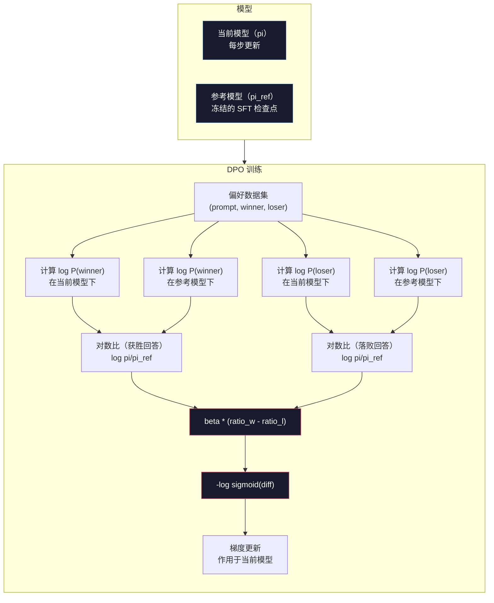

# 直接偏好优化（DPO: Direct Preference Optimization）

> 基于人类反馈的强化学习（Reinforcement Learning from Human Feedback，RLHF）有效，但要训练 SFT、奖励和策略三个模型，处理 PPO 不稳定性，还要调整 KL 惩罚。直接偏好优化（Direct Preference Optimization，DPO）问：能否跳过这些？它直接在偏好对上优化语言模型，不要奖励模型，不要 PPO，一个训练循环，获得相同结果。

**Type:** Build
**Languages:** Python (with numpy)
**Prerequisites:** 阶段 10，第 07 课（RLHF）
**Time:** ~90 分钟

## 学习目标（Learning Objectives）

- 实现直接在偏好对上优化语言模型的 DPO 训练，无需独立奖励模型
- 推导 DPO 损失函数，解释如何通过策略的对数概率隐式表示奖励模型
- 比较 DPO 与 RLHF 的训练稳定性、计算成本和所需模型数量
- 调整 beta 参数，控制训练策略偏离参考模型的程度

## 问题（The Problem）

第 07 课构建了 RLHF 流水线：三个阶段、三个模型，分别是监督微调（Supervised Fine-Tuning，SFT）模型、奖励模型和用近端策略优化（Proximal Policy Optimization，PPO）优化的策略模型。仅奖励模型就需要数千个人类偏好对和独立训练循环。PPO 还要仔细调整 KL 系数、学习率、裁剪比率、轮数。

实际中，PPO 训练以不稳定著称。超参数小改动就可能导致发散。奖励模型只是人类偏好的不完美代理，策略会利用其弱点。KL 惩罚有帮助，但本身也需调参：太低会奖励投机，太高几乎不学习。

这份复杂性使多数开源模型在 InstructGPT 发布后多年仍难以用好 RLHF。三阶段流水线脆弱，各有失败模式，错误还会叠加。

2023 年 5 月，Stanford 的 Rafael Rafailov、Archit Sharma 等发表《直接偏好优化：你的语言模型其实就是奖励模型》。关键洞见是，不需要独立奖励模型：最优奖励函数在数学上由语言模型自己的词元概率决定。因此可完全跳过奖励模型，直接在偏好对上优化语言模型。

DPO 把 RLHF 简化为单个监督学习步骤：一个模型、一个损失、一个循环，无需强化学习。Zephyr-7B 是最早大规模使用 DPO 的模型之一，在多个基准上追平或超过完整 RLHF 模型。Meta 把 DPO 用于 Llama 3 对齐流水线，Anthropic 也在对齐研究中引用 DPO 类方法。

## 概念（The Concept）

### 关键洞见（The Key Insight）

RLHF 优化以下目标：

```
maximize: E[R(x, y)] - beta * KL(pi || pi_ref)
```

其中 R 是奖励模型，pi 是策略，pi_ref 是参考模型，beta 是 KL 系数。

DPO 论文证明该目标有闭式最优解（Closed-form optimal solution）。对于任意奖励函数 R，最优策略为：

```
pi*(y | x) = pi_ref(y | x) * exp(R(x, y) / beta) / Z(x)
```

其中 Z(x) 是归一化常数。整理可得：

```
R(x, y) = beta * log(pi*(y | x) / pi_ref(y | x)) + beta * log Z(x)
```

突破就在这里：奖励完全用策略和参考模型的概率表达，无需另行训练奖励模型，奖励*隐含*在概率比中。

代入 Bradley-Terry 偏好模型：

```
P(y_w > y_l | x) = sigmoid(R(x, y_w) - R(x, y_l))
                  = sigmoid(beta * (log pi(y_w|x)/pi_ref(y_w|x) - log pi(y_l|x)/pi_ref(y_l|x)))
```

因为两个回答都以相同提示词 x 为条件，Z(x) 项抵消。剩下的函数只依赖策略与参考模型对偏好和拒绝回答的对数概率。

### DPO 损失（The DPO Loss）

```
L_DPO = -log(sigmoid(beta * (log pi(y_w|x)/pi_ref(y_w|x) - log pi(y_l|x)/pi_ref(y_l|x))))
```

逐项解释：

- **y_w** = 被偏好的获胜回答
- **y_l** = 被拒绝的落败回答
- **x** = 提示词
- **pi** = 正在训练的当前模型
- **pi_ref** = 参考模型，冻结的 SFT 检查点
- **beta** = 控制偏离参考程度的温度参数，通常为 0.1 到 0.5

`log pi(y|x) / pi_ref(y|x)` 是对数概率比（Log-probability ratio）。为正时，当前模型对回答 y 分配的概率高于参考模型；为负时则更低。

DPO 损失推动模型提高偏好回答的对数概率比，降低拒绝回答的比值。beta 控制偏离参考的力度：小 beta 允许大幅偏离，大 beta 使模型保持接近参考。



### 为什么 DPO 更简单（Why DPO is Simpler）

| 方面 | RLHF（PPO） | DPO |
|--------|-----------|-----|
| 需训练模型数 | 3，SFT + 奖励 + 策略 | 1，仅策略 |
| 训练循环 | 3，SFT、奖励模型训练、PPO | 2，SFT、DPO |
| 超参数 | lr、KL 系数、裁剪比率、奖励模型 lr、三套轮数 | lr、beta、轮数 |
| 奖励模型 | 必需，独立训练 | 隐含在模型概率中 |
| 强化学习算法 | PPO，复杂且不稳定 | 监督学习，稳定 |
| GPU 内存 | PPO 期间驻留 3-4 个模型 | 2 个，当前与参考 |
| 训练稳定性 | 对超参数敏感 | 稳健，类似 SFT |

DPO 训练需在内存放两个模型：当前模型与冻结参考。RLHF 需三或四个：策略、参考、奖励模型，以及可选的价值函数基线（Value function baseline）。70B 模型的每份 FP16 副本占 140GB，去掉奖励模型能节省大量内存。

### DPO 何时优于 RLHF（When DPO Beats RLHF）

**小数据集。** 5,000-20,000 个偏好对时，DPO 常追平或超过 RLHF。RLHF 奖励模型需要足够数据才能泛化；数据有限时会过拟合，产生不可靠信号。DPO 根本不需要奖励模型，绕开了这个问题。

**算力有限。** DPO 计算量约为完整 RLHF 的三分之一，因为一个循环取代三个。没有大型 GPU 集群的团队可以选它。

**快速迭代。** 想试 10 个偏好数据集，看哪个效果最好？DPO 每个实验几小时即可，RLHF 则需为每个数据集重训奖励模型。

### RLHF 何时优于 DPO（When RLHF Beats DPO）

**大规模训练。** 在 GPT-4 或 Claude 规模，独立奖励模型能捕获更细的偏好信号，作为学出来的损失函数，适应复杂质量标准。

**复杂奖励信号。** 当“更好”涉及有用性、无害性、诚实性多个维度，奖励模型能学习多目标权衡。DPO 把偏好对当二元信号，一个好、一个差，却不建模原因。

**迭代对齐。** RLHF 可以用当前策略生成新回答，交给人类评分，再在线循环重训奖励模型。DPO 使用固定偏好对数据集。Anthropic 的宪法式 AI（Constitutional AI）广泛利用 RLHF 的这种迭代性。

### DPO 之外：KTO、ORPO、SimPO（Beyond DPO: KTO, ORPO, SimPO）

DPO 催生了一系列简化对齐方法。

**卡尼曼—特沃斯基优化（Kahneman-Tversky Optimization，KTO，2024）：** 甚至无需成对数据。每个回答只标“好”或“坏”，不用与另一个比较。这大幅简化收集：不再展示两个问“哪个更好”，而是展示一个问“这个好吗”。损失采用前景理论（Prospect theory）的损失厌恶（Loss aversion）：坏回答受罚力度大于好回答获奖力度。

**优势比偏好优化（Odds Ratio Preference Optimization，ORPO，2024）：** 在单个训练步骤结合 SFT 和对齐。不先 SFT 再 DPO，而是修改 SFT 损失，加入偏好信号。两项分别为偏好回答的标准下一词元预测损失，以及扩大偏好与拒绝回答概率差距的优势比项。一个循环取代两个。

**简单偏好优化（Simple Preference Optimization，SimPO，2024）：** 完全去除参考模型。不计算相对冻结参考的对数概率比，而用按长度归一化的回答平均对数概率作隐式奖励。这样节省参考模型内存并简化训练，长度归一化防止偏爱短回答。

| 方法 | 年份 | 驻留模型数 | 需要成对数据？ | 需要参考模型？ | 训练循环 |
|--------|------|-----------------|-------------|-----------------|----------------|
| RLHF | 2022 | 3-4 | 是，用于奖励模型 | 是 | 3 |
| DPO | 2023 | 2 | 是 | 是 | 2 |
| KTO | 2024 | 2 | 否，非成对数据 | 是 | 2 |
| ORPO | 2024 | 1 | 是 | 否 | 1 |
| SimPO | 2024 | 1 | 是 | 否 | 1 |

趋势明确：每种方法再去掉一层复杂性。RLHF 需要奖励模型和 PPO，DPO 去掉两者；KTO 去掉成对数据，ORPO 去掉独立 SFT 阶段，SimPO 去掉参考模型。从基础模型走向对齐模型所需的计算与复杂性成本，即对齐税（Alignment tax），不断降低。

### 真实 DPO 部署（Real DPO Deployments）

**Zephyr-7B，HuggingFace，2023 年 10 月：** 基于 Mistral 7B，在 UltraChat 的 200K 样例上 SFT，再在 UltraFeedback 的 60K 偏好对上 DPO。MT-Bench 得 6.47，为当时 7B 模型最高。Llama 2 Chat 70B 为 6.86，意味着仅用 DPO，Zephyr 就与大 10 倍模型的成绩相差不到 6%。

**Llama 3，Meta，2024 年 4 月：** 初始 RLHF 后使用 DPO。这说明二者可互补：RLHF 做广泛对齐，DPO 做定向细化。

**Neural Magic / nm-chat，2024：** 在多个开源模型上采用 DPO，对齐基准相较仅 SFT 的基线持续改善 5-15%。

```figure
dpo-loss
```

## 动手实现（Build It）

### 步骤 1：偏好数据集（Step 1: Preference Dataset）

格式与 RLHF 相同，为 (prompt, preferred, rejected) 三元组。DPO 直接使用，无中间奖励模型。

```python
import numpy as np
import sys
import os
sys.path.insert(0, os.path.join(os.path.dirname(__file__), "..", "..", "04-pre-training-mini-gpt", "code"))
from main import MiniGPT, LayerNorm, Embedding, TransformerBlock

PREFERENCE_DATA = [
    {
        "prompt": "What is the capital of France?",
        "preferred": "The capital of France is Paris.",
        "rejected": "France is a country in Europe. It has many cities. The capital is Paris. Paris is known for the Eiffel Tower.",
    },
    {
        "prompt": "Explain gravity in one sentence.",
        "preferred": "Gravity is the force that attracts objects with mass toward each other.",
        "rejected": "Gravity is something that makes things fall down when you drop them.",
    },
    {
        "prompt": "What is 15 times 7?",
        "preferred": "15 times 7 is 105.",
        "rejected": "Let me think about this. 15 times 7. Well, 10 times 7 is 70, and 5 times 7 is 35, so the answer might be around 105.",
    },
    {
        "prompt": "Name three programming languages.",
        "preferred": "Python, Rust, and TypeScript.",
        "rejected": "There are many programming languages. Some popular ones include various languages like Python and others.",
    },
    {
        "prompt": "What year did World War II end?",
        "preferred": "World War II ended in 1945.",
        "rejected": "World War II was a major global conflict. It involved many countries. The war ended in the mid-1940s, specifically in 1945.",
    },
    {
        "prompt": "Define machine learning.",
        "preferred": "Machine learning is a field where algorithms learn patterns from data to make predictions without being explicitly programmed.",
        "rejected": "Machine learning is a type of AI. AI stands for artificial intelligence. Machine learning uses data to learn.",
    },
]
```

### 步骤 2：序列对数概率（Step 2: Sequence Log-Probability）

DPO 损失需要给定提示词下回答的总对数概率。因此要在完整提示词加回答序列上运行模型，并对各回答词元的对数概率求和。

```python
def tokenize_sequence(text, vocab_size=256):
    return [min(t, vocab_size - 1) for t in list(text.encode("utf-8"))]


def compute_sequence_log_prob(model, prompt_tokens, response_tokens, max_seq_len=128):
    full_sequence = prompt_tokens + response_tokens
    if len(full_sequence) > max_seq_len:
        full_sequence = full_sequence[:max_seq_len]

    if len(full_sequence) < 2:
        return 0.0

    input_ids = np.array(full_sequence[:-1]).reshape(1, -1)
    target_ids = np.array(full_sequence[1:])

    logits = model.forward(input_ids)
    logits = logits[0]

    max_logits = logits.max(axis=-1, keepdims=True)
    log_probs = logits - max_logits - np.log(
        np.exp(logits - max_logits).sum(axis=-1, keepdims=True)
    )

    prompt_len = len(prompt_tokens)
    response_start = max(0, prompt_len - 1)
    response_end = len(target_ids)

    if response_start >= response_end:
        return 0.0

    response_log_probs = log_probs[response_start:response_end, :]
    response_targets = target_ids[response_start:response_end]

    total_log_prob = 0.0
    for i, target in enumerate(response_targets):
        total_log_prob += response_log_probs[i, target]

    return total_log_prob
```

这个函数承担 DPO 的主要计算。每个偏好对运行四次：当前模型处理偏好、拒绝回答，参考模型处理偏好、拒绝回答。每样例 4 次前向传播，取代 RLHF 的生成、奖励打分、价值估计、PPO 更新，更简单、更快、更稳定。

### 步骤 3：DPO 损失（Step 3: The DPO Loss）

用代码表达论文核心：一个函数，一个损失，没有奖励模型。

```python
def sigmoid(x):
    return np.where(
        x >= 0,
        1.0 / (1.0 + np.exp(-x)),
        np.exp(x) / (1.0 + np.exp(x))
    )


def dpo_loss(policy_logprob_preferred, policy_logprob_rejected,
             ref_logprob_preferred, ref_logprob_rejected, beta=0.1):
    preferred_ratio = policy_logprob_preferred - ref_logprob_preferred
    rejected_ratio = policy_logprob_rejected - ref_logprob_rejected

    logit = beta * (preferred_ratio - rejected_ratio)

    loss = -np.log(sigmoid(logit) + 1e-8)

    preferred_reward = beta * preferred_ratio
    rejected_reward = beta * rejected_ratio

    return loss, {
        "preferred_ratio": float(preferred_ratio),
        "rejected_ratio": float(rejected_ratio),
        "logit": float(logit),
        "implicit_preferred_reward": float(preferred_reward),
        "implicit_rejected_reward": float(rejected_reward),
        "reward_margin": float(preferred_reward - rejected_reward),
    }
```

`preferred_ratio`、`rejected_ratio` 是推导中的对数概率比。相对参考，当前模型提高偏好回答概率、降低拒绝回答概率时，逻辑值（Logit）为正，损失较低。训练信号恰好推动这个方向。

`implicit_preferred_reward`、`implicit_rejected_reward` 是 DPO 隐式分配的奖励。可提取它们验证训练：偏好与拒绝奖励之间的间隔（Margin）应随训练扩大。

### 步骤 4：DPO 训练循环（Step 4: DPO Training Loop）

标准监督训练循环，没有 PPO，没有奖励模型，只有前向传播和梯度更新。

```python
def copy_model_weights(source, target):
    target.embedding.token_embed = source.embedding.token_embed.copy()
    target.embedding.pos_embed = source.embedding.pos_embed.copy()
    target.ln_f.gamma = source.ln_f.gamma.copy()
    target.ln_f.beta = source.ln_f.beta.copy()
    for s_block, t_block in zip(source.blocks, target.blocks):
        t_block.attn.W_q = s_block.attn.W_q.copy()
        t_block.attn.W_k = s_block.attn.W_k.copy()
        t_block.attn.W_v = s_block.attn.W_v.copy()
        t_block.attn.W_out = s_block.attn.W_out.copy()
        t_block.ffn.W1 = s_block.ffn.W1.copy()
        t_block.ffn.W2 = s_block.ffn.W2.copy()
        t_block.ffn.b1 = s_block.ffn.b1.copy()
        t_block.ffn.b2 = s_block.ffn.b2.copy()
        t_block.ln1.gamma = s_block.ln1.gamma.copy()
        t_block.ln1.beta = s_block.ln1.beta.copy()
        t_block.ln2.gamma = s_block.ln2.gamma.copy()
        t_block.ln2.beta = s_block.ln2.beta.copy()


def dpo_train(policy_model, reference_model, preference_data,
              num_epochs=5, lr=5e-6, beta=0.1, max_seq_len=128):
    print(f"DPO Training: {len(preference_data)} pairs, {num_epochs} epochs, "
          f"lr={lr}, beta={beta}")
    print()

    losses = []
    margins = []

    for epoch in range(num_epochs):
        epoch_loss = 0.0
        epoch_margin = 0.0
        num_examples = 0

        indices = np.random.permutation(len(preference_data))

        for idx in indices:
            pair = preference_data[idx]

            prompt_tokens = tokenize_sequence(pair["prompt"])
            preferred_tokens = tokenize_sequence(pair["preferred"])
            rejected_tokens = tokenize_sequence(pair["rejected"])

            pi_logprob_w = compute_sequence_log_prob(
                policy_model, prompt_tokens, preferred_tokens, max_seq_len
            )
            pi_logprob_l = compute_sequence_log_prob(
                policy_model, prompt_tokens, rejected_tokens, max_seq_len
            )
            ref_logprob_w = compute_sequence_log_prob(
                reference_model, prompt_tokens, preferred_tokens, max_seq_len
            )
            ref_logprob_l = compute_sequence_log_prob(
                reference_model, prompt_tokens, rejected_tokens, max_seq_len
            )

            loss, metrics = dpo_loss(
                pi_logprob_w, pi_logprob_l,
                ref_logprob_w, ref_logprob_l, beta
            )

            update_direction = 1.0 if metrics["logit"] < 0 else -0.1
            for block in policy_model.blocks:
                block.ffn.W1 += lr * update_direction * np.random.randn(*block.ffn.W1.shape) * 0.01
                block.ffn.W2 += lr * update_direction * np.random.randn(*block.ffn.W2.shape) * 0.01

            epoch_loss += loss
            epoch_margin += metrics["reward_margin"]
            num_examples += 1
            losses.append(float(loss))
            margins.append(metrics["reward_margin"])

        avg_loss = epoch_loss / max(num_examples, 1)
        avg_margin = epoch_margin / max(num_examples, 1)

        print(f"  Epoch {epoch + 1}/{num_epochs} | Loss: {avg_loss:.4f} | "
              f"Avg Margin: {avg_margin:.4f}")

    return policy_model, losses, margins
```

相较 RLHF，循环简单得多。每个偏好对计算四个对数概率，两个模型各处理两个回答，代入 DPO 损失，计算梯度，更新策略。无需生成、奖励模型推理、优势估计或裁剪。

### 步骤 5：比较 DPO 与 RLHF（Step 5: Compare DPO vs RLHF）

测量隐式奖励间隔和对数概率变化，与第 07 课 RLHF 模型比较。

```python
def evaluate_preference_accuracy(model, reference_model, preference_data, beta=0.1, max_seq_len=128):
    correct = 0
    total = 0

    for pair in preference_data:
        prompt_tokens = tokenize_sequence(pair["prompt"])
        preferred_tokens = tokenize_sequence(pair["preferred"])
        rejected_tokens = tokenize_sequence(pair["rejected"])

        pi_w = compute_sequence_log_prob(model, prompt_tokens, preferred_tokens, max_seq_len)
        pi_l = compute_sequence_log_prob(model, prompt_tokens, rejected_tokens, max_seq_len)
        ref_w = compute_sequence_log_prob(reference_model, prompt_tokens, preferred_tokens, max_seq_len)
        ref_l = compute_sequence_log_prob(reference_model, prompt_tokens, rejected_tokens, max_seq_len)

        preferred_reward = beta * (pi_w - ref_w)
        rejected_reward = beta * (pi_l - ref_l)

        if preferred_reward > rejected_reward:
            correct += 1
        total += 1

    return correct / max(total, 1)


def analyze_implicit_rewards(model, reference_model, preference_data, beta=0.1, max_seq_len=128):
    print("Implicit Reward Analysis:")
    print("-" * 65)
    print(f"  {'Prompt':<30} {'Pref Reward':>12} {'Rej Reward':>12} {'Margin':>10}")
    print("  " + "-" * 60)

    for pair in preference_data:
        prompt_tokens = tokenize_sequence(pair["prompt"])
        preferred_tokens = tokenize_sequence(pair["preferred"])
        rejected_tokens = tokenize_sequence(pair["rejected"])

        pi_w = compute_sequence_log_prob(model, prompt_tokens, preferred_tokens, max_seq_len)
        pi_l = compute_sequence_log_prob(model, prompt_tokens, rejected_tokens, max_seq_len)
        ref_w = compute_sequence_log_prob(reference_model, prompt_tokens, preferred_tokens, max_seq_len)
        ref_l = compute_sequence_log_prob(reference_model, prompt_tokens, rejected_tokens, max_seq_len)

        pref_reward = beta * (pi_w - ref_w)
        rej_reward = beta * (pi_l - ref_l)
        margin = pref_reward - rej_reward

        truncated = pair["prompt"][:28] + ".." if len(pair["prompt"]) > 30 else pair["prompt"]
        print(f"  {truncated:<30} {pref_reward:>12.4f} {rej_reward:>12.4f} {margin:>10.4f}")

    print()
```

### 步骤 6：Beta 敏感性分析（Step 6: Beta Sensitivity Analysis）

DPO 的 beta 相当于 RLHF 的 KL 系数，控制偏离参考的程度。本实验展示其影响。

```python
def beta_sensitivity_analysis(sft_model, preference_data, betas, max_seq_len=128):
    print("Beta Sensitivity Analysis")
    print("-" * 60)
    print(f"  {'Beta':>8} {'Final Loss':>12} {'Final Margin':>14} {'Accuracy':>10}")
    print("  " + "-" * 55)

    results = []

    for beta in betas:
        policy = MiniGPT(
            vocab_size=256, embed_dim=128, num_heads=4,
            num_layers=4, max_seq_len=max_seq_len, ff_dim=512
        )
        reference = MiniGPT(
            vocab_size=256, embed_dim=128, num_heads=4,
            num_layers=4, max_seq_len=max_seq_len, ff_dim=512
        )
        copy_model_weights(sft_model, policy)
        copy_model_weights(sft_model, reference)

        policy, losses, margins_list = dpo_train(
            policy, reference, preference_data,
            num_epochs=3, lr=5e-6, beta=beta, max_seq_len=max_seq_len
        )

        accuracy = evaluate_preference_accuracy(
            policy, reference, preference_data, beta, max_seq_len
        )

        final_loss = losses[-1] if losses else 0
        final_margin = margins_list[-1] if margins_list else 0

        print(f"  {beta:>8.3f} {final_loss:>12.4f} {final_margin:>14.4f} {accuracy:>10.1%}")
        results.append({
            "beta": beta,
            "final_loss": final_loss,
            "final_margin": final_margin,
            "accuracy": accuracy,
        })

        print()

    return results
```

小 beta，如 0.01，允许自由偏离，学习快但有退化风险。大 beta，如 1.0，保持接近参考，稳定但学得慢。多数应用合适范围为 0.1 到 0.3。

## 实际应用（Use It）

### 完整 DPO 流水线演示（Full DPO Pipeline Demo）

```python
if __name__ == "__main__":
    np.random.seed(42)

    print("=" * 70)
    print("DPO: DIRECT PREFERENCE OPTIMIZATION")
    print("=" * 70)
    print()

    print("STEP 1: Initialize SFT Model (from Lesson 06)")
    print("-" * 50)
    sft_model = MiniGPT(
        vocab_size=256, embed_dim=128, num_heads=4,
        num_layers=4, max_seq_len=128, ff_dim=512
    )
    print(f"  Parameters: {sft_model.count_parameters():,}")
    print()

    print("STEP 2: DPO Training")
    print("-" * 50)

    policy_model = MiniGPT(
        vocab_size=256, embed_dim=128, num_heads=4,
        num_layers=4, max_seq_len=128, ff_dim=512
    )
    reference_model = MiniGPT(
        vocab_size=256, embed_dim=128, num_heads=4,
        num_layers=4, max_seq_len=128, ff_dim=512
    )
    copy_model_weights(sft_model, policy_model)
    copy_model_weights(sft_model, reference_model)

    policy_model, losses, margins = dpo_train(
        policy_model, reference_model, PREFERENCE_DATA,
        num_epochs=5, lr=5e-6, beta=0.1
    )
    print()

    print("=" * 70)
    print("STEP 3: Evaluate")
    print("=" * 70)
    print()

    pre_accuracy = evaluate_preference_accuracy(
        sft_model, reference_model, PREFERENCE_DATA, beta=0.1
    )
    post_accuracy = evaluate_preference_accuracy(
        policy_model, reference_model, PREFERENCE_DATA, beta=0.1
    )

    print(f"  Preference accuracy (pre-DPO):  {pre_accuracy:.1%}")
    print(f"  Preference accuracy (post-DPO): {post_accuracy:.1%}")
    print()

    analyze_implicit_rewards(policy_model, reference_model, PREFERENCE_DATA, beta=0.1)

    print("=" * 70)
    print("STEP 4: Training Dynamics")
    print("=" * 70)
    print()

    if losses:
        print("  Loss curve:")
        window = max(1, len(losses) // 5)
        for i in range(0, len(losses), window):
            chunk = losses[i:i + window]
            avg = sum(chunk) / len(chunk)
            print(f"    Steps {i:3d}-{i + len(chunk) - 1:3d}: loss = {avg:.4f}")
        print()

    if margins:
        print("  Reward margin curve:")
        window = max(1, len(margins) // 5)
        for i in range(0, len(margins), window):
            chunk = margins[i:i + window]
            avg = sum(chunk) / len(chunk)
            print(f"    Steps {i:3d}-{i + len(chunk) - 1:3d}: margin = {avg:.4f}")
        print()

    print("=" * 70)
    print("STEP 5: Beta Sensitivity")
    print("=" * 70)
    print()

    beta_results = beta_sensitivity_analysis(
        sft_model, PREFERENCE_DATA, betas=[0.01, 0.1, 0.3, 1.0]
    )

    print("=" * 70)
    print("DPO vs RLHF COMPARISON")
    print("=" * 70)
    print()
    print("  DPO advantages:")
    print("    - 1 training loop (vs 3 for RLHF)")
    print("    - 2 models in memory (vs 3-4 for RLHF)")
    print("    - Supervised learning (vs RL, more stable)")
    print("    - No reward model to train or maintain")
    print()
    print("  RLHF advantages:")
    print("    - Separate reward model captures complex preferences")
    print("    - Online learning: generate, rate, retrain")
    print("    - Better for multi-objective alignment")
    print("    - Proven at largest scales (GPT-4, Claude)")
    print()
    print("  Practical guidance:")
    print("    - Start with DPO. It's simpler and often sufficient.")
    print("    - Switch to RLHF if DPO plateaus on your eval metrics.")
    print("    - Many production systems use both: RLHF first, DPO to refine.")
```

## 交付成果（Ship It）

本课产出 `outputs/prompt-alignment-method-selector.md`，帮助选择 SFT、RLHF、DPO、KTO、ORPO、SimPO 等对齐方法的提示词。根据可用数据、计算预算和对齐目标，推荐方法与训练计划。

## 练习（Exercises）

1. 实现 KTO。它不需要成对数据，只将回答标为“好”或“坏”。好回答损失为 `-log(sigmoid(beta * log_ratio))`，坏回答为 `-log(1 - sigmoid(beta * log_ratio))`，并对坏回答损失乘以通常为 1.5 倍的损失厌恶系数。用相同数据训练，将偏好独立视为“好”、拒绝视为“坏”，与 DPO 比较准确率。

2. 实现长度归一化 DPO。将原始总对数概率除以回答词元数：`normalized_logprob = total_logprob / num_tokens`，防止偏爱总对数概率更高的短回答。比较归一化前后的隐式奖励间隔。

3. 构建 ORPO 风格组合损失。在 DPO 损失上加入偏好回答的标准下一词元损失：`L = L_sft(preferred) + alpha * L_dpo`。尝试 alpha 为 0.1、0.5、1.0。模型应通过 SFT 项遵循指令，通过 DPO 项偏好更好回答，无需独立 SFT 阶段。

4. 实现迭代 DPO。先训练 3 轮，再用训练后模型生成新回答，与原始偏好回答组成新偏好对，再次运行 DPO。执行两轮这种自博弈（Self-play），比较第一、第二轮偏好准确率，判断迭代细化是否有帮助。

5. 比较不同参考模型。不使用 SFT 检查点，改试：(a) SFT 前基础模型，(b) DPO 第 1 轮检查点，(c) 策略模型的指数移动平均（Exponential moving average）。报告哪种偏好准确率最高、训练曲线最稳定。

## 关键术语（Key Terms）

| 术语 | 常见说法 | 实际含义 |
|------|----------------|----------------------|
| 直接偏好优化（Direct Preference Optimization，DPO） | “不带强化学习的 RLHF” | 直接在偏好对上优化语言模型的监督学习算法，绕过奖励模型和 PPO |
| 隐式奖励（Implicit reward） | “奖励就在模型中” | 奖励函数由策略与参考模型的对数概率比确定，无需独立奖励模型 |
| Beta（DPO） | “温度” | 控制策略偏离参考的程度，小 beta 允许大偏离，大 beta 保持接近 |
| 对数概率比（Log-probability ratio） | “模型变了多少” | log pi(y\|x) - log pi_ref(y\|x)，为正表示当前模型分配概率更高 |
| 参考模型（Reference model） | “冻结的检查点” | 权重不变的 SFT 副本，用作概率比计算的参照 |
| 卡尼曼—特沃斯基优化（Kahneman-Tversky Optimization，KTO） | “无需成对数据的 DPO” | 使用非成对“好”“坏”标签，而不要求偏好对 |
| 优势比偏好优化（Odds Ratio Preference Optimization，ORPO） | “一步对齐” | 向 SFT 损失加入偏好项，将 SFT 和对齐合为一个训练循环 |
| 简单偏好优化（Simple Preference Optimization，SimPO） | “无需参考” | 使用长度归一化平均对数概率作为隐式奖励，去掉参考模型 |
| 对齐税（Alignment tax） | “让模型安全的成本” | 从基础模型到对齐模型额外需要的计算、数据、复杂性，DPO 显著降低它 |

## 延伸阅读（Further Reading）

- [Rafailov 等，2023：《直接偏好优化：你的语言模型其实就是奖励模型》](https://arxiv.org/abs/2305.18290) -- 将对齐从 RLHF 简化成监督学习的 DPO 论文
- [Tunstall 等，2023：《Zephyr：语言模型对齐的直接蒸馏》](https://arxiv.org/abs/2310.16944) -- Zephyr-7B 在 UltraFeedback 上 DPO，在基准上媲美 RLHF
- [Ethayarajh 等，2024：《KTO：将模型对齐视为前景理论优化》](https://arxiv.org/abs/2402.01306) -- 消除成对偏好需求
- [Hong 等，2024：《ORPO：无需参考模型的一体化偏好优化》](https://arxiv.org/abs/2403.07691) -- 一步结合 SFT 与对齐
- [Meng 等，2024：《SimPO：使用无参考奖励的简单偏好优化》](https://arxiv.org/abs/2405.14734) -- 完全去除参考模型
- [Llama 3 技术报告](https://arxiv.org/abs/2407.21783) -- Meta 结合 RLHF 与 DPO 的对齐流水线
