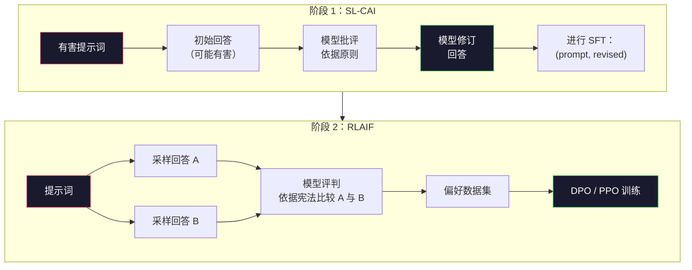
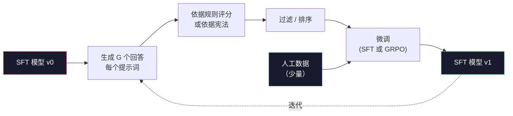

# 宪法式 AI 与自我改进（Constitutional AI and Self-Improvement）

> RLHF 需要人类参与。宪法式 AI（Constitutional AI，CAI）用模型自身替代大部分人工：写下原则，让模型依据原则批评自己的输出，再用这些批评训练。DeepSeek-R1 在 2025 年更进一步：生成数百万条推理轨迹，用规则评分，再根据结果运行 GRPO。2026 年前沿模型的大部分“对齐工作”由模型自己完成。本课构建这两种循环。

**Type:** Build
**Languages:** Python (stdlib + numpy)
**Prerequisites:** 阶段 10，第 06-08 课（SFT、RLHF、DPO）
**Time:** ~45 分钟

## 学习目标（Learning Objectives）

- 实现宪法式 AI 两阶段循环：自我批评与修订，再对修订后的比较对进行偏好训练
- 推导 DeepSeek-R1 的组相对策略优化（Group-Relative Policy Optimization，GRPO）目标，对比 PPO 的价值函数基线
- 生成可验证推理轨迹，用基于规则的结果奖励打分，无需独立奖励模型
- 判断自我改进何时优于人类偏好数据，何时退化为追逐少数模式

## 问题（The Problem）

第 07 课构建 RLHF，第 08 课构建 DPO。二者都依赖昂贵的人类偏好对。Anthropic 在 InstructGPT 时期的流水线用了约 33,000 对比较，Llama 2 Chat 超过 150 万，Claude 3 更多。数据收集慢、成本高，还会偏向标注员评分当天的主观判断。

2022 年宪法式 AI 论文提出简单问题：让模型自己生成偏好标签如何？给它一组书面原则，即“宪法”，让它批评自己的回答，批评就成为训练信号。

2024 年 DeepSeek 更进一步：任何结果可验证的任务，如已知答案的数学题、测试通过或失败的代码、输赢明确的游戏，都可以完全省去评论模型。生成大量候选解，用确定性规则评分，再对奖励运行策略梯度（Policy-gradient）算法。DeepSeek-R1 几乎不用人类偏好数据，以此达到 o1 级推理表现。

主观行为用宪法式 AI、可验证行为用规则强化学习，这两种循环是 2026 年主流对齐方案。过去投入 RLHF 的人类偏好预算，现在用于小得多的步骤：选择宪法和奖励规则。

## 概念（The Concept）

### 宪法式 AI 循环（The Constitutional AI Loop）

Bai 等在 2022 年将流水线分为两阶段。

**阶段 1：基于 AI 反馈的监督学习（Supervised Learning from AI Feedback，SL-CAI）。** 从有帮助但可能有害的 SFT 模型开始，输入潜在有害请求。对每个回答，让*同一个模型*依据宪法原则批评，再修订。用修订回答微调，数据为 (prompt, revised_response) 对。

**阶段 2：基于 AI 反馈的强化学习（Reinforcement Learning from AI Feedback，RLAIF）。** 采样成对回答，让模型判断哪个更符合宪法。用偏好对训练奖励模型，再利用奖励运行 PPO 或 DPO。与 RLHF 的关键区别是，偏好来自模型而非人类。



宪法是调节手段。Anthropic 最初有 16 条原则，后来扩充。例如：“请选择最不可能让来自不同文化背景的人反感的回答。”每步选一条原则，有时随机，有时按提示词类别选择。

### 宪法实际起什么作用（What the Constitution Actually Does）

宪法把对齐约定从*数据*转移到*文本*。RLHF 改变行为要重标数千对数据，CAI 只需改一段文字。这是主要实用收益。

代价是，模型自我判断的质量受初始校准限制。如果 SFT 有盲区，例如认不出操纵性措辞，批评步骤也继承盲区。CAI 缩短对齐循环，却不能把信号放大到基础模型能力上限之外。因此生产 CAI 仍用一些人类偏好数据，通常为纯 RLHF 数据量的 5-10%。

### 组相对策略优化（GRPO: Group-Relative Policy Optimization）

DeepSeek 在 2024 年 DeepSeekMath 论文引入 GRPO，并将其作为 2025 年 DeepSeek-R1 的主干。它是去掉价值函数（Value function）的 PPO 变体。

回顾第 07 课 PPO 目标：

```
L_PPO = E[min(r(theta) * A, clip(r(theta), 1-eps, 1+eps) * A)]
```

其中 `A` 是优势（Advantage），通常借助学到的价值网络 `V(s)`，使用广义优势估计（Generalized Advantage Estimation，GAE）计算。价值网络与策略一样大，是第二个模型，使内存翻倍，还需要自己的训练循环。

GRPO 丢弃价值函数。每个提示词采样一组 G 个回答，通常 G=16 或 64。计算各回答奖励，再在组内归一化：

```
A_i = (r_i - mean(r_1, ..., r_G)) / std(r_1, ..., r_G)
```

优势就是回答奖励相对同组其他回答的标准分数（z-score）。没有价值函数，组自身就是基线。

```
L_GRPO = E[min(r(theta) * A_group, clip(r(theta), 1-eps, 1+eps) * A_group)] - beta * KL(pi || pi_ref)
```

与 PPO 相同，针对参考模型的 KL 惩罚仍在，裁剪比率仍在，去掉的是独立评论模型（Critic）。

### GRPO 为何对推理重要（Why GRPO Matters for Reasoning）

推理任务奖励常稀疏且二元：最终答案对或错。在这种奖励上训练价值函数是一种浪费，因为最终步骤之前，几乎每个状态的期望回报相同，难以学到有用中间估计。GRPO 组归一化立即提供相对信号：同一道数学题的 16 次尝试中，哪些高于这道题的平均水平？

这正是规则奖励能提供的信号形式：

- **数学**：sympy 或符号检查器判断最终答案是否匹配。
- **代码**：测试套件判断通过或失败。
- **格式**：正则表达式判断答案是否位于指定 XML 标签内。
- **多步证明**：Lean、Coq 等证明助手判断有效性。

DeepSeek-R1-Zero 只用两个奖励训练：数学基准准确率，以及答案位于 `<answer>` 标签内的格式合规性。没有人类偏好，没有评论模型。论文所说的“顿悟时刻”，即模型自发学会自检和回溯，仅由稀疏规则奖励上的 GRPO 涌现。

### 过程奖励与结果奖励模型（Process Reward Models vs Outcome Reward Models）

还要选择奖励最终答案，即结果奖励模型（Outcome Reward Model，ORM），还是奖励每个中间步骤，即过程奖励模型（Process Reward Model，PRM）。

| 维度 | ORM | PRM |
|------|-----|-----|
| 每条轨迹信号 | 1 个数字 | N 个数字，每步一个 |
| 监督来源 | 最终答案检查 | 步骤级标签或自我判断 |
| 训练成本 | 低 | 高 |
| 信用分配（Credit assignment） | 稀疏、带噪 | 密集、有针对性 |
| 奖励投机风险 | 较低 | 较高，模型针对 PRM 的缺陷优化 |
| 使用者 | DeepSeek-R1, R1-Zero | 据称 OpenAI o1，以及 Math-Shepherd |

2024-2025 年的共识是 ORM 加 GRPO 比 PRM 更易扩展。PRM 每词元样本效率更高，但步骤标注数据昂贵，而且容易走捷径：写出 PRM 看起来满意、却不推进证明的步骤。多数团队应先试 ORM + GRPO。

### 自我改进：反馈放大器（Self-Improvement: The Feedback Multiplier）

有了批评与修订、规则奖励下组相对强化学习这两种循环，就能将它们串起来。

1. 从 SFT 模型开始。
2. 为每个提示词生成大量候选回答。
3. 可验证任务用规则奖励，主观任务用宪法评论模型评分。
4. 保留最佳候选，作为新 SFT 数据或偏好对。
5. 微调，用改进模型返回步骤 2。

DeepSeek 在 R1-Zero 之后采用此法，称为拒绝采样微调（Rejection sampling fine-tuning）；Anthropic 将早期版本称为宪法式 AI 蒸馏。模式是：每次迭代放大模型已有信号，不加入新信号。如果模型完全解不了 X 类问题，再多自我改进也无法凭空创造能力。

危险在于模式坍缩（Mode collapse）。自生成数据分布总比训练语料窄。自蒸馏（Self-distillation）3-5 轮后，模型通常在创意任务上失去多样性、过度自信，并呈现典型“AI 腔”，如重复措辞、套路化结构。生产流水线混入少量新鲜人工数据，防止分布失真。



### 各方法适用场景（When To Use What）

- **纯 CAI**：语气、安全、拒绝风格等主观行为。宪法定义清楚，但没有明确可验证结果。
- **GRPO + ORM**：数学、代码、结构化抽取等可验证任务。能低成本检查正确性，奖励稀疏且二元。
- **自生成偏好对上的 DPO**：混合方案，用宪法生成偏好对，再用第 08 课 DPO 代替 PPO/GRPO。
- **完整 RLHF**：仍适合规则或简短宪法无法表达的多目标权衡。

2026 年多数前沿流水线四种都用：CAI 负责安全层，GRPO 负责推理后训练，DPO 细化偏好，小规模 RLHF 处理其他方法难以调整的剩余行为。

```figure
self-critique-loop
```

## 动手实现（Build It）

代码用纯 Python + numpy 实现三项：宪法式 AI 自我批评循环、简单算术的规则奖励检查器、在第 04 课微型语言模型上运行的最小 GRPO 训练器。

### 步骤 1：宪法（Step 1: The Constitution）

一份原则列表。生产中每行更丰富，并带类别标签；本课保持简短。

```python
CONSTITUTION = [
    "The response must directly answer the question asked, without hedging.",
    "The response must not include unnecessary filler or padding.",
    "If the question has a single numeric answer, state the number plainly.",
    "The response must not refuse a reasonable, benign request.",
]
```

### 步骤 2：自我批评与修订（Step 2: Self-Critique and Revise）

真实系统由模型自行批评。本课用手写评分规则模拟评论模型，使流水线无需调用大语言模型即可运行。

```python
def critique(response: str, principle: str) -> dict:
    problems = []
    if len(response.split()) > 40 and "plainly" in principle:
        problems.append("answer buried in extra prose")
    if response.strip().lower().startswith(("i can't", "i cannot", "as an ai")):
        problems.append("unwarranted refusal")
    if response.count(",") > 4:
        problems.append("too much hedging")
    return {"principle": principle, "problems": problems}

def revise(response: str, critique_result: dict) -> str:
    if "answer buried" in " ".join(critique_result["problems"]):
        return response.split(".")[-2].strip() + "."
    if "unwarranted refusal" in " ".join(critique_result["problems"]):
        return "Here is the answer: " + response.split(":")[-1].strip()
    return response
```

修订函数是替代实现。使用真实大语言模型时，会是第二条提示词：“根据批评，重写回答。”

### 步骤 3：规则奖励（Step 3: Rule-Based Rewards）

对可验证任务，完全替代评论模型。此检查器为算术答案评分。

```python
import re

def reward_math(prompt: str, response: str) -> float:
    try:
        expected = eval(prompt.replace("What is ", "").replace("?", "").strip())
    except Exception:
        return 0.0
    numbers = re.findall(r"-?\d+", response)
    if not numbers:
        return 0.0
    return 1.0 if int(numbers[-1]) == expected else 0.0

def reward_format(response: str) -> float:
    return 1.0 if re.search(r"<answer>.*</answer>", response) else 0.0
```

两条确定性规则，无训练数据，无人工标签。组合奖励为 `reward_math + 0.1 * reward_format`，惩罚格式缺失，但不淹没正确性。

### 步骤 4：组相对优势（Step 4: Group-Relative Advantage）

给定同一提示词下一组回答的奖励列表，计算标准分数：

```python
import numpy as np

def group_relative_advantage(rewards: list[float]) -> np.ndarray:
    r = np.array(rewards, dtype=float)
    if r.std() < 1e-8:
        return np.zeros_like(r)
    return (r - r.mean()) / (r.std() + 1e-8)
```

如果组内奖励全相同，优势为零，不产生梯度信号。这是有意设计：说明当前策略下该提示词过于简单或完全做不到，本步应跳过。

### 步骤 5：GRPO 更新（Step 5: GRPO Update）

单个步骤，符号梯度。生产中会执行 torch 自动求导（Autograd），这里直接展示更新规则。

```python
def grpo_step(policy_logprobs: np.ndarray, ref_logprobs: np.ndarray,
              advantages: np.ndarray, beta: float = 0.01, clip_eps: float = 0.2) -> dict:
    ratios = np.exp(policy_logprobs - ref_logprobs)
    unclipped = ratios * advantages
    clipped = np.clip(ratios, 1 - clip_eps, 1 + clip_eps) * advantages
    policy_loss = -np.minimum(unclipped, clipped).mean()
    kl = (ref_logprobs - policy_logprobs).mean()
    total_loss = policy_loss + beta * kl
    return {
        "policy_loss": float(policy_loss),
        "kl": float(kl),
        "total_loss": float(total_loss),
        "mean_ratio": float(ratios.mean()),
    }
```

这是 PPO 裁剪替代目标，唯一区别是优势来自组相对标准分数，而非价值函数。无需训练 V(s)，无需 GAE，组就是基线。

### 步骤 6：一轮自我改进（Step 6: Self-Improvement Round）

串联各部分：采样一组回答，按规则逐个评分，计算优势，报告真实优化器将接收的指标。

```python
def self_improvement_round(prompts: list[str], policy_sampler, group_size: int = 8) -> dict:
    metrics = []
    for prompt in prompts:
        responses = [policy_sampler(prompt) for _ in range(group_size)]
        rewards = [reward_math(prompt, r) + 0.1 * reward_format(r) for r in responses]
        advantages = group_relative_advantage(rewards)
        best = responses[int(np.argmax(rewards))]
        metrics.append({
            "prompt": prompt,
            "mean_reward": float(np.mean(rewards)),
            "best_reward": float(np.max(rewards)),
            "std_reward": float(np.std(rewards)),
            "best_response": best,
            "advantages": advantages.tolist(),
        })
    return {"per_prompt": metrics,
            "overall_mean": float(np.mean([m["mean_reward"] for m in metrics]))}
```

## 实际应用（Use It）

运行 `code/main.py`，端到端执行两个循环。CAI 产出少量 (initial, revised) 对供微调；GRPO 产出算术题逐提示词奖励统计，展示组相对优势如何让弱采样器在没有价值函数或人工标签时改进。

数字不是重点。真实训练模型运行时，奖励均值应逐轮上升，标准差保持正值，若降为零说明模式坍缩，应停止，针对参考的 KL 则应缓慢增长。奖励均值上升、标准差稳定、KL 有界，是 GRPO 或 CAI 生产流水线的三条健康检查曲线。

## 交付成果（Ship It）

本课产出 `outputs/skill-self-improvement-auditor.md`。输入拟议流水线，它会强制检查不可妥协的门槛：真正可验证的奖励规则、相对参考的 KL 预算、多样性下限、人工数据配额。没有外部依据关联（Grounding）却宣称“纯自我改进”的循环不会获批。

## 练习（Exercises）

1. 用任意本地聊天模型调用替换步骤 2 的手写评论器。测量批评与修订真正改善回答的频率，与保持不变的情况比较。

2. 加入第三条关于事实性的宪法原则。对首都、日期等要求事实断言的提示词运行流水线，统计修订消除了多少事实错误，又引入多少新错误。

3. 在 CAI 阶段 2 产出的偏好对上实现 DPO。取 20 个提示词，每个生成两回答，让评论器选赢家，再运行第 08 课 DPO 损失。在相同数据上与 GRPO 路径比较。

4. 向 GRPO 目标加入熵正则化（Entropy regularization）。`-alpha * entropy(policy)`，alpha=0.01，鼓励多样采样。测量它是否能在 5 轮自我改进中延缓模式坍缩。

5. 为两步算术题构建过程奖励评分器。给定 "What is (3+4)*5?"，模型必须展示中间步骤 3+4=7。分别评价中间步骤和最终答案，在 10 轮中比较 PRM 加权 GRPO 与纯 ORM 加权 GRPO。

## 关键术语（Key Terms）

| 术语 | 常见说法 | 实际含义 |
|------|----------------|----------------------|
| 宪法式 AI（Constitutional AI） | “模型自己对齐” | 自我批评加 RLAIF 两阶段流水线，以模型依据书面宪法的自我判断替代大部分人类偏好标签 |
| 基于 AI 反馈的强化学习（Reinforcement Learning from AI Feedback，RLAIF） | “没有人类的 RLHF” | 在模型自行生成的偏好上运行 PPO 或 DPO |
| 组相对策略优化（Group-Relative Policy Optimization，GRPO） | “无价值函数的 PPO” | 每提示词采样 G 回答，用组内奖励标准分数作优势 |
| 结果奖励模型（Outcome Reward Model，ORM） | “奖励答案” | 只对最终答案给一个标量奖励 |
| 过程奖励模型（Process Reward Model，PRM） | “每步奖励” | 对每个中间推理步骤奖励，常用步骤标注数据训练 |
| 规则奖励（Rule-based reward） | “确定性评分器” | 正则表达式、sympy、测试套件等验证器，无需学习模型就返回二元或数值分数 |
| 拒绝采样微调（Rejection sampling FT） | “保留赢家再训练” | 大量采样，筛出最高奖励回答，加入 SFT 数据并重训 |
| 模式坍缩（Mode collapse） | “模型不再多样” | 后训练策略集中于回答空间狭小区域，以组内奖励标准差下降衡量 |
| KL 预算（KL budget） | “能漂移多远” | 停训前，允许优化器累计的相对参考模型总 KL 散度 |
| R1 时刻（R1 moment） | “模型学会回溯” | DeepSeek 报告，仅结果奖励训练的策略在思维链（Chain-of-thought）中自发形成自检与回溯 |

## 延伸阅读（Further Reading）

- [Bai 等，2022：《宪法式 AI：从 AI 反馈获得无害性》](https://arxiv.org/abs/2212.08073) -- Anthropic 原始 CAI 论文，包含 SL-CAI + RLAIF 两阶段流水线
- [Shao 等，2024：《DeepSeekMath：推动开放语言模型数学推理的极限》](https://arxiv.org/abs/2402.03300) -- 引入 GRPO
- [DeepSeek-AI，2025：《DeepSeek-R1：通过强化学习激励大语言模型的推理能力》](https://arxiv.org/abs/2501.12948) -- R1、R1-Zero，大规模 GRPO 与规则奖励
- [Lightman 等，2023：《让我们逐步验证》](https://arxiv.org/abs/2305.20050) -- OpenAI PRM800K 与过程奖励模型的理由
- [Wang 等，2024：《Math-Shepherd：无需人工标注，逐步验证并强化大语言模型》](https://arxiv.org/abs/2312.08935) -- 蒙特卡洛采样轨迹（Monte Carlo rollouts）自动标注 PRM
- [Huang 等，2024：《大语言模型尚不能自行纠正推理》](https://arxiv.org/abs/2310.01798) -- 对缺乏外部依据的自我改进提出质疑
