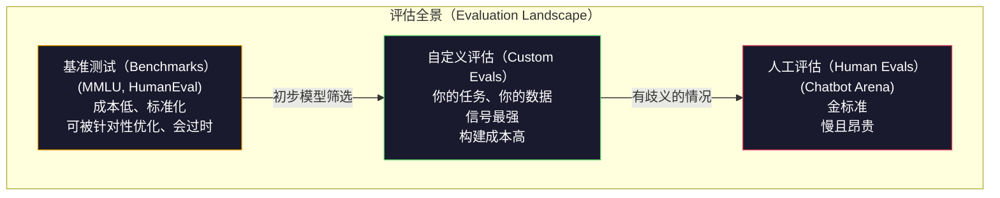
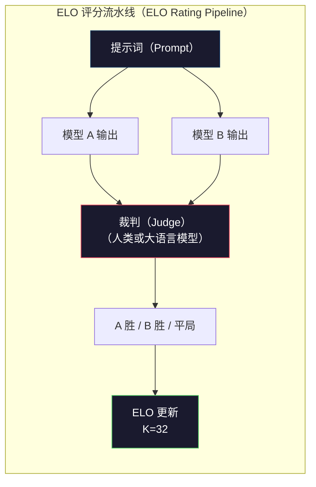

# 评估：基准测试、专项评估与 LM Harness（Evaluation: Benchmarks, Evals, LM Harness）

> 古德哈特定律（Goodhart's Law）：当一个度量成为目标，它就不再是好的度量。每家前沿实验室都在针对基准测试优化。大规模多任务语言理解（Massive Multitask Language Understanding，MMLU）分数持续上涨，模型却仍不能可靠地数出 "strawberry" 中 R 的数量。真正重要的评估，是使用你自己的数据、面向你自己的任务而构建的评估。

**Type:** Build
**Languages:** Python
**Prerequisites:** 阶段 10，第 01-05 课（从零构建大语言模型，LLMs from Scratch）
**Time:** ~90 分钟

## 学习目标（Learning Objectives）

- 构建自定义评估框架（Evaluation Harness），对语言模型运行选择题和开放式基准测试
- 解释标准基准测试（MMLU、HumanEval）为何趋于饱和，无法区分前沿模型
- 使用恰当的指标实现任务专用评估：精确匹配（Exact Match）、F1、双语评估替补（Bilingual Evaluation Understudy，BLEU）及大语言模型裁判（LLM-as-Judge）评分
- 针对你的具体使用场景设计自定义评估套件，而不只是依赖公开排行榜

## 问题（The Problem）

MMLU 于 2020 年发布，包含覆盖 57 个学科的 15,908 道题。三年内，前沿模型就让它趋于饱和。GPT-4 得分 86.4%，Claude 3 Opus 得分 86.8%，Llama 3 405B 得分 88.6%。排行榜被压缩到 3 分的区间，其中的差异是统计噪声，而非真正的能力差距。

与此同时，这些模型却无法完成 10 岁孩子不假思索就能解决的任务。MMLU 得分 88.7% 的 Claude 3.5 Sonnet 最初无法数出 "strawberry" 中的字母：这项任务既不需要世界知识，也不需要推理，只需逐字符遍历。HumanEval 用 164 道题测试代码生成。模型在其中得分超过 90%，却仍会生成在初级开发者都能发现的边界情况上崩溃的代码。

基准测试表现与现实可靠性之间的差距，是大语言模型（Large Language Model，LLM）评估的核心问题。基准测试告诉你模型在该测试上的表现，却几乎无法告诉你它在你的具体任务、数据和故障模式下会表现如何。如果你在构建客服机器人，MMLU 并不相关。如果你在构建编程助手，HumanEval 只覆盖函数级生成，无法说明模型调试、重构或跨文件解释代码的能力。

你需要自定义评估。并不是因为基准测试无用，它们适合初步筛选模型；而是因为最终评估必须准确匹配你的部署条件。

## 概念（The Concept）

### 评估全景（The Eval Landscape）

评估分为三类，它们的成本和信号质量各不相同。

**基准测试（Benchmark）**是标准化测试套件，例如 MMLU、HumanEval、SWE-bench、MATH、ARC 和 HellaSwag。让模型运行基准测试，即可得到分数。优点是大家使用同一套测试，能够比较模型。缺点是模型和训练数据对这些基准测试的污染日益严重。实验室使用含有基准题目的数据训练，分数提高了，能力却未必提高。

**自定义评估（Custom Eval）**是针对你的具体场景构建的测试套件。由你定义输入、预期输出和评分函数。法律文档摘要器就应使用法律文档评估；SQL 生成器就应针对你的数据库模式评估。构建它们的成本很高，但只有这类评估能预测生产表现。

**人工评估（Human Eval）**使用付费标注员，依据有用性、正确性、流畅性和安全性等标准判断模型输出。对于自动评分失效的开放式任务，它是金标准。Chatbot Arena 已为 100 多个模型收集了超过 200 万次人类偏好投票。缺点是成本（每次判断 $0.10-$2.00）和速度（数小时到数天）。



### 基准测试为何失效（Why Benchmarks Break）

三种机制会使基准测试分数不再反映真实能力。

**数据污染（Data Contamination）。**训练语料来自互联网抓取，基准题目也存在于互联网上，因此模型在训练时见过答案。这不是传统意义的作弊，实验室并非故意加入基准数据；但网络规模的抓取使其几乎无法被排除。

**应试训练（Teaching to the Test）。**实验室为提高基准表现而优化训练数据混合比例。如果训练数据中有 5% 是 MMLU 风格的选择题，模型就会学会题型和答案分布。MMLU 是四选一选择题。模型会学到答案在 A/B/C/D 上大致均匀分布，即使不知道答案，这也能提供帮助。

**饱和（Saturation）。**当所有前沿模型在某个基准上都达到 85-90% 时，该基准就失去了区分能力。剩余 10-15% 的题可能有歧义、标注错误，或需要冷门领域知识。MMLU 从 87% 提升到 89%，可能意味着模型多记住了两道冷门题，并非变得更聪明。

### 困惑度：快速健康检查（Perplexity: A Quick Health Check）

困惑度（Perplexity，PPL）衡量模型对一串词元（Token）的惊讶程度。形式上，它等于平均负对数似然（Negative Log-likelihood）的指数：

```
PPL = exp(-1/N * sum(log P(token_i | context)))
```

困惑度为 10，意味着模型在每个词元位置上的平均不确定性，相当于在 10 个选项中均匀选择。越低越好。GPT-2 在 WikiText-103 上的困惑度约为 30，GPT-3 约为 20，Llama 3 8B 约为 7。

困惑度适合在同一测试集上比较模型，但也有盲点。模型可能因为擅长预测常见模式而具有较低困惑度，却不擅长处理罕见但重要的模式。困惑度也不能说明指令遵循、推理过程或事实准确性。应把它作为合理性检查，而非最终判决。

### 大语言模型裁判（LLM-as-Judge）

用强模型评估弱模型的输出。思路很简单：让 GPT-4o 或 Claude Sonnet 在正确性、有用性和安全性上为回答打 1-5 分。使用 GPT-4o-mini 时，每次判断约花费 $0.01，与人类判断的相关程度出乎意料地高，在多数任务上约有 80% 的一致率。

评分提示词比模型本身更重要。含糊的提示词（“为这个回答评分”）会产生噪声较大的分数。带评分量表（Rubric）的结构化提示词（“答案事实正确且引用来源得 5 分；正确但没有来源得 4 分；部分正确得 3 分……”）能产生一致、可复现的分数。

故障模式：裁判模型会表现出位置偏差（Position Bias，在成对比较中偏爱第一个回答）、冗长偏差（Verbosity Bias，偏爱较长回答）和自我偏好（Self-preference，GPT-4 给自己的输出打分高于同等质量的 Claude 输出）。缓解方法：随机化顺序、按长度归一化，并使用不同于被评估模型的裁判。

### 从成对比较得到 ELO 评分（ELO Ratings from Pairwise Comparisons）

这是 Chatbot Arena 的方法。展示不同模型对同一提示词的两个回答，由人类或大语言模型裁判选出更好的回答。从数千次比较中计算每个模型的 ELO 评分，使用的就是国际象棋中的同一套系统。

ELO 的优点：相对排名比绝对评分更可靠，能自然处理平局，与逐个独立评分输出相比，只需更少的比较就能收敛。截至 2026 年初，Chatbot Arena 排名显示，榜首的 GPT-4o、Claude 3.5 Sonnet 和 Gemini 1.5 Pro 彼此相差不超过 20 个 ELO 分。



### 评估框架（Eval Frameworks）

**lm-evaluation-harness**（EleutherAI）：标准开源评估框架，支持 200 多个基准测试。一条命令即可让任意 Hugging Face 模型运行 MMLU、HellaSwag、ARC 等测试。Open LLM Leaderboard 使用它进行评估。

**RAGAS**：专门面向检索增强生成（Retrieval-Augmented Generation，RAG）流水线的评估框架。衡量忠实性（Faithfulness，回答是否符合检索到的上下文）、相关性（Relevance，检索到的上下文是否与问题相关）和答案正确性。

**promptfoo**：配置驱动的提示词工程评估。在 YAML 中定义测试用例，对多个模型运行，得到通过或失败报告。它适合做提示词回归测试，确保提示词修改不会破坏已有测试用例。

### 构建自定义评估（Building Custom Evals）

这是对生产真正有意义的评估。流程如下：

1. **定义任务。**模型究竟应该做什么？必须精确。“回答问题”太含糊。“给定一封客户投诉邮件，提取产品名、问题类别和情感倾向”才是可评估的任务。

2. **创建测试用例。**原型评估至少需要 50 个用例，生产需要 200 个以上。每个用例都是一个 (input, expected_output) 对。纳入边界情况：空输入、对抗性输入、含糊输入和其他语言的输入。

3. **定义评分。**结构化输出采用精确匹配。文本相似度采用 BLEU/ROUGE。开放式质量采用大语言模型裁判。抽取任务采用 F1。为多个指标加权组合。

4. **自动化。**每次评估都通过一条命令运行，不含手动步骤。以便于纵向比较的格式保存结果。

5. **持续跟踪。**孤立的评估分数没有意义，你需要趋势线。上次修改提示词后分数提高了吗？切换模型后是否退化？评估应与提示词一同进行版本管理。

| 评估类型 | 每次判断成本 | 与人类的一致率 | 最适用场景 |
|-----------|------------------|----------------------|----------|
| 精确匹配（Exact Match） | ~$0 | 100%（适用时） | 结构化输出、分类 |
| BLEU/ROUGE | ~$0 | ~60% | 翻译、摘要 |
| 大语言模型裁判（LLM-as-judge） | ~$0.01 | ~80% | 开放式生成 |
| 人工评估（Human Eval） | $0.10-$2.00 | 不适用（本身就是真值） | 有歧义、高风险任务 |

```figure
perplexity-loss
```

## 动手实现（Build It）

### 第 1 步：最小评估框架（Step 1: A Minimal Eval Framework）

定义核心抽象。一个评估用例包含输入、预期输出和可选的元数据字典。评分器接收预测与参考答案，返回 0 到 1 之间的分数。

```python
import json
from collections import Counter

class EvalCase:
    def __init__(self, input_text, expected, metadata=None):
        self.input_text = input_text
        self.expected = expected
        self.metadata = metadata or {}

class EvalSuite:
    def __init__(self, name, cases, scorers):
        self.name = name
        self.cases = cases
        self.scorers = scorers

    def run(self, model_fn):
        results = []
        for case in self.cases:
            prediction = model_fn(case.input_text)
            scores = {}
            for scorer_name, scorer_fn in self.scorers.items():
                scores[scorer_name] = scorer_fn(prediction, case.expected)
            results.append({
                "input": case.input_text,
                "expected": case.expected,
                "prediction": prediction,
                "scores": scores,
            })
        return results
```

### 第 2 步：评分函数（Step 2: Scoring Functions）

实现精确匹配、词元 F1（Token F1）和模拟的大语言模型裁判评分器。

```python
def exact_match(prediction, expected):
    return 1.0 if prediction.strip().lower() == expected.strip().lower() else 0.0

def token_f1(prediction, expected):
    pred_tokens = set(prediction.lower().split())
    exp_tokens = set(expected.lower().split())
    if not pred_tokens or not exp_tokens:
        return 0.0
    common = pred_tokens & exp_tokens
    precision = len(common) / len(pred_tokens)
    recall = len(common) / len(exp_tokens)
    if precision + recall == 0:
        return 0.0
    return 2 * (precision * recall) / (precision + recall)

def llm_judge_simulated(prediction, expected):
    pred_words = set(prediction.lower().split())
    exp_words = set(expected.lower().split())
    if not exp_words:
        return 0.0
    overlap = len(pred_words & exp_words) / len(exp_words)
    length_penalty = min(1.0, len(prediction) / max(len(expected), 1))
    return round(overlap * 0.7 + length_penalty * 0.3, 3)
```

### 第 3 步：ELO 评分系统（Step 3: ELO Rating System）

实现带 ELO 更新的成对比较。这正是 Chatbot Arena 用来给模型排名的系统。

```python
class ELOTracker:
    def __init__(self, k=32, initial_rating=1500):
        self.ratings = {}
        self.k = k
        self.initial_rating = initial_rating
        self.history = []

    def _ensure_player(self, name):
        if name not in self.ratings:
            self.ratings[name] = self.initial_rating

    def expected_score(self, rating_a, rating_b):
        return 1 / (1 + 10 ** ((rating_b - rating_a) / 400))

    def record_match(self, player_a, player_b, outcome):
        self._ensure_player(player_a)
        self._ensure_player(player_b)

        ea = self.expected_score(self.ratings[player_a], self.ratings[player_b])
        eb = 1 - ea

        if outcome == "a":
            sa, sb = 1.0, 0.0
        elif outcome == "b":
            sa, sb = 0.0, 1.0
        else:
            sa, sb = 0.5, 0.5

        self.ratings[player_a] += self.k * (sa - ea)
        self.ratings[player_b] += self.k * (sb - eb)

        self.history.append({
            "a": player_a, "b": player_b,
            "outcome": outcome,
            "rating_a": round(self.ratings[player_a], 1),
            "rating_b": round(self.ratings[player_b], 1),
        })

    def leaderboard(self):
        return sorted(self.ratings.items(), key=lambda x: -x[1])
```

### 第 4 步：计算困惑度（Step 4: Perplexity Calculation）

使用词元概率计算困惑度。实际使用时，这些概率来自模型的逻辑值（Logits）。这里用概率分布进行模拟。

```python
import numpy as np

def perplexity(log_probs):
    if not log_probs:
        return float("inf")
    avg_neg_log_prob = -np.mean(log_probs)
    return float(np.exp(avg_neg_log_prob))

def token_log_probs_simulated(text, model_quality=0.8):
    np.random.seed(hash(text) % 2**31)
    tokens = text.split()
    log_probs = []
    for i, token in enumerate(tokens):
        base_prob = model_quality
        if len(token) > 8:
            base_prob *= 0.6
        if i == 0:
            base_prob *= 0.7
        prob = np.clip(base_prob + np.random.normal(0, 0.1), 0.01, 0.99)
        log_probs.append(float(np.log(prob)))
    return log_probs
```

### 第 5 步：汇总结果（Step 5: Aggregate Results）

计算一次评估运行的汇总统计：均值、中位数、给定阈值下的通过率，以及按指标细分的结果。

```python
def summarize_results(results, threshold=0.8):
    all_scores = {}
    for r in results:
        for metric, score in r["scores"].items():
            all_scores.setdefault(metric, []).append(score)

    summary = {}
    for metric, scores in all_scores.items():
        arr = np.array(scores)
        summary[metric] = {
            "mean": round(float(np.mean(arr)), 3),
            "median": round(float(np.median(arr)), 3),
            "std": round(float(np.std(arr)), 3),
            "min": round(float(np.min(arr)), 3),
            "max": round(float(np.max(arr)), 3),
            "pass_rate": round(float(np.mean(arr >= threshold)), 3),
            "n": len(scores),
        }
    return summary

def print_summary(summary, suite_name="Eval"):
    print(f"\n{'=' * 60}")
    print(f"  {suite_name} Summary")
    print(f"{'=' * 60}")
    for metric, stats in summary.items():
        print(f"\n  {metric}:")
        print(f"    Mean:      {stats['mean']:.3f}")
        print(f"    Median:    {stats['median']:.3f}")
        print(f"    Std:       {stats['std']:.3f}")
        print(f"    Range:     [{stats['min']:.3f}, {stats['max']:.3f}]")
        print(f"    Pass rate: {stats['pass_rate']:.1%} (threshold >= 0.8)")
        print(f"    N:         {stats['n']}")
```

### 第 6 步：运行完整流水线（Step 6: Run the Full Pipeline）

连接所有组件：定义任务、创建测试用例、模拟两个模型、运行评估、从成对比较计算 ELO，并打印排行榜。

```python
def demo_model_good(prompt):
    responses = {
        "What is the capital of France?": "Paris",
        "What is 2 + 2?": "4",
        "Who wrote Hamlet?": "William Shakespeare",
        "What language is PyTorch written in?": "Python and C++",
        "What is the boiling point of water?": "100 degrees Celsius",
    }
    return responses.get(prompt, "I don't know")

def demo_model_bad(prompt):
    responses = {
        "What is the capital of France?": "Paris is the capital city of France",
        "What is 2 + 2?": "The answer is four",
        "Who wrote Hamlet?": "Shakespeare",
        "What language is PyTorch written in?": "Python",
        "What is the boiling point of water?": "212 Fahrenheit",
    }
    return responses.get(prompt, "Unknown")

cases = [
    EvalCase("What is the capital of France?", "Paris"),
    EvalCase("What is 2 + 2?", "4"),
    EvalCase("Who wrote Hamlet?", "William Shakespeare"),
    EvalCase("What language is PyTorch written in?", "Python and C++"),
    EvalCase("What is the boiling point of water?", "100 degrees Celsius"),
]

suite = EvalSuite(
    name="General Knowledge",
    cases=cases,
    scorers={
        "exact_match": exact_match,
        "token_f1": token_f1,
        "llm_judge": llm_judge_simulated,
    },
)

results_good = suite.run(demo_model_good)
results_bad = suite.run(demo_model_bad)

print_summary(summarize_results(results_good), "Model A (concise)")
print_summary(summarize_results(results_bad), "Model B (verbose)")
```

“好”模型给出精确答案，“差”模型给出冗长改写。精确匹配会严重惩罚冗长模型，词元 F1 和大语言模型裁判则更宽容。这说明了指标选择的重要性：同一模型看起来出色还是糟糕，取决于你如何评分。

### 第 7 步：ELO 锦标赛（Step 7: ELO Tournament）

在多个轮次中对模型进行成对比较。

```python
elo = ELOTracker(k=32)

for case in cases:
    pred_a = demo_model_good(case.input_text)
    pred_b = demo_model_bad(case.input_text)

    score_a = token_f1(pred_a, case.expected)
    score_b = token_f1(pred_b, case.expected)

    if score_a > score_b:
        outcome = "a"
    elif score_b > score_a:
        outcome = "b"
    else:
        outcome = "tie"

    elo.record_match("model_a_concise", "model_b_verbose", outcome)

print("\nELO Leaderboard:")
for name, rating in elo.leaderboard():
    print(f"  {name}: {rating:.0f}")
```

### 第 8 步：困惑度比较（Step 8: Perplexity Comparison）

比较不同质量水平的“模型”的困惑度。

```python
test_text = "The quick brown fox jumps over the lazy dog in the garden"

for quality, label in [(0.9, "Strong model"), (0.7, "Medium model"), (0.4, "Weak model")]:
    log_probs = token_log_probs_simulated(test_text, model_quality=quality)
    ppl = perplexity(log_probs)
    print(f"  {label} (quality={quality}): perplexity = {ppl:.2f}")
```

## 实际应用（Use It）

### lm-evaluation-harness (EleutherAI)

在任意模型上运行基准测试的标准工具。

```python
# pip install lm-eval
# Command line:
# lm_eval --model hf --model_args pretrained=meta-llama/Llama-3.1-8B --tasks mmlu --batch_size 8

# Python API:
# import lm_eval
# results = lm_eval.simple_evaluate(
#     model="hf",
#     model_args="pretrained=meta-llama/Llama-3.1-8B",
#     tasks=["mmlu", "hellaswag", "arc_easy"],
#     batch_size=8,
# )
# print(results["results"])
```

### promptfoo

用于提示词工程的配置驱动评估。在 YAML 中定义测试，并对多个服务提供商运行。

```yaml
# promptfoo.yaml
providers:
  - openai:gpt-4o-mini
  - anthropic:claude-3-haiku

prompts:
  - "Answer in one word: {{question}}"

tests:
  - vars:
      question: "What is the capital of France?"
    assert:
      - type: contains
        value: "Paris"
  - vars:
      question: "What is 2 + 2?"
    assert:
      - type: equals
        value: "4"
```

### 使用 RAGAS 评估 RAG（RAGAS for RAG evaluation）

```python
# pip install ragas
# from ragas import evaluate
# from ragas.metrics import faithfulness, answer_relevancy, context_precision
#
# result = evaluate(
#     dataset,
#     metrics=[faithfulness, answer_relevancy, context_precision],
# )
# print(result)
```

RAGAS 衡量通用评估遗漏的方面：模型答案是否以检索到的上下文为依据，而不只是在抽象意义上“正确”。

## 交付成果（Ship It）

本课产出 `outputs/prompt-eval-designer.md`，这是一个可复用提示词，可为任意任务设计自定义评估套件。提供任务描述后，它会生成测试用例、评分函数和通过或失败的阈值建议。

本课还产出 `outputs/skill-llm-evaluation.md`，这是一个决策框架，可根据任务类型、预算和延迟要求选择恰当的评估策略。

## 练习（Exercises）

1. 添加“一致性（Consistency）”评分器，让模型对同一输入运行 5 次，衡量输出一致的频率。确定性输入却得到不一致答案，可能暴露提示词脆弱或温度（Temperature）设置过高的问题。

2. 扩展 ELO 跟踪器，支持多个裁判函数（精确匹配、F1、大语言模型裁判）及其权重。比较大幅增加精确匹配权重与大幅增加 F1 权重时排行榜的变化。

3. 为具体任务构建评估套件：把邮件分为 5 类。创建 100 个多样化用例，包含边界情况（可能属于多个类别的邮件、空邮件、其他语言的邮件）。衡量不同“模型”（规则式、关键词匹配、模拟大语言模型）的表现。

4. 实现污染检测：给定评估题集与训练语料，检查有多少比例的评估题目或近似改写出现在训练数据中。研究者正是这样审计基准测试的有效性。

5. 构建“模型差异（Model Diff）”工具。给定两个模型版本的评估结果，标明哪些具体用例改善了、哪些退化了、哪些没有变化。这是代码差异比较在评估中的对应物，是理解一次改动有益还是有害的必要工具。

## 关键术语（Key Terms）

| 术语 | 常见说法 | 实际含义 |
|------|----------------|----------------------|
| 大规模多任务语言理解（Massive Multitask Language Understanding，MMLU） | “那个基准测试” | 覆盖 57 个学科的 15,908 道选择题，到 2025 年得分超过 88%，已趋于饱和 |
| HumanEval | “代码评估” | OpenAI 提供的 164 道 Python 函数补全题，仅测试孤立的函数生成 |
| SWE-bench | “真实编程评估” | 来自 12 个 Python 仓库的 2,294 个 GitHub 问题，衡量包含测试生成的端到端缺陷修复 |
| 困惑度（Perplexity） | “模型有多困惑” | exp(-avg(log P(token_i given context)))，越低说明模型分配给实际词元的概率越高 |
| ELO 评分（ELO Rating） | “模型的国际象棋排名” | 根据成对胜负记录计算的相对能力评分，Chatbot Arena 用它为 100 多个模型排名 |
| 大语言模型裁判（LLM-as-judge） | “用 AI 给 AI 打分” | 强模型依据评分量表为弱模型的输出评分，与人类裁判的一致率约为 80%，成本约 $0.01/次 |
| 数据污染（Data Contamination） | “模型见过试题” | 训练数据包含基准题目，使分数虚高，却没有提高真实能力 |
| 评估套件（Eval Suite） | “一组测试” | 版本化的 (input, expected_output, scorer) 三元组集合，用来衡量具体能力 |
| 通过率（Pass Rate） | “做对了百分之多少” | 分数高于阈值的评估用例比例；由于衡量可靠性，比平均分更便于采取行动 |
| Chatbot Arena | “模型排名网站” | LMSYS 平台，拥有 200 多万人类偏好投票，通过 ELO 评分生成最受信任的大语言模型排行榜 |

## 延伸阅读（Further Reading）

- [Hendrycks 等，2021：《衡量大规模多任务语言理解》](https://arxiv.org/abs/2009.03300)：MMLU 论文，尽管测试已饱和，它仍是引用最多的大语言模型基准测试
- [Chen 等，2021：《评估在代码上训练的大语言模型》](https://arxiv.org/abs/2107.03374)：OpenAI 的 HumanEval 论文，确立了代码生成评估方法
- [Zheng 等，2023：《评判大语言模型裁判》](https://arxiv.org/abs/2306.05685)：系统分析用大语言模型评估大语言模型的方法，包含位置偏差和冗长偏差的发现
- [LMSYS Chatbot Arena](https://chat.lmsys.org/)：拥有 200 多万次投票的众包模型比较平台，提供最受信任的现实场景大语言模型排名
