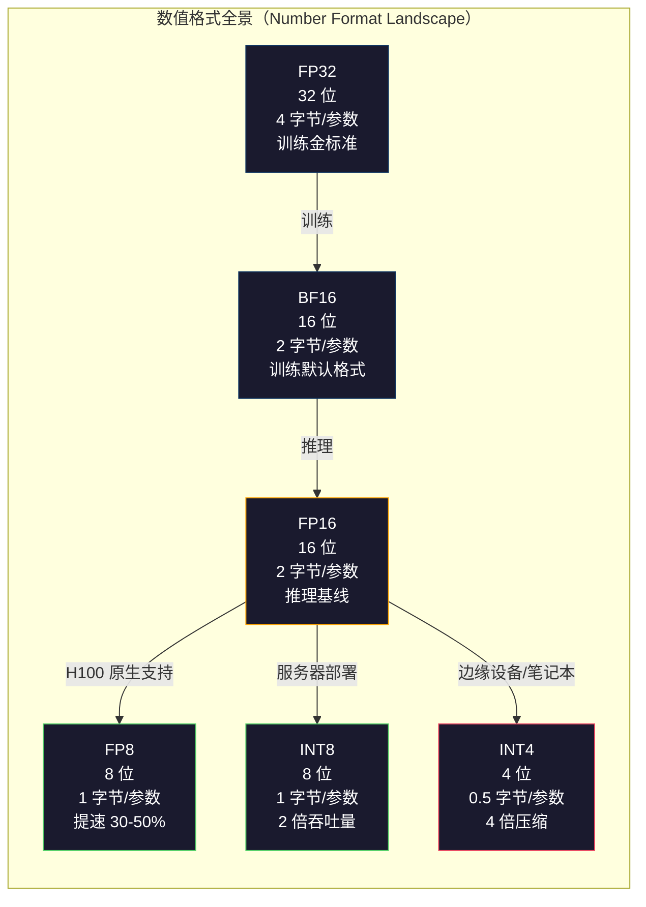
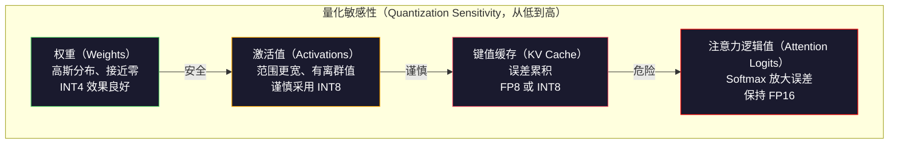
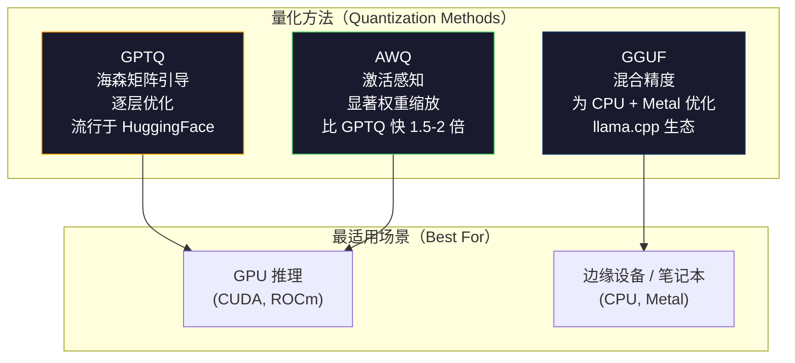

# 量化：让模型装得下（Quantization: Making Models Fit）

> 一个 70B 模型采用 FP16 需要 140GB，仅权重就占用两张 A100。量化（Quantization）为 FP8：一张 80GB GPU；量化为 INT4：一台 MacBook。

**Type:** Build
**Languages:** Python (with numpy)
**Prerequisites:** 阶段 10，第 01-10 课（从零构建大语言模型，LLMs from Scratch）
**Time:** ~120 分钟

## 学习目标（Learning Objectives）

- 实现从 FP16 到 INT8 和 INT4 的对称量化（Symmetric Quantization）与非对称量化（Asymmetric Quantization），包括逐张量和逐通道缩放
- 计算量化节省的内存，并判断给定 GPU 显存能容纳哪种精度
- 解释训练后量化（Post-training Quantization，PTQ）与量化感知训练（Quantization-aware Training，QAT）的区别
- 用 GPTQ 或 AWQ 量化真实模型，并在基准测试中衡量准确性与内存之间的权衡

## 问题（The Problem）

Llama 3 70B 有 700 亿个参数，每个参数是 16 位浮点数，总计 1400 亿字节，即 140GB。一张 A100 有 80GB 显存（Video RAM，VRAM）。单张 GPU 连权重都装不下，更别说运行推理。仅为一个模型提供服务就需要两张每小时各 $2 的 A100。

但每个参数使用 16 位是一种浪费。神经网络中的多数权重聚集在零附近。FP16 的完整动态范围（从 0.000000059 到 65,504）几乎完全没有用到。测量 Llama 3 70B 的实际权重分布会发现，95% 的权重位于 -0.1 到 +0.1 之间。你在用 16 位存储本可以用 4 位表示的数值。

量化用低精度数值替换高精度数值。FP16 转 FP8 将内存减半，FP16 转 INT4 将其降至四分之一。140GB 模型变成 35GB，可以装进单张消费级 GPU。进一步采用 2 位量化（激进、有损，但对某些任务可用），同一模型就能在 16GB 笔记本电脑上运行。

代价是准确性。每减少一位，都会丢失信息。问题在于损失多少准确性，以及在哪些方面损失。量化良好的 INT4 模型在多数基准上能保留原模型 95-99% 的质量，朴素的 INT4 量化却可能彻底毁掉模型。差别在于技术方法。

社区用 GPTQ 将 Llama 3 量化为 INT4 后，在 WikiText 上约损失 1-2 个困惑度点。Mistral 发布了 Mixtral 8x22B 的 FP8 检查点，在 MMLU 上没有可测得的质量损失。GGUF 格式支撑着 llama.cpp，使 70B 模型能在采用 M 系列芯片的 MacBook 上运行。量化不是权宜之计，而是每个大于 7B 的模型的标准部署途径。

## 概念（The Concept）

### 数值格式：每一位做什么（Number Formats: What Each Bit Does）

每个浮点数有三部分：符号（Sign）、指数（Exponent）和尾数（Mantissa，也称有效数 Significand）。符号占一位，指数决定范围，即数值可以有多大或多小；尾数决定精度，即能保留多少十进制位。

```
FP32:  [1 符号] [8 指数] [23 尾数]  = 32 位
FP16:  [1 符号] [5 指数] [10 尾数]  = 16 位
BF16:  [1 符号] [8 指数] [7  尾数]  = 16 位
FP8:   [1 符号] [4 指数] [3  尾数]  = 8  位 (E4M3)
FP8:   [1 符号] [5 指数] [2  尾数]  = 8  位 (E5M2)
INT8:  [1 符号] [7 数值]            = 8  位（等间距）
INT4:  [1 符号] [3 数值]            = 4  位（共 16 个等级）
```

**FP32** 是全精度。23 位尾数提供约 7 位十进制有效数字，范围约为 1.2 x 10^-38 到 3.4 x 10^38。过去训练全部采用 FP32。累加（矩阵乘法中的持续求和）现在仍使用它。

**FP16** 将位数减半。10 位尾数提供约 3.3 位十进制有效数字，指数缩减到 5 位，范围大幅缩小，最大值约为 65,504。这对聚集在零附近的权重没有问题，但对训练中可能出现尖峰的激活值（Activation）和梯度（Gradient）有风险。FP16 训练需要损失缩放（Loss Scaling）来防止下溢（Underflow）。

**BF16**（Brain Float 16）保留 FP32 的 8 位指数，却将尾数缩减为 7 位。其范围与 FP32 相同，精度低于 FP16。Google 专门为深度学习设计了它。直觉是：对神经网络而言，范围比精度更重要。10^-20 的梯度在 FP16 中会下溢为零，在 BF16 中却可以保留。0.07342 的权重在 BF16 中舍入为 0.0734，已经足够接近。现代训练全部采用 BF16 或 BF16/FP32 混合精度。

**FP8** 有两种形式。E4M3（4 位指数、3 位尾数）用于推理中的权重和激活值。E5M2（5 位指数、2 位尾数）用于训练中的梯度，此时范围比精度更重要。在 H100 GPU 上，FP8 推理比 FP16 快 30-50%，质量损失可以忽略。

**INT8** 是整数格式，没有指数和尾数，只有从 -128 到 127 的 256 个等间距数值。需要缩放因子（Scale Factor）将浮点权重映射到这个范围。优点是整数运算比浮点运算更快、更节能。A100 的 INT8 矩阵乘法达到每秒万亿次运算（Tera Operations per Second，TOPS）624，而 FP16 为每秒万亿次浮点运算（Tera Floating-point Operations per Second，TFLOPS）312。

**INT4** 更进一步，只有 16 个可能数值，缩放因子承担了关键作用。质量完全取决于如何选择缩放因子，以及量化哪些权重。最先进的 INT4 方法（GPTQ、AWQ）能保留原模型 95% 以上的质量。



### 量化如何工作（How Quantization Works）

核心操作很简单：取得一个浮点张量（Tensor），找到缩放因子，缩放后舍入到最近的整数，然后存储整数与缩放因子。

**量化（Quantize）：**
```
scale = max(abs(tensor)) / max_int_value
quantized = round(tensor / scale)
```

**反量化（Dequantize）：**
```
reconstructed = quantized * scale
```

对于对称范围（-127 到 127）的 INT8：
```
scale = max(abs(tensor)) / 127
quantized = clamp(round(tensor / scale), -128, 127)
```

误差来自舍入。每个值最多偏离 `scale / 2`。整层总误差取决于权重数量，以及模型对这些权重扰动的敏感程度。

**逐张量与逐通道量化（Per-tensor vs Per-channel Quantization）。**逐张量量化对整个权重矩阵使用一个缩放因子，简单但有损：如果某列数值大而另一列数值小，小值会失去大部分精度。逐通道量化对每个输出通道，即权重矩阵的每行或每列，使用单独的缩放因子。开销更大，要存储 N 个缩放因子而不是 1 个，但质量明显更好。所有生产量化方法都采用逐通道或更细粒度。

**非对称量化（Asymmetric Quantization）**增加零点（Zero-point）偏移：`quantized = round(tensor / scale) + zero_point`。它能处理不以零为中心的分布。例如，ReLU 激活值始终非负。对称量化将一半整数范围浪费在永远不会出现的负值上。非对称量化则把实际范围 [min, max] 映射到完整整数范围。

### 敏感性层次（Sensitivity Hierarchy）

模型各部分对量化的容忍程度并不相同，而是有明确的层次。

**权重（Weights，最稳健）。**模型权重在训练中缓慢变化，近似服从以零附近为中心的高斯分布（Gaussian Distribution），很适合量化。使用逐通道缩放的 INT8 权重几乎无损。INT4 需要更复杂的方法，但也可行。

**激活值（Activations，中等敏感）。**激活值是推理时在网络中流动的中间值，比权重动态范围更宽，且包含离群值（Outlier）。一个注意力头可能产生比均值大 100 倍的激活值。这些离群值对模型质量至关重要，朴素量化会破坏信息。解决方法：让离群通道保持高精度（LLM.int8()），或采用逐词元、逐通道的激活缩放。

**键值缓存（Key-value Cache，KV Cache，高敏感）。**键值缓存存储所有先前词元的注意力状态。长上下文时，键值缓存主导内存占用。70B 模型在 32K 上下文下，仅 FP16 键值缓存就占 40GB。量化到 FP8 或 INT8 可节省大量内存，但误差会在未来所有注意力计算中累积。对质量的影响随序列长度增大。

**注意力逻辑值（Attention Logits，最敏感）。**注意力中的 softmax 对输入的微小变化极为敏感。softmax 前逻辑值中 0.01 的量化误差，都可能显著改变注意力分布。因此，即使其他部分全部量化，多数量化方案仍让注意力计算保持较高精度（FP16 或 BF16）。



### 训练后量化与量化感知训练（PTQ vs QAT）

**训练后量化（Post-Training Quantization，PTQ）**量化已训练好的模型，无需重新训练。取得 FP16 权重，计算缩放因子、舍入，然后部署。速度快（数分钟到数小时）、成本低，适用于 INT8 和 FP8。但对 INT4 而言，朴素 PTQ 往往因舍入误差累积而严重失效。高级 PTQ 方法（GPTQ、AWQ）使用校准数据（Calibration Data）最小化量化误差。

**量化感知训练（Quantization-Aware Training，QAT）**在训练的前向传播中插入伪量化（Fake Quantization）操作，让模型学会把权重放在舍入误差较小的位置。梯度通过直通估计器（Straight-through Estimator，STE）流经伪量化：假定舍入操作的梯度为 1。QAT 产生的 INT4 和 INT2 模型优于 PTQ，但需要一次完整训练。Google 用 QAT 为 Gemini 提供高效服务，Meta 也在一些 Llama 部署目标上使用 QAT。

| 方面 | PTQ | QAT |
|--------|-----|-----|
| 成本 | 数分钟到数小时 | 一次完整训练 |
| INT8 质量 | 优秀（损失 < 0.1%） | 优秀 |
| INT4 质量 | GPTQ/AWQ 效果良好（损失 1-3%） | 更好（损失 < 1%） |
| INT2 质量 | 差 | 对部分任务可用 |
| 校准数据 | 128-1024 个样本 | 完整训练数据集 |
| 使用时机 | 部署、迭代 | 在低位宽下追求最高质量 |

### GPTQ, AWQ, GGUF

**GPT 量化（GPT Quantization，GPTQ）**是一次性 PTQ 方法。它逐层量化权重，使用小型校准数据集（通常为 128 个样本）估计海森矩阵（Hessian），即输出对各权重敏感程度的二阶信息。海森矩阵判定为重要的权重会得到更谨慎的量化。GPTQ 是首个让大语言模型 INT4 量化实用化的方法。Hugging Face 上的 TheBloke 通过发布数百个模型的量化版本推广了 GPTQ。

**激活感知权重量化（Activation-Aware Weight Quantization，AWQ）**发现，少部分权重（约 1%）因与较大激活值相乘而格外重要。AWQ 用校准数据识别这些显著权重（Salient Weights），在量化前将其放大，再将相应激活值缩小。这使重要权重处于 INT4 量化较准确的范围。AWQ 的质量通常持平或略优于 GPTQ，应用速度则快 1.5-2 倍。

**GPT 生成统一格式（GPT-Generated Unified Format，GGUF）**是 llama.cpp 及其生态使用的文件格式。它支持混合量化，不同层采用不同位宽。第一层和最后一层，即嵌入（Embedding）与输出头（Output Head），通常保持较高精度；中间层采用 INT4 或 INT3。GGUF 文件自包含，权重、分词器（Tokenizer）与元数据都在一个文件中。该格式面向 CPU 推理与 Apple Silicon，标准运行方式是将完整模型载入内存，然后在 CPU 或 Metal GPU 上执行矩阵乘法。Q4_K_M 是最流行的 GGUF 量化变体，兼顾质量和大小。



### 质量测量（Quality Measurement）

如何知道量化后的模型是否仍然表现良好？

**困惑度（Perplexity）。**最常用的指标，越低越好。在留出数据集（通常用 WikiText-2）上分别计算原模型和量化模型的困惑度，差值表明量化丢失了多少信息。经验规则：差值 < 0.5 为优秀，0.5-1.0 为良好，1.0-2.0 对多数任务可接受，> 2.0 说明出了问题。

**任务专用基准测试（Task-specific Benchmarks）。**在 MMLU、HumanEval、GSM8K 或你的自定义评估套件上运行量化模型，与原模型比较。量化对不同能力的影响并不均匀。数学和代码任务比通用知识更易受精度损失影响。

**输出比较（Output Comparison）。**让两个模型对相同提示词生成回答并比较。第 10 课的大语言模型裁判（LLM-as-judge）很适用。计算胜率：量化模型在多少比例的提示词上持平或优于原模型？

**延迟与吞吐量（Latency and Throughput）。**量化的目的是让模型更快、更便宜。测量每秒词元数、首词元时间（Time to First Token，TTFT）和内存用量。量化后比原模型更慢，不仅无用，反而有害。

| 模型 | 格式 | 大小 | 困惑度（WikiText-2） | MMLU | 词元/秒（A100） |
|-------|--------|------|------------------------|------|-------------------|
| Llama 3 70B | FP16 | 140GB | 3.12 | 79.5% | 38 |
| Llama 3 70B | FP8 | 70GB | 3.14 | 79.3% | 55 |
| Llama 3 70B | GPTQ INT4 | 35GB | 4.32 | 77.8% | 72 |
| Llama 3 70B | AWQ INT4 | 35GB | 4.18 | 78.1% | 75 |
| Llama 3 70B | GGUF Q4_K_M | 40GB | 4.25 | 77.9% | 28 (CPU) |

规律是：FP8 几乎没有质量代价。INT4 损失 1-2 个 MMLU 分，却让吞吐量翻倍、内存降至四分之一。对几乎所有部署，这个权衡都值得。

### 实际数值（Real Numbers）

H100 上 FP16 转 FP8：推理提速 30-50%，质量损失 < 0.1%。这是无需犹豫的量化选择，每个 H100 部署都应采用。

FP16 转 INT8（LLM.int8()）：内存降至 1/2，质量损失 < 0.5%。这种混合精度（Mixed Precision）方法让离群特征保持 FP16，其余全部量化为 INT8。

FP16 转 INT4（GPTQ/AWQ）：内存降至 1/4，质量损失因模型和方法而异，为 1-3%。使 70B 模型能够运行在单张 48GB GPU 上。

FP16 转 INT4（GGUF Q4_K_M）：内存缩小 3.5 倍，质量损失 1-2%，为 CPU 推理优化。70B 模型采用 Q4_K_M 约占 40GB，在 64GB 的 M3 Max 上达到每秒 10-15 个词元。

FP16 转 INT2：内存降至 1/8，质量损失 5-15%。仅适用于可容忍退化的特定窄任务。它属于研究前沿，尚未达到通用生产部署要求。

```figure
quantization
```

## 动手实现（Build It）

### 第 1 步：数值格式表示（Step 1: Number Format Representations）

构建各格式的位级表示，准确观察符号、指数和尾数的作用。

```python
import numpy as np


def float_to_fp32_bits(value):
    bits = np.float32(value).view(np.uint32)
    sign = (bits >> 31) & 1
    exponent = (bits >> 23) & 0xFF
    mantissa = bits & 0x7FFFFF
    return {"sign": int(sign), "exponent": int(exponent), "mantissa": int(mantissa),
            "exponent_bits": format(int(exponent), '08b'),
            "mantissa_bits": format(int(mantissa), '023b'),
            "value": float(value),
            "actual_exponent": int(exponent) - 127}


def float_to_fp16_bits(value):
    fp16 = np.float16(value)
    bits = fp16.view(np.uint16)
    sign = (bits >> 15) & 1
    exponent = (bits >> 10) & 0x1F
    mantissa = bits & 0x3FF
    return {"sign": int(sign), "exponent": int(exponent), "mantissa": int(mantissa),
            "exponent_bits": format(int(exponent), '05b'),
            "mantissa_bits": format(int(mantissa), '010b'),
            "value": float(fp16),
            "actual_exponent": int(exponent) - 15}


def float_to_bf16_bits(value):
    fp32_bits = np.float32(value).view(np.uint32)
    bf16_bits = (fp32_bits >> 16).astype(np.uint16)
    sign = (bf16_bits >> 15) & 1
    exponent = (bf16_bits >> 7) & 0xFF
    mantissa = bf16_bits & 0x7F
    reconstructed = np.uint32(bf16_bits.astype(np.uint32) << 16).view(np.float32)
    return {"sign": int(sign), "exponent": int(exponent), "mantissa": int(mantissa),
            "exponent_bits": format(int(exponent), '08b'),
            "mantissa_bits": format(int(mantissa), '07b'),
            "value": float(reconstructed),
            "actual_exponent": int(exponent) - 127}


def simulate_fp8_e4m3(value):
    sign = 1 if value < 0 else 0
    abs_val = abs(value)
    max_val = 448.0
    abs_val = min(abs_val, max_val)
    if abs_val == 0:
        return {"sign": sign, "exponent": 0, "mantissa": 0, "value": 0.0,
                "exponent_bits": "0000", "mantissa_bits": "000"}
    exp = int(np.floor(np.log2(abs_val)))
    exp = max(-6, min(8, exp))
    mantissa_val = abs_val / (2.0 ** exp) - 1.0
    mantissa_quant = round(mantissa_val * 8) / 8
    mantissa_quant = max(0, min(0.875, mantissa_quant))
    reconstructed = (1.0 + mantissa_quant) * (2.0 ** exp)
    if sign:
        reconstructed = -reconstructed
    mantissa_int = int(round(mantissa_quant * 8))
    return {"sign": sign, "exponent": exp + 7, "mantissa": mantissa_int,
            "exponent_bits": format(exp + 7, '04b'),
            "mantissa_bits": format(mantissa_int, '03b'),
            "value": float(reconstructed),
            "actual_exponent": exp}


def display_format_comparison(value):
    fp32 = float_to_fp32_bits(value)
    fp16 = float_to_fp16_bits(value)
    bf16 = float_to_bf16_bits(value)
    fp8 = simulate_fp8_e4m3(value)

    print(f"\n  Value: {value}")
    print(f"  {'Format':<8} {'Stored Value':>14} {'Error':>12} {'Sign':>5} {'Exp Bits':>10} {'Man Bits':>25}")
    print(f"  {'-'*76}")
    print(f"  {'FP32':<8} {fp32['value']:>14.6f} {abs(fp32['value'] - value):>12.8f} {fp32['sign']:>5} {fp32['exponent_bits']:>10} {fp32['mantissa_bits']:>25}")
    print(f"  {'FP16':<8} {fp16['value']:>14.6f} {abs(fp16['value'] - value):>12.8f} {fp16['sign']:>5} {fp16['exponent_bits']:>10} {fp16['mantissa_bits']:>25}")
    print(f"  {'BF16':<8} {bf16['value']:>14.6f} {abs(bf16['value'] - value):>12.8f} {bf16['sign']:>5} {bf16['exponent_bits']:>10} {bf16['mantissa_bits']:>25}")
    print(f"  {'FP8e4m3':<8} {fp8['value']:>14.6f} {abs(fp8['value'] - value):>12.8f} {fp8['sign']:>5} {fp8['exponent_bits']:>10} {fp8['mantissa_bits']:>25}")
```

### 第 2 步：对称量化，逐张量与逐通道（Step 2: Symmetric Quantization (Per-Tensor and Per-Channel)）

实现基本量化操作。逐张量对整个矩阵使用一个缩放因子，逐通道则为每行或每列使用一个缩放因子。

```python
def quantize_symmetric(tensor, num_bits=8):
    qmin = -(2 ** (num_bits - 1))
    qmax = 2 ** (num_bits - 1) - 1
    abs_max = np.max(np.abs(tensor))
    if abs_max == 0:
        return np.zeros_like(tensor, dtype=np.int32), 1.0
    scale = abs_max / qmax
    quantized = np.clip(np.round(tensor / scale), qmin, qmax).astype(np.int32)
    return quantized, float(scale)


def dequantize_symmetric(quantized, scale):
    return quantized.astype(np.float64) * scale


def quantize_per_channel(tensor, num_bits=8, axis=0):
    qmin = -(2 ** (num_bits - 1))
    qmax = 2 ** (num_bits - 1) - 1

    if axis == 0:
        abs_max = np.max(np.abs(tensor), axis=1, keepdims=True)
    else:
        abs_max = np.max(np.abs(tensor), axis=0, keepdims=True)

    abs_max = np.where(abs_max == 0, 1.0, abs_max)
    scales = abs_max / qmax
    quantized = np.clip(np.round(tensor / scales), qmin, qmax).astype(np.int32)
    return quantized, scales.squeeze()


def dequantize_per_channel(quantized, scales, axis=0):
    if axis == 0:
        return quantized.astype(np.float64) * scales.reshape(-1, 1)
    else:
        return quantized.astype(np.float64) * scales.reshape(1, -1)


def quantize_asymmetric(tensor, num_bits=8):
    qmin = 0
    qmax = 2 ** num_bits - 1
    t_min = np.min(tensor)
    t_max = np.max(tensor)
    if t_max == t_min:
        return np.zeros_like(tensor, dtype=np.int32), 1.0, 0
    scale = (t_max - t_min) / (qmax - qmin)
    zero_point = int(np.round(qmin - t_min / scale))
    zero_point = max(qmin, min(qmax, zero_point))
    quantized = np.clip(np.round(tensor / scale + zero_point), qmin, qmax).astype(np.int32)
    return quantized, float(scale), int(zero_point)


def dequantize_asymmetric(quantized, scale, zero_point):
    return (quantized.astype(np.float64) - zero_point) * scale
```

### 第 3 步：质量测量（Step 3: Quality Measurement）

衡量量化丢失多少信息：计算原张量与重建张量之间的均方误差（Mean Squared Error，MSE）、信噪比（Signal-to-noise Ratio，SNR）和余弦相似度（Cosine Similarity）。

```python
def quantization_error(original, reconstructed):
    diff = original - reconstructed
    mse = float(np.mean(diff ** 2))
    rmse = float(np.sqrt(mse))
    max_error = float(np.max(np.abs(diff)))
    signal_power = float(np.mean(original ** 2))
    snr_db = 10 * np.log10(signal_power / max(mse, 1e-20))

    orig_flat = original.flatten()
    recon_flat = reconstructed.flatten()
    norm_orig = np.linalg.norm(orig_flat)
    norm_recon = np.linalg.norm(recon_flat)
    if norm_orig == 0 or norm_recon == 0:
        cosine_sim = 0.0
    else:
        cosine_sim = float(np.dot(orig_flat, recon_flat) / (norm_orig * norm_recon))

    return {"mse": mse, "rmse": rmse, "max_error": max_error,
            "snr_db": float(snr_db), "cosine_similarity": cosine_sim}


def compare_quantization_methods(tensor, num_bits=8):
    q_pt, s_pt = quantize_symmetric(tensor, num_bits)
    recon_pt = dequantize_symmetric(q_pt, s_pt)
    err_pt = quantization_error(tensor, recon_pt)

    q_pc, s_pc = quantize_per_channel(tensor, num_bits, axis=0)
    recon_pc = dequantize_per_channel(q_pc, s_pc, axis=0)
    err_pc = quantization_error(tensor, recon_pc)

    q_asym, s_asym, zp = quantize_asymmetric(tensor, num_bits)
    recon_asym = dequantize_asymmetric(q_asym, s_asym, zp)
    err_asym = quantization_error(tensor, recon_asym)

    print(f"\n  Quantization Comparison ({num_bits}-bit, tensor shape {tensor.shape}):")
    print(f"  {'Method':<20} {'MSE':>12} {'SNR (dB)':>10} {'Cosine Sim':>12} {'Max Error':>12}")
    print(f"  {'-'*68}")
    print(f"  {'Per-tensor sym':<20} {err_pt['mse']:>12.8f} {err_pt['snr_db']:>10.2f} {err_pt['cosine_similarity']:>12.8f} {err_pt['max_error']:>12.8f}")
    print(f"  {'Per-channel sym':<20} {err_pc['mse']:>12.8f} {err_pc['snr_db']:>10.2f} {err_pc['cosine_similarity']:>12.8f} {err_pc['max_error']:>12.8f}")
    print(f"  {'Asymmetric':<20} {err_asym['mse']:>12.8f} {err_asym['snr_db']:>10.2f} {err_asym['cosine_similarity']:>12.8f} {err_asym['max_error']:>12.8f}")

    return {"per_tensor": err_pt, "per_channel": err_pc, "asymmetric": err_asym}
```

### 第 4 步：扫描位宽（Step 4: Bit-Width Sweep）

以不同位宽（2、3、4、8、16）量化同一张量，并测量每个级别的质量，从而准确定位质量骤降的位置。

```python
def bit_width_sweep(tensor):
    print(f"\n  Bit-Width Sweep (tensor shape {tensor.shape}):")
    print(f"  {'Bits':>6} {'Levels':>8} {'MSE':>14} {'SNR (dB)':>10} {'Cosine Sim':>12} {'Compression':>12}")
    print(f"  {'-'*64}")

    results = []
    for bits in [2, 3, 4, 8, 16]:
        q, s = quantize_per_channel(tensor, bits, axis=0)
        recon = dequantize_per_channel(q, s, axis=0)
        err = quantization_error(tensor, recon)
        levels = 2 ** bits
        compression = 32.0 / bits

        print(f"  {bits:>6} {levels:>8} {err['mse']:>14.8f} {err['snr_db']:>10.2f} {err['cosine_similarity']:>12.8f} {compression:>11.1f}x")
        results.append({"bits": bits, "levels": levels, "error": err, "compression": compression})

    return results
```

### 第 5 步：敏感性实验（Step 5: Sensitivity Experiment）

模拟量化 Transformer 的不同部分，衡量哪些组件最敏感。由此展示敏感性层次：权重 < 激活值 < 键值缓存 < 注意力。

```python
def simulate_transformer_layer(input_data, weights, kv_scale=1.0):
    hidden = input_data @ weights["qkv"]
    seq_len = hidden.shape[1]
    d_model = weights["qkv"].shape[1] // 3
    q, k, v = hidden[:, :, :d_model], hidden[:, :, d_model:2*d_model], hidden[:, :, 2*d_model:]

    attn_scores = (q @ k.transpose(0, 2, 1)) / np.sqrt(d_model) * kv_scale
    attn_max = np.max(attn_scores, axis=-1, keepdims=True)
    attn_exp = np.exp(attn_scores - attn_max)
    attn_weights = attn_exp / np.sum(attn_exp, axis=-1, keepdims=True)

    attn_output = attn_weights @ v
    output = attn_output @ weights["out"]
    return output, {"q": q, "k": k, "v": v, "attn_scores": attn_scores,
                    "attn_weights": attn_weights, "attn_output": attn_output}


def sensitivity_experiment(batch_size=2, seq_len=16, d_model=64, num_bits=8):
    np.random.seed(42)
    input_data = np.random.randn(batch_size, seq_len, d_model) * 0.1

    weights = {
        "qkv": np.random.randn(d_model, 3 * d_model) * (2.0 / d_model) ** 0.5,
        "out": np.random.randn(d_model, d_model) * (2.0 / d_model) ** 0.5,
    }

    baseline_output, baseline_internals = simulate_transformer_layer(input_data, weights)

    experiments = {}

    q_qkv, s_qkv = quantize_per_channel(weights["qkv"], num_bits, axis=0)
    q_out, s_out = quantize_per_channel(weights["out"], num_bits, axis=0)
    quantized_weights = {
        "qkv": dequantize_per_channel(q_qkv, s_qkv, axis=0),
        "out": dequantize_per_channel(q_out, s_out, axis=0),
    }
    weight_quant_output, _ = simulate_transformer_layer(input_data, quantized_weights)
    experiments["Weights only"] = quantization_error(baseline_output, weight_quant_output)

    _, fresh_internals = simulate_transformer_layer(input_data, weights)
    q_act, s_act = quantize_per_channel(
        fresh_internals["attn_output"].reshape(-1, d_model), num_bits, axis=0
    )
    quant_attn_out = dequantize_per_channel(q_act, s_act, axis=0).reshape(batch_size, seq_len, d_model)
    act_quant_output = quant_attn_out @ weights["out"]
    experiments["Activations only"] = quantization_error(baseline_output, act_quant_output)

    q_k, s_k = quantize_per_channel(fresh_internals["k"].reshape(-1, d_model), num_bits, axis=0)
    q_v, s_v = quantize_per_channel(fresh_internals["v"].reshape(-1, d_model), num_bits, axis=0)
    quant_k = dequantize_per_channel(q_k, s_k, axis=0).reshape(batch_size, seq_len, d_model)
    quant_v = dequantize_per_channel(q_v, s_v, axis=0).reshape(batch_size, seq_len, d_model)
    attn_scores_kv = (fresh_internals["q"] @ quant_k.transpose(0, 2, 1)) / np.sqrt(d_model)
    attn_max_kv = np.max(attn_scores_kv, axis=-1, keepdims=True)
    attn_exp_kv = np.exp(attn_scores_kv - attn_max_kv)
    attn_weights_kv = attn_exp_kv / np.sum(attn_exp_kv, axis=-1, keepdims=True)
    kv_quant_output = (attn_weights_kv @ quant_v) @ weights["out"]
    experiments["KV cache only"] = quantization_error(baseline_output, kv_quant_output)

    noise_scale = np.std(fresh_internals["attn_scores"]) * 0.05
    noisy_scores = fresh_internals["attn_scores"] + np.random.randn(*fresh_internals["attn_scores"].shape) * noise_scale
    noisy_max = np.max(noisy_scores, axis=-1, keepdims=True)
    noisy_exp = np.exp(noisy_scores - noisy_max)
    noisy_weights = noisy_exp / np.sum(noisy_exp, axis=-1, keepdims=True)
    attn_quant_output = (noisy_weights @ fresh_internals["v"]) @ weights["out"]
    experiments["Attention logits (5% noise)"] = quantization_error(baseline_output, attn_quant_output)

    print(f"\n  Sensitivity Experiment ({num_bits}-bit quantization):")
    print(f"  {'Component':<30} {'MSE':>14} {'SNR (dB)':>10} {'Cosine Sim':>12}")
    print(f"  {'-'*68}")
    for name, err in sorted(experiments.items(), key=lambda x: x[1]["mse"]):
        print(f"  {name:<30} {err['mse']:>14.8f} {err['snr_db']:>10.2f} {err['cosine_similarity']:>12.8f}")

    return experiments
```

### 第 6 步：模拟 GPTQ（Step 6: Simulated GPTQ）

GPTQ 每次量化一列，并用海森矩阵决定如何分配舍入误差。这里的简化版本体现核心思想：用校准数据衡量权重重要性，再对最不重要的权重进行更激进的量化。

```python
def simulated_gptq(weight_matrix, calibration_inputs, num_bits=4):
    n_in, n_out = weight_matrix.shape
    qmin = -(2 ** (num_bits - 1))
    qmax = 2 ** (num_bits - 1) - 1

    H = np.zeros((n_in, n_in))
    for x in calibration_inputs:
        x = x.reshape(-1, 1) if x.ndim == 1 else x
        for row in range(x.shape[0]):
            xi = x[row].reshape(-1, 1)
            H += xi @ xi.T
    H /= len(calibration_inputs)
    H += np.eye(n_in) * 1e-4

    weight_importance = np.diag(H)

    quantized = np.zeros_like(weight_matrix, dtype=np.int32)
    scales = np.zeros(n_out)
    errors = np.zeros(n_out)

    W = weight_matrix.copy()

    for col in range(n_out):
        w_col = W[:, col]
        abs_max = np.max(np.abs(w_col))
        if abs_max == 0:
            scales[col] = 1.0
            continue
        scale = abs_max / qmax
        scales[col] = scale

        q_col = np.clip(np.round(w_col / scale), qmin, qmax).astype(np.int32)
        quantized[:, col] = q_col

        quant_error = w_col - q_col * scale
        errors[col] = np.sqrt(np.mean(quant_error ** 2))

        if col < n_out - 1:
            importance_weights = weight_importance / (np.max(weight_importance) + 1e-10)
            for next_col in range(col + 1, min(col + 4, n_out)):
                compensation = quant_error * importance_weights * 0.1
                W[:, next_col] += compensation

    return quantized, scales, {"column_errors": errors,
                               "mean_error": float(np.mean(errors)),
                               "max_error": float(np.max(errors))}


def dequantize_gptq(quantized, scales):
    result = np.zeros_like(quantized, dtype=np.float64)
    for col in range(quantized.shape[1]):
        result[:, col] = quantized[:, col] * scales[col]
    return result
```

### 第 7 步：模拟 AWQ（Step 7: AWQ Simulation）

AWQ 识别显著权重，即与较大激活值相乘的权重，并通过量化前缩放来保护它们。

```python
def simulated_awq(weight_matrix, calibration_inputs, num_bits=4, salient_fraction=0.01):
    n_in, n_out = weight_matrix.shape
    qmin = -(2 ** (num_bits - 1))
    qmax = 2 ** (num_bits - 1) - 1

    activation_magnitudes = np.zeros(n_in)
    for x in calibration_inputs:
        if x.ndim == 1:
            activation_magnitudes += np.abs(x)
        else:
            activation_magnitudes += np.mean(np.abs(x), axis=0)
    activation_magnitudes /= len(calibration_inputs)

    n_salient = max(1, int(n_in * salient_fraction))
    salient_indices = np.argsort(activation_magnitudes)[-n_salient:]

    scale_factors = np.ones(n_in)
    for idx in salient_indices:
        col_max = np.max(np.abs(weight_matrix[idx, :]))
        if col_max > 0:
            scale_factors[idx] = min(4.0, 1.0 / (col_max + 1e-8) * np.mean(np.abs(weight_matrix)))

    scaled_weights = weight_matrix * scale_factors.reshape(-1, 1)

    quantized, scales = quantize_per_channel(scaled_weights, num_bits, axis=0)
    dequantized = dequantize_per_channel(quantized, scales, axis=0)

    result = dequantized / scale_factors.reshape(-1, 1)

    err = quantization_error(weight_matrix, result)

    return result, {"salient_indices": salient_indices,
                    "scale_factors": scale_factors[salient_indices],
                    "error": err,
                    "n_salient": n_salient}
```

### 第 8 步：完整流水线（Step 8: Full Pipeline）

连接所有组件，在同一权重矩阵上比较朴素量化、逐通道量化、GPTQ 和 AWQ。

```python
def full_quantization_comparison(d_in=256, d_out=512, num_bits=4, n_calibration=32):
    np.random.seed(42)

    weight = np.random.randn(d_in, d_out) * 0.02
    outlier_rows = np.random.choice(d_in, size=5, replace=False)
    weight[outlier_rows] *= 10

    calibration = [np.random.randn(8, d_in) * 0.1 for _ in range(n_calibration)]

    q_naive, s_naive = quantize_symmetric(weight, num_bits)
    recon_naive = dequantize_symmetric(q_naive, s_naive)
    err_naive = quantization_error(weight, recon_naive)

    q_pc, s_pc = quantize_per_channel(weight, num_bits, axis=0)
    recon_pc = dequantize_per_channel(q_pc, s_pc, axis=0)
    err_pc = quantization_error(weight, recon_pc)

    q_gptq, s_gptq, gptq_info = simulated_gptq(weight, calibration, num_bits)
    recon_gptq = dequantize_gptq(q_gptq, s_gptq)
    err_gptq = quantization_error(weight, recon_gptq)

    recon_awq, awq_info = simulated_awq(weight, calibration, num_bits)
    err_awq = awq_info["error"]

    print(f"\n  Full Quantization Comparison ({num_bits}-bit, {d_in}x{d_out} matrix)")
    print(f"  Matrix has {len(outlier_rows)} outlier rows (10x scale)")
    print()
    print(f"  {'Method':<20} {'MSE':>14} {'SNR (dB)':>10} {'Cosine Sim':>12}")
    print(f"  {'-'*58}")
    print(f"  {'Naive per-tensor':<20} {err_naive['mse']:>14.8f} {err_naive['snr_db']:>10.2f} {err_naive['cosine_similarity']:>12.8f}")
    print(f"  {'Per-channel':<20} {err_pc['mse']:>14.8f} {err_pc['snr_db']:>10.2f} {err_pc['cosine_similarity']:>12.8f}")
    print(f"  {'Simulated GPTQ':<20} {err_gptq['mse']:>14.8f} {err_gptq['snr_db']:>10.2f} {err_gptq['cosine_similarity']:>12.8f}")
    print(f"  {'Simulated AWQ':<20} {err_awq['mse']:>14.8f} {err_awq['snr_db']:>10.2f} {err_awq['cosine_similarity']:>12.8f}")

    test_input = np.random.randn(4, d_in) * 0.1
    baseline = test_input @ weight
    output_naive = test_input @ recon_naive
    output_pc = test_input @ recon_pc
    output_gptq = test_input @ recon_gptq
    output_awq = test_input @ recon_awq

    print(f"\n  End-to-End Output Error (matmul with test input):")
    print(f"  {'Method':<20} {'Output MSE':>14} {'Output Cosine':>14}")
    print(f"  {'-'*50}")
    for name, output in [("Naive", output_naive), ("Per-channel", output_pc),
                          ("GPTQ", output_gptq), ("AWQ", output_awq)]:
        out_err = quantization_error(baseline, output)
        print(f"  {name:<20} {out_err['mse']:>14.8f} {out_err['cosine_similarity']:>14.8f}")

    return {"naive": err_naive, "per_channel": err_pc, "gptq": err_gptq, "awq": err_awq}


def memory_calculator(num_params_billions, bits_per_param):
    bytes_per_param = bits_per_param / 8
    total_bytes = num_params_billions * 1e9 * bytes_per_param
    total_gb = total_bytes / (1024 ** 3)
    return total_gb


def print_memory_table():
    print("\n  Memory Requirements by Model and Precision:")
    print(f"  {'Model':<15} {'FP32':>8} {'FP16':>8} {'FP8':>8} {'INT8':>8} {'INT4':>8} {'INT2':>8}")
    print(f"  {'-'*64}")
    for name, params in [("7B", 7), ("13B", 13), ("34B", 34), ("70B", 70), ("405B", 405)]:
        fp32 = memory_calculator(params, 32)
        fp16 = memory_calculator(params, 16)
        fp8 = memory_calculator(params, 8)
        int8 = memory_calculator(params, 8)
        int4 = memory_calculator(params, 4)
        int2 = memory_calculator(params, 2)
        print(f"  {name:<15} {fp32:>7.1f}G {fp16:>7.1f}G {fp8:>7.1f}G {int8:>7.1f}G {int4:>7.1f}G {int2:>7.1f}G")


if __name__ == "__main__":
    np.random.seed(42)

    print("=" * 70)
    print("QUANTIZATION: MAKING MODELS FIT")
    print("=" * 70)

    print("\nSTEP 1: Number Format Comparison")
    print("-" * 50)
    for val in [0.1, 3.14159, -0.00073, 42.5, 0.0000012]:
        display_format_comparison(val)

    print("\n\nSTEP 2: Memory Requirements")
    print("-" * 50)
    print_memory_table()

    print("\n\nSTEP 3: Quantization Methods Comparison")
    print("-" * 50)
    weight_matrix = np.random.randn(128, 256) * 0.02
    weight_matrix[0] *= 15
    weight_matrix[42] *= 8
    compare_quantization_methods(weight_matrix, num_bits=8)
    compare_quantization_methods(weight_matrix, num_bits=4)

    print("\n\nSTEP 4: Bit-Width Sweep")
    print("-" * 50)
    sweep_tensor = np.random.randn(64, 128) * 0.05
    bit_width_sweep(sweep_tensor)

    print("\n\nSTEP 5: Sensitivity Experiment")
    print("-" * 50)
    print("\n  INT8:")
    sensitivity_experiment(num_bits=8)
    print("\n  INT4:")
    sensitivity_experiment(num_bits=4)

    print("\n\nSTEP 6: GPTQ vs AWQ vs Naive (INT4)")
    print("-" * 50)
    full_quantization_comparison(d_in=256, d_out=512, num_bits=4)

    print("\n\nSTEP 7: Distribution Analysis")
    print("-" * 50)
    np.random.seed(0)
    simulated_weights = np.random.randn(1000) * 0.02
    abs_vals = np.abs(simulated_weights)
    pct_in_range = np.mean(abs_vals < 0.1) * 100
    print(f"\n  Simulated weight distribution (1000 params, std=0.02):")
    print(f"  Weights in [-0.1, 0.1]: {pct_in_range:.1f}%")
    print(f"  Weights in [-0.05, 0.05]: {np.mean(abs_vals < 0.05) * 100:.1f}%")
    print(f"  Weights in [-0.01, 0.01]: {np.mean(abs_vals < 0.01) * 100:.1f}%")
    print(f"  Max absolute value: {np.max(abs_vals):.6f}")
    print(f"  Mean absolute value: {np.mean(abs_vals):.6f}")

    histogram = np.histogram(simulated_weights, bins=20)
    print(f"\n  Weight histogram:")
    max_count = max(histogram[0])
    for i in range(len(histogram[0])):
        bar_len = int(histogram[0][i] / max_count * 40)
        lo = histogram[1][i]
        hi = histogram[1][i + 1]
        print(f"  [{lo:>7.4f}, {hi:>7.4f}] {'#' * bar_len} ({histogram[0][i]})")

    print("\n\n" + "=" * 70)
    print("DONE")
    print("=" * 70)
```

## 实际应用（Use It）

### 使用 AutoGPTQ 量化（Quantizing with AutoGPTQ）

```python
# pip install auto-gptq transformers
# from auto_gptq import AutoGPTQForCausalLM, BaseQuantizeConfig
# from transformers import AutoTokenizer
#
# model_id = "meta-llama/Llama-3.1-8B"
# quantize_config = BaseQuantizeConfig(
#     bits=4,
#     group_size=128,
#     desc_act=False,
# )
#
# tokenizer = AutoTokenizer.from_pretrained(model_id)
# model = AutoGPTQForCausalLM.from_pretrained(model_id, quantize_config)
#
# calibration = [tokenizer(t, return_tensors="pt") for t in calibration_texts[:128]]
# model.quantize(calibration)
# model.save_quantized("llama-8b-gptq-int4")
```

### 使用 AutoAWQ 量化（Quantizing with AutoAWQ）

```python
# pip install autoawq
# from awq import AutoAWQForCausalLM
# from transformers import AutoTokenizer
#
# model_id = "meta-llama/Llama-3.1-8B"
# model = AutoAWQForCausalLM.from_pretrained(model_id)
# tokenizer = AutoTokenizer.from_pretrained(model_id)
#
# model.quantize(tokenizer, quant_config={"zero_point": True, "q_group_size": 128, "w_bit": 4})
# model.save_quantized("llama-8b-awq-int4")
```

### 转换为 GGUF（Converting to GGUF）

```bash
# pip install llama-cpp-python
# python convert_hf_to_gguf.py meta-llama/Llama-3.1-8B --outtype q4_k_m --outfile llama-8b-q4km.gguf
# llama-server -m llama-8b-q4km.gguf -c 4096 -ngl 99
```

### 部署量化模型服务（Serving quantized models）

```python
# pip install vllm
# vllm serve model-awq --quantization awq --dtype half --max-model-len 8192
```

vLLM 原生支持 AWQ 和 GPTQ 模型，在矩阵乘法过程中处理反量化（Dequantization），并为键值缓存使用分页注意力（Paged Attention）。在 H100 上使用 FP8 时，添加 `--dtype float8_e4m3fn`。

## 交付成果（Ship It）

本课产出 `outputs/skill-quantization.md`，这是选择恰当量化策略的决策框架。给定模型大小、目标硬件和质量要求，它会告诉你应使用哪种格式、方法和验证步骤。内容包括内存预算计算、各组件精度建议，以及 vLLM、llama.cpp 和 TensorRT-LLM 的部署配方。

## 练习（Exercises）

1. 实现分组量化（Group Quantization）。不是每个通道使用一个缩放因子，而是在通道内每 128 个权重组成一组，各用一个缩放因子。这是 GPTQ 和 AWQ 实际采用的方式。在同一权重矩阵上比较组大小 32、64、128 和 256。组越小，质量越好，但缩放因子的存储开销也越大。

2. 构建混合精度量化器。将多层网络的第一层与最后一层量化为 INT8，中间层量化为 INT4。与统一 INT4 和统一 INT8 比较端到端输出质量，并测量相对全 INT8 的内存节省。

3. 为量化感知训练实现直通估计器（STE）。在一个用于回归任务的简单两层网络的前向传播中插入伪量化和反量化操作。比较普通训练后再 PTQ 到 INT4 的模型，与从一开始就采用 QAT 的模型的最终损失。

4. 参考 LLM.int8() 构建离群值感知量化器。检测激活幅度超过均值 6 倍的通道，使这些通道保持 FP16，其余量化为 INT8。在第 5 步的 Transformer 层上，使用不同离群阈值（3 倍、6 倍、10 倍）测量端到端质量。

5. 实现量化质量仪表板。给定权重矩阵，计算并展示权重分布直方图、量化误差分布、逐通道缩放因子、量化最差的通道（重建误差最高），以及在 100 个随机输入上原始与量化输出间的余弦相似度。识别哪些通道应保留较高精度。

## 关键术语（Key Terms）

| 术语 | 常见说法 | 实际含义 |
|------|----------------|----------------------|
| FP16 | “半精度（Half Precision）” | 16 位浮点数，5 位指数、10 位尾数，最大值 65,504，标准推理格式 |
| BF16 | “Brain 浮点数” | 16 位浮点数，8 位指数（范围与 FP32 相同）、7 位尾数，由 Google 为训练设计 |
| FP8 | “8 位浮点数” | 两个变体：E4M3（推理，精度更高）与 E5M2（训练，范围更大），H100 原生支持 |
| INT8 | “8 位整数” | 从 -128 到 127 的 256 个等间距值，需要缩放因子从浮点数映射 |
| INT4 | “4 位整数” | 共 16 个等级，需要复杂方法（GPTQ、AWQ）维持质量 |
| 逐通道量化（Per-channel Quantization） | “每行一个缩放因子” | 每个输出通道单独使用缩放因子，而非整个张量共用一个，大幅降低误差 |
| GPTQ | “海森矩阵方法” | 利用二阶信息最小化输出误差的训练后量化，一次处理一层 |
| AWQ | “激活感知” | 量化前缩放显著权重（与较大激活值相乘的权重），以保护它们 |
| GGUF | “llama.cpp 格式” | 含混合精度层的自包含模型文件，为 CPU 和 Apple Silicon 推理优化 |
| 训练后量化（PTQ） | “训练完再量化” | 无需重训，将已训练模型的权重转为低精度；速度快，但极限压缩时受限 |
| 量化感知训练（QAT） | “边训练边量化” | 在前向传播中插入伪量化，使模型学会容忍舍入，在 INT4/INT2 下更好 |
| 校准数据（Calibration Data） | “那 128 个样本” | 用于运行模型并计算激活统计的小型数据集，以设定缩放因子 |
| 缩放因子（Scale Factor） | “乘数” | 在浮点范围与整数范围间转换：`float_val = int_val * scale` |
| 困惑度差值（Perplexity Delta） | “差了多少” | 原模型与量化模型的困惑度差，< 0.5 为优秀，> 2.0 表示有问题 |

## 延伸阅读（Further Reading）

- [Frantar 等，2022：《GPTQ：生成式预训练 Transformer 的精确训练后量化》](https://arxiv.org/abs/2210.17323)：借助海森矩阵引导权重舍入，使大语言模型的 INT4 量化实用化
- [Lin 等，2023：《AWQ：用于大语言模型压缩与加速的激活感知权重量化》](https://arxiv.org/abs/2306.00978)：量化前通过缩放保护显著权重，效果持平或优于 GPTQ
- [Dettmers 等，2022：《LLM.int8()：大规模 Transformer 的 8 位矩阵乘法》](https://arxiv.org/abs/2208.07339)：让离群特征保持 FP16 的混合精度 INT8，实现无质量损失的 INT8 推理
- [Xiao 等，2023：《SmoothQuant：大语言模型精确且高效的训练后量化》](https://arxiv.org/abs/2211.10438)：把量化难度从激活值转移到权重，以实现 W8A8 部署
- [Micikevicius 等，2022：《深度学习的 FP8 格式》](https://arxiv.org/abs/2209.05433)：NVIDIA、ARM 与 Intel 定义 E4M3 和 E5M2 格式的论文，这些格式如今已获 H100 原生支持
