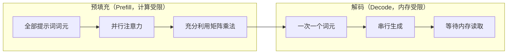
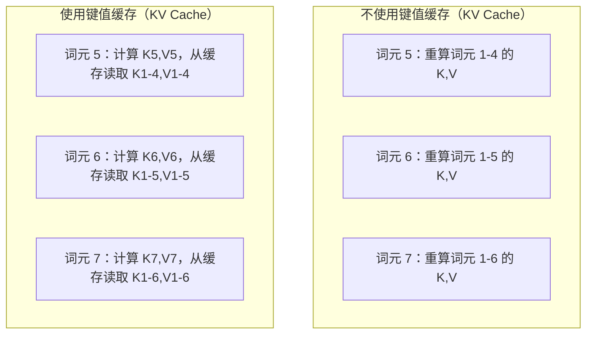
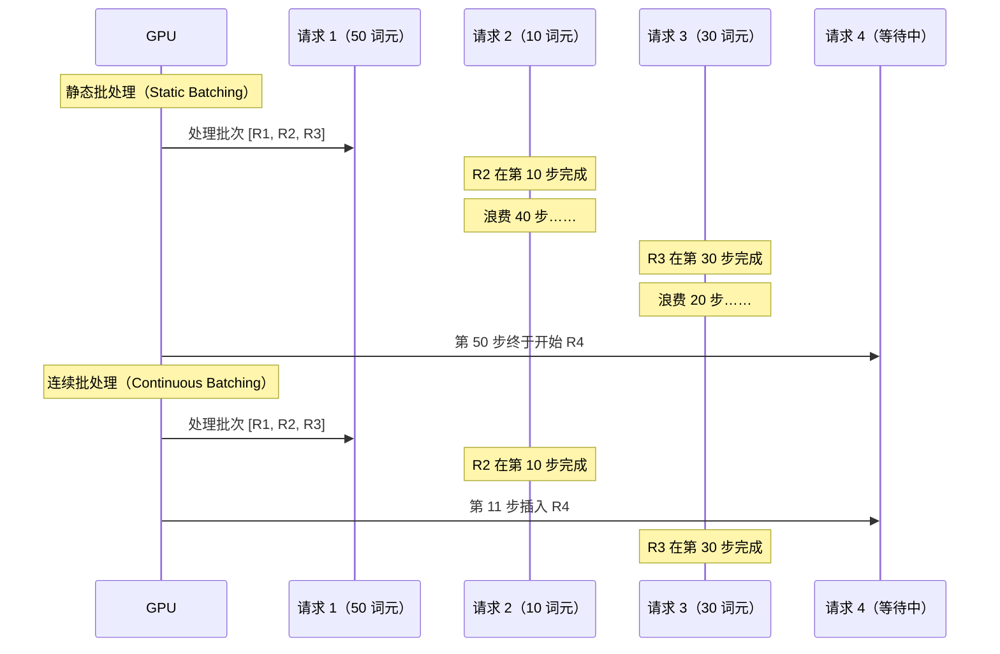
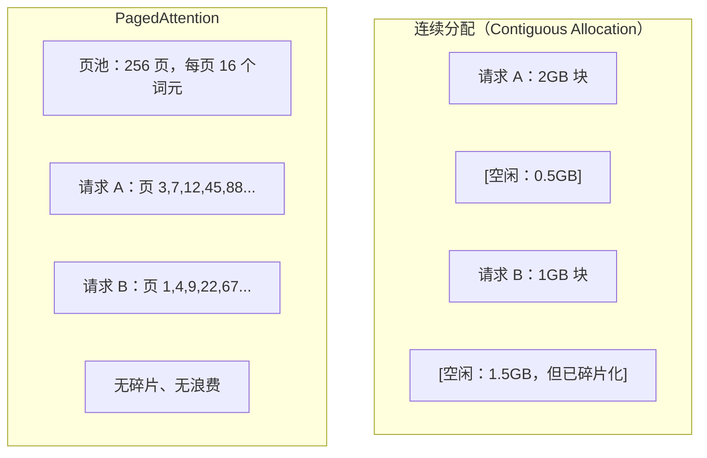
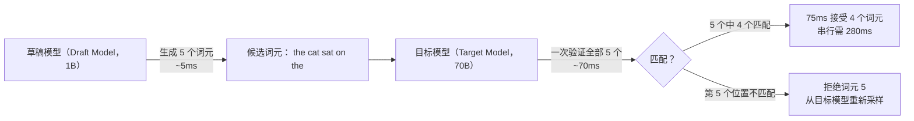

# 推理优化（Inference Optimization）

> 大语言模型推理由两个阶段组成。预填充（Prefill）并行处理提示词，受计算限制；解码（Decode）一次生成一个词元，受内存限制。每项优化都针对其中一个或两个阶段。

**Type:** Build
**Languages:** Python
**Prerequisites:** 阶段 10，第 01-08 课（Transformer 架构、注意力）
**Time:** ~120 分钟

## 学习目标（Learning Objectives）

- 实现键值缓存（Key-value Cache，KV Cache），消除自回归词元生成过程中的重复计算
- 解释大语言模型推理的预填充与解码阶段，以及两者为何具有不同瓶颈（计算受限与内存受限）
- 实现连续批处理（Continuous Batching）与分页注意力（PagedAttention）的概念，在并发请求下最大化 GPU 利用率
- 比较推理优化技术（键值缓存、推测解码、FlashAttention）及其吞吐量与延迟权衡

## 问题（The Problem）

你在 4 张 A100 GPU 上部署 Llama 3 70B。单个用户每秒获得约 50 个词元，看起来很快。随后 100 个用户同时访问端点，吞吐量降为每个用户每秒 3 个词元。你每月支付 $25,000 的 GPU 费用，回答速度却比人打字还慢。

从 1 个用户到 100 个用户，模型本身没有变化：权重、架构和数学运算都相同。变化的是工作调度方式。朴素推理会浪费超过 90% 的可用 GPU 算力。等待第 47 个词元的用户占着整个批槽位，而 GPU 内存总线在矩阵乘法之间闲置。与此同时，新用户的 2,000 词元提示词本可以利用这段空闲时间进行有效计算。

这不是扩容问题，而是调度问题。本课介绍的键值缓存、连续批处理、PagedAttention、推测解码和前缀缓存技术，决定了在服务相同流量时，你每月的推理账单是 $25k 还是 $5k。

vLLM 在 4 张 A100-80GB 上部署 Llama 3 70B，低并发时每个用户每秒约获得 50 个词元；通过连续批处理与 PagedAttention，在 100 个并发请求下仍能维持每用户每秒 15-25 个词元（Tokens per Second，TPS）。没有这些优化，相同硬件在该并发量下只能提供每用户 5 TPS。同样的 GPU、同样的模型，吞吐量却相差 4 倍。

## 概念（The Concept）

### 预填充与解码（Prefill vs Decode）

每个大语言模型推理请求都有两个不同的阶段。

**预填充（Prefill）**处理完整输入提示词。所有词元都已知，因此可以在整个序列上并行计算注意力。这是大型矩阵乘法，GPU 核心保持忙碌。瓶颈是计算：硬件每秒能提供多少浮点运算（Floating-point Operations per Second，FLOPS）。A100 的 BF16 算力为 312 TFLOPS。在单张 A100 上，70B 模型处理 4,096 词元提示词的预填充约需 400ms。

**解码（Decode）**一次生成一个输出词元。每个新词元关注所有先前词元，但每次前向传播只产生一个词元。权重矩阵大小与预填充时相同，只是现在与单个向量相乘，而不是与矩阵相乘。GPU 核心在微秒内完成计算，然后等待下一批权重从内存送达。瓶颈是内存带宽：将模型权重从高带宽内存（High Bandwidth Memory，HBM）传输到计算单元的速度。A100 带宽为 2 TB/s，FP16 的 70B 模型占 140 GB，完整读取一次需要 70ms，这就是单次解码步骤的时间下限。



**运算字节比（Ops:byte Ratio）**也称算术强度（Arithmetic Intensity），体现这种权衡。它衡量从内存载入每个字节后执行多少次运算。

```
ops:byte ratio = FLOPs per token / bytes read from memory
```

预填充一批 4,096 个词元时，每载入一个权重，约执行 4,096 次乘加运算，比例高，因此受计算限制。批大小为 1 的解码中，每载入一个权重，约执行 1 次运算，比例低，因此受内存限制。

核心认识是：*解码受内存限制，因为生成单个词元就要读取整个模型*。以下每项优化，要么减少读取量，要么增加每次读取所处理的词元批量，要么完全避免读取。

### 键值缓存（KV Cache）

注意力计算中，每个词元的查询（Query）关注所有先前词元的键（Key）和值（Value）向量。没有缓存时，生成第 N 个词元需要重新计算前 N-1 个词元的键值投影。生成第 2 个词元时投影第 1 个词元，生成第 3 个时再次投影，生成第 4 个时又投影。到第 1,000 个词元时，第 1 个词元已被投影了 999 次。

键值缓存保存所有先前词元的键值投影。生成第 N 个词元时，只计算第 N 个词元的键和值，再与第 1 到 N-1 个词元的缓存 K/V 拼接。



**键值缓存的内存公式（Memory Formula for KV Cache）：**

```
KV cache size = 2 * num_layers * num_kv_heads * head_dim * seq_len * bytes_per_param
```

对于 Llama 3 70B（80 层，采用分组查询注意力 GQA 的 8 个键值头，head_dim=128，BF16）：

```
每词元（Per Token）: 2 * 80 * 8 * 128 * 2 bytes = 327,680 bytes = 320 KB
4,096 词元时: 320 KB * 4,096 = 1.28 GB
128K 词元时: 320 KB * 131,072 = 40 GB
```

Llama 3 70B 的单次 128K 上下文对话就消耗 40 GB 键值缓存，占一张 A100 内存的一半。100 个并发用户、每人 4K 词元时，仅键值缓存就需要 128 GB。这就是键值缓存管理成为推理优化核心挑战的原因。

### 连续批处理（Continuous Batching）

静态批处理（Static Batching）等待 N 个请求到齐，再一起处理，并在*全部*完成后才接收新请求。如果一个请求需要 500 个词元，另一个只需要 10 个，那么短请求完成后，它的槽位还要闲置 490 个解码步骤。

连续批处理也称迭代级批处理（Iteration-level Batching），在任一请求完成后立即将新请求插入批中。每个解码步骤都会重新评估批次。生成 10 个词元后完成的请求会立即被等待中的请求替换。



吞吐量改善取决于输出长度差异。长度一致时，连续批处理与静态批处理相当。长度不同时（这才是常见情况），连续批处理可带来 2-5 倍吞吐量，因为 GPU 槽位不会闲置。

### 分页注意力（PagedAttention）

每个请求的键值缓存是一块连续内存。随着请求到来与结束，内存发生碎片化，就像操作系统中的 RAM 碎片。4K 词元的请求需要连续 1.28 GB。即使总共空闲 2 GB，也可能没有*连续*的 1.28 GB。结果要么浪费内存，要么拒绝请求。

来自 vLLM 的 PagedAttention 将操作系统式的虚拟内存（Virtual Memory）应用到键值缓存。它不为每个请求分配连续块，而是分配固定大小的“页（Page）”，通常每页 16 个词元。页可以位于 GPU 物理内存的任意位置。页表（Page Table）把每个请求的逻辑序列位置映射到物理页位置。



PagedAttention 还支持共享前缀的**写时复制（Copy-on-write）**。如果 50 个请求共享同一系统提示词，这段提示词的键值缓存页只存一次，由所有 50 个请求引用。只有请求发生分歧，即用户消息不同时，才获得自己的页。这大幅降低共享系统提示词应用的内存占用。

vLLM 报告称，PagedAttention 使内存浪费接近零，约 4%，而朴素分配约为 60-80%。

### 推测解码（Speculative Decoding）

解码慢是因为它串行执行：生成一个词元，反馈进去，再生成下一个。但如果能低成本猜出后续 5 个词元，再一次性验证它们呢？

推测解码用小而快的**草稿模型（Draft Model）**生成 K 个候选词元，再由大型**目标模型（Target Model）**在一次前向传播中处理全部 K 个候选，这类似预填充：并行、计算受限且高效。如果目标模型认同草稿预测，就在一次目标模型前向传播的时间内接受全部 K 个词元。如果在位置 j 不一致，就接受第 1 到 j-1 个词元，丢弃剩余词元。



加速取决于**接受率（Acceptance Rate）**，即草稿预测与目标模型一致的频率。Llama 3 8B 为 Llama 3 70B 生成草稿时，自然语言任务的典型接受率为 70-85%，对应 2-3 倍解码加速。

推测解码的三种方法：

| 方法 | 草稿来源 | 接受率 | 开销 |
|--------|-------------|-----------------|----------|
| 草稿与目标（Draft-target，Leviathan 等） | 独立小模型 | 70-85% | 草稿模型内存 |
| EAGLE（Li 等） | 目标模型上的轻量头 | 75-90% | 约 1% 额外参数 |
| n 元语法查找（N-gram Lookup） | 词元 n 元语法表 | 40-60% | 可忽略 |

**EAGLE** 在目标模型隐藏状态之上训练一个小型自回归头（Autoregressive Head），利用目标模型倒数第二层特征预测下一词元的嵌入。因为它使用目标模型自身的表示，而非独立模型的表示，所以只需很少额外内存就能获得更高接受率。EAGLE-2 增加动态草稿树，根据上下文调整候选数量。

**n 元语法推测解码（N-gram Speculative Decoding）**维护一张来自当前上下文或预建语料的 n 元语法续接表。如果草稿匹配同一对话此前出现的内容，例如重复模式、代码或结构化输出，就能在零神经网络开销下生效。平均接受率较低，但每次推测基本没有成本。

推测解码在*数学上精确*，输出分布与目标模型分布完全相同，并非近似。验证步骤确保每个被接受词元的概率，恰好等于目标模型原本分配的概率。

### 前缀缓存（Prefix Caching）

很多请求共享相同前缀，例如聊天机器人的系统提示词、检索增强生成（RAG）的上下文块、少样本示例集。没有前缀缓存时，每个请求都要从零重新计算这些共享词元的键值缓存。

前缀缓存保存常见前缀的键值缓存，并跨请求复用。带有已知前缀的新请求到达时，系统复制或引用已缓存的键值条目，只计算独有后缀的键值。

如果所有请求共享 2,000 词元的系统提示词，前缀缓存可为每个请求省去约 400ms 预填充。每秒 100 个请求时，每秒能节省 40 秒 GPU 计算，超过一张 GPU 的工作量。

SGLang 的 RadixAttention 使用基数树（Radix Tree，也称 Trie）实现前缀缓存，按词元内容索引前缀。匹配已存前缀的请求无需计算即可获得相应键值缓存。树还支持部分前缀匹配：如果一个 2,000 词元前缀有 1,500 个词元与缓存条目相同，就复用这 1,500 个，只重算其余 500 个。

### 推理引擎（Inference Engines）

生产大语言模型服务主要由三种引擎主导：

| 引擎 | 关键创新 | 最适合 |
|--------|---------------|----------|
| vLLM | PagedAttention、连续批处理 | 通用服务、最高兼容性 |
| SGLang | RadixAttention（前缀缓存）、结构化生成 | 多轮聊天机器人、约束解码 |
| TensorRT-LLM | NVIDIA 内核融合、FP8 量化 | NVIDIA 硬件上的最大单 GPU 吞吐量 |

**vLLM** 是默认起点。它支持最广泛的模型，运行于各厂商 GPU（NVIDIA、AMD、Intel），通过 PagedAttention 与连续批处理实现强吞吐量。兼容 OpenAI 的应用程序接口（Application Programming Interface，API）意味着它可以直接替换任意 OpenAI API 调用。

**SGLang** 基于与 vLLM 相同的基础，增加用于前缀缓存的 RadixAttention，以及用于结构化大语言模型程序的领域专用语言（Domain-specific Language，DSL）。如果工作负载涉及多轮对话、工具使用或约束解码（JSON 输出、正则表达式引导生成），SGLang 往往可通过前缀复用获得比 vLLM 高 2-5 倍的性能。

**TensorRT-LLM** 将模型编译为优化后的 NVIDIA GPU 内核。它融合运算，把注意力、线性变换和激活放在一个内核中，在 H100 上使用 FP8，并集成 NVIDIA Triton Inference Server 进行生产部署。它在 NVIDIA 硬件上实现最高单 GPU 吞吐量，但配置工作更多，而且只能用于 NVIDIA GPU。

Llama 3 70B 的实际数值（4 张 A100-80GB，BF16）：

| 指标 | vLLM | SGLang | TensorRT-LLM |
|--------|------|--------|---------------|
| 吞吐量（1 个用户） | ~50 TPS | ~55 TPS | ~65 TPS |
| 吞吐量（100 个用户） | 总计 ~2,500 TPS | 总计 ~3,200 TPS | 总计 ~3,000 TPS |
| 首词元时间 | ~400ms | ~300ms（前缀命中） | ~350ms |
| 最大上下文 | 128K | 128K | 128K |

### 运算字节比框架（The Ops:Byte Framework）

没有测量，就无法优化。运算字节比告诉你当前受计算限制还是受内存限制，从而决定哪些优化有效。

```
计算上限（Compute Roof）：GPU 峰值 FLOPS
内存上限（Memory Roof）：peak bandwidth * ops:byte ratio
```

运算字节比较低（解码、小批次）时，会触及内存带宽上限。增加算力，例如提高频率或核心数量，没有帮助。你需要减少内存读取（量化、键值缓存压缩），或增加批大小，用更多有效工作摊薄读取开销。

运算字节比较高（预填充、大批次）时，会触及计算上限。优化内存带宽没有帮助。你需要更快的 GPU、内核融合（Kernel Fusion）或降低精度，以获得更多 FLOPS。

| 场景 | ops:byte | 瓶颈 | 优化手段 |
|----------|----------|-------|---------------|
| 预填充，batch=1 | ~4,096 | 计算 | 内核融合、FP8 |
| 解码，batch=1 | ~1 | 内存 | 量化、键值压缩 |
| 解码，batch=32 | ~32 | 内存 | 更大批次、连续批处理 |
| 解码，batch=256 | ~256 | 过渡中 | 两者都重要 |
| 解码，batch=1024 | ~1,024 | 计算 | 内核融合、张量并行（Tensor Parallelism） |

A100 的交叉点约为 ops:byte = 156（312 TFLOPS / 2 TB/s）。低于 156 时受内存限制，高于 156 时受计算限制。连续批处理通过每次迭代装入更多词元，使解码接近这一交叉点。

```figure
context-window-slide
```

## 动手实现（Build It）

### 第 1 步：从零实现键值缓存（Step 1: KV Cache from Scratch）

构建多头键值缓存，按层、按头存储键值投影，并展示内存增长规律。

```python
import numpy as np

class KVCache:
    def __init__(self, num_layers, num_heads, head_dim, max_seq_len, dtype=np.float16):
        self.num_layers = num_layers
        self.num_heads = num_heads
        self.head_dim = head_dim
        self.max_seq_len = max_seq_len
        self.dtype = dtype

        self.k_cache = np.zeros(
            (num_layers, num_heads, max_seq_len, head_dim), dtype=dtype
        )
        self.v_cache = np.zeros(
            (num_layers, num_heads, max_seq_len, head_dim), dtype=dtype
        )
        self.seq_len = 0

    def update(self, layer_idx, new_keys, new_values):
        num_new = new_keys.shape[1]
        end = self.seq_len + num_new
        self.k_cache[layer_idx, :, self.seq_len:end, :] = new_keys
        self.v_cache[layer_idx, :, self.seq_len:end, :] = new_values
        return (
            self.k_cache[layer_idx, :, :end, :],
            self.v_cache[layer_idx, :, :end, :]
        )

    def advance(self, num_tokens):
        self.seq_len += num_tokens

    def memory_bytes(self):
        return self.k_cache.nbytes + self.v_cache.nbytes

    def used_bytes(self):
        per_token = 2 * self.num_layers * self.num_heads * self.head_dim * np.dtype(self.dtype).itemsize
        return per_token * self.seq_len
```

### 第 2 步：带键值缓存的注意力（Step 2: Attention with KV Cache）

一个简化的多头注意力，在解码步骤中使用键值缓存。

```python
def scaled_dot_product_attention(query, keys, values):
    head_dim = query.shape[-1]
    scores = np.matmul(query, keys.transpose(0, 1, 3, 2)) / np.sqrt(head_dim)
    seq_len_q = scores.shape[-2]
    seq_len_k = scores.shape[-1]
    if seq_len_q > 1:
        mask = np.triu(np.ones((seq_len_q, seq_len_k), dtype=np.float32), k=seq_len_k - seq_len_q + 1)
        scores = scores + mask * (-1e9)
    max_scores = np.max(scores, axis=-1, keepdims=True)
    exp_scores = np.exp(scores - max_scores)
    attn_weights = exp_scores / np.sum(exp_scores, axis=-1, keepdims=True)
    return np.matmul(attn_weights, values)


class MultiHeadAttention:
    def __init__(self, d_model, num_heads):
        self.num_heads = num_heads
        self.head_dim = d_model // num_heads
        scale = np.sqrt(2.0 / d_model)
        self.W_q = np.random.randn(d_model, d_model).astype(np.float32) * scale
        self.W_k = np.random.randn(d_model, d_model).astype(np.float32) * scale
        self.W_v = np.random.randn(d_model, d_model).astype(np.float32) * scale
        self.W_o = np.random.randn(d_model, d_model).astype(np.float32) * scale

    def forward(self, x, kv_cache=None, layer_idx=0):
        batch, seq_len, d_model = x.shape
        Q = np.matmul(x, self.W_q).reshape(batch, seq_len, self.num_heads, self.head_dim).transpose(0, 2, 1, 3)
        K = np.matmul(x, self.W_k).reshape(batch, seq_len, self.num_heads, self.head_dim).transpose(0, 2, 1, 3)
        V = np.matmul(x, self.W_v).reshape(batch, seq_len, self.num_heads, self.head_dim).transpose(0, 2, 1, 3)

        if kv_cache is not None:
            K_full, V_full = kv_cache.update(layer_idx, K[0], V[0])
            K = K_full[np.newaxis, :, :, :]
            V = V_full[np.newaxis, :, :, :]
            if seq_len == 1:
                kv_cache.advance(1)

        attn_out = scaled_dot_product_attention(Q, K, V)
        attn_out = attn_out.transpose(0, 2, 1, 3).reshape(batch, -1, d_model)
        return np.matmul(attn_out, self.W_o)
```

### 第 3 步：连续批处理模拟器（Step 3: Continuous Batching Simulator）

模拟静态批处理与连续批处理的调度差异。

```python
import heapq

class Request:
    def __init__(self, request_id, prompt_tokens, output_tokens, arrival_step):
        self.request_id = request_id
        self.prompt_tokens = prompt_tokens
        self.output_tokens = output_tokens
        self.arrival_step = arrival_step
        self.tokens_generated = 0
        self.start_step = None
        self.end_step = None

    def is_done(self):
        return self.tokens_generated >= self.output_tokens


def simulate_static_batching(requests, batch_size):
    step = 0
    completed = []
    queue = list(requests)
    queue.sort(key=lambda r: r.arrival_step)

    while queue:
        batch = []
        while queue and len(batch) < batch_size:
            r = queue.pop(0)
            r.start_step = max(step, r.arrival_step)
            batch.append(r)

        if batch:
            step = max(step, max(r.start_step for r in batch))
            max_output = max(r.output_tokens for r in batch)
            for r in batch:
                r.tokens_generated = r.output_tokens
                r.end_step = step + max_output
            step += max_output
            completed.extend(batch)

    return completed


def simulate_continuous_batching(requests, batch_size):
    step = 0
    completed = []
    queue = sorted(requests, key=lambda r: r.arrival_step)
    queue_idx = 0
    active = []
    waiting = []

    while queue_idx < len(queue) or active or waiting:
        while queue_idx < len(queue) and queue[queue_idx].arrival_step <= step:
            waiting.append(queue[queue_idx])
            queue_idx += 1

        while waiting and len(active) < batch_size:
            r = waiting.pop(0)
            r.start_step = step
            active.append(r)

        if not active:
            if waiting:
                step += 1
                continue
            elif queue_idx < len(queue):
                step = queue[queue_idx].arrival_step
                continue
            else:
                break

        for r in active:
            r.tokens_generated += 1

        done = [r for r in active if r.is_done()]
        for r in done:
            r.end_step = step + 1
            completed.append(r)
        active = [r for r in active if not r.is_done()]

        step += 1

    return completed


def batching_stats(completed):
    latencies = [r.end_step - r.arrival_step for r in completed]
    total_time = max(r.end_step for r in completed) - min(r.arrival_step for r in completed)
    total_tokens = sum(r.output_tokens for r in completed)
    return {
        "avg_latency": np.mean(latencies),
        "p50_latency": np.median(latencies),
        "p99_latency": np.percentile(latencies, 99),
        "total_time": total_time,
        "throughput": total_tokens / total_time if total_time > 0 else 0,
    }
```

### 第 4 步：前缀缓存（Step 4: Prefix Cache）

基于字典树（Trie）的前缀缓存，为共享前缀存储键值条目。

```python
class TrieNode:
    def __init__(self):
        self.children = {}
        self.kv_data = None
        self.hit_count = 0


class PrefixCache:
    def __init__(self, max_entries=1000):
        self.root = TrieNode()
        self.max_entries = max_entries
        self.total_entries = 0
        self.hits = 0
        self.misses = 0

    def _walk(self, token_ids):
        node = self.root
        depth = 0
        for tid in token_ids:
            if tid not in node.children:
                break
            node = node.children[tid]
            depth += 1
        return node, depth

    def lookup(self, token_ids):
        node, depth = self._walk(token_ids)
        if depth > 0:
            self.hits += 1
            current = self.root
            for tid in token_ids[:depth]:
                current = current.children[tid]
                current.hit_count += 1
            kv_entries = []
            current = self.root
            for tid in token_ids[:depth]:
                current = current.children[tid]
                if current.kv_data is not None:
                    kv_entries.append(current.kv_data)
            return depth, kv_entries
        self.misses += 1
        return 0, []

    def insert(self, token_ids, kv_per_token):
        node = self.root
        for i, tid in enumerate(token_ids):
            if tid not in node.children:
                if self.total_entries >= self.max_entries:
                    return i
                node.children[tid] = TrieNode()
                self.total_entries += 1
            node = node.children[tid]
            if i < len(kv_per_token):
                node.kv_data = kv_per_token[i]
        return len(token_ids)

    def hit_rate(self):
        total = self.hits + self.misses
        return self.hits / total if total > 0 else 0.0
```

### 第 5 步：推测解码模拟器（Step 5: Speculative Decoding Simulator）

以可配置接受率模拟草稿与目标模型的推测解码。

```python
class DraftModel:
    def __init__(self, vocab_size, acceptance_rate=0.8):
        self.vocab_size = vocab_size
        self.acceptance_rate = acceptance_rate

    def generate(self, context, num_tokens):
        tokens = np.random.randint(0, self.vocab_size, size=num_tokens)
        return tokens

    def get_probs(self, context, token):
        probs = np.random.dirichlet(np.ones(self.vocab_size))
        return probs


class TargetModel:
    def __init__(self, vocab_size):
        self.vocab_size = vocab_size

    def get_probs(self, context, tokens=None):
        if tokens is not None:
            return [np.random.dirichlet(np.ones(self.vocab_size)) for _ in tokens]
        return np.random.dirichlet(np.ones(self.vocab_size))


def speculative_decode(draft_model, target_model, context, num_speculative=5,
                       draft_cost=1.0, target_cost=10.0, verify_cost=12.0):
    total_tokens = 0
    total_cost = 0.0
    accepted_counts = []
    context = list(context)

    max_tokens = 100

    while total_tokens < max_tokens:
        draft_tokens = draft_model.generate(context, num_speculative)
        total_cost += draft_cost * num_speculative

        target_probs = target_model.get_probs(context, draft_tokens)
        total_cost += verify_cost

        accepted = 0
        for i, token in enumerate(draft_tokens):
            draft_p = draft_model.get_probs(context + list(draft_tokens[:i]), token)
            target_p = target_probs[i]

            r = np.random.random()
            acceptance_prob = min(1.0, target_p[token] / (draft_p[token] + 1e-10))

            if r < draft_model.acceptance_rate:
                accepted += 1
                context.append(token)
                total_tokens += 1
            else:
                new_token = np.random.choice(draft_model.vocab_size, p=target_p)
                context.append(new_token)
                total_tokens += 1
                break

        accepted_counts.append(accepted)

        if accepted == num_speculative:
            bonus_probs = target_model.get_probs(context)
            bonus_token = np.random.choice(draft_model.vocab_size, p=bonus_probs)
            context.append(bonus_token)
            total_tokens += 1

    sequential_cost = total_tokens * target_cost
    return {
        "total_tokens": total_tokens,
        "speculative_cost": total_cost,
        "sequential_cost": sequential_cost,
        "speedup": sequential_cost / total_cost if total_cost > 0 else 1.0,
        "avg_accepted": np.mean(accepted_counts),
        "acceptance_rate": np.mean(accepted_counts) / num_speculative,
    }


def compare_speculation_strategies(vocab_size=1000, num_trials=20):
    results = {}

    for name, acceptance_rate, spec_tokens in [
        ("Draft-target (8B->70B)", 0.78, 5),
        ("EAGLE", 0.85, 6),
        ("N-gram", 0.50, 4),
        ("No speculation", 0.0, 0),
    ]:
        if spec_tokens == 0:
            results[name] = {
                "speedup": 1.0,
                "acceptance_rate": 0.0,
                "avg_accepted": 0.0,
            }
            continue

        trial_results = []
        for _ in range(num_trials):
            draft = DraftModel(vocab_size, acceptance_rate=acceptance_rate)
            target = TargetModel(vocab_size)
            context = list(np.random.randint(0, vocab_size, size=10))
            result = speculative_decode(draft, target, context, num_speculative=spec_tokens)
            trial_results.append(result)

        results[name] = {
            "speedup": np.mean([r["speedup"] for r in trial_results]),
            "acceptance_rate": np.mean([r["acceptance_rate"] for r in trial_results]),
            "avg_accepted": np.mean([r["avg_accepted"] for r in trial_results]),
        }

    return results
```

### 第 6 步：键值缓存内存分析器（Step 6: KV Cache Memory Profiler）

计算真实模型配置的键值缓存内存需求。

```python
MODEL_CONFIGS = {
    "Llama-3-8B": {
        "num_layers": 32, "num_kv_heads": 8, "head_dim": 128,
        "model_params_b": 8, "gqa": True,
    },
    "Llama-3-70B": {
        "num_layers": 80, "num_kv_heads": 8, "head_dim": 128,
        "model_params_b": 70, "gqa": True,
    },
    "Llama-3-405B": {
        "num_layers": 126, "num_kv_heads": 8, "head_dim": 128,
        "model_params_b": 405, "gqa": True,
    },
    "Mistral-7B": {
        "num_layers": 32, "num_kv_heads": 8, "head_dim": 128,
        "model_params_b": 7, "gqa": True,
    },
    "GPT-4-est": {
        "num_layers": 120, "num_kv_heads": 96, "head_dim": 128,
        "model_params_b": 1800, "gqa": False,
    },
}


def kv_cache_memory(config, seq_len, dtype_bytes=2):
    per_token = 2 * config["num_layers"] * config["num_kv_heads"] * config["head_dim"] * dtype_bytes
    total = per_token * seq_len
    return {
        "per_token_bytes": per_token,
        "per_token_kb": per_token / 1024,
        "total_bytes": total,
        "total_mb": total / (1024 ** 2),
        "total_gb": total / (1024 ** 3),
    }


def memory_budget(config, gpu_memory_gb, model_dtype_bytes=2, kv_dtype_bytes=2):
    model_memory_gb = config["model_params_b"] * 1e9 * model_dtype_bytes / (1024 ** 3)
    overhead_gb = gpu_memory_gb * 0.1
    available_for_kv = gpu_memory_gb - model_memory_gb - overhead_gb

    if available_for_kv <= 0:
        return {"error": "Model does not fit in GPU memory", "model_memory_gb": model_memory_gb}

    per_token = 2 * config["num_layers"] * config["num_kv_heads"] * config["head_dim"] * kv_dtype_bytes
    max_tokens = int(available_for_kv * (1024 ** 3) / per_token)

    return {
        "gpu_memory_gb": gpu_memory_gb,
        "model_memory_gb": round(model_memory_gb, 1),
        "overhead_gb": round(overhead_gb, 1),
        "available_for_kv_gb": round(available_for_kv, 1),
        "max_total_tokens": max_tokens,
        "max_users_at_2k": max_tokens // 2048,
        "max_users_at_4k": max_tokens // 4096,
        "max_users_at_32k": max_tokens // 32768,
    }
```

## 实际应用（Use It）

使用 vLLM：

```python
from vllm import LLM, SamplingParams

llm = LLM(
    model="meta-llama/Meta-Llama-3-70B-Instruct",
    tensor_parallel_size=4,
    enable_prefix_caching=True,
    max_model_len=8192,
    gpu_memory_utilization=0.9,
)

params = SamplingParams(temperature=0.7, max_tokens=256)
outputs = llm.generate(["Explain inference optimization in one paragraph."], params)
```

使用 SGLang 实现前缀缓存与结构化输出：

```python
import sglang as sgl

@sgl.function
def classify(s, text):
    s += sgl.system("You are a classifier. Output JSON only.")
    s += sgl.user(f"Classify this text: {text}")
    s += sgl.assistant(sgl.gen("result", regex=r'\{"label": "(positive|negative|neutral)"\}'))

runtime = sgl.Runtime(model_path="meta-llama/Meta-Llama-3-70B-Instruct", tp_size=4)
sgl.set_default_backend(runtime)

results = classify.run_batch([
    {"text": "This product is amazing!"},
    {"text": "Terrible experience."},
    {"text": "It was okay I guess."},
])
```

使用 TensorRT-LLM：

```python
import tensorrt_llm
from tensorrt_llm.runtime import ModelRunner

runner = ModelRunner.from_dir("./llama-70b-trt-engine/", rank=0)

outputs = runner.generate(
    batch_input_ids=[tokenizer.encode("Explain KV caching.")],
    max_new_tokens=256,
    temperature=0.7,
)
```

## 交付成果（Ship It）

本课产出：
- `outputs/skill-inference-optimization.md`：用于诊断和优化大语言模型推理服务的技能（Skill）

## 练习（Exercises）

1. 修改键值缓存分析器，比较 FP16、FP8 和 INT4 键值缓存量化。针对 4K 上下文的 Llama 3 70B，计算三种精度在 4 张 A100-80GB 上的最大并发用户数。INT4 键值量化应使用户容量大致增加到 4 倍。

2. 扩展连续批处理模拟器，跟踪 GPU 利用率，即每步已填充批槽位的比例。使用输出长度服从帕累托分布（Pareto Distribution，shape=1.5、scale=20）的 50 个请求，绘制静态与连续批处理的利用率随时间变化曲线。连续批处理应保持超过 80% 的利用率。

3. 实现分组查询注意力（Grouped-query Attention，GQA）版本的键值缓存，使 `num_kv_heads < num_query_heads`。Llama 3 70B 有 64 个查询头，却只有 8 个键值头。计算相对完整多头注意力的内存节省，键值缓存大小应减少为八分之一。

4. 构建使用最近最少使用（Least Recently Used，LRU）淘汰的前缀缓存。将 max_entries 设为 500，生成 1,000 个请求，其中 60% 共享 5 个常见前缀之一。测量命中率，并与无限缓存比较。良好的淘汰策略应使命中率保持在 55% 以上。

5. 扩展推测解码模拟器，实现 EAGLE-2 风格的树式推测。不再生成 K 个草稿词元的单链，而是生成候选树，例如 3 层、每层 2 个分支，共 8 个叶候选。比较每轮验证接受的总词元数与线性推测的差异。

## 关键术语（Key Terms）

| 术语 | 常见说法 | 实际含义 |
|------|----------------|----------------------|
| 预填充（Prefill） | “处理提示词” | 并行计算所有输入词元的注意力；完整矩阵乘法使 GPU 核心忙碌，因此受计算限制 |
| 解码（Decode） | “生成词元” | 每次前向传播产生一个词元，每次读取完整模型权重；计算先于下一批权重到达而结束，因此受内存限制 |
| 键值缓存（KV Cache） | “缓存注意力状态” | 存储所有先前词元的键值投影，避免每个解码步骤重算，以内存换计算 |
| 连续批处理（Continuous Batching） | “动态批处理” | 任一请求完成后立即向运行批中插入新请求，每次解码迭代评估，而不等待整批完成 |
| 分页注意力（PagedAttention） | “键值缓存的虚拟内存” | 以固定大小页而非连续块分配键值缓存，消除内存碎片，并支持共享前缀的写时复制 |
| 推测解码（Speculative Decoding） | “起草并验证” | 快速草稿模型提出多个词元，再由目标模型一次前向传播验证；数学精确，可提速 2-3 倍 |
| EAGLE | “自推测解码” | 在目标模型自身隐藏状态上训练轻量头的推测解码变体，接受率高于独立草稿模型 |
| 前缀缓存（Prefix Caching） | “复用系统提示词键值” | 保存常见前缀（系统提示词、少样本示例）的已算键值条目，跨请求复用以跳过冗余预填充 |
| 运算字节比（Ops:byte Ratio） | “算术强度” | 计算运算数与内存读取字节数之比，决定工作负载受计算限制（高比值）还是内存限制（低比值） |
| 首词元时间（Time to First Token，TTFT） | “TTFT” | 从接收请求到产生首个输出词元的延迟，长提示词时主要由预填充时间决定 |

## 延伸阅读（Further Reading）

- Kwon 等，《使用 PagedAttention 高效管理大语言模型服务的内存》（2023）：vLLM 论文，引入分页键值缓存管理，如今已是推理服务的行业标准
- Leviathan 等，《通过推测解码实现 Transformer 快速推理》（2023）：奠基论文，证明草稿与验证推测能在获得 2-3 倍加速的同时，保持精确的目标模型分布
- Li 等，《EAGLE：推测采样需要重新思考特征不确定性》（2024）：在目标模型自身特征上训练头，而非使用独立草稿模型，从而提高接受率
- Zheng 等，《SGLang：高效执行结构化语言模型程序》（2024）：引入用于前缀缓存的 RadixAttention，以及多次大语言模型调用程序的编程模型
- Williams 等，《Roofline：面向多核架构的直观可视化性能模型》（2009）：最初的屋顶线模型论文，形式化了用运算字节比分析计算与内存瓶颈的框架
