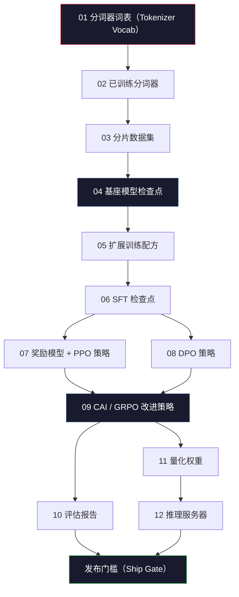
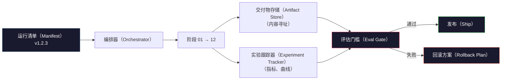

# 构建完整大语言模型流水线（Building a Complete LLM Pipeline）

> 第 01 到 12 课的内容，都是同一条流水线中的阶段。本课提供骨架，将它们连成一次端到端运行：分词、预训练、扩展、监督微调、对齐、评估、量化、提供服务。你不会在笔记本上训练 70B 模型，而是产出 2026 年前沿团队决定发布内容时使用的编排层、运行清单、评估门槛和回滚方案。这就是综合实践（Capstone）。

**Type:** Build
**Languages:** Python (stdlib)
**Prerequisites:** 阶段 10 的全部第 01-12 课
**Time:** ~120 分钟

## 学习目标（Learning Objectives）

- 将前面十一项课程内容（分词器、数据、预训练、扩展、SFT、RLHF、DPO、CAI、评估、量化、推理）组合为一份可复现的流水线规格
- 定义阶段间的交付物契约（Artifact Contract）：每个阶段消费什么、产出什么，以及下一阶段如何验证输入
- 构建编排器（Orchestrator），跟踪实验、计算交付物哈希，并依据评估阈值控制发布决策
- 设计回滚方案（Rollback Plan）：哪些交付物重跑便宜，哪些昂贵，以及检查点损坏的代价

## 问题（The Problem）

前面各课都能独立工作：分词器已训练，小型 GPT 已预训练，SFT 数据集已组装，奖励模型已训练，DPO 已运行，评估已测量，量化权重已导出，推理服务器已启动。但它们各自是一个笔记本，各有自己的约定、输出路径和随机种子。

前沿模型训练不是一个笔记本。Llama 3 405B 在约 54 天内消耗了 3000 万 H100 小时，DeepSeek-V3 使用约 280 万 H800 小时。在这期间，一次检查点损坏、一次数据污染或一次评估退化，都可能让团队损失一周实际时间和一个月 GPU 预算。团队依靠规范的流水线管理应对：每个阶段都有确定的输入、确定的输出、清单、哈希和门槛。

这是综合实践。你不会在笔记本上端到端运行整条流水线，而是编写协调各阶段的编排器、描述运行的清单、控制发布决策的验证器，以及让第三方仅凭一个文件重跑你工作的重放方案。代码不多，但工程纪律要求很高。

这一模式从 100M 扩展到 1T 参数仍然不变。同样四个组件：清单、编排器、评估门槛和交付物存储，既能运行 Llama 3，也能运行你的业余 GPT。区别是每个阶段配置中的数值大小，而非流水线的结构。

## 概念（The Concept）

### 十二个阶段（The Twelve Stages）

阶段 10 的每课对应一个流水线阶段。完整依赖图如下。



阶段 07 和 08 可以并行运行，其他都是硬依赖。修改阶段 02 的分词器会让所有下游交付物失效；修改阶段 10 的评估，只会让发布决策失效。

### 运行清单（The Manifest）

运行清单（Manifest）是一个文件，完整描述一次运行，足以据此重放。流水线产出的任何内容，都不应依赖未记录在清单中的状态。这些字段普通但不可缺少。

```
pipeline_version: 1.2.3
seed: 42
git_commit: a1b2c3d4
stages:
  01_tokenizer:
    recipe: bpe_32k
    input_hash: sha256:...
    output_hash: sha256:...
    wall_clock_sec: 3600
    cost_usd: 12
```

阶段 N 的输出哈希就是阶段 N+1 的输入哈希。任何偏差都会停止流水线，由此尽早发现数据损坏。身处另一大洲的同事，也可用同样方式验证其重放是否生成了与你相同的交付物。

实践中，团队使用小型 YAML 模式和清单检查器，与上一次成功运行进行差异比较。预期字段（成本、实际运行时间）之外的任何变化都是危险信号。

### 交付物类型（Artifact Typing）

每个阶段的输出都是有类型的交付物。不是一个不透明目录，也不是 pickle，而是具有已知模式的命名类型。

| 阶段 | 交付物类型 | 关键字段 |
|-------|--------------|-----------|
| 01-02 | 分词器（Tokenizer） | vocab.json、merges.txt、config.json、哈希 |
| 03 | 数据集（Dataset） | shards[]、行数、词元数、去重统计 |
| 04-05 | 检查点（Checkpoint） | weights.safetensors、config.json、优化器状态、步数 |
| 06 | 监督微调模型（SFT Model） | 检查点 + SFT 配方 + 数据混合比例 |
| 07 | 奖励模型（Reward Model） | RM 检查点 + 偏好数据哈希 |
| 08-09 | 策略（Policy） | 检查点 + 参考哈希 + beta + 已消耗 KL 预算 |
| 10 | 评估报告（Eval Report） | 基准分数 + 回归差异 + 评估数据哈希 |
| 11 | 量化模型（Quantized Model） | 量化权重 + 校准数据 + 相对 FP16 的准确性差值 |
| 12 | 服务器规格（Server Spec） | 端点 + 模型哈希 + 配置 + 可观测性挂钩 |

类型机制防止最常见的故障模式：把阶段 08 的输出当成阶段 06 的输入，使 DPO 训练模型沿 SFT 路径发布。有类型的交付物和阶段签名，让这些错误在编译期暴露，而不是运行到第五天才失败。

### 评估门槛（The Eval Gate）

发布不是“训练完成”，而是“训练完成且通过评估门槛”。门槛在运行开始前就要定义。

```
gates:
  mmlu:      >= baseline + 0.5   # 不得退化
  humaneval: >= baseline + 1.0
  truthfulqa: >= baseline         # 不得下降
  safety_refusal_rate: <= 0.05
  kl_from_reference: <= 25.0
  cost_total_usd: <= 50000
```

每项门槛都是数值阈值，不能是“看起来不错”，也不能是主观签字。如果所有门槛通过，交付物就标记为可发布；任一失败，则暂缓运行结果的发布，等待指定审核者明确豁免，豁免本身也记录进清单。

两项门槛能拦住多数灾难。*回归（Regression）*门槛要求新模型在核心基准上至少不劣于旧模型，用来捕获训练缺陷。*KL 预算（KL Budget）*门槛要求对齐后策略相对参考模型的漂移不超过 X，用来发现过度对齐。每条生产流水线都具备两者。

### 编排器（The Orchestrator）

编排器是一小段代码，负责读取清单、调度阶段、跟踪交付物，并在任何契约违反时停止。它不是 Airflow，也不是 Kubeflow。为保证流水线规范，你需要的是自己编写的简单、可预期的工具。

编排器职责很集中：

1. 从清单解析有向无环图（Directed Acyclic Graph，DAG）。
2. 对每个阶段，检查预期输出是否已经存在且哈希正确，若是则跳过。
3. 运行阶段，捕获 stdout/stderr，测量实际时间和成本。
4. 验证输出哈希是否符合下游阶段的预期输入哈希。
5. 失败时写出部分清单，记录确切失败阶段，并以非零状态退出。

这些大约需要 200 行 Python，类似本课的 `code/main.py`。真正的流水线底层使用 `torchrun` 或 `ray` 在集群上执行各阶段，但编排器自身运行在单台机器上。

### 实验跟踪与交付物存储（Experiment Tracking and Artifact Storage）

两个外部系统为流水线提供基础支持。

**实验跟踪器（Experiment Tracker，wandb、neptune、mlflow）。**按阶段记录损失曲线、评估指标和系统遥测。三周后需要比较运行 A 与 B 时，就去跟踪器中查看。团队几乎总使用托管跟踪器，因为自行编写会占用本应投入训练的时间。

**交付物存储（Artifact Store，S3、R2、GCS）。**用于检查点、数据集、分词器和评估报告的不可变对象存储。交付物按哈希寻址，而不是按文件名。`latest.pt` 这样的文件名容易误用，`ckpt-7b-step-20000-sha256:abc123.safetensors` 才是契约。

编排器向两者写入。跟踪器供人查看图表，交付物存储供下一阶段查找输入。

### 成本核算（Costing）

一次前沿训练有明确金额，预算纪律体现在两处。

**运行前估算（Pre-run Estimate）。**从清单计算预期浮点运算量（预训练：6 x params x tokens）、预期 GPU 小时（FLOPs / peak throughput / utilization），再按当前租赁价格计算金额。如果估算超过预算门槛，流水线拒绝启动。

**运行中跟踪（In-run Tracking）。**逐阶段将实际时间与成本记录进清单。每阶段结束后检查剩余预算。如果某阶段超支，就以新的剩余预算评估下一阶段门槛。不要等投资人来电时才发现资金已耗尽。

Llama 3 报告的成本为 $61M，DeepSeek-V3 报告的主要预训练成本为 $5.6M。差距主要来自硬件效率和混合专家（Mixture-of-Experts，MoE）；但之所以能看到具体成本，是因为两支团队按阶段跟踪，而非只按整次运行跟踪。

### 可复现性与确定性（Reproducibility vs Determinism）

两者并不相同。*可复现（Reproducible）*指同样清单、代码和基础设施，产生下游指标等价的检查点。*确定性（Deterministic）*指输出逐位相同。

现代大语言模型训练可复现，但不具有确定性。分布式训练的归约顺序、GPU 内核的不确定性（cuBLAS、flash-attn）以及混合精度舍入，共同使不同运行的浮点数出现 1e-5 级别差异。这对不变的最终指标没有影响，却会让逐位差异调试无法进行。应对方式是记录每个阶段的输入哈希、输出哈希和主要指标；如果这些匹配，即使权重并非逐位相同，该运行也算“已复现”。



### 回滚方案（Rollback Plan）

运行开始前，写清每个阶段失败后的处理，分为三类。

- **重跑便宜**（数小时）：分词器、评估、量化、推理服务器，直接重跑。
- **中等成本**（数天）：SFT、DPO、CAI，保留基座模型，只重跑对齐阶段。
- **昂贵**（数周、数百万美元）：预训练。这里的回滚方案不是“重跑”，而是“使用最后一个有效检查点，并以修订数据重跑更便宜的下游阶段”。

阶段依赖有类型和哈希，因此编排器可自动计算回滚集合：让失败阶段及其全部后代失效。阶段 06（SFT）失败会使 06、07、08、09、10、11、12 失效；阶段 11（量化）失败只使 11 和 12 失效。提前明确，避免团队凌晨 4 点疲惫时临时决定。

### 2026 年观察到的生产配方（Production Recipes Observed in 2026）

多数前沿团队收敛到同一骨架。

- 分词器：带字节回退（Byte Fallback）的 128k 字节对编码（Byte Pair Encoding，BPE），在小型、均衡的多语言切片上训练。
- 预训练：10-20T 词元，主要是网页、代码和合成数据。采用 Muon 或 AdamW 优化器，FSDP2 或 DeepSpeed ZeRO-3，梯度检查点（Gradient Checkpointing），BF16 权重与 FP32 主副本。
- 监督微调（Supervised Fine-tuning，SFT）：500k-2M 指令对，混合人工与合成数据，对评估集严格去重。
- 对齐（Alignment）：DPO 或 CAI + GRPO。仅当偏好信号的维度过多、DPO 难以处理时才用 RLHF。
- 评估：MMLU-Pro、MATH、HumanEval+、GPQA、SWE-Bench Verified、LiveBench，以及公众从未见过的私有留出集。
- 量化：服务使用 4 位 GPTQ 或 AWQ；准确性差值重要的安全评估使用 8 位。
- 服务：vLLM、TensorRT-LLM 或自研引擎，采用连续批处理、推测解码和键值缓存淘汰。

数值每六个月变化一次，骨架不变。

```figure
beam-search
```

## 动手实现（Build It）

本课代码是编排器与清单检查器，而非十二份训练脚本。每个阶段用占位实现模拟，生成形状与哈希正确的输出交付物。在真实阶段消耗 GPU 费用之前，端到端运行编排器可证明流水线各环节已连通。

完整实现见 `code/main.py`。关键部分：

- `Manifest` 数据类：流水线版本、随机种子、Git 提交、阶段、门槛。
- `Stage` 数据类：名称、类型、输入哈希、输出哈希、实际时间、成本。
- `Orchestrator.run()`：解析 DAG、调度阶段、验证哈希、更新清单。
- `EvalGate.check()`：读取阈值，与最新评估报告比较，返回通过或失败。
- `ArtifactStore`（内存桩实现）：按哈希存取，模拟 S3。
- `CostTracker`：逐阶段及累计跟踪，超过上限时停止。

`main.py` 中的流水线运行十二个占位阶段，生成清单，并触发一个失败的评估门槛，展示暂缓发布的运行。将每个占位实现替换为对应课程的真实训练脚本，就得到真实前沿流水线使用的骨架。

## 实际应用（Use It）

标准工作流程有三条命令。

```
python code/main.py plan    # 验证清单、估算成本、打印 DAG
python code/main.py run     # 执行阶段，写入 manifest.out.yaml
python code/main.py gate    # 读取 manifest.out.yaml，应用评估门槛，决定发布或暂缓
```

每次先运行 `plan`。多数流水线缺陷在规划阶段就会显现，例如门槛阈值缺失、哈希过时和预算超支。运行 `plan` 没有成本，运行 `run` 则昂贵。应在便宜的一侧发现缺陷来节省费用。

`gate` 输出为 `SHIP` 或 `HOLD: <reason>`。暂缓的运行并非失败，而是决策点。指定审核者要么批准豁免并记录，要么批准回滚。

## 交付成果（Ship It）

本课产出 `outputs/skill-llm-pipeline-reviewer.md`。输入拟议流水线清单，它会检查全部契约：阶段类型、哈希链、门槛、回滚方案、成本估算。缺少评估门槛、KL 预算无上限，或混合了评估与训练数据的运行清单，都会被拒绝批准。

## 练习（Exercises）

1. 扩展编排器，支持阶段 07 与 08 并行执行，使用标准库 `concurrent.futures` 模块。确认最终清单记录两个阶段的输出，且阶段 09 的输入哈希是两者的确定性组合。

2. 添加“污染检查（Contamination Check）”门槛。给定评估数据集哈希与训练数据集分片，计算重叠（精确字符串匹配或 13 元语法匹配）。重叠超过 0.1% 时失败。输入被污染的训练集，确认门槛会暂缓运行结果发布。

3. 从第一性原理实现成本估算器。阶段 04（预训练）运算量估为 6 x params x tokens，假设 H100 的 BF16 算力为 989 TFLOPs，模型浮点运算利用率（Model FLOPs Utilization，MFU）为 40%，每 GPU 小时 $2.50。报告 7B 模型训练 2T 词元的估算，并与公开的 Llama 2 数值比较。

4. 实现部分回滚。模拟阶段 09（CAI）失败，然后重跑 09 到 12，保留 01-08 缓存。编排器应通过哈希识别缓存交付物并跳过它们。测量相对完整重跑节省的实际时间。

5. 添加可观测性（Observability）。为每个阶段发出 OpenTelemetry 跨度（Span），属性包含参数量、已见词元数、损失和成本。将跨度发送到本地收集器。重点不是仪表板，而是用一个跟踪 ID 追溯每个阶段的健康状况。

## 关键术语（Key Terms）

| 术语 | 常见说法 | 实际含义 |
|------|----------------|----------------------|
| 运行清单（Manifest） | “配方文件” | 描述流水线版本、种子、逐阶段配置和门槛阈值的 YAML 或 JSON，足以重放一次运行 |
| 内容寻址（Content-addressed） | “按哈希而非名称” | 按内容 SHA-256 存储交付物，避免混淆版本 A 和 B |
| 评估门槛（Eval Gate） | “发布标准” | 基准指标和安全分数的数值阈值，通过后才能将交付物标为可发布 |
| KL 预算（KL Budget） | “对齐漂移多远” | 对齐阶段累计 KL(policy || reference) 的上限，以门槛强制执行 |
| 模型浮点运算利用率（Model FLOPs Utilization，MFU） | “用了多少 GPU” | 实际 FLOPs 除以理论峰值，70B 规模通常为 40%，7B 为 55% |
| 回滚方案（Rollback Plan） | “坏了怎么办” | 预先为各阶段写好的失败动作：重跑、回退、修改输入后重训 |
| 编排器（Orchestrator） | “指挥者” | 读取清单、调度阶段、验证哈希，并在任何契约违反时停止的进程 |
| 交付物存储（Artifact Store） | “权重的版本化 S3” | 不可变、内容寻址的对象存储，是检查点、数据集和评估报告的唯一事实来源 |
| 可复现（Reproducible） | “重放得到相同指标” | 权重逐位不同但下游指标等价，是分布式大语言模型训练的现实目标 |
| 成本门槛（Cost Gate） | “不能超过 X” | 运行前成本估算与运行中跟踪器；估算超预算时流水线拒绝启动 |

## 延伸阅读（Further Reading）

- [Dubey 等，2024：《Llama 3 模型家族》](https://arxiv.org/abs/2407.21783)：最详细的公开前沿流水线说明，覆盖数据、训练、对齐与评估
- [DeepSeek-AI，2024：《DeepSeek-V3 技术报告》](https://arxiv.org/abs/2412.19437)：效率优先的流水线，成本约为 Llama 3 级训练的十分之一
- [Kaplan 等，2020：《神经语言模型的缩放定律》](https://arxiv.org/abs/2001.08361)：最初的计算、数据与参数缩放关系
- [Hoffmann 等，2022：《训练计算最优的大语言模型（Chinchilla）》](https://arxiv.org/abs/2203.15556)：对 Kaplan 的修正，重新校准现代数据预算
- [PyTorch FSDP2 文档](https://pytorch.org/docs/stable/fsdp.html)：在 PyTorch 2.4+ 中替代 FSDP1 的分布式训练原语
- [Weights & Biases 大语言模型报告](https://wandb.ai/site/llms)：开源大语言模型运行的真实清单与实验跟踪输出，可用作直接借鉴的模板
