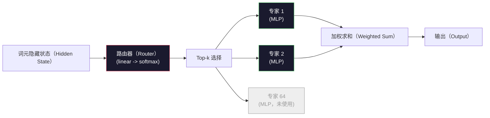

# 开放模型：架构详解（Open Models: Architecture Walkthroughs）

> 第 04 课中，你从零构建了 GPT-2 Small。2026 年前沿开放模型仍属于同一家族，只是做了五六项具体改动：用 RMSNorm 替代 LayerNorm，SwiGLU 替代 GELU，RoPE 替代学习式位置编码，GQA 或 MLA 替代完整 MHA，并在大规模下采用混合专家（Mixture-of-Experts，MoE）。你已掌握的数学覆盖其中 95%。本课并列阅读 Llama 3、DeepSeek-V3、Mixtral、Qwen 和 Gemma，指出各架构具体在哪一处产生差异。

**Type:** Learn
**Languages:** Python (stdlib)
**Prerequisites:** 阶段 10，第 04、05、12 课（预训练、扩展、推理）
**Time:** ~45 分钟

## 学习目标（Learning Objectives）

- 阅读 Llama 3、Mistral、Mixtral、Gemma 2、Qwen 2.5 和 DeepSeek-V3 的 config.json，并解释每个字段
- 指出各模型相对 GPT-2 Small 的具体架构变化，并从第一性原理说明理由
- 仅根据配置，计算任意开放模型的参数量、键值缓存大小和激活内存
- 根据延迟、内存和能力约束，为部署目标选择恰当的开放模型

## 问题（The Problem）

第 04 课中，你用 350 行 numpy 写出了 GPT-2 形态的模型。Llama 3 405B 却有 200 页技术报告，你直觉上觉得两者完全不同，其实不然。这 200 页描述的是同一种结构，加上五六项理由充分的修改，以及大量关于扩展的实现细节。嵌入、Transformer 块、注意力、多层感知机（MLP）、归一化和输出头的骨架没有变化。

本课就是一份差异比较。对每个主要开放模型家族，我们准确列出相对 GPT-2 改了什么、为什么改、代价是什么。读完后，你就能阅读新模型卡，并在脑中将它映射回 GPT-2 基线。

实际收益是：当 Meta 发布 Llama 5 或 DeepSeek 发布 V4，你不必重新建立认知模型。查看配置，知道哪些熟悉的设计选项发生变化，就能理解下游影响。2026 年的架构由有限的工具组成，每个新模型只是选择不同子集。

## 概念（The Concept）

### 不变的核心（The Invariant Core）

所有自回归开放模型都共享以下结构：

- 词元嵌入矩阵（Token Embedding Matrix，vocab_size x hidden_dim）。
- N 个解码器块堆叠：归一化、自注意力、残差、归一化、MLP、残差。
- 最终归一化与投影到 vocab_size 的线性输出头，通常与嵌入共享权重。
- 因果掩码（Causal Mask）和下一词元交叉熵损失（Cross-entropy Loss）。

结构就是这些，其余都是可调设计选项。

### 真正变化的六个设计选项（The Six Knobs That Actually Move）

2024-2026 年每个前沿开放模型，都在反复选择相同的六项设计：

1. **归一化（Normalization）。**LayerNorm -> RMSNorm。
2. **位置编码（Positional Encoding）。**学习式绝对位置 -> RoPE，以及 YaRN、NTK 等变体。
3. **激活函数（Activation）。**GELU -> SwiGLU（或 GeGLU）。
4. **注意力头共享（Attention Head Sharing）。**MHA -> GQA -> MQA -> MLA。
5. **稠密与稀疏 MLP（Dense vs Sparse MLP）。**稠密 -> 混合专家。
6. **预归一化位置（Pre-norm Placement）。**保留预归一化，后归一化退出。

其他内容，例如学习率调度、数据混合比例、批大小和上下文长度，都在训练配置中，而非架构中。架构只有这六个选项。

### 选项 1：均方根归一化（Knob 1: RMSNorm）

层归一化（LayerNorm）依次减去均值、除以标准差、缩放并平移。均方根归一化（Root Mean Square Normalization，RMSNorm）只保留缩放：

```
RMSNorm(x) = x / sqrt(mean(x^2) + eps) * gamma
```

不减均值，没有偏置，每个词元少一次矩阵乘法。Zhang 和 Sennrich（2019）认为它在机器翻译中效果与 LayerNorm 相当，却快 10%。现代开放模型都使用它。

代价：无。收益：少量吞吐量提升，代码更简单。

### 选项 2：旋转位置嵌入（Knob 2: RoPE）

GPT-2 的学习式位置嵌入是一张有 1024 个槽位的查找表。第 1025 个上下文位置就超出表尾。模型无法外推到训练长度之外。

旋转位置嵌入（Rotary Position Embedding，RoPE，Su 等，2021）在注意力点积之前，将每个 Q 和 K 向量按二维对旋转来注入位置信息。旋转角度是位置的确定性函数，因此无需学习，也没有表用完的问题。借助缩放技巧（NTK 感知插值、YaRN），在 8k 上下文上训练的模型，可在推理时扩展到 128k，仅损失少量准确性。

```
q_rotated = rotate(q, angle(pos))
k_rotated = rotate(k, angle(pos))
score = q_rotated . k_rotated
```

Llama、Mistral、Qwen、DeepSeek 和 Gemma 都使用 RoPE。Gemma 2 采用混合方式：多数层使用 RoPE，其他层使用局部滑动窗口注意力。

### 选项 3：Swish 门控线性单元（Knob 3: SwiGLU）

GPT-2 的 MLP 为 `x -> gelu(xW1 + b1) -> (...)W2 + b2`。Swish 门控线性单元（Swish Gated Linear Unit，SwiGLU，Shazeer，2020）将激活替换为门控乘积：

```
SwiGLU(x) = (xW1) * sigmoid(xW1) * xV
```

以两个并行投影替代一个投影，由 Swish 激活进行门控。实测在单位参数的困惑度表现上更强。Llama 2 采用后，其他模型纷纷跟进。MLP 隐藏维度通常设置为使总参数量与原稠密 MLP 匹配：若 GPT-2 使用 `ff_dim = 4 * hidden`，SwiGLU 就使用 `ff_dim = (2/3) * 4 * hidden = 8/3 * hidden`。

### 选项 4：注意力头共享（Knob 4: Attention Head Sharing）

GPT-2 使用**多头注意力（Multi-Head Attention，MHA）**：每个头都有自己的 Q、K、V 投影。

**多查询注意力（Multi-Query Attention，MQA，Shazeer，2019）**让所有头共享一个 K 和一个 V。键值缓存缩小 num_heads 倍，典型模型可缩小 12 到 32 倍。困难基准上的准确性略有下降。

**分组查询注意力（Grouped-Query Attention，GQA，Ainslie 等，2023）**是折中方案：Q 头划分为 G 组，组内共享一个 K 和一个 V。Llama 3 8B 使用 32 个 Q 头和 8 个 KV 头（G=8），因此键值缓存相对完整 MHA 缩小 4 倍。

**多头潜在注意力（Multi-Head Latent Attention，MLA，DeepSeek，2024）**将 K 与 V 压缩为共享低秩潜在表示，再按头投影还原。它在保留各头表达能力的同时进一步缩小键值缓存。DeepSeek-V2 和 V3 依靠它获得长上下文性能。

| 方案 | KV 头 | 键值缓存 | 准确性 |
|--------|----------|----------|----------|
| MHA | num_heads | 完整 | 最好 |
| GQA | num_groups (G < num_heads) | 缩小 num_heads / G 倍 | 接近 MHA |
| MQA | 1 | 缩小 num_heads 倍 | 略有损失 |
| MLA | 潜在表示，逐头解压 | 小于 MQA | 接近 MHA |

对于超过约 13B 参数的模型，GQA 或 MLA 实际上已成为必选项。大规模完整 MHA 会造成键值缓存灾难。

### 选项 5：混合专家（Knob 5: Mixture of Experts）

稠密 MLP 对每个词元激活全部参数。MoE MLP 每个块包含 K 个专家，以及为每个词元选择 top-k 专家（通常 top-2）的路由器（Router）。只有所选专家的权重参与该词元的前向传播。

```
router_logits = xW_r
indices, weights = top_k(router_logits, k=2)
output = sum_i weights[i] * expert[indices[i]](x)
```

吸引力在于：可以拥有 64 个各为 7B 的专家，总参数量很大，却每个词元只运行其中 2 个，因此每词元计算量与稠密 7B 模型相当。Mixtral 8x7B 总参数量为 47B，每个词元仅激活 13B；DeepSeek-V3 总参数量为 671B，每个词元仅激活 37B。



优点：相同计算量，更多参数，更大容量。缺点：专家权重仍需存放，所以服务所需显存高于等效稠密模型；路由器负载均衡困难；对齐时微调路由器本身就是一个研究领域。

### 选项 6：保留预归一化（Knob 6: Pre-norm stays）

原始 Transformer 在每个子层之后应用层归一化。自 GPT-2 起，每个开放模型都将其放在子层*之前*。预归一化（Pre-norm）在深层网络中确实更容易训练，没有争议。

### 逐模型差异比较（Model-by-Model Diff）

下表让这些差异具体化。

| 模型 | 年份 | 总参数 | 活跃参数 | 归一化 | 激活 | 位置 | 注意力 | MoE | 上下文 |
|-------|------|-------------|---------------|------|-----------|----------|-----------|-----|---------|
| GPT-2 Small | 2019 | 124M | 124M | LayerNorm | GELU | 学习式 | MHA (12 头) | 否 | 1k |
| Llama 3 8B | 2024 | 8B | 8B | RMSNorm | SwiGLU | RoPE | GQA (32/8) | 否 | 128k |
| Llama 3 70B | 2024 | 70B | 70B | RMSNorm | SwiGLU | RoPE | GQA (64/8) | 否 | 128k |
| Llama 3 405B | 2024 | 405B | 405B | RMSNorm | SwiGLU | RoPE | GQA (128/16) | 否 | 128k |
| Mistral 7B | 2023 | 7.2B | 7.2B | RMSNorm | SwiGLU | RoPE | GQA | 否 | 32k |
| Mixtral 8x7B | 2023 | 47B | 13B | RMSNorm | SwiGLU | RoPE | GQA | 是（8 个专家，top-2） | 32k |
| Gemma 2 9B | 2024 | 9B | 9B | RMSNorm (前置+后置) | GeGLU | RoPE + 滑动窗口 | GQA | 否 | 8k |
| Qwen 2.5 72B | 2024 | 72B | 72B | RMSNorm | SwiGLU | RoPE (YaRN) | GQA (64/8) | 否 | 128k |
| DeepSeek V2 236B | 2024 | 236B | 21B | RMSNorm | SwiGLU | RoPE | MLA | 是（160 个专家，top-6） | 128k |
| DeepSeek V3 | 2024 | 671B | 37B | RMSNorm | SwiGLU | RoPE | MLA | 是（256 个专家，top-8） | 128k |

逐列查看：RMSNorm 已普遍使用；SwiGLU 或近亲 GeGLU 已普遍使用；RoPE 已普遍使用；7B 以上普遍使用 GQA，除非由 MLA 替代。高端模型的差异在于 MoE。

### 阅读 config.json（Reading a config.json）

Llama 3 8B 配置：

```
{
  "hidden_size": 4096,
  "intermediate_size": 14336,
  "num_hidden_layers": 32,
  "num_attention_heads": 32,
  "num_key_value_heads": 8,
  "max_position_embeddings": 131072,
  "rope_theta": 500000.0,
  "rms_norm_eps": 1e-5,
  "vocab_size": 128256
}
```

每个字段都对应你已经实现过的内容。

- `hidden_size`：嵌入维度。
- `intermediate_size`：MLP 隐藏维度，为 hidden 的 3.5 倍，来自 SwiGLU 的计算。
- `num_hidden_layers`：堆叠深度。
- `num_attention_heads`：Q 头数。
- `num_key_value_heads`：KV 头数（GQA）。
- `max_position_embeddings`：训练上下文长度。
- `rope_theta`：RoPE 基频。Meta 为长上下文外推，将它从默认 10k 扩大到 500k。
- `rms_norm_eps`：数值稳定性参数。
- `vocab_size`：词元数量。

仅凭这些字段，就能计算总参数量、键值缓存和峰值激活内存。精确公式见 `code/main.py`。

### 激活内存预算（Activation memory budget）

参数量超过几十亿后，激活值主导训练内存。使用梯度检查点（Gradient Checkpointing）时，预训练的经验公式为：

```
activation_mem ~ batch_size * seq_len * hidden_size * num_layers * bytes_per_element
```

Llama 3 8B，批大小 1，序列长度 8192，BF16，32 层，隐藏维度 4096：使用检查点时仅激活值就约占 8 GB，不使用则为 40 GB。这就是 FlashAttention 与环形注意力（Ring Attention）重要的原因：它们改写注意力计算，使激活值装得下。

### 键值缓存预算（KV Cache budget）

最大上下文下的推理：

```
kv_cache = 2 * num_layers * num_kv_heads * head_dim * max_seq_len * bytes_per_element
```

Llama 3 8B，128k 上下文，BF16，head_dim = hidden / num_heads = 128：
每个序列为 `2 * 32 * 8 * 128 * 131072 * 2 = 17.2 GB`。

8B 权重采用 BF16 为 16 GB。单个 128k 序列的键值缓存就大于权重。这种内存压力推动着 GQA、MLA 和键值缓存量化的研究。

### 各模型的优势场景（When Each Model Wins）

- **单张 80GB GPU，不用 MoE**：Llama 3 8B、Mistral 7B、Gemma 2 9B。部署容易，工具广泛。
- **单节点（8 张 80GB），大容量**：Llama 3 70B、Qwen 2.5 72B。稠密开放模型中的最高能力。
- **最强开放能力，接受 MoE 复杂度**：DeepSeek V3、Mixtral 8x22B。单位活跃浮点运算的能力最佳。
- **长上下文需求**：Llama 3（RoPE 缩放后 128k）、DeepSeek（MLA 优势）。
- **低延迟服务**：Gemma 2 9B（滑动窗口减少长上下文计算）。

```figure
rmsnorm-vs-layernorm
```

## 动手实现（Build It）

本课代码是一个计算器。给定任意 config.json，打印各组件参数量、最大上下文的键值缓存、SwiGLU MLP 比例，以及架构的简短判断（稠密 / GQA / MLA / MoE）。

```python
config = {
    "hidden_size": 4096, "intermediate_size": 14336,
    "num_hidden_layers": 32, "num_attention_heads": 32,
    "num_key_value_heads": 8, "vocab_size": 128256,
    "max_position_embeddings": 131072,
}
```

脚本逐字段遍历架构，计算嵌入、注意力（考虑 GQA 缩减）、MLP（考虑 SwiGLU 扩展）、层归一化与输出头的参数量。然后计算声明上下文长度的键值缓存，并打印汇总。

实现见 `code/main.py`。

## 实际应用（Use It）

使用脚本自带的 Llama 3 8B、Mistral 7B、Mixtral 8x7B 和 DeepSeek V3 配置运行计算器，比较参数分布。注意 MoE 模型总参数量远超稠密模型，活跃参数量却往往更小。还要注意，DeepSeek V3 总参数更多，键值缓存却小于 Llama 3 405B，这就是 MLA 的作用。

然后输入任意本地模型的配置，阅读汇总，判断你的 GPU 能否容纳它。

## 交付成果（Ship It）

本课产出 `outputs/skill-open-model-picker.md`。给定部署目标（GPU 类型、显存、上下文长度、延迟预算）与任务画像（聊天、代码、推理过程、长上下文），它会推荐开放模型、第 11 课的量化方案，以及第 12 课的推理栈，并明确说明六项架构选择的依据。

## 练习（Exercises）

1. 从 HuggingFace 阅读 Qwen 2.5 72B 配置，从零计算总参数量。与 HF 报告值比较，找出差值来源，例如头维度取整、KV 共享系数等。

2. DeepSeek V3 使用 256 个专家、top-8 路由。计算激活专家占总专家的比例，并与 Mixtral 8x7B 的 8 选 2 比较。从稀疏（25%）转向更密集的稀疏（3%），对每次浮点运算的容量意味着什么？

3. 计算 Llama 3 405B 在 128k 上下文下的 FP8 和 BF16 键值缓存。FP8 为 BF16 的一半。单个 8 张 H100 节点（每张 80GB，共 640GB，减去权重内存）能够并行服务多少个序列？

4. Gemma 2 交替使用完整注意力与滑动窗口注意力层。如果一半层使用 4096 词元滑动窗口而非完整上下文，写出键值缓存公式。总上下文为 8k 时能节省多少内存？

5. 找一个在本课编写后发布的近期前沿开放模型，识别它选择了六项设计中的哪些，是否引入第七项。新架构发布时，课程就会显得过时；目标是更新表格，而不必重建你的认知模型。

## 关键术语（Key Terms）

| 术语 | 常见说法 | 实际含义 |
|------|----------------|----------------------|
| 均方根归一化（RMSNorm） | “不减均值的 LayerNorm” | 仅按均方根归一化，带可学习缩放，成本更低、效果与 LayerNorm 相当 |
| 旋转位置嵌入（RoPE） | “旋转位置” | 按依赖位置的角度，成对旋转 Q 与 K 向量的二维分量；借助缩放技巧可外推到训练长度之外 |
| Swish 门控线性单元（SwiGLU） | “新的 MLP 激活” | 带 Swish 的门控线性单元：`(xW1) * sigmoid(xW1) * xV`，2024 年后开放模型的标准 |
| 分组查询注意力（GQA） | “折中注意力” | Q 头分为 G 组，每组共享一个 K 和一个 V 头；缩小键值缓存，避免 MQA 的准确性损失 |
| 多头潜在注意力（MLA） | “DeepSeek 的注意力” | 将 K/V 压缩为共享低秩潜在表示，逐头解压，为大型模型提供最小键值缓存 |
| 混合专家（MoE） | “稀疏专家” | 每块 N 个 MLP，路由器逐词元选择 top-k，总参数巨大，活跃参数少 |
| Top-k 路由（Top-k Routing） | “每词元选 k 个专家” | 路由器为每个专家评分，激活最高的 k 个；典型 k 从 2（Mixtral）到 8（DeepSeek） |
| 又一种 RoPE 扩展（Yet another RoPE extension，YaRN） | “拉伸 RoPE” | 插值旋转角，在推理时将上下文从 8k 扩展到 128k 以上 |
| 滑动窗口注意力（Sliding-window Attention） | “不关注全部内容” | 每个词元仅关注最近 W 个词元，将每词元注意力成本限制为 O(W)，Gemma 2 与早期 Mistral 使用 |
| 活跃参数（Active Params） | “每词元运行的部分” | MoE 模型中参与每个词元前向传播的参数量，远小于总参数量，决定每词元 FLOPs |

## 延伸阅读（Further Reading）

- [Dubey 等，2024：《Llama 3 模型家族》](https://arxiv.org/abs/2407.21783)：稠密 Llama 3 家族的架构与训练参考
- [DeepSeek-AI，2024：《DeepSeek-V3 技术报告》](https://arxiv.org/abs/2412.19437)：MLA、无辅助损失负载均衡及 671B MoE
- [Jiang 等，2024：《Mixtral 专家模型》](https://arxiv.org/abs/2401.04088)：经典 MoE 开放模型论文
- [Su 等，2021：《RoFormer：以旋转位置嵌入增强 Transformer》](https://arxiv.org/abs/2104.09864)：RoPE 论文
- [Shazeer，2020：《GLU 变体改进 Transformer》](https://arxiv.org/abs/2002.05202)：SwiGLU、GeGLU 等变体
- [Ainslie 等，2023：《GQA：训练广义多查询 Transformer 模型》](https://arxiv.org/abs/2305.13245)：GQA 论文
- [Gemma 2 Team，2024：《Gemma 2：以实用规模改进开放语言模型》](https://arxiv.org/abs/2408.00118)：完整与滑动注意力混合、预归一化与后归一化
- [Qwen Team，2024：《Qwen 2.5 技术报告》](https://arxiv.org/abs/2412.15115)：YaRN 上下文扩展及长上下文训练配方
