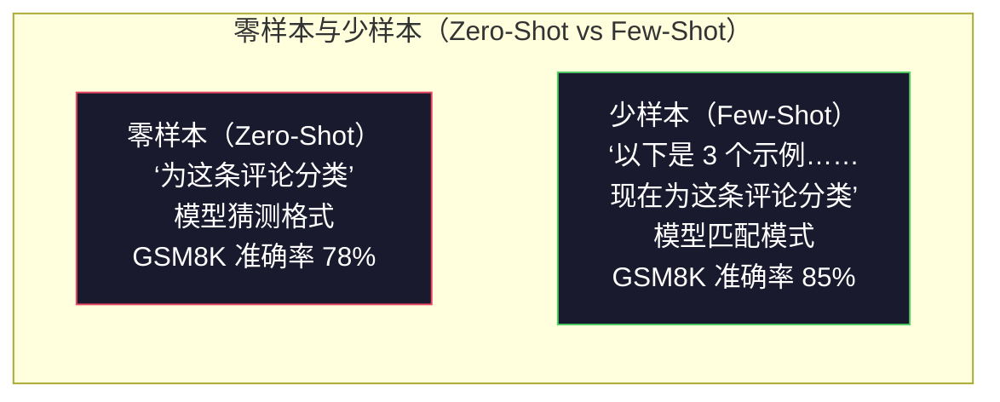
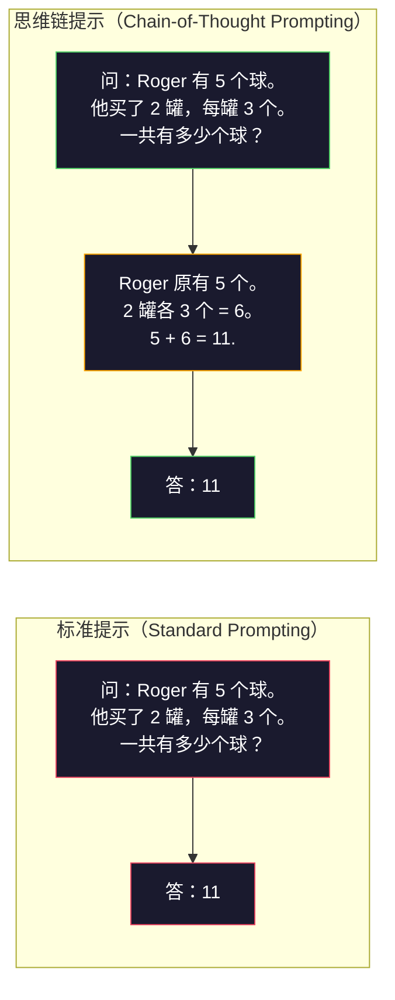
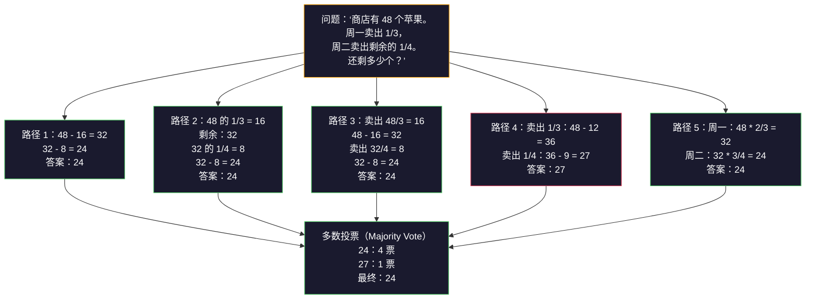
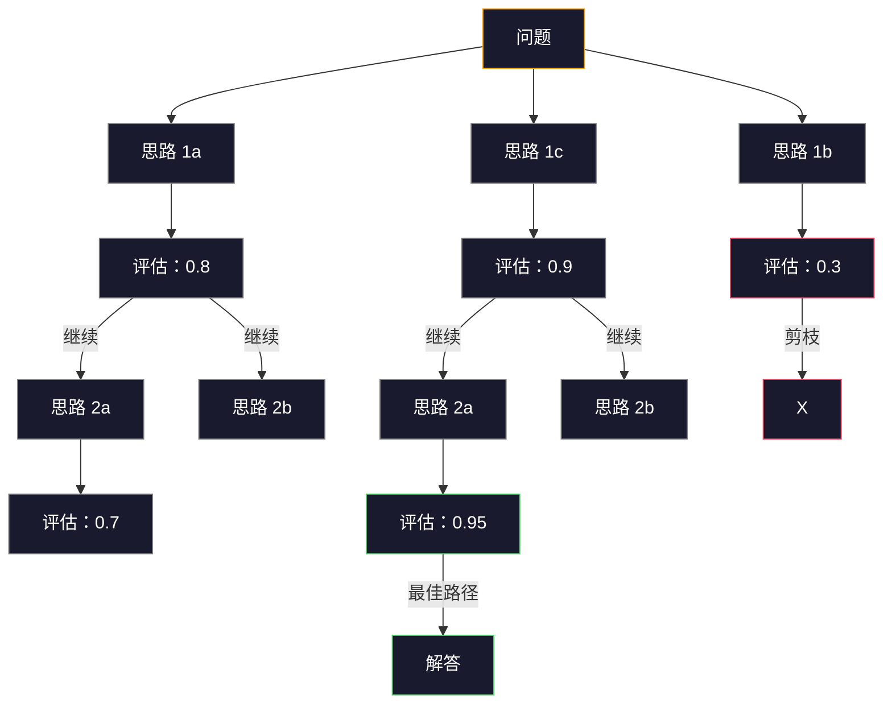

# 少样本、思维链与思维树（Few-Shot, Chain-of-Thought, Tree-of-Thought）

> 告诉模型做什么，是编写提示词；向它展示如何思考，是工程设计。同一模型、同一任务、同一数据上，准确率从 78% 到 91% 的差距，不来自更好的模型，而来自更好的推理策略（Reasoning strategy）。

**Type:** Build
**Languages:** Python
**Prerequisites:** 第 11.01 课（提示词工程，Prompt Engineering）
**Time:** ~45 分钟

## 学习目标（Learning Objectives）

- 选择并格式化示范样例，实现少样本提示（Few-shot prompting），尽可能提高任务准确率
- 运用思维链（Chain-of-Thought，CoT）推理，提高数学应用题等多步骤问题的准确率
- 构建思维树（Tree-of-Thought）提示词，探索多条推理路径并选择最佳路径
- 在标准基准测试（Benchmark）上测量零样本、少样本与 CoT 的准确率提升

## 问题（The Problem）

你构建了一款数学辅导应用。提示词写着：“解答这道应用题。”在标准小学数学基准 GSM8K 上，GPT-5 的准确率达到 94%。你以为已经到顶了，其实没有：思维链还能再增加 3-4 个百分点。

加上五个英文单词“Let's think step by step”（让我们逐步思考），准确率就跃升至 91%。再加几个完整解题示例，可达到 95%。模型相同，温度相同，API 成本相同。唯一差别是你给了模型草稿纸。

这不是取巧，而是推理的工作方式。人类不会凭一次思维跳跃解决多步骤问题，Transformer 也一样。当你强制模型生成中间词元（Token）时，这些词元会成为下一个词元的上下文。每一步推理都为下一步提供输入。模型确实是一步步计算出答案的。

但“逐步思考”只是起点。假如采样五条推理路径，再进行多数投票呢？假如让模型探索一棵可能性树，评估分支并剪枝呢？假如交替进行推理与工具使用呢？这些都不是假设，而是已有发表成果、且有量化提升的技术。本课将逐一实现它们。

## 概念（The Concept）

### 零样本与少样本：示例何时胜过指令（Zero-Shot vs Few-Shot: When Examples Beat Instructions）

零样本提示（Zero-shot prompting）只给模型任务，不提供其他内容。少样本提示则先给模型示例。

Wei 等（2022）在 8 个基准上进行了测量。对于情感分类等简单任务，零样本与少样本的表现差距在 2% 以内。对于多步骤算术和符号推理等复杂任务，少样本使准确率提高了 10-25%。

直观理解是：示例就是压缩后的指令。你直接展示输出格式，而不只是描述；直接示范推理过程，而不只是解释。模型对示例进行模式匹配，比解释抽象指令更可靠。



**少样本占优的场景：** 对格式敏感的任务、分类、结构化抽取、领域专用术语，以及任何需要模型匹配特定模式的任务。

**零样本占优的场景：** 简单事实问题、示例会限制创造性的创意任务，以及寻找好示例比编写好指令更困难的任务。

### 示例选择：相似优于随机（Example Selection: Similar Beats Random）

示例并非同样有效。在分类任务上，选择与目标输入相似的示例，比随机选择的效果高出 5-15%（Liu 等，2022）。有三个原则：

1. **语义相似度（Semantic similarity）**：选择嵌入空间（Embedding space）中最接近输入的示例
2. **标签多样性（Label diversity）**：示例应覆盖所有输出类别
3. **难度匹配（Difficulty matching）**：匹配目标问题的复杂程度

多数任务的最佳示例数是 3-5 个。少于 3 个，模型没有足够信号提取模式；超过 5 个，收益开始递减，还会浪费上下文窗口词元。对于标签很多的分类任务，每个标签使用一个示例。

### 思维链：给模型草稿纸（Chain-of-Thought: Giving Models Scratch Paper）

思维链（CoT）提示由 Google Brain 的 Wei 等（2022）提出。思路很简单：不要只要求模型给答案，而是先要求它展示推理步骤。



从机制上看，为什么这有效？Transformer 生成的每个词元都会成为下一个词元的上下文。没有 CoT，模型必须把全部推理压缩到一次前向传播（Forward pass）的隐藏状态中。有了 CoT，模型把中间计算外化为词元，每个推理词元都会扩展有效计算深度。

**GSM8K 基准（小学数学，8.5K 道题）：**

| 模型 | 零样本（Zero-Shot） | 零样本 CoT | 少样本 CoT |
|-------|-----------|---------------|--------------|
| GPT-4o | 78% | 91% | 95% |
| GPT-5 | 94% | 97% | 98% |
| o4-mini（推理，Reasoning） | 97% | — | — |
| Claude Opus 4.7 | 93% | 97% | 98% |
| Gemini 3 Pro | 92% | 96% | 98% |
| Llama 4 70B | 80% | 89% | 94% |
| DeepSeek-V3.1 | 89% | 94% | 96% |

**关于推理模型（Reasoning models）。** OpenAI 的 o 系列（o3、o4-mini）和 DeepSeek-R1 等模型，会在输出答案前于内部运行思维链。给推理模型再添加“让我们逐步思考”是多余的，有时还适得其反，因为它们已经这样做了。

CoT 有两种形式：

**零样本 CoT（Zero-shot CoT）**：在提示词末尾添加“让我们逐步思考”，无需示例。Kojima 等（2022）表明，仅这一句话就能提高算术、常识和符号推理任务的准确率。

**少样本 CoT（Few-shot CoT）**：提供包含推理步骤的示例。它比零样本 CoT 更有效，因为模型能看到你期望的精确推理格式。

**CoT 反而有害的场景**：简单事实回忆（“法国首都是什么？”）、单步分类、速度比准确率更重要的任务。CoT 为每次查询增加 50-200 个推理词元的开销。对于高吞吐、低复杂度任务，这是浪费成本。

### 自一致性：多次采样，一次投票（Self-Consistency: Sample Many, Vote Once）

Wang 等（2023）提出了自一致性（Self-consistency）。核心洞见是：单条 CoT 路径可能包含推理错误，但如果采样 N 条独立推理路径（使用 temperature > 0），再对最终答案进行多数投票，错误就会相互抵消。



在最初的 PaLM 540B 实验中，N=40 的自一致性使 GSM8K 准确率从 56.5%（单次 CoT）提高到 74.4%。在 GPT-5 上提升较小（97% 至 98%），因为基础准确率已接近饱和。该技术最适合基础 CoT 准确率为 60-85% 的模型：此时单路径错误常见，但并非系统性错误。对于推理模型（o 系列、R1），自一致性已包含在内置的内部采样中。

代价是：N 个样本意味着 N 倍 API 成本和延迟。实践中，N=5 就能获得大部分收益。N=3 是进行有意义投票的最低数量。对多数任务，N > 10 时收益递减。

### 思维树：分支探索（Tree-of-Thought: Branching Exploration）

Yao 等（2023）提出了思维树（Tree-of-Thought，ToT）。CoT 沿单条线性推理路径前进，而 ToT 探索多个分支，先评估哪些最有希望，再继续。



ToT 有三个组成部分：

1. **思路生成（Thought generation）**：生成多个候选下一步
2. **状态评估（State evaluation）**：为每个候选评分（可用 LLM 本身作为评估器）
3. **搜索算法（Search algorithm）**：对树进行广度优先搜索（BFS）或深度优先搜索（DFS），剪去低分分支

在 24 点游戏（Game of 24，用算术运算组合 4 个数得到 24）中，使用标准提示的 GPT-4 能解决 7.3% 的问题。CoT 为 4.0%（由于搜索空间广，CoT 在这里反而有害），ToT 则达到 74%。

ToT 成本高。树中每个节点都需要一次 LLM 调用。分支因子为 3、深度为 3 的树最多需要 39 次调用。仅将它用于搜索空间大但可评估的问题：规划、解谜、带约束的创造性问题求解。

### ReAct：思考与行动（ReAct: Thinking + Doing）

Yao 等（2022）把推理轨迹（Reasoning traces）与行动相结合。模型交替进行思考（生成推理）和行动（调用工具、搜索、计算）。


在知识密集型任务上，ReAct 优于纯 CoT，因为它能让推理以真实数据为依据。在 HotpotQA（多跳问答，Multi-hop question answering）上，GPT-4 配合 ReAct 达到 35.1% 的精确匹配率，而单独 CoT 为 29.4%。真正的优势在于观察结果能纠正推理错误：模型可以在执行过程中更新计划。

ReAct 是现代 AI 智能体（Agent）的基础。每个智能体框架（LangChain、CrewAI、AutoGen）都实现了某种思考—行动—观察（Thought-Action-Observation）循环。你将在阶段 14 构建完整智能体，本课介绍其提示模式。

### 结构化提示：XML 标签、分隔符与标题（Structured Prompting: XML Tags, Delimiters, Headers）

提示词变复杂时，结构可以防止模型混淆各部分。有三种方式：

**XML 标签（XML tags）**（在 Claude 上效果最佳，在其他模型上也可靠）：
```
<context>
你正在审查一个拉取请求（Pull request）。
代码库使用 TypeScript 和 React。
</context>

<task>
审查以下差异，查找缺陷、安全问题和风格违规。
</task>

<diff>
{diff_content}
</diff>

<output_format>
逐条列出问题，包含：文件、行号、严重程度（critical/warning/info）、描述。
</output_format>
```

**Markdown 标题（Markdown headers）**（通用）：
```
## 角色（Role）
金融科技公司的资深安全工程师。

## 任务（Task）
分析此 API 端点的漏洞。

## 输入（Input）
{api_code}

## 规则（Rules）
- 聚焦 OWASP Top 10
- 为每项发现评级：critical、high、medium、low
- 包含修复步骤
```

**分隔符（Delimiters）**（简单但有效）：
```
---INPUT---
{user_text}
---END INPUT---

---INSTRUCTIONS---
用 3 个要点总结以上内容。
---END INSTRUCTIONS---
```

### 提示词串联：顺序分解（Prompt Chaining: Sequential Decomposition）

有些任务过于复杂，单个提示词无法胜任。提示词串联（Prompt chaining）把任务拆成步骤，让一个提示词的输出成为下一个的输入。


串联优于单一提示词有三个原因：

1. **每一步更简单**：模型只处理一个明确任务，不必同时兼顾所有事情
2. **中间输出可检查**：可在步骤之间验证和纠正
3. **不同步骤可用不同模型**：用便宜模型抽取，用昂贵模型推理

### 性能比较（Performance Comparison）

| 技术 | 最适合 | GSM8K 准确率（GPT-5） | API 调用次数 | 词元开销 | 复杂度 |
|-----------|----------|------------------------|-----------|----------------|------------|
| 零样本 | 简单任务 | 94% | 1 | 无 | 极低 |
| 少样本 | 格式匹配 | 96% | 1 | 200-500 词元 | 低 |
| 零样本 CoT | 快速提升推理 | 97% | 1 | 50-200 词元 | 极低 |
| 少样本 CoT | 最大化单次调用准确率 | 98% | 1 | 300-600 词元 | 低 |
| 自一致性（N=5） | 高影响推理任务 | 98.5% | 5 | 5 倍词元成本 | 中 |
| 推理模型（o4-mini） | 直接替代 CoT | 97% | 1 | 隐藏（内部 2-10 倍） | 极低 |
| 思维树 | 搜索/规划问题 | N/A（24 点游戏为 74%） | 10-40+ | 10-40 倍词元成本 | 高 |
| ReAct | 有知识依据的推理 | N/A（HotpotQA 为 35.1%） | 3-10+ | 不固定 | 高 |
| 提示词串联 | 复杂多步骤任务 | 96%（流水线） | 2-5 | 2-5 倍词元成本 | 中 |

选择何种技术取决于三个因素：准确率要求、延迟预算和成本承受能力。对于多数生产系统，少样本 CoT 加上 3 样本自一致性后备机制，可覆盖 90% 的使用场景。

```figure
few-shot-curve
```

## 动手实现（Build It）

我们将构建数学问题求解器，将少样本提示、思维链推理和自一致性投票组合成一条流水线，再为难题加入思维树。

完整实现位于 `code/advanced_prompting.py`。以下是关键组件。

### 第 1 步：少样本示例库（Step 1: Few-Shot Example Store）

第一个组件管理少样本示例，并为给定问题选择最相关的示例。

```python
GSM8K_EXAMPLES = [
    {
        "question": "Janet's ducks lay 16 eggs per day. She eats three for breakfast every morning and bakes muffins for her friends every day with four. She sells every egg at the farmers' market for $2. How much does she make every day at the farmers' market?",
        "reasoning": "Janet's ducks lay 16 eggs per day. She eats 3 and bakes 4, using 3 + 4 = 7 eggs. So she has 16 - 7 = 9 eggs left. She sells each for $2, so she makes 9 * 2 = $18 per day.",
        "answer": "18"
    },
    ...
]
```

每个示例有三部分：问题、推理链和最终答案。推理链使普通少样本示例变为 CoT 少样本示例。

### 第 2 步：思维链提示词构建器（Step 2: Chain-of-Thought Prompt Builder）

提示词构建器把系统消息、带推理链的少样本示例和目标问题组装成一个提示词。

```python
def build_cot_prompt(question, examples, num_examples=3):
    system = (
        "You are a math problem solver. "
        "For each problem, show your step-by-step reasoning, "
        "then give the final numerical answer on the last line "
        "in the format: 'The answer is [number]'."
    )

    example_text = ""
    for ex in examples[:num_examples]:
        example_text += f"Q: {ex['question']}\n"
        example_text += f"A: {ex['reasoning']} The answer is {ex['answer']}.\n\n"

    user = f"{example_text}Q: {question}\nA:"
    return system, user
```

格式约束（“The answer is [number]”，即“答案是[数字]”）非常关键。没有它，自一致性就无法抽取并比较不同样本的答案。

### 第 3 步：自一致性投票（Step 3: Self-Consistency Voting）

采样 N 条推理路径，取多数答案。

```python
def self_consistency_solve(question, examples, client, model, n_samples=5):
    system, user = build_cot_prompt(question, examples)

    answers = []
    reasonings = []
    for _ in range(n_samples):
        response = client.chat.completions.create(
            model=model,
            messages=[
                {"role": "system", "content": system},
                {"role": "user", "content": user}
            ],
            temperature=0.7
        )
        text = response.choices[0].message.content
        reasonings.append(text)
        answer = extract_answer(text)
        if answer is not None:
            answers.append(answer)

    vote_counts = Counter(answers)
    best_answer = vote_counts.most_common(1)[0][0] if vote_counts else None
    confidence = vote_counts[best_answer] / len(answers) if best_answer else 0

    return best_answer, confidence, reasonings, vote_counts
```

温度设为 0.7 很重要。在温度 0.0 时，全部 N 个样本都会相同，失去采样的意义。你需要足够随机性来产生不同推理路径，但又不能高到使模型胡言乱语。

### 第 4 步：思维树求解器（Step 4: Tree-of-Thought Solver）

对线性推理失败的问题，ToT 探索多种方法，评估哪个方向最有希望。

```python
def tree_of_thought_solve(question, client, model, breadth=3, depth=3):
    thoughts = generate_initial_thoughts(question, client, model, breadth)
    scored = [(t, evaluate_thought(t, question, client, model)) for t in thoughts]
    scored.sort(key=lambda x: x[1], reverse=True)

    for current_depth in range(1, depth):
        next_thoughts = []
        for thought, score in scored[:2]:
            extensions = extend_thought(thought, question, client, model, breadth)
            for ext in extensions:
                ext_score = evaluate_thought(ext, question, client, model)
                next_thoughts.append((ext, ext_score))
        scored = sorted(next_thoughts, key=lambda x: x[1], reverse=True)

    best_thought = scored[0][0] if scored else ""
    return extract_answer(best_thought), best_thought
```

评估器本身也是一次 LLM 调用。你询问模型：“按 0.0 到 1.0 评分，这条推理路径有多大希望解决问题？”这是 ToT 的关键洞见：模型评估自己的部分解。

### 第 5 步：完整流水线（Step 5: Full Pipeline）

流水线通过升级策略（Escalation strategy）组合所有技术。

```python
def solve_with_escalation(question, examples, client, model):
    single_answer, _ = few_shot_cot_solve(question, examples, client, model)

    sc_answer, confidence, _, _ = self_consistency_solve(
        question, examples, client, model, n_samples=5
    )

    if confidence >= 0.8 and single_answer == sc_answer:
        return sc_answer, "self_consistency", confidence

    tot_answer, _ = tree_of_thought_solve(question, client, model)
    return tot_answer, "tree_of_thought", None
```

升级逻辑如下：先尝试成本较低的单条思维链（CoT）。单条确定性路径没有投票占比，因此通过答案一致性检查其质量：温度为 0 时得到的答案必须与多条采样路径的多数答案相同。如果两者不一致，或自一致性置信度低于 0.8（5 次采样中不足 4 次答案一致），则升级到思维树（ToT）。这样可以平衡成本与准确率：多数问题以较低成本解决，困难问题获得更多计算资源。

## 实际应用（Use It）

### 模板驱动的少样本提示词（Template-Driven Few-Shot Prompts）

LangChain 内置提示词模板和输出解析支持，能简化少样本与 CoT 模式：

```python
from langchain_core.prompts import FewShotPromptTemplate, PromptTemplate
from langchain_openai import ChatOpenAI

example_prompt = PromptTemplate(
    input_variables=["question", "reasoning", "answer"],
    template="Q: {question}\nA: {reasoning} The answer is {answer}."
)

few_shot_prompt = FewShotPromptTemplate(
    examples=examples,
    example_prompt=example_prompt,
    suffix="Q: {input}\nA: Let's think step by step.",
    input_variables=["input"]
)

llm = ChatOpenAI(model="gpt-4o", temperature=0.7)
chain = few_shot_prompt | llm
result = chain.invoke({"input": "If a train travels 120 km in 2 hours..."})
```

LangChain 还提供 `ExampleSelector` 类，用于按语义相似度选择示例：

```python
from langchain_core.example_selectors import SemanticSimilarityExampleSelector
from langchain_openai import OpenAIEmbeddings

selector = SemanticSimilarityExampleSelector.from_examples(
    examples,
    OpenAIEmbeddings(),
    k=3
)
```

### 编译式提示词（Compiled Prompts）

DSPy 把提示策略视为可优化模块。你无需手工设计 CoT 提示词，只需定义签名（Signature），让 DSPy 优化提示词：

```python
import dspy

dspy.configure(lm=dspy.LM("openai/gpt-4o", temperature=0.7))

class MathSolver(dspy.Module):
    def __init__(self):
        self.solve = dspy.ChainOfThought("question -> answer")

    def forward(self, question):
        return self.solve(question=question)

solver = MathSolver()
result = solver(question="Janet's ducks lay 16 eggs per day...")
```

DSPy 的 `ChainOfThought` 自动添加推理轨迹，`dspy.majority` 实现自一致性：

```python
result = dspy.majority(
    [solver(question=q) for _ in range(5)],
    field="answer"
)
```

### 对比：从零实现与框架（Comparison: From-Scratch vs Frameworks）

| 功能 | 从零实现（本课） | LangChain | DSPy |
|---------|--------------------------|-----------|------|
| 提示词格式控制 | 完全控制 | 基于模板 | 自动 |
| 自一致性 | 手动投票 | 手动 | 内置（`dspy.majority`） |
| 示例选择 | 自定义逻辑 | `ExampleSelector` | `dspy.BootstrapFewShot` |
| 思维树 | 自定义树搜索 | 社区链 | 未内置 |
| 提示词优化 | 手动迭代 | 手动 | 自动编译 |
| 最适合 | 学习、自定义流水线 | 标准工作流 | 研究、优化 |

## 交付成果（Ship It）

本课产出两份交付物（Artifact）。

**1. 推理链提示词（Reasoning Chain Prompt）**（`outputs/prompt-reasoning-chain.md`）：可用于生产的少样本 CoT 提示词模板，支持自一致性。填入你的示例和问题领域即可。

**2. CoT 模式选择技能（CoT Pattern Selection Skill）**（`outputs/skill-cot-patterns.md`）：根据任务类型、准确率要求和成本约束选择合适推理技术的决策框架。

## 练习（Exercises）

1. **测量差距**：取 10 道 GSM8K 题目，分别用零样本、少样本、零样本 CoT 和少样本 CoT 求解，记录各自准确率。在你的模型上，哪种技术提升最大？

2. **示例选择实验**：对同样的 10 道题，比较随机选择示例与手工挑选相似示例的效果，测量准确率差异。什么时候示例质量比数量更重要？

3. **自一致性成本曲线**：在 20 道 GSM8K 题目上，以 N=1、3、5、7、10 运行自一致性。绘制准确率与成本（总词元数）的关系图。你的模型的曲线拐点在哪里？

4. **构建 ReAct 循环**：为流水线添加计算器工具。当模型生成数学表达式时，用 Python 的 `eval()` 在沙箱中执行，再反馈结果。测量以工具结果为依据的推理是否优于纯 CoT。

5. **将 ToT 用于创意任务**：将思维树求解器改用于创意写作任务：“写一个既有趣又悲伤的 6 词故事。”用 LLM 作为评估器。分支探索是否比单次生成产生更好的创意输出？

## 关键术语（Key Terms）

| 术语 | 常见说法 | 实际含义 |
|------|----------------|----------------------|
| 少样本提示（Few-shot prompting） | “给它几个例子” | 在提示词中放入输入输出示范，固定模型的输出格式和行为 |
| 思维链（Chain-of-Thought） | “让它逐步思考” | 引出中间推理词元，在生成最终答案之前扩展模型的有效计算 |
| 自一致性（Self-Consistency） | “多运行几次” | 在 temperature > 0 时采样 N 条不同推理路径，再通过多数投票选择最常见的最终答案 |
| 思维树（Tree-of-Thought） | “让它探索选项” | 在推理分支上进行结构化搜索，评估每个部分解，只扩展有希望的路径 |
| ReAct | “思考 + 工具使用” | 在思考—行动—观察循环中，交替生成推理轨迹与执行外部行动（搜索、计算、API 调用） |
| 提示词串联（Prompt chaining） | “拆成步骤” | 将复杂任务分解为顺序提示词，每个输出成为下一步输入 |
| 零样本 CoT（Zero-shot CoT） | “只需加上‘逐步思考’” | 不提供示例，在提示词末尾添加推理触发语句，依靠模型潜在的推理能力 |

## 延伸阅读（Further Reading）

- [思维链提示激发大语言模型的推理能力（Chain-of-Thought Prompting Elicits Reasoning in Large Language Models）](https://arxiv.org/abs/2201.11903)：Wei 等，2022。Google Brain 最初的 CoT 论文。阅读第 2-3 节了解核心结果。
- [自一致性改善语言模型的思维链推理（Self-Consistency Improves Chain of Thought Reasoning in Language Models）](https://arxiv.org/abs/2203.11171)：Wang 等，2023。自一致性论文。表 1 包含所需的全部数据。
- [思维树：用大语言模型审慎求解问题（Tree of Thoughts: Deliberate Problem Solving with Large Language Models）](https://arxiv.org/abs/2305.10601)：Yao 等，2023。ToT 论文。第 4 节的 24 点游戏结果是亮点。
- [ReAct：协同语言模型的推理与行动（ReAct: Synergizing Reasoning and Acting in Language Models）](https://arxiv.org/abs/2210.03629)：Yao 等，2022。现代 AI 智能体的基础。第 3 节解释思考—行动—观察循环。
- [大语言模型是零样本推理者（Large Language Models are Zero-Shot Reasoners）](https://arxiv.org/abs/2205.11916)：Kojima 等，2022。提出“让我们逐步思考”的论文。方法虽简单，效果却出人意料。
- [DSPy：将声明式语言模型调用编译为自我改进的流水线（DSPy: Compiling Declarative Language Model Calls into Self-Improving Pipelines）](https://arxiv.org/abs/2310.03714)：Khattab 等，2023。将提示视为编译问题。希望超越手工提示词工程时可读。
- [OpenAI：推理模型指南（Reasoning models guide）](https://platform.openai.com/docs/guides/reasoning)：提供商指南，介绍思维链何时成为按词元计费的内部“推理”模式，而不是提示词层面的技巧。
- [Lightman 等：《让我们逐步验证》（Let's Verify Step by Step，2023）](https://arxiv.org/abs/2305.20050)：对链中每一步评分的过程奖励模型（Process reward models，PRM），介绍继仅结果奖励之后的推理监督信号。
- [Snell 等：《最优扩展 LLM 测试时计算》（Scaling LLM Test-Time Compute Optimally，2024）](https://arxiv.org/abs/2408.03314)：系统研究 CoT 长度、自一致性采样和蒙特卡洛树搜索（MCTS）；当准确率比延迟更重要时，这是“逐步思考”的进一步发展。
