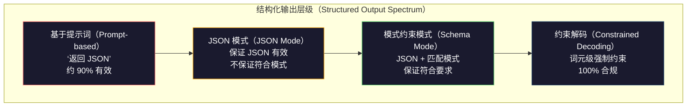
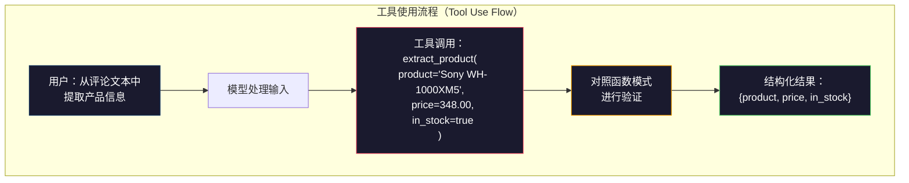

# 结构化输出：JSON、模式验证与约束解码（Structured Outputs: JSON, Schema Validation, Constrained Decoding）

> LLM 返回字符串，应用需要 JSON。这个差距导致的生产系统崩溃，比任何模型幻觉都多。结构化输出（Structured output）是自然语言与带类型数据之间的桥梁。处理正确，LLM 就能成为可靠的 API；处理错误，你就得在凌晨 3 点用正则表达式解析自由文本。

**Type:** Build
**Languages:** Python
**Prerequisites:** 阶段 10，第 01-05 课（从零构建大语言模型，LLMs from Scratch）
**Time:** ~90 分钟
**相关课程（Related）:** 阶段 5 · 20（结构化输出与约束解码，Structured Outputs & Constrained Decoding）介绍解码器层面的理论（FSM/CFG 逻辑值处理器、Outlines、XGrammar）。本课聚焦生产 SDK 接口（OpenAI `response_format`、Anthropic 工具使用、Instructor）。如果想理解 API 之下发生了什么，请先读阶段 5 · 20。

## 学习目标（Learning Objectives）

- 使用 OpenAI 和 Anthropic API 参数实现 JSON 模式与模式约束输出
- 构建 Pydantic 验证层，拒绝格式错误的 LLM 输出，并反馈错误后重试
- 解释约束解码（Constrained decoding）如何在词元层面强制生成有效 JSON，而无需后处理
- 设计稳健的抽取提示词，将非结构化文本可靠地转化为带类型的数据结构

## 问题（The Problem）

你要求 LLM：“从这段文本中提取产品名称、价格和供货状态。”它回答：

```
产品是 Sony WH-1000XM5 耳机，价格为 $348.00，目前有货。
```

这个答案完全正确，却对应用毫无用处。库存系统需要 `{"product": "Sony WH-1000XM5", "price": 348.00, "in_stock": true}`。你需要一个具有特定键、类型和值约束的 JSON 对象，而不是一句话。

朴素方案是在提示词中添加“用 JSON 回答”。90% 的时候有效；剩下 10% 的时候，模型会把 JSON 包在 Markdown 代码围栏中，添加“以下是 JSON：”这样的开场白，或因过早闭合括号而产生语法无效的 JSON。JSON 解析器崩溃，流水线中断。你添加 try/except 和重试循环，但重试有时会生成不同数据。于是，解析问题之外又多了一致性问题。

这不是提示词工程问题，而是解码（Decoding）问题。模型从左到右生成词元，在每个位置从含 100K+ 个候选的词表中选择最可能的下一个词元。在任意给定位置，大多数候选都会生成无效 JSON。如果模型刚输出 `{"price":`，下一个词元就必须是数字、引号（用于字符串）、`null`、`true`、`false` 或负号，其他内容都会产生无效 JSON。没有约束时，模型可能选中一个英语含义完全合理、语法上却完全错误的单词。

## 概念（The Concept）

### 结构化输出的层级（The Structured Output Spectrum）

结构化输出控制有四个层级，可靠性逐级提高。



**基于提示词（Prompt-based）**（“用有效 JSON 回答”）：没有强制机制。模型通常遵循，但有时不会。可靠性约 90%。失败形式包括 Markdown 围栏、开场白、截断输出和错误结构。

**JSON 模式（JSON mode）**：API 保证输出为有效 JSON。OpenAI 的 `response_format: { type: "json_object" }` 可启用此模式。输出能无错误地解析，但不一定匹配预期模式（Schema），仍可能出现额外键、错误类型或缺失字段。

**模式约束模式（Schema mode）**：API 接收 JSON Schema，并保证输出与之匹配。2026 年，所有主要提供商都原生支持：OpenAI 的 `response_format: { type: "json_schema", json_schema: {...} }`（也可采用 `tool_choice="required"`）、Anthropic 使用 `input_schema` 的工具调用，以及 Gemini 的 `response_schema` + `response_mime_type: "application/json"`。输出具有你指定的精确键、类型和约束。

**约束解码（Constrained decoding）**：生成过程中，在每个词元位置，解码器屏蔽所有会导致无效输出的词元。如果模式要求数字，而模型即将输出字母，就把该词元概率设为零。模型只能生成能通向有效输出的词元。OpenAI 的结构化输出模式及 Outlines、Guidance 等库，底层实现的正是这种机制。

### JSON Schema：契约语言（JSON Schema: The Contract Language）

JSON Schema 用来告诉模型（或验证层）输出必须具有什么结构。所有主要结构化输出系统都使用它。

```json
{
  "type": "object",
  "properties": {
    "product": { "type": "string" },
    "price": { "type": "number", "minimum": 0 },
    "in_stock": { "type": "boolean" },
    "categories": {
      "type": "array",
      "items": { "type": "string" }
    }
  },
  "required": ["product", "price", "in_stock"]
}
```

此模式规定：输出必须是一个对象，包含字符串 `product`、非负数 `price`、布尔值 `in_stock`，以及可选的字符串数组 `categories`。任何不匹配的输出都会被拒绝。

模式能处理复杂情况：嵌套对象、具有指定元素类型的数组、枚举（将字符串限制为特定值）、模式匹配（对字符串应用正则表达式）和组合器（用于多态输出的 oneOf、anyOf、allOf）。

### Pydantic 模式（The Pydantic Pattern）

在 Python 中，无需手写 JSON Schema。定义一个 Pydantic 模型，它就会为你生成模式。

```python
from pydantic import BaseModel

class Product(BaseModel):
    product: str
    price: float
    in_stock: bool
    categories: list[str] = []
```

这会生成与上面相同的 JSON Schema。Instructor 库（以及 OpenAI SDK）直接接收 Pydantic 模型：传入模型类，得到经过验证的实例。如果 LLM 输出不匹配，Instructor 会自动重试。

### 函数调用与工具使用（Function Calling / Tool Use）

这是同一问题的另一种接口。你不要求模型直接生成 JSON，而是定义具有带类型参数的“工具”（函数）。模型输出带结构化参数的函数调用。OpenAI 称之为“函数调用（Function calling）”，Anthropic 称之为“工具使用（Tool use）”。结果相同，都是结构化数据。



当模型需要选择调用哪个函数，而不只是填参数时，优先使用工具调用。如果有 10 个不同的抽取模式，且模型必须根据输入选择合适的一个，工具调用可同时提供模式选择和结构化输出。

### 常见失败模式（Common Failure Modes）

即使强制执行模式，结构化输出仍可能以不易察觉的方式失败。

**幻觉值（Hallucinated values）**：输出匹配模式，却包含编造的数据。文本写着 $348，模型却生成 `{"price": 299.99}`。模式验证无法发现这种问题：类型正确，值错误。

**枚举混淆（Enum confusion）**：你将字段限制为 `["in_stock", "out_of_stock", "preorder"]`，模型却输出 `"available"`。语义正确，但不在允许集合内。良好的约束解码可防止这种情况，基于提示词的方法则不能。

**嵌套对象深度（Nested object depth）**：深度嵌套模式（4+ 层）会产生更多错误。每增加一层嵌套，就多一处模型可能丢失结构跟踪的位置。

**数组长度（Array length）**：模型可能生成过多或过少的数组元素。模式支持 `minItems` 和 `maxItems`，但并非所有提供商都会在解码层强制执行。

**可选字段遗漏（Optional field omission）**：模型省略了技术上可选、但对使用场景语义重要的字段。即使数据有时缺失，也应在模式中将其设为必填，强制模型明确生成 `null`。

```figure
mx-schema-funnel
```

## 动手实现（Build It）

### 第 1 步：JSON Schema 验证器（Step 1: JSON Schema Validator）

从零构建验证器，检查 Python 对象是否匹配 JSON Schema。它运行在输出端，用来验证合规性。

```python
import json

def validate_schema(data, schema):
    errors = []
    _validate(data, schema, "", errors)
    return errors

def _validate(data, schema, path, errors):
    schema_type = schema.get("type")

    if schema_type == "object":
        if not isinstance(data, dict):
            errors.append(f"{path}: expected object, got {type(data).__name__}")
            return
        for key in schema.get("required", []):
            if key not in data:
                errors.append(f"{path}.{key}: required field missing")
        properties = schema.get("properties", {})
        for key, value in data.items():
            if key in properties:
                _validate(value, properties[key], f"{path}.{key}", errors)

    elif schema_type == "array":
        if not isinstance(data, list):
            errors.append(f"{path}: expected array, got {type(data).__name__}")
            return
        min_items = schema.get("minItems", 0)
        max_items = schema.get("maxItems", float("inf"))
        if len(data) < min_items:
            errors.append(f"{path}: array has {len(data)} items, minimum is {min_items}")
        if len(data) > max_items:
            errors.append(f"{path}: array has {len(data)} items, maximum is {max_items}")
        items_schema = schema.get("items", {})
        for i, item in enumerate(data):
            _validate(item, items_schema, f"{path}[{i}]", errors)

    elif schema_type == "string":
        if not isinstance(data, str):
            errors.append(f"{path}: expected string, got {type(data).__name__}")
            return
        enum_values = schema.get("enum")
        if enum_values and data not in enum_values:
            errors.append(f"{path}: '{data}' not in allowed values {enum_values}")

    elif schema_type == "number":
        if not isinstance(data, (int, float)):
            errors.append(f"{path}: expected number, got {type(data).__name__}")
            return
        minimum = schema.get("minimum")
        maximum = schema.get("maximum")
        if minimum is not None and data < minimum:
            errors.append(f"{path}: {data} is less than minimum {minimum}")
        if maximum is not None and data > maximum:
            errors.append(f"{path}: {data} is greater than maximum {maximum}")

    elif schema_type == "boolean":
        if not isinstance(data, bool):
            errors.append(f"{path}: expected boolean, got {type(data).__name__}")

    elif schema_type == "integer":
        if not isinstance(data, int) or isinstance(data, bool):
            errors.append(f"{path}: expected integer, got {type(data).__name__}")
```

### 第 2 步：Pydantic 风格的模型转模式（Step 2: Pydantic-Style Model to Schema）

构建最小的类到模式转换器。定义 Python 类，并自动生成其 JSON Schema。

```python
class SchemaField:
    def __init__(self, field_type, required=True, default=None, enum=None, minimum=None, maximum=None):
        self.field_type = field_type
        self.required = required
        self.default = default
        self.enum = enum
        self.minimum = minimum
        self.maximum = maximum

def python_type_to_schema(field):
    type_map = {
        str: "string",
        int: "integer",
        float: "number",
        bool: "boolean",
    }

    schema = {}

    if field.field_type in type_map:
        schema["type"] = type_map[field.field_type]
    elif field.field_type == list:
        schema["type"] = "array"
        schema["items"] = {"type": "string"}
    elif isinstance(field.field_type, dict):
        schema = field.field_type

    if field.enum:
        schema["enum"] = field.enum
    if field.minimum is not None:
        schema["minimum"] = field.minimum
    if field.maximum is not None:
        schema["maximum"] = field.maximum

    return schema

def model_to_schema(name, fields):
    properties = {}
    required = []

    for field_name, field in fields.items():
        properties[field_name] = python_type_to_schema(field)
        if field.required:
            required.append(field_name)

    return {
        "type": "object",
        "properties": properties,
        "required": required,
    }
```

### 第 3 步：约束词元过滤器（Step 3: Constrained Token Filter）

模拟约束解码。给定部分 JSON 字符串和模式，确定当前位置哪些词元类别有效。

```python
def next_valid_tokens(partial_json, schema):
    stripped = partial_json.strip()

    if not stripped:
        return ["{"]

    try:
        json.loads(stripped)
        return ["<EOS>"]
    except json.JSONDecodeError:
        pass

    last_char = stripped[-1] if stripped else ""

    if last_char == "{":
        return ['"', "}"]
    elif last_char == '"':
        if stripped.endswith('":'):
            return ['"', "0-9", "true", "false", "null", "[", "{"]
        return ["a-z", '"']
    elif last_char == ":":
        return [" ", '"', "0-9", "true", "false", "null", "[", "{"]
    elif last_char == ",":
        return [" ", '"', "{", "["]
    elif last_char in "0123456789":
        return ["0-9", ".", ",", "}", "]"]
    elif last_char == "}":
        return [",", "}", "]", "<EOS>"]
    elif last_char == "]":
        return [",", "}", "<EOS>"]
    elif last_char == "[":
        return ['"', "0-9", "true", "false", "null", "{", "[", "]"]
    else:
        return ["any"]

def demonstrate_constrained_decoding():
    partial_states = [
        '',
        '{',
        '{"product"',
        '{"product":',
        '{"product": "Sony"',
        '{"product": "Sony",',
        '{"product": "Sony", "price":',
        '{"product": "Sony", "price": 348',
        '{"product": "Sony", "price": 348}',
    ]

    print(f"{'Partial JSON':<45} {'Valid Next Tokens'}")
    print("-" * 80)
    for state in partial_states:
        valid = next_valid_tokens(state, {})
        display = state if state else "(empty)"
        print(f"{display:<45} {valid}")
```

### 第 4 步：抽取流水线（Step 4: Extraction Pipeline）

将全部组件组合为抽取流水线：定义模式，模拟 LLM 生成结构化输出，验证输出，并处理重试。

```python
def simulate_llm_extraction(text, schema, attempt=0):
    if "headphones" in text.lower() or "sony" in text.lower():
        if attempt == 0:
            return '{"product": "Sony WH-1000XM5", "price": 348.00, "in_stock": true, "categories": ["audio", "headphones"]}'
        return '{"product": "Sony WH-1000XM5", "price": 348.00, "in_stock": true}'

    if "laptop" in text.lower():
        return '{"product": "MacBook Pro 16", "price": 2499.00, "in_stock": false, "categories": ["computers"]}'

    return '{"product": "Unknown", "price": 0, "in_stock": false}'

def extract_with_retry(text, schema, max_retries=3):
    for attempt in range(max_retries):
        raw = simulate_llm_extraction(text, schema, attempt)

        try:
            data = json.loads(raw)
        except json.JSONDecodeError as e:
            print(f"  Attempt {attempt + 1}: JSON parse error -- {e}")
            continue

        errors = validate_schema(data, schema)
        if not errors:
            return data

        print(f"  Attempt {attempt + 1}: Schema validation errors -- {errors}")

    return None

product_schema = {
    "type": "object",
    "properties": {
        "product": {"type": "string"},
        "price": {"type": "number", "minimum": 0},
        "in_stock": {"type": "boolean"},
        "categories": {"type": "array", "items": {"type": "string"}},
    },
    "required": ["product", "price", "in_stock"],
}
```

### 第 5 步：运行完整流水线（Step 5: Run the Full Pipeline）

```python
def run_demo():
    print("=" * 60)
    print("  Structured Output Pipeline Demo")
    print("=" * 60)

    print("\n--- Schema Definition ---")
    product_fields = {
        "product": SchemaField(str),
        "price": SchemaField(float, minimum=0),
        "in_stock": SchemaField(bool),
        "categories": SchemaField(list, required=False),
    }
    generated_schema = model_to_schema("Product", product_fields)
    print(json.dumps(generated_schema, indent=2))

    print("\n--- Schema Validation ---")
    test_cases = [
        ({"product": "Test", "price": 10.0, "in_stock": True}, "Valid object"),
        ({"product": "Test", "price": -5.0, "in_stock": True}, "Negative price"),
        ({"product": "Test", "in_stock": True}, "Missing price"),
        ({"product": "Test", "price": "ten", "in_stock": True}, "String as price"),
        ("not an object", "String instead of object"),
    ]

    for data, label in test_cases:
        errors = validate_schema(data, product_schema)
        status = "PASS" if not errors else f"FAIL: {errors}"
        print(f"  {label}: {status}")

    print("\n--- Constrained Decoding Simulation ---")
    demonstrate_constrained_decoding()

    print("\n--- Extraction Pipeline ---")
    texts = [
        "The Sony WH-1000XM5 headphones are priced at $348 and currently available.",
        "The new MacBook Pro 16-inch laptop costs $2499 but is sold out.",
        "This is a random sentence with no product info.",
    ]

    for text in texts:
        print(f"\n  Input: {text[:60]}...")
        result = extract_with_retry(text, product_schema)
        if result:
            print(f"  Output: {json.dumps(result)}")
        else:
            print(f"  Output: FAILED after retries")
```

## 实际应用（Use It）

### OpenAI 结构化输出（OpenAI Structured Outputs）

```python
# from openai import OpenAI
# from pydantic import BaseModel
#
# client = OpenAI()
#
# class Product(BaseModel):
#     product: str
#     price: float
#     in_stock: bool
#
# response = client.beta.chat.completions.parse(
#     model="gpt-5-mini",
#     messages=[
#         {"role": "system", "content": "Extract product information."},
#         {"role": "user", "content": "Sony WH-1000XM5, $348, in stock"},
#     ],
#     response_format=Product,
# )
#
# product = response.choices[0].message.parsed
# print(product.product, product.price, product.in_stock)
```

OpenAI 的结构化输出模式在内部使用约束解码。模型生成的每个词元都保证产生匹配 Pydantic 模式的输出。无需重试，也无需验证，约束已内置于解码过程。

### Anthropic 工具使用（Anthropic Tool Use）

```python
# import anthropic
#
# client = anthropic.Anthropic()
#
# response = client.messages.create(
#     model="claude-opus-4-7",
#     max_tokens=1024,
#     tools=[{
#         "name": "extract_product",
#         "description": "Extract product information from text",
#         "input_schema": {
#             "type": "object",
#             "properties": {
#                 "product": {"type": "string"},
#                 "price": {"type": "number"},
#                 "in_stock": {"type": "boolean"},
#             },
#             "required": ["product", "price", "in_stock"],
#         },
#     }],
#     messages=[{"role": "user", "content": "Extract: Sony WH-1000XM5, $348, in stock"}],
# )
```

Anthropic 通过工具使用实现结构化输出。模型发出工具调用，其结构化参数匹配 input_schema。结果相同，只是 API 接口不同。

### Instructor 库（Instructor Library）

```python
# pip install instructor
# import instructor
# from openai import OpenAI
# from pydantic import BaseModel
#
# client = instructor.from_openai(OpenAI())
#
# class Product(BaseModel):
#     product: str
#     price: float
#     in_stock: bool
#
# product = client.chat.completions.create(
#     model="gpt-5-mini",
#     response_model=Product,
#     messages=[{"role": "user", "content": "Sony WH-1000XM5, $348, in stock"}],
# )
```

Instructor 包装任意 LLM 客户端，添加带验证的自动重试。如果第一次尝试未通过验证，它会将错误作为上下文发回模型，要求修复输出。这适用于任何提供商，不只是 OpenAI。

## 交付成果（Ship It）

本课产出 `outputs/prompt-structured-extractor.md`：一个可复用提示词模板，根据给定模式定义从任意文本抽取结构化数据。输入 JSON Schema 和非结构化文本，它会返回经验证的 JSON。

还会产出 `outputs/skill-structured-outputs.md`：根据提供商、可靠性要求和模式复杂度选择合适结构化输出策略的决策框架。

## 练习（Exercises）

1. 扩展模式验证器以支持 `oneOf`（数据必须恰好匹配多个模式中的一个）。它用于处理多态输出，例如一个字段可为结构不同的 `Product` 或 `Service` 对象。

2. 构建“模式差异（Schema diff）”工具，比较两个模式，区分破坏性变更（删除必填字段、更改类型）与非破坏性变更（添加可选字段、放宽约束）。这对生产环境中的抽取模式版本管理必不可少。

3. 实现更接近真实情况的约束解码模拟器。给定 JSON Schema 和含 100 个词元（字母、数字、标点、关键词）的词表，逐步生成，并在每个位置屏蔽无效词元。测量每一步词表中有效词元的比例。

4. 构建抽取评估套件。创建 50 条产品描述，人工标注 JSON 输出。在全部 50 条上运行抽取流水线，测量精确匹配率、字段级准确率和类型合规性，找出最难正确抽取的字段。

5. 为抽取流水线添加“置信度分数（Confidence scores）”。对每个抽取字段估计模型的置信度（基于词元概率，或运行 3 次抽取并测量一致性）。将低置信度字段标记为需要人工复核。

## 关键术语（Key Terms）

| 术语 | 常见说法 | 实际含义 |
|------|----------------|----------------------|
| JSON 模式（JSON mode） | “返回 JSON” | 保证 JSON 输出语法有效、但不强制任何特定模式的 API 标志 |
| 结构化输出（Structured output） | “带类型的 JSON” | 匹配特定 JSON Schema、具有正确键、类型和约束的输出 |
| 约束解码（Constrained decoding） | “引导式生成” | 在每个词元位置屏蔽会产生无效输出的词元，保证 100% 符合模式 |
| JSON Schema | “JSON 模板” | 描述 JSON 数据结构、类型和约束的声明式语言（用于 OpenAPI、JSON Forms 等） |
| Pydantic | “Python 数据类增强版” | 定义带类型验证的数据模型的 Python 库，FastAPI 和 Instructor 用它生成 JSON Schema |
| 函数调用（Function calling） | “工具使用” | LLM 输出结构化函数调用（名称 + 带类型参数）而非自由文本，OpenAI 和 Anthropic 都支持 |
| Instructor | “面向 LLM 的 Pydantic” | 包装 LLM 客户端、返回经验证的 Pydantic 实例的 Python 库，验证失败时自动重试 |
| 词元屏蔽（Token masking） | “过滤词表” | 生成时将特定词元概率设为零，使模型无法生成它们 |
| 模式合规性（Schema compliance） | “结构匹配” | 输出具有全部必填字段、正确类型、满足约束的值，且没有不允许的额外字段 |
| 重试循环（Retry loop） | “重试直到成功” | 将验证错误发回模型并要求其修复输出；Instructor 自动执行，最多重试至可配置的上限 |

## 延伸阅读（Further Reading）

- [OpenAI 结构化输出指南（Structured Outputs Guide）](https://platform.openai.com/docs/guides/structured-outputs)：OpenAI API 中基于 JSON Schema 的约束解码官方文档
- [Willard 与 Louf，2023：《大语言模型的高效引导式生成》（Efficient Guided Generation for Large Language Models）](https://arxiv.org/abs/2307.09702)：Outlines 论文，介绍如何将 JSON Schema 编译为有限状态机（Finite state machine），以实现词元级约束
- [Instructor 文档（Documentation）](https://python.useinstructor.com/)：从任意 LLM 获取结构化输出的常用库，提供 Pydantic 验证和重试
- [Anthropic 工具使用指南（Tool Use Guide）](https://docs.anthropic.com/en/docs/tool-use)：Claude 如何通过带 JSON Schema input_schema 的工具使用实现结构化输出
- [JSON Schema 规范（Specification）](https://json-schema.org/)：所有主要结构化输出系统采用的模式语言的完整规范
- [Outlines 库（Library）](https://github.com/outlines-dev/outlines)：将正则表达式和 JSON Schema 编译为有限状态机的开源约束生成
- [Dong 等：《XGrammar：灵活高效的大语言模型结构化生成引擎》（XGrammar: Flexible and Efficient Structured Generation Engine for Large Language Models，MLSys 2025）](https://arxiv.org/abs/2411.15100)：当前先进的语法引擎，通过下推自动机（Pushdown automaton）编译，以约 100 ns / 词元的速度屏蔽词元。
- [Beurer-Kellner 等：《提示即编程：大语言模型查询语言》（Prompting Is Programming: A Query Language for Large Language Models，LMQL）](https://arxiv.org/abs/2212.06094)：LMQL 论文，将约束解码描述为带类型和值约束的查询语言。
- [Microsoft Guidance 框架文档（Framework docs）](https://github.com/guidance-ai/guidance)：模板驱动的约束生成，是不依赖提供商的 Outlines 和 XGrammar 补充方案。
