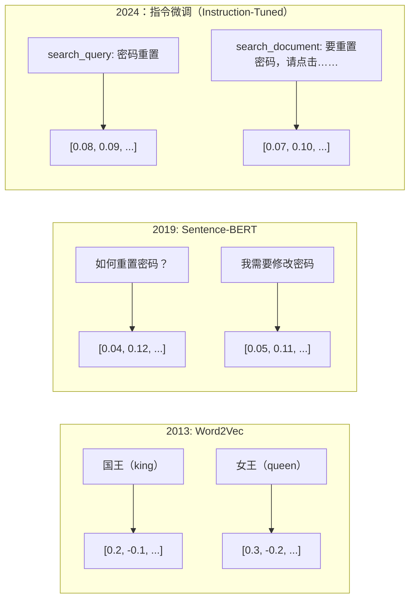
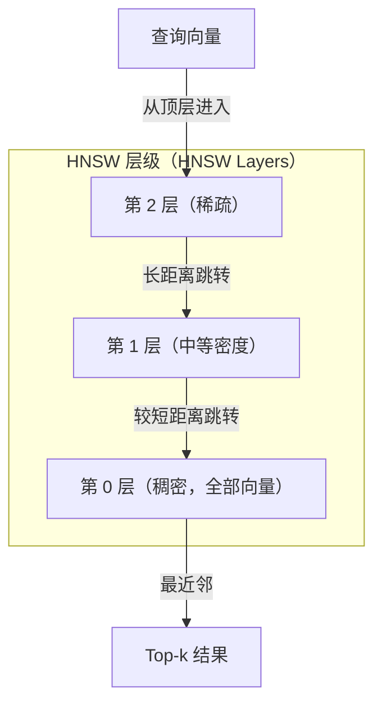

# 嵌入与向量表示（Embeddings & Vector Representations）

> 文本是离散的，数学是连续的。每次要求 LLM 查找“相似”文档、比较含义或进行超越关键词的搜索时，你都在依赖连接这两个世界的桥梁。这个桥梁就是嵌入（Embedding）。不理解嵌入，就不理解现代 AI，只是在使用它。

**Type:** Build
**Languages:** Python
**Prerequisites:** 阶段 11，第 01 课（提示词工程，Prompt Engineering）
**Time:** ~75 分钟
**相关课程（Related）:** 阶段 5 · 22（深入嵌入模型，Embedding Models Deep Dive）介绍稠密、稀疏与多向量的对比、套娃截断（Matryoshka truncation）和按各评估维度选模型。本课聚焦生产流水线（向量数据库、HNSW、相似度数学）。选择模型前请阅读阶段 5 · 22。

## 学习目标（Learning Objectives）

- 使用 API 提供商和开源模型生成文本嵌入，并计算嵌入之间的余弦相似度（Cosine similarity）
- 解释嵌入为什么能解决关键词搜索无法处理的词汇不匹配问题
- 构建按含义检索文档、而非按精确关键词匹配的语义搜索（Semantic search）索引
- 使用检索基准（precision@k、召回率）评估嵌入质量，为任务选择合适模型

## 问题（The Problem）

你有 10,000 张支持工单。客户写道“我的付款没成功”。你需要查找类似历史工单。关键词搜索能找到含“付款”和“没成功”的工单，却漏掉“交易失败”“扣款被拒”和“账单错误”。这些工单用完全不同的词描述同一个问题。

这就是词汇不匹配（Vocabulary mismatch）问题。人类语言可用数十种方式表达同一件事。关键词搜索将每个词视为没有含义的独立符号，无法知道“被拒”和“没成功”指向同一概念。

你需要一种由含义而非拼写决定相似度的文本表示。需要在某个数学空间中，将“我的付款没成功”和“交易被拒”放近，同时将“我的付款按时到账”推远，尽管它们共有“付款”一词。

这种表示就是嵌入。

## 概念（The Concept）

### 什么是嵌入（What Is an Embedding?）

嵌入是表示文本含义的浮点数稠密向量（Dense vector）。“稠密”很重要：每个维度都携带信息，不同于多数维度为零的稀疏表示（Sparse representation，如词袋、TF-IDF）。

“猫坐在垫子上”会变为类似 `[0.023, -0.041, 0.087, ..., 0.012]` 的表示：视模型而定，由 768 至 3072 个数字组成。这些数字编码含义。你不会直接逐一查看它们，而是比较它们。

### Word2Vec 的突破（The Word2Vec Breakthrough）

2013 年，Google 的 Tomas Mikolov 及其同事发表 Word2Vec。核心洞见是：训练神经网络根据相邻词预测一个词（或根据一个词预测相邻词），隐藏层权重就会成为有意义的向量表示。

著名的结果是：

```
king - man + woman = queen
```

词嵌入上的向量运算能够捕捉语义关系。从“man”（男人）到“woman”（女人）的方向，大致与从“king”（国王）到“queen”（女王）的方向相同。此时，研究领域意识到几何可以编码含义。

Word2Vec 生成 300 维向量。无论上下文如何，每个词只有一个向量。“river bank”（河岸）与“bank account”（银行账户）中的“bank”具有相同嵌入。这一局限推动了随后十年的研究。

### 从词到句子（From Words to Sentences）

词嵌入表示单个词元。生产系统需要嵌入整个句子、段落或文档，因此出现了四种方法：

**取平均（Averaging）**：对句中所有词向量求均值。成本低、有损，但短文本效果出乎意料地不错。它完全丢失词序：“狗咬人”和“人咬狗”得到相同嵌入。

**CLS 词元（CLS token）**：Transformer 模型（BERT，2018）输出特殊 [CLS] 词元嵌入，用于表示整个输入。它优于取平均，但 [CLS] 词元的训练目标是下一句预测，而非相似度。

**对比学习（Contrastive learning）**：明确训练模型拉近相似对、推远不相似对。Sentence-BERT（Reimers 与 Gurevych，2019）采用此方法，成为现代嵌入模型的基础。给定“如何重置密码？”和“我需要修改密码”，模型会学到两者应具有近乎相同的向量。

**指令微调嵌入（Instruction-tuned embeddings）**：最新的方法。E5、GTE 等模型接收任务前缀（“search_query:”、“search_document:”），告诉模型应生成哪类嵌入，使一个模型可服务多项任务。



### 现代嵌入模型（Modern Embedding Models）

市场已经形成少数几种生产级选择（截至 2026 年初的 MTEB 分数，MTEB v2）：

| 模型 | 提供商 | 维度 | MTEB | 上下文 | 每 1M 词元成本 |
|-------|----------|-----------|------|---------|------------------|
| Gemini Embedding 2 | Google | 3072（套娃，Matryoshka） | 67.7（检索） | 8192 | $0.15 |
| embed-v4 | Cohere | 1024（套娃） | 65.2 | 128K | $0.12 |
| voyage-4 | Voyage AI | 1024/2048（套娃） | 66.8 | 32K | $0.12 |
| text-embedding-3-large | OpenAI | 3072（套娃） | 64.6 | 8192 | $0.13 |
| text-embedding-3-small | OpenAI | 1536（套娃） | 62.3 | 8192 | $0.02 |
| BGE-M3 | BAAI | 1024（稠密+稀疏+ColBERT） | 63.0 多语言 | 8192 | 开放权重 |
| Qwen3-Embedding | Alibaba | 4096（套娃） | 66.9 | 32K | 开放权重 |
| Nomic-embed-v2 | Nomic | 768（套娃） | 63.1 | 8192 | 开放权重 |

大规模文本嵌入基准（Massive Text Embedding Benchmark，MTEB）v2 覆盖检索、分类、聚类、重排序和摘要等 100+ 项任务，分数越高越好。截至 2026 年，开放权重模型（Qwen3-Embedding、BGE-M3）在多数维度已达到或超过闭源托管模型。Gemini Embedding 2 领先纯检索；Voyage/Cohere 在特定领域（金融、法律、代码）领先。决定采用前，务必用自己的查询进行基准测试。

### 相似度指标（Similarity Metrics）

给定两个嵌入向量，可用三种方式衡量相似程度：

**余弦相似度（Cosine similarity）**：两个向量夹角的余弦，范围从 -1（反向）到 1（同向）。它忽略模长：10 词句子与 500 词文档若方向相同，也能得 1.0。这是 90% 使用场景的默认选择。

```
cosine_sim(a, b) = dot(a, b) / (||a|| * ||b||)
```

**点积（Dot product）**：两个向量的原始内积。向量归一化（单位长度）后，它等同于余弦相似度，且计算更快。OpenAI 嵌入已归一化，因此点积与余弦得到相同排名。

```
dot(a, b) = sum(a_i * b_i)
```

**欧氏距离（Euclidean distance，L2）**：向量空间中的直线距离。越小越相似，对模长差异敏感。当空间中的绝对位置而不仅是方向重要时使用。

```
L2(a, b) = sqrt(sum((a_i - b_i)^2))
```

各自适用时机：

| 指标 | 适用情况 | 应避免的情况 |
|--------|----------|------------|
| 余弦相似度 | 比较不同长度文本；多数检索任务 | 模长携带信息 |
| 点积 | 嵌入已归一化；追求最大速度 | 向量模长不同 |
| 欧氏距离 | 聚类；空间最近邻问题 | 比较长度悬殊的文档 |

### 向量数据库与 HNSW（Vector Databases and HNSW）

暴力相似度搜索（Brute-force similarity search）将查询与每个存储向量比较。对于 100 万个 1536 维向量，每次查询需要 15 亿次乘加运算，太慢。

向量数据库用近似最近邻（Approximate Nearest Neighbor，ANN）算法解决此问题。主流算法是分层可导航小世界（Hierarchical Navigable Small World，HNSW）：

1. 构建向量的多层图
2. 顶层稀疏，在相距较远的簇之间建立长距离连接
3. 底层稠密，在相邻向量之间建立细粒度连接
4. 搜索从顶层开始，贪心下降并逐步细化
5. 以 O(log n) 而非 O(n) 的时间返回近似 top-k 结果

HNSW 以少量精度损失（召回率通常为 95-99%）换取大幅速度提升。对于 1000 万个向量，暴力搜索需要数秒，HNSW 只需毫秒。



生产环境选择：

| 数据库 | 类型 | 最适合 | 最大规模 |
|----------|------|----------|-----------|
| Pinecone | 托管 SaaS | 零运维生产 | 数十亿 |
| Weaviate | 开源 | 自托管、混合搜索 | 100M+ |
| Qdrant | 开源 | 高性能、过滤 | 100M+ |
| ChromaDB | 嵌入式 | 原型、本地开发 | 1M |
| pgvector | Postgres 扩展 | 已在使用 Postgres | 10M |
| FAISS | 库 | 进程内、研究 | 1B+ |

### 分块策略（Chunking Strategies）

文档太长，不适合只用一个向量嵌入。50 页 PDF 涵盖数十个主题，其嵌入会变成所有内容的平均值，却不与任何具体内容相似。因此要把文档切成块（Chunk），分别嵌入。

**固定大小分块（Fixed-size chunking）**：每 N 个词元切分，保留 M 个词元重叠。简单、可预测，适合没有清晰结构的文档。512 词元块、50 词元重叠时，第 1 块为词元 0-511，第 2 块为 462-973。

**按句分块（Sentence-based chunking）**：在句子边界切分，将句子组合到词元上限。每块至少包含一个完整句子。它优于固定大小，因为不会把一个想法截成两半。

**递归分块（Recursive chunking）**：先尝试在最大边界（章节标题）切分。如果仍太大，再尝试段落边界，然后是句子边界，最后是字符上限。这就是 LangChain 的 `RecursiveCharacterTextSplitter`，适合混合格式语料。

**语义分块（Semantic chunking）**：先嵌入每个句子，再将嵌入相似的连续句子组合。嵌入相似度低于阈值时开始新块。成本高（需单独嵌入每句话），但生成的块连贯性最好。

| 策略 | 复杂度 | 质量 | 最适合 |
|----------|-----------|---------|----------|
| 固定大小 | 低 | 尚可 | 非结构化文本、日志 |
| 按句 | 低 | 良好 | 文章、邮件 |
| 递归 | 中 | 良好 | Markdown、HTML、混合文档 |
| 语义 | 高 | 最佳 | 检索质量至关重要的场景 |

多数系统的适宜范围是：每块 256-512 词元，重叠 50 词元。

### 双编码器与交叉编码器（Bi-Encoders vs Cross-Encoders）

双编码器（Bi-encoder）分别嵌入查询和文档，再比较向量。速度快：查询只嵌入一次，再与预计算的文档嵌入比较。它用于检索。

交叉编码器（Cross-encoder）将查询和文档作为一个输入，输出相关性分数。速度慢：每个查询—文档对都要经过完整模型。但准确率高得多，因为它能同时关注查询和文档的词元。

生产模式是：双编码器检索 top-100 候选，交叉编码器将其重排序为 top-10。这就是先检索后重排序（Retrieve-then-rerank）流水线。


重排序模型：Cohere Rerank 3.5（每 1000 次查询 $2）、BGE-reranker-v2（免费、开源）、Jina Reranker v2（免费、开源）。

### 套娃嵌入（Matryoshka Embeddings）

传统嵌入只能完整使用。1536 维向量需要 1536 个浮点数，不重新训练就无法截断为 256 维。

套娃表示学习（Matryoshka Representation Learning，Kusupati 等，2022）解决了这个问题。训练使模型的前 N 维捕捉最重要的信息，就像俄罗斯套娃。将 1536 维套娃嵌入截断到 256 维会损失一些精度，但仍可使用。

OpenAI 的 text-embedding-3-small 和 text-embedding-3-large 通过 `dimensions` 参数支持套娃截断。请求 256 维而非 1536 维，可将存储降为六分之一，在 MTEB 基准上准确率约损失 3-5%。

### 二值量化（Binary Quantization）

1536 维嵌入以 float32 存储需要 6,144 字节。乘以 1000 万份文档，仅向量就占 61 GB。

二值量化（Binary quantization）将每个浮点数转为一位：正值为 1，负值为 0。存储从 6,144 字节降至 192 字节，缩小 32 倍。相似度使用汉明距离（Hamming distance，统计不同位数）计算，CPU 可用单条指令完成。

检索召回率约损失 5-10%。常见模式是：先用二值量化在数百万向量上进行首轮搜索，再用全精度向量对 top-1000 重新评分。这样以三十二分之一的内存，获得全精度 95%+ 的准确率。

```figure
cosine-similarity
```

## 动手实现（Build It）

我们从零构建语义搜索引擎。不用向量数据库，不用外部嵌入 API。使用纯 Python，并用 numpy 处理数学计算。

### 第 1 步：文本分块（Step 1: Text Chunking）

```python
def chunk_text(text, chunk_size=200, overlap=50):
    words = text.split()
    chunks = []
    start = 0
    while start < len(words):
        end = start + chunk_size
        chunk = " ".join(words[start:end])
        chunks.append(chunk)
        start += chunk_size - overlap
    return chunks


def chunk_by_sentences(text, max_chunk_tokens=200):
    sentences = text.replace("\n", " ").split(".")
    sentences = [s.strip() + "." for s in sentences if s.strip()]
    chunks = []
    current_chunk = []
    current_length = 0
    for sentence in sentences:
        sentence_length = len(sentence.split())
        if current_length + sentence_length > max_chunk_tokens and current_chunk:
            chunks.append(" ".join(current_chunk))
            current_chunk = []
            current_length = 0
        current_chunk.append(sentence)
        current_length += sentence_length
    if current_chunk:
        chunks.append(" ".join(current_chunk))
    return chunks
```

### 第 2 步：从零构建嵌入（Step 2: Building Embeddings from Scratch）

我们用 TF-IDF 和 L2 归一化实现简单的稠密嵌入。它不是神经嵌入，但遵循同一契约：输入文本，输出固定大小向量，相似文本生成相似向量。

```python
import math
import numpy as np
from collections import Counter

class SimpleEmbedder:
    def __init__(self):
        self.vocab = []
        self.idf = []
        self.word_to_idx = {}

    def fit(self, documents):
        vocab_set = set()
        for doc in documents:
            vocab_set.update(doc.lower().split())
        self.vocab = sorted(vocab_set)
        self.word_to_idx = {w: i for i, w in enumerate(self.vocab)}
        n = len(documents)
        self.idf = np.zeros(len(self.vocab))
        for i, word in enumerate(self.vocab):
            doc_count = sum(1 for doc in documents if word in doc.lower().split())
            self.idf[i] = math.log((n + 1) / (doc_count + 1)) + 1

    def embed(self, text):
        words = text.lower().split()
        count = Counter(words)
        total = len(words) if words else 1
        vec = np.zeros(len(self.vocab))
        for word, freq in count.items():
            if word in self.word_to_idx:
                tf = freq / total
                vec[self.word_to_idx[word]] = tf * self.idf[self.word_to_idx[word]]
        norm = np.linalg.norm(vec)
        if norm > 0:
            vec = vec / norm
        return vec
```

### 第 3 步：相似度函数（Step 3: Similarity Functions）

```python
def cosine_similarity(a, b):
    dot = np.dot(a, b)
    norm_a = np.linalg.norm(a)
    norm_b = np.linalg.norm(b)
    if norm_a == 0 or norm_b == 0:
        return 0.0
    return float(dot / (norm_a * norm_b))


def dot_product(a, b):
    return float(np.dot(a, b))


def euclidean_distance(a, b):
    return float(np.linalg.norm(a - b))
```

### 第 4 步：支持暴力搜索的向量索引（Step 4: Vector Index with Brute-Force Search）

```python
class VectorIndex:
    def __init__(self):
        self.vectors = []
        self.texts = []
        self.metadata = []

    def add(self, vector, text, meta=None):
        self.vectors.append(vector)
        self.texts.append(text)
        self.metadata.append(meta or {})

    def search(self, query_vector, top_k=5, metric="cosine"):
        scores = []
        for i, vec in enumerate(self.vectors):
            if metric == "cosine":
                score = cosine_similarity(query_vector, vec)
            elif metric == "dot":
                score = dot_product(query_vector, vec)
            elif metric == "euclidean":
                score = -euclidean_distance(query_vector, vec)
            else:
                raise ValueError(f"Unknown metric: {metric}")
            scores.append((i, score))
        scores.sort(key=lambda x: x[1], reverse=True)
        results = []
        for idx, score in scores[:top_k]:
            results.append({
                "text": self.texts[idx],
                "score": score,
                "metadata": self.metadata[idx],
                "index": idx
            })
        return results

    def size(self):
        return len(self.vectors)
```

### 第 5 步：语义搜索引擎（Step 5: The Semantic Search Engine）

```python
class SemanticSearchEngine:
    def __init__(self, chunk_size=200, overlap=50):
        self.embedder = SimpleEmbedder()
        self.index = VectorIndex()
        self.chunk_size = chunk_size
        self.overlap = overlap

    def index_documents(self, documents, source_names=None):
        all_chunks = []
        all_sources = []
        for i, doc in enumerate(documents):
            chunks = chunk_text(doc, self.chunk_size, self.overlap)
            all_chunks.extend(chunks)
            name = source_names[i] if source_names else f"doc_{i}"
            all_sources.extend([name] * len(chunks))
        self.embedder.fit(all_chunks)
        for chunk, source in zip(all_chunks, all_sources):
            vec = self.embedder.embed(chunk)
            self.index.add(vec, chunk, {"source": source})
        return len(all_chunks)

    def search(self, query, top_k=5, metric="cosine"):
        query_vec = self.embedder.embed(query)
        return self.index.search(query_vec, top_k, metric)

    def search_with_scores(self, query, top_k=5):
        results = self.search(query, top_k)
        return [
            {
                "text": r["text"][:200],
                "source": r["metadata"].get("source", "unknown"),
                "score": round(r["score"], 4)
            }
            for r in results
        ]
```

### 第 6 步：比较相似度指标（Step 6: Comparing Similarity Metrics）

```python
def compare_metrics(engine, query, top_k=3):
    results = {}
    for metric in ["cosine", "dot", "euclidean"]:
        hits = engine.search(query, top_k=top_k, metric=metric)
        results[metric] = [
            {"score": round(h["score"], 4), "preview": h["text"][:80]}
            for h in hits
        ]
    return results
```

## 实际应用（Use It）

接入生产嵌入 API 时，架构保持一致，只需更换嵌入器：

```python
from openai import OpenAI

client = OpenAI()

def openai_embed(texts, model="text-embedding-3-small", dimensions=None):
    kwargs = {"model": model, "input": texts}
    if dimensions:
        kwargs["dimensions"] = dimensions
    response = client.embeddings.create(**kwargs)
    return [item.embedding for item in response.data]
```

使用 OpenAI 进行套娃截断：相同模型，更少维度，更低存储：

```python
full = openai_embed(["semantic search query"], dimensions=1536)
compact = openai_embed(["semantic search query"], dimensions=256)
```

256 维向量的存储降为六分之一。对于 1000 万份文档，是 10 GB 对比 61 GB。标准基准上的准确率约损失 3-5%。

用 Cohere 重排序：

```python
import cohere

co = cohere.ClientV2()

results = co.rerank(
    model="rerank-v3.5",
    query="What is the refund policy?",
    documents=["Full refund within 30 days...", "No refunds after 90 days..."],
    top_n=3
)
```

不依赖 API 的本地嵌入：

```python
from sentence_transformers import SentenceTransformer

model = SentenceTransformer("BAAI/bge-small-en-v1.5")
embeddings = model.encode(["semantic search query", "another document"])
```

我们构建的 VectorIndex 类与这些方案均兼容。替换嵌入函数，保留搜索逻辑即可。

## 交付成果（Ship It）

本课产出：
- `outputs/prompt-embedding-advisor.md`：针对特定场景选择嵌入模型和策略的提示词
- `outputs/skill-embedding-patterns.md`：教智能体在生产环境中有效使用嵌入的技能

## 练习（Exercises）

1. **指标比较**：分别用余弦相似度、点积和欧氏距离，对示例文档运行相同的 5 个查询。记录各自 top-3 结果。哪些查询的指标结果不一致？为什么？

2. **块大小实验**：分别以 50、100、200、500 个单词的块大小为示例文档建索引。每种运行 5 个查询，记录 top-1 相似度分数。绘制块大小与检索质量的关系，找出块继续增大开始损害效果的位置。

3. **套娃模拟**：构建生成 500 维向量的 SimpleEmbedder，分别截断为 50、100、200、500 维，测量每种截断下检索召回率如何退化。这无需真正的训练技巧即可模拟套娃行为。

4. **二值量化**：将搜索引擎的嵌入转为二值（正为 1，负为 0），实现汉明距离搜索。将 top-10 结果与全精度余弦相似度的结果比较，测量重叠百分比。

5. **按句分块**：用 `chunk_by_sentences` 替换固定大小分块。运行同样查询，比较检索分数。遵循句子边界是否改善结果？

## 关键术语（Key Terms）

| 术语 | 常见说法 | 实际含义 |
|------|----------------|----------------------|
| 嵌入（Embedding） | “文本转数字” | 用几何邻近性编码语义相似度的稠密向量 |
| Word2Vec | “最早的经典嵌入” | 2013 年通过预测上下文词学习词向量的模型，证明向量运算可以编码含义 |
| 余弦相似度（Cosine similarity） | “两个向量有多相似” | 向量夹角的余弦；1 = 同向，0 = 正交，-1 = 反向 |
| HNSW | “快速向量搜索” | 分层可导航小世界图，多层结构支持 O(log n) 近似最近邻搜索 |
| 双编码器（Bi-encoder） | “分别嵌入，快速比较” | 分别将查询与文档编码为向量，支持预计算和快速检索 |
| 交叉编码器（Cross-encoder） | “慢但准确的重排序器” | 将查询—文档对联合送入完整模型处理，准确率更高，不支持预计算 |
| 套娃嵌入（Matryoshka embeddings） | “可截断向量” | 训练使前 N 维捕捉最重要信息的嵌入，支持可变大小存储 |
| 二值量化（Binary quantization） | “1 位嵌入” | 将浮点向量转为二值（仅符号位），配合汉明距离搜索，存储缩小 32 倍 |
| 分块（Chunking） | “切文档以便嵌入” | 将文档拆为 256-512 词元片段，使每段能独立嵌入和检索 |
| 向量数据库（Vector database） | “嵌入搜索引擎” | 为向量存储和大规模近似最近邻搜索优化的数据存储 |
| 对比学习（Contrastive learning） | “通过比较来训练” | 拉近相似对嵌入、推远不相似对嵌入的训练方法 |
| MTEB | “嵌入基准” | 大规模文本嵌入基准，覆盖 8 类任务的 56 个数据集，是比较嵌入模型的标准 |

## 延伸阅读（Further Reading）

- Mikolov 等，《向量空间中词表示的高效估计》（Efficient Estimation of Word Representations in Vector Space，2013）：Word2Vec 论文，通过国王—女王类比开启了嵌入革命
- Reimers 与 Gurevych，《Sentence-BERT：使用孪生 BERT 网络生成句子嵌入》（Sentence-BERT: Sentence Embeddings using Siamese BERT-Networks，2019）：介绍如何训练用于句子级相似度的双编码器，是现代嵌入模型的基础
- Kusupati 等，《套娃表示学习》（Matryoshka Representation Learning，2022）：可变维度嵌入背后的技术，OpenAI 已将其用于 text-embedding-3
- Malkov 与 Yashunin，《使用分层可导航小世界图实现高效稳健的近似最近邻》（Efficient and Robust Approximate Nearest Neighbor using Hierarchical Navigable Small World Graphs，2018）：HNSW 论文，多数生产向量搜索背后的算法
- OpenAI 嵌入指南（Embeddings Guide，platform.openai.com/docs/guides/embeddings）：text-embedding-3 模型的实践参考，包括套娃降维
- MTEB 排行榜（Leaderboard，huggingface.co/spaces/mteb/leaderboard）：跨任务、跨语言比较所有嵌入模型的实时基准
- [Muennighoff 等，《MTEB：大规模文本嵌入基准》（MTEB: Massive Text Embedding Benchmark，EACL 2023）](https://arxiv.org/abs/2210.07316)：定义榜单所报告的 8 类任务（分类、聚类、成对分类、重排序、检索、语义文本相似度 STS、摘要、双语文本挖掘）；相信任何单一 MTEB 分数前应先阅读。
- [Sentence Transformers 文档（Documentation）](https://www.sbert.net/)：关于双编码器与交叉编码器、池化策略，以及本课实现的摄取—切分—嵌入—存储 RAG 流水线的权威参考。
