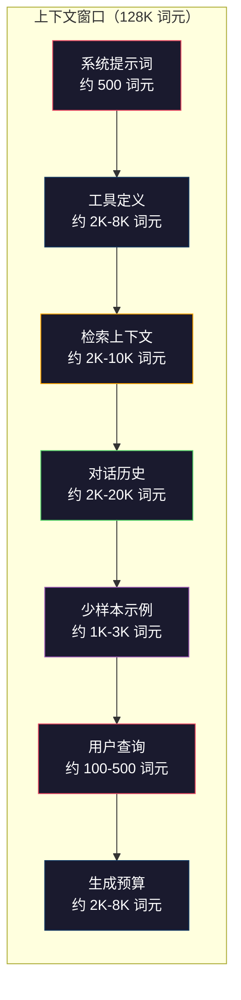
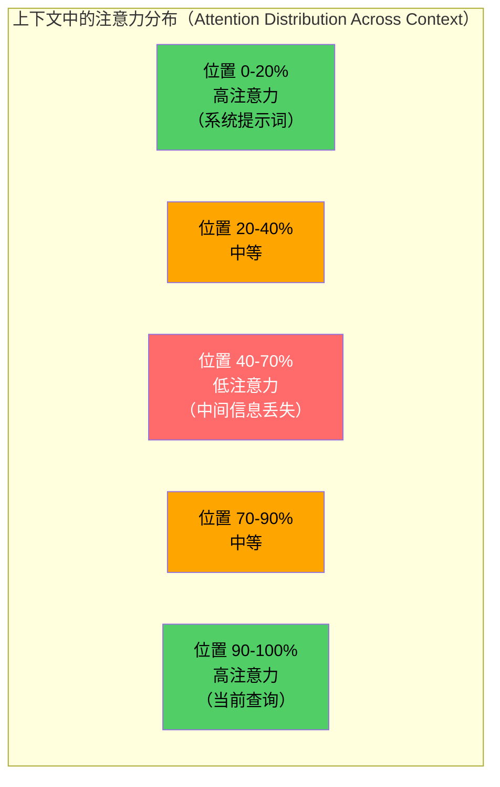
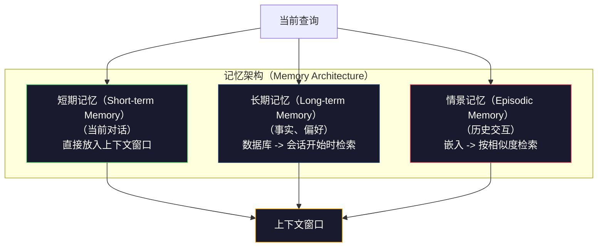

# 上下文工程：窗口、预算、记忆与检索（Context Engineering: Windows, Budgets, Memory, and Retrieval）

> 提示词工程只是子集，上下文工程（Context Engineering）才是全局。提示词是你输入的字符串，上下文则是进入模型窗口的全部内容：系统指令、检索文档、工具定义、对话历史、少样本示例和提示词本身。2026 年最优秀的 AI 工程师也是上下文工程师。他们决定放入什么、排除什么，以及如何排序。

**Type:** Build
**Languages:** Python
**Prerequisites:** 阶段 10（从零构建大语言模型，LLMs from Scratch），阶段 11 第 01-02 课
**Time:** ~90 分钟
**相关课程（Related）:** 阶段 11 · 15（提示词缓存，Prompt Caching）：缓存友好布局是上下文工程的扩展。阶段 5 · 28（长上下文评估，Long-Context Evaluation）讲解如何用 NIAH/RULER 测量中间信息丢失。

## 学习目标（Learning Objectives）

- 计算上下文窗口各组件的词元预算（Token budget）：系统提示词、工具、历史、检索文档和生成余量
- 实现上下文窗口管理策略：对话历史截断、摘要和滑动窗口（Sliding window）
- 为上下文组件设置优先级并排序，使模型尽可能关注最相关信息
- 构建根据查询类型和可用窗口空间动态分配词元的上下文组装器（Context assembler）

## 问题（The Problem）

Claude Opus 4.7 有 200K 词元窗口（测试版 1M），GPT-5 有 400K，Gemini 3 Pro 有 2M，Llama 4 宣称 10M。在把它们填满之前，这些数字听起来很大。

下面是一个编程助手的真实分解：系统提示词 500 词元；50 个工具的定义 8,000 词元；检索文档 4,000 词元；对话历史（10 轮）6,000 词元；当前用户查询 200 词元；生成预算（最大输出）4,000 词元。共 22,700 词元，只占 128K 窗口的 18%。

但注意力（Attention）成本并不随上下文长度线性增长。128K 词元上下文的模型需要承担二次方注意力成本（标准 Transformer 中为 O(n^2)，尽管多数生产模型使用高效注意力变体）。更重要的是检索准确率会下降。“大海捞针（Needle in a Haystack）”测试表明，模型难以找到长上下文中部的信息。Liu 等（2023）的研究显示，LLM 检索长上下文开头和结尾信息时，准确率近乎完美，但对中部信息（上下文 40-70% 位置）准确率下降 10-20%。这种“中间信息丢失（Lost-in-the-middle）”效应因模型而异，但影响所有当前架构。

实践结论是：有 200K 可用词元，不意味着用满 200K 就有效。精心筛选的 10K 词元上下文，往往胜过直接堆入的 100K 上下文。上下文工程研究如何最大化窗口内的信噪比（Signal-to-noise ratio）。

放入窗口的每个词元，都占用了本可承载更相关信息的位置。每个无关工具定义、每轮过时对话、每块无法回答问题的检索文本，都会让模型在任务上的表现略微变差。

## 概念（The Concept）

### 上下文窗口是稀缺资源（The Context Window is a Scarce Resource）

将上下文窗口想成内存 RAM，而不是磁盘。它快速且可直接访问，但容量有限，放不下所有内容，必须选择。



各组件竞争空间。添加更多工具定义意味着留给对话历史的空间更少；添加更多检索上下文意味着少样本示例空间更少。上下文工程就是分配这份预算，以最大化任务表现。

### 中间信息丢失（Lost-in-the-Middle）

这是上下文工程最重要的实证发现。模型更关注上下文开头和结尾的信息。中部信息的注意力分数更低，也更容易被忽略。

Liu 等（2023）进行了系统测试。他们将一份相关文档放在 20 份无关文档中的不同位置，测量回答准确率。相关文档排在最前或最后时，准确率为 85-90%；位于中间（20 个位置中的第 10 个）时，准确率降至 60-70%。

这直接影响工程设计：

- 把最重要信息放在最前（系统提示词、关键指令）
- 把当前查询和最相关上下文放在最后（近因偏差有帮助）
- 将上下文中部视为最低优先级区域
- 必须在中部放入信息时，在末尾重复关键点



### 上下文组件（Context Components）

**系统提示词（System prompt）**：设置角色、约束和行为规则。位于最前，跨轮次保持不变。Claude Code 的系统提示词约用 6,000 词元，包括工具定义和行为指令。应精简，因为系统提示词中的每个词都会在每次 API 调用中重复。

**工具定义（Tool definitions）**：每个工具增加 50-200 词元（名称、描述、参数模式）。50 个工具、每个 150 词元，在对话开始前就占 7,500 词元。动态工具选择（只包含与当前查询相关的工具）可将其减少 60-80%。

**检索上下文（Retrieved context）**：来自向量数据库的文档、搜索结果、文件内容。检索质量直接决定回答质量。糟糕检索比不检索更差，因为它用噪声填满窗口，还会误导模型。

**对话历史（Conversation history）**：之前的每条用户消息和助手回答，随对话长度线性增长。50 轮对话、每轮 200 词元，就是 10,000 词元历史，其中大多数与当前查询无关。

**少样本示例（Few-shot examples）**：展示所需行为的输入/输出对。两三个精选示例对输出质量的提升，常常超过数千词元指令，但它们也占空间。

**生成预算（Generation budget）**：为模型回答预留的词元。窗口填满后，模型就没有回答空间。至少预留 2,000-4,000 词元用于生成。

### 上下文压缩策略（Context Compression Strategies）

**历史摘要（History summarization）**：定期总结对话，而不是逐字保留此前所有轮次。用 100 词元的“我们讨论了 X，决定了 Y，用户希望 Z”，替换占 2,000 词元的 10 轮对话。历史超过阈值（例如 5,000 词元）时执行摘要。

**相关性过滤（Relevance filtering）**：根据当前查询为每份检索文档评分，丢弃低于阈值的文档。如果检索 10 块但只有 3 块相关，就丢弃另外 7 块。3 块高度相关内容优于 10 块平庸内容。

**工具裁剪（Tool pruning）**：分类用户查询意图，只包含相关工具。代码问题不需要日历工具，日程问题不需要文件系统工具。这样可将工具定义从 8,000 词元减少到 1,000。

**递归摘要（Recursive summarization）**：对很长的文档分阶段总结。先总结每节，再总结这些摘要。50 页文档可变为捕捉关键点的 500 词元摘要。

### 记忆系统（Memory Systems）

上下文工程跨越三个时间尺度。

**短期记忆（Short-term memory）**：当前对话，直接存入上下文窗口，每轮增长，通过摘要和截断管理。

**长期记忆（Long-term memory）**：跨对话保留的事实和偏好。例如“用户偏好 TypeScript”“项目使用 PostgreSQL”。存入数据库，在会话开始时检索。Claude Code 将其存于 CLAUDE.md 文件，ChatGPT 则存于记忆功能。

**情景记忆（Episodic memory）**：可能相关的特定历史交互。例如“上周二，我们在认证模块调试过类似问题”。以嵌入形式存储，在当前对话与过去情景匹配时检索。



### 动态上下文组装（Dynamic Context Assembly）

关键洞见是：不同查询需要不同上下文。静态系统提示词 + 静态工具 + 静态历史会造成浪费。最好的系统按查询动态组装上下文。

1. 分类查询意图
2. 选择相关工具（不是全部工具）
3. 检索相关文档（不是固定集合）
4. 包含相关历史轮次（不是全部历史）
5. 添加匹配任务类型的少样本示例
6. 按重要性排序全部内容：关键的在最前，重要的在最后，可选的在中间

这正是良好 AI 应用与卓越应用的区别。模型相同，上下文才是差异所在。

```figure
lost-in-the-middle
```

## 动手实现（Build It）

### 第 1 步：词元计数器（Step 1: Token Counter）

无法测量就无法制定预算。构建简单词元计数器（用空白切分近似估计，因为精确计数取决于分词器）。

```python
import json
import numpy as np
from collections import OrderedDict

def count_tokens(text):
    if not text:
        return 0
    return int(len(text.split()) * 1.3)

def count_tokens_json(obj):
    return count_tokens(json.dumps(obj))
```

### 第 2 步：上下文预算管理器（Step 2: Context Budget Manager）

这是核心抽象。预算管理器跟踪各组件使用的词元数量，并强制执行上限。

```python
class ContextBudget:
    def __init__(self, max_tokens=128000, generation_reserve=4000):
        self.max_tokens = max_tokens
        self.generation_reserve = generation_reserve
        self.available = max_tokens - generation_reserve
        self.allocations = OrderedDict()

    def allocate(self, component, content, max_tokens=None):
        tokens = count_tokens(content)
        if max_tokens and tokens > max_tokens:
            words = content.split()
            target_words = int(max_tokens / 1.3)
            content = " ".join(words[:target_words])
            tokens = count_tokens(content)

        used = sum(self.allocations.values())
        if used + tokens > self.available:
            allowed = self.available - used
            if allowed <= 0:
                return None, 0
            words = content.split()
            target_words = int(allowed / 1.3)
            content = " ".join(words[:target_words])
            tokens = count_tokens(content)

        self.allocations[component] = tokens
        return content, tokens

    def remaining(self):
        used = sum(self.allocations.values())
        return self.available - used

    def utilization(self):
        used = sum(self.allocations.values())
        return used / self.max_tokens

    def report(self):
        total_used = sum(self.allocations.values())
        lines = []
        lines.append(f"Context Budget Report ({self.max_tokens:,} token window)")
        lines.append("-" * 50)
        for component, tokens in self.allocations.items():
            pct = tokens / self.max_tokens * 100
            bar = "#" * int(pct / 2)
            lines.append(f"  {component:<25} {tokens:>6} tokens ({pct:>5.1f}%) {bar}")
        lines.append("-" * 50)
        lines.append(f"  {'Used':<25} {total_used:>6} tokens ({total_used/self.max_tokens*100:.1f}%)")
        lines.append(f"  {'Generation reserve':<25} {self.generation_reserve:>6} tokens")
        lines.append(f"  {'Remaining':<25} {self.remaining():>6} tokens")
        return "\n".join(lines)
```

### 第 3 步：针对中间信息丢失的重排（Step 3: Lost-in-the-Middle Reordering）

实现重排策略：最重要的条目放在最前和最后，最不重要的放在中间。

```python
def reorder_lost_in_middle(items, scores):
    paired = sorted(zip(scores, items), reverse=True)
    sorted_items = [item for _, item in paired]

    if len(sorted_items) <= 2:
        return sorted_items

    first_half = sorted_items[::2]
    second_half = sorted_items[1::2]
    second_half.reverse()

    return first_half + second_half

def score_relevance(query, documents):
    query_words = set(query.lower().split())
    scores = []
    for doc in documents:
        doc_words = set(doc.lower().split())
        if not query_words:
            scores.append(0.0)
            continue
        overlap = len(query_words & doc_words) / len(query_words)
        scores.append(round(overlap, 3))
    return scores
```

### 第 4 步：对话历史压缩器（Step 4: Conversation History Compressor）

总结旧对话轮次，释放词元预算。

```python
class ConversationManager:
    def __init__(self, max_history_tokens=5000):
        self.turns = []
        self.summaries = []
        self.max_history_tokens = max_history_tokens

    def add_turn(self, role, content):
        self.turns.append({"role": role, "content": content})
        self._compress_if_needed()

    def _compress_if_needed(self):
        total = sum(count_tokens(t["content"]) for t in self.turns)
        if total <= self.max_history_tokens:
            return

        while total > self.max_history_tokens and len(self.turns) > 4:
            old_turns = self.turns[:2]
            summary = self._summarize_turns(old_turns)
            self.summaries.append(summary)
            self.turns = self.turns[2:]
            total = sum(count_tokens(t["content"]) for t in self.turns)

    def _summarize_turns(self, turns):
        parts = []
        for t in turns:
            content = t["content"]
            if len(content) > 100:
                content = content[:100] + "..."
            parts.append(f"{t['role']}: {content}")
        return "Previous: " + " | ".join(parts)

    def get_context(self):
        parts = []
        if self.summaries:
            parts.append("[Conversation Summary]")
            for s in self.summaries:
                parts.append(s)
        parts.append("[Recent Conversation]")
        for t in self.turns:
            parts.append(f"{t['role']}: {t['content']}")
        return "\n".join(parts)

    def token_count(self):
        return count_tokens(self.get_context())
```

### 第 5 步：动态工具选择器（Step 5: Dynamic Tool Selector）

只包含与当前查询相关的工具。先分类意图，再过滤。

```python
TOOL_REGISTRY = {
    "read_file": {
        "description": "Read contents of a file",
        "tokens": 120,
        "categories": ["code", "files"],
    },
    "write_file": {
        "description": "Write content to a file",
        "tokens": 150,
        "categories": ["code", "files"],
    },
    "search_code": {
        "description": "Search for patterns in codebase",
        "tokens": 130,
        "categories": ["code"],
    },
    "run_command": {
        "description": "Execute a shell command",
        "tokens": 140,
        "categories": ["code", "system"],
    },
    "create_calendar_event": {
        "description": "Create a new calendar event",
        "tokens": 180,
        "categories": ["calendar"],
    },
    "list_emails": {
        "description": "List recent emails",
        "tokens": 160,
        "categories": ["email"],
    },
    "send_email": {
        "description": "Send an email message",
        "tokens": 200,
        "categories": ["email"],
    },
    "web_search": {
        "description": "Search the web for information",
        "tokens": 140,
        "categories": ["research"],
    },
    "query_database": {
        "description": "Run a SQL query on the database",
        "tokens": 170,
        "categories": ["code", "data"],
    },
    "generate_chart": {
        "description": "Generate a chart from data",
        "tokens": 190,
        "categories": ["data", "visualization"],
    },
}

def classify_intent(query):
    query_lower = query.lower()

    intent_keywords = {
        "code": ["code", "function", "bug", "error", "file", "implement", "refactor", "debug", "test"],
        "calendar": ["meeting", "schedule", "calendar", "appointment", "event"],
        "email": ["email", "mail", "send", "inbox", "message"],
        "research": ["search", "find", "what is", "how does", "explain", "look up"],
        "data": ["data", "query", "database", "chart", "graph", "analytics", "sql"],
    }

    scores = {}
    for intent, keywords in intent_keywords.items():
        score = sum(1 for kw in keywords if kw in query_lower)
        if score > 0:
            scores[intent] = score

    if not scores:
        return ["code"]

    max_score = max(scores.values())
    return [intent for intent, score in scores.items() if score >= max_score * 0.5]

def select_tools(query, token_budget=2000):
    intents = classify_intent(query)
    relevant = {}
    total_tokens = 0

    for name, tool in TOOL_REGISTRY.items():
        if any(cat in intents for cat in tool["categories"]):
            if total_tokens + tool["tokens"] <= token_budget:
                relevant[name] = tool
                total_tokens += tool["tokens"]

    return relevant, total_tokens
```

### 第 6 步：完整上下文组装流水线（Step 6: Full Context Assembly Pipeline）

连接所有组件。给定查询，动态组装最佳上下文。

```python
class ContextEngine:
    def __init__(self, max_tokens=128000, generation_reserve=4000):
        self.budget = ContextBudget(max_tokens, generation_reserve)
        self.conversation = ConversationManager(max_history_tokens=5000)
        self.system_prompt = (
            "You are a helpful AI assistant. You have access to tools for "
            "code editing, file management, web search, and data analysis. "
            "Use the appropriate tools for each task. Be concise and accurate."
        )
        self.knowledge_base = [
            "Python 3.12 introduced type parameter syntax for generic classes using bracket notation.",
            "The project uses PostgreSQL 16 with pgvector for embedding storage.",
            "Authentication is handled by Supabase Auth with JWT tokens.",
            "The frontend is built with Next.js 15 using the App Router.",
            "API rate limits are set to 100 requests per minute per user.",
            "The deployment pipeline uses GitHub Actions with Docker multi-stage builds.",
            "Test coverage must be above 80% for all new modules.",
            "The codebase follows the repository pattern for data access.",
        ]

    def assemble(self, query):
        self.budget = ContextBudget(self.budget.max_tokens, self.budget.generation_reserve)

        system_content, _ = self.budget.allocate("system_prompt", self.system_prompt, max_tokens=1000)

        tools, tool_tokens = select_tools(query, token_budget=2000)
        tool_text = json.dumps(list(tools.keys()))
        tool_content, _ = self.budget.allocate("tools", tool_text, max_tokens=2000)

        relevance = score_relevance(query, self.knowledge_base)
        threshold = 0.1
        relevant_docs = [
            doc for doc, score in zip(self.knowledge_base, relevance)
            if score >= threshold
        ]

        if relevant_docs:
            doc_scores = [s for s in relevance if s >= threshold]
            reordered = reorder_lost_in_middle(relevant_docs, doc_scores)
            doc_text = "\n".join(reordered)
            doc_content, _ = self.budget.allocate("retrieved_context", doc_text, max_tokens=3000)

        history_text = self.conversation.get_context()
        if history_text.strip():
            history_content, _ = self.budget.allocate("conversation_history", history_text, max_tokens=5000)

        query_content, _ = self.budget.allocate("user_query", query, max_tokens=500)

        return self.budget

    def chat(self, query):
        self.conversation.add_turn("user", query)
        budget = self.assemble(query)
        response = f"[Response to: {query[:50]}...]"
        self.conversation.add_turn("assistant", response)
        return budget


def run_demo():
    print("=" * 60)
    print("  Context Engineering Pipeline Demo")
    print("=" * 60)

    engine = ContextEngine(max_tokens=128000, generation_reserve=4000)

    print("\n--- Query 1: Code task ---")
    budget = engine.chat("Fix the bug in the authentication module where JWT tokens expire too early")
    print(budget.report())

    print("\n--- Query 2: Research task ---")
    budget = engine.chat("What is the best approach for implementing vector search in PostgreSQL?")
    print(budget.report())

    print("\n--- Query 3: After conversation history builds up ---")
    for i in range(8):
        engine.conversation.add_turn("user", f"Follow-up question number {i+1} about the implementation details of the system")
        engine.conversation.add_turn("assistant", f"Here is the response to follow-up {i+1} with technical details about the architecture")

    budget = engine.chat("Now implement the changes we discussed")
    print(budget.report())

    print("\n--- Tool Selection Examples ---")
    test_queries = [
        "Fix the bug in auth.py",
        "Schedule a meeting with the team for Tuesday",
        "Show me the database query performance stats",
        "Search for best practices on error handling",
    ]

    for q in test_queries:
        tools, tokens = select_tools(q)
        intents = classify_intent(q)
        print(f"\n  Query: {q}")
        print(f"  Intents: {intents}")
        print(f"  Tools: {list(tools.keys())} ({tokens} tokens)")

    print("\n--- Lost-in-the-Middle Reordering ---")
    docs = ["Doc A (most relevant)", "Doc B (somewhat relevant)", "Doc C (least relevant)",
            "Doc D (relevant)", "Doc E (moderately relevant)"]
    scores = [0.95, 0.60, 0.20, 0.80, 0.50]
    reordered = reorder_lost_in_middle(docs, scores)
    print(f"  Original order: {docs}")
    print(f"  Scores:         {scores}")
    print(f"  Reordered:      {reordered}")
    print(f"  (Most relevant at start and end, least relevant in middle)")
```

## 实际应用（Use It）

### 运行框架管理的上下文（Harness-Managed Context）

Claude Code 分层管理上下文。系统提示词包含行为规则和工具定义（约 6K 词元）。打开文件时，其内容被注入上下文；搜索时，结果被加入；旧对话轮次被总结。CLAUDE.md 提供跨会话持久保存的长期记忆。

关键工程决策是：Claude Code 不把整个代码库堆进上下文，而是按需检索相关文件。这就是上下文工程的实践。

### 动态上下文加载（Dynamic Context Loading）

Cursor 为整个代码库生成嵌入索引。输入查询后，它利用向量相似度检索最相关的文件和代码块，只有这些片段进入上下文窗口。500K 行代码库被压缩为最相关的 5-10 个代码块。

模式是：嵌入全部内容，按需检索，只纳入重要内容。

### 助手长期记忆（Assistant Long-Term Memory）

ChatGPT 将用户偏好和事实存为长期记忆。每次对话开始时，检索相关记忆并放入系统提示词。“用户偏好 Python”花费 5 个词元，却能节省跨对话重复指令所需的数百词元。

### 作为上下文工程的 RAG（RAG as Context Engineering）

检索增强生成（Retrieval-Augmented Generation，RAG）是形式化的上下文工程。不把知识塞入模型权重（训练）或系统提示词（静态上下文），而是在查询时检索相关文档，注入上下文窗口。整个 RAG 流水线（分块、嵌入、检索、重排序）都为解决一个问题而存在：把正确信息放入上下文窗口。

## 交付成果（Ship It）

本课产出 `outputs/prompt-context-optimizer.md`：可复用提示词，用于审计上下文组装策略并推荐优化。输入系统提示词、工具数量、平均历史长度和检索策略，它会识别词元浪费并提出改进建议。

还会产出 `outputs/skill-context-engineering.md`：根据任务类型、上下文窗口大小和延迟预算设计上下文组装流水线的决策框架。

## 练习（Exercises）

1. 为 ContextBudget 类添加“词元浪费检测器”。标记使用超过 30% 预算的组件，并针对组件类型建议压缩策略（历史摘要、工具裁剪、文档重排序）。

2. 为检索上下文实现语义去重。如果两份检索文档相似度超过 80%（按词汇重叠或嵌入余弦相似度），只保留分数更高的一份。测量释放了多少词元预算。

3. 构建“上下文回放（Context replay）”工具。给定对话记录，通过 ContextEngine 回放，展示预算分配如何逐轮变化。绘制各组件词元使用量随时间的曲线，找出开始压缩上下文的轮次。

4. 实现基于优先级的工具选择器。不仅作包含/排除二元选择，而是为每个工具计算与当前查询的相关性分数。按相关性降序纳入工具，直到预算耗尽。比较纳入 5、10、20、50 个工具时的任务表现。

5. 构建多策略上下文压缩器。实现三种压缩策略（截断、摘要、关键句抽取），在 20 份文档上进行基准测试。测量压缩率与信息保留之间的权衡（压缩版本是否仍含查询答案？）。

## 关键术语（Key Terms）

| 术语 | 常见说法 | 实际含义 |
|------|----------------|----------------------|
| 上下文窗口（Context window） | “模型能读多少” | 模型单次前向传播处理的最大词元数（输入 + 输出）；GPT-5 为 400K，Claude Opus 4.7 为 200K（测试版 1M），Gemini 3 Pro 为 2M |
| 上下文工程（Context engineering） | “高级提示词工程” | 决定上下文窗口放什么、按什么顺序和优先级放置的学科，涵盖检索、压缩、工具选择和记忆管理 |
| 中间信息丢失（Lost-in-the-middle） | “模型忘记中间的内容” | 实证发现：LLM 更关注上下文开头和结尾，中部信息的准确率下降 10-20% |
| 词元预算（Token budget） | “还剩多少词元” | 在组件（系统提示词、工具、历史、检索、生成）间明确分配窗口容量，并设置组件上限 |
| 动态上下文（Dynamic context） | “即时加载内容” | 根据意图分类、相关工具选择和检索结果，为每个查询以不同方式组装上下文窗口 |
| 历史摘要（History summarization） | “压缩对话” | 用简洁摘要替换旧对话原文，在保留关键信息的同时减少词元成本 |
| 工具裁剪（Tool pruning） | “只放相关工具” | 分类查询意图，仅包含匹配的工具定义，降低 60-80% 工具词元成本 |
| 长期记忆（Long-term memory） | “跨会话记住” | 存入数据库、在会话开始时检索的事实和偏好，如 CLAUDE.md、ChatGPT Memory 及类似系统 |
| 情景记忆（Episodic memory） | “记住特定历史事件” | 将历史交互存为嵌入，在当前查询与过去对话相似时检索 |
| 生成预算（Generation budget） | “留给答案的空间” | 为模型输出预留的词元；上下文占满窗口后，模型就没有回答空间 |

## 延伸阅读（Further Reading）

- [Liu 等，2023：《迷失在中间：语言模型如何使用长上下文》（Lost in the Middle: How Language Models Use Long Contexts）](https://arxiv.org/abs/2307.03172)：关于位置依赖注意力的权威研究，表明模型难以处理长上下文中部的信息
- [Anthropic 上下文检索博文（Contextual Retrieval）](https://www.anthropic.com/news/contextual-retrieval)：Anthropic 如何进行上下文感知的块检索，将检索失败减少 49%
- [Simon Willison 的《上下文工程》（Context Engineering）](https://simonwillison.net/2025/Jun/27/context-engineering/)：为这门学科命名并将其与提示词工程区分的博文
- [LangChain 的 RAG 文档（Documentation on RAG）](https://python.langchain.com/docs/tutorials/rag/)：将检索增强生成作为上下文工程模式的实践实现
- [Greg Kamradt 的大海捞针测试（Needle in a Haystack test）](https://github.com/gkamradt/LLMTest_NeedleInAHaystack)：揭示所有主流模型存在位置依赖检索失败的基准
- [Pope 等：《高效扩展 Transformer 推理》（Efficiently Scaling Transformer Inference，2022）](https://arxiv.org/abs/2211.05102)：上下文长度为何推高内存和延迟，以及 KV 缓存、MQA 和 GQA 如何改变预算计算。
- [Agrawal 等：《SARATHI：通过分块预填充搭载解码实现高效 LLM 推理》（SARATHI: Efficient LLM Inference by Piggybacking Decodes with Chunked Prefills，2023）](https://arxiv.org/abs/2308.16369)：推理的两个阶段使长提示词在首词元时间（TTFT）上昂贵、在每输出词元时间（TPOT）上便宜，这是上下文打包权衡背后的实际机制。
- [Ainslie 等：《GQA：从多头检查点训练广义多查询 Transformer 模型》（GQA: Training Generalized Multi-Query Transformer Models from Multi-Head Checkpoints，EMNLP 2023）](https://arxiv.org/abs/2305.13245)：分组查询注意力（Grouped-query attention）论文，在不损失质量的情况下将生产解码器的 KV 内存减少 8 倍。
