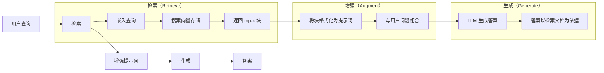
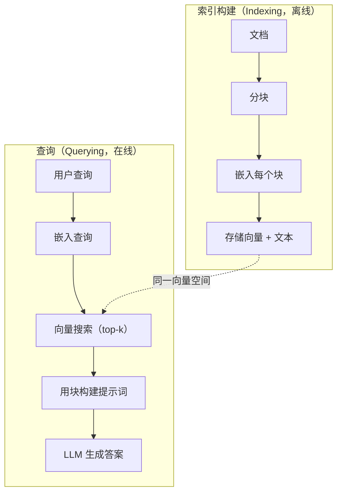

# 检索增强生成（Retrieval-Augmented Generation，RAG）

> LLM 知道训练截止日期之前的一切，却不了解你公司的文档、代码库或上周的会议记录。RAG 通过检索相关文档并放入提示词来解决这个问题。它是生产 AI 中部署最广泛的模式。如果只从本课程动手构建一样东西，就构建 RAG 流水线。

**Type:** Build
**Languages:** Python
**Prerequisites:** 阶段 10（从零构建大语言模型，LLMs from Scratch），阶段 11 第 01-05 课
**Time:** ~90 分钟
**相关课程（Related）:** 阶段 5 · 23（RAG 分块策略，Chunking Strategies for RAG）介绍六种分块算法及各自优势场景。阶段 5 · 22（深入嵌入模型，Embedding Models Deep Dive）介绍嵌入器选择。阶段 11 · 07（高级 RAG，Advanced RAG）介绍混合搜索、重排序和查询变换。

## 学习目标（Learning Objectives）

- 构建完整 RAG 流水线：文档加载、分块、嵌入、向量存储、检索和生成
- 使用正确建立索引的向量数据库（ChromaDB、FAISS 或 Pinecone）实现语义搜索（Semantic search）
- 解释基于知识的应用为什么优先使用 RAG 而非微调（成本、时效性、来源归属）
- 用检索指标（精确率、召回率）和生成指标（忠实度、相关性）评估 RAG 质量

## 问题（The Problem）

你为公司构建聊天机器人。客户问“企业套餐的退款政策是什么？”LLM 回答了典型 SaaS 退款政策的一般情况。实际政策藏在 200 页内部 wiki 中，规定企业客户有 60 天窗口，可按比例退款。LLM 从未见过这份文档，无法知道训练中没有的内容。

微调（Fine-tuning）是一种方案：用内部文档训练 LLM，再部署更新模型。它有效，但问题严重：计算成本需数千美元；文档一变，模型就过时；你无法知道模型引用了哪个来源；下个月公司若收购新产品线，还得再次微调。

另一种方案是 RAG。保持模型不变，问题到来时，在文档存储中搜索相关段落，粘贴到提示词中的问题之前，让模型用这些段落作上下文回答。文档存储可在几分钟内更新；你能准确看到检索了哪些文档；模型本身从不改变。因此 RAG 成为生产中的主流模式：更便宜、更新鲜、更便于审计，且兼容任意 LLM。

## 概念（The Concept）

### RAG 模式（The RAG Pattern）

整个模式可归纳为四步：



查询 -> 检索 -> 增强提示词 -> 生成。每个 RAG 系统都遵循此模式。生产 RAG 系统的区别在各步细节：如何分块、如何嵌入、如何搜索，以及如何构建提示词。

### RAG 为什么优于微调（Why RAG Beats Fine-Tuning）

| 考量 | 微调（Fine-tuning） | RAG |
|---------|------------|-----|
| 成本 | 每次训练 $1,000-$100,000+ | 每次查询 $0.01-$0.10（嵌入 + LLM） |
| 时效性 | 重新训练前一直过时 | 文档重建索引，几分钟即可更新 |
| 可审计性 | 无法追溯答案来源 | 可展示精确检索段落 |
| 幻觉（Hallucination） | 仍可随意产生幻觉 | 以检索文档为依据 |
| 数据隐私 | 训练数据固化进权重 | 文档留在你的向量存储中 |

微调永久改变模型权重，RAG 临时改变模型上下文。多数应用需要的是临时上下文。

微调占优的一种情况是：需要模型采用仅靠提示词无法实现的特定风格、语气或推理模式。对于事实知识检索，RAG 总是占优。

### 嵌入模型（Embedding Models）

嵌入（Embedding）模型将文本转换为稠密向量。相似文本在高维空间中产生相近向量。“如何重置密码？”和“我需要修改密码”虽共有词较少，向量却几乎相同。“猫坐在垫子上”则生成很不同的向量。

常见嵌入模型（2026 年阵容，完整分析见阶段 5 · 22）：

| 模型 | 维度 | 提供商 | 说明 |
|-------|-----------|----------|-------|
| text-embedding-3-small | 1536（套娃，Matryoshka） | OpenAI | 多数场景中性价比最佳 |
| text-embedding-3-large | 3072（套娃） | OpenAI | 准确率更高，可截断至 256/512/1024 |
| Gemini Embedding 2 | 3072（套娃） | Google | MTEB 检索领先；8K 上下文 |
| voyage-4 | 1024/2048（套娃） | Voyage AI | 领域变体（代码、金融、法律） |
| Cohere embed-v4 | 1024（套娃） | Cohere | 多语言能力强，128K 上下文 |
| BGE-M3 | 1024（稠密 + 稀疏 + ColBERT） | BAAI（开放权重） | 一个模型提供三种视图 |
| Qwen3-Embedding | 4096（套娃） | Alibaba（开放权重） | 开放权重模型检索分数领先 |
| all-MiniLM-L6-v2 | 384 | 开放权重（Sentence Transformers） | 原型基线 |

本课用 TF-IDF 自行构建简单嵌入。这不是因为生产系统都用 TF-IDF，而是为了把概念具体化：输入文本，输出向量，相似文本产生相似向量。

### 向量相似度（Vector Similarity）

给定两个向量，如何衡量相似度？有三种选择：

**余弦相似度（Cosine similarity）**：两向量夹角的余弦，范围从 -1（相反）到 1（相同）。忽略模长，只关注方向，是 RAG 默认选择。

```
cosine_sim(a, b) = dot(a, b) / (||a|| * ||b||)
```

**点积（Dot product）**：原始内积。模长更大的向量得分更高。模长携带信息时有用（更长文档可能更相关）。

```
dot(a, b) = sum(a_i * b_i)
```

**L2 欧氏距离（Euclidean distance）**：向量空间中的直线距离。距离越小越相似，对模长差异敏感。

```
L2(a, b) = sqrt(sum((a_i - b_i)^2))
```

余弦相似度是标准方法。它按模长归一化，因此能良好处理不同长度文档。人们说“向量搜索”时，几乎总是指余弦相似度。

### 分块策略（Chunking Strategies）

文档太长，不适合嵌入为单个向量。50 页 PDF 可能因为包含数十个主题而产生糟糕嵌入。因此应将文档分块，分别嵌入。

**固定大小分块（Fixed-size chunking）**：每 N 词元切分，简单且可预测。512 词元块、50 词元重叠意味着第 1 块为词元 0-511，第 2 块为 462-973，以此类推。重叠确保不会在不合适边界截断句子。

**语义分块（Semantic chunking）**：在自然边界切分，如段落、章节或 Markdown 标题。每块都是连贯的语义单位。实现更复杂，但检索效果更好。

**递归分块（Recursive chunking）**：先尝试最大边界（章节标题）。章节仍太大时，按段落边界切分；段落仍太大时，按句子边界切分。这是 LangChain RecursiveCharacterTextSplitter 的方法，实践效果良好。

块大小比人们想象得更重要：

- 太小（64-128 词元）：每块缺少上下文。“它上季度增长 15%”若不知道“它”指什么，就没有意义。
- 太大（2048+ 词元）：每块涵盖多个主题，稀释相关性。搜索营收数据，却得到仅 10% 讲营收、90% 讲人数的块。
- 适宜范围（256-512 词元）：上下文足够自足，内容也足够聚焦、相关。

多数生产 RAG 系统使用 256-512 词元块、50 词元重叠。Anthropic 的 RAG 指南推荐此范围。

### 向量数据库（Vector Databases）

获得嵌入后，需要存储和搜索它们的地方。可选方案：

| 数据库 | 类型 | 最适合 |
|----------|------|----------|
| FAISS | 库（进程内） | 原型、中小数据集 |
| Chroma | 轻量数据库 | 本地开发、小规模部署 |
| Pinecone | 托管服务 | 无运维负担的生产环境 |
| Weaviate | 开源数据库 | 自托管生产 |
| pgvector | Postgres 扩展 | 已使用 Postgres |
| Qdrant | 开源数据库 | 高性能自托管 |

本课构建简单的内存向量存储，将向量放在列表中，进行暴力余弦相似度搜索。这相当于 FAISS 的扁平索引，可能到 100,000 个向量时才开始变慢。生产系统用 HNSW 等近似最近邻（ANN）算法，在毫秒内搜索数百万向量。

### 完整流水线（The Full Pipeline）



索引阶段每份文档运行一次（或文档更新时运行），查询阶段每次用户请求都运行。生产中，索引可能需数小时处理数百万文档，查询则必须在一秒内响应。

### 实际数值（Real Numbers）

多数生产 RAG 系统采用这些参数：

- 每次查询检索 **k = 5 至 10** 个块
- **块大小 = 256 至 512 词元**，重叠 50 词元
- **上下文预算**：每次查询检索内容为 2,500-5,000 词元
- **完整提示词**：约 8,000-16,000 词元（系统提示词 + 检索块 + 对话历史 + 用户查询）
- **嵌入维度**：依模型而定，为 384-3072
- **索引吞吐量**：使用 API 嵌入时，每秒 100-1,000 份文档
- **查询延迟**：检索 50-200ms，生成 500-3000ms

```figure
rag-chunking
```

## 动手实现（Build It）

### 第 1 步：文档分块（Step 1: Document Chunking）

```python
def chunk_text(text, chunk_size=200, overlap=50):
    words = text.split()
    chunks = []
    start = 0
    while start < len(words):
        end = start + chunk_size
        chunk = " ".join(words[start:end])
        chunks.append(chunk)
        start += chunk_size - overlap
    return chunks
```

### 第 2 步：TF-IDF 嵌入（Step 2: TF-IDF Embeddings）

我们构建简单嵌入函数。词频—逆文档频率（Term Frequency-Inverse Document Frequency，TF-IDF）不是神经嵌入，但能把文本转为捕捉词重要性的向量。文档中的高频词获得更高 TF，语料中的罕见词获得更高 IDF。两者乘积形成向量，其中重要且有区分度的词值更高。

```python
import math
from collections import Counter

def build_vocabulary(documents):
    vocab = set()
    for doc in documents:
        vocab.update(doc.lower().split())
    return sorted(vocab)

def compute_tf(text, vocab):
    words = text.lower().split()
    count = Counter(words)
    total = len(words)
    return [count.get(word, 0) / total for word in vocab]

def compute_idf(documents, vocab):
    n = len(documents)
    idf = []
    for word in vocab:
        doc_count = sum(1 for doc in documents if word in doc.lower().split())
        idf.append(math.log((n + 1) / (doc_count + 1)) + 1)
    return idf

def tfidf_embed(text, vocab, idf):
    tf = compute_tf(text, vocab)
    return [t * i for t, i in zip(tf, idf)]
```

### 第 3 步：余弦相似度搜索（Step 3: Cosine Similarity Search）

```python
def cosine_similarity(a, b):
    dot = sum(x * y for x, y in zip(a, b))
    norm_a = math.sqrt(sum(x * x for x in a))
    norm_b = math.sqrt(sum(x * x for x in b))
    if norm_a == 0 or norm_b == 0:
        return 0.0
    return dot / (norm_a * norm_b)

def search(query_embedding, stored_embeddings, top_k=5):
    scores = []
    for i, emb in enumerate(stored_embeddings):
        sim = cosine_similarity(query_embedding, emb)
        scores.append((i, sim))
    scores.sort(key=lambda x: x[1], reverse=True)
    return scores[:top_k]
```

### 第 4 步：提示词构建（Step 4: Prompt Construction）

RAG 中的“增强”就在这里发生。取出检索块，格式化为提示词，要求 LLM 根据所提供的上下文回答。

```python
def build_rag_prompt(query, retrieved_chunks):
    context = "\n\n---\n\n".join(
        f"[Source {i+1}]\n{chunk}"
        for i, chunk in enumerate(retrieved_chunks)
    )
    return f"""Answer the question based ONLY on the following context.
If the context doesn't contain enough information, say "I don't have enough information to answer that."

Context:
{context}

Question: {query}

Answer:"""
```

### 第 5 步：完整 RAG 流水线（Step 5: The Complete RAG Pipeline）

```python
class RAGPipeline:
    def __init__(self):
        self.chunks = []
        self.embeddings = []
        self.vocab = []
        self.idf = []

    def index(self, documents):
        all_chunks = []
        for doc in documents:
            all_chunks.extend(chunk_text(doc))
        self.chunks = all_chunks
        self.vocab = build_vocabulary(all_chunks)
        self.idf = compute_idf(all_chunks, self.vocab)
        self.embeddings = [
            tfidf_embed(chunk, self.vocab, self.idf)
            for chunk in all_chunks
        ]

    def query(self, question, top_k=5):
        query_emb = tfidf_embed(question, self.vocab, self.idf)
        results = search(query_emb, self.embeddings, top_k)
        retrieved = [(self.chunks[i], score) for i, score in results]
        prompt = build_rag_prompt(
            question, [chunk for chunk, _ in retrieved]
        )
        return prompt, retrieved
```

### 第 6 步：生成（模拟）（Step 6: Generation (simulated)）

生产环境中，在这里调用 LLM API。本课从检索上下文抽取最相关句子，模拟生成。

```python
def simple_generate(prompt, retrieved_chunks):
    query_words = set(prompt.lower().split("question:")[-1].split())
    best_sentence = ""
    best_score = 0
    for chunk in retrieved_chunks:
        for sentence in chunk.split("."):
            sentence = sentence.strip()
            if not sentence:
                continue
            words = set(sentence.lower().split())
            overlap = len(query_words & words)
            if overlap > best_score:
                best_score = overlap
                best_sentence = sentence
    return best_sentence if best_sentence else "I don't have enough information."
```

## 实际应用（Use It）

接入真实嵌入模型和 LLM，代码几乎不变：

```python
from openai import OpenAI

client = OpenAI()

def embed(text):
    response = client.embeddings.create(
        model="text-embedding-3-small",
        input=text
    )
    return response.data[0].embedding

def generate(prompt):
    response = client.chat.completions.create(
        model="gpt-4o-mini",
        messages=[{"role": "user", "content": prompt}],
        temperature=0
    )
    return response.choices[0].message.content
```

或使用 Anthropic：

```python
import anthropic

client = anthropic.Anthropic()

def generate(prompt):
    response = client.messages.create(
        model="claude-sonnet-5",
        max_tokens=1024,
        messages=[{"role": "user", "content": prompt}]
    )
    return response.content[0].text
```

流水线相同，只需替换嵌入函数和生成函数。无论使用什么模型，检索逻辑、分块和提示词构建都一致。

需要大规模向量存储时，用正式向量数据库替换暴力搜索：

```python
import chromadb

client = chromadb.Client()
collection = client.create_collection("my_docs")

collection.add(
    documents=chunks,
    ids=[f"chunk_{i}" for i in range(len(chunks))]
)

results = collection.query(
    query_texts=["What is the refund policy?"],
    n_results=5
)
```

Chroma 在内部处理嵌入（默认用 all-MiniLM-L6-v2），将向量存入本地数据库。模式相同，底层实现不同。

## 交付成果（Ship It）

本课产出：
- `outputs/prompt-rag-architect.md`：针对特定使用场景设计 RAG 系统的提示词
- `outputs/skill-rag-pipeline.md`：教智能体构建和调试 RAG 流水线的技能

## 练习（Exercises）

1. 将 TF-IDF 嵌入替换为简单词袋（Bag-of-words）方法（二值：词存在为 1，否则为 0）。比较示例文档的检索质量。TF-IDF 应更好，因为它给罕见词更高权重。

2. 块大小实验：在同一文档集上尝试 50、100、200、500 词。每个大小运行同样的 5 个查询，统计多少次 top-3 中返回相关块，找出检索质量最佳的范围。

3. 为每块添加元数据（源文档名称、块位置）。修改提示词模板，加入来源归属，使 LLM 引用来源。

4. 实现简单评估：给定 10 个问答对，将每个问题送入 RAG 流水线，测量检索块中包含答案的百分比。这就是前 k 项检索召回率（Retrieval recall at k）。

5. 构建对话感知 RAG 流水线：保留最近 3 次交互历史，与检索块一起放进提示词。用追问测试，例如询问价格后继续问“企业版呢？”

## 关键术语（Key Terms）

| 术语 | 常见说法 | 实际含义 |
|------|----------------|----------------------|
| RAG | “读你文档的 AI” | 检索相关文档，粘贴进提示词，并以这些文档为依据生成答案 |
| 嵌入（Embedding） | “文本转数字” | 文本的稠密向量表示，相似含义产生相似向量 |
| 向量数据库（Vector database） | “AI 搜索引擎” | 为向量存储和按相似度查找最近邻优化的数据存储 |
| 分块（Chunking） | “把文档切碎” | 将文档分为较小片段（通常 256-512 词元），使每段可独立嵌入与检索 |
| 余弦相似度（Cosine similarity） | “两个向量有多像” | 两向量夹角的余弦；1 = 同向，0 = 正交，-1 = 反向 |
| Top-k 检索（Top-k retrieval） | “取 k 个最佳匹配” | 从向量存储返回与查询最相似的 k 个块 |
| 上下文窗口（Context window） | “LLM 能看到多少文本” | LLM 单次请求可处理的最大词元数；检索块必须能容纳于其中 |
| 增强生成（Augmented generation） | “用给定上下文回答” | 以检索文档为上下文生成回答，而不只依赖训练知识 |
| TF-IDF | “词重要性评分” | 词频乘以逆文档频率，按词在语料中的区分度赋权 |
| 索引构建（Indexing） | “让文档可供搜索” | 对文档分块、嵌入和存储的离线过程，使其可在查询时搜索 |

## 延伸阅读（Further Reading）

- Lewis 等，《面向知识密集型 NLP 任务的检索增强生成》（Retrieval-Augmented Generation for Knowledge-Intensive NLP Tasks，2020）：Facebook AI Research 的原始 RAG 论文，将先检索后生成模式形式化
- Anthropic 的 RAG 文档（docs.anthropic.com）：块大小、提示词构建和评估的实践指南
- Pinecone 学习中心，《什么是 RAG？》（What is RAG?）：清晰展示 RAG 流水线，并讨论生产考量
- Sentence-BERT：Reimers 与 Gurevych（2019）：all-MiniLM 嵌入模型背后的论文，展示如何训练用于语义相似度的双编码器
- [Karpukhin 等，《开放领域问答的稠密段落检索》（Dense Passage Retrieval for Open-Domain Question Answering，EMNLP 2020）](https://arxiv.org/abs/2004.04906)：DPR 论文，证明开放领域问答中稠密双编码器检索优于 BM25，奠定现代 RAG 检索器的模式。
- [LlamaIndex 高层概念（High-Level Concepts）](https://docs.llamaindex.ai/en/stable/getting_started/concepts.html)：构建 RAG 流水线应掌握的主要概念：数据加载器、节点解析器、索引、检索器、回答合成器。
- [LangChain RAG 教程（RAG tutorial）](https://python.langchain.com/docs/tutorials/rag/)：另一种风格的编排器，以可运行单元链的视角实现相同的先检索后生成模式。
