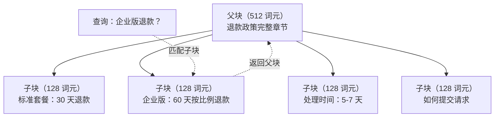
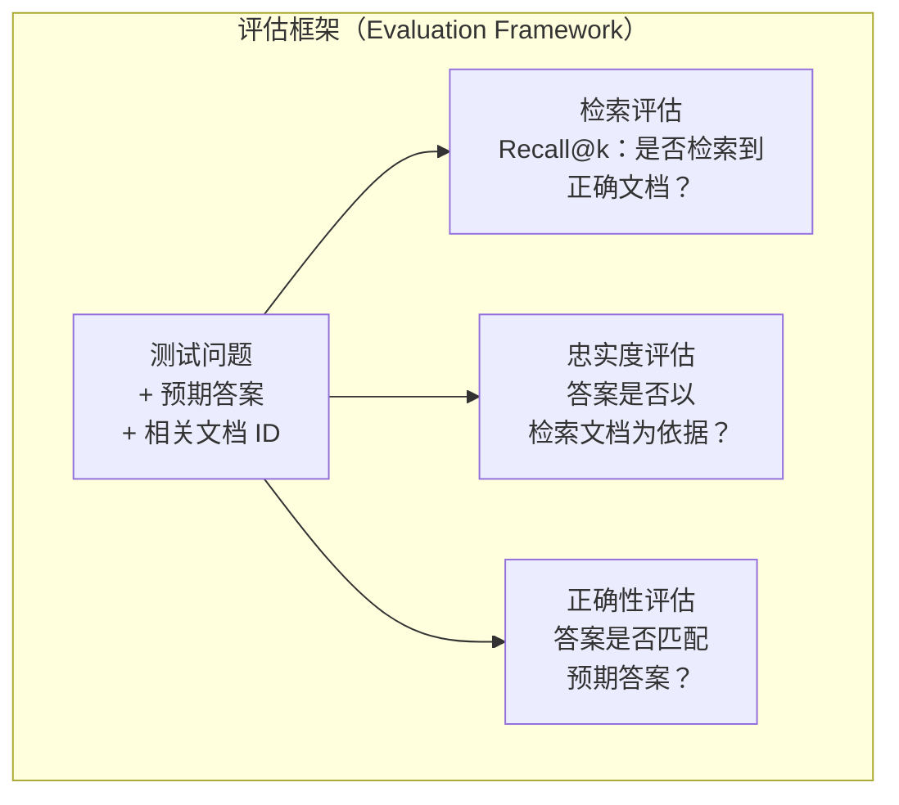

# 高级 RAG：分块、重排序与混合搜索（Advanced RAG: Chunking, Reranking, Hybrid Search）

> 基础 RAG 检索最相似的 top-k 块。简单问题适用，但遇到多跳推理、模糊查询和大型语料就难以胜任。高级 RAG（Advanced RAG）让只能处理 10 份文档的演示，变成能处理 1000 万份文档的系统。

**Type:** Build
**Languages:** Python
**Prerequisites:** 阶段 11，第 06 课（RAG）
**Time:** ~90 分钟
**相关课程（Related）:** 阶段 5 · 23（RAG 分块策略，Chunking Strategies for RAG）结合 Vectara/Anthropic 基准，涵盖全部六种分块算法：递归、语义、按句、父文档、晚分块、上下文检索。本课在此基础上介绍混合搜索、重排序、查询变换。

## 学习目标（Learning Objectives）

- 实现保留文档结构与上下文的高级分块策略（语义、递归、父子）
- 构建结合 BM25 关键词匹配、语义向量搜索和交叉编码器重排序器的混合搜索流水线
- 应用查询变换（Query transformation）技术（HyDE、多查询、退一步），改善模糊或复杂问题的检索
- 诊断并修复常见 RAG 失败：检索块错误、上下文没有答案、多跳推理中断

## 问题（The Problem）

你在第 06 课构建了基础 RAG 流水线，能处理小语料上的直接问题。现在试试以下情况：

**模糊查询（Ambiguous query）**：“上季度营收是多少？”语义搜索返回营收策略、营收预测、CFO 对营收增长看法等块。它们都与“营收”语义相近，却没有实际数字。正确块写着“2025 年 Q3 为 $47.2M”，但用的是“收益（earnings）”而非“营收（revenue）”。嵌入模型认为“营收策略”比“Q3 收益为 $47.2M”更接近查询。

**多跳问题（Multi-hop question）**：“哪个团队的客户满意度分数提升最多？”这需要查找各团队满意度分数、比较并找出最大值。没有单个块包含答案，信息分散于团队报告中。

**大型语料问题（Large corpus problem）**：有 200 万块，正确答案在 #1,847,293 块。top-5 检索却返回 #14、#89,201、#1,200,000、#44 和 #901,333。它们在嵌入空间中相近，却都没有答案。在这种规模下，近似最近邻搜索引入的误差足以把相关结果挤出 top-k。

基础 RAG 失败的原因是：向量相似度不等于相关性。块可能与查询语义相似，却无助于回答。高级 RAG 用四种技术解决：混合搜索（添加关键词匹配）、重排序（更仔细地为候选评分）、查询变换（搜索前修正查询）和更好的分块（按合适粒度检索）。

## 概念（The Concept）

### 混合搜索：语义与关键词（Hybrid Search: Semantic + Keyword）

语义搜索（向量相似度）擅长理解含义。“如何取消订阅？”能匹配“终止套餐的步骤”，即使两者没有共同词。但它会漏掉精确匹配。如果嵌入模型把“E-4021”当噪声，“错误码 E-4021”可能匹配不到含“E-4021”的块。

关键词搜索（BM25）相反，擅长精确匹配。“E-4021”能完美匹配，但文档若写“终止套餐”，“取消订阅”就返回零结果。

混合搜索（Hybrid search）同时运行两者，再合并结果。

**BM25**（最佳匹配 25，Best Matching 25）是标准关键词搜索算法，自 20 世纪 90 年代以来一直是搜索引擎的基础。公式如下：

```
BM25(q, d) = sum over terms t in q:
    IDF(t) * (tf(t,d) * (k1 + 1)) / (tf(t,d) + k1 * (1 - b + b * |d| / avgdl))
```

其中 tf(t,d) 是词 t 在文档 d 中的词频，IDF(t) 是逆文档频率，|d| 是文档长度，avgdl 是平均文档长度；k1 控制词频饱和程度（默认 1.2），b 控制长度归一化（默认 0.75）。

简单说，文档包含查询词（尤其罕见词）时，BM25 得分更高，但重复词的收益递减。含 50 次“营收”的文档，相关性不是只含一次文档的 50 倍。

### 倒数排名融合（Reciprocal Rank Fusion，RRF）

现在有两个排名列表，一个来自向量搜索，一个来自 BM25。如何组合？标准方法是倒数排名融合（RRF）。

```
RRF_score(d) = sum over rankings R:
    1 / (k + rank_R(d))
```

其中 k 是常数（通常 60），防止排名第一的结果占据过大优势。

向量搜索排 #1、BM25 排 #5 的文档得分为：1/(60+1) + 1/(60+5) = 0.0164 + 0.0154 = 0.0318

向量搜索排 #3、BM25 排 #2 的文档得分为：1/(60+3) + 1/(60+2) = 0.0159 + 0.0161 = 0.0320

RRF 自然平衡两种信号。在两个列表都排名靠前的文档得分最高。在一个列表排 #1、另一个列表缺席的文档得分适中。它很稳健，因为用的是排名而不是原始分数，所以不受两个系统分数分布差异影响。

### 重排序（Reranking）

检索（无论向量、关键词还是混合）快但不精确。它使用双编码器（Bi-encoder）：分别嵌入查询和每份文档，再比较。嵌入只计算一次并缓存，可扩展到数百万文档。

重排序使用交叉编码器（Cross-encoder）：查询和候选文档一起送入模型，输出相关性分数。模型同时看到两段文本，可捕捉细粒度交互。即使双编码器漏掉联系，交叉编码器也能理解“Q3 收益是多少？”与含“Q3 为 $47.2M”的块高度相关。

代价是：交叉编码器联合处理查询—文档对，比双编码器慢 100-1000 倍。你无法为百万文档预计算交叉编码器分数。解决办法是先检索更大候选集（混合搜索的 top-50），再用交叉编码器重排序得到最终 top-5。


常见重排序模型（2026 年阵容）：
- Cohere Rerank 3.5：托管 API，多语言，混合语料上的召回提升最佳
- Voyage rerank-2.5：托管 API，托管方案中延迟最低
- Jina-Reranker-v2 Multilingual：开放权重，100+ 种语言
- bge-reranker-v2-m3：开放权重，较强基线
- cross-encoder/ms-marco-MiniLM-L-6-v2：开放权重，可在 CPU 运行以构建原型
- ColBERTv2 / Jina-ColBERT-v2：晚交互（Late-interaction）多向量重排序器，评分时为 O(tokens) 而非 O(docs)

### 查询变换（Query Transformation）

有时问题不在检索，而在查询本身。“新政策变化那件事是什么来着？”是糟糕的搜索查询，没有具体词项，嵌入也模糊。任何检索系统都无法据此找到正确文档。

**查询改写（Query rewriting）**：把用户查询改写为更好的搜索查询。LLM 可以完成：

```
用户：“新政策变化那件事是什么来着？”
改写：“近期政策变化与更新”
```

**假设文档嵌入（Hypothetical Document Embeddings，HyDE）**：不用原查询搜索，而是生成假设答案，将其嵌入，再搜索相似真实文档。

```
查询：“企业版的退款政策是什么？”
假设答案：“企业客户可在购买后 60 天内获得全额退款。
退款根据剩余订阅期按比例计算，
并在 5-7 个工作日内处理。”
```

嵌入假设答案，搜索与它相似的真实文档。直觉是：相较原问题，假设答案在嵌入空间中更接近真实答案。问题和答案有不同语言结构，生成假设答案可跨越嵌入中“问题空间”和“答案空间”的差距。

HyDE 在检索前增加一次 LLM 调用，延迟增加 500-2000ms。原始查询检索质量差时，值得采用。

### 父子分块（Parent-Child Chunking）

标准分块迫使你取舍：小块检索精确，大块上下文充分。父子分块消除了这个取舍。

为小块（128 词元）建立检索索引。检索到小块后，向提示词返回其父块（512 词元）。小块精确匹配查询，父块提供充分上下文，使 LLM 生成良好答案。



查询“企业版退款？”精确匹配子块 C2，但提示词收到完整父块 P，其中包含处理时间和提交流程等周边上下文。

### 元数据过滤（Metadata Filtering）

向量搜索前，按日期、来源、类别、作者、语言等元数据过滤语料，缩小搜索空间，避免无关结果。

“上个月安全政策改了什么？”应只搜索安全类别中最近 30 天的文档。没有元数据过滤，就会搜索全部语料，可能检索到恰好语义相似的两年前安全文档。

生产 RAG 系统为每块附存元数据：源文档、创建日期、类别、作者、版本。向量数据库支持在相似度搜索之前按元数据预过滤，这对大规模性能至关重要。

### 评估（Evaluation）

构建 RAG 系统后，如何知道它有效？有三个指标：

**检索相关性（Retrieval relevance，Recall@k）**：对已知相关文档的一组测试问题，相关文档有多少比例出现在 top-k 结果中？问题答案在 #47 块时，#47 是否出现在 top-5？

**忠实度（Faithfulness）**：生成答案是否以检索文档为依据？检索块写“60 天退款窗口”，模型却说“90 天退款窗口”，就是忠实度失败。模型虽然有正确上下文，仍产生幻觉。

**答案正确性（Answer correctness）**：生成答案是否匹配预期答案？这是端到端指标，结合检索质量与生成质量。

简单的忠实度检查：逐一验证生成答案中的主张是否在检索块中实质出现。答案若包含任何检索块都没有的事实，就可能是幻觉。



```figure
agentic-rag-loop
```

## 动手实现（Build It）

### 第 1 步：BM25 实现（Step 1: BM25 Implementation）

```python
import math
from collections import Counter

class BM25:
    def __init__(self, k1=1.2, b=0.75):
        self.k1 = k1
        self.b = b
        self.docs = []
        self.doc_lengths = []
        self.avg_dl = 0
        self.doc_freqs = {}
        self.n_docs = 0

    def index(self, documents):
        self.docs = documents
        self.n_docs = len(documents)
        self.doc_lengths = []
        self.doc_freqs = {}

        for doc in documents:
            words = doc.lower().split()
            self.doc_lengths.append(len(words))
            unique_words = set(words)
            for word in unique_words:
                self.doc_freqs[word] = self.doc_freqs.get(word, 0) + 1

        self.avg_dl = sum(self.doc_lengths) / self.n_docs if self.n_docs else 1

    def score(self, query, doc_idx):
        query_words = query.lower().split()
        doc_words = self.docs[doc_idx].lower().split()
        doc_len = self.doc_lengths[doc_idx]
        word_counts = Counter(doc_words)
        score = 0.0

        for term in query_words:
            if term not in word_counts:
                continue
            tf = word_counts[term]
            df = self.doc_freqs.get(term, 0)
            idf = math.log((self.n_docs - df + 0.5) / (df + 0.5) + 1)
            numerator = tf * (self.k1 + 1)
            denominator = tf + self.k1 * (1 - self.b + self.b * doc_len / self.avg_dl)
            score += idf * numerator / denominator

        return score

    def search(self, query, top_k=10):
        scores = [(i, self.score(query, i)) for i in range(self.n_docs)]
        scores.sort(key=lambda x: x[1], reverse=True)
        return scores[:top_k]
```

### 第 2 步：倒数排名融合（Step 2: Reciprocal Rank Fusion）

```python
def reciprocal_rank_fusion(ranked_lists, k=60):
    scores = {}
    for ranked_list in ranked_lists:
        for rank, (doc_id, _) in enumerate(ranked_list):
            if doc_id not in scores:
                scores[doc_id] = 0.0
            scores[doc_id] += 1.0 / (k + rank + 1)
    fused = sorted(scores.items(), key=lambda x: x[1], reverse=True)
    return fused
```

### 第 3 步：混合搜索流水线（Step 3: Hybrid Search Pipeline）

```python
def hybrid_search(query, chunks, vector_embeddings, vocab, idf, bm25_index, top_k=5, fusion_k=60):
    query_emb = tfidf_embed(query, vocab, idf)
    vector_results = search(query_emb, vector_embeddings, top_k=top_k * 3)
    bm25_results = bm25_index.search(query, top_k=top_k * 3)
    fused = reciprocal_rank_fusion([vector_results, bm25_results], k=fusion_k)
    return fused[:top_k]
```

### 第 4 步：简单重排序器（Step 4: Simple Reranker）

生产中会用交叉编码器模型。这里构建的重排序器，使用词汇重叠、词项重要性和短语匹配为查询—文档相关性评分。

```python
def rerank(query, candidates, chunks):
    query_words = set(query.lower().split())
    stop_words = {"the", "a", "an", "is", "are", "was", "were", "what", "how",
                  "why", "when", "where", "do", "does", "for", "of", "in", "to",
                  "and", "or", "on", "at", "by", "it", "its", "this", "that",
                  "with", "from", "be", "has", "have", "had", "not", "but"}
    query_terms = query_words - stop_words

    scored = []
    for doc_id, initial_score in candidates:
        chunk = chunks[doc_id].lower()
        chunk_words = set(chunk.split())

        term_overlap = len(query_terms & chunk_words)

        query_bigrams = set()
        q_list = [w for w in query.lower().split() if w not in stop_words]
        for i in range(len(q_list) - 1):
            query_bigrams.add(q_list[i] + " " + q_list[i + 1])
        bigram_matches = sum(1 for bg in query_bigrams if bg in chunk)

        position_boost = 0
        for term in query_terms:
            pos = chunk.find(term)
            if pos != -1 and pos < len(chunk) // 3:
                position_boost += 0.5

        rerank_score = (
            term_overlap * 1.0
            + bigram_matches * 2.0
            + position_boost
            + initial_score * 5.0
        )
        scored.append((doc_id, rerank_score))

    scored.sort(key=lambda x: x[1], reverse=True)
    return scored
```

### 第 5 步：假设文档嵌入（Step 5: HyDE / Hypothetical Document Embeddings）

```python
def hyde_generate_hypothesis(query):
    templates = {
        "what": "The answer to '{query}' is as follows: Based on our documentation, {topic} involves specific policies and procedures that define how the process works.",
        "how": "To address '{query}': The process involves several steps. First, you need to initiate the request. Then, the system processes it according to the defined rules.",
        "default": "Regarding '{query}': Our records indicate specific details and policies related to this topic that provide a comprehensive answer."
    }
    query_lower = query.lower()
    if query_lower.startswith("what"):
        template = templates["what"]
    elif query_lower.startswith("how"):
        template = templates["how"]
    else:
        template = templates["default"]

    topic_words = [w for w in query.lower().split()
                   if w not in {"what", "is", "the", "how", "do", "does", "a", "an",
                                "for", "of", "to", "in", "on", "at", "by", "and", "or"}]
    topic = " ".join(topic_words) if topic_words else "this topic"

    return template.format(query=query, topic=topic)


def hyde_search(query, chunks, vector_embeddings, vocab, idf, top_k=5):
    hypothesis = hyde_generate_hypothesis(query)
    hypothesis_emb = tfidf_embed(hypothesis, vocab, idf)
    results = search(hypothesis_emb, vector_embeddings, top_k)
    return results, hypothesis
```

### 第 6 步：父子分块（Step 6: Parent-Child Chunking）

```python
def create_parent_child_chunks(text, parent_size=200, child_size=50):
    words = text.split()
    parents = []
    children = []
    child_to_parent = {}

    parent_idx = 0
    start = 0
    while start < len(words):
        parent_end = min(start + parent_size, len(words))
        parent_text = " ".join(words[start:parent_end])
        parents.append(parent_text)

        child_start = start
        while child_start < parent_end:
            child_end = min(child_start + child_size, parent_end)
            child_text = " ".join(words[child_start:child_end])
            child_idx = len(children)
            children.append(child_text)
            child_to_parent[child_idx] = parent_idx
            child_start += child_size

        parent_idx += 1
        start += parent_size

    return parents, children, child_to_parent
```

### 第 7 步：忠实度评估（Step 7: Faithfulness Evaluation）

```python
def evaluate_faithfulness(answer, retrieved_chunks):
    answer_sentences = [s.strip() for s in answer.split(".") if len(s.strip()) > 10]
    if not answer_sentences:
        return 1.0, []

    grounded = 0
    ungrounded = []
    context = " ".join(retrieved_chunks).lower()

    for sentence in answer_sentences:
        words = set(sentence.lower().split())
        stop_words = {"the", "a", "an", "is", "are", "was", "were", "and", "or",
                      "to", "of", "in", "for", "on", "at", "by", "it", "this", "that"}
        content_words = words - stop_words
        if not content_words:
            grounded += 1
            continue

        matched = sum(1 for w in content_words if w in context)
        ratio = matched / len(content_words) if content_words else 0

        if ratio >= 0.5:
            grounded += 1
        else:
            ungrounded.append(sentence)

    score = grounded / len(answer_sentences) if answer_sentences else 1.0
    return score, ungrounded


def evaluate_retrieval_recall(queries_with_relevant, retrieval_fn, k=5):
    total_recall = 0.0
    results = []

    for query, relevant_indices in queries_with_relevant:
        retrieved = retrieval_fn(query, k)
        retrieved_indices = set(idx for idx, _ in retrieved)
        relevant_set = set(relevant_indices)
        hits = len(retrieved_indices & relevant_set)
        recall = hits / len(relevant_set) if relevant_set else 1.0
        total_recall += recall
        results.append({
            "query": query,
            "recall": recall,
            "hits": hits,
            "total_relevant": len(relevant_set)
        })

    avg_recall = total_recall / len(queries_with_relevant) if queries_with_relevant else 0
    return avg_recall, results
```

## 实际应用（Use It）

用真实交叉编码器重排序：

```python
from sentence_transformers import CrossEncoder

reranker = CrossEncoder("cross-encoder/ms-marco-MiniLM-L-6-v2")

def rerank_with_cross_encoder(query, candidates, chunks, top_k=5):
    pairs = [(query, chunks[doc_id]) for doc_id, _ in candidates]
    scores = reranker.predict(pairs)
    scored = list(zip([doc_id for doc_id, _ in candidates], scores))
    scored.sort(key=lambda x: x[1], reverse=True)
    return scored[:top_k]
```

用 Cohere 的托管重排序器：

```python
import cohere

co = cohere.Client()

def rerank_with_cohere(query, candidates, chunks, top_k=5):
    docs = [chunks[doc_id] for doc_id, _ in candidates]
    response = co.rerank(
        model="rerank-english-v3.0",
        query=query,
        documents=docs,
        top_n=top_k
    )
    return [(candidates[r.index][0], r.relevance_score) for r in response.results]
```

用真实 LLM 实现 HyDE：

```python
import anthropic

client = anthropic.Anthropic()

def hyde_with_llm(query):
    response = client.messages.create(
        model="claude-sonnet-5",
        max_tokens=256,
        messages=[{
            "role": "user",
            "content": f"Write a short paragraph that would be a good answer to this question. Do not say you don't know. Just write what the answer would look like.\n\nQuestion: {query}"
        }]
    )
    return response.content[0].text
```

用 Weaviate 实现生产混合搜索：

```python
import weaviate

client = weaviate.connect_to_local()

collection = client.collections.get("Documents")
response = collection.query.hybrid(
    query="enterprise refund policy",
    alpha=0.5,
    limit=10
)
```

alpha 参数控制平衡：0.0 = 纯关键词（BM25），1.0 = 纯向量，0.5 = 等权重。多数生产系统使用 0.3 至 0.7 的 alpha。

## 交付成果（Ship It）

本课产出：
- `outputs/prompt-advanced-rag-debugger.md`：诊断和修复 RAG 质量问题的提示词
- `outputs/skill-advanced-rag.md`：用混合搜索和重排序构建生产级 RAG 的技能

## 练习（Exercises）

1. 在示例文档上比较 BM25、向量搜索和混合搜索。对 5 个测试查询分别记录哪种方法把最相关块放在 #1。混合搜索应至少在 5 个中的 3 个上获胜。

2. 实现元数据过滤器。为每份文档添加“category”字段（security、billing、api、product）。向量搜索前只保留相关类别的块。用“使用什么加密？”测试，验证只搜索 security 类别的块。

3. 用第 06 课的简单生成函数构建完整 HyDE 流水线。对全部 5 个测试查询，比较直接查询搜索和 HyDE 搜索的检索质量（top-3 相关性）。HyDE 应改善模糊查询结果。

4. 在示例文档上实现父子分块，使用 child_size=30、parent_size=100。用子块搜索，但在提示词返回父块。将生成答案与 chunk_size=50 的标准分块比较。

5. 创建评估数据集：10 个已知答案块的问题。分别测量 (a) 仅向量搜索、(b) 仅 BM25、(c) 混合搜索、(d) 混合 + 重排序的 Recall@3、Recall@5、Recall@10。绘图，找出重排序帮助最大的地方。

## 关键术语（Key Terms）

| 术语 | 常见说法 | 实际含义 |
|------|----------------|----------------------|
| BM25 | “关键词搜索” | 按词频、逆文档频率和文档长度归一化为文档评分的概率排名算法 |
| 混合搜索（Hybrid search） | “兼取两者之长” | 并行运行语义（向量）搜索与关键词（BM25）搜索，再用排名融合合并结果 |
| 倒数排名融合（Reciprocal Rank Fusion） | “合并排名列表” | 对每份文档在所有列表中的 1/(k + rank) 求和，组合多个排名列表 |
| 重排序（Reranking） | “第二轮评分” | 用更昂贵的交叉编码器模型，为初次检索候选集重新评分 |
| 交叉编码器（Cross-encoder） | “查询—文档联合模型” | 将查询与文档作为一个输入、生成相关性分数的模型；比双编码器准，但用于全语料搜索太慢 |
| 双编码器（Bi-encoder） | “独立嵌入模型” | 独立嵌入查询和文档的模型；嵌入预计算使其速度快，但不如交叉编码器准确 |
| HyDE | “用假答案搜索” | 生成查询的假设答案，嵌入后搜索与其相似的真实文档 |
| 父子分块（Parent-child chunking） | “小块搜索，大块上下文” | 索引小块以精确检索，却返回较大父块以提供充分上下文 |
| 元数据过滤（Metadata filtering） | “先缩范围再搜索” | 向量搜索前按属性（日期、来源、类别）过滤文档，缩小搜索空间 |
| 忠实度（Faithfulness） | “是否有依据” | 生成答案是否得到检索文档支持，而非由模型训练数据引发幻觉 |

## 延伸阅读（Further Reading）

- Robertson 与 Zaragoza，《概率相关性框架：BM25 及其扩展》（The Probabilistic Relevance Framework: BM25 and Beyond，2009）：BM25 权威参考，解释公式背后的概率基础
- Cormack 等，《倒数排名融合优于 Condorcet 和独立排名学习方法》（Reciprocal Rank Fusion Outperforms Condorcet and Individual Rank Learning Methods，2009）：最初的 RRF 论文，表明其优于更复杂的融合方法
- Gao 等，《无需相关性标签的精确零样本稠密检索》（Precise Zero-Shot Dense Retrieval without Relevance Labels，2022）：HyDE 论文，展示假设文档嵌入无需训练数据即可改善检索
- Nogueira 与 Cho，《用 BERT 进行段落重排序》（Passage Re-ranking with BERT，2019）：表明在 BM25 之上添加交叉编码器重排序，可显著提高检索质量
- [Khattab 等，《DSPy：将声明式语言模型调用编译为自我改进的流水线》（DSPy: Compiling Declarative Language Model Calls into Self-Improving Pipelines，2023）](https://arxiv.org/abs/2310.03714)：把提示词构建和权重选择视为检索流水线上的优化问题；希望“编程 LLM”而非“提示 LLM”时可读。
- [Edge 等，《从局部到全局：面向查询聚焦摘要的图 RAG 方法》（From Local to Global: A Graph RAG Approach to Query-Focused Summarization，Microsoft Research 2024）](https://arxiv.org/abs/2404.16130)：GraphRAG 论文，使用实体关系抽取 + Leiden 社区检测实现查询聚焦摘要，区分全局与局部检索。
- [Asai 等，《Self-RAG：通过自我反思学习检索、生成和批评》（Self-RAG: Learning to Retrieve, Generate, and Critique through Self-Reflection，ICLR 2024）](https://arxiv.org/abs/2310.11511)：用反思词元实现自评估 RAG，是超越静态先检索后生成的智能体式前沿。
- [LangChain 查询构建博文（Query Construction blog）](https://blog.langchain.dev/query-construction/)：如何在检索前将自然语言查询转换为结构化数据库查询（Text-to-SQL、Cypher）。
